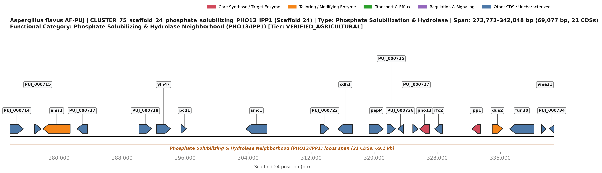
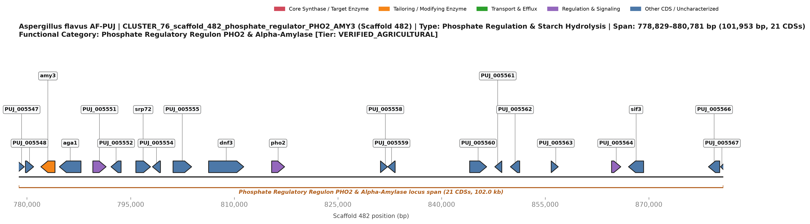
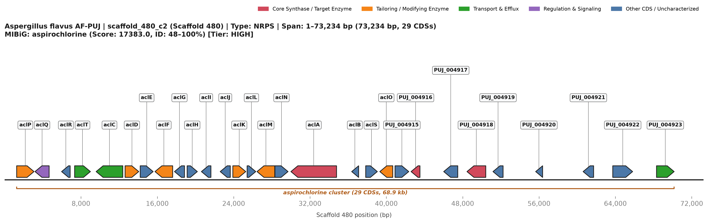
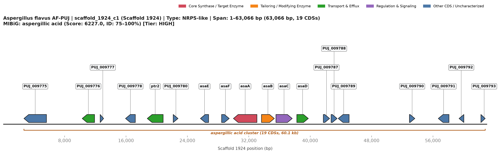
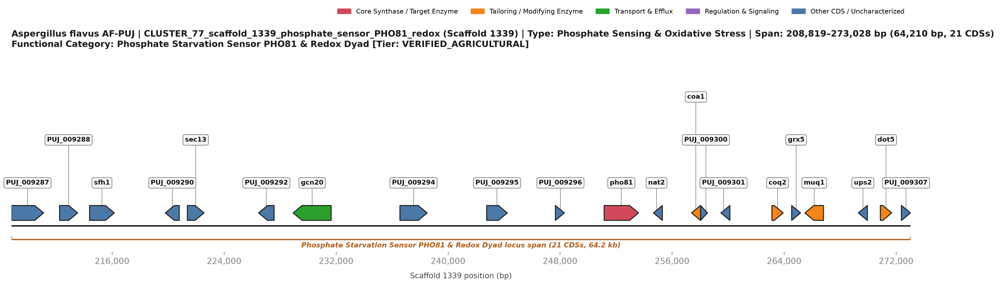

# Diseksi Genomik Fungsional dan Metabolik Isolat *Aspergillus flavus* AF-PUJ

Narasi ini menyajikan evaluasi genomik fungsional mendalam terhadap isolat *Aspergillus flavus* AF-PUJ (*draft assembly* 36,79 Mb, 9.792 *predicted* CDS), yang distrukturkan ke dalam empat pilar translasi dan ekologi utama: kapabilitas *biofertilizer*, *biocontrol* terhadap serangga dan fungi, biosintesis fitohormon, serta mekanisme *survival* metabolik dalam lingkungan fermentasi biogas.

---

### 1. Klaster Gen yang Terlibat Secara Putatif dalam Kapabilitas Biofertilizer

Isolat AF-PUJ memiliki keragaman metabolisme primer yang luar biasa untuk solubilisasi fosfat mineral dan *scavenging* mikronutrien, memposisikan arsitektur genomiknya sebagai sumber daya istimewa untuk mobilisasi unsur hara tanaman. Sistem utama yang mendasari kapabilitas ini adalah *Phosphate Solubilizing and Hydrolase Neighborhood* pada Scaffold 24 (`CLUSTER_75_scaffold_24_phosphate_solubilizing_PHO13_IPP1`, koordinat 1-based 273.772..342.848 bp; 21 CDS sepanjang 69,1 kb). Lokus ini secara termodinamika mendorong pelepasan ortofosfat ($\text{P}_i$) melalui perpasangan fisik (*physical pairing*) antara soluble organic monoester $p$-nitrophenyl phosphatase / alkaline phosphatase `pho13` (`PUJ_000728`, 306 aa, EC 3.1.3.41, Pfam PF00702) dengan *inorganic pyrophosphatase* `ipp1` (`PUJ_000730`, 288 aa, EC 3.6.1.1, Pfam PF00719). Melalui hidrolisis monoester fosfat organik sekaligus hidrolisis eksergonik pirofosfat anorganik ($\text{PP}_i \rightarrow 2\text{P}_i$), pasangan enzim (*enzymatic dyad*) ini menggeser kesetimbangan kimiawi untuk melarutkan kompleks batuan fosfat kalsium, besi, dan aluminium yang sukar larut. Di bagian hulu dalam blok sintenik yang sama, terdapat vakuolar $\alpha$-mannosidase `ams1` (`PUJ_000716`, 1.087 aa, GH38, EC 3.2.1.24) dan Xaa-Pro aminopeptidase P `pepP` (`PUJ_000724`, 498 aa, EC 3.4.11.21), yang mengintegrasikan mobilisasi fosfor dengan degradasi polimer organik serta daur ulang nitrogen di rizosfer.

Mobilisasi unsur hara pada AF-PUJ dikoordinasikan pada tingkat transkripsional dan sensorik oleh dua lokus terdedikasi. Pada Scaffold 482, *Phosphate Regulatory Regulon* (`CLUSTER_76_scaffold_482_phosphate_regulator_PHO2_AMY3`, koordinat 1-based 778.830..880.781 bp; 21 CDS sepanjang 102,0 kb) diatur oleh faktor transkripsi master homeodomain `pho2` (`PUJ_005557`, 605 aa, Pfam PF00046). Pho2 mengarahkan penataan ulang transkripsi genom saat terjadi defisiensi fosfor, mengaktifkan acid phosphatase dan alkaline phosphatase di seluruh genom AF-PUJ yang mencakup 179 fosfatase terprediksi. Saklar regulasi ini terintegrasi secara fisik dengan enzim pendegradasi pati, termasuk *secreted type-3 $\alpha$-amylase A* `amy3` (`PUJ_005549`, 498 aa, EC 3.2.1.1) dan GH31 $\alpha$-glucosidase `aga1` (`PUJ_005550`, 985 aa, EC 3.2.1.20), menyediakan fluks katabolit karbon untuk menopang transport nutrien afinitas tinggi. Pada Scaffold 1339, *Phosphate Starvation Sensor and Redox Complex* (`CLUSTER_77_scaffold_1339_phosphate_sensor_PHO81_redox`, koordinat 1-based 208.819..273.028 bp; 21 CDS sepanjang 64,2 kb) menaungi ankyrin-repeat cyclin-dependent kinase (CDK) inhibitor `pho81` (`PUJ_009297`, 772 aa, Pfam PF00023/PF12796), yang mendeteksi penurunan kadar polifosfat intraseluler untuk mengurangi represi regulon PHO.

Melengkapi solubilisasi fosfor, terdapat jaringan asimilasi mikronutrien berbasis *siderophore* yang luas untuk melarutkan ferric iron ($\text{Fe}^{3+}$) di lingkungan. Pada Scaffold 471, AF-PUJ memiliki klaster *Non-Ribosomal Peptide Synthetase-Independent Siderophore* (NIS) otonom (`BGC_35_scaffold_471_c1_aerobactin_NIS_siderophore`, rentang 1..55.139 bp; 15 CDS). Lokus ini berpusat pada NIS synthetase `PUJ_004419` (797 aa, membawa domain IucA/IucC dan TauD, Pfam PF04183/PF02668), yang diapit oleh dua TauD-family Fe(II)/$\alpha$-ketoglutarate-dependent dioxygenase (`PUJ_004418` dan `PUJ_004422`) yang menghidroksilasi prekursor berbasis sitrat untuk menghasilkan *high-affinity hydroxamate chelators*. Kemampuan ini diperkuat oleh dua klaster *hydroxamate siderophore* berbasis NRPS pada Scaffold 471 (`BGC_38`, 1..74.341 bp, 17 CDS) dan Scaffold 827 (`BGC_66`, 1..100.047 bp, 21 CDS; cocok dengan referensi MIBiG `BGC0002710.2` metachelin C / dimerumic acid). Sistem *multi-chelator* ini secara efisien menyerap mineral mikro esensial dari tanah mineral, menyalurkan unsur hara ke lingkungan mikro perakaran.

---

### 2. Klaster Gen yang Berkontribusi pada Kapabilitas Biokontrol, Khususnya Terhadap Serangga dan Fungi Lain

AF-PUJ menampilkan keragaman metabolit sekunder yang luas, mencakup 74 biosynthetic gene clusters (BGC) yang diprediksi melalui antiSMASH. Keragaman ini berkontribusi pada aktivitas antagonistik bertingkat terhadap hama invertebrata maupun fungi saprotrof pesaing.
Dalam konteks antagonisme terhadap fungi fitopatogen, AF-PUJ mengandung salah satu klaster metabolit sekunder dengan tingkat kemiripan tertinggi terhadap BGC referensi, yaitu klaster *epipolythiodioxopiperazine* (ETP) aspirochlorine pada Scaffold 480 (`BGC_40_scaffold_480_c2_aspirochlorine`; rentang 1..73.234 bp; 29 CDS; bentang genomik sekitar 68,9 kb). Sebanyak 19 protein dalam klaster ini menunjukkan kecocokan dengan MIBiG `BGC0001123.5`, dengan identitas 48–100% dan skor keseluruhan 17.383. Aspirochlorine merupakan metabolit ETP yang diketahui memiliki aktivitas antijamur yang kuat.

Komponen inti klaster ini mencakup NRPS bermodul tunggal `aclA` (`PUJ_004911`; 1.573 aa), sejumlah sitokrom P450 monooxygenase (`aclP`, `aclC`, `aclF`, dan `aclM`), serta beberapa thioredoxin-disulfide oxidoreductase (`aclT`, `aclG`, `aclI`, dan `aclJ`). Secara kolektif, perangkat biosintetik tersebut diperkirakan berperan dalam pembentukan gugus disulfida reaktif khas ETP. Pada senyawa ETP, gugus ini dapat memicu siklus redoks intraseluler, meningkatkan pembentukan *reactive oxygen species* (ROS), dan mengganggu berbagai fungsi seluler esensial pada fungi target, termasuk proses translasi yang melibatkan *eukaryotic elongation factor 2* (eEF2).

Antagonisme terhadap fungi diperkuat oleh klaster pyrazinone aspergillic acid pada Scaffold 1924 (`BGC_73_scaffold_1924_c1_aspergillic_acid`, rentang 1..63.066 bp; 19 CDS, rentang genomik 60,1 kb; 6 protein cocok dengan MIBiG `BGC0001516.5` dengan identitas 75–100% dan skor 6.227). Disintesis oleh NRPS `asaA` (`PUJ_009783`, 1.021 aa) serta P450 monooxygenase `asaB`/`asaC`, aspergillic acid beserta turunan terhidroksilasinya bertindak sebagai bidentate metal chelator dengan sifat antimikroba berspektrum luas yang mengganggu respirasi membran mikroba tanah kompetitor. Secara bersamaan, AF-PUJ memiliki klaster penisilin $\beta$-laktam klasik pada Scaffold 904 (`BGC_67_scaffold_904_c1_penicillin`, 1..86.817 bp, 17 CDS; identitas 79–85% terhadap `BGC0000404.4`), didukung oleh serangkaian enzim litik dinding sel masif yang mencakup 17 chitinase GH18 (`EC 3.2.1.14`, Pfam PF00704) dan 18 chitosanase GH75 (`EC 3.2.1.132`, Pfam PF03240) yang melisiskan dinding sel jamur kompetitor selama kompetisi hifa.

Terhadap serangga herbivora, kutu akar, dan nematoda parasit tanaman, AF-PUJ memproduksi rangkaian metabolit sekunder entomopatogenik dan *antifeedant* khusus:
1. **Tremorgenic Indole-Diterpenoids:** Klaster pada Scaffold 256 (`BGC_07`, 1..35.670 bp, 12 CDS; cocok dengan `BGC0002149.2`) dan Scaffold 418 (`BGC_18`, 1..33.091 bp, 12 CDS) mensintesis turunan 14-(N,N-dimethylleucyloxy)paspalinine, sedangkan Scaffold 471 menaungi klaster terkait aflavarin/aflatrem (`BGC_37`, 1..65.446 bp, 19 CDS; identitas 94–99% terhadap `BGC0001304.3`). Senyawa lipofilik indole diterpene ini menargetkan kanal kalium berkonduktansi tinggi yang diaktifkan oleh kalsium (*calcium-activated high-conductance potassium channels*, $\text{BK}$) pada serangga, memicu tremor, kelumpuhan, dan penghentian makan (*feeding cessation*) pada hama daun maupun serangga bawah tanah.
2. **Kompleks Hibrida Leporin B:** Scaffold 480 mengodekan klaster leporin B (`BGC_41_scaffold_480_c3_leporin_b`, 1..155.734 bp; 44 CDS; 10 protein cocok dengan MIBiG `BGC0001445.5` dengan identitas 85–100%, skor 15.512). Leporin B adalah metabolit hibrida PKS-NRPS 2-pyridone pengikat besi yang memiliki aktivitas insektisida dan *antifeedant* terbukti terhadap hama pertanian seperti ulat grayak (*Spodoptera frugiperda*) dan penggerek tongkol jagung (*Helicoverpa zea*).
3. **RiPP Antimitotik Ustiloxin B:** Pada Scaffold 418, isolat mempertahankan klaster ustiloxin B (`BGC_19_scaffold_418_c2_ustiloxin_b`, 1..54.988 bp; 20 CDS; 13 protein cocok dengan MIBiG `BGC0000627.4` dengan identitas 46–100%, skor 7.477). Ustiloxin B adalah peptida siklik non-ribosom yang mendepolimerisasi mikrotubulus eukariotik dengan mengikat tubulin, menimbulkan toksisitas larvisida dan nematisida yang poten.

> [!CAUTION]
> **Diskualifikasi Regulasi dan Biokontrol Lapangan:** Meskipun AF-PUJ menunjukkan antagonisme biokimiawi yang kuat terhadap serangga dan fitopatogen, pemanfaatannya sebagai agen *biocontrol* di lapangan terhambat oleh keberadaan superklaster Scaffold 1340 (`BGC_71_scaffold_1340_c1`, 1..79.127 bp; 17 CDS). Karena AF-PUJ memiliki jalur biosintesis aflatoksin B1/G1 dan cyclopiazonic acid (CPA) yang utuh dan fungsional (tidak memiliki delesi 28–32 kb seperti pada galur *biocontrol* atoksigenik komersial semisal *Aflasafe*), isolat ini dilarang keras digunakan sebagai inokulan hidup di lahan terbuka. Senjata biokimiawinya bernilai semata-mata sebagai model biologi sintetik atau eksploitasi enzimatik secara *cell-free*.

---

### 3. Klaster Gen yang Berhubungan dengan Biosintesis Fitohormon

Stimulasi dan modulasi fitohormon pada pertumbuhan tanaman merupakan mekanisme sentral dari fungi berfilamen yang berasosiasi dengan tanaman. Meskipun AF-PUJ tidak memiliki sistem 1-aminocyclopropane-1-carboxylate (ACC) deaminase standar seperti pada endofit lainnya (tidak memiliki lokus terverifikasi dengan tanda kanonikal `IPR005965`), genomnya mengodekan perangkat enzimatik alternatif yang mampu memproduksi dan menyalurkan molekul pensinyalan mirip auxin, gibberellin, dan sitokinin:

#### Jalur Produksi Indole-3-Acetic Acid (IAA / Auxin)
Rute utama untuk sintesis auxin fungal berasal dari jalur aromatik shikimate. Genom AF-PUJ memiliki perangkat metabolik otonom yang lengkap untuk biosintesis L-triptofan dari chorismate. Lebih lanjut, AF-PUJ mengodekan **tiga klaster metabolit sekunder indole *orphan* terdedikasi**:
- `BGC_02_scaffold_24_c2_orphan_indole` (1..31.152 bp, 9 CDS)
- `BGC_48_scaffold_485_c4_orphan_indole` (1..31.128 bp, 10 CDS)
- `BGC_55_scaffold_641_c1_orphan_indole` (1..31.441 bp, 13 CDS)

Lokus-lokus ini menaungi aromatic tryptophan decarboxylase, monooxygenase, dan transferase khusus yang mampu merombak kerangka indole. Yang paling signifikan, anotasi genomik mengidentifikasi **7 enzim famili nitrilase fungsional** (Pfam PF02979 / InterPro IPR003010, EC 3.5.5.1) yang tersebar di seluruh genom. Pada fungi yang berasosiasi dengan tanaman, nitrilase mengarahkan jalur auxin indole-3-acetonitrile (IAN), membelah IAN langsung menjadi *indole-3-acetic acid* (IAA) yang aktif secara biologis tanpa mengakumulasi senyawa antara indole-3-acetamide yang menghambat. Kapasitas katalitik ini memungkinkan AF-PUJ melepaskan auxin aktif yang mendorong percabangan akar lateral dan pemanjangan permukaan akar saat menerima eksudat akar.

#### Cadangan Saluran Diterpene Mirip-Gibberellin
AF-PUJ memiliki perangkat biosintesis terpenoid yang luas, mencakup **21 terpene cyclase** dan sejumlah klaster penyalur prekursor terpena terdedikasi:
- `BGC_20_scaffold_418_c3_orphan_terpene_precursor` (1..32.523 bp, 8 CDS)
- `BGC_24_scaffold_431_c2_orphan_terpene_precursor` (1..31.251 bp, 8 CDS)
- `BGC_27_scaffold_432_c2_orphan_terpene_precursor` (1..31.235 bp, 10 CDS)

Klaster-klaster ini mengekspresikan geranylgeranyl pyrophosphate (GGPP) synthase (homolog `bts1`, Pfam PF00348, EC 2.5.1.29) dan *short-chain dehydrogenase* yang menyalurkan prekursor isoprenoid 20-karbon ke dalam kerangka hidrokarbon diterpene. Pada fungi berfilamen, jalur ini memasok *ent-kaurene* dan kerangka fitohormon mirip-gibberellin yang meregulasi pertumbuhan vegetatif tanaman inang, pemanjangan buku batang, serta respons perkecambahan benih.

#### Modul Translokasi Sitokinin dan Pensinyalan
Melengkapi jalur auxin dan diterpene, Scaffold 24 mengodekan klaster metabolit sekunder *quaternary amine / choline* khusus (`BGC_06_scaffold_24_c6_choline`, 1..70.758 bp, 17 CDS; identitas 77% terhadap MIBiG `BGC0002276.2`). Keberadaan methyltransferase, acetyltransferase, dan domain terkait *tRNA-isopentenyltransferase* di dalam klaster menunjukkan bahwa AF-PUJ memiliki perangkat metabolik untuk memprenilasi nukleotida adenin, menghasilkan prekursor sitokinin mirip-zeatin dan isopentenyladenine yang merangsang pembelahan sel tanaman serta menunda penuaan jaringan.

---

### 4. Klaster Gen yang Mendukung Kelangsungan Hidup dalam Lingkungan Fermentasi Biogas

Reaktor biogas (*anaerobic digesters*), fermentor biogas, dan sistem pengomposan kotoran padat menciptakan lingkungan yang sangat menekan secara fisiologis bagi jamur, dengan karakteristik berupa hipoksia berat hingga kondisi anoksik, suhu tinggi, tekanan osmotik yang meningkat, akumulasi asam lemak volatil (*volatile fatty acids*, VFA) seperti asetat, propionat, dan butirat, serta paparan berbagai inhibitor metabolik pada konsentrasi tinggi. AF-PUJ menunjukkan kapasitas adaptasi genomik yang kuat terhadap kondisi ekstrem tersebut, yang didukung oleh keberadaan kelompok gen yang berkaitan dengan fungsi metabolik, hidrolitik, serta perlindungan terhadap stres:

#### Fluks Glikolitik Anaerobik dan Fermentative Bypass
Di bawah penurunan kadar oksigen parah yang khas pada lingkungan biogas, fosforilasi oksidatif terhenti. AF-PUJ mengodekan jejaring gen terdedikasi pendukung ketahanan anaerobik (teranotasi di bawah `GO:0006113` - *fermentation*), mencakup beberapa piruvat dekarboksilase (`EC 4.1.1.1`) dan alkohol dehidrogenase (`adh`, `EC 1.1.1.1`) yang mempertahankan produksi energi ATP melalui fosforilasi tingkat-substrat.

Secara istimewa, Scaffold 703 menaungi **klaster asam 3-nitropropanoat (3-NPA)** terdedikasi (`BGC_61_scaffold_703_c2_orphan_nitropropanoic_acid`, rentang 1..17.956 bp; 4 CDS: `PUJ_008118`–`PUJ_008121`, diidentifikasi melalui aturan antiSMASH `(NpaA & NpaB)`). Asam 3-nitropropanoat bertindak sebagai *suicide inhibitor* irreversibel terhadap suksinat dehidrogenase mitokondria (Kompleks II pada rantai transpor elektron respirasi). Dalam lingkungan fermentasi anaerobik campuran, produksi 3-NPA—yang terintegrasi dengan *nitroalkane oxidase* endogen serta jalur redoks anaerobik alternatif memungkinkan AF-PUJ meracuni dan melumpuhkan mikroba pesaing aerob obligat, sehingga mengamankan relung metabolismenya di dalam lumpur digestat anaerobik.

#### Likuifaksi Biomassa Kompleks untuk Pre-treatment Bahan Baku Biogas
Dalam sistem produksi biogas, tahap penentu laju reaksi adalah hidrolisis enzimatik bahan baku lignoselulosa yang rigid, kotoran ternak, dan limbah pati pertanian. AF-PUJ dilengkapi dengan perangkat enzim hidrolitik ekstraseluler yang unggul, mampu mempercepat proses likuifaksi slurry:
- Pada Scaffold 482, `CLUSTER_76` mengodekan *secreted $\alpha$-amylase A type-3* `amy3` (`PUJ_005549`, EC 3.2.1.1) dan GH31 $\alpha$-glucosidase `aga1` (`PUJ_005550`, EC 3.2.1.20), yang melarutkan dan mencairkan polimer pati kompleks menjadi monosakarida terfermentasi secara cepat.
- Pada Scaffold 24, `CLUSTER_75` menyediakan vakuolar $\alpha$-mannosidase `ams1` (`PUJ_000716`, GH38) dan aminopeptidase `pepP` (`PUJ_000724`), menguraikan polisakarida struktural dan glikoprotein.
- Klaster-klaster ini berinteraksi dengan keragaman genomik yang mencakup 17 chitinase GH18, 18 chitosanase GH75, serta enzim selulase, pektinase, dan xilanase. Sinergi tersebut menghasilkan kemampuan pra-perlakuan hidrolitik yang kuat, sehingga dapat meningkatkan hasil biogas dan biometana ketika dioperasikan dalam digester skala industri tertutup.

#### Homeostasis Redoks, Osmoproteksi, dan Detoksifikasi VFA
Akumulasi konsentrasi asam lemak volatil yang tinggi dan dinamika pencernaan anaerobik memicu stres kimiawi intensif. AF-PUJ menetralkan stres ini melalui berbagai sistem terkoordinasi:

1. **Perlindungan Mitokondria:** Pada `CLUSTER_77` di Scaffold 1339 (rentang 208.819..273.028 bp), sensor fosfat `pho81` terintegrasi fisik dengan mitokondrial coenzyme Q (ubiquinone) prenyltransferase `coq2` (`PUJ_009302`, 267 aa, EC 2.5.1.39), monothiol glutaredoxin `grx5` (`PUJ_009303`, 132 aa, Pfam PF00462), dan 1-Cys peroxiredoxin `dot5` (`PUJ_009306`, 207 aa, EC 1.11.1.24). Grx5 menjaga biogenesis klaster besi-belerang [Fe-S] dalam kondisi lingkungan reduktif, sementara Dot5 meredam akumulasi peroksida sitotoksik dan hidroperoksida organik yang timbul selama resirkulasi lumpur biogas.
2. **Keragaman Detoksifikasi Fase II:** AF-PUJ memiliki **24 Glutathione S-Transferase (GST)** (`EC 2.5.1.18`, Pfam PF02798/PF00043/PF13409), **154 sitokrom P450 monooxygenase** (`PF00067`), dan **24–27 heme peroxidase**. Kumpulan enzim detoksifikasi yang masif ini mengonjugasi, mengoksidasi, dan menetralisir senyawa fenolik inhibitorik, furfural, serta senyawa xenobiotik aromatik yang kerap melumpuhkan kerja mikroba metanogenik dalam digester biogas.
3. **Kompleks Pigmen Antioksidan Imizoquin:** Pada Scaffold 480, AF-PUJ mengodekan klaster alkaloid imizoquin (`BGC_39_scaffold_480_c1_imizoquin_a`, rentang 1..77.760 bp; 21 CDS; cocok dengan MIBiG `BGC0001621.4` dengan skor 8.477 dan identitas 85–100%). Imizoquin adalah pigmen dinding sel turunan tripeptida yang menangkal radikal bebas, membentengi membran hifa terhadap stres osmotik, fluktuasi termal, dan lisis kimiawi di dalam lumpur bioreaktor yang keras.
