# Aspergillus flavus AF-PUJ: Comprehensive Gene Cluster Visualizations & Interactive Scientific Catalog

**Isolate:** *Aspergillus flavus* **AF-PUJ**  
**Assembly & Annotation Metric:** 97 Scaffolds (36.79 Mb), 9,792 predicted CDSs (`Funannotate 1.8.17`)  
**Secondary Metabolism:** 74 antiSMASH 8.0.4 BGC regions across 27 scaffolds + 3 verified non-BGC agricultural functional gene neighborhoods (77 total clusters)  
**Visualization Engine:** `dna_features_viewer` / Biopython with Publication-Grade Revision V3 Formatting  
**Catalog Scope:** Complete gene qualifier tables, putative function elaborations, collective pathway architectures, biosafety scrutiny, and academic references.

---

## Executive Biosafety & Agricultural Evaluation

Unlike isolate **TA-PUJ** (*Trichoderma asperellum*), which is an environmentally benign biocontrol candidate devoid of human-toxic mycotoxins, isolate **AF-PUJ** (*Aspergillus flavus*) is a **fully toxigenic agricultural contaminant**. Genomic dissection reveals that AF-PUJ harbors intact, full-length gene clusters for multiple regulated mycotoxins:

- **Aflatoxins B1 & G1 + Cyclopiazonic Acid (Scaffold 1340):** 21 continuous loci across 79.1 kb (`AF:PUJ_009383`–`AF:PUJ_009403`) with 94–97% identity to MIBiG `BGC0000007.3`. Crucially, AF-PUJ lacks the 28–32 kb chromosomal deletion characteristic of commercial atoxigenic biocontrol strains (*Aflasafe*, NRRL 21882), proving that AF-PUJ possesses full genetic capacity for carcinogenic aflatoxin biosynthesis.
- **Aspergillic Acid (Scaffold 1924):** 6-gene NRPS cluster (`AF:PUJ_009781`–`AF:PUJ_009786`) with 95–100% identity to reference `BGC0001516.5`. Hydroxamic acid mycotoxin with acute hepatotoxicity.
- **Aspirochlorine (Scaffold 480):** 19-gene epipolythiodioxopiperazine (ETP) cluster (`BGC0001123.5`, score 17,383) conferring broad-spectrum toxicity.
- **Ustiloxin B (Scaffold 418):** 13-gene fungal RiPP mycotoxin cluster (`BGC0000627.4`, score 7,477) inhibiting eukaryotic microtubule assembly.

Concurrently, AF-PUJ harbors valuable **agricultural phosphate-solubilizing machinery** on Scaffold 24 (`PHO13`/`IPP1`), Scaffold 482 (`PHO2`/`AMY3`), and Scaffold 1339 (`PHO81`). However, due to its active aflatoxin and CPA cluster integrity, AF-PUJ is **categorically disqualified** from open agricultural application.

---

## Master Gene Cluster Quick-Navigation Inventory (77 Clusters)

| # | Cluster Identifier | Scaffold | Class / Product | Physical Span | CDS | Top MIBiG Hit | Homology / Score | Confidence Tier |
| :-: | :--- | :---: | :---: | :---: | :-: | :--- | :---: | :---: |
| 01 | [BGC_01_scaffold_24_c1_orphan_betalactone](#bgc-01-scaffold-24-c1-orphan-betalactone) | Scaffold 24 | Orphan betalactone | 1..45,805 (45.8 kb) | 13 | No MIBiG match | 0 hits | ORPHAN |
| 02 | [BGC_02_scaffold_24_c2_orphan_indole](#bgc-02-scaffold-24-c2-orphan-indole) | Scaffold 24 | Orphan indole | 1..31,152 (31.2 kb) | 9 | No MIBiG match | 0 hits | ORPHAN |
| 03 | [BGC_03_scaffold_24_c3_orphan_nrps](#bgc-03-scaffold-24-c3-orphan-nrps) | Scaffold 24 | Orphan NRPS | 1..66,363 (66.4 kb) | 18 | No MIBiG match | 0 hits | ORPHAN |
| 04 | [BGC_04_scaffold_24_c4_asparasone_a](#bgc-04-scaffold-24-c4-asparasone-a) | Scaffold 24 | **asparasone A** | 1..98,078 (98.1 kb) | 28 | `BGC0001446.5` (asparasone A) | 97–100% id (5,862.0) | **HIGH** |
| 05 | [BGC_05_scaffold_24_c5_orphan_t1pks](#bgc-05-scaffold-24-c5-orphan-t1pks) | Scaffold 24 | Orphan T1PKS | 1..68,097 (68.1 kb) | 17 | No MIBiG match | 0 hits | ORPHAN |
| 06 | [BGC_06_scaffold_24_c6_choline](#bgc-06-scaffold-24-c6-choline) | Scaffold 24 | **choline** | 1..70,758 (70.8 kb) | 17 | `BGC0002276.2` (choline) | 77–77% id (1,941.0) | **MEDIUM** |
| 07 | [BGC_07_scaffold_256_c1_14_n,n_dimethylleucyloxypaspalinine](#bgc-07-scaffold-256-c1-14-n,n-dimethylleucyloxypaspalinine) | Scaffold 256 | **14-(N,N-dimethylleucyloxy)paspalinine** | 1..35,670 (35.7 kb) | 12 | `BGC0002149.2` (14-(N,N-dimethylleucyloxy)paspalinine) | 62–72% id (1,482.0) | **MEDIUM** |
| 08 | [BGC_08_scaffold_256_c2_orphan_terpene](#bgc-08-scaffold-256-c2-orphan-terpene) | Scaffold 256 | Orphan terpene | 1..31,068 (31.1 kb) | 9 | No MIBiG match | 0 hits | ORPHAN |
| 09 | [BGC_09_scaffold_256_c3_heptelidic_acid](#bgc-09-scaffold-256-c3-heptelidic-acid) | Scaffold 256 | **heptelidic acid** | 1..63,562 (63.6 kb) | 14 | `BGC0001995.3` (heptelidic acid) | 97–99% id (2,420.0) | **MEDIUM** |
| 10 | [BGC_10_scaffold_256_c4_orphan_nrps_like](#bgc-10-scaffold-256-c4-orphan-nrps-like) | Scaffold 256 | Orphan NRPS-like | 1..62,688 (62.7 kb) | 15 | No MIBiG match | 0 hits | ORPHAN |
| 11 | [BGC_11_scaffold_256_c5_orphan_terpene](#bgc-11-scaffold-256-c5-orphan-terpene) | Scaffold 256 | Orphan terpene | 1..31,631 (31.6 kb) | 12 | No MIBiG match | 0 hits | ORPHAN |
| 12 | [BGC_12_scaffold_256_c6_orphan_terpene](#bgc-12-scaffold-256-c6-orphan-terpene) | Scaffold 256 | Orphan terpene | 1..32,530 (32.5 kb) | 14 | No MIBiG match | 0 hits | ORPHAN |
| 13 | [BGC_13_scaffold_256_c7_aspercryptins](#bgc-13-scaffold-256-c7-aspercryptins) | Scaffold 256 | **aspercryptins** | 1..94,533 (94.5 kb) | 22 | `BGC0001515.4` (aspercryptins) | 47–67% id (1,800.0) | **MEDIUM** |
| 14 | [BGC_14_scaffold_258_c1_orphan_t1pks](#bgc-14-scaffold-258-c1-orphan-t1pks) | Scaffold 258 | Orphan T1PKS | 1..67,340 (67.3 kb) | 16 | No MIBiG match | 0 hits | ORPHAN |
| 15 | [BGC_15_scaffold_258_c2_orphan_t1pks](#bgc-15-scaffold-258-c2-orphan-t1pks) | Scaffold 258 | Orphan T1PKS | 1..68,435 (68.4 kb) | 21 | No MIBiG match | 0 hits | ORPHAN |
| 16 | [BGC_16_scaffold_258_c3_flavunoidine](#bgc-16-scaffold-258-c3-flavunoidine) | Scaffold 258 | **flavunoidine** | 1..63,216 (63.2 kb) | 19 | `BGC0002248.3` (flavunoidine) | 93–100% id (7,818.0) | **HIGH** |
| 17 | [BGC_17_scaffold_258_c4_astellolide_a](#bgc-17-scaffold-258-c4-astellolide-a) | Scaffold 258 | **astellolide A** | 1..68,868 (68.9 kb) | 20 | `BGC0001518.3` (astellolide A) | 97–99% id (8,724.0) | **HIGH** |
| 18 | [BGC_18_scaffold_418_c1_14_n,n_dimethylleucyloxypaspalinine](#bgc-18-scaffold-418-c1-14-n,n-dimethylleucyloxypaspalinine) | Scaffold 418 | **14-(N,N-dimethylleucyloxy)paspalinine** | 1..33,091 (33.1 kb) | 12 | `BGC0002149.2` (14-(N,N-dimethylleucyloxy)paspalinine) | 52–67% id (1,274.0) | **MEDIUM** |
| 19 | [BGC_19_scaffold_418_c2_ustiloxin_b](#bgc-19-scaffold-418-c2-ustiloxin-b) | Scaffold 418 | **ustiloxin B** | 1..54,988 (55.0 kb) | 20 | `BGC0000627.4` (ustiloxin B) | 46–100% id (7,477.0) | **HIGH** |
| 20 | [BGC_20_scaffold_418_c3_orphan_terpene_precursor](#bgc-20-scaffold-418-c3-orphan-terpene-precursor) | Scaffold 418 | Orphan terpene-precursor | 1..32,523 (32.5 kb) | 8 | No MIBiG match | 0 hits | ORPHAN |
| 21 | [BGC_21_scaffold_418_c4_orphan_nrps](#bgc-21-scaffold-418-c4-orphan-nrps) | Scaffold 418 | Orphan NRPS | 1..65,039 (65.0 kb) | 15 | No MIBiG match | 0 hits | ORPHAN |
| 22 | [BGC_22_scaffold_418_c5_orphan_t3pks](#bgc-22-scaffold-418-c5-orphan-t3pks) | Scaffold 418 | Orphan T3PKS | 1..61,324 (61.3 kb) | 17 | No MIBiG match | 0 hits | ORPHAN |
| 23 | [BGC_23_scaffold_431_c1_fusaric_acid](#bgc-23-scaffold-431-c1-fusaric-acid) | Scaffold 431 | **fusaric acid** | 1..68,253 (68.3 kb) | 23 | `BGC0001190.3` (fusaric acid) | 62–72% id (829.0) | **MEDIUM** |
| 24 | [BGC_24_scaffold_431_c2_orphan_terpene_precursor](#bgc-24-scaffold-431-c2-orphan-terpene-precursor) | Scaffold 431 | Orphan terpene-precursor | 1..31,251 (31.3 kb) | 8 | No MIBiG match | 0 hits | ORPHAN |
| 25 | [BGC_25_scaffold_431_c3_zopfiellin](#bgc-25-scaffold-431-c3-zopfiellin) | Scaffold 431 | **zopfiellin** | 1..117,487 (117.5 kb) | 34 | `BGC0002222.2` (zopfiellin) | 54–55% id (528.0) | **MEDIUM** |
| 26 | [BGC_26_scaffold_432_c1_orphan_nrps_like](#bgc-26-scaffold-432-c1-orphan-nrps-like) | Scaffold 432 | Orphan NRPS-like | 1..63,354 (63.4 kb) | 20 | No MIBiG match | 0 hits | ORPHAN |
| 27 | [BGC_27_scaffold_432_c2_orphan_terpene_precursor](#bgc-27-scaffold-432-c2-orphan-terpene-precursor) | Scaffold 432 | Orphan terpene-precursor | 1..31,235 (31.2 kb) | 10 | No MIBiG match | 0 hits | ORPHAN |
| 28 | [BGC_28_scaffold_432_c3_orphan_terpene](#bgc-28-scaffold-432-c3-orphan-terpene) | Scaffold 432 | Orphan terpene | 1..31,385 (31.4 kb) | 10 | No MIBiG match | 0 hits | ORPHAN |
| 29 | [BGC_29_scaffold_433_c1_8_methyldiaporthin](#bgc-29-scaffold-433-c1-8-methyldiaporthin) | Scaffold 433 | **8-methyldiaporthin** | 1..60,417 (60.4 kb) | 17 | `BGC0002236.2` (8-methyldiaporthin) | 88–100% id (5,042.0) | **MEDIUM** |
| 30 | [BGC_30_scaffold_433_c2_ankaflavin](#bgc-30-scaffold-433-c2-ankaflavin) | Scaffold 433 | **ankaflavin** | 1..67,764 (67.8 kb) | 13 | `BGC0000027.4` (ankaflavin) | 46–51% id (6,652.0) | **MEDIUM** |
| 31 | [BGC_31_scaffold_433_c3_orphan_terpene](#bgc-31-scaffold-433-c3-orphan-terpene) | Scaffold 433 | Orphan terpene | 1..31,610 (31.6 kb) | 7 | No MIBiG match | 0 hits | ORPHAN |
| 32 | [BGC_32_scaffold_433_c4_orphan_nrps_like](#bgc-32-scaffold-433-c4-orphan-nrps-like) | Scaffold 433 | Orphan NRPS-like | 1..63,304 (63.3 kb) | 17 | No MIBiG match | 0 hits | ORPHAN |
| 33 | [BGC_33_scaffold_433_c5_orphan_t1pks](#bgc-33-scaffold-433-c5-orphan-t1pks) | Scaffold 433 | Orphan T1PKS | 1..119,655 (119.7 kb) | 33 | No MIBiG match | 0 hits | ORPHAN |
| 34 | [BGC_34_scaffold_433_c6_orphan_nrps_like](#bgc-34-scaffold-433-c6-orphan-nrps-like) | Scaffold 433 | Orphan NRPS-like | 1..63,227 (63.2 kb) | 15 | No MIBiG match | 0 hits | ORPHAN |
| 35 | [BGC_35_scaffold_471_c1_aerobactin_NIS_siderophore](#bgc-35-scaffold-471-c1-aerobactin-nis-siderophore) | Scaffold 471 | **Aerobactin-like NIS Siderophore** | 1..55,139 (55.1 kb) | 15 | Domain prediction (`IucA/IucC`) | NIS Synthase (`PUJ_004419`) | **VERIFIED** |
| 36 | [BGC_36_scaffold_471_c2_orphan_terpene](#bgc-36-scaffold-471-c2-orphan-terpene) | Scaffold 471 | Orphan terpene | 1..30,462 (30.5 kb) | 7 | No MIBiG match | 0 hits | ORPHAN |
| 37 | [BGC_37_scaffold_471_c3_aflavarin](#bgc-37-scaffold-471-c3-aflavarin) | Scaffold 471 | **aflavarin** | 1..65,446 (65.4 kb) | 19 | `BGC0001304.3` (aflavarin) | 94–99% id (5,687.0) | **MEDIUM** |
| 38 | [BGC_38_scaffold_471_c4_metachelin_c](#bgc-38-scaffold-471-c4-metachelin-c) | Scaffold 471 | **metachelin C** | 1..74,341 (74.3 kb) | 17 | `BGC0002710.2` (metachelin C) | 46–59% id (1,052.0) | **MEDIUM** |
| 39 | [BGC_39_scaffold_480_c1_imizoquin_a](#bgc-39-scaffold-480-c1-imizoquin-a) | Scaffold 480 | **imizoquin A** | 1..77,760 (77.8 kb) | 21 | `BGC0001621.4` (imizoquin A) | 85–100% id (8,477.0) | **HIGH** |
| 40 | [BGC_40_scaffold_480_c2_aspirochlorine](#bgc-40-scaffold-480-c2-aspirochlorine) | Scaffold 480 | **aspirochlorine** | 1..73,234 (73.2 kb) | 29 | `BGC0001123.5` (aspirochlorine) | 48–100% id (17,383.0) | **HIGH** |
| 41 | [BGC_41_scaffold_480_c3_leporin_b](#bgc-41-scaffold-480-c3-leporin-b) | Scaffold 480 | **leporin B** | 1..155,734 (155.7 kb) | 44 | `BGC0001445.5` (leporin B) | 85–100% id (15,512.0) | **HIGH** |
| 42 | [BGC_42_scaffold_480_c4_orphan_terpene](#bgc-42-scaffold-480-c4-orphan-terpene) | Scaffold 480 | Orphan terpene | 1..30,836 (30.8 kb) | 9 | No MIBiG match | 0 hits | ORPHAN |
| 43 | [BGC_43_scaffold_480_c5_nidulanin_a](#bgc-43-scaffold-480-c5-nidulanin-a) | Scaffold 480 | **nidulanin A** | 1..75,407 (75.4 kb) | 16 | `BGC0001699.4` (nidulanin A) | 47–80% id (7,357.0) | **MEDIUM** |
| 44 | [BGC_44_scaffold_482_c1_orphan_nrps_like](#bgc-44-scaffold-482-c1-orphan-nrps-like) | Scaffold 482 | Orphan NRPS-like | 1..63,036 (63.0 kb) | 19 | No MIBiG match | 0 hits | ORPHAN |
| 45 | [BGC_45_scaffold_485_c1_clavaric_acid](#bgc-45-scaffold-485-c1-clavaric-acid) | Scaffold 485 | **clavaric acid** | 1..140,412 (140.4 kb) | 36 | `BGC0001248.3` (clavaric acid) | 48–48% id (704.0) | **LOW** |
| 46 | [BGC_46_scaffold_485_c2_actinopolymorphol_c](#bgc-46-scaffold-485-c2-actinopolymorphol-c) | Scaffold 485 | **actinopolymorphol C** | 1..63,129 (63.1 kb) | 14 | `BGC0002167.2` (actinopolymorphol C) | 99–100% id (6,338.0) | **HIGH** |
| 47 | [BGC_47_scaffold_485_c3_orphan_nrps](#bgc-47-scaffold-485-c3-orphan-nrps) | Scaffold 485 | Orphan NRPS | 1..71,964 (72.0 kb) | 21 | No MIBiG match | 0 hits | ORPHAN |
| 48 | [BGC_48_scaffold_485_c4_orphan_indole](#bgc-48-scaffold-485-c4-orphan-indole) | Scaffold 485 | Orphan indole | 1..31,128 (31.1 kb) | 10 | No MIBiG match | 0 hits | ORPHAN |
| 49 | [BGC_49_scaffold_486_c1_orphan_nrps_like](#bgc-49-scaffold-486-c1-orphan-nrps-like) | Scaffold 486 | Orphan NRPS-like | 1..110,461 (110.5 kb) | 25 | No MIBiG match | 0 hits | ORPHAN |
| 50 | [BGC_50_scaffold_486_c2_ankaflavin](#bgc-50-scaffold-486-c2-ankaflavin) | Scaffold 486 | **ankaflavin** | 1..67,427 (67.4 kb) | 17 | `BGC0000027.4` (ankaflavin) | 47–51% id (2,440.0) | **MEDIUM** |
| 51 | [BGC_51_scaffold_486_c3_orphan_t1pks](#bgc-51-scaffold-486-c3-orphan-t1pks) | Scaffold 486 | Orphan T1PKS | 1..61,151 (61.2 kb) | 10 | No MIBiG match | 0 hits | ORPHAN |
| 52 | [BGC_52_scaffold_497_c1_orphan_terpene](#bgc-52-scaffold-497-c1-orphan-terpene) | Scaffold 497 | Orphan terpene | 1..32,296 (32.3 kb) | 9 | No MIBiG match | 0 hits | ORPHAN |
| 53 | [BGC_53_scaffold_614_c1_orphan_terpene](#bgc-53-scaffold-614-c1-orphan-terpene) | Scaffold 614 | Orphan terpene | 1..34,444 (34.4 kb) | 6 | No MIBiG match | 0 hits | ORPHAN |
| 54 | [BGC_54_scaffold_614_c2_2,4_dihydroxy_3_methoxypropiophenone](#bgc-54-scaffold-614-c2-2,4-dihydroxy-3-methoxypropiophenone) | Scaffold 614 | **2,4'-dihydroxy-3'-methoxypropiophenone** | 1..67,290 (67.3 kb) | 23 | `BGC0002238.3` (2,4'-dihydroxy-3'-methoxypropiophenone) | 97–100% id (5,797.0) | **MEDIUM** |
| 55 | [BGC_55_scaffold_641_c1_orphan_indole](#bgc-55-scaffold-641-c1-orphan-indole) | Scaffold 641 | Orphan indole | 1..31,441 (31.4 kb) | 13 | No MIBiG match | 0 hits | ORPHAN |
| 56 | [BGC_56_scaffold_641_c2_orphan_terpene](#bgc-56-scaffold-641-c2-orphan-terpene) | Scaffold 641 | Orphan terpene | 1..31,302 (31.3 kb) | 7 | No MIBiG match | 0 hits | ORPHAN |
| 57 | [BGC_57_scaffold_641_c3_azasperpyranone_a](#bgc-57-scaffold-641-c3-azasperpyranone-a) | Scaffold 641 | **azasperpyranone A** | 1..83,507 (83.5 kb) | 20 | `BGC0002267.2` (azasperpyranone A) | 47–49% id (2,809.0) | **MEDIUM** |
| 58 | [BGC_58_scaffold_702_c1_orphan_nrps](#bgc-58-scaffold-702-c1-orphan-nrps) | Scaffold 702 | Orphan NRPS | 1..76,569 (76.6 kb) | 16 | No MIBiG match | 0 hits | ORPHAN |
| 59 | [BGC_59_scaffold_702_c2_orphan_nrps](#bgc-59-scaffold-702-c2-orphan-nrps) | Scaffold 702 | Orphan NRPS | 1..81,035 (81.0 kb) | 15 | No MIBiG match | 0 hits | ORPHAN |
| 60 | [BGC_60_scaffold_703_c1_dehydrocurvularin](#bgc-60-scaffold-703-c1-dehydrocurvularin) | Scaffold 703 | **dehydrocurvularin** | 1..86,011 (86.0 kb) | 24 | `BGC0000045.3` (dehydrocurvularin) | 47–54% id (1,043.0) | **MEDIUM** |
| 61 | [BGC_61_scaffold_703_c2_orphan_nitropropanoic_acid](#bgc-61-scaffold-703-c2-orphan-nitropropanoic-acid) | Scaffold 703 | Orphan nitropropanoic_acid | 1..17,956 (18.0 kb) | 4 | No MIBiG match | 0 hits | ORPHAN |
| 62 | [BGC_62_scaffold_815_c1_orphan_terpene](#bgc-62-scaffold-815-c1-orphan-terpene) | Scaffold 815 | Orphan terpene | 1..81,698 (81.7 kb) | 24 | No MIBiG match | 0 hits | ORPHAN |
| 63 | [BGC_63_scaffold_826_c1___ditryptophenaline](#bgc-63-scaffold-826-c1---ditryptophenaline) | Scaffold 826 | **(-)-ditryptophenaline** | 1..67,961 (68.0 kb) | 14 | `BGC0002157.2` ((-)-ditryptophenaline) | 91–99% id (6,216.0) | **MEDIUM** |
| 64 | [BGC_64_scaffold_826_c2_ywa1](#bgc-64-scaffold-826-c2-ywa1) | Scaffold 826 | **YWA1** | 1..66,651 (66.7 kb) | 17 | `BGC0002175.3` (YWA1) | 100–100% id (4,277.0) | **MEDIUM** |
| 65 | [BGC_65_scaffold_826_c3_clavaric_acid](#bgc-65-scaffold-826-c3-clavaric-acid) | Scaffold 826 | **clavaric acid** | 1..32,405 (32.4 kb) | 15 | `BGC0001248.3` (clavaric acid) | 51–51% id (744.0) | **MEDIUM** |
| 66 | [BGC_66_scaffold_827_c1_metachelin_c](#bgc-66-scaffold-827-c1-metachelin-c) | Scaffold 827 | **metachelin C** | 1..100,047 (100.0 kb) | 21 | `BGC0002710.2` (metachelin C) | 46–53% id (1,714.0) | **MEDIUM** |
| 67 | [BGC_67_scaffold_904_c1_penicillin](#bgc-67-scaffold-904-c1-penicillin) | Scaffold 904 | **penicillin** | 1..86,817 (86.8 kb) | 17 | `BGC0000404.4` (penicillin) | 79–85% id (6,518.0) | **MEDIUM** |
| 68 | [BGC_68_scaffold_904_c2_orphan_terpene](#bgc-68-scaffold-904-c2-orphan-terpene) | Scaffold 904 | Orphan terpene | 1..51,233 (51.2 kb) | 16 | No MIBiG match | 0 hits | ORPHAN |
| 69 | [BGC_69_scaffold_960_c1_6_methylsalicyclic_acid](#bgc-69-scaffold-960-c1-6-methylsalicyclic-acid) | Scaffold 960 | **6-methylsalicyclic acid** | 1..65,347 (65.3 kb) | 17 | `BGC0001276.3` (6-methylsalicyclic acid) | 60–60% id (2,075.0) | **MEDIUM** |
| 70 | [BGC_70_scaffold_1334_c1_orphan_nrps](#bgc-70-scaffold-1334-c1-orphan-nrps) | Scaffold 1334 | Orphan NRPS | 1..76,133 (76.1 kb) | 16 | No MIBiG match | 0 hits | ORPHAN |
| 71 | [BGC_71_scaffold_1340_c1_aflatoxin_CPA_supercluster](#bgc-71-scaffold-1340-c1-aflatoxin-cpa-supercluster) | Scaffold 1340 | **Aflatoxin / CPA Super-Cluster** | 1..79,127 (79.1 kb) | 17 | `BGC0000007.3` (Aflatoxin) + `BGC0000977.4` (CPA) | 94–97% id (Score 16,946) | **HIGH (TOXIC)** |
| 72 | [BGC_72_scaffold_1845_c1_dichlorodiaporthin](#bgc-72-scaffold-1845-c1-dichlorodiaporthin) | Scaffold 1845 | **dichlorodiaporthin** | 1..66,072 (66.1 kb) | 18 | `BGC0002237.3` (dichlorodiaporthin) | 96–100% id (6,738.0) | **HIGH** |
| 73 | [BGC_73_scaffold_1924_c1_aspergillic_acid](#bgc-73-scaffold-1924-c1-aspergillic-acid) | Scaffold 1924 | **aspergillic acid** | 1..63,066 (63.1 kb) | 19 | `BGC0001516.5` (aspergillic acid) | 75–100% id (6,227.0) | **HIGH** |
| 74 | [BGC_74_scaffold_2001_c1_orphan_t3pks](#bgc-74-scaffold-2001-c1-orphan-t3pks) | Scaffold 2001 | Orphan T3PKS | 1..35,116 (35.1 kb) | 8 | No MIBiG match | 0 hits | ORPHAN |
| 75 | [CLUSTER_75_scaffold_24_phosphate_solubilizing_PHO13_IPP1](#cluster-75-scaffold-24-phosphate-solubilizing-pho13-ipp1) | Scaffold 24 | **Phosphate Solubilizing & Hydrolase Neighborhood (PHO13/IPP1)** | 273,771..342,848 (69.1 kb) | 21 | Genomic Synteny / Neighborhood | Biochemical Validation | **VERIFIED_AGRICULTURAL** |
| 76 | [CLUSTER_76_scaffold_482_phosphate_regulator_PHO2_AMY3](#cluster-76-scaffold-482-phosphate-regulator-pho2-amy3) | Scaffold 482 | **Phosphate Regulatory Regulon PHO2 & Alpha-Amylase** | 778,829..880,781 (102.0 kb) | 21 | Genomic Synteny / Neighborhood | Biochemical Validation | **VERIFIED_AGRICULTURAL** |
| 77 | [CLUSTER_77_scaffold_1339_phosphate_sensor_PHO81_redox](#cluster-77-scaffold-1339-phosphate-sensor-pho81-redox) | Scaffold 1339 | **Phosphate Starvation Sensor PHO81 & Redox Dyad** | 208,818..273,028 (64.2 kb) | 21 | Genomic Synteny / Neighborhood | Biochemical Validation | **VERIFIED_AGRICULTURAL** |

---

## Detailed Gene Cluster Dissections

### 01. Novel Orphan BETALACTONE Biosynthetic Gene Cluster (`Scaffold 24`)

- **Cluster Identifier:** `BGC_01_scaffold_24_c1_orphan_betalactone` (`scaffold_24_c1`)  
- **Genomic Location:** Scaffold 24 | Span: 1–45,805 bp (45,805 bp, 13 CDSs)  
- **Pathway Class:** `betalactone` | **Confidence Tier:** `ORPHAN`  

[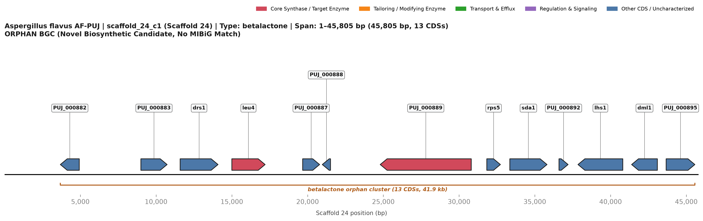](BGC_01_scaffold_24_c1_orphan_betalactone.svg)

> *Figure 01: Publication-grade gene cluster diagram of `BGC_01_scaffold_24_c1_orphan_betalactone` on Scaffold 24. Arrows indicate direction of transcription; boxes display standardized gene symbols or official locus tags. [Open scalable vector SVG](BGC_01_scaffold_24_c1_orphan_betalactone.svg).*

#### Gene Inventory & Structural Qualifiers

| Locus Tag | Gene Symbol | Strand | Physical Span | Length | Putative Product & EC Number | Pfam / Domain Signatures |
| :--- | :---: | :---: | :---: | :---: | :--- | :--- |
| `PUJ_000882` | `PUJ_000882` | `-` | 3,682..4,930 | 350 aa | hypothetical protein | — |
| `PUJ_000883` | `PUJ_000883` | `+` | 8,997..10,727 | 576 aa | hypothetical protein | PF00583 (Acetyltransferase (GNAT) family) |
| `PUJ_000884` | `drs1` | `+` | 11,589..14,088 | 813 aa | nucleolar DEAD-box protein required for synthesis of 60S ribosomal subunit (`EC 3.6.4.13`) | PF00270 (DEAD/DEAH box helicase), PF00271 (Helicase conserved C-terminal domain) |
| `PUJ_000885` | `leu4` | `+` | 15,001..17,196 | 644 aa | 2-isopropylmalate synthase (Alpha-isopropylmalate synthase) (Alpha-IPM synthetase) (`EC 2.3.3.13`) | PF00682 (HMGL-like), PF08502 (LeuA allosteric (dimerisation) domain) |
| `PUJ_000887` | `PUJ_000887` | `+` | 19,676..20,794 | 246 aa | hypothetical protein | PF13561 (Enoyl-(Acyl carrier protein) reductase) |
| `PUJ_000888` | `PUJ_000888` | `-` | 20,973..21,514 | 160 aa | hypothetical protein | — |
| `PUJ_000889` | `PUJ_000889` | `-` | 24,796..30,805 | 1867 aa | hypothetical protein | PF00501 (AMP-binding enzyme), PF00501 (AMP-binding enzyme), PF00501 (AMP-binding enzyme) |
| `PUJ_000890` | `rps5` | `+` | 31,831..32,728 | 214 aa | ribosomal protein S5 | PF00177 (Ribosomal protein S7p/S5e) |
| `PUJ_000891` | `sda1` | `+` | 33,350..35,804 | 753 aa | Severe Depolymerization of Actin | PF08158 (NUC130/3NT domain), PF05285 (SDA1) |
| `PUJ_000892` | `PUJ_000892` | `+` | 36,596..37,195 | 199 aa | hypothetical protein | PF08591 (Ribonucleotide reductase inhibitor) |
| `PUJ_000893` | `lhs1` | `-` | 37,850..40,807 | 985 aa | lumenal Hsp70 protein | PF00012 (Hsp70 protein) |
| `PUJ_000894` | `dml1` | `-` | 41,390..43,090 | 505 aa | mtDNA inheritance, partitioning of the mitochondrial organelle | PF14881 (Tubulin domain), PF10644 (Misato Segment II tubulin-like domain) |
| `PUJ_000895` | `PUJ_000895` | `+` | 43,669..45,564 | 631 aa | hypothetical protein | — |

#### Putative Function & Enzymatic Mechanisms

- **`PUJ_000882`:** Hypothetical protein. Hypothetical or accessory protein implicated in cluster function or localized metabolic support.
- **`PUJ_000883`:** Hypothetical protein. Contains PF00583 (Acetyltransferase (GNAT) family). Hypothetical or accessory protein implicated in cluster function or localized metabolic support.
- **`PUJ_000884` (`drs1`):** Nucleolar dead-box protein required for synthesis of 60s ribosomal subunit (EC 3.6.4.13). Contains PF00270 (DEAD/DEAH box helicase), PF00271 (Helicase conserved C-terminal domain). Hypothetical or accessory protein implicated in cluster function or localized metabolic support.
- **`PUJ_000885` (`leu4`):** 2-isopropylmalate synthase (alpha-isopropylmalate synthase) (alpha-ipm synthetase) (EC 2.3.3.13). Contains PF00682 (HMGL-like), PF08502 (LeuA allosteric (dimerisation) domain). Catalyzes core biosynthetic condensation or macrocyclization reactions in the pathway.
- **`PUJ_000887`:** Hypothetical protein. Contains PF13561 (Enoyl-(Acyl carrier protein) reductase). Hypothetical or accessory protein implicated in cluster function or localized metabolic support.
- **`PUJ_000888`:** Hypothetical protein. Hypothetical or accessory protein implicated in cluster function or localized metabolic support.
- **`PUJ_000889`:** Hypothetical protein. Contains PF00501 (AMP-binding enzyme), PF00501 (AMP-binding enzyme). Hypothetical or accessory protein implicated in cluster function or localized metabolic support.
- **`PUJ_000890` (`rps5`):** Ribosomal protein s5. Contains PF00177 (Ribosomal protein S7p/S5e). Hypothetical or accessory protein implicated in cluster function or localized metabolic support.
- **`PUJ_000891` (`sda1`):** Severe depolymerization of actin. Contains PF08158 (NUC130/3NT domain), PF05285 (SDA1). Hypothetical or accessory protein implicated in cluster function or localized metabolic support.
- **`PUJ_000892`:** Hypothetical protein. Contains PF08591 (Ribonucleotide reductase inhibitor). Hypothetical or accessory protein implicated in cluster function or localized metabolic support.
- **`PUJ_000893` (`lhs1`):** Lumenal hsp70 protein. Contains PF00012 (Hsp70 protein). Hypothetical or accessory protein implicated in cluster function or localized metabolic support.
- **`PUJ_000894` (`dml1`):** Mtdna inheritance, partitioning of the mitochondrial organelle. Contains PF14881 (Tubulin domain), PF10644 (Misato Segment II tubulin-like domain). Hypothetical or accessory protein implicated in cluster function or localized metabolic support.
- **`PUJ_000895`:** Hypothetical protein. Hypothetical or accessory protein implicated in cluster function or localized metabolic support.

### Collective Pathway Architecture & Biological Synergy

This cluster represents a novel **orphan betalactone secondary metabolite biosynthetic gene cluster (BGC)**. Comprising 13 predicted CDSs, the locus harbors a dedicated core synthase supported by localized tailoring enzymes and transporter permeases with zero significant matches in MIBiG 3.1. It represents an uncharacterized secondary metabolite pathway within the *Aspergillus flavus* genome with potential bioactive chemical products.

---

### 02. Novel Orphan INDOLE Biosynthetic Gene Cluster (`Scaffold 24`)

- **Cluster Identifier:** `BGC_02_scaffold_24_c2_orphan_indole` (`scaffold_24_c2`)  
- **Genomic Location:** Scaffold 24 | Span: 1–31,152 bp (31,152 bp, 9 CDSs)  
- **Pathway Class:** `indole` | **Confidence Tier:** `ORPHAN`  

[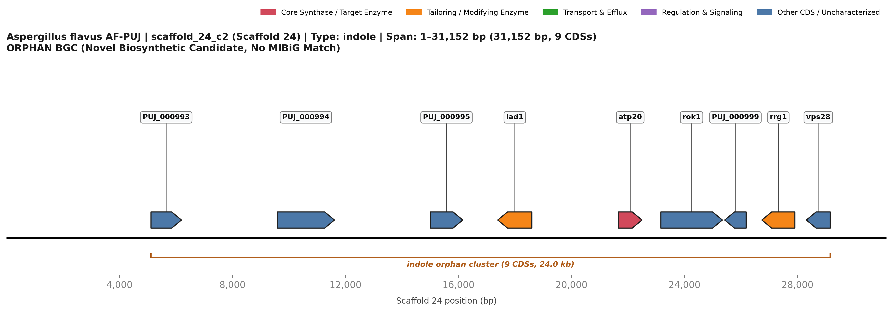](BGC_02_scaffold_24_c2_orphan_indole.svg)

> *Figure 02: Publication-grade gene cluster diagram of `BGC_02_scaffold_24_c2_orphan_indole` on Scaffold 24. Arrows indicate direction of transcription; boxes display standardized gene symbols or official locus tags. [Open scalable vector SVG](BGC_02_scaffold_24_c2_orphan_indole.svg).*

#### Gene Inventory & Structural Qualifiers

| Locus Tag | Gene Symbol | Strand | Physical Span | Length | Putative Product & EC Number | Pfam / Domain Signatures |
| :--- | :---: | :---: | :---: | :---: | :--- | :--- |
| `PUJ_000993` | `PUJ_000993` | `+` | 5,115..6,194 | 359 aa | hypothetical protein | PF01008 (Initiation factor 2 subunit family) |
| `PUJ_000994` | `PUJ_000994` | `+` | 9,586..11,610 | 439 aa | hypothetical protein | PF13520 (Amino acid permease) |
| `PUJ_000995` | `PUJ_000995` | `+` | 15,001..16,152 | 383 aa | hypothetical protein (`EC 2.5.1.34`) | PF11991 (Tryptophan dimethylallyltransferase) |
| `PUJ_000996` | `lad1` | `-` | 17,391..18,598 | 382 aa | L-arabinitol 4-dehydrogenase (`EC 1.1.1.14`) | PF00107 (Zinc-binding dehydrogenase), PF08240 (Alcohol dehydrogenase GroES-like domain) |
| `PUJ_000997` | `atp20` | `+` | 21,665..22,496 | 199 aa | ATP synthase subunit G atp20 | PF04718 (Mitochondrial ATP synthase g subunit) |
| `PUJ_000998` | `rok1` | `+` | 23,164..25,341 | 725 aa | RNA-dependent ATPase rok1 (`EC 3.6.4.13`) | PF00270 (DEAD/DEAH box helicase), PF00271 (Helicase conserved C-terminal domain) |
| `PUJ_000999` | `PUJ_000999` | `-` | 25,425..26,183 | 228 aa | hypothetical protein | — |
| `PUJ_001000` | `rrg1` | `-` | 26,740..27,908 | 346 aa | Protein-lysine N-methyltransferase rrg1 | PF10294 (Lysine methyltransferase) |
| `PUJ_001001` | `vps28` | `-` | 28,314..29,160 | 243 aa | Vacuolar protein-sorting-associated protein 28 | PF03997 (VPS28 protein) |

#### Putative Function & Enzymatic Mechanisms

- **`PUJ_000993`:** Hypothetical protein. Contains PF01008 (Initiation factor 2 subunit family). Hypothetical or accessory protein implicated in cluster function or localized metabolic support.
- **`PUJ_000994`:** Hypothetical protein. Contains PF13520 (Amino acid permease). Hypothetical or accessory protein implicated in cluster function or localized metabolic support.
- **`PUJ_000995`:** Hypothetical protein (EC 2.5.1.34). Contains PF11991 (Tryptophan dimethylallyltransferase). Hypothetical or accessory protein implicated in cluster function or localized metabolic support.
- **`PUJ_000996` (`lad1`):** L-arabinitol 4-dehydrogenase (EC 1.1.1.14). Contains PF00107 (Zinc-binding dehydrogenase), PF08240 (Alcohol dehydrogenase GroES-like domain). Oxidoreductase tailoring enzyme driving intermediate redox transformation.
- **`PUJ_000997` (`atp20`):** Atp synthase subunit g atp20. Contains PF04718 (Mitochondrial ATP synthase g subunit). Catalyzes core biosynthetic condensation or macrocyclization reactions in the pathway.
- **`PUJ_000998` (`rok1`):** Rna-dependent atpase rok1 (EC 3.6.4.13). Contains PF00270 (DEAD/DEAH box helicase), PF00271 (Helicase conserved C-terminal domain). Hypothetical or accessory protein implicated in cluster function or localized metabolic support.
- **`PUJ_000999`:** Hypothetical protein. Hypothetical or accessory protein implicated in cluster function or localized metabolic support.
- **`PUJ_001000` (`rrg1`):** Protein-lysine n-methyltransferase rrg1. Contains PF10294 (Lysine methyltransferase). Transfers chemical functional groups (e.g. methyl, acyl, or prenyl) to modify precursor bioactivity.
- **`PUJ_001001` (`vps28`):** Vacuolar protein-sorting-associated protein 28. Contains PF03997 (VPS28 protein). Hypothetical or accessory protein implicated in cluster function or localized metabolic support.

### Collective Pathway Architecture & Biological Synergy

This cluster represents a novel **orphan indole secondary metabolite biosynthetic gene cluster (BGC)**. Comprising 9 predicted CDSs, the locus harbors a dedicated core synthase supported by localized tailoring enzymes and transporter permeases with zero significant matches in MIBiG 3.1. It represents an uncharacterized secondary metabolite pathway within the *Aspergillus flavus* genome with potential bioactive chemical products.

---

### 03. Novel Orphan NRPS Biosynthetic Gene Cluster (`Scaffold 24`)

- **Cluster Identifier:** `BGC_03_scaffold_24_c3_orphan_nrps` (`scaffold_24_c3`)  
- **Genomic Location:** Scaffold 24 | Span: 1–66,363 bp (66,363 bp, 18 CDSs)  
- **Pathway Class:** `NRPS` | **Confidence Tier:** `ORPHAN`  

[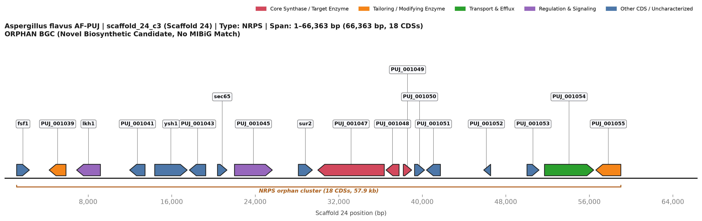](BGC_03_scaffold_24_c3_orphan_nrps.svg)

> *Figure 03: Publication-grade gene cluster diagram of `BGC_03_scaffold_24_c3_orphan_nrps` on Scaffold 24. Arrows indicate direction of transcription; boxes display standardized gene symbols or official locus tags. [Open scalable vector SVG](BGC_03_scaffold_24_c3_orphan_nrps.svg).*

#### Gene Inventory & Structural Qualifiers

| Locus Tag | Gene Symbol | Strand | Physical Span | Length | Putative Product & EC Number | Pfam / Domain Signatures |
| :--- | :---: | :---: | :---: | :---: | :--- | :--- |
| `PUJ_001038` | `fsf1` | `+` | 1,156..2,373 | 329 aa | Sideroflexin FSF1 | PF03820 (Sideroflexins) |
| `PUJ_001039` | `PUJ_001039` | `-` | 4,269..5,882 | 537 aa | hypothetical protein | PF01425 (Amidase) |
| `PUJ_001040` | `lkh1` | `-` | 6,902..9,179 | 669 aa | serine threonine protein kinase CMGC group (`EC 2.7.12.1`) | PF00069 (Protein kinase domain) |
| `PUJ_001041` | `PUJ_001041` | `-` | 11,982..13,454 | 472 aa | hypothetical protein | PF05236 (Transcription initiation factor TFIID component TAF4 family) |
| `PUJ_001042` | `ysh1` | `+` | 14,378..17,484 | 870 aa | endoribonuclease ysh1 | PF00753 (Metallo-beta-lactamase superfamily), PF10996 (Beta-Casp domain), PF07521 (Zn-dependent metallo-hydrolase RNA specificity domain) |
| `PUJ_001043` | `PUJ_001043` | `-` | 17,701..19,265 | 456 aa | hypothetical protein | PF00202 (Aminotransferase class-III) |
| `PUJ_001044` | `sec65` | `+` | 20,390..21,297 | 265 aa | signal recognition particle subunit | PF01922 (SRP19 protein) |
| `PUJ_001045` | `PUJ_001045` | `+` | 22,019..25,641 | 1031 aa | hypothetical protein | PF00172 (Fungal Zn(2)-Cys(6) binuclear cluster domain), PF04082 (Fungal specific transcription factor domain) |
| `PUJ_001046` | `sur2` | `+` | 28,136..29,476 | 419 aa | Sphingolipid C4-hydroxylase sur2 (`EC 1.14.18.5`) | PF04116 (Fatty acid hydroxylase) |
| `PUJ_001047` | `PUJ_001047` | `-` | 30,001..36,363 | 1702 aa | hypothetical protein (`EC 6.3.2.26`) | PF00668 (Condensation domain), PF00550 (Phosphopantetheine attachment site), PF00501 (AMP-binding enzyme) |
| `PUJ_001048` | `PUJ_001048` | `-` | 36,530..37,781 | 396 aa | hypothetical protein | PF00668 (Condensation domain), PF00550 (Phosphopantetheine attachment site) |
| `PUJ_001049` | `PUJ_001049` | `+` | 38,187..38,987 | 238 aa | hypothetical protein | PF00501 (AMP-binding enzyme) |
| `PUJ_001050` | `PUJ_001050` | `+` | 39,265..40,218 | 249 aa | hypothetical protein | PF00501 (AMP-binding enzyme), PF13193 (AMP-binding enzyme C-terminal domain) |
| `PUJ_001051` | `PUJ_001051` | `-` | 40,403..41,741 | 405 aa | hypothetical protein (`EC 4.1.1.65`) | PF02666 (Phosphatidylserine decarboxylase), PF12588 (Phophatidylserine decarboxylase) |
| `PUJ_001052` | `PUJ_001052` | `-` | 45,891..46,394 | 167 aa | hypothetical protein | — |
| `PUJ_001053` | `PUJ_001053` | `+` | 50,032..51,181 | 314 aa | hypothetical protein | — |
| `PUJ_001054` | `PUJ_001054` | `+` | 51,707..56,420 | 1512 aa | hypothetical protein | PF00664 (ABC transporter transmembrane region), PF00005 (ABC transporter), PF00664 (ABC transporter transmembrane region) |
| `PUJ_001055` | `PUJ_001055` | `-` | 56,624..59,020 | 798 aa | hypothetical protein (`EC 3.2.1.37`) | PF14310 (Fibronectin type III-like domain), PF01915 (Glycosyl hydrolase family 3 C-terminal domain), PF00933 (Glycosyl hydrolase family 3 N terminal domain) |

#### Putative Function & Enzymatic Mechanisms

- **`PUJ_001038` (`fsf1`):** Sideroflexin fsf1. Contains PF03820 (Sideroflexins). Hypothetical or accessory protein implicated in cluster function or localized metabolic support.
- **`PUJ_001039`:** Hypothetical protein. Contains PF01425 (Amidase). Hypothetical or accessory protein implicated in cluster function or localized metabolic support.
- **`PUJ_001040` (`lkh1`):** Serine threonine protein kinase cmgc group (EC 2.7.12.1). Contains PF00069 (Protein kinase domain). Hypothetical or accessory protein implicated in cluster function or localized metabolic support.
- **`PUJ_001041`:** Hypothetical protein. Contains PF05236 (Transcription initiation factor TFIID component TAF4 family). Hypothetical or accessory protein implicated in cluster function or localized metabolic support.
- **`PUJ_001042` (`ysh1`):** Endoribonuclease ysh1. Contains PF00753 (Metallo-beta-lactamase superfamily), PF10996 (Beta-Casp domain). Hypothetical or accessory protein implicated in cluster function or localized metabolic support.
- **`PUJ_001043`:** Hypothetical protein. Contains PF00202 (Aminotransferase class-III). Hypothetical or accessory protein implicated in cluster function or localized metabolic support.
- **`PUJ_001044` (`sec65`):** Signal recognition particle subunit. Contains PF01922 (SRP19 protein). Hypothetical or accessory protein implicated in cluster function or localized metabolic support.
- **`PUJ_001045`:** Hypothetical protein. Contains PF00172 (Fungal Zn(2)-Cys(6) binuclear cluster domain), PF04082 (Fungal specific transcription factor domain). Hypothetical or accessory protein implicated in cluster function or localized metabolic support.
- **`PUJ_001046` (`sur2`):** Sphingolipid c4-hydroxylase sur2 (EC 1.14.18.5). Contains PF04116 (Fatty acid hydroxylase). Performs regio- and stereospecific oxidative tailoring of the secondary metabolite intermediate.
- **`PUJ_001047`:** Hypothetical protein (EC 6.3.2.26). Contains PF00668 (Condensation domain), PF00550 (Phosphopantetheine attachment site). Hypothetical or accessory protein implicated in cluster function or localized metabolic support.
- **`PUJ_001048`:** Hypothetical protein. Contains PF00668 (Condensation domain), PF00550 (Phosphopantetheine attachment site). Hypothetical or accessory protein implicated in cluster function or localized metabolic support.
- **`PUJ_001049`:** Hypothetical protein. Contains PF00501 (AMP-binding enzyme). Hypothetical or accessory protein implicated in cluster function or localized metabolic support.
- **`PUJ_001050`:** Hypothetical protein. Contains PF00501 (AMP-binding enzyme), PF13193 (AMP-binding enzyme C-terminal domain). Hypothetical or accessory protein implicated in cluster function or localized metabolic support.
- **`PUJ_001051`:** Hypothetical protein (EC 4.1.1.65). Contains PF02666 (Phosphatidylserine decarboxylase), PF12588 (Phophatidylserine decarboxylase). Hypothetical or accessory protein implicated in cluster function or localized metabolic support.
- **`PUJ_001052`:** Hypothetical protein. Hypothetical or accessory protein implicated in cluster function or localized metabolic support.
- **`PUJ_001053`:** Hypothetical protein. Hypothetical or accessory protein implicated in cluster function or localized metabolic support.
- **`PUJ_001054`:** Hypothetical protein. Contains PF00664 (ABC transporter transmembrane region), PF00005 (ABC transporter). Hypothetical or accessory protein implicated in cluster function or localized metabolic support.
- **`PUJ_001055`:** Hypothetical protein (EC 3.2.1.37). Contains PF14310 (Fibronectin type III-like domain), PF01915 (Glycosyl hydrolase family 3 C-terminal domain). Hypothetical or accessory protein implicated in cluster function or localized metabolic support.

### Collective Pathway Architecture & Biological Synergy

This cluster represents a novel **orphan NRPS secondary metabolite biosynthetic gene cluster (BGC)**. Comprising 18 predicted CDSs, the locus harbors a dedicated core synthase supported by localized tailoring enzymes and transporter permeases with zero significant matches in MIBiG 3.1. It represents an uncharacterized secondary metabolite pathway within the *Aspergillus flavus* genome with potential bioactive chemical products.

---

### 04. Asparasone A Biosynthetic Gene Cluster (`Scaffold 24`)

- **Cluster Identifier:** `BGC_04_scaffold_24_c4_asparasone_a` (`scaffold_24_c4`)  
- **Genomic Location:** Scaffold 24 | Span: 1–98,078 bp (98,078 bp, 28 CDSs)  
- **Pathway Class:** `T1PKS` | **Confidence Tier:** `HIGH`  
- **antiSMASH KnownClusterBlast Top Hit:** `BGC0001446.5` — **asparasone A** (Cumulative Score: 5,862.0, Identity: 97–100%, 5 proteins)  

[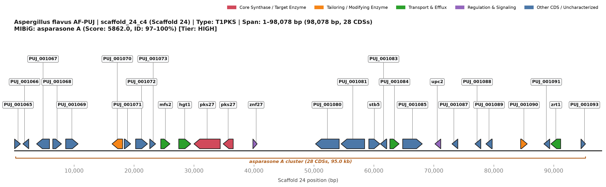](BGC_04_scaffold_24_c4_asparasone_a.svg)

> *Figure 04: Publication-grade gene cluster diagram of `BGC_04_scaffold_24_c4_asparasone_a` on Scaffold 24. Arrows indicate direction of transcription; boxes display standardized gene symbols or official locus tags. [Open scalable vector SVG](BGC_04_scaffold_24_c4_asparasone_a.svg).*

#### Gene Inventory & Structural Qualifiers

| Locus Tag | Gene Symbol | Strand | Physical Span | Length | Putative Product & EC Number | Pfam / Domain Signatures |
| :--- | :---: | :---: | :---: | :---: | :--- | :--- |
| `PUJ_001065` | `PUJ_001065` | `+` | 260..1,057 | 265 aa | hypothetical protein | PF06487 (Sin3 associated polypeptide p18 (SAP18)) |
| `PUJ_001066` | `PUJ_001066` | `-` | 1,473..2,007 | 74 aa | hypothetical protein | PF07225 (NADH-ubiquinone oxidoreductase B15 subunit (NDUFB4)) |
| `PUJ_001067` | `PUJ_001067` | `-` | 3,755..5,904 | 655 aa | hypothetical protein (`EC 1.1.1.22`) | PF03720 (UDP-glucose/GDP-mannose dehydrogenase family, UDP binding domain), PF00984 (UDP-glucose/GDP-mannose dehydrogenase family, central domain), PF03721 (UDP-glucose/GDP-mannose dehydrogenase family, NAD binding domain) |
| `PUJ_001068` | `PUJ_001068` | `+` | 6,457..7,902 | 481 aa | hypothetical protein | PF13579 (Glycosyl transferase 4-like domain), PF00534 (Glycosyl transferases group 1) |
| `PUJ_001069` | `PUJ_001069` | `+` | 8,604..10,674 | 617 aa | hypothetical protein | PF00732 (GMC oxidoreductase), PF05199 (GMC oxidoreductase) |
| `PUJ_001070` | `PUJ_001070` | `-` | 16,335..18,089 | 584 aa | hypothetical protein | PF00106 (short chain dehydrogenase) |
| `PUJ_001071` | `PUJ_001071` | `+` | 18,372..19,445 | 357 aa | hypothetical protein | — |
| `PUJ_001072` | `PUJ_001072` | `+` | 20,271..22,247 | 621 aa | hypothetical protein | PF00004 (ATPase family associated with various cellular activities (AAA)) |
| `PUJ_001073` | `PUJ_001073` | `+` | 22,777..23,604 | 275 aa | hypothetical protein | — |
| `PUJ_001074` | `mfs2` | `+` | 24,467..26,003 | 493 aa | MFS siderochrome iron transporter 1 | PF07690 (Major Facilitator Superfamily) |
| `PUJ_001075` | `hgt1` | `+` | 27,464..29,465 | 529 aa | high affinity glucose transporter | PF00083 (Sugar (and other) transporter) |
| `PUJ_001076` | `pks27` | `-` | 30,001..34,380 | 1424 aa | Non-reducing polyketide synthase pks27 | PF00975 (Thioesterase domain), PF00550 (Phosphopantetheine attachment site), PF14765 (Polyketide synthase dehydratase) |
| `PUJ_001077` | `pks27` | `-` | 34,868..36,545 | 520 aa | Non-reducing polyketide synthase pks27 | PF00109 (Beta-ketoacyl synthase, N-terminal domain), PF16073 (Starter unit:ACP transacylase in aflatoxin biosynthesis) |
| `PUJ_001078` | `znf27` | `+` | 40,199..40,539 | 91 aa | Transcription factor znf27 | — |
| `PUJ_001080` | `PUJ_001080` | `-` | 50,273..54,218 | 1279 aa | hypothetical protein | PF00400 (WD domain, G-beta repeat), PF00400 (WD domain, G-beta repeat), PF00400 (WD domain, G-beta repeat) |
| `PUJ_001081` | `PUJ_001081` | `-` | 54,539..58,461 | 1288 aa | hypothetical protein (`EC 3.5.2.9`) | PF02538 (Hydantoinase B/oxoprolinase), PF19278 (Hydantoinase/oxoprolinase C-terminal domain), PF01968 (Hydantoinase/oxoprolinase) |
| `PUJ_001082` | `stb5` | `+` | 59,165..61,007 | 586 aa | Rac GTPase-activating protein BCR/ABR | PF04082 (Fungal specific transcription factor domain) |
| `PUJ_001083` | `PUJ_001083` | `-` | 61,095..62,155 | 286 aa | hypothetical protein | PF00561 (alpha/beta hydrolase fold) |
| `PUJ_001084` | `PUJ_001084` | `+` | 62,673..64,217 | 499 aa | hypothetical protein | PF07690 (Major Facilitator Superfamily) |
| `PUJ_001085` | `PUJ_001085` | `+` | 64,813..68,078 | 829 aa | hypothetical protein | PF00550 (Phosphopantetheine attachment site), PF07993 (Male sterility protein) |
| `PUJ_001086` | `upc2` | `-` | 70,189..70,971 | 260 aa | transcription factor | — |
| `PUJ_001087` | `PUJ_001087` | `-` | 73,034..73,657 | 207 aa | hypothetical protein | — |
| `PUJ_001088` | `PUJ_001088` | `-` | 76,867..77,581 | 207 aa | hypothetical protein | — |
| `PUJ_001089` | `PUJ_001089` | `-` | 78,688..79,737 | 326 aa | hypothetical protein (`EC 3.1.1.73`) | — |
| `PUJ_001090` | `PUJ_001090` | `+` | 84,485..85,585 | 313 aa | hypothetical protein (`EC 1.14.13.22`) | PF13450 (NAD(P)-binding Rossmann-like domain) |
| `PUJ_001091` | `PUJ_001091` | `-` | 88,362..89,158 | 223 aa | hypothetical protein | PF00583 (Acetyltransferase (GNAT) family) |
| `PUJ_001092` | `zrt1` | `-` | 89,527..91,160 | 492 aa | high-affinity Zn(2+) transporter zrt1 | PF02535 (ZIP Zinc transporter) |
| `PUJ_001093` | `PUJ_001093` | `+` | 94,942..95,304 | 97 aa | hypothetical protein | — |

#### Putative Function & Enzymatic Mechanisms

- **`PUJ_001065`:** Hypothetical protein. Contains PF06487 (Sin3 associated polypeptide p18 (SAP18)). Hypothetical or accessory protein implicated in cluster function or localized metabolic support.
- **`PUJ_001066`:** Hypothetical protein. Contains PF07225 (NADH-ubiquinone oxidoreductase B15 subunit (NDUFB4)). Hypothetical or accessory protein implicated in cluster function or localized metabolic support.
- **`PUJ_001067`:** Hypothetical protein (EC 1.1.1.22). Contains PF03720 (UDP-glucose/GDP-mannose dehydrogenase family, UDP binding domain), PF00984 (UDP-glucose/GDP-mannose dehydrogenase family, central domain). Hypothetical or accessory protein implicated in cluster function or localized metabolic support.
- **`PUJ_001068`:** Hypothetical protein. Contains PF13579 (Glycosyl transferase 4-like domain), PF00534 (Glycosyl transferases group 1). Hypothetical or accessory protein implicated in cluster function or localized metabolic support.
- **`PUJ_001069`:** Hypothetical protein. Contains PF00732 (GMC oxidoreductase), PF05199 (GMC oxidoreductase). Hypothetical or accessory protein implicated in cluster function or localized metabolic support.
- **`PUJ_001070`:** Hypothetical protein. Contains PF00106 (short chain dehydrogenase). Hypothetical or accessory protein implicated in cluster function or localized metabolic support.
- **`PUJ_001071`:** Hypothetical protein. Hypothetical or accessory protein implicated in cluster function or localized metabolic support.
- **`PUJ_001072`:** Hypothetical protein. Contains PF00004 (ATPase family associated with various cellular activities (AAA)). Hypothetical or accessory protein implicated in cluster function or localized metabolic support.
- **`PUJ_001073`:** Hypothetical protein. Hypothetical or accessory protein implicated in cluster function or localized metabolic support.
- **`PUJ_001074` (`mfs2`):** Mfs siderochrome iron transporter 1. Contains PF07690 (Major Facilitator Superfamily). Transmembrane transport protein mediating efflux of synthesized products or precursor import.
- **`PUJ_001075` (`hgt1`):** High affinity glucose transporter. Contains PF00083 (Sugar (and other) transporter). Transmembrane transport protein mediating efflux of synthesized products or precursor import.
- **`PUJ_001076` (`pks27`):** Non-reducing polyketide synthase pks27. Contains PF00975 (Thioesterase domain), PF00550 (Phosphopantetheine attachment site). Catalyzes core biosynthetic condensation or macrocyclization reactions in the pathway.
- **`PUJ_001077` (`pks27`):** Non-reducing polyketide synthase pks27. Contains PF00109 (Beta-ketoacyl synthase, N-terminal domain), PF16073 (Starter unit:ACP transacylase in aflatoxin biosynthesis). Catalyzes core biosynthetic condensation or macrocyclization reactions in the pathway.
- **`PUJ_001078` (`znf27`):** Transcription factor znf27. Transcription factor regulating cluster expression in response to physiological or developmental cues.
- **`PUJ_001080`:** Hypothetical protein. Contains PF00400 (WD domain, G-beta repeat), PF00400 (WD domain, G-beta repeat). Hypothetical or accessory protein implicated in cluster function or localized metabolic support.
- **`PUJ_001081`:** Hypothetical protein (EC 3.5.2.9). Contains PF02538 (Hydantoinase B/oxoprolinase), PF19278 (Hydantoinase/oxoprolinase C-terminal domain). Hypothetical or accessory protein implicated in cluster function or localized metabolic support.
- **`PUJ_001082` (`stb5`):** Rac gtpase-activating protein bcr/abr. Contains PF04082 (Fungal specific transcription factor domain). Hypothetical or accessory protein implicated in cluster function or localized metabolic support.
- **`PUJ_001083`:** Hypothetical protein. Contains PF00561 (alpha/beta hydrolase fold). Hypothetical or accessory protein implicated in cluster function or localized metabolic support.
- **`PUJ_001084`:** Hypothetical protein. Contains PF07690 (Major Facilitator Superfamily). Hypothetical or accessory protein implicated in cluster function or localized metabolic support.
- **`PUJ_001085`:** Hypothetical protein. Contains PF00550 (Phosphopantetheine attachment site), PF07993 (Male sterility protein). Hypothetical or accessory protein implicated in cluster function or localized metabolic support.
- **`PUJ_001086` (`upc2`):** Transcription factor. Transcription factor regulating cluster expression in response to physiological or developmental cues.
- **`PUJ_001087`:** Hypothetical protein. Hypothetical or accessory protein implicated in cluster function or localized metabolic support.
- **`PUJ_001088`:** Hypothetical protein. Hypothetical or accessory protein implicated in cluster function or localized metabolic support.
- **`PUJ_001089`:** Hypothetical protein (EC 3.1.1.73). Hypothetical or accessory protein implicated in cluster function or localized metabolic support.
- **`PUJ_001090`:** Hypothetical protein (EC 1.14.13.22). Contains PF13450 (NAD(P)-binding Rossmann-like domain). Hypothetical or accessory protein implicated in cluster function or localized metabolic support.
- **`PUJ_001091`:** Hypothetical protein. Contains PF00583 (Acetyltransferase (GNAT) family). Hypothetical or accessory protein implicated in cluster function or localized metabolic support.
- **`PUJ_001092` (`zrt1`):** High-affinity zn(2+) transporter zrt1. Contains PF02535 (ZIP Zinc transporter). Transmembrane transport protein mediating efflux of synthesized products or precursor import.
- **`PUJ_001093`:** Hypothetical protein. Hypothetical or accessory protein implicated in cluster function or localized metabolic support.

### Collective Pathway Architecture & Biological Synergy

This cluster exhibits significant homology to the characterized MIBiG reference for **asparasone A** (MIBiG accession `BGC0001446.5`, score 5,862.0, identities 97–100%). The cluster features 28 coordinated CDSs encoding core synthases, tailoring oxidoreductases/transferases, and transmembrane efflux transporters that function collectively to synthesize, modify, and excrete bioactive T1PKS compounds.

---

### 05. Novel Orphan T1PKS Biosynthetic Gene Cluster (`Scaffold 24`)

- **Cluster Identifier:** `BGC_05_scaffold_24_c5_orphan_t1pks` (`scaffold_24_c5`)  
- **Genomic Location:** Scaffold 24 | Span: 1–68,097 bp (68,097 bp, 17 CDSs)  
- **Pathway Class:** `T1PKS` | **Confidence Tier:** `ORPHAN`  

[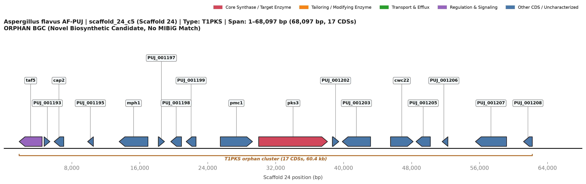](BGC_05_scaffold_24_c5_orphan_t1pks.svg)

> *Figure 05: Publication-grade gene cluster diagram of `BGC_05_scaffold_24_c5_orphan_t1pks` on Scaffold 24. Arrows indicate direction of transcription; boxes display standardized gene symbols or official locus tags. [Open scalable vector SVG](BGC_05_scaffold_24_c5_orphan_t1pks.svg).*

#### Gene Inventory & Structural Qualifiers

| Locus Tag | Gene Symbol | Strand | Physical Span | Length | Putative Product & EC Number | Pfam / Domain Signatures |
| :--- | :---: | :---: | :---: | :---: | :--- | :--- |
| `PUJ_001192` | `taf5` | `-` | 1,809..4,504 | 740 aa | Transcription initiation factor TFIID subunit 5 | PF00400 (WD domain, G-beta repeat), PF00400 (WD domain, G-beta repeat), PF00400 (WD domain, G-beta repeat) |
| `PUJ_001193` | `PUJ_001193` | `+` | 4,810..5,422 | 169 aa | hypothetical protein | PF10280 (Mediator complex protein) |
| `PUJ_001194` | `cap2` | `-` | 5,925..7,053 | 266 aa | F-actin-capping protein subunit beta | PF01115 (F-actin capping protein, beta subunit) |
| `PUJ_001195` | `PUJ_001195` | `-` | 9,868..10,506 | 212 aa | hypothetical protein | PF06985 (Heterokaryon incompatibility protein (HET)) |
| `PUJ_001196` | `mph1` | `-` | 13,578..16,967 | 1129 aa | 3'-5' DNA helicase (`EC 3.6.4.12`) | PF00271 (Helicase conserved C-terminal domain), PF04851 (Type III restriction enzyme, res subunit) |
| `PUJ_001197` | `PUJ_001197` | `+` | 18,187..18,911 | 198 aa | hypothetical protein | — |
| `PUJ_001198` | `PUJ_001198` | `-` | 19,656..20,915 | 323 aa | hypothetical protein | PF03747 (ADP-ribosylglycohydrolase) |
| `PUJ_001199` | `PUJ_001199` | `-` | 21,464..22,627 | 371 aa | hypothetical protein | — |
| `PUJ_001200` | `pmc1` | `+` | 25,485..29,273 | 1171 aa | plasma membrane calcium (`EC 7.2.2.10`) | PF00690 (Cation transporter/ATPase, N-terminus), PF00122 (E1-E2 ATPase), PF13246 (Cation transport ATPase (P-type)) |
| `PUJ_001201` | `pks3` | `+` | 30,001..38,097 | 2430 aa | Mycolipanoate synthase | PF00109 (Beta-ketoacyl synthase, N-terminal domain), PF00109 (Beta-ketoacyl synthase, N-terminal domain), PF02801 (Beta-ketoacyl synthase, C-terminal domain) |
| `PUJ_001202` | `PUJ_001202` | `+` | 38,677..39,432 | 251 aa | hypothetical protein | PF01966 (HD domain) |
| `PUJ_001203` | `PUJ_001203` | `-` | 39,842..43,174 | 1086 aa | hypothetical protein | — |
| `PUJ_001204` | `cwc22` | `+` | 45,520..48,184 | 871 aa | pre-mRNA-splicing factor cwc22 | PF02854 (MIF4G domain), PF02847 (MA3 domain) |
| `PUJ_001205` | `PUJ_001205` | `-` | 48,529..50,214 | 561 aa | hypothetical protein | PF00856 (SET domain) |
| `PUJ_001206` | `PUJ_001206` | `-` | 51,603..52,007 | 134 aa | hypothetical protein | — |
| `PUJ_001207` | `PUJ_001207` | `-` | 55,523..59,185 | 1111 aa | hypothetical protein | PF00400 (WD domain, G-beta repeat) |
| `PUJ_001208` | `PUJ_001208` | `-` | 61,184..62,218 | 344 aa | hypothetical protein | — |

#### Putative Function & Enzymatic Mechanisms

- **`PUJ_001192` (`taf5`):** Transcription initiation factor tfiid subunit 5. Contains PF00400 (WD domain, G-beta repeat), PF00400 (WD domain, G-beta repeat). Transcription factor regulating cluster expression in response to physiological or developmental cues.
- **`PUJ_001193`:** Hypothetical protein. Contains PF10280 (Mediator complex protein). Hypothetical or accessory protein implicated in cluster function or localized metabolic support.
- **`PUJ_001194` (`cap2`):** F-actin-capping protein subunit beta. Contains PF01115 (F-actin capping protein, beta subunit). Hypothetical or accessory protein implicated in cluster function or localized metabolic support.
- **`PUJ_001195`:** Hypothetical protein. Contains PF06985 (Heterokaryon incompatibility protein (HET)). Hypothetical or accessory protein implicated in cluster function or localized metabolic support.
- **`PUJ_001196` (`mph1`):** 3'-5' dna helicase (EC 3.6.4.12). Contains PF00271 (Helicase conserved C-terminal domain), PF04851 (Type III restriction enzyme, res subunit). Hypothetical or accessory protein implicated in cluster function or localized metabolic support.
- **`PUJ_001197`:** Hypothetical protein. Hypothetical or accessory protein implicated in cluster function or localized metabolic support.
- **`PUJ_001198`:** Hypothetical protein. Contains PF03747 (ADP-ribosylglycohydrolase). Hypothetical or accessory protein implicated in cluster function or localized metabolic support.
- **`PUJ_001199`:** Hypothetical protein. Hypothetical or accessory protein implicated in cluster function or localized metabolic support.
- **`PUJ_001200` (`pmc1`):** Plasma membrane calcium (EC 7.2.2.10). Contains PF00690 (Cation transporter/ATPase, N-terminus), PF00122 (E1-E2 ATPase). Hypothetical or accessory protein implicated in cluster function or localized metabolic support.
- **`PUJ_001201` (`pks3`):** Mycolipanoate synthase. Contains PF00109 (Beta-ketoacyl synthase, N-terminal domain), PF00109 (Beta-ketoacyl synthase, N-terminal domain). Catalyzes core biosynthetic condensation or macrocyclization reactions in the pathway.
- **`PUJ_001202`:** Hypothetical protein. Contains PF01966 (HD domain). Hypothetical or accessory protein implicated in cluster function or localized metabolic support.
- **`PUJ_001203`:** Hypothetical protein. Hypothetical or accessory protein implicated in cluster function or localized metabolic support.
- **`PUJ_001204` (`cwc22`):** Pre-mrna-splicing factor cwc22. Contains PF02854 (MIF4G domain), PF02847 (MA3 domain). Hypothetical or accessory protein implicated in cluster function or localized metabolic support.
- **`PUJ_001205`:** Hypothetical protein. Contains PF00856 (SET domain). Hypothetical or accessory protein implicated in cluster function or localized metabolic support.
- **`PUJ_001206`:** Hypothetical protein. Hypothetical or accessory protein implicated in cluster function or localized metabolic support.
- **`PUJ_001207`:** Hypothetical protein. Contains PF00400 (WD domain, G-beta repeat). Hypothetical or accessory protein implicated in cluster function or localized metabolic support.
- **`PUJ_001208`:** Hypothetical protein. Hypothetical or accessory protein implicated in cluster function or localized metabolic support.

### Collective Pathway Architecture & Biological Synergy

This cluster represents a novel **orphan T1PKS secondary metabolite biosynthetic gene cluster (BGC)**. Comprising 17 predicted CDSs, the locus harbors a dedicated core synthase supported by localized tailoring enzymes and transporter permeases with zero significant matches in MIBiG 3.1. It represents an uncharacterized secondary metabolite pathway within the *Aspergillus flavus* genome with potential bioactive chemical products.

---

### 06. Choline Biosynthetic Gene Cluster (`Scaffold 24`)

- **Cluster Identifier:** `BGC_06_scaffold_24_c6_choline` (`scaffold_24_c6`)  
- **Genomic Location:** Scaffold 24 | Span: 1–70,758 bp (70,758 bp, 17 CDSs)  
- **Pathway Class:** `NRPS-like` | **Confidence Tier:** `MEDIUM`  
- **antiSMASH KnownClusterBlast Top Hit:** `BGC0002276.2` — **choline** (Cumulative Score: 1,941.0, Identity: 77–77%, 1 proteins)  

[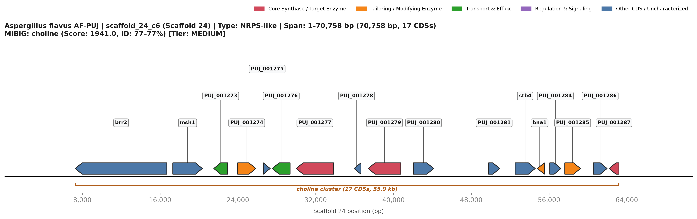](BGC_06_scaffold_24_c6_choline.svg)

> *Figure 06: Publication-grade gene cluster diagram of `BGC_06_scaffold_24_c6_choline` on Scaffold 24. Arrows indicate direction of transcription; boxes display standardized gene symbols or official locus tags. [Open scalable vector SVG](BGC_06_scaffold_24_c6_choline.svg).*

#### Gene Inventory & Structural Qualifiers

| Locus Tag | Gene Symbol | Strand | Physical Span | Length | Putative Product & EC Number | Pfam / Domain Signatures |
| :--- | :---: | :---: | :---: | :---: | :--- | :--- |
| `PUJ_001271` | `brr2` | `-` | 7,273..16,694 | 2917 aa | Pre-mRNA-splicing helicase BRR2 (`EC 3.6.4.13`) | PF00326 (Prolyl oligopeptidase family), PF02889 (Sec63 Brl domain), PF00270 (DEAD/DEAH box helicase) |
| `PUJ_001272` | `msh1` | `+` | 17,305..20,340 | 962 aa | MutS protein 1 | PF01624 (MutS domain I), PF05188 (MutS domain II), PF05192 (MutS domain III) |
| `PUJ_001273` | `PUJ_001273` | `-` | 21,520..22,938 | 472 aa | hypothetical protein | PF07690 (Major Facilitator Superfamily) |
| `PUJ_001274` | `PUJ_001274` | `+` | 23,976..25,839 | 538 aa | hypothetical protein (`EC 3.5.1.4`) | PF01425 (Amidase) |
| `PUJ_001275` | `PUJ_001275` | `+` | 26,696..27,319 | 207 aa | hypothetical protein | — |
| `PUJ_001276` | `PUJ_001276` | `-` | 27,537..29,370 | 552 aa | hypothetical protein | PF07690 (Major Facilitator Superfamily) |
| `PUJ_001277` | `PUJ_001277` | `-` | 30,001..33,837 | 1278 aa | hypothetical protein | PF00106 (short chain dehydrogenase), PF07993 (Male sterility protein), PF00550 (Phosphopantetheine attachment site) |
| `PUJ_001278` | `PUJ_001278` | `-` | 35,949..36,456 | 146 aa | hypothetical protein | PF08881 (CVNH domain) |
| `PUJ_001279` | `PUJ_001279` | `-` | 37,403..40,758 | 1057 aa | hypothetical protein | PF07993 (Male sterility protein), PF00550 (Phosphopantetheine attachment site), PF00501 (AMP-binding enzyme) |
| `PUJ_001280` | `PUJ_001280` | `+` | 42,058..44,132 | 428 aa | hypothetical protein | PF08659 (KR domain) |
| `PUJ_001281` | `PUJ_001281` | `+` | 49,784..50,925 | 339 aa | hypothetical protein | PF01490 (Transmembrane amino acid transporter protein) |
| `PUJ_001282` | `stb4` | `+` | 52,510..54,576 | 688 aa | hypothetical protein | PF04082 (Fungal specific transcription factor domain) |
| `PUJ_001283` | `bna1` | `-` | 54,807..55,243 | 112 aa | 3-hydroxyanthranilic acid dioxygenase (`EC 1.13.11.6`) | PF06052 (3-hydroxyanthranilic acid dioxygenase) |
| `PUJ_001284` | `PUJ_001284` | `+` | 56,072..57,226 | 360 aa | hypothetical protein (`EC 4.1.1.45`) | PF04909 (Amidohydrolase) |
| `PUJ_001285` | `PUJ_001285` | `+` | 57,618..59,229 | 501 aa | hypothetical protein | PF00171 (Aldehyde dehydrogenase family) |
| `PUJ_001286` | `PUJ_001286` | `+` | 60,546..61,970 | 474 aa | hypothetical protein | PF07063 (Domain of unknown function (DUF1338)) |
| `PUJ_001287` | `PUJ_001287` | `-` | 62,180..63,184 | 334 aa | hypothetical protein (`EC 1.6.5.5`) | PF00107 (Zinc-binding dehydrogenase), PF08240 (Alcohol dehydrogenase GroES-like domain) |

#### Putative Function & Enzymatic Mechanisms

- **`PUJ_001271` (`brr2`):** Pre-mrna-splicing helicase brr2 (EC 3.6.4.13). Contains PF00326 (Prolyl oligopeptidase family), PF02889 (Sec63 Brl domain). Hypothetical or accessory protein implicated in cluster function or localized metabolic support.
- **`PUJ_001272` (`msh1`):** Muts protein 1. Contains PF01624 (MutS domain I), PF05188 (MutS domain II). Hypothetical or accessory protein implicated in cluster function or localized metabolic support.
- **`PUJ_001273`:** Hypothetical protein. Contains PF07690 (Major Facilitator Superfamily). Hypothetical or accessory protein implicated in cluster function or localized metabolic support.
- **`PUJ_001274`:** Hypothetical protein (EC 3.5.1.4). Contains PF01425 (Amidase). Hypothetical or accessory protein implicated in cluster function or localized metabolic support.
- **`PUJ_001275`:** Hypothetical protein. Hypothetical or accessory protein implicated in cluster function or localized metabolic support.
- **`PUJ_001276`:** Hypothetical protein. Contains PF07690 (Major Facilitator Superfamily). Hypothetical or accessory protein implicated in cluster function or localized metabolic support.
- **`PUJ_001277`:** Hypothetical protein. Contains PF00106 (short chain dehydrogenase), PF07993 (Male sterility protein). Hypothetical or accessory protein implicated in cluster function or localized metabolic support.
- **`PUJ_001278`:** Hypothetical protein. Contains PF08881 (CVNH domain). Hypothetical or accessory protein implicated in cluster function or localized metabolic support.
- **`PUJ_001279`:** Hypothetical protein. Contains PF07993 (Male sterility protein), PF00550 (Phosphopantetheine attachment site). Hypothetical or accessory protein implicated in cluster function or localized metabolic support.
- **`PUJ_001280`:** Hypothetical protein. Contains PF08659 (KR domain). Hypothetical or accessory protein implicated in cluster function or localized metabolic support.
- **`PUJ_001281`:** Hypothetical protein. Contains PF01490 (Transmembrane amino acid transporter protein). Hypothetical or accessory protein implicated in cluster function or localized metabolic support.
- **`PUJ_001282` (`stb4`):** Hypothetical protein. Contains PF04082 (Fungal specific transcription factor domain). Hypothetical or accessory protein implicated in cluster function or localized metabolic support.
- **`PUJ_001283` (`bna1`):** 3-hydroxyanthranilic acid dioxygenase (EC 1.13.11.6). Contains PF06052 (3-hydroxyanthranilic acid dioxygenase). Performs regio- and stereospecific oxidative tailoring of the secondary metabolite intermediate.
- **`PUJ_001284`:** Hypothetical protein (EC 4.1.1.45). Contains PF04909 (Amidohydrolase). Hypothetical or accessory protein implicated in cluster function or localized metabolic support.
- **`PUJ_001285`:** Hypothetical protein. Contains PF00171 (Aldehyde dehydrogenase family). Hypothetical or accessory protein implicated in cluster function or localized metabolic support.
- **`PUJ_001286`:** Hypothetical protein. Contains PF07063 (Domain of unknown function (DUF1338)). Hypothetical or accessory protein implicated in cluster function or localized metabolic support.
- **`PUJ_001287`:** Hypothetical protein (EC 1.6.5.5). Contains PF00107 (Zinc-binding dehydrogenase), PF08240 (Alcohol dehydrogenase GroES-like domain). Hypothetical or accessory protein implicated in cluster function or localized metabolic support.

### Collective Pathway Architecture & Biological Synergy

This cluster exhibits significant homology to the characterized MIBiG reference for **choline** (MIBiG accession `BGC0002276.2`, score 1,941.0, identities 77–77%). The cluster features 17 coordinated CDSs encoding core synthases, tailoring oxidoreductases/transferases, and transmembrane efflux transporters that function collectively to synthesize, modify, and excrete bioactive NRPS-like compounds.

---

### 07. 14-(N,N-Dimethylleucyloxy)Paspalinine Biosynthetic Gene Cluster (`Scaffold 256`)

- **Cluster Identifier:** `BGC_07_scaffold_256_c1_14_n,n_dimethylleucyloxypaspalinine` (`scaffold_256_c1`)  
- **Genomic Location:** Scaffold 256 | Span: 1–35,670 bp (35,670 bp, 12 CDSs)  
- **Pathway Class:** `terpene` | **Confidence Tier:** `MEDIUM`  
- **antiSMASH KnownClusterBlast Top Hit:** `BGC0002149.2` — **14-(N,N-dimethylleucyloxy)paspalinine/14-(leucyloxy)paspalinine/14-hydroxypaspalinine** (Cumulative Score: 1,482.0, Identity: 62–72%, 3 proteins)  

[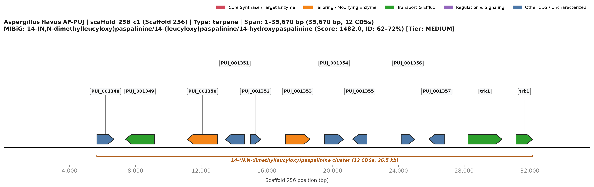](BGC_07_scaffold_256_c1_14_n,n_dimethylleucyloxypaspalinine.svg)

> *Figure 07: Publication-grade gene cluster diagram of `BGC_07_scaffold_256_c1_14_n,n_dimethylleucyloxypaspalinine` on Scaffold 256. Arrows indicate direction of transcription; boxes display standardized gene symbols or official locus tags. [Open scalable vector SVG](BGC_07_scaffold_256_c1_14_n,n_dimethylleucyloxypaspalinine.svg).*

#### Gene Inventory & Structural Qualifiers

| Locus Tag | Gene Symbol | Strand | Physical Span | Length | Putative Product & EC Number | Pfam / Domain Signatures |
| :--- | :---: | :---: | :---: | :---: | :--- | :--- |
| `PUJ_001348` | `PUJ_001348` | `+` | 5,660..6,696 | 307 aa | hypothetical protein (`EC 3.1.1.72`) | PF10503 (Esterase PHB depolymerase) |
| `PUJ_001349` | `PUJ_001349` | `-` | 7,403..9,171 | 512 aa | hypothetical protein | PF00083 (Sugar (and other) transporter) |
| `PUJ_001350` | `PUJ_001350` | `-` | 11,162..12,997 | 519 aa | hypothetical protein | PF00067 (Cytochrome P450) |
| `PUJ_001351` | `PUJ_001351` | `-` | 13,472..14,638 | 261 aa | hypothetical protein | — |
| `PUJ_001352` | `PUJ_001352` | `+` | 15,001..15,636 | 185 aa | hypothetical protein | — |
| `PUJ_001353` | `PUJ_001353` | `+` | 17,133..18,623 | 403 aa | hypothetical protein | PF00067 (Cytochrome P450) |
| `PUJ_001354` | `PUJ_001354` | `+` | 19,510..20,670 | 386 aa | hypothetical protein | PF11991 (Tryptophan dimethylallyltransferase) |
| `PUJ_001355` | `PUJ_001355` | `-` | 21,221..22,089 | 237 aa | hypothetical protein | — |
| `PUJ_001356` | `PUJ_001356` | `+` | 24,171..24,998 | 275 aa | hypothetical protein | PF13087 (AAA domain) |
| `PUJ_001357` | `PUJ_001357` | `-` | 25,854..26,822 | 257 aa | hypothetical protein | — |
| `PUJ_001358` | `trk1` | `+` | 28,240..30,302 | 666 aa | low affinity potassium transporter | PF02386 (Cation transport protein) |
| `PUJ_001359` | `trk1` | `+` | 31,157..32,170 | 272 aa | low affinity potassium transporter | PF12796 (Ankyrin repeats (3 copies)), PF12796 (Ankyrin repeats (3 copies)), PF12796 (Ankyrin repeats (3 copies)) |

#### Putative Function & Enzymatic Mechanisms

- **`PUJ_001348`:** Hypothetical protein (EC 3.1.1.72). Contains PF10503 (Esterase PHB depolymerase). Hypothetical or accessory protein implicated in cluster function or localized metabolic support.
- **`PUJ_001349`:** Hypothetical protein. Contains PF00083 (Sugar (and other) transporter). Hypothetical or accessory protein implicated in cluster function or localized metabolic support.
- **`PUJ_001350`:** Hypothetical protein. Contains PF00067 (Cytochrome P450). Hypothetical or accessory protein implicated in cluster function or localized metabolic support.
- **`PUJ_001351`:** Hypothetical protein. Hypothetical or accessory protein implicated in cluster function or localized metabolic support.
- **`PUJ_001352`:** Hypothetical protein. Hypothetical or accessory protein implicated in cluster function or localized metabolic support.
- **`PUJ_001353`:** Hypothetical protein. Contains PF00067 (Cytochrome P450). Hypothetical or accessory protein implicated in cluster function or localized metabolic support.
- **`PUJ_001354`:** Hypothetical protein. Contains PF11991 (Tryptophan dimethylallyltransferase). Hypothetical or accessory protein implicated in cluster function or localized metabolic support.
- **`PUJ_001355`:** Hypothetical protein. Hypothetical or accessory protein implicated in cluster function or localized metabolic support.
- **`PUJ_001356`:** Hypothetical protein. Contains PF13087 (AAA domain). Hypothetical or accessory protein implicated in cluster function or localized metabolic support.
- **`PUJ_001357`:** Hypothetical protein. Hypothetical or accessory protein implicated in cluster function or localized metabolic support.
- **`PUJ_001358` (`trk1`):** Low affinity potassium transporter. Contains PF02386 (Cation transport protein). Transmembrane transport protein mediating efflux of synthesized products or precursor import.
- **`PUJ_001359` (`trk1`):** Low affinity potassium transporter. Contains PF12796 (Ankyrin repeats (3 copies)), PF12796 (Ankyrin repeats (3 copies)). Transmembrane transport protein mediating efflux of synthesized products or precursor import.

### Collective Pathway Architecture & Biological Synergy

This cluster exhibits significant homology to the characterized MIBiG reference for **14-(N,N-dimethylleucyloxy)paspalinine/14-(leucyloxy)paspalinine/14-hydroxypaspalinine** (MIBiG accession `BGC0002149.2`, score 1,482.0, identities 62–72%). The cluster features 12 coordinated CDSs encoding core synthases, tailoring oxidoreductases/transferases, and transmembrane efflux transporters that function collectively to synthesize, modify, and excrete bioactive terpene compounds.

---

### 08. Novel Orphan TERPENE Biosynthetic Gene Cluster (`Scaffold 256`)

- **Cluster Identifier:** `BGC_08_scaffold_256_c2_orphan_terpene` (`scaffold_256_c2`)  
- **Genomic Location:** Scaffold 256 | Span: 1–31,068 bp (31,068 bp, 9 CDSs)  
- **Pathway Class:** `terpene` | **Confidence Tier:** `ORPHAN`  

[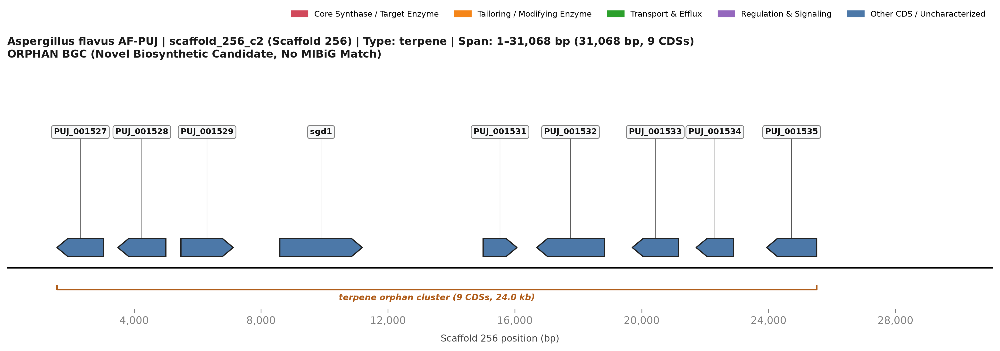](BGC_08_scaffold_256_c2_orphan_terpene.svg)

> *Figure 08: Publication-grade gene cluster diagram of `BGC_08_scaffold_256_c2_orphan_terpene` on Scaffold 256. Arrows indicate direction of transcription; boxes display standardized gene symbols or official locus tags. [Open scalable vector SVG](BGC_08_scaffold_256_c2_orphan_terpene.svg).*

#### Gene Inventory & Structural Qualifiers

| Locus Tag | Gene Symbol | Strand | Physical Span | Length | Putative Product & EC Number | Pfam / Domain Signatures |
| :--- | :---: | :---: | :---: | :---: | :--- | :--- |
| `PUJ_001527` | `PUJ_001527` | `-` | 1,567..3,042 | 412 aa | hypothetical protein (`EC 3.5.1.49`) | PF03069 (Acetamidase/Formamidase family) |
| `PUJ_001528` | `PUJ_001528` | `-` | 3,487..5,000 | 366 aa | hypothetical protein | — |
| `PUJ_001529` | `PUJ_001529` | `+` | 5,475..7,124 | 549 aa | hypothetical protein | PF12634 (Inheritance of peroxisomes protein 1) |
| `PUJ_001530` | `sgd1` | `+` | 8,592..11,193 | 850 aa | suppressor of glycerol defect | PF02854 (MIF4G domain), PF02847 (MA3 domain) |
| `PUJ_001531` | `PUJ_001531` | `+` | 15,001..16,068 | 355 aa | hypothetical protein | PF01040 (UbiA prenyltransferase family) |
| `PUJ_001532` | `PUJ_001532` | `-` | 16,692..18,824 | 643 aa | hypothetical protein | PF04082 (Fungal specific transcription factor domain) |
| `PUJ_001533` | `PUJ_001533` | `-` | 19,703..21,156 | 442 aa | hypothetical protein (`EC 1.14.13.1`) | PF01494 (FAD binding domain) |
| `PUJ_001534` | `PUJ_001534` | `-` | 21,717..22,898 | 393 aa | hypothetical protein | — |
| `PUJ_001535` | `PUJ_001535` | `-` | 23,937..25,517 | 526 aa | hypothetical protein | — |

#### Putative Function & Enzymatic Mechanisms

- **`PUJ_001527`:** Hypothetical protein (EC 3.5.1.49). Contains PF03069 (Acetamidase/Formamidase family). Hypothetical or accessory protein implicated in cluster function or localized metabolic support.
- **`PUJ_001528`:** Hypothetical protein. Hypothetical or accessory protein implicated in cluster function or localized metabolic support.
- **`PUJ_001529`:** Hypothetical protein. Contains PF12634 (Inheritance of peroxisomes protein 1). Hypothetical or accessory protein implicated in cluster function or localized metabolic support.
- **`PUJ_001530` (`sgd1`):** Suppressor of glycerol defect. Contains PF02854 (MIF4G domain), PF02847 (MA3 domain). Hypothetical or accessory protein implicated in cluster function or localized metabolic support.
- **`PUJ_001531`:** Hypothetical protein. Contains PF01040 (UbiA prenyltransferase family). Hypothetical or accessory protein implicated in cluster function or localized metabolic support.
- **`PUJ_001532`:** Hypothetical protein. Contains PF04082 (Fungal specific transcription factor domain). Hypothetical or accessory protein implicated in cluster function or localized metabolic support.
- **`PUJ_001533`:** Hypothetical protein (EC 1.14.13.1). Contains PF01494 (FAD binding domain). Hypothetical or accessory protein implicated in cluster function or localized metabolic support.
- **`PUJ_001534`:** Hypothetical protein. Hypothetical or accessory protein implicated in cluster function or localized metabolic support.
- **`PUJ_001535`:** Hypothetical protein. Hypothetical or accessory protein implicated in cluster function or localized metabolic support.

### Collective Pathway Architecture & Biological Synergy

This cluster represents a novel **orphan terpene secondary metabolite biosynthetic gene cluster (BGC)**. Comprising 9 predicted CDSs, the locus harbors a dedicated core synthase supported by localized tailoring enzymes and transporter permeases with zero significant matches in MIBiG 3.1. It represents an uncharacterized secondary metabolite pathway within the *Aspergillus flavus* genome with potential bioactive chemical products.

---

### 09. Heptelidic Acid Biosynthetic Gene Cluster (`Scaffold 256`)

- **Cluster Identifier:** `BGC_09_scaffold_256_c3_heptelidic_acid` (`scaffold_256_c3`)  
- **Genomic Location:** Scaffold 256 | Span: 1–63,562 bp (63,562 bp, 14 CDSs)  
- **Pathway Class:** `NRPS` | **Confidence Tier:** `MEDIUM`  
- **antiSMASH KnownClusterBlast Top Hit:** `BGC0001995.3` — **heptelidic acid** (Cumulative Score: 2,420.0, Identity: 97–99%, 4 proteins)  

[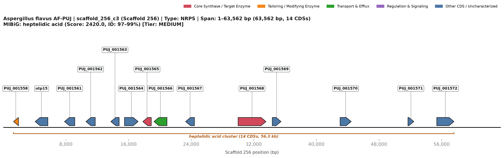](BGC_09_scaffold_256_c3_heptelidic_acid.svg)

> *Figure 09: Publication-grade gene cluster diagram of `BGC_09_scaffold_256_c3_heptelidic_acid` on Scaffold 256. Arrows indicate direction of transcription; boxes display standardized gene symbols or official locus tags. [Open scalable vector SVG](BGC_09_scaffold_256_c3_heptelidic_acid.svg).*

#### Gene Inventory & Structural Qualifiers

| Locus Tag | Gene Symbol | Strand | Physical Span | Length | Putative Product & EC Number | Pfam / Domain Signatures |
| :--- | :---: | :---: | :---: | :---: | :--- | :--- |
| `PUJ_001558` | `PUJ_001558` | `-` | 1,307..1,887 | 148 aa | hypothetical protein | PF00106 (short chain dehydrogenase) |
| `PUJ_001559` | `utp15` | `-` | 4,070..5,695 | 541 aa | U3 small nucleolar RNA-associated protein 15 | PF09384 (UTP15 C terminal), PF00400 (WD domain, G-beta repeat), PF00400 (WD domain, G-beta repeat) |
| `PUJ_001561` | `PUJ_001561` | `-` | 7,818..9,134 | 438 aa | hypothetical protein | PF16983 (Molybdate transporter of MFS superfamily), PF16983 (Molybdate transporter of MFS superfamily) |
| `PUJ_001562` | `PUJ_001562` | `-` | 10,561..11,748 | 395 aa | hypothetical protein | — |
| `PUJ_001563` | `PUJ_001563` | `-` | 13,744..14,802 | 329 aa | hypothetical protein | PF07859 (alpha/beta hydrolase fold) |
| `PUJ_001564` | `PUJ_001564` | `+` | 15,486..17,228 | 580 aa | hypothetical protein | PF01989 (Aconitase X swivel domain), PF04412 (Aconitase X) |
| `PUJ_001565` | `PUJ_001565` | `-` | 17,824..18,907 | 343 aa | hypothetical protein | PF00107 (Zinc-binding dehydrogenase), PF08240 (Alcohol dehydrogenase GroES-like domain) |
| `PUJ_001566` | `PUJ_001566` | `-` | 19,251..20,911 | 530 aa | hypothetical protein | PF07690 (Major Facilitator Superfamily) |
| `PUJ_001567` | `PUJ_001567` | `-` | 23,293..24,426 | 250 aa | hypothetical protein | PF11951 (Fungal specific transcription factor domain) |
| `PUJ_001568` | `PUJ_001568` | `+` | 30,001..33,562 | 1163 aa | hypothetical protein | PF00501 (AMP-binding enzyme), PF13193 (AMP-binding enzyme C-terminal domain), PF00550 (Phosphopantetheine attachment site) |
| `PUJ_001569` | `PUJ_001569` | `+` | 34,368..35,488 | 334 aa | hypothetical protein (`EC 1.2.1.12`) | PF00044 (Glyceraldehyde 3-phosphate dehydrogenase, NAD binding domain), PF02800 (Glyceraldehyde 3-phosphate dehydrogenase, C-terminal domain) |
| `PUJ_001570` | `PUJ_001570` | `+` | 43,032..44,449 | 369 aa | hypothetical protein | PF19086 (Terpene synthase family 2, C-terminal metal binding) |
| `PUJ_001571` | `PUJ_001571` | `+` | 51,703..52,454 | 230 aa | hypothetical protein | — |
| `PUJ_001572` | `PUJ_001572` | `+` | 55,384..57,582 | 732 aa | hypothetical protein (`EC 3.1.1.7`) | PF00135 (Carboxylesterase family) |

#### Putative Function & Enzymatic Mechanisms

- **`PUJ_001558`:** Hypothetical protein. Contains PF00106 (short chain dehydrogenase). Hypothetical or accessory protein implicated in cluster function or localized metabolic support.
- **`PUJ_001559` (`utp15`):** U3 small nucleolar rna-associated protein 15. Contains PF09384 (UTP15 C terminal), PF00400 (WD domain, G-beta repeat). Hypothetical or accessory protein implicated in cluster function or localized metabolic support.
- **`PUJ_001561`:** Hypothetical protein. Contains PF16983 (Molybdate transporter of MFS superfamily), PF16983 (Molybdate transporter of MFS superfamily). Hypothetical or accessory protein implicated in cluster function or localized metabolic support.
- **`PUJ_001562`:** Hypothetical protein. Hypothetical or accessory protein implicated in cluster function or localized metabolic support.
- **`PUJ_001563`:** Hypothetical protein. Contains PF07859 (alpha/beta hydrolase fold). Hypothetical or accessory protein implicated in cluster function or localized metabolic support.
- **`PUJ_001564`:** Hypothetical protein. Contains PF01989 (Aconitase X swivel domain), PF04412 (Aconitase X). Hypothetical or accessory protein implicated in cluster function or localized metabolic support.
- **`PUJ_001565`:** Hypothetical protein. Contains PF00107 (Zinc-binding dehydrogenase), PF08240 (Alcohol dehydrogenase GroES-like domain). Hypothetical or accessory protein implicated in cluster function or localized metabolic support.
- **`PUJ_001566`:** Hypothetical protein. Contains PF07690 (Major Facilitator Superfamily). Hypothetical or accessory protein implicated in cluster function or localized metabolic support.
- **`PUJ_001567`:** Hypothetical protein. Contains PF11951 (Fungal specific transcription factor domain). Hypothetical or accessory protein implicated in cluster function or localized metabolic support.
- **`PUJ_001568`:** Hypothetical protein. Contains PF00501 (AMP-binding enzyme), PF13193 (AMP-binding enzyme C-terminal domain). Hypothetical or accessory protein implicated in cluster function or localized metabolic support.
- **`PUJ_001569`:** Hypothetical protein (EC 1.2.1.12). Contains PF00044 (Glyceraldehyde 3-phosphate dehydrogenase, NAD binding domain), PF02800 (Glyceraldehyde 3-phosphate dehydrogenase, C-terminal domain). Hypothetical or accessory protein implicated in cluster function or localized metabolic support.
- **`PUJ_001570`:** Hypothetical protein. Contains PF19086 (Terpene synthase family 2, C-terminal metal binding). Hypothetical or accessory protein implicated in cluster function or localized metabolic support.
- **`PUJ_001571`:** Hypothetical protein. Hypothetical or accessory protein implicated in cluster function or localized metabolic support.
- **`PUJ_001572`:** Hypothetical protein (EC 3.1.1.7). Contains PF00135 (Carboxylesterase family). Hypothetical or accessory protein implicated in cluster function or localized metabolic support.

### Collective Pathway Architecture & Biological Synergy

This cluster exhibits significant homology to the characterized MIBiG reference for **heptelidic acid** (MIBiG accession `BGC0001995.3`, score 2,420.0, identities 97–99%). The cluster features 14 coordinated CDSs encoding core synthases, tailoring oxidoreductases/transferases, and transmembrane efflux transporters that function collectively to synthesize, modify, and excrete bioactive NRPS compounds.

---

### 10. Novel Orphan NRPS-LIKE Biosynthetic Gene Cluster (`Scaffold 256`)

- **Cluster Identifier:** `BGC_10_scaffold_256_c4_orphan_nrps_like` (`scaffold_256_c4`)  
- **Genomic Location:** Scaffold 256 | Span: 1–62,688 bp (62,688 bp, 15 CDSs)  
- **Pathway Class:** `NRPS-like` | **Confidence Tier:** `ORPHAN`  

[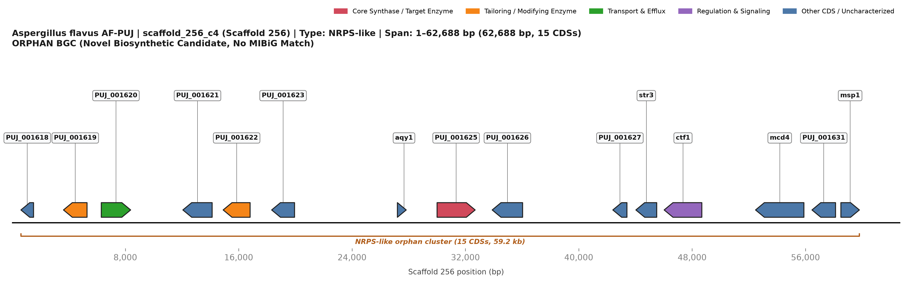](BGC_10_scaffold_256_c4_orphan_nrps_like.svg)

> *Figure 10: Publication-grade gene cluster diagram of `BGC_10_scaffold_256_c4_orphan_nrps_like` on Scaffold 256. Arrows indicate direction of transcription; boxes display standardized gene symbols or official locus tags. [Open scalable vector SVG](BGC_10_scaffold_256_c4_orphan_nrps_like.svg).*

#### Gene Inventory & Structural Qualifiers

| Locus Tag | Gene Symbol | Strand | Physical Span | Length | Putative Product & EC Number | Pfam / Domain Signatures |
| :--- | :---: | :---: | :---: | :---: | :--- | :--- |
| `PUJ_001618` | `PUJ_001618` | `-` | 633..1,524 | 279 aa | hypothetical protein | PF08030 (Ferric reductase NAD binding domain), PF08022 (FAD-binding domain) |
| `PUJ_001619` | `PUJ_001619` | `-` | 3,636..5,299 | 519 aa | hypothetical protein | PF00581 (Rhodanese-like domain), PF00291 (Pyridoxal-phosphate dependent enzyme) |
| `PUJ_001620` | `PUJ_001620` | `+` | 6,304..8,376 | 573 aa | hypothetical protein | PF07690 (Major Facilitator Superfamily) |
| `PUJ_001621` | `PUJ_001621` | `-` | 12,062..14,128 | 538 aa | hypothetical protein (`EC 1.14.13.22`) | PF00743 (Flavin-binding monooxygenase-like) |
| `PUJ_001622` | `PUJ_001622` | `-` | 14,905..16,807 | 567 aa | hypothetical protein | PF06609 (Fungal trichothecene efflux pump (TRI12)) |
| `PUJ_001623` | `PUJ_001623` | `-` | 18,327..19,943 | 538 aa | hypothetical protein (`EC 1.14.13.22`) | PF00743 (Flavin-binding monooxygenase-like) |
| `PUJ_001624` | `aqy1` | `+` | 27,512..27,823 | 72 aa | Aquaporin-1 | — |
| `PUJ_001625` | `PUJ_001625` | `+` | 30,001..32,688 | 828 aa | hypothetical protein | PF00501 (AMP-binding enzyme), PF00550 (Phosphopantetheine attachment site), PF07993 (Male sterility protein) |
| `PUJ_001626` | `PUJ_001626` | `-` | 33,890..36,037 | 715 aa | hypothetical protein | — |
| `PUJ_001627` | `PUJ_001627` | `-` | 42,404..43,400 | 312 aa | hypothetical protein | — |
| `PUJ_001628` | `str3` | `-` | 44,031..45,501 | 441 aa | cystathionine beta-lyase (`EC 4.4.1.8`) | PF01053 (Cys/Met metabolism PLP-dependent enzyme) |
| `PUJ_001629` | `ctf1` | `-` | 46,026..48,685 | 742 aa | Transcriptional activator of fatty acid utilization | PF04082 (Fungal specific transcription factor domain) |
| `PUJ_001630` | `mcd4` | `-` | 52,475..55,888 | 1022 aa | Glycosyl phosphatidyl inositol anchor synthesis | PF04987 (Phosphatidylinositolglycan class N (PIG-N)), PF01663 (Type I phosphodiesterase / nucleotide pyrophosphatase) |
| `PUJ_001631` | `PUJ_001631` | `-` | 56,458..58,121 | 536 aa | hypothetical protein | PF12539 (Chromosome segregation protein Csm1/Pcs1) |
| `PUJ_001632` | `msp1` | `+` | 58,498..59,803 | 417 aa | mitochondrial dynamin GTPase Msp1 (`EC 3.6.1.3`) | PF00004 (ATPase family associated with various cellular activities (AAA)), PF17862 (AAA+ lid domain) |

#### Putative Function & Enzymatic Mechanisms

- **`PUJ_001618`:** Hypothetical protein. Contains PF08030 (Ferric reductase NAD binding domain), PF08022 (FAD-binding domain). Hypothetical or accessory protein implicated in cluster function or localized metabolic support.
- **`PUJ_001619`:** Hypothetical protein. Contains PF00581 (Rhodanese-like domain), PF00291 (Pyridoxal-phosphate dependent enzyme). Hypothetical or accessory protein implicated in cluster function or localized metabolic support.
- **`PUJ_001620`:** Hypothetical protein. Contains PF07690 (Major Facilitator Superfamily). Hypothetical or accessory protein implicated in cluster function or localized metabolic support.
- **`PUJ_001621`:** Hypothetical protein (EC 1.14.13.22). Contains PF00743 (Flavin-binding monooxygenase-like). Hypothetical or accessory protein implicated in cluster function or localized metabolic support.
- **`PUJ_001622`:** Hypothetical protein. Contains PF06609 (Fungal trichothecene efflux pump (TRI12)). Hypothetical or accessory protein implicated in cluster function or localized metabolic support.
- **`PUJ_001623`:** Hypothetical protein (EC 1.14.13.22). Contains PF00743 (Flavin-binding monooxygenase-like). Hypothetical or accessory protein implicated in cluster function or localized metabolic support.
- **`PUJ_001624` (`aqy1`):** Aquaporin-1. Hypothetical or accessory protein implicated in cluster function or localized metabolic support.
- **`PUJ_001625`:** Hypothetical protein. Contains PF00501 (AMP-binding enzyme), PF00550 (Phosphopantetheine attachment site). Hypothetical or accessory protein implicated in cluster function or localized metabolic support.
- **`PUJ_001626`:** Hypothetical protein. Hypothetical or accessory protein implicated in cluster function or localized metabolic support.
- **`PUJ_001627`:** Hypothetical protein. Hypothetical or accessory protein implicated in cluster function or localized metabolic support.
- **`PUJ_001628` (`str3`):** Cystathionine beta-lyase (EC 4.4.1.8). Contains PF01053 (Cys/Met metabolism PLP-dependent enzyme). Hypothetical or accessory protein implicated in cluster function or localized metabolic support.
- **`PUJ_001629` (`ctf1`):** Transcriptional activator of fatty acid utilization. Contains PF04082 (Fungal specific transcription factor domain). Transcription factor regulating cluster expression in response to physiological or developmental cues.
- **`PUJ_001630` (`mcd4`):** Glycosyl phosphatidyl inositol anchor synthesis. Contains PF04987 (Phosphatidylinositolglycan class N (PIG-N)), PF01663 (Type I phosphodiesterase / nucleotide pyrophosphatase). Hypothetical or accessory protein implicated in cluster function or localized metabolic support.
- **`PUJ_001631`:** Hypothetical protein. Contains PF12539 (Chromosome segregation protein Csm1/Pcs1). Hypothetical or accessory protein implicated in cluster function or localized metabolic support.
- **`PUJ_001632` (`msp1`):** Mitochondrial dynamin gtpase msp1 (EC 3.6.1.3). Contains PF00004 (ATPase family associated with various cellular activities (AAA)), PF17862 (AAA+ lid domain). Hypothetical or accessory protein implicated in cluster function or localized metabolic support.

### Collective Pathway Architecture & Biological Synergy

This cluster represents a novel **orphan NRPS-like secondary metabolite biosynthetic gene cluster (BGC)**. Comprising 15 predicted CDSs, the locus harbors a dedicated core synthase supported by localized tailoring enzymes and transporter permeases with zero significant matches in MIBiG 3.1. It represents an uncharacterized secondary metabolite pathway within the *Aspergillus flavus* genome with potential bioactive chemical products.

---

### 11. Novel Orphan TERPENE Biosynthetic Gene Cluster (`Scaffold 256`)

- **Cluster Identifier:** `BGC_11_scaffold_256_c5_orphan_terpene` (`scaffold_256_c5`)  
- **Genomic Location:** Scaffold 256 | Span: 1–31,631 bp (31,631 bp, 12 CDSs)  
- **Pathway Class:** `terpene` | **Confidence Tier:** `ORPHAN`  

[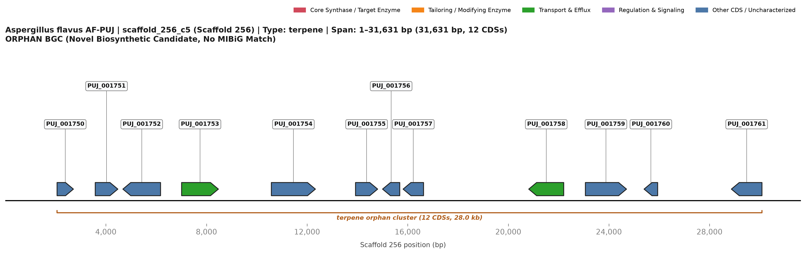](BGC_11_scaffold_256_c5_orphan_terpene.svg)

> *Figure 11: Publication-grade gene cluster diagram of `BGC_11_scaffold_256_c5_orphan_terpene` on Scaffold 256. Arrows indicate direction of transcription; boxes display standardized gene symbols or official locus tags. [Open scalable vector SVG](BGC_11_scaffold_256_c5_orphan_terpene.svg).*

#### Gene Inventory & Structural Qualifiers

| Locus Tag | Gene Symbol | Strand | Physical Span | Length | Putative Product & EC Number | Pfam / Domain Signatures |
| :--- | :---: | :---: | :---: | :---: | :--- | :--- |
| `PUJ_001750` | `PUJ_001750` | `+` | 2,060..2,710 | 181 aa | hypothetical protein (`EC 4.1.2.52`) | PF03328 (HpcH/HpaI aldolase/citrate lyase family) |
| `PUJ_001751` | `PUJ_001751` | `+` | 3,578..4,477 | 234 aa | hypothetical protein (`EC 3.1.3.37`) | PF00300 (Histidine phosphatase superfamily (branch 1)) |
| `PUJ_001752` | `PUJ_001752` | `-` | 4,677..6,175 | 463 aa | hypothetical protein | PF01266 (FAD dependent oxidoreductase) |
| `PUJ_001753` | `PUJ_001753` | `+` | 7,011..8,474 | 453 aa | hypothetical protein | PF07690 (Major Facilitator Superfamily) |
| `PUJ_001754` | `PUJ_001754` | `+` | 10,580..12,331 | 408 aa | hypothetical protein | PF13472 (GDSL-like Lipase/Acylhydrolase family) |
| `PUJ_001755` | `PUJ_001755` | `+` | 13,926..14,806 | 246 aa | hypothetical protein (`EC 1.6.2.2`) | PF00970 (Oxidoreductase FAD-binding domain), PF00175 (Oxidoreductase NAD-binding domain) |
| `PUJ_001756` | `PUJ_001756` | `-` | 15,001..15,685 | 212 aa | hypothetical protein | PF19086 (Terpene synthase family 2, C-terminal metal binding) |
| `PUJ_001757` | `PUJ_001757` | `-` | 15,817..16,631 | 174 aa | hypothetical protein | — |
| `PUJ_001758` | `PUJ_001758` | `-` | 20,813..22,204 | 463 aa | hypothetical protein | PF07690 (Major Facilitator Superfamily) |
| `PUJ_001759` | `PUJ_001759` | `+` | 23,065..24,700 | 442 aa | hypothetical protein | PF08241 (Methyltransferase domain) |
| `PUJ_001760` | `PUJ_001760` | `-` | 25,398..25,939 | 111 aa | hypothetical protein | — |
| `PUJ_001761` | `PUJ_001761` | `-` | 28,869..30,086 | 386 aa | hypothetical protein | — |

#### Putative Function & Enzymatic Mechanisms

- **`PUJ_001750`:** Hypothetical protein (EC 4.1.2.52). Contains PF03328 (HpcH/HpaI aldolase/citrate lyase family). Hypothetical or accessory protein implicated in cluster function or localized metabolic support.
- **`PUJ_001751`:** Hypothetical protein (EC 3.1.3.37). Contains PF00300 (Histidine phosphatase superfamily (branch 1)). Hypothetical or accessory protein implicated in cluster function or localized metabolic support.
- **`PUJ_001752`:** Hypothetical protein. Contains PF01266 (FAD dependent oxidoreductase). Hypothetical or accessory protein implicated in cluster function or localized metabolic support.
- **`PUJ_001753`:** Hypothetical protein. Contains PF07690 (Major Facilitator Superfamily). Hypothetical or accessory protein implicated in cluster function or localized metabolic support.
- **`PUJ_001754`:** Hypothetical protein. Contains PF13472 (GDSL-like Lipase/Acylhydrolase family). Hypothetical or accessory protein implicated in cluster function or localized metabolic support.
- **`PUJ_001755`:** Hypothetical protein (EC 1.6.2.2). Contains PF00970 (Oxidoreductase FAD-binding domain), PF00175 (Oxidoreductase NAD-binding domain). Hypothetical or accessory protein implicated in cluster function or localized metabolic support.
- **`PUJ_001756`:** Hypothetical protein. Contains PF19086 (Terpene synthase family 2, C-terminal metal binding). Hypothetical or accessory protein implicated in cluster function or localized metabolic support.
- **`PUJ_001757`:** Hypothetical protein. Hypothetical or accessory protein implicated in cluster function or localized metabolic support.
- **`PUJ_001758`:** Hypothetical protein. Contains PF07690 (Major Facilitator Superfamily). Hypothetical or accessory protein implicated in cluster function or localized metabolic support.
- **`PUJ_001759`:** Hypothetical protein. Contains PF08241 (Methyltransferase domain). Hypothetical or accessory protein implicated in cluster function or localized metabolic support.
- **`PUJ_001760`:** Hypothetical protein. Hypothetical or accessory protein implicated in cluster function or localized metabolic support.
- **`PUJ_001761`:** Hypothetical protein. Hypothetical or accessory protein implicated in cluster function or localized metabolic support.

### Collective Pathway Architecture & Biological Synergy

This cluster represents a novel **orphan terpene secondary metabolite biosynthetic gene cluster (BGC)**. Comprising 12 predicted CDSs, the locus harbors a dedicated core synthase supported by localized tailoring enzymes and transporter permeases with zero significant matches in MIBiG 3.1. It represents an uncharacterized secondary metabolite pathway within the *Aspergillus flavus* genome with potential bioactive chemical products.

---

### 12. Novel Orphan TERPENE Biosynthetic Gene Cluster (`Scaffold 256`)

- **Cluster Identifier:** `BGC_12_scaffold_256_c6_orphan_terpene` (`scaffold_256_c6`)  
- **Genomic Location:** Scaffold 256 | Span: 1–32,530 bp (32,530 bp, 14 CDSs)  
- **Pathway Class:** `terpene` | **Confidence Tier:** `ORPHAN`  

[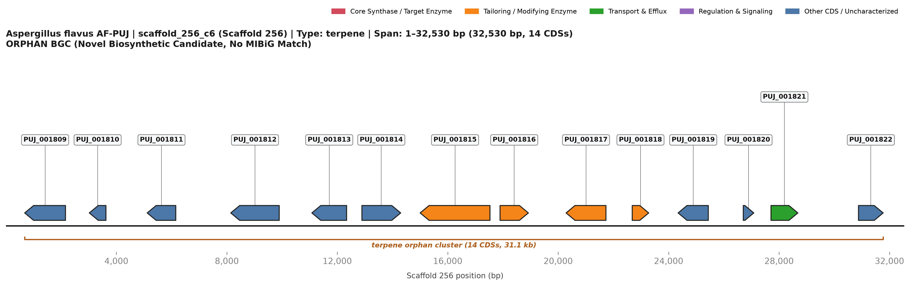](BGC_12_scaffold_256_c6_orphan_terpene.svg)

> *Figure 12: Publication-grade gene cluster diagram of `BGC_12_scaffold_256_c6_orphan_terpene` on Scaffold 256. Arrows indicate direction of transcription; boxes display standardized gene symbols or official locus tags. [Open scalable vector SVG](BGC_12_scaffold_256_c6_orphan_terpene.svg).*

#### Gene Inventory & Structural Qualifiers

| Locus Tag | Gene Symbol | Strand | Physical Span | Length | Putative Product & EC Number | Pfam / Domain Signatures |
| :--- | :---: | :---: | :---: | :---: | :--- | :--- |
| `PUJ_001809` | `PUJ_001809` | `-` | 680..2,157 | 452 aa | hypothetical protein | PF10104 (Di-sulfide bridge nucleocytoplasmic transport domain) |
| `PUJ_001810` | `PUJ_001810` | `-` | 3,020..3,622 | 182 aa | hypothetical protein | — |
| `PUJ_001811` | `PUJ_001811` | `-` | 5,117..6,151 | 344 aa | hypothetical protein | PF12697 (Alpha/beta hydrolase family) |
| `PUJ_001812` | `PUJ_001812` | `-` | 8,142..9,898 | 530 aa | hypothetical protein | PF00135 (Carboxylesterase family) |
| `PUJ_001813` | `PUJ_001813` | `-` | 11,080..12,338 | 352 aa | hypothetical protein | PF07859 (alpha/beta hydrolase fold) |
| `PUJ_001814` | `PUJ_001814` | `+` | 12,892..14,296 | 314 aa | hypothetical protein | — |
| `PUJ_001815` | `PUJ_001815` | `-` | 15,001..17,530 | 507 aa | hypothetical protein | PF19086 (Terpene synthase family 2, C-terminal metal binding), PF00106 (short chain dehydrogenase) |
| `PUJ_001816` | `PUJ_001816` | `+` | 17,895..18,920 | 225 aa | hypothetical protein | PF00067 (Cytochrome P450) |
| `PUJ_001817` | `PUJ_001817` | `-` | 20,286..21,730 | 370 aa | hypothetical protein | PF00067 (Cytochrome P450) |
| `PUJ_001818` | `PUJ_001818` | `+` | 22,682..23,278 | 198 aa | hypothetical protein | PF00067 (Cytochrome P450) |
| `PUJ_001819` | `PUJ_001819` | `-` | 24,343..25,437 | 364 aa | hypothetical protein | — |
| `PUJ_001820` | `PUJ_001820` | `+` | 26,703..27,084 | 105 aa | hypothetical protein | — |
| `PUJ_001821` | `PUJ_001821` | `+` | 27,707..28,679 | 305 aa | hypothetical protein | PF07690 (Major Facilitator Superfamily) |
| `PUJ_001822` | `PUJ_001822` | `+` | 30,876..31,769 | 297 aa | hypothetical protein | — |

#### Putative Function & Enzymatic Mechanisms

- **`PUJ_001809`:** Hypothetical protein. Contains PF10104 (Di-sulfide bridge nucleocytoplasmic transport domain). Hypothetical or accessory protein implicated in cluster function or localized metabolic support.
- **`PUJ_001810`:** Hypothetical protein. Hypothetical or accessory protein implicated in cluster function or localized metabolic support.
- **`PUJ_001811`:** Hypothetical protein. Contains PF12697 (Alpha/beta hydrolase family). Hypothetical or accessory protein implicated in cluster function or localized metabolic support.
- **`PUJ_001812`:** Hypothetical protein. Contains PF00135 (Carboxylesterase family). Hypothetical or accessory protein implicated in cluster function or localized metabolic support.
- **`PUJ_001813`:** Hypothetical protein. Contains PF07859 (alpha/beta hydrolase fold). Hypothetical or accessory protein implicated in cluster function or localized metabolic support.
- **`PUJ_001814`:** Hypothetical protein. Hypothetical or accessory protein implicated in cluster function or localized metabolic support.
- **`PUJ_001815`:** Hypothetical protein. Contains PF19086 (Terpene synthase family 2, C-terminal metal binding), PF00106 (short chain dehydrogenase). Hypothetical or accessory protein implicated in cluster function or localized metabolic support.
- **`PUJ_001816`:** Hypothetical protein. Contains PF00067 (Cytochrome P450). Hypothetical or accessory protein implicated in cluster function or localized metabolic support.
- **`PUJ_001817`:** Hypothetical protein. Contains PF00067 (Cytochrome P450). Hypothetical or accessory protein implicated in cluster function or localized metabolic support.
- **`PUJ_001818`:** Hypothetical protein. Contains PF00067 (Cytochrome P450). Hypothetical or accessory protein implicated in cluster function or localized metabolic support.
- **`PUJ_001819`:** Hypothetical protein. Hypothetical or accessory protein implicated in cluster function or localized metabolic support.
- **`PUJ_001820`:** Hypothetical protein. Hypothetical or accessory protein implicated in cluster function or localized metabolic support.
- **`PUJ_001821`:** Hypothetical protein. Contains PF07690 (Major Facilitator Superfamily). Hypothetical or accessory protein implicated in cluster function or localized metabolic support.
- **`PUJ_001822`:** Hypothetical protein. Hypothetical or accessory protein implicated in cluster function or localized metabolic support.

### Collective Pathway Architecture & Biological Synergy

This cluster represents a novel **orphan terpene secondary metabolite biosynthetic gene cluster (BGC)**. Comprising 14 predicted CDSs, the locus harbors a dedicated core synthase supported by localized tailoring enzymes and transporter permeases with zero significant matches in MIBiG 3.1. It represents an uncharacterized secondary metabolite pathway within the *Aspergillus flavus* genome with potential bioactive chemical products.

---

### 13. Aspercryptins Biosynthetic Gene Cluster (`Scaffold 256`)

- **Cluster Identifier:** `BGC_13_scaffold_256_c7_aspercryptins` (`scaffold_256_c7`)  
- **Genomic Location:** Scaffold 256 | Span: 1–94,533 bp (94,533 bp, 22 CDSs)  
- **Pathway Class:** `terpene` | **Confidence Tier:** `MEDIUM`  
- **antiSMASH KnownClusterBlast Top Hit:** `BGC0001515.4` — **aspercryptins** (Cumulative Score: 1,800.0, Identity: 47–67%, 3 proteins)  

[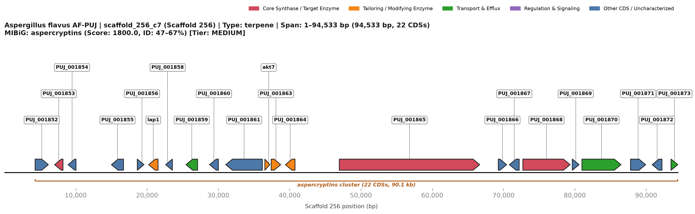](BGC_13_scaffold_256_c7_aspercryptins.svg)

> *Figure 13: Publication-grade gene cluster diagram of `BGC_13_scaffold_256_c7_aspercryptins` on Scaffold 256. Arrows indicate direction of transcription; boxes display standardized gene symbols or official locus tags. [Open scalable vector SVG](BGC_13_scaffold_256_c7_aspercryptins.svg).*

#### Gene Inventory & Structural Qualifiers

| Locus Tag | Gene Symbol | Strand | Physical Span | Length | Putative Product & EC Number | Pfam / Domain Signatures |
| :--- | :---: | :---: | :---: | :---: | :--- | :--- |
| `PUJ_001852` | `PUJ_001852` | `+` | 4,298..6,160 | 457 aa | hypothetical protein | PF01490 (Transmembrane amino acid transporter protein) |
| `PUJ_001853` | `PUJ_001853` | `-` | 7,033..8,209 | 348 aa | hypothetical protein | PF00107 (Zinc-binding dehydrogenase), PF08240 (Alcohol dehydrogenase GroES-like domain) |
| `PUJ_001854` | `PUJ_001854` | `-` | 8,921..10,036 | 371 aa | hypothetical protein | PF13378 (Enolase C-terminal domain-like), PF02746 (Mandelate racemase / muconate lactonizing enzyme, N-terminal domain) |
| `PUJ_001855` | `PUJ_001855` | `-` | 15,001..16,698 | 383 aa | hypothetical protein | PF00348 (Polyprenyl synthetase) |
| `PUJ_001856` | `PUJ_001856` | `+` | 19,016..19,570 | 184 aa | hypothetical protein | — |
| `PUJ_001857` | `lap1` | `-` | 20,221..21,543 | 377 aa | Leucine aminopeptidase 1 (`EC 3.4.11.10`) | PF04389 (Peptidase family M28) |
| `PUJ_001858` | `PUJ_001858` | `-` | 22,611..23,158 | 160 aa | hypothetical protein | — |
| `PUJ_001859` | `PUJ_001859` | `-` | 25,461..27,089 | 518 aa | hypothetical protein | PF07690 (Major Facilitator Superfamily) |
| `PUJ_001860` | `PUJ_001860` | `-` | 28,770..30,005 | 411 aa | hypothetical protein | PF00026 (Eukaryotic aspartyl protease) |
| `PUJ_001861` | `PUJ_001861` | `-` | 31,042..36,171 | 1616 aa | hypothetical protein (`EC 2.3.1.86`) | PF02801 (Beta-ketoacyl synthase, C-terminal domain), PF00109 (Beta-ketoacyl synthase, N-terminal domain), PF18314 (Fatty acid synthase type I helical domain) |
| `PUJ_001862` | `akt7` | `+` | 36,890..37,228 | 93 aa | Cytochrome P450 monooxygenase akt7 | — |
| `PUJ_001863` | `PUJ_001863` | `+` | 37,412..38,747 | 418 aa | hypothetical protein | PF00067 (Cytochrome P450) |
| `PUJ_001864` | `PUJ_001864` | `-` | 39,406..40,754 | 366 aa | hypothetical protein | PF01063 (Amino-transferase class IV) |
| `PUJ_001865` | `PUJ_001865` | `+` | 46,963..66,660 | 6506 aa | hypothetical protein | PF00501 (AMP-binding enzyme), PF00550 (Phosphopantetheine attachment site), PF00668 (Condensation domain) |
| `PUJ_001866` | `PUJ_001866` | `+` | 69,265..70,433 | 351 aa | hypothetical protein | PF12796 (Ankyrin repeats (3 copies)), PF13857 (Ankyrin repeats (many copies)) |
| `PUJ_001867` | `PUJ_001867` | `-` | 70,821..72,195 | 353 aa | hypothetical protein | PF04479 (RTA1 like protein) |
| `PUJ_001868` | `PUJ_001868` | `+` | 72,708..79,340 | 2147 aa | hypothetical protein (`EC 2.3.1.86`) | PF17828 (N-terminal domain in fatty acid synthase subunit beta), PF16073 (Starter unit:ACP transacylase in aflatoxin biosynthesis), PF08354 (Domain of unknown function (DUF1729)) |
| `PUJ_001869` | `PUJ_001869` | `+` | 79,643..80,599 | 289 aa | hypothetical protein | PF13279 (Thioesterase-like superfamily) |
| `PUJ_001870` | `PUJ_001870` | `+` | 81,000..86,476 | 1511 aa | hypothetical protein | PF00005 (ABC transporter), PF00664 (ABC transporter transmembrane region), PF00005 (ABC transporter) |
| `PUJ_001871` | `PUJ_001871` | `+` | 87,810..89,939 | 634 aa | hypothetical protein | PF07504 (Fungalysin/Thermolysin Propeptide Motif), PF02128 (Fungalysin metallopeptidase (M36)) |
| `PUJ_001872` | `PUJ_001872` | `-` | 90,848..92,221 | 457 aa | hypothetical protein | PF19527 (Family of unknown function (DUF6055)) |
| `PUJ_001873` | `PUJ_001873` | `+` | 93,491..94,443 | 318 aa | hypothetical protein | PF00324 (Amino acid permease) |

#### Putative Function & Enzymatic Mechanisms

- **`PUJ_001852`:** Hypothetical protein. Contains PF01490 (Transmembrane amino acid transporter protein). Hypothetical or accessory protein implicated in cluster function or localized metabolic support.
- **`PUJ_001853`:** Hypothetical protein. Contains PF00107 (Zinc-binding dehydrogenase), PF08240 (Alcohol dehydrogenase GroES-like domain). Hypothetical or accessory protein implicated in cluster function or localized metabolic support.
- **`PUJ_001854`:** Hypothetical protein. Contains PF13378 (Enolase C-terminal domain-like), PF02746 (Mandelate racemase / muconate lactonizing enzyme, N-terminal domain). Hypothetical or accessory protein implicated in cluster function or localized metabolic support.
- **`PUJ_001855`:** Hypothetical protein. Contains PF00348 (Polyprenyl synthetase). Hypothetical or accessory protein implicated in cluster function or localized metabolic support.
- **`PUJ_001856`:** Hypothetical protein. Hypothetical or accessory protein implicated in cluster function or localized metabolic support.
- **`PUJ_001857` (`lap1`):** Leucine aminopeptidase 1 (EC 3.4.11.10). Contains PF04389 (Peptidase family M28). Hydrolytic enzyme cleaving ester or amide bonds during substrate channeling or pathway maturation.
- **`PUJ_001858`:** Hypothetical protein. Hypothetical or accessory protein implicated in cluster function or localized metabolic support.
- **`PUJ_001859`:** Hypothetical protein. Contains PF07690 (Major Facilitator Superfamily). Hypothetical or accessory protein implicated in cluster function or localized metabolic support.
- **`PUJ_001860`:** Hypothetical protein. Contains PF00026 (Eukaryotic aspartyl protease). Hypothetical or accessory protein implicated in cluster function or localized metabolic support.
- **`PUJ_001861`:** Hypothetical protein (EC 2.3.1.86). Contains PF02801 (Beta-ketoacyl synthase, C-terminal domain), PF00109 (Beta-ketoacyl synthase, N-terminal domain). Hypothetical or accessory protein implicated in cluster function or localized metabolic support.
- **`PUJ_001862` (`akt7`):** Cytochrome p450 monooxygenase akt7. Performs regio- and stereospecific oxidative tailoring of the secondary metabolite intermediate.
- **`PUJ_001863`:** Hypothetical protein. Contains PF00067 (Cytochrome P450). Hypothetical or accessory protein implicated in cluster function or localized metabolic support.
- **`PUJ_001864`:** Hypothetical protein. Contains PF01063 (Amino-transferase class IV). Hypothetical or accessory protein implicated in cluster function or localized metabolic support.
- **`PUJ_001865`:** Hypothetical protein. Contains PF00501 (AMP-binding enzyme), PF00550 (Phosphopantetheine attachment site). Hypothetical or accessory protein implicated in cluster function or localized metabolic support.
- **`PUJ_001866`:** Hypothetical protein. Contains PF12796 (Ankyrin repeats (3 copies)), PF13857 (Ankyrin repeats (many copies)). Hypothetical or accessory protein implicated in cluster function or localized metabolic support.
- **`PUJ_001867`:** Hypothetical protein. Contains PF04479 (RTA1 like protein). Hypothetical or accessory protein implicated in cluster function or localized metabolic support.
- **`PUJ_001868`:** Hypothetical protein (EC 2.3.1.86). Contains PF17828 (N-terminal domain in fatty acid synthase subunit beta), PF16073 (Starter unit:ACP transacylase in aflatoxin biosynthesis). Hypothetical or accessory protein implicated in cluster function or localized metabolic support.
- **`PUJ_001869`:** Hypothetical protein. Contains PF13279 (Thioesterase-like superfamily). Hypothetical or accessory protein implicated in cluster function or localized metabolic support.
- **`PUJ_001870`:** Hypothetical protein. Contains PF00005 (ABC transporter), PF00664 (ABC transporter transmembrane region). Hypothetical or accessory protein implicated in cluster function or localized metabolic support.
- **`PUJ_001871`:** Hypothetical protein. Contains PF07504 (Fungalysin/Thermolysin Propeptide Motif), PF02128 (Fungalysin metallopeptidase (M36)). Hypothetical or accessory protein implicated in cluster function or localized metabolic support.
- **`PUJ_001872`:** Hypothetical protein. Contains PF19527 (Family of unknown function (DUF6055)). Hypothetical or accessory protein implicated in cluster function or localized metabolic support.
- **`PUJ_001873`:** Hypothetical protein. Contains PF00324 (Amino acid permease). Hypothetical or accessory protein implicated in cluster function or localized metabolic support.

### Collective Pathway Architecture & Biological Synergy

This cluster exhibits significant homology to the characterized MIBiG reference for **aspercryptins** (MIBiG accession `BGC0001515.4`, score 1,800.0, identities 47–67%). The cluster features 22 coordinated CDSs encoding core synthases, tailoring oxidoreductases/transferases, and transmembrane efflux transporters that function collectively to synthesize, modify, and excrete bioactive terpene compounds.

---

### 14. Novel Orphan T1PKS Biosynthetic Gene Cluster (`Scaffold 258`)

- **Cluster Identifier:** `BGC_14_scaffold_258_c1_orphan_t1pks` (`scaffold_258_c1`)  
- **Genomic Location:** Scaffold 258 | Span: 1–67,340 bp (67,340 bp, 16 CDSs)  
- **Pathway Class:** `T1PKS` | **Confidence Tier:** `ORPHAN`  

[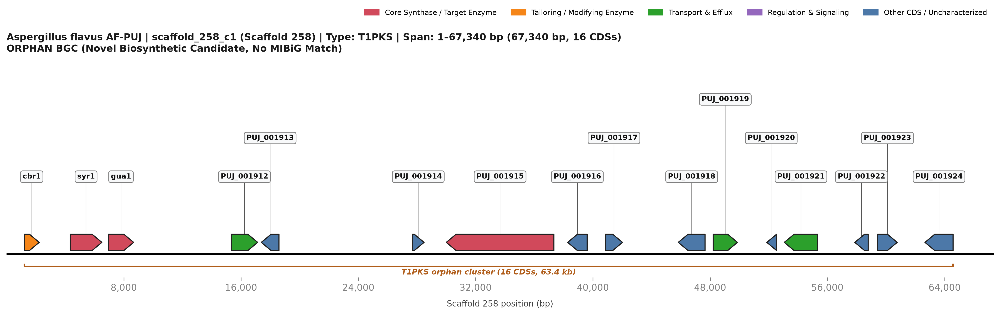](BGC_14_scaffold_258_c1_orphan_t1pks.svg)

> *Figure 14: Publication-grade gene cluster diagram of `BGC_14_scaffold_258_c1_orphan_t1pks` on Scaffold 258. Arrows indicate direction of transcription; boxes display standardized gene symbols or official locus tags. [Open scalable vector SVG](BGC_14_scaffold_258_c1_orphan_t1pks.svg).*

#### Gene Inventory & Structural Qualifiers

| Locus Tag | Gene Symbol | Strand | Physical Span | Length | Putative Product & EC Number | Pfam / Domain Signatures |
| :--- | :---: | :---: | :---: | :---: | :--- | :--- |
| `PUJ_001909` | `cbr1` | `+` | 1,212..2,230 | 292 aa | NADH-cytochrome b5 reductase (`EC 1.6.2.2`) | PF00970 (Oxidoreductase FAD-binding domain), PF00175 (Oxidoreductase NAD-binding domain) |
| `PUJ_001910` | `syr1` | `+` | 4,345..6,505 | 648 aa | arginyl-tRNA synthetase (`EC 6.1.1.19`) | PF00750 (tRNA synthetases class I (R)), PF05746 (DALR anticodon binding domain) |
| `PUJ_001911` | `gua1` | `+` | 6,949..8,672 | 541 aa | GMP synthase (glutamine-hydrolyzing) (`EC 6.3.5.2`) | PF00117 (Glutamine amidotransferase class-I), PF02540 (NAD synthase), PF00958 (GMP synthase C terminal domain) |
| `PUJ_001912` | `PUJ_001912` | `+` | 15,336..17,133 | 563 aa | hypothetical protein | PF06609 (Fungal trichothecene efflux pump (TRI12)), PF07690 (Major Facilitator Superfamily) |
| `PUJ_001913` | `PUJ_001913` | `-` | 17,381..18,585 | 350 aa | hypothetical protein (`EC 1.14.18.1`) | PF00264 (Common central domain of tyrosinase) |
| `PUJ_001914` | `PUJ_001914` | `+` | 27,694..28,485 | 150 aa | hypothetical protein | — |
| `PUJ_001915` | `PUJ_001915` | `-` | 30,001..37,340 | 2381 aa | hypothetical protein | PF00550 (Phosphopantetheine attachment site), PF08659 (KR domain), PF13602 (Zinc-binding dehydrogenase) |
| `PUJ_001916` | `PUJ_001916` | `-` | 38,280..39,611 | 443 aa | hypothetical protein | — |
| `PUJ_001917` | `PUJ_001917` | `+` | 40,860..42,022 | 362 aa | hypothetical protein | — |
| `PUJ_001918` | `PUJ_001918` | `-` | 45,827..47,653 | 608 aa | hypothetical protein | PF14864 (Alkyl sulfatase C-terminal), PF14863 (Alkyl sulfatase dimerisation), PF00753 (Metallo-beta-lactamase superfamily) |
| `PUJ_001919` | `PUJ_001919` | `+` | 48,206..49,865 | 340 aa | hypothetical protein | PF07690 (Major Facilitator Superfamily) |
| `PUJ_001920` | `PUJ_001920` | `-` | 51,869..52,472 | 179 aa | hypothetical protein | — |
| `PUJ_001921` | `PUJ_001921` | `-` | 53,060..55,336 | 619 aa | hypothetical protein | PF01061 (ABC-2 type transporter), PF19055 (ABC-2 type transporter), PF00005 (ABC transporter) |
| `PUJ_001922` | `PUJ_001922` | `-` | 57,870..58,781 | 303 aa | hypothetical protein | — |
| `PUJ_001923` | `PUJ_001923` | `+` | 59,433..60,764 | 443 aa | hypothetical protein | PF01432 (Peptidase family M3) |
| `PUJ_001924` | `PUJ_001924` | `-` | 62,657..64,573 | 638 aa | hypothetical protein | — |

#### Putative Function & Enzymatic Mechanisms

- **`PUJ_001909` (`cbr1`):** Nadh-cytochrome b5 reductase (EC 1.6.2.2). Contains PF00970 (Oxidoreductase FAD-binding domain), PF00175 (Oxidoreductase NAD-binding domain). Oxidoreductase tailoring enzyme driving intermediate redox transformation.
- **`PUJ_001910` (`syr1`):** Arginyl-trna synthetase (EC 6.1.1.19). Contains PF00750 (tRNA synthetases class I (R)), PF05746 (DALR anticodon binding domain). Catalyzes core biosynthetic condensation or macrocyclization reactions in the pathway.
- **`PUJ_001911` (`gua1`):** Gmp synthase (glutamine-hydrolyzing) (EC 6.3.5.2). Contains PF00117 (Glutamine amidotransferase class-I), PF02540 (NAD synthase). Catalyzes core biosynthetic condensation or macrocyclization reactions in the pathway.
- **`PUJ_001912`:** Hypothetical protein. Contains PF06609 (Fungal trichothecene efflux pump (TRI12)), PF07690 (Major Facilitator Superfamily). Hypothetical or accessory protein implicated in cluster function or localized metabolic support.
- **`PUJ_001913`:** Hypothetical protein (EC 1.14.18.1). Contains PF00264 (Common central domain of tyrosinase). Hypothetical or accessory protein implicated in cluster function or localized metabolic support.
- **`PUJ_001914`:** Hypothetical protein. Hypothetical or accessory protein implicated in cluster function or localized metabolic support.
- **`PUJ_001915`:** Hypothetical protein. Contains PF00550 (Phosphopantetheine attachment site), PF08659 (KR domain). Hypothetical or accessory protein implicated in cluster function or localized metabolic support.
- **`PUJ_001916`:** Hypothetical protein. Hypothetical or accessory protein implicated in cluster function or localized metabolic support.
- **`PUJ_001917`:** Hypothetical protein. Hypothetical or accessory protein implicated in cluster function or localized metabolic support.
- **`PUJ_001918`:** Hypothetical protein. Contains PF14864 (Alkyl sulfatase C-terminal), PF14863 (Alkyl sulfatase dimerisation). Hypothetical or accessory protein implicated in cluster function or localized metabolic support.
- **`PUJ_001919`:** Hypothetical protein. Contains PF07690 (Major Facilitator Superfamily). Hypothetical or accessory protein implicated in cluster function or localized metabolic support.
- **`PUJ_001920`:** Hypothetical protein. Hypothetical or accessory protein implicated in cluster function or localized metabolic support.
- **`PUJ_001921`:** Hypothetical protein. Contains PF01061 (ABC-2 type transporter), PF19055 (ABC-2 type transporter). Hypothetical or accessory protein implicated in cluster function or localized metabolic support.
- **`PUJ_001922`:** Hypothetical protein. Hypothetical or accessory protein implicated in cluster function or localized metabolic support.
- **`PUJ_001923`:** Hypothetical protein. Contains PF01432 (Peptidase family M3). Hypothetical or accessory protein implicated in cluster function or localized metabolic support.
- **`PUJ_001924`:** Hypothetical protein. Hypothetical or accessory protein implicated in cluster function or localized metabolic support.

### Collective Pathway Architecture & Biological Synergy

This cluster represents a novel **orphan T1PKS secondary metabolite biosynthetic gene cluster (BGC)**. Comprising 16 predicted CDSs, the locus harbors a dedicated core synthase supported by localized tailoring enzymes and transporter permeases with zero significant matches in MIBiG 3.1. It represents an uncharacterized secondary metabolite pathway within the *Aspergillus flavus* genome with potential bioactive chemical products.

---

### 15. Novel Orphan T1PKS Biosynthetic Gene Cluster (`Scaffold 258`)

- **Cluster Identifier:** `BGC_15_scaffold_258_c2_orphan_t1pks` (`scaffold_258_c2`)  
- **Genomic Location:** Scaffold 258 | Span: 1–68,435 bp (68,435 bp, 21 CDSs)  
- **Pathway Class:** `T1PKS` | **Confidence Tier:** `ORPHAN`  

[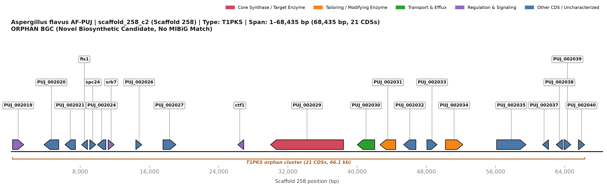](BGC_15_scaffold_258_c2_orphan_t1pks.svg)

> *Figure 15: Publication-grade gene cluster diagram of `BGC_15_scaffold_258_c2_orphan_t1pks` on Scaffold 258. Arrows indicate direction of transcription; boxes display standardized gene symbols or official locus tags. [Open scalable vector SVG](BGC_15_scaffold_258_c2_orphan_t1pks.svg).*

#### Gene Inventory & Structural Qualifiers

| Locus Tag | Gene Symbol | Strand | Physical Span | Length | Putative Product & EC Number | Pfam / Domain Signatures |
| :--- | :---: | :---: | :---: | :---: | :--- | :--- |
| `PUJ_002019` | `PUJ_002019` | `+` | 178..1,475 | 312 aa | hypothetical protein | PF00069 (Protein kinase domain) |
| `PUJ_002020` | `PUJ_002020` | `-` | 3,824..5,515 | 529 aa | hypothetical protein | PF07969 (Amidohydrolase family) |
| `PUJ_002021` | `PUJ_002021` | `-` | 6,240..7,448 | 379 aa | hypothetical protein (`EC 2.3.2.27`) | PF13639 (Ring finger domain) |
| `PUJ_002022` | `fis1` | `-` | 8,159..8,808 | 153 aa | Mitochondrial fission 1 protein | PF14853 (Fis1 C-terminal tetratricopeptide repeat), PF14852 (Fis1 N-terminal tetratricopeptide repeat) |
| `PUJ_002023` | `spc24` | `+` | 9,102..9,802 | 200 aa | putative kinetochore protein spc24 | PF08286 (Spc24 subunit of Ndc80) |
| `PUJ_002024` | `PUJ_002024` | `-` | 9,995..10,963 | 322 aa | hypothetical protein | PF10356 (Protein of unknown function (DUF2034)), PF10356 (Protein of unknown function (DUF2034)) |
| `PUJ_002025` | `srb7` | `+` | 11,227..11,921 | 208 aa | Mediator of RNA polymerase II transcription subunit 21 | PF11221 (Subunit 21 of Mediator complex) |
| `PUJ_002026` | `PUJ_002026` | `+` | 14,514..15,109 | 179 aa | hypothetical protein | PF01822 (WSC domain) |
| `PUJ_002027` | `PUJ_002027` | `+` | 17,568..19,063 | 450 aa | hypothetical protein | PF01565 (FAD binding domain), PF08031 (Berberine and berberine like) |
| `PUJ_002028` | `ctf1` | `-` | 26,223..26,669 | 148 aa | Transcriptional activator of fatty acid utilization | PF04082 (Fungal specific transcription factor domain) |
| `PUJ_002029` | `PUJ_002029` | `-` | 30,001..38,435 | 2641 aa | hypothetical protein | PF00550 (Phosphopantetheine attachment site), PF08659 (KR domain), PF13602 (Zinc-binding dehydrogenase) |
| `PUJ_002030` | `PUJ_002030` | `-` | 40,029..42,041 | 482 aa | hypothetical protein | PF07690 (Major Facilitator Superfamily) |
| `PUJ_002031` | `PUJ_002031` | `-` | 42,661..44,466 | 460 aa | hypothetical protein | PF00067 (Cytochrome P450), PF00067 (Cytochrome P450) |
| `PUJ_002032` | `PUJ_002032` | `-` | 45,379..46,800 | 442 aa | hypothetical protein | PF07859 (alpha/beta hydrolase fold) |
| `PUJ_002033` | `PUJ_002033` | `+` | 48,073..49,246 | 375 aa | hypothetical protein | — |
| `PUJ_002034` | `PUJ_002034` | `+` | 50,213..52,223 | 559 aa | hypothetical protein (`EC 1.14.13.22`) | PF13450 (NAD(P)-binding Rossmann-like domain), PF13434 (L-lysine 6-monooxygenase/L-ornithine 5-monooxygenase) |
| `PUJ_002035` | `PUJ_002035` | `+` | 56,129..59,521 | 1112 aa | hypothetical protein (`EC 2.7.1.67`) | PF00176 (SNF2-related domain), PF00271 (Helicase conserved C-terminal domain) |
| `PUJ_002037` | `PUJ_002037` | `-` | 61,448..61,784 | 86 aa | hypothetical protein | — |
| `PUJ_002038` | `PUJ_002038` | `-` | 63,019..63,739 | 97 aa | hypothetical protein | — |
| `PUJ_002039` | `PUJ_002039` | `+` | 63,908..64,711 | 259 aa | hypothetical protein | — |
| `PUJ_002040` | `PUJ_002040` | `+` | 65,581..66,303 | 127 aa | hypothetical protein | — |

#### Putative Function & Enzymatic Mechanisms

- **`PUJ_002019`:** Hypothetical protein. Contains PF00069 (Protein kinase domain). Hypothetical or accessory protein implicated in cluster function or localized metabolic support.
- **`PUJ_002020`:** Hypothetical protein. Contains PF07969 (Amidohydrolase family). Hypothetical or accessory protein implicated in cluster function or localized metabolic support.
- **`PUJ_002021`:** Hypothetical protein (EC 2.3.2.27). Contains PF13639 (Ring finger domain). Hypothetical or accessory protein implicated in cluster function or localized metabolic support.
- **`PUJ_002022` (`fis1`):** Mitochondrial fission 1 protein. Contains PF14853 (Fis1 C-terminal tetratricopeptide repeat), PF14852 (Fis1 N-terminal tetratricopeptide repeat). Hypothetical or accessory protein implicated in cluster function or localized metabolic support.
- **`PUJ_002023` (`spc24`):** Putative kinetochore protein spc24. Contains PF08286 (Spc24 subunit of Ndc80). Hypothetical or accessory protein implicated in cluster function or localized metabolic support.
- **`PUJ_002024`:** Hypothetical protein. Contains PF10356 (Protein of unknown function (DUF2034)), PF10356 (Protein of unknown function (DUF2034)). Hypothetical or accessory protein implicated in cluster function or localized metabolic support.
- **`PUJ_002025` (`srb7`):** Mediator of rna polymerase ii transcription subunit 21. Contains PF11221 (Subunit 21 of Mediator complex). Transcription factor regulating cluster expression in response to physiological or developmental cues.
- **`PUJ_002026`:** Hypothetical protein. Contains PF01822 (WSC domain). Hypothetical or accessory protein implicated in cluster function or localized metabolic support.
- **`PUJ_002027`:** Hypothetical protein. Contains PF01565 (FAD binding domain), PF08031 (Berberine and berberine like). Hypothetical or accessory protein implicated in cluster function or localized metabolic support.
- **`PUJ_002028` (`ctf1`):** Transcriptional activator of fatty acid utilization. Contains PF04082 (Fungal specific transcription factor domain). Transcription factor regulating cluster expression in response to physiological or developmental cues.
- **`PUJ_002029`:** Hypothetical protein. Contains PF00550 (Phosphopantetheine attachment site), PF08659 (KR domain). Hypothetical or accessory protein implicated in cluster function or localized metabolic support.
- **`PUJ_002030`:** Hypothetical protein. Contains PF07690 (Major Facilitator Superfamily). Hypothetical or accessory protein implicated in cluster function or localized metabolic support.
- **`PUJ_002031`:** Hypothetical protein. Contains PF00067 (Cytochrome P450), PF00067 (Cytochrome P450). Hypothetical or accessory protein implicated in cluster function or localized metabolic support.
- **`PUJ_002032`:** Hypothetical protein. Contains PF07859 (alpha/beta hydrolase fold). Hypothetical or accessory protein implicated in cluster function or localized metabolic support.
- **`PUJ_002033`:** Hypothetical protein. Hypothetical or accessory protein implicated in cluster function or localized metabolic support.
- **`PUJ_002034`:** Hypothetical protein (EC 1.14.13.22). Contains PF13450 (NAD(P)-binding Rossmann-like domain), PF13434 (L-lysine 6-monooxygenase/L-ornithine 5-monooxygenase). Hypothetical or accessory protein implicated in cluster function or localized metabolic support.
- **`PUJ_002035`:** Hypothetical protein (EC 2.7.1.67). Contains PF00176 (SNF2-related domain), PF00271 (Helicase conserved C-terminal domain). Hypothetical or accessory protein implicated in cluster function or localized metabolic support.
- **`PUJ_002037`:** Hypothetical protein. Hypothetical or accessory protein implicated in cluster function or localized metabolic support.
- **`PUJ_002038`:** Hypothetical protein. Hypothetical or accessory protein implicated in cluster function or localized metabolic support.
- **`PUJ_002039`:** Hypothetical protein. Hypothetical or accessory protein implicated in cluster function or localized metabolic support.
- **`PUJ_002040`:** Hypothetical protein. Hypothetical or accessory protein implicated in cluster function or localized metabolic support.

### Collective Pathway Architecture & Biological Synergy

This cluster represents a novel **orphan T1PKS secondary metabolite biosynthetic gene cluster (BGC)**. Comprising 21 predicted CDSs, the locus harbors a dedicated core synthase supported by localized tailoring enzymes and transporter permeases with zero significant matches in MIBiG 3.1. It represents an uncharacterized secondary metabolite pathway within the *Aspergillus flavus* genome with potential bioactive chemical products.

---

### 16. Flavunoidine Biosynthetic Gene Cluster (`Scaffold 258`)

- **Cluster Identifier:** `BGC_16_scaffold_258_c3_flavunoidine` (`scaffold_258_c3`)  
- **Genomic Location:** Scaffold 258 | Span: 1–63,216 bp (63,216 bp, 19 CDSs)  
- **Pathway Class:** `NRPS` | **Confidence Tier:** `HIGH`  
- **antiSMASH KnownClusterBlast Top Hit:** `BGC0002248.3` — **flavunoidine** (Cumulative Score: 7,818.0, Identity: 93–100%, 7 proteins)  

[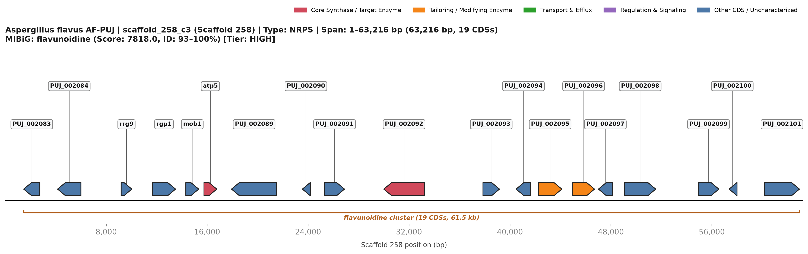](BGC_16_scaffold_258_c3_flavunoidine.svg)

> *Figure 16: Publication-grade gene cluster diagram of `BGC_16_scaffold_258_c3_flavunoidine` on Scaffold 258. Arrows indicate direction of transcription; boxes display standardized gene symbols or official locus tags. [Open scalable vector SVG](BGC_16_scaffold_258_c3_flavunoidine.svg).*

#### Gene Inventory & Structural Qualifiers

| Locus Tag | Gene Symbol | Strand | Physical Span | Length | Putative Product & EC Number | Pfam / Domain Signatures |
| :--- | :---: | :---: | :---: | :---: | :--- | :--- |
| `PUJ_002083` | `PUJ_002083` | `-` | 1,459..2,741 | 374 aa | hypothetical protein | PF01156 (Inosine-uridine preferring nucleoside hydrolase) |
| `PUJ_002084` | `PUJ_002084` | `-` | 4,144..5,997 | 547 aa | hypothetical protein | — |
| `PUJ_002085` | `rrg9` | `+` | 9,181..10,035 | 284 aa | Required for respiratory growth protein 9 mitochondrial | PF06413 (Neugrin) |
| `PUJ_002086` | `rgp1` | `+` | 11,665..13,500 | 591 aa | Golgi membrane exchange factor (Ric1p-Rgp1p) subunit | PF08737 (Rgp1) |
| `PUJ_002087` | `mob1` | `+` | 14,314..15,335 | 284 aa | Mitotic exit network component | PF03637 (Mob1/phocein family) |
| `PUJ_002088` | `atp5` | `+` | 15,749..16,769 | 226 aa | ATP synthase F0 subcomplex subunit OSCP atp5 | PF00213 (ATP synthase delta (OSCP) subunit) |
| `PUJ_002089` | `PUJ_002089` | `-` | 17,929..21,517 | 1005 aa | hypothetical protein | PF03200 (Glycosyl hydrolase family 63 C-terminal domain) |
| `PUJ_002090` | `PUJ_002090` | `-` | 23,547..24,110 | 187 aa | hypothetical protein | PF06687 (SUR7/PalI family) |
| `PUJ_002091` | `PUJ_002091` | `+` | 25,305..26,890 | 502 aa | hypothetical protein (`EC 3.1.1.73`) | PF07519 (Tannase and feruloyl esterase) |
| `PUJ_002092` | `PUJ_002092` | `-` | 30,001..33,216 | 1071 aa | hypothetical protein | PF00668 (Condensation domain), PF00550 (Phosphopantetheine attachment site), PF00501 (AMP-binding enzyme) |
| `PUJ_002093` | `PUJ_002093` | `+` | 37,862..39,175 | 366 aa | hypothetical protein | PF19086 (Terpene synthase family 2, C-terminal metal binding) |
| `PUJ_002094` | `PUJ_002094` | `-` | 40,485..41,657 | 390 aa | hypothetical protein | PF06330 (Trichodiene synthase (TRI5)) |
| `PUJ_002095` | `PUJ_002095` | `+` | 42,262..44,116 | 511 aa | hypothetical protein | PF00067 (Cytochrome P450) |
| `PUJ_002096` | `PUJ_002096` | `+` | 44,977..46,706 | 532 aa | hypothetical protein | PF00067 (Cytochrome P450) |
| `PUJ_002097` | `PUJ_002097` | `-` | 47,014..48,115 | 304 aa | hypothetical protein | PF05368 (NmrA-like family) |
| `PUJ_002098` | `PUJ_002098` | `+` | 49,088..51,559 | 823 aa | hypothetical protein | PF01053 (Cys/Met metabolism PLP-dependent enzyme), PF10014 (2OG-Fe dioxygenase) |
| `PUJ_002099` | `PUJ_002099` | `+` | 54,919..56,563 | 507 aa | hypothetical protein | PF01565 (FAD binding domain) |
| `PUJ_002100` | `PUJ_002100` | `-` | 57,371..57,874 | 112 aa | hypothetical protein | — |
| `PUJ_002101` | `PUJ_002101` | `+` | 60,173..62,950 | 925 aa | hypothetical protein | PF00439 (Bromodomain) |

#### Putative Function & Enzymatic Mechanisms

- **`PUJ_002083`:** Hypothetical protein. Contains PF01156 (Inosine-uridine preferring nucleoside hydrolase). Hypothetical or accessory protein implicated in cluster function or localized metabolic support.
- **`PUJ_002084`:** Hypothetical protein. Hypothetical or accessory protein implicated in cluster function or localized metabolic support.
- **`PUJ_002085` (`rrg9`):** Required for respiratory growth protein 9 mitochondrial. Contains PF06413 (Neugrin). Hypothetical or accessory protein implicated in cluster function or localized metabolic support.
- **`PUJ_002086` (`rgp1`):** Golgi membrane exchange factor (ric1p-rgp1p) subunit. Contains PF08737 (Rgp1). Hypothetical or accessory protein implicated in cluster function or localized metabolic support.
- **`PUJ_002087` (`mob1`):** Mitotic exit network component. Contains PF03637 (Mob1/phocein family). Hypothetical or accessory protein implicated in cluster function or localized metabolic support.
- **`PUJ_002088` (`atp5`):** Atp synthase f0 subcomplex subunit oscp atp5. Contains PF00213 (ATP synthase delta (OSCP) subunit). Catalyzes core biosynthetic condensation or macrocyclization reactions in the pathway.
- **`PUJ_002089`:** Hypothetical protein. Contains PF03200 (Glycosyl hydrolase family 63 C-terminal domain). Hypothetical or accessory protein implicated in cluster function or localized metabolic support.
- **`PUJ_002090`:** Hypothetical protein. Contains PF06687 (SUR7/PalI family). Hypothetical or accessory protein implicated in cluster function or localized metabolic support.
- **`PUJ_002091`:** Hypothetical protein (EC 3.1.1.73). Contains PF07519 (Tannase and feruloyl esterase). Hypothetical or accessory protein implicated in cluster function or localized metabolic support.
- **`PUJ_002092`:** Hypothetical protein. Contains PF00668 (Condensation domain), PF00550 (Phosphopantetheine attachment site). Hypothetical or accessory protein implicated in cluster function or localized metabolic support.
- **`PUJ_002093`:** Hypothetical protein. Contains PF19086 (Terpene synthase family 2, C-terminal metal binding). Hypothetical or accessory protein implicated in cluster function or localized metabolic support.
- **`PUJ_002094`:** Hypothetical protein. Contains PF06330 (Trichodiene synthase (TRI5)). Hypothetical or accessory protein implicated in cluster function or localized metabolic support.
- **`PUJ_002095`:** Hypothetical protein. Contains PF00067 (Cytochrome P450). Hypothetical or accessory protein implicated in cluster function or localized metabolic support.
- **`PUJ_002096`:** Hypothetical protein. Contains PF00067 (Cytochrome P450). Hypothetical or accessory protein implicated in cluster function or localized metabolic support.
- **`PUJ_002097`:** Hypothetical protein. Contains PF05368 (NmrA-like family). Hypothetical or accessory protein implicated in cluster function or localized metabolic support.
- **`PUJ_002098`:** Hypothetical protein. Contains PF01053 (Cys/Met metabolism PLP-dependent enzyme), PF10014 (2OG-Fe dioxygenase). Hypothetical or accessory protein implicated in cluster function or localized metabolic support.
- **`PUJ_002099`:** Hypothetical protein. Contains PF01565 (FAD binding domain). Hypothetical or accessory protein implicated in cluster function or localized metabolic support.
- **`PUJ_002100`:** Hypothetical protein. Hypothetical or accessory protein implicated in cluster function or localized metabolic support.
- **`PUJ_002101`:** Hypothetical protein. Contains PF00439 (Bromodomain). Hypothetical or accessory protein implicated in cluster function or localized metabolic support.

### Collective Pathway Architecture & Biological Synergy

This cluster exhibits significant homology to the characterized MIBiG reference for **flavunoidine** (MIBiG accession `BGC0002248.3`, score 7,818.0, identities 93–100%). The cluster features 19 coordinated CDSs encoding core synthases, tailoring oxidoreductases/transferases, and transmembrane efflux transporters that function collectively to synthesize, modify, and excrete bioactive NRPS compounds.

---

### 17. Astellolide A Biosynthetic Gene Cluster (`Scaffold 258`)

- **Cluster Identifier:** `BGC_17_scaffold_258_c4_astellolide_a` (`scaffold_258_c4`)  
- **Genomic Location:** Scaffold 258 | Span: 1–68,868 bp (68,868 bp, 20 CDSs)  
- **Pathway Class:** `terpene` | **Confidence Tier:** `HIGH`  
- **antiSMASH KnownClusterBlast Top Hit:** `BGC0001518.3` — **astellolide A** (Cumulative Score: 8,724.0, Identity: 97–99%, 8 proteins)  

[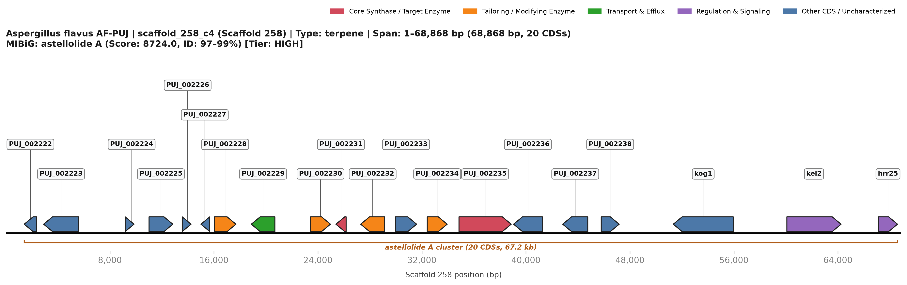](BGC_17_scaffold_258_c4_astellolide_a.svg)

> *Figure 17: Publication-grade gene cluster diagram of `BGC_17_scaffold_258_c4_astellolide_a` on Scaffold 258. Arrows indicate direction of transcription; boxes display standardized gene symbols or official locus tags. [Open scalable vector SVG](BGC_17_scaffold_258_c4_astellolide_a.svg).*

#### Gene Inventory & Structural Qualifiers

| Locus Tag | Gene Symbol | Strand | Physical Span | Length | Putative Product & EC Number | Pfam / Domain Signatures |
| :--- | :---: | :---: | :---: | :---: | :--- | :--- |
| `PUJ_002222` | `PUJ_002222` | `-` | 1,406..2,368 | 265 aa | hypothetical protein | PF07264 (Etoposide-induced protein 2.4 (EI24)) |
| `PUJ_002223` | `PUJ_002223` | `-` | 2,902..5,582 | 875 aa | hypothetical protein (`EC 2.3.2.27`) | PF13639 (Ring finger domain), PF02225 (PA domain) |
| `PUJ_002224` | `PUJ_002224` | `+` | 9,486..9,854 | 122 aa | hypothetical protein | — |
| `PUJ_002225` | `PUJ_002225` | `+` | 11,009..12,841 | 610 aa | hypothetical protein | — |
| `PUJ_002226` | `PUJ_002226` | `+` | 13,718..14,241 | 158 aa | hypothetical protein | PF01408 (Oxidoreductase family, NAD-binding Rossmann fold) |
| `PUJ_002227` | `PUJ_002227` | `-` | 15,001..15,591 | 196 aa | hypothetical protein | PF13419 (Haloacid dehalogenase-like hydrolase) |
| `PUJ_002228` | `PUJ_002228` | `+` | 16,035..17,696 | 486 aa | hypothetical protein | PF00067 (Cytochrome P450) |
| `PUJ_002229` | `PUJ_002229` | `-` | 18,875..20,692 | 564 aa | hypothetical protein | PF07690 (Major Facilitator Superfamily) |
| `PUJ_002230` | `PUJ_002230` | `+` | 23,441..24,964 | 507 aa | hypothetical protein | PF00067 (Cytochrome P450) |
| `PUJ_002231` | `PUJ_002231` | `-` | 25,383..26,168 | 261 aa | hypothetical protein | PF13561 (Enoyl-(Acyl carrier protein) reductase) |
| `PUJ_002232` | `PUJ_002232` | `-` | 27,288..29,129 | 545 aa | hypothetical protein | PF00067 (Cytochrome P450) |
| `PUJ_002233` | `PUJ_002233` | `+` | 29,964..31,594 | 480 aa | hypothetical protein | — |
| `PUJ_002234` | `PUJ_002234` | `+` | 32,405..33,943 | 512 aa | hypothetical protein | PF00067 (Cytochrome P450) |
| `PUJ_002235` | `PUJ_002235` | `+` | 34,852..38,868 | 1338 aa | hypothetical protein | PF00501 (AMP-binding enzyme), PF00550 (Phosphopantetheine attachment site), PF00668 (Condensation domain) |
| `PUJ_002236` | `PUJ_002236` | `-` | 39,051..41,264 | 661 aa | hypothetical protein (`EC 4.3.1.24`) | PF00221 (Aromatic amino acid lyase) |
| `PUJ_002237` | `PUJ_002237` | `-` | 42,828..44,762 | 644 aa | hypothetical protein | — |
| `PUJ_002238` | `PUJ_002238` | `+` | 45,788..47,175 | 359 aa | hypothetical protein | — |
| `PUJ_002239` | `kog1` | `-` | 51,334..55,942 | 1458 aa | Target of rapamycin complex 1 subunit kog1 | PF14538 (Raptor N-terminal CASPase like domain) |
| `PUJ_002240` | `kel2` | `+` | 60,075..64,243 | 1348 aa | Negative regulator of mitotic exit | PF13418 (Galactose oxidase, central domain), PF01344 (Kelch motif), PF13415 (Galactose oxidase, central domain) |
| `PUJ_002241` | `hrr25` | `+` | 67,115..68,583 | 431 aa | serine/threonine protein kinase (`EC 2.7.11.1`) | PF00069 (Protein kinase domain) |

#### Putative Function & Enzymatic Mechanisms

- **`PUJ_002222`:** Hypothetical protein. Contains PF07264 (Etoposide-induced protein 2.4 (EI24)). Hypothetical or accessory protein implicated in cluster function or localized metabolic support.
- **`PUJ_002223`:** Hypothetical protein (EC 2.3.2.27). Contains PF13639 (Ring finger domain), PF02225 (PA domain). Hypothetical or accessory protein implicated in cluster function or localized metabolic support.
- **`PUJ_002224`:** Hypothetical protein. Hypothetical or accessory protein implicated in cluster function or localized metabolic support.
- **`PUJ_002225`:** Hypothetical protein. Hypothetical or accessory protein implicated in cluster function or localized metabolic support.
- **`PUJ_002226`:** Hypothetical protein. Contains PF01408 (Oxidoreductase family, NAD-binding Rossmann fold). Hypothetical or accessory protein implicated in cluster function or localized metabolic support.
- **`PUJ_002227`:** Hypothetical protein. Contains PF13419 (Haloacid dehalogenase-like hydrolase). Hypothetical or accessory protein implicated in cluster function or localized metabolic support.
- **`PUJ_002228`:** Hypothetical protein. Contains PF00067 (Cytochrome P450). Hypothetical or accessory protein implicated in cluster function or localized metabolic support.
- **`PUJ_002229`:** Hypothetical protein. Contains PF07690 (Major Facilitator Superfamily). Hypothetical or accessory protein implicated in cluster function or localized metabolic support.
- **`PUJ_002230`:** Hypothetical protein. Contains PF00067 (Cytochrome P450). Hypothetical or accessory protein implicated in cluster function or localized metabolic support.
- **`PUJ_002231`:** Hypothetical protein. Contains PF13561 (Enoyl-(Acyl carrier protein) reductase). Hypothetical or accessory protein implicated in cluster function or localized metabolic support.
- **`PUJ_002232`:** Hypothetical protein. Contains PF00067 (Cytochrome P450). Hypothetical or accessory protein implicated in cluster function or localized metabolic support.
- **`PUJ_002233`:** Hypothetical protein. Hypothetical or accessory protein implicated in cluster function or localized metabolic support.
- **`PUJ_002234`:** Hypothetical protein. Contains PF00067 (Cytochrome P450). Hypothetical or accessory protein implicated in cluster function or localized metabolic support.
- **`PUJ_002235`:** Hypothetical protein. Contains PF00501 (AMP-binding enzyme), PF00550 (Phosphopantetheine attachment site). Hypothetical or accessory protein implicated in cluster function or localized metabolic support.
- **`PUJ_002236`:** Hypothetical protein (EC 4.3.1.24). Contains PF00221 (Aromatic amino acid lyase). Hypothetical or accessory protein implicated in cluster function or localized metabolic support.
- **`PUJ_002237`:** Hypothetical protein. Hypothetical or accessory protein implicated in cluster function or localized metabolic support.
- **`PUJ_002238`:** Hypothetical protein. Hypothetical or accessory protein implicated in cluster function or localized metabolic support.
- **`PUJ_002239` (`kog1`):** Target of rapamycin complex 1 subunit kog1. Contains PF14538 (Raptor N-terminal CASPase like domain). Hypothetical or accessory protein implicated in cluster function or localized metabolic support.
- **`PUJ_002240` (`kel2`):** Negative regulator of mitotic exit. Contains PF13418 (Galactose oxidase, central domain), PF01344 (Kelch motif). Transcription factor regulating cluster expression in response to physiological or developmental cues.
- **`PUJ_002241` (`hrr25`):** Serine/threonine protein kinase (EC 2.7.11.1). Contains PF00069 (Protein kinase domain). Hypothetical or accessory protein implicated in cluster function or localized metabolic support.

### Collective Pathway Architecture & Biological Synergy

This cluster exhibits significant homology to the characterized MIBiG reference for **astellolide A** (MIBiG accession `BGC0001518.3`, score 8,724.0, identities 97–99%). The cluster features 20 coordinated CDSs encoding core synthases, tailoring oxidoreductases/transferases, and transmembrane efflux transporters that function collectively to synthesize, modify, and excrete bioactive terpene compounds.

---

### 18. 14-(N,N-Dimethylleucyloxy)Paspalinine Biosynthetic Gene Cluster (`Scaffold 418`)

- **Cluster Identifier:** `BGC_18_scaffold_418_c1_14_n,n_dimethylleucyloxypaspalinine` (`scaffold_418_c1`)  
- **Genomic Location:** Scaffold 418 | Span: 1–33,091 bp (33,091 bp, 12 CDSs)  
- **Pathway Class:** `terpene-precursor` | **Confidence Tier:** `MEDIUM`  
- **antiSMASH KnownClusterBlast Top Hit:** `BGC0002149.2` — **14-(N,N-dimethylleucyloxy)paspalinine/14-(leucyloxy)paspalinine/14-hydroxypaspalinine** (Cumulative Score: 1,274.0, Identity: 52–67%, 3 proteins)  

[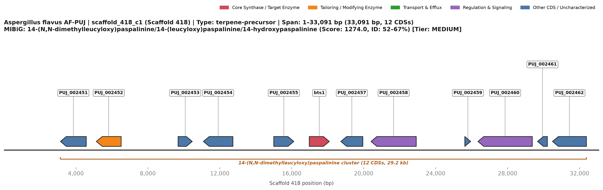](BGC_18_scaffold_418_c1_14_n,n_dimethylleucyloxypaspalinine.svg)

> *Figure 18: Publication-grade gene cluster diagram of `BGC_18_scaffold_418_c1_14_n,n_dimethylleucyloxypaspalinine` on Scaffold 418. Arrows indicate direction of transcription; boxes display standardized gene symbols or official locus tags. [Open scalable vector SVG](BGC_18_scaffold_418_c1_14_n,n_dimethylleucyloxypaspalinine.svg).*

#### Gene Inventory & Structural Qualifiers

| Locus Tag | Gene Symbol | Strand | Physical Span | Length | Putative Product & EC Number | Pfam / Domain Signatures |
| :--- | :---: | :---: | :---: | :---: | :--- | :--- |
| `PUJ_002451` | `PUJ_002451` | `-` | 3,140..4,579 | 479 aa | hypothetical protein | PF02458 (Transferase family) |
| `PUJ_002452` | `PUJ_002452` | `-` | 5,137..6,518 | 443 aa | hypothetical protein (`EC 1.14.14.23`) | PF00067 (Cytochrome P450) |
| `PUJ_002453` | `PUJ_002453` | `+` | 9,683..10,472 | 213 aa | hypothetical protein (`EC 3.1.1.11`) | — |
| `PUJ_002454` | `PUJ_002454` | `-` | 11,087..12,731 | 479 aa | hypothetical protein | PF01494 (FAD binding domain) |
| `PUJ_002455` | `PUJ_002455` | `+` | 15,001..16,119 | 334 aa | hypothetical protein | PF00348 (Polyprenyl synthetase) |
| `PUJ_002456` | `bts1` | `+` | 16,975..18,091 | 272 aa | geranylgeranyl pyrophosphate synthetase | PF00348 (Polyprenyl synthetase) |
| `PUJ_002457` | `PUJ_002457` | `-` | 18,728..19,954 | 408 aa | hypothetical protein | PF01494 (FAD binding domain) |
| `PUJ_002458` | `PUJ_002458` | `-` | 20,406..22,924 | 780 aa | hypothetical protein | PF04082 (Fungal specific transcription factor domain), PF00172 (Fungal Zn(2)-Cys(6) binuclear cluster domain) |
| `PUJ_002459` | `PUJ_002459` | `+` | 25,636..25,950 | 104 aa | hypothetical protein | — |
| `PUJ_002460` | `PUJ_002460` | `-` | 26,351..29,376 | 857 aa | hypothetical protein | PF04082 (Fungal specific transcription factor domain), PF00172 (Fungal Zn(2)-Cys(6) binuclear cluster domain), PF00096 (Zinc finger, C2H2 type) |
| `PUJ_002461` | `PUJ_002461` | `-` | 29,664..30,215 | 183 aa | hypothetical protein | PF07883 (Cupin domain) |
| `PUJ_002462` | `PUJ_002462` | `-` | 30,495..32,386 | 591 aa | hypothetical protein | PF08530 (X-Pro dipeptidyl-peptidase C-terminal non-catalytic domain), PF02129 (X-Pro dipeptidyl-peptidase (S15 family)) |

#### Putative Function & Enzymatic Mechanisms

- **`PUJ_002451`:** Hypothetical protein. Contains PF02458 (Transferase family). Hypothetical or accessory protein implicated in cluster function or localized metabolic support.
- **`PUJ_002452`:** Hypothetical protein (EC 1.14.14.23). Contains PF00067 (Cytochrome P450). Hypothetical or accessory protein implicated in cluster function or localized metabolic support.
- **`PUJ_002453`:** Hypothetical protein (EC 3.1.1.11). Hypothetical or accessory protein implicated in cluster function or localized metabolic support.
- **`PUJ_002454`:** Hypothetical protein. Contains PF01494 (FAD binding domain). Hypothetical or accessory protein implicated in cluster function or localized metabolic support.
- **`PUJ_002455`:** Hypothetical protein. Contains PF00348 (Polyprenyl synthetase). Hypothetical or accessory protein implicated in cluster function or localized metabolic support.
- **`PUJ_002456` (`bts1`):** Geranylgeranyl pyrophosphate synthetase. Contains PF00348 (Polyprenyl synthetase). Catalyzes core biosynthetic condensation or macrocyclization reactions in the pathway.
- **`PUJ_002457`:** Hypothetical protein. Contains PF01494 (FAD binding domain). Hypothetical or accessory protein implicated in cluster function or localized metabolic support.
- **`PUJ_002458`:** Hypothetical protein. Contains PF04082 (Fungal specific transcription factor domain), PF00172 (Fungal Zn(2)-Cys(6) binuclear cluster domain). Hypothetical or accessory protein implicated in cluster function or localized metabolic support.
- **`PUJ_002459`:** Hypothetical protein. Hypothetical or accessory protein implicated in cluster function or localized metabolic support.
- **`PUJ_002460`:** Hypothetical protein. Contains PF04082 (Fungal specific transcription factor domain), PF00172 (Fungal Zn(2)-Cys(6) binuclear cluster domain). Hypothetical or accessory protein implicated in cluster function or localized metabolic support.
- **`PUJ_002461`:** Hypothetical protein. Contains PF07883 (Cupin domain). Hypothetical or accessory protein implicated in cluster function or localized metabolic support.
- **`PUJ_002462`:** Hypothetical protein. Contains PF08530 (X-Pro dipeptidyl-peptidase C-terminal non-catalytic domain), PF02129 (X-Pro dipeptidyl-peptidase (S15 family)). Hypothetical or accessory protein implicated in cluster function or localized metabolic support.

### Collective Pathway Architecture & Biological Synergy

This cluster exhibits significant homology to the characterized MIBiG reference for **14-(N,N-dimethylleucyloxy)paspalinine/14-(leucyloxy)paspalinine/14-hydroxypaspalinine** (MIBiG accession `BGC0002149.2`, score 1,274.0, identities 52–67%). The cluster features 12 coordinated CDSs encoding core synthases, tailoring oxidoreductases/transferases, and transmembrane efflux transporters that function collectively to synthesize, modify, and excrete bioactive terpene-precursor compounds.

---

### 19. Ustiloxin B Biosynthetic Gene Cluster (`Scaffold 418`)

- **Cluster Identifier:** `BGC_19_scaffold_418_c2_ustiloxin_b` (`scaffold_418_c2`)  
- **Genomic Location:** Scaffold 418 | Span: 1–54,988 bp (54,988 bp, 20 CDSs)  
- **Pathway Class:** `fungal-RiPP` | **Confidence Tier:** `HIGH`  
- **antiSMASH KnownClusterBlast Top Hit:** `BGC0000627.4` — **ustiloxin B** (Cumulative Score: 7,477.0, Identity: 46–100%, 13 proteins)  

[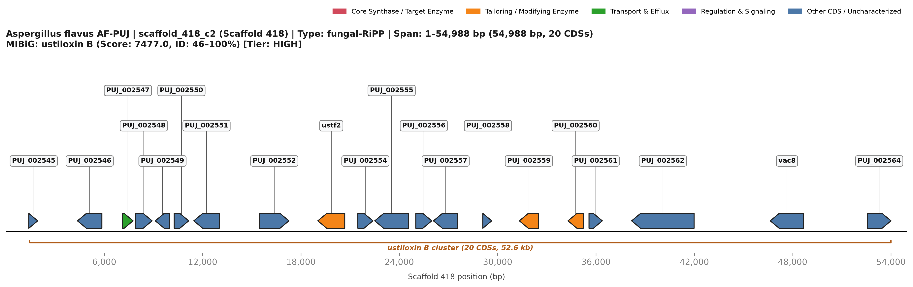](BGC_19_scaffold_418_c2_ustiloxin_b.svg)

> *Figure 19: Publication-grade gene cluster diagram of `BGC_19_scaffold_418_c2_ustiloxin_b` on Scaffold 418. Arrows indicate direction of transcription; boxes display standardized gene symbols or official locus tags. [Open scalable vector SVG](BGC_19_scaffold_418_c2_ustiloxin_b.svg).*

#### Gene Inventory & Structural Qualifiers

| Locus Tag | Gene Symbol | Strand | Physical Span | Length | Putative Product & EC Number | Pfam / Domain Signatures |
| :--- | :---: | :---: | :---: | :---: | :--- | :--- |
| `PUJ_002545` | `PUJ_002545` | `+` | 1,449..1,939 | 159 aa | hypothetical protein | — |
| `PUJ_002546` | `PUJ_002546` | `-` | 4,362..5,855 | 497 aa | hypothetical protein | — |
| `PUJ_002547` | `PUJ_002547` | `+` | 7,121..7,757 | 184 aa | hypothetical protein | PF07690 (Major Facilitator Superfamily) |
| `PUJ_002548` | `PUJ_002548` | `+` | 7,901..8,918 | 314 aa | hypothetical protein | — |
| `PUJ_002549` | `PUJ_002549` | `-` | 9,109..9,994 | 276 aa | hypothetical protein | PF13417 (Glutathione S-transferase, N-terminal domain) |
| `PUJ_002550` | `PUJ_002550` | `+` | 10,263..11,153 | 296 aa | hypothetical protein | PF13847 (Methyltransferase domain) |
| `PUJ_002551` | `PUJ_002551` | `-` | 11,460..13,016 | 498 aa | hypothetical protein | PF11951 (Fungal specific transcription factor domain) |
| `PUJ_002552` | `PUJ_002552` | `+` | 15,477..17,268 | 424 aa | hypothetical protein | — |
| `PUJ_002553` | `ustf2` | `-` | 19,027..20,676 | 494 aa | Flavin-containing monooxygenase ustF2 | PF00743 (Flavin-binding monooxygenase-like), PF00743 (Flavin-binding monooxygenase-like), PF13450 (NAD(P)-binding Rossmann-like domain) |
| `PUJ_002554` | `PUJ_002554` | `+` | 21,473..22,393 | 306 aa | hypothetical protein | PF00266 (Aminotransferase class-V) |
| `PUJ_002555` | `PUJ_002555` | `-` | 22,501..24,565 | 591 aa | hypothetical protein | PF01019 (Gamma-glutamyltranspeptidase) |
| `PUJ_002556` | `PUJ_002556` | `+` | 25,009..25,982 | 214 aa | hypothetical protein | PF11807 (Mycotoxin biosynthesis protein UstYa) |
| `PUJ_002557` | `PUJ_002557` | `-` | 26,083..27,572 | 480 aa | hypothetical protein | PF03572 (Peptidase family S41) |
| `PUJ_002558` | `PUJ_002558` | `+` | 29,177..29,642 | 134 aa | hypothetical protein | PF11807 (Mycotoxin biosynthesis protein UstYa) |
| `PUJ_002559` | `PUJ_002559` | `-` | 31,324..32,488 | 369 aa | hypothetical protein | PF00067 (Cytochrome P450) |
| `PUJ_002560` | `PUJ_002560` | `-` | 34,292..35,223 | 108 aa | hypothetical protein | PF00743 (Flavin-binding monooxygenase-like), PF13450 (NAD(P)-binding Rossmann-like domain) |
| `PUJ_002561` | `PUJ_002561` | `+` | 35,575..36,388 | 249 aa | hypothetical protein | — |
| `PUJ_002562` | `PUJ_002562` | `-` | 38,175..41,986 | 1187 aa | hypothetical protein (`EC 3.2.1.14`) | — |
| `PUJ_002563` | `vac8` | `-` | 46,633..48,677 | 578 aa | Vacuolar protein 8 | PF00514 (Armadillo/beta-catenin-like repeat), PF00514 (Armadillo/beta-catenin-like repeat), PF00514 (Armadillo/beta-catenin-like repeat) |
| `PUJ_002564` | `PUJ_002564` | `+` | 52,562..54,003 | 408 aa | hypothetical protein | PF00498 (FHA domain) |

#### Putative Function & Enzymatic Mechanisms

- **`PUJ_002545`:** Hypothetical protein. Hypothetical or accessory protein implicated in cluster function or localized metabolic support.
- **`PUJ_002546`:** Hypothetical protein. Hypothetical or accessory protein implicated in cluster function or localized metabolic support.
- **`PUJ_002547`:** Hypothetical protein. Contains PF07690 (Major Facilitator Superfamily). Hypothetical or accessory protein implicated in cluster function or localized metabolic support.
- **`PUJ_002548`:** Hypothetical protein. Hypothetical or accessory protein implicated in cluster function or localized metabolic support.
- **`PUJ_002549`:** Hypothetical protein. Contains PF13417 (Glutathione S-transferase, N-terminal domain). Hypothetical or accessory protein implicated in cluster function or localized metabolic support.
- **`PUJ_002550`:** Hypothetical protein. Contains PF13847 (Methyltransferase domain). Hypothetical or accessory protein implicated in cluster function or localized metabolic support.
- **`PUJ_002551`:** Hypothetical protein. Contains PF11951 (Fungal specific transcription factor domain). Hypothetical or accessory protein implicated in cluster function or localized metabolic support.
- **`PUJ_002552`:** Hypothetical protein. Hypothetical or accessory protein implicated in cluster function or localized metabolic support.
- **`PUJ_002553` (`ustf2`):** Flavin-containing monooxygenase ustf2. Contains PF00743 (Flavin-binding monooxygenase-like), PF00743 (Flavin-binding monooxygenase-like). Performs regio- and stereospecific oxidative tailoring of the secondary metabolite intermediate.
- **`PUJ_002554`:** Hypothetical protein. Contains PF00266 (Aminotransferase class-V). Hypothetical or accessory protein implicated in cluster function or localized metabolic support.
- **`PUJ_002555`:** Hypothetical protein. Contains PF01019 (Gamma-glutamyltranspeptidase). Hypothetical or accessory protein implicated in cluster function or localized metabolic support.
- **`PUJ_002556`:** Hypothetical protein. Contains PF11807 (Mycotoxin biosynthesis protein UstYa). Hypothetical or accessory protein implicated in cluster function or localized metabolic support.
- **`PUJ_002557`:** Hypothetical protein. Contains PF03572 (Peptidase family S41). Hypothetical or accessory protein implicated in cluster function or localized metabolic support.
- **`PUJ_002558`:** Hypothetical protein. Contains PF11807 (Mycotoxin biosynthesis protein UstYa). Hypothetical or accessory protein implicated in cluster function or localized metabolic support.
- **`PUJ_002559`:** Hypothetical protein. Contains PF00067 (Cytochrome P450). Hypothetical or accessory protein implicated in cluster function or localized metabolic support.
- **`PUJ_002560`:** Hypothetical protein. Contains PF00743 (Flavin-binding monooxygenase-like), PF13450 (NAD(P)-binding Rossmann-like domain). Hypothetical or accessory protein implicated in cluster function or localized metabolic support.
- **`PUJ_002561`:** Hypothetical protein. Hypothetical or accessory protein implicated in cluster function or localized metabolic support.
- **`PUJ_002562`:** Hypothetical protein (EC 3.2.1.14). Hypothetical or accessory protein implicated in cluster function or localized metabolic support.
- **`PUJ_002563` (`vac8`):** Vacuolar protein 8. Contains PF00514 (Armadillo/beta-catenin-like repeat), PF00514 (Armadillo/beta-catenin-like repeat). Hypothetical or accessory protein implicated in cluster function or localized metabolic support.
- **`PUJ_002564`:** Hypothetical protein. Contains PF00498 (FHA domain). Hypothetical or accessory protein implicated in cluster function or localized metabolic support.

### Collective Pathway Architecture & Biological Synergy

This cluster exhibits significant homology to the characterized MIBiG reference for **ustiloxin B** (MIBiG accession `BGC0000627.4`, score 7,477.0, identities 46–100%). The cluster features 20 coordinated CDSs encoding core synthases, tailoring oxidoreductases/transferases, and transmembrane efflux transporters that function collectively to synthesize, modify, and excrete bioactive fungal-RiPP compounds.

---

### 20. Novel Orphan TERPENE-PRECURSOR Biosynthetic Gene Cluster (`Scaffold 418`)

- **Cluster Identifier:** `BGC_20_scaffold_418_c3_orphan_terpene_precursor` (`scaffold_418_c3`)  
- **Genomic Location:** Scaffold 418 | Span: 1–32,523 bp (32,523 bp, 8 CDSs)  
- **Pathway Class:** `terpene-precursor` | **Confidence Tier:** `ORPHAN`  

[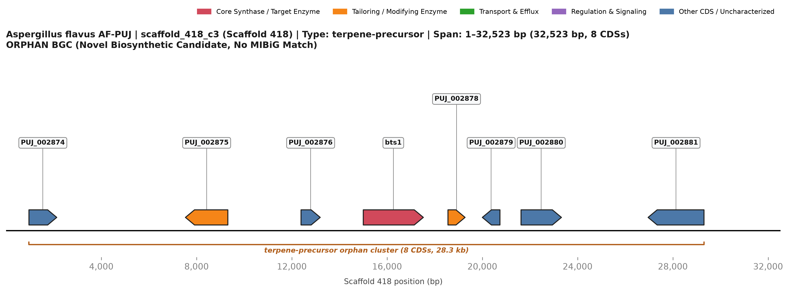](BGC_20_scaffold_418_c3_orphan_terpene_precursor.svg)

> *Figure 20: Publication-grade gene cluster diagram of `BGC_20_scaffold_418_c3_orphan_terpene_precursor` on Scaffold 418. Arrows indicate direction of transcription; boxes display standardized gene symbols or official locus tags. [Open scalable vector SVG](BGC_20_scaffold_418_c3_orphan_terpene_precursor.svg).*

#### Gene Inventory & Structural Qualifiers

| Locus Tag | Gene Symbol | Strand | Physical Span | Length | Putative Product & EC Number | Pfam / Domain Signatures |
| :--- | :---: | :---: | :---: | :---: | :--- | :--- |
| `PUJ_002874` | `PUJ_002874` | `+` | 962..2,129 | 365 aa | hypothetical protein | — |
| `PUJ_002875` | `PUJ_002875` | `-` | 7,533..9,314 | 441 aa | hypothetical protein | PF00067 (Cytochrome P450) |
| `PUJ_002876` | `PUJ_002876` | `+` | 12,387..13,193 | 268 aa | hypothetical protein | PF01163 (RIO1 family) |
| `PUJ_002877` | `bts1` | `+` | 15,001..17,523 | 578 aa | geranylgeranyl pyrophosphate synthetase | PF06544 (Protein of unknown function (DUF1115)), PF00348 (Polyprenyl synthetase) |
| `PUJ_002878` | `PUJ_002878` | `+` | 18,557..19,275 | 197 aa | hypothetical protein | PF00067 (Cytochrome P450) |
| `PUJ_002879` | `PUJ_002879` | `-` | 20,001..20,740 | 224 aa | hypothetical protein | — |
| `PUJ_002880` | `PUJ_002880` | `+` | 21,625..23,322 | 548 aa | hypothetical protein | PF07534 (TLD) |
| `PUJ_002881` | `PUJ_002881` | `-` | 26,961..29,308 | 725 aa | hypothetical protein | PF07971 (Glycosyl hydrolase family 92), PF17678 (Glycosyl hydrolase family 92 N-terminal domain) |

#### Putative Function & Enzymatic Mechanisms

- **`PUJ_002874`:** Hypothetical protein. Hypothetical or accessory protein implicated in cluster function or localized metabolic support.
- **`PUJ_002875`:** Hypothetical protein. Contains PF00067 (Cytochrome P450). Hypothetical or accessory protein implicated in cluster function or localized metabolic support.
- **`PUJ_002876`:** Hypothetical protein. Contains PF01163 (RIO1 family). Hypothetical or accessory protein implicated in cluster function or localized metabolic support.
- **`PUJ_002877` (`bts1`):** Geranylgeranyl pyrophosphate synthetase. Contains PF06544 (Protein of unknown function (DUF1115)), PF00348 (Polyprenyl synthetase). Catalyzes core biosynthetic condensation or macrocyclization reactions in the pathway.
- **`PUJ_002878`:** Hypothetical protein. Contains PF00067 (Cytochrome P450). Hypothetical or accessory protein implicated in cluster function or localized metabolic support.
- **`PUJ_002879`:** Hypothetical protein. Hypothetical or accessory protein implicated in cluster function or localized metabolic support.
- **`PUJ_002880`:** Hypothetical protein. Contains PF07534 (TLD). Hypothetical or accessory protein implicated in cluster function or localized metabolic support.
- **`PUJ_002881`:** Hypothetical protein. Contains PF07971 (Glycosyl hydrolase family 92), PF17678 (Glycosyl hydrolase family 92 N-terminal domain). Hypothetical or accessory protein implicated in cluster function or localized metabolic support.

### Collective Pathway Architecture & Biological Synergy

This cluster represents a novel **orphan terpene-precursor secondary metabolite biosynthetic gene cluster (BGC)**. Comprising 8 predicted CDSs, the locus harbors a dedicated core synthase supported by localized tailoring enzymes and transporter permeases with zero significant matches in MIBiG 3.1. It represents an uncharacterized secondary metabolite pathway within the *Aspergillus flavus* genome with potential bioactive chemical products.

---

### 21. Novel Orphan NRPS Biosynthetic Gene Cluster (`Scaffold 418`)

- **Cluster Identifier:** `BGC_21_scaffold_418_c4_orphan_nrps` (`scaffold_418_c4`)  
- **Genomic Location:** Scaffold 418 | Span: 1–65,039 bp (65,039 bp, 15 CDSs)  
- **Pathway Class:** `NRPS` | **Confidence Tier:** `ORPHAN`  

[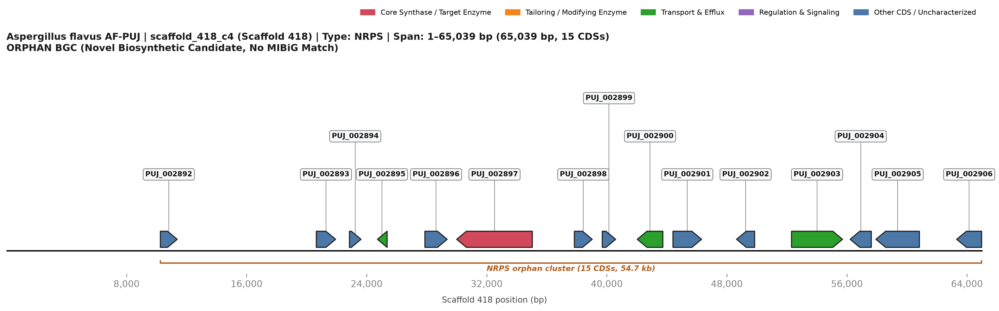](BGC_21_scaffold_418_c4_orphan_nrps.svg)

> *Figure 21: Publication-grade gene cluster diagram of `BGC_21_scaffold_418_c4_orphan_nrps` on Scaffold 418. Arrows indicate direction of transcription; boxes display standardized gene symbols or official locus tags. [Open scalable vector SVG](BGC_21_scaffold_418_c4_orphan_nrps.svg).*

#### Gene Inventory & Structural Qualifiers

| Locus Tag | Gene Symbol | Strand | Physical Span | Length | Putative Product & EC Number | Pfam / Domain Signatures |
| :--- | :---: | :---: | :---: | :---: | :--- | :--- |
| `PUJ_002892` | `PUJ_002892` | `+` | 10,256..11,377 | 335 aa | hypothetical protein | PF07574 (Nse1 non-SMC component of SMC5-6 complex), PF08746 (RING-like domain) |
| `PUJ_002893` | `PUJ_002893` | `+` | 20,648..21,931 | 427 aa | hypothetical protein | PF00339 (Arrestin (or S-antigen), N-terminal domain) |
| `PUJ_002894` | `PUJ_002894` | `+` | 22,856..23,625 | 232 aa | hypothetical protein (`EC 3.2.1.8`) | PF00457 (Glycosyl hydrolases family 11) |
| `PUJ_002895` | `PUJ_002895` | `-` | 24,720..25,326 | 147 aa | hypothetical protein | PF07690 (Major Facilitator Superfamily) |
| `PUJ_002896` | `PUJ_002896` | `+` | 27,882..29,366 | 375 aa | hypothetical protein | PF13520 (Amino acid permease) |
| `PUJ_002897` | `PUJ_002897` | `-` | 30,001..35,039 | 1283 aa | hypothetical protein | PF00668 (Condensation domain), PF00550 (Phosphopantetheine attachment site), PF00668 (Condensation domain) |
| `PUJ_002898` | `PUJ_002898` | `+` | 37,841..39,028 | 395 aa | hypothetical protein | PF11991 (Tryptophan dimethylallyltransferase) |
| `PUJ_002899` | `PUJ_002899` | `+` | 39,701..40,591 | 296 aa | hypothetical protein | PF12697 (Alpha/beta hydrolase family) |
| `PUJ_002900` | `PUJ_002900` | `-` | 42,032..43,736 | 545 aa | hypothetical protein | PF00083 (Sugar (and other) transporter) |
| `PUJ_002901` | `PUJ_002901` | `+` | 44,411..46,315 | 595 aa | hypothetical protein | PF11951 (Fungal specific transcription factor domain) |
| `PUJ_002902` | `PUJ_002902` | `-` | 48,648..49,852 | 355 aa | hypothetical protein | PF02894 (Oxidoreductase family, C-terminal alpha/beta domain), PF01408 (Oxidoreductase family, NAD-binding Rossmann fold) |
| `PUJ_002903` | `PUJ_002903` | `+` | 52,310..55,708 | 1132 aa | hypothetical protein | PF11915 (Protein of unknown function (DUF3433)), PF11915 (Protein of unknown function (DUF3433)) |
| `PUJ_002904` | `PUJ_002904` | `-` | 56,214..57,626 | 470 aa | hypothetical protein (`EC 1.21.99.1`) | PF01593 (Flavin containing amine oxidoreductase) |
| `PUJ_002905` | `PUJ_002905` | `-` | 57,934..60,830 | 828 aa | hypothetical protein (`EC 1.21.99.1`) | — |
| `PUJ_002906` | `PUJ_002906` | `-` | 63,318..64,976 | 533 aa | hypothetical protein | PF00246 (Zinc carboxypeptidase) |

#### Putative Function & Enzymatic Mechanisms

- **`PUJ_002892`:** Hypothetical protein. Contains PF07574 (Nse1 non-SMC component of SMC5-6 complex), PF08746 (RING-like domain). Hypothetical or accessory protein implicated in cluster function or localized metabolic support.
- **`PUJ_002893`:** Hypothetical protein. Contains PF00339 (Arrestin (or S-antigen), N-terminal domain). Hypothetical or accessory protein implicated in cluster function or localized metabolic support.
- **`PUJ_002894`:** Hypothetical protein (EC 3.2.1.8). Contains PF00457 (Glycosyl hydrolases family 11). Hypothetical or accessory protein implicated in cluster function or localized metabolic support.
- **`PUJ_002895`:** Hypothetical protein. Contains PF07690 (Major Facilitator Superfamily). Hypothetical or accessory protein implicated in cluster function or localized metabolic support.
- **`PUJ_002896`:** Hypothetical protein. Contains PF13520 (Amino acid permease). Hypothetical or accessory protein implicated in cluster function or localized metabolic support.
- **`PUJ_002897`:** Hypothetical protein. Contains PF00668 (Condensation domain), PF00550 (Phosphopantetheine attachment site). Hypothetical or accessory protein implicated in cluster function or localized metabolic support.
- **`PUJ_002898`:** Hypothetical protein. Contains PF11991 (Tryptophan dimethylallyltransferase). Hypothetical or accessory protein implicated in cluster function or localized metabolic support.
- **`PUJ_002899`:** Hypothetical protein. Contains PF12697 (Alpha/beta hydrolase family). Hypothetical or accessory protein implicated in cluster function or localized metabolic support.
- **`PUJ_002900`:** Hypothetical protein. Contains PF00083 (Sugar (and other) transporter). Hypothetical or accessory protein implicated in cluster function or localized metabolic support.
- **`PUJ_002901`:** Hypothetical protein. Contains PF11951 (Fungal specific transcription factor domain). Hypothetical or accessory protein implicated in cluster function or localized metabolic support.
- **`PUJ_002902`:** Hypothetical protein. Contains PF02894 (Oxidoreductase family, C-terminal alpha/beta domain), PF01408 (Oxidoreductase family, NAD-binding Rossmann fold). Hypothetical or accessory protein implicated in cluster function or localized metabolic support.
- **`PUJ_002903`:** Hypothetical protein. Contains PF11915 (Protein of unknown function (DUF3433)), PF11915 (Protein of unknown function (DUF3433)). Hypothetical or accessory protein implicated in cluster function or localized metabolic support.
- **`PUJ_002904`:** Hypothetical protein (EC 1.21.99.1). Contains PF01593 (Flavin containing amine oxidoreductase). Hypothetical or accessory protein implicated in cluster function or localized metabolic support.
- **`PUJ_002905`:** Hypothetical protein (EC 1.21.99.1). Hypothetical or accessory protein implicated in cluster function or localized metabolic support.
- **`PUJ_002906`:** Hypothetical protein. Contains PF00246 (Zinc carboxypeptidase). Hypothetical or accessory protein implicated in cluster function or localized metabolic support.

### Collective Pathway Architecture & Biological Synergy

This cluster represents a novel **orphan NRPS secondary metabolite biosynthetic gene cluster (BGC)**. Comprising 15 predicted CDSs, the locus harbors a dedicated core synthase supported by localized tailoring enzymes and transporter permeases with zero significant matches in MIBiG 3.1. It represents an uncharacterized secondary metabolite pathway within the *Aspergillus flavus* genome with potential bioactive chemical products.

---

### 22. Novel Orphan T3PKS Biosynthetic Gene Cluster (`Scaffold 418`)

- **Cluster Identifier:** `BGC_22_scaffold_418_c5_orphan_t3pks` (`scaffold_418_c5`)  
- **Genomic Location:** Scaffold 418 | Span: 1–61,324 bp (61,324 bp, 17 CDSs)  
- **Pathway Class:** `T3PKS` | **Confidence Tier:** `ORPHAN`  

[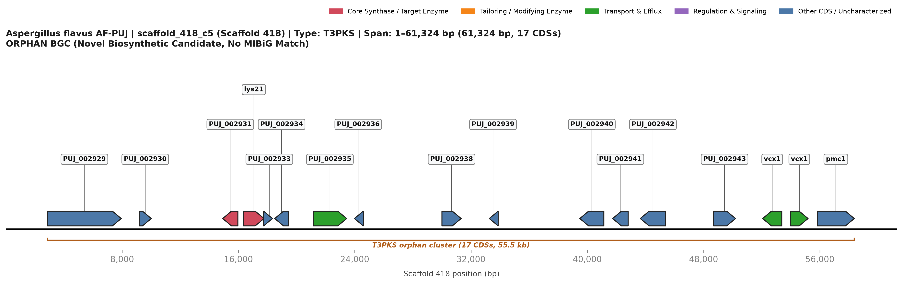](BGC_22_scaffold_418_c5_orphan_t3pks.svg)

> *Figure 22: Publication-grade gene cluster diagram of `BGC_22_scaffold_418_c5_orphan_t3pks` on Scaffold 418. Arrows indicate direction of transcription; boxes display standardized gene symbols or official locus tags. [Open scalable vector SVG](BGC_22_scaffold_418_c5_orphan_t3pks.svg).*

#### Gene Inventory & Structural Qualifiers

| Locus Tag | Gene Symbol | Strand | Physical Span | Length | Putative Product & EC Number | Pfam / Domain Signatures |
| :--- | :---: | :---: | :---: | :---: | :--- | :--- |
| `PUJ_002929` | `PUJ_002929` | `+` | 2,866..7,937 | 782 aa | hypothetical protein (`EC 3.2.1.55`) | PF06964 (Alpha-L-arabinofuranosidase C-terminal domain) |
| `PUJ_002930` | `PUJ_002930` | `+` | 9,169..10,005 | 259 aa | hypothetical protein | — |
| `PUJ_002931` | `PUJ_002931` | `-` | 14,913..15,963 | 272 aa | hypothetical protein (`EC 1.1.1.381`) | PF00106 (short chain dehydrogenase) |
| `PUJ_002932` | `lys21` | `+` | 16,347..17,762 | 436 aa | homocitrate synthase lys21 (`EC 2.3.3.14`) | PF00682 (HMGL-like) |
| `PUJ_002933` | `PUJ_002933` | `+` | 17,910..18,341 | 137 aa | hypothetical protein | — |
| `PUJ_002934` | `PUJ_002934` | `-` | 18,493..19,446 | 317 aa | hypothetical protein | PF12311 (Protein of unknown function (DUF3632)) |
| `PUJ_002935` | `PUJ_002935` | `+` | 21,141..23,447 | 606 aa | hypothetical protein | PF03239 (Iron permease FTR1 family) |
| `PUJ_002936` | `PUJ_002936` | `-` | 23,978..24,508 | 176 aa | hypothetical protein | — |
| `PUJ_002938` | `PUJ_002938` | `+` | 30,001..31,324 | 402 aa | hypothetical protein | PF00195 (Chalcone and stilbene synthases, N-terminal domain), PF02797 (Chalcone and stilbene synthases, C-terminal domain) |
| `PUJ_002939` | `PUJ_002939` | `-` | 33,257..33,772 | 171 aa | hypothetical protein | PF11374 (Protein of unknown function (DUF3176)) |
| `PUJ_002940` | `PUJ_002940` | `-` | 39,483..41,143 | 500 aa | hypothetical protein | — |
| `PUJ_002941` | `PUJ_002941` | `-` | 41,741..42,811 | 300 aa | hypothetical protein | PF12710 (haloacid dehalogenase-like hydrolase) |
| `PUJ_002942` | `PUJ_002942` | `-` | 43,644..45,395 | 583 aa | hypothetical protein (`EC 4.1.1.1`) | PF02775 (Thiamine pyrophosphate enzyme, C-terminal TPP binding domain), PF00205 (Thiamine pyrophosphate enzyme, central domain), PF02776 (Thiamine pyrophosphate enzyme, N-terminal TPP binding domain) |
| `PUJ_002943` | `PUJ_002943` | `+` | 48,689..50,200 | 393 aa | hypothetical protein | — |
| `PUJ_002944` | `vcx1` | `-` | 52,062..53,385 | 404 aa | Vacuolar calcium ion transporter | PF01699 (Sodium/calcium exchanger protein), PF01699 (Sodium/calcium exchanger protein) |
| `PUJ_002945` | `vcx1` | `+` | 53,983..55,190 | 342 aa | Vacuolar calcium ion transporter | PF01699 (Sodium/calcium exchanger protein) |
| `PUJ_002946` | `pmc1` | `+` | 55,832..58,371 | 826 aa | plasma membrane calcium (`EC 7.2.2.10`) | PF00690 (Cation transporter/ATPase, N-terminus), PF00122 (E1-E2 ATPase), PF13246 (Cation transport ATPase (P-type)) |

#### Putative Function & Enzymatic Mechanisms

- **`PUJ_002929`:** Hypothetical protein (EC 3.2.1.55). Contains PF06964 (Alpha-L-arabinofuranosidase C-terminal domain). Hypothetical or accessory protein implicated in cluster function or localized metabolic support.
- **`PUJ_002930`:** Hypothetical protein. Hypothetical or accessory protein implicated in cluster function or localized metabolic support.
- **`PUJ_002931`:** Hypothetical protein (EC 1.1.1.381). Contains PF00106 (short chain dehydrogenase). Hypothetical or accessory protein implicated in cluster function or localized metabolic support.
- **`PUJ_002932` (`lys21`):** Homocitrate synthase lys21 (EC 2.3.3.14). Contains PF00682 (HMGL-like). Catalyzes core biosynthetic condensation or macrocyclization reactions in the pathway.
- **`PUJ_002933`:** Hypothetical protein. Hypothetical or accessory protein implicated in cluster function or localized metabolic support.
- **`PUJ_002934`:** Hypothetical protein. Contains PF12311 (Protein of unknown function (DUF3632)). Hypothetical or accessory protein implicated in cluster function or localized metabolic support.
- **`PUJ_002935`:** Hypothetical protein. Contains PF03239 (Iron permease FTR1 family). Hypothetical or accessory protein implicated in cluster function or localized metabolic support.
- **`PUJ_002936`:** Hypothetical protein. Hypothetical or accessory protein implicated in cluster function or localized metabolic support.
- **`PUJ_002938`:** Hypothetical protein. Contains PF00195 (Chalcone and stilbene synthases, N-terminal domain), PF02797 (Chalcone and stilbene synthases, C-terminal domain). Hypothetical or accessory protein implicated in cluster function or localized metabolic support.
- **`PUJ_002939`:** Hypothetical protein. Contains PF11374 (Protein of unknown function (DUF3176)). Hypothetical or accessory protein implicated in cluster function or localized metabolic support.
- **`PUJ_002940`:** Hypothetical protein. Hypothetical or accessory protein implicated in cluster function or localized metabolic support.
- **`PUJ_002941`:** Hypothetical protein. Contains PF12710 (haloacid dehalogenase-like hydrolase). Hypothetical or accessory protein implicated in cluster function or localized metabolic support.
- **`PUJ_002942`:** Hypothetical protein (EC 4.1.1.1). Contains PF02775 (Thiamine pyrophosphate enzyme, C-terminal TPP binding domain), PF00205 (Thiamine pyrophosphate enzyme, central domain). Hypothetical or accessory protein implicated in cluster function or localized metabolic support.
- **`PUJ_002943`:** Hypothetical protein. Hypothetical or accessory protein implicated in cluster function or localized metabolic support.
- **`PUJ_002944` (`vcx1`):** Vacuolar calcium ion transporter. Contains PF01699 (Sodium/calcium exchanger protein), PF01699 (Sodium/calcium exchanger protein). Transmembrane transport protein mediating efflux of synthesized products or precursor import.
- **`PUJ_002945` (`vcx1`):** Vacuolar calcium ion transporter. Contains PF01699 (Sodium/calcium exchanger protein). Transmembrane transport protein mediating efflux of synthesized products or precursor import.
- **`PUJ_002946` (`pmc1`):** Plasma membrane calcium (EC 7.2.2.10). Contains PF00690 (Cation transporter/ATPase, N-terminus), PF00122 (E1-E2 ATPase). Hypothetical or accessory protein implicated in cluster function or localized metabolic support.

### Collective Pathway Architecture & Biological Synergy

This cluster represents a novel **orphan T3PKS secondary metabolite biosynthetic gene cluster (BGC)**. Comprising 17 predicted CDSs, the locus harbors a dedicated core synthase supported by localized tailoring enzymes and transporter permeases with zero significant matches in MIBiG 3.1. It represents an uncharacterized secondary metabolite pathway within the *Aspergillus flavus* genome with potential bioactive chemical products.

---

### 23. Fusaric Acid Biosynthetic Gene Cluster (`Scaffold 431`)

- **Cluster Identifier:** `BGC_23_scaffold_431_c1_fusaric_acid` (`scaffold_431_c1`)  
- **Genomic Location:** Scaffold 431 | Span: 1–68,253 bp (68,253 bp, 23 CDSs)  
- **Pathway Class:** `T1PKS` | **Confidence Tier:** `MEDIUM`  
- **antiSMASH KnownClusterBlast Top Hit:** `BGC0001190.3` — **fusaric acid** (Cumulative Score: 829.0, Identity: 62–72%, 2 proteins)  

[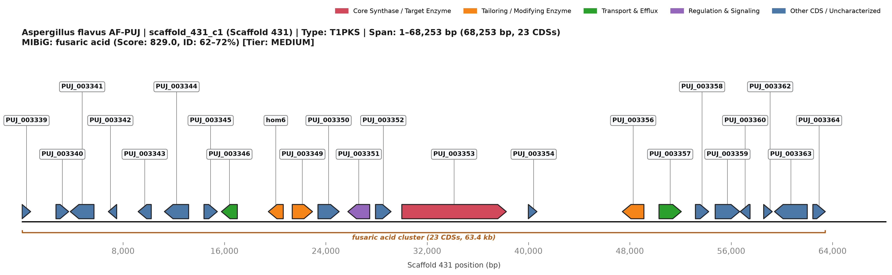](BGC_23_scaffold_431_c1_fusaric_acid.svg)

> *Figure 23: Publication-grade gene cluster diagram of `BGC_23_scaffold_431_c1_fusaric_acid` on Scaffold 431. Arrows indicate direction of transcription; boxes display standardized gene symbols or official locus tags. [Open scalable vector SVG](BGC_23_scaffold_431_c1_fusaric_acid.svg).*

#### Gene Inventory & Structural Qualifiers

| Locus Tag | Gene Symbol | Strand | Physical Span | Length | Putative Product & EC Number | Pfam / Domain Signatures |
| :--- | :---: | :---: | :---: | :---: | :--- | :--- |
| `PUJ_003339` | `PUJ_003339` | `+` | 53..703 | 216 aa | hypothetical protein | — |
| `PUJ_003340` | `PUJ_003340` | `+` | 2,704..3,705 | 333 aa | hypothetical protein | PF00753 (Metallo-beta-lactamase superfamily) |
| `PUJ_003341` | `PUJ_003341` | `-` | 3,834..5,705 | 566 aa | hypothetical protein | — |
| `PUJ_003342` | `PUJ_003342` | `-` | 6,837..7,153 | 88 aa | hypothetical protein | — |
| `PUJ_003343` | `PUJ_003343` | `-` | 9,189..10,225 | 262 aa | hypothetical protein | PF00596 (Class II Aldolase and Adducin N-terminal domain), PF00596 (Class II Aldolase and Adducin N-terminal domain) |
| `PUJ_003344` | `PUJ_003344` | `-` | 11,265..13,175 | 636 aa | hypothetical protein | PF00551 (Formyl transferase) |
| `PUJ_003345` | `PUJ_003345` | `+` | 14,386..15,440 | 307 aa | hypothetical protein (`EC 1.5.1.15`) | PF00763 (Tetrahydrofolate dehydrogenase/cyclohydrolase, catalytic domain) |
| `PUJ_003346` | `PUJ_003346` | `-` | 15,764..17,020 | 418 aa | hypothetical protein | PF07690 (Major Facilitator Superfamily) |
| `PUJ_003348` | `hom6` | `-` | 19,466..20,644 | 367 aa | Homoserine dehydrogenase (`EC 1.1.1.3`) | PF00742 (Homoserine dehydrogenase), PF03447 (Homoserine dehydrogenase, NAD binding domain) |
| `PUJ_003349` | `PUJ_003349` | `+` | 21,353..22,952 | 493 aa | hypothetical protein | PF00171 (Aldehyde dehydrogenase family) |
| `PUJ_003350` | `PUJ_003350` | `+` | 23,383..25,058 | 520 aa | hypothetical protein | PF11905 (Domain of unknown function (DUF3425)) |
| `PUJ_003351` | `PUJ_003351` | `-` | 25,743..27,470 | 575 aa | hypothetical protein | PF00172 (Fungal Zn(2)-Cys(6) binuclear cluster domain) |
| `PUJ_003352` | `PUJ_003352` | `+` | 27,924..29,153 | 409 aa | hypothetical protein | PF12697 (Alpha/beta hydrolase family) |
| `PUJ_003353` | `PUJ_003353` | `+` | 30,001..38,253 | 2642 aa | hypothetical protein | PF08659 (KR domain), PF00109 (Beta-ketoacyl synthase, N-terminal domain), PF02801 (Beta-ketoacyl synthase, C-terminal domain) |
| `PUJ_003354` | `PUJ_003354` | `+` | 40,157..40,667 | 147 aa | hypothetical protein | — |
| `PUJ_003356` | `PUJ_003356` | `-` | 47,413..49,113 | 509 aa | hypothetical protein (`EC 1.14.14.116`) | PF00067 (Cytochrome P450) |
| `PUJ_003357` | `PUJ_003357` | `+` | 50,303..52,065 | 473 aa | hypothetical protein | PF07690 (Major Facilitator Superfamily) |
| `PUJ_003358` | `PUJ_003358` | `+` | 53,178..54,227 | 293 aa | hypothetical protein | — |
| `PUJ_003359` | `PUJ_003359` | `+` | 54,738..56,668 | 604 aa | hypothetical protein | PF02776 (Thiamine pyrophosphate enzyme, N-terminal TPP binding domain), PF00205 (Thiamine pyrophosphate enzyme, central domain), PF02775 (Thiamine pyrophosphate enzyme, C-terminal TPP binding domain) |
| `PUJ_003360` | `PUJ_003360` | `-` | 56,715..57,492 | 204 aa | hypothetical protein | PF13673 (Acetyltransferase (GNAT) domain) |
| `PUJ_003362` | `PUJ_003362` | `+` | 58,913..59,242 | 109 aa | hypothetical protein | — |
| `PUJ_003363` | `PUJ_003363` | `-` | 59,422..62,007 | 717 aa | hypothetical protein | PF06985 (Heterokaryon incompatibility protein (HET)) |
| `PUJ_003364` | `PUJ_003364` | `+` | 62,448..63,428 | 326 aa | hypothetical protein | PF12417 (Zinc finger protein) |

#### Putative Function & Enzymatic Mechanisms

- **`PUJ_003339`:** Hypothetical protein. Hypothetical or accessory protein implicated in cluster function or localized metabolic support.
- **`PUJ_003340`:** Hypothetical protein. Contains PF00753 (Metallo-beta-lactamase superfamily). Hypothetical or accessory protein implicated in cluster function or localized metabolic support.
- **`PUJ_003341`:** Hypothetical protein. Hypothetical or accessory protein implicated in cluster function or localized metabolic support.
- **`PUJ_003342`:** Hypothetical protein. Hypothetical or accessory protein implicated in cluster function or localized metabolic support.
- **`PUJ_003343`:** Hypothetical protein. Contains PF00596 (Class II Aldolase and Adducin N-terminal domain), PF00596 (Class II Aldolase and Adducin N-terminal domain). Hypothetical or accessory protein implicated in cluster function or localized metabolic support.
- **`PUJ_003344`:** Hypothetical protein. Contains PF00551 (Formyl transferase). Hypothetical or accessory protein implicated in cluster function or localized metabolic support.
- **`PUJ_003345`:** Hypothetical protein (EC 1.5.1.15). Contains PF00763 (Tetrahydrofolate dehydrogenase/cyclohydrolase, catalytic domain). Hypothetical or accessory protein implicated in cluster function or localized metabolic support.
- **`PUJ_003346`:** Hypothetical protein. Contains PF07690 (Major Facilitator Superfamily). Hypothetical or accessory protein implicated in cluster function or localized metabolic support.
- **`PUJ_003348` (`hom6`):** Homoserine dehydrogenase (EC 1.1.1.3). Contains PF00742 (Homoserine dehydrogenase), PF03447 (Homoserine dehydrogenase, NAD binding domain). Oxidoreductase tailoring enzyme driving intermediate redox transformation.
- **`PUJ_003349`:** Hypothetical protein. Contains PF00171 (Aldehyde dehydrogenase family). Hypothetical or accessory protein implicated in cluster function or localized metabolic support.
- **`PUJ_003350`:** Hypothetical protein. Contains PF11905 (Domain of unknown function (DUF3425)). Hypothetical or accessory protein implicated in cluster function or localized metabolic support.
- **`PUJ_003351`:** Hypothetical protein. Contains PF00172 (Fungal Zn(2)-Cys(6) binuclear cluster domain). Hypothetical or accessory protein implicated in cluster function or localized metabolic support.
- **`PUJ_003352`:** Hypothetical protein. Contains PF12697 (Alpha/beta hydrolase family). Hypothetical or accessory protein implicated in cluster function or localized metabolic support.
- **`PUJ_003353`:** Hypothetical protein. Contains PF08659 (KR domain), PF00109 (Beta-ketoacyl synthase, N-terminal domain). Hypothetical or accessory protein implicated in cluster function or localized metabolic support.
- **`PUJ_003354`:** Hypothetical protein. Hypothetical or accessory protein implicated in cluster function or localized metabolic support.
- **`PUJ_003356`:** Hypothetical protein (EC 1.14.14.116). Contains PF00067 (Cytochrome P450). Hypothetical or accessory protein implicated in cluster function or localized metabolic support.
- **`PUJ_003357`:** Hypothetical protein. Contains PF07690 (Major Facilitator Superfamily). Hypothetical or accessory protein implicated in cluster function or localized metabolic support.
- **`PUJ_003358`:** Hypothetical protein. Hypothetical or accessory protein implicated in cluster function or localized metabolic support.
- **`PUJ_003359`:** Hypothetical protein. Contains PF02776 (Thiamine pyrophosphate enzyme, N-terminal TPP binding domain), PF00205 (Thiamine pyrophosphate enzyme, central domain). Hypothetical or accessory protein implicated in cluster function or localized metabolic support.
- **`PUJ_003360`:** Hypothetical protein. Contains PF13673 (Acetyltransferase (GNAT) domain). Hypothetical or accessory protein implicated in cluster function or localized metabolic support.
- **`PUJ_003362`:** Hypothetical protein. Hypothetical or accessory protein implicated in cluster function or localized metabolic support.
- **`PUJ_003363`:** Hypothetical protein. Contains PF06985 (Heterokaryon incompatibility protein (HET)). Hypothetical or accessory protein implicated in cluster function or localized metabolic support.
- **`PUJ_003364`:** Hypothetical protein. Contains PF12417 (Zinc finger protein). Hypothetical or accessory protein implicated in cluster function or localized metabolic support.

### Collective Pathway Architecture & Biological Synergy

This cluster exhibits significant homology to the characterized MIBiG reference for **fusaric acid** (MIBiG accession `BGC0001190.3`, score 829.0, identities 62–72%). The cluster features 23 coordinated CDSs encoding core synthases, tailoring oxidoreductases/transferases, and transmembrane efflux transporters that function collectively to synthesize, modify, and excrete bioactive T1PKS compounds.

---

### 24. Novel Orphan TERPENE-PRECURSOR Biosynthetic Gene Cluster (`Scaffold 431`)

- **Cluster Identifier:** `BGC_24_scaffold_431_c2_orphan_terpene_precursor` (`scaffold_431_c2`)  
- **Genomic Location:** Scaffold 431 | Span: 1–31,251 bp (31,251 bp, 8 CDSs)  
- **Pathway Class:** `terpene-precursor` | **Confidence Tier:** `ORPHAN`  

[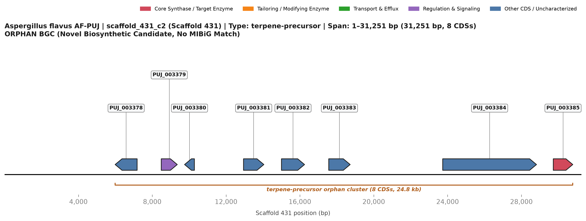](BGC_24_scaffold_431_c2_orphan_terpene_precursor.svg)

> *Figure 24: Publication-grade gene cluster diagram of `BGC_24_scaffold_431_c2_orphan_terpene_precursor` on Scaffold 431. Arrows indicate direction of transcription; boxes display standardized gene symbols or official locus tags. [Open scalable vector SVG](BGC_24_scaffold_431_c2_orphan_terpene_precursor.svg).*

#### Gene Inventory & Structural Qualifiers

| Locus Tag | Gene Symbol | Strand | Physical Span | Length | Putative Product & EC Number | Pfam / Domain Signatures |
| :--- | :---: | :---: | :---: | :---: | :--- | :--- |
| `PUJ_003378` | `PUJ_003378` | `-` | 5,991..7,181 | 387 aa | hypothetical protein | — |
| `PUJ_003379` | `PUJ_003379` | `+` | 8,489..9,355 | 262 aa | hypothetical protein | PF00069 (Protein kinase domain) |
| `PUJ_003380` | `PUJ_003380` | `-` | 9,752..10,284 | 158 aa | hypothetical protein | — |
| `PUJ_003381` | `PUJ_003381` | `+` | 12,945..14,046 | 312 aa | hypothetical protein | PF05368 (NmrA-like family) |
| `PUJ_003382` | `PUJ_003382` | `+` | 15,001..16,251 | 356 aa | hypothetical protein | PF00348 (Polyprenyl synthetase) |
| `PUJ_003383` | `PUJ_003383` | `+` | 17,562..18,722 | 386 aa | hypothetical protein | — |
| `PUJ_003384` | `PUJ_003384` | `+` | 23,736..28,817 | 1462 aa | hypothetical protein | PF01048 (Phosphorylase superfamily) |
| `PUJ_003385` | `PUJ_003385` | `+` | 29,727..30,782 | 292 aa | hypothetical protein (`EC 1.1.1.289`) | PF13561 (Enoyl-(Acyl carrier protein) reductase) |

#### Putative Function & Enzymatic Mechanisms

- **`PUJ_003378`:** Hypothetical protein. Hypothetical or accessory protein implicated in cluster function or localized metabolic support.
- **`PUJ_003379`:** Hypothetical protein. Contains PF00069 (Protein kinase domain). Hypothetical or accessory protein implicated in cluster function or localized metabolic support.
- **`PUJ_003380`:** Hypothetical protein. Hypothetical or accessory protein implicated in cluster function or localized metabolic support.
- **`PUJ_003381`:** Hypothetical protein. Contains PF05368 (NmrA-like family). Hypothetical or accessory protein implicated in cluster function or localized metabolic support.
- **`PUJ_003382`:** Hypothetical protein. Contains PF00348 (Polyprenyl synthetase). Hypothetical or accessory protein implicated in cluster function or localized metabolic support.
- **`PUJ_003383`:** Hypothetical protein. Hypothetical or accessory protein implicated in cluster function or localized metabolic support.
- **`PUJ_003384`:** Hypothetical protein. Contains PF01048 (Phosphorylase superfamily). Hypothetical or accessory protein implicated in cluster function or localized metabolic support.
- **`PUJ_003385`:** Hypothetical protein (EC 1.1.1.289). Contains PF13561 (Enoyl-(Acyl carrier protein) reductase). Hypothetical or accessory protein implicated in cluster function or localized metabolic support.

### Collective Pathway Architecture & Biological Synergy

This cluster represents a novel **orphan terpene-precursor secondary metabolite biosynthetic gene cluster (BGC)**. Comprising 8 predicted CDSs, the locus harbors a dedicated core synthase supported by localized tailoring enzymes and transporter permeases with zero significant matches in MIBiG 3.1. It represents an uncharacterized secondary metabolite pathway within the *Aspergillus flavus* genome with potential bioactive chemical products.

---

### 25. Zopfiellin Biosynthetic Gene Cluster (`Scaffold 431`)

- **Cluster Identifier:** `BGC_25_scaffold_431_c3_zopfiellin` (`scaffold_431_c3`)  
- **Genomic Location:** Scaffold 431 | Span: 1–117,487 bp (117,487 bp, 34 CDSs)  
- **Pathway Class:** `T1PKS` | **Confidence Tier:** `MEDIUM`  
- **antiSMASH KnownClusterBlast Top Hit:** `BGC0002222.2` — **zopfiellin** (Cumulative Score: 528.0, Identity: 54–55%, 2 proteins)  

[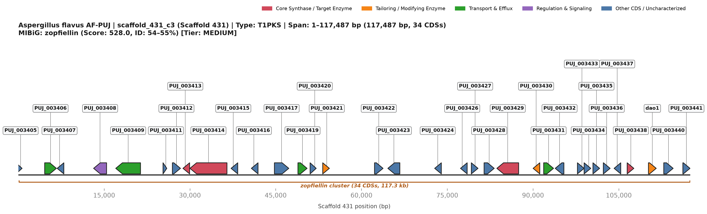](BGC_25_scaffold_431_c3_zopfiellin.svg)

> *Figure 25: Publication-grade gene cluster diagram of `BGC_25_scaffold_431_c3_zopfiellin` on Scaffold 431. Arrows indicate direction of transcription; boxes display standardized gene symbols or official locus tags. [Open scalable vector SVG](BGC_25_scaffold_431_c3_zopfiellin.svg).*

#### Gene Inventory & Structural Qualifiers

| Locus Tag | Gene Symbol | Strand | Physical Span | Length | Putative Product & EC Number | Pfam / Domain Signatures |
| :--- | :---: | :---: | :---: | :---: | :--- | :--- |
| `PUJ_003405` | `PUJ_003405` | `+` | 133..649 | 148 aa | hypothetical protein | PF04828 (Glutathione-dependent formaldehyde-activating enzyme) |
| `PUJ_003406` | `PUJ_003406` | `+` | 4,600..6,654 | 586 aa | hypothetical protein | PF07690 (Major Facilitator Superfamily) |
| `PUJ_003407` | `PUJ_003407` | `-` | 6,786..7,619 | 277 aa | hypothetical protein | PF01674 (Lipase (class 2)) |
| `PUJ_003408` | `PUJ_003408` | `-` | 13,156..15,425 | 621 aa | hypothetical protein | PF11951 (Fungal specific transcription factor domain), PF00172 (Fungal Zn(2)-Cys(6) binuclear cluster domain) |
| `PUJ_003409` | `PUJ_003409` | `-` | 17,029..21,361 | 1419 aa | hypothetical protein | PF01061 (ABC-2 type transporter), PF19055 (ABC-2 type transporter), PF00005 (ABC transporter) |
| `PUJ_003411` | `PUJ_003411` | `+` | 25,641..25,958 | 105 aa | hypothetical protein | PF06041 (Bacterial protein of unknown function (DUF924)) |
| `PUJ_003412` | `PUJ_003412` | `+` | 26,934..28,349 | 471 aa | hypothetical protein | PF00999 (Sodium/hydrogen exchanger family) |
| `PUJ_003413` | `PUJ_003413` | `-` | 28,782..29,603 | 264 aa | hypothetical protein | PF00550 (Phosphopantetheine attachment site), PF08659 (KR domain) |
| `PUJ_003414` | `PUJ_003414` | `-` | 30,001..36,480 | 2081 aa | hypothetical protein | PF08241 (Methyltransferase domain), PF14765 (Polyketide synthase dehydratase), PF00698 (Acyl transferase domain) |
| `PUJ_003415` | `PUJ_003415` | `-` | 37,197..37,973 | 224 aa | hypothetical protein | PF03959 (Serine hydrolase (FSH1)) |
| `PUJ_003416` | `PUJ_003416` | `-` | 40,744..41,613 | 193 aa | hypothetical protein | — |
| `PUJ_003417` | `PUJ_003417` | `+` | 44,775..47,291 | 838 aa | hypothetical protein | PF06738 (Putative threonine/serine exporter), PF12821 (Threonine/Serine exporter, ThrE) |
| `PUJ_003419` | `PUJ_003419` | `+` | 48,890..50,489 | 509 aa | hypothetical protein | PF07690 (Major Facilitator Superfamily) |
| `PUJ_003420` | `PUJ_003420` | `+` | 51,572..52,084 | 99 aa | hypothetical protein | — |
| `PUJ_003421` | `PUJ_003421` | `+` | 53,477..54,390 | 284 aa | hypothetical protein | PF00106 (short chain dehydrogenase) |
| `PUJ_003422` | `PUJ_003422` | `+` | 62,281..63,774 | 324 aa | hypothetical protein | PF00249 (Myb-like DNA-binding domain) |
| `PUJ_003423` | `PUJ_003423` | `-` | 64,614..66,711 | 673 aa | hypothetical protein | — |
| `PUJ_003424` | `PUJ_003424` | `-` | 72,800..73,865 | 335 aa | hypothetical protein | — |
| `PUJ_003426` | `PUJ_003426` | `-` | 77,317..77,904 | 195 aa | hypothetical protein | — |
| `PUJ_003427` | `PUJ_003427` | `+` | 79,373..80,379 | 307 aa | hypothetical protein | — |
| `PUJ_003428` | `PUJ_003428` | `+` | 81,442..83,215 | 393 aa | hypothetical protein | — |
| `PUJ_003429` | `PUJ_003429` | `-` | 83,677..87,487 | 1245 aa | hypothetical protein | PF13671 (AAA domain), PF07993 (Male sterility protein), PF00550 (Phosphopantetheine attachment site) |
| `PUJ_003430` | `PUJ_003430` | `-` | 90,017..91,054 | 323 aa | hypothetical protein (`EC 1.1.1.372`) | PF00248 (Aldo/keto reductase family) |
| `PUJ_003431` | `PUJ_003431` | `+` | 91,861..93,589 | 483 aa | hypothetical protein | PF07690 (Major Facilitator Superfamily) |
| `PUJ_003432` | `PUJ_003432` | `-` | 93,880..95,400 | 506 aa | hypothetical protein | PF04082 (Fungal specific transcription factor domain) |
| `PUJ_003433` | `PUJ_003433` | `+` | 98,156..98,933 | 237 aa | hypothetical protein | PF05630 (Necrosis inducing protein (NPP1)) |
| `PUJ_003434` | `PUJ_003434` | `+` | 99,391..100,103 | 183 aa | hypothetical protein | PF11578 (Protein of unknown function (DUF3237)) |
| `PUJ_003435` | `PUJ_003435` | `+` | 100,536..101,648 | 322 aa | hypothetical protein | PF05368 (NmrA-like family) |
| `PUJ_003436` | `PUJ_003436` | `+` | 102,294..103,484 | 396 aa | hypothetical protein | PF00626 (Gelsolin repeat), PF00626 (Gelsolin repeat), PF00626 (Gelsolin repeat) |
| `PUJ_003437` | `PUJ_003437` | `-` | 104,176..105,256 | 289 aa | hypothetical protein | PF13489 (Methyltransferase domain) |
| `PUJ_003438` | `PUJ_003438` | `+` | 106,597..107,632 | 328 aa | hypothetical protein | PF13561 (Enoyl-(Acyl carrier protein) reductase) |
| `PUJ_003439` | `dao1` | `+` | 110,184..111,545 | 368 aa | D-amino acid oxidase (`EC 1.4.3.3`) | PF01266 (FAD dependent oxidoreductase) |
| `PUJ_003440` | `PUJ_003440` | `+` | 112,862..114,506 | 389 aa | hypothetical protein | PF13520 (Amino acid permease) |
| `PUJ_003441` | `PUJ_003441` | `+` | 116,204..117,454 | 416 aa | hypothetical protein | PF01593 (Flavin containing amine oxidoreductase) |

#### Putative Function & Enzymatic Mechanisms

- **`PUJ_003405`:** Hypothetical protein. Contains PF04828 (Glutathione-dependent formaldehyde-activating enzyme). Hypothetical or accessory protein implicated in cluster function or localized metabolic support.
- **`PUJ_003406`:** Hypothetical protein. Contains PF07690 (Major Facilitator Superfamily). Hypothetical or accessory protein implicated in cluster function or localized metabolic support.
- **`PUJ_003407`:** Hypothetical protein. Contains PF01674 (Lipase (class 2)). Hypothetical or accessory protein implicated in cluster function or localized metabolic support.
- **`PUJ_003408`:** Hypothetical protein. Contains PF11951 (Fungal specific transcription factor domain), PF00172 (Fungal Zn(2)-Cys(6) binuclear cluster domain). Hypothetical or accessory protein implicated in cluster function or localized metabolic support.
- **`PUJ_003409`:** Hypothetical protein. Contains PF01061 (ABC-2 type transporter), PF19055 (ABC-2 type transporter). Hypothetical or accessory protein implicated in cluster function or localized metabolic support.
- **`PUJ_003411`:** Hypothetical protein. Contains PF06041 (Bacterial protein of unknown function (DUF924)). Hypothetical or accessory protein implicated in cluster function or localized metabolic support.
- **`PUJ_003412`:** Hypothetical protein. Contains PF00999 (Sodium/hydrogen exchanger family). Hypothetical or accessory protein implicated in cluster function or localized metabolic support.
- **`PUJ_003413`:** Hypothetical protein. Contains PF00550 (Phosphopantetheine attachment site), PF08659 (KR domain). Hypothetical or accessory protein implicated in cluster function or localized metabolic support.
- **`PUJ_003414`:** Hypothetical protein. Contains PF08241 (Methyltransferase domain), PF14765 (Polyketide synthase dehydratase). Hypothetical or accessory protein implicated in cluster function or localized metabolic support.
- **`PUJ_003415`:** Hypothetical protein. Contains PF03959 (Serine hydrolase (FSH1)). Hypothetical or accessory protein implicated in cluster function or localized metabolic support.
- **`PUJ_003416`:** Hypothetical protein. Hypothetical or accessory protein implicated in cluster function or localized metabolic support.
- **`PUJ_003417`:** Hypothetical protein. Contains PF06738 (Putative threonine/serine exporter), PF12821 (Threonine/Serine exporter, ThrE). Hypothetical or accessory protein implicated in cluster function or localized metabolic support.
- **`PUJ_003419`:** Hypothetical protein. Contains PF07690 (Major Facilitator Superfamily). Hypothetical or accessory protein implicated in cluster function or localized metabolic support.
- **`PUJ_003420`:** Hypothetical protein. Hypothetical or accessory protein implicated in cluster function or localized metabolic support.
- **`PUJ_003421`:** Hypothetical protein. Contains PF00106 (short chain dehydrogenase). Hypothetical or accessory protein implicated in cluster function or localized metabolic support.
- **`PUJ_003422`:** Hypothetical protein. Contains PF00249 (Myb-like DNA-binding domain). Hypothetical or accessory protein implicated in cluster function or localized metabolic support.
- **`PUJ_003423`:** Hypothetical protein. Hypothetical or accessory protein implicated in cluster function or localized metabolic support.
- **`PUJ_003424`:** Hypothetical protein. Hypothetical or accessory protein implicated in cluster function or localized metabolic support.
- **`PUJ_003426`:** Hypothetical protein. Hypothetical or accessory protein implicated in cluster function or localized metabolic support.
- **`PUJ_003427`:** Hypothetical protein. Hypothetical or accessory protein implicated in cluster function or localized metabolic support.
- **`PUJ_003428`:** Hypothetical protein. Hypothetical or accessory protein implicated in cluster function or localized metabolic support.
- **`PUJ_003429`:** Hypothetical protein. Contains PF13671 (AAA domain), PF07993 (Male sterility protein). Hypothetical or accessory protein implicated in cluster function or localized metabolic support.
- **`PUJ_003430`:** Hypothetical protein (EC 1.1.1.372). Contains PF00248 (Aldo/keto reductase family). Hypothetical or accessory protein implicated in cluster function or localized metabolic support.
- **`PUJ_003431`:** Hypothetical protein. Contains PF07690 (Major Facilitator Superfamily). Hypothetical or accessory protein implicated in cluster function or localized metabolic support.
- **`PUJ_003432`:** Hypothetical protein. Contains PF04082 (Fungal specific transcription factor domain). Hypothetical or accessory protein implicated in cluster function or localized metabolic support.
- **`PUJ_003433`:** Hypothetical protein. Contains PF05630 (Necrosis inducing protein (NPP1)). Hypothetical or accessory protein implicated in cluster function or localized metabolic support.
- **`PUJ_003434`:** Hypothetical protein. Contains PF11578 (Protein of unknown function (DUF3237)). Hypothetical or accessory protein implicated in cluster function or localized metabolic support.
- **`PUJ_003435`:** Hypothetical protein. Contains PF05368 (NmrA-like family). Hypothetical or accessory protein implicated in cluster function or localized metabolic support.
- **`PUJ_003436`:** Hypothetical protein. Contains PF00626 (Gelsolin repeat), PF00626 (Gelsolin repeat). Hypothetical or accessory protein implicated in cluster function or localized metabolic support.
- **`PUJ_003437`:** Hypothetical protein. Contains PF13489 (Methyltransferase domain). Hypothetical or accessory protein implicated in cluster function or localized metabolic support.
- **`PUJ_003438`:** Hypothetical protein. Contains PF13561 (Enoyl-(Acyl carrier protein) reductase). Hypothetical or accessory protein implicated in cluster function or localized metabolic support.
- **`PUJ_003439` (`dao1`):** D-amino acid oxidase (EC 1.4.3.3). Contains PF01266 (FAD dependent oxidoreductase). Hypothetical or accessory protein implicated in cluster function or localized metabolic support.
- **`PUJ_003440`:** Hypothetical protein. Contains PF13520 (Amino acid permease). Hypothetical or accessory protein implicated in cluster function or localized metabolic support.
- **`PUJ_003441`:** Hypothetical protein. Contains PF01593 (Flavin containing amine oxidoreductase). Hypothetical or accessory protein implicated in cluster function or localized metabolic support.

### Collective Pathway Architecture & Biological Synergy

This cluster exhibits significant homology to the characterized MIBiG reference for **zopfiellin** (MIBiG accession `BGC0002222.2`, score 528.0, identities 54–55%). The cluster features 34 coordinated CDSs encoding core synthases, tailoring oxidoreductases/transferases, and transmembrane efflux transporters that function collectively to synthesize, modify, and excrete bioactive T1PKS compounds.

---

### 26. Novel Orphan NRPS-LIKE Biosynthetic Gene Cluster (`Scaffold 432`)

- **Cluster Identifier:** `BGC_26_scaffold_432_c1_orphan_nrps_like` (`scaffold_432_c1`)  
- **Genomic Location:** Scaffold 432 | Span: 1–63,354 bp (63,354 bp, 20 CDSs)  
- **Pathway Class:** `NRPS-like` | **Confidence Tier:** `ORPHAN`  

[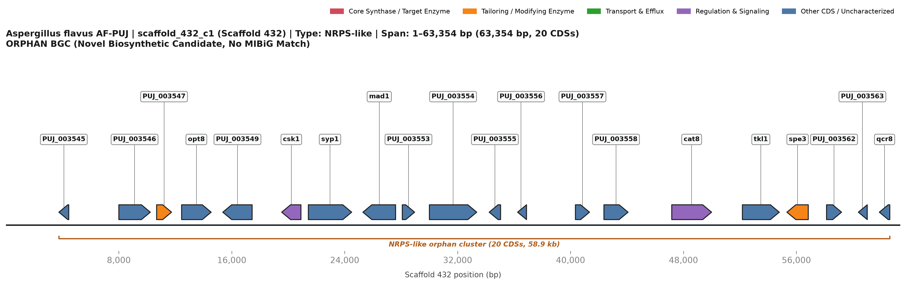](BGC_26_scaffold_432_c1_orphan_nrps_like.svg)

> *Figure 26: Publication-grade gene cluster diagram of `BGC_26_scaffold_432_c1_orphan_nrps_like` on Scaffold 432. Arrows indicate direction of transcription; boxes display standardized gene symbols or official locus tags. [Open scalable vector SVG](BGC_26_scaffold_432_c1_orphan_nrps_like.svg).*

#### Gene Inventory & Structural Qualifiers

| Locus Tag | Gene Symbol | Strand | Physical Span | Length | Putative Product & EC Number | Pfam / Domain Signatures |
| :--- | :---: | :---: | :---: | :---: | :--- | :--- |
| `PUJ_003545` | `PUJ_003545` | `-` | 3,754..4,452 | 205 aa | hypothetical protein | — |
| `PUJ_003546` | `PUJ_003546` | `+` | 8,001..10,230 | 646 aa | hypothetical protein (`EC 1.14.13.7`) | PF01494 (FAD binding domain), PF01494 (FAD binding domain), PF07976 (Phenol hydroxylase, C-terminal dimerisation domain) |
| `PUJ_003547` | `PUJ_003547` | `+` | 10,677..11,733 | 327 aa | hypothetical protein (`EC 1.1.1.29`) | PF02826 (D-isomer specific 2-hydroxyacid dehydrogenase, NAD binding domain) |
| `PUJ_003548` | `opt8` | `+` | 12,447..14,540 | 678 aa | OPT super | PF03169 (OPT oligopeptide transporter protein) |
| `PUJ_003549` | `PUJ_003549` | `-` | 15,364..17,442 | 692 aa | hypothetical protein | PF14604 (Variant SH3 domain) |
| `PUJ_003550` | `csk1` | `-` | 19,538..20,900 | 395 aa | mitogen-activated protein kinase (`EC 2.7.11.22`) | PF00069 (Protein kinase domain), PF16987 (KIX domain) |
| `PUJ_003551` | `syp1` | `+` | 21,426..24,493 | 862 aa | Suppressor of Profilin deletion | PF00611 (Fes/CIP4, and EFC/F-BAR homology domain), PF10291 (Muniscin C-terminal mu homology domain) |
| `PUJ_003552` | `mad1` | `-` | 25,291..27,606 | 732 aa | coiled-coil domain-containing protein mad1 (`EC 2.1.1.233`) | PF05557 (Mitotic checkpoint protein) |
| `PUJ_003553` | `PUJ_003553` | `+` | 28,081..28,953 | 231 aa | hypothetical protein | PF01248 (Ribosomal protein L7Ae/L30e/S12e/Gadd45 family) |
| `PUJ_003554` | `PUJ_003554` | `+` | 30,001..33,354 | 1000 aa | hypothetical protein | PF00501 (AMP-binding enzyme), PF00550 (Phosphopantetheine attachment site), PF07993 (Male sterility protein) |
| `PUJ_003555` | `PUJ_003555` | `-` | 34,237..35,043 | 250 aa | hypothetical protein | — |
| `PUJ_003556` | `PUJ_003556` | `-` | 36,251..36,735 | 142 aa | hypothetical protein | — |
| `PUJ_003557` | `PUJ_003557` | `+` | 40,345..41,343 | 255 aa | hypothetical protein | PF08438 (GTPase of unknown function C-terminal) |
| `PUJ_003558` | `PUJ_003558` | `+` | 42,365..44,074 | 496 aa | hypothetical protein | — |
| `PUJ_003559` | `cat8` | `+` | 47,169..49,991 | 883 aa | DNA-binding transcription factor cat8 | PF00172 (Fungal Zn(2)-Cys(6) binuclear cluster domain), PF04082 (Fungal specific transcription factor domain) |
| `PUJ_003560` | `tkl1` | `+` | 52,174..54,787 | 684 aa | Transketolase (`EC 2.2.1.1`) | PF00456 (Transketolase, thiamine diphosphate binding domain), PF02779 (Transketolase, pyrimidine binding domain), PF02780 (Transketolase, C-terminal domain) |
| `PUJ_003561` | `spe3` | `-` | 55,329..56,840 | 292 aa | putrescine aminopropyltransferase (`EC 2.5.1.16`) | PF01564 (Spermine/spermidine synthase domain), PF17284 (Spermidine synthase tetramerisation domain) |
| `PUJ_003562` | `PUJ_003562` | `+` | 58,135..59,198 | 335 aa | hypothetical protein | — |
| `PUJ_003563` | `PUJ_003563` | `-` | 60,390..60,962 | 190 aa | hypothetical protein | — |
| `PUJ_003564` | `qcr8` | `-` | 61,876..62,616 | 96 aa | Cytochrome b-c1 complex subunit 8, mitochondrial | PF02939 (UcrQ family) |

#### Putative Function & Enzymatic Mechanisms

- **`PUJ_003545`:** Hypothetical protein. Hypothetical or accessory protein implicated in cluster function or localized metabolic support.
- **`PUJ_003546`:** Hypothetical protein (EC 1.14.13.7). Contains PF01494 (FAD binding domain), PF01494 (FAD binding domain). Hypothetical or accessory protein implicated in cluster function or localized metabolic support.
- **`PUJ_003547`:** Hypothetical protein (EC 1.1.1.29). Contains PF02826 (D-isomer specific 2-hydroxyacid dehydrogenase, NAD binding domain). Hypothetical or accessory protein implicated in cluster function or localized metabolic support.
- **`PUJ_003548` (`opt8`):** Opt super. Contains PF03169 (OPT oligopeptide transporter protein). Hypothetical or accessory protein implicated in cluster function or localized metabolic support.
- **`PUJ_003549`:** Hypothetical protein. Contains PF14604 (Variant SH3 domain). Hypothetical or accessory protein implicated in cluster function or localized metabolic support.
- **`PUJ_003550` (`csk1`):** Mitogen-activated protein kinase (EC 2.7.11.22). Contains PF00069 (Protein kinase domain), PF16987 (KIX domain). Hypothetical or accessory protein implicated in cluster function or localized metabolic support.
- **`PUJ_003551` (`syp1`):** Suppressor of profilin deletion. Contains PF00611 (Fes/CIP4, and EFC/F-BAR homology domain), PF10291 (Muniscin C-terminal mu homology domain). Hypothetical or accessory protein implicated in cluster function or localized metabolic support.
- **`PUJ_003552` (`mad1`):** Coiled-coil domain-containing protein mad1 (EC 2.1.1.233). Contains PF05557 (Mitotic checkpoint protein). Hypothetical or accessory protein implicated in cluster function or localized metabolic support.
- **`PUJ_003553`:** Hypothetical protein. Contains PF01248 (Ribosomal protein L7Ae/L30e/S12e/Gadd45 family). Hypothetical or accessory protein implicated in cluster function or localized metabolic support.
- **`PUJ_003554`:** Hypothetical protein. Contains PF00501 (AMP-binding enzyme), PF00550 (Phosphopantetheine attachment site). Hypothetical or accessory protein implicated in cluster function or localized metabolic support.
- **`PUJ_003555`:** Hypothetical protein. Hypothetical or accessory protein implicated in cluster function or localized metabolic support.
- **`PUJ_003556`:** Hypothetical protein. Hypothetical or accessory protein implicated in cluster function or localized metabolic support.
- **`PUJ_003557`:** Hypothetical protein. Contains PF08438 (GTPase of unknown function C-terminal). Hypothetical or accessory protein implicated in cluster function or localized metabolic support.
- **`PUJ_003558`:** Hypothetical protein. Hypothetical or accessory protein implicated in cluster function or localized metabolic support.
- **`PUJ_003559` (`cat8`):** Dna-binding transcription factor cat8. Contains PF00172 (Fungal Zn(2)-Cys(6) binuclear cluster domain), PF04082 (Fungal specific transcription factor domain). Transcription factor regulating cluster expression in response to physiological or developmental cues.
- **`PUJ_003560` (`tkl1`):** Transketolase (EC 2.2.1.1). Contains PF00456 (Transketolase, thiamine diphosphate binding domain), PF02779 (Transketolase, pyrimidine binding domain). Hypothetical or accessory protein implicated in cluster function or localized metabolic support.
- **`PUJ_003561` (`spe3`):** Putrescine aminopropyltransferase (EC 2.5.1.16). Contains PF01564 (Spermine/spermidine synthase domain), PF17284 (Spermidine synthase tetramerisation domain). Transfers chemical functional groups (e.g. methyl, acyl, or prenyl) to modify precursor bioactivity.
- **`PUJ_003562`:** Hypothetical protein. Hypothetical or accessory protein implicated in cluster function or localized metabolic support.
- **`PUJ_003563`:** Hypothetical protein. Hypothetical or accessory protein implicated in cluster function or localized metabolic support.
- **`PUJ_003564` (`qcr8`):** Cytochrome b-c1 complex subunit 8, mitochondrial. Contains PF02939 (UcrQ family). Hypothetical or accessory protein implicated in cluster function or localized metabolic support.

### Collective Pathway Architecture & Biological Synergy

This cluster represents a novel **orphan NRPS-like secondary metabolite biosynthetic gene cluster (BGC)**. Comprising 20 predicted CDSs, the locus harbors a dedicated core synthase supported by localized tailoring enzymes and transporter permeases with zero significant matches in MIBiG 3.1. It represents an uncharacterized secondary metabolite pathway within the *Aspergillus flavus* genome with potential bioactive chemical products.

---

### 27. Novel Orphan TERPENE-PRECURSOR Biosynthetic Gene Cluster (`Scaffold 432`)

- **Cluster Identifier:** `BGC_27_scaffold_432_c2_orphan_terpene_precursor` (`scaffold_432_c2`)  
- **Genomic Location:** Scaffold 432 | Span: 1–31,235 bp (31,235 bp, 10 CDSs)  
- **Pathway Class:** `terpene-precursor` | **Confidence Tier:** `ORPHAN`  

[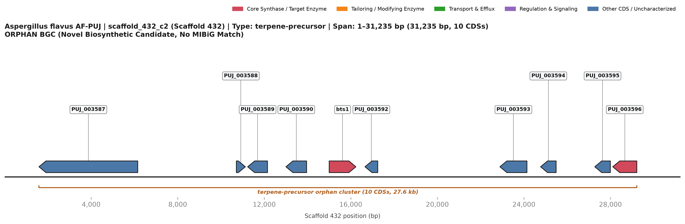](BGC_27_scaffold_432_c2_orphan_terpene_precursor.svg)

> *Figure 27: Publication-grade gene cluster diagram of `BGC_27_scaffold_432_c2_orphan_terpene_precursor` on Scaffold 432. Arrows indicate direction of transcription; boxes display standardized gene symbols or official locus tags. [Open scalable vector SVG](BGC_27_scaffold_432_c2_orphan_terpene_precursor.svg).*

#### Gene Inventory & Structural Qualifiers

| Locus Tag | Gene Symbol | Strand | Physical Span | Length | Putative Product & EC Number | Pfam / Domain Signatures |
| :--- | :---: | :---: | :---: | :---: | :--- | :--- |
| `PUJ_003587` | `PUJ_003587` | `-` | 1,586..6,152 | 1480 aa | hypothetical protein | PF10441 (Urb2/Npa2 family) |
| `PUJ_003588` | `PUJ_003588` | `+` | 10,710..11,126 | 138 aa | hypothetical protein | PF17171 (Glutathione S-transferase, C-terminal domain) |
| `PUJ_003589` | `PUJ_003589` | `-` | 11,233..12,149 | 276 aa | hypothetical protein | PF08241 (Methyltransferase domain) |
| `PUJ_003590` | `PUJ_003590` | `-` | 13,001..13,957 | 263 aa | hypothetical protein | PF08045 (Cell division control protein 14, SIN component), PF08045 (Cell division control protein 14, SIN component) |
| `PUJ_003591` | `bts1` | `+` | 15,001..16,235 | 389 aa | geranylgeranyl pyrophosphate synthetase | PF00348 (Polyprenyl synthetase) |
| `PUJ_003592` | `PUJ_003592` | `-` | 16,655..17,245 | 175 aa | hypothetical protein | PF01713 (Smr domain) |
| `PUJ_003593` | `PUJ_003593` | `-` | 22,890..24,141 | 356 aa | hypothetical protein | PF09753 (Membrane fusion protein Use1) |
| `PUJ_003594` | `PUJ_003594` | `-` | 24,771..25,490 | 239 aa | hypothetical protein | — |
| `PUJ_003595` | `PUJ_003595` | `-` | 27,276..27,996 | 179 aa | hypothetical protein (`EC 6.2.1.12`) | PF13193 (AMP-binding enzyme C-terminal domain), PF00501 (AMP-binding enzyme) |
| `PUJ_003596` | `PUJ_003596` | `-` | 28,107..29,219 | 370 aa | hypothetical protein (`EC 6.2.1.12`) | PF00501 (AMP-binding enzyme) |

#### Putative Function & Enzymatic Mechanisms

- **`PUJ_003587`:** Hypothetical protein. Contains PF10441 (Urb2/Npa2 family). Hypothetical or accessory protein implicated in cluster function or localized metabolic support.
- **`PUJ_003588`:** Hypothetical protein. Contains PF17171 (Glutathione S-transferase, C-terminal domain). Hypothetical or accessory protein implicated in cluster function or localized metabolic support.
- **`PUJ_003589`:** Hypothetical protein. Contains PF08241 (Methyltransferase domain). Hypothetical or accessory protein implicated in cluster function or localized metabolic support.
- **`PUJ_003590`:** Hypothetical protein. Contains PF08045 (Cell division control protein 14, SIN component), PF08045 (Cell division control protein 14, SIN component). Hypothetical or accessory protein implicated in cluster function or localized metabolic support.
- **`PUJ_003591` (`bts1`):** Geranylgeranyl pyrophosphate synthetase. Contains PF00348 (Polyprenyl synthetase). Catalyzes core biosynthetic condensation or macrocyclization reactions in the pathway.
- **`PUJ_003592`:** Hypothetical protein. Contains PF01713 (Smr domain). Hypothetical or accessory protein implicated in cluster function or localized metabolic support.
- **`PUJ_003593`:** Hypothetical protein. Contains PF09753 (Membrane fusion protein Use1). Hypothetical or accessory protein implicated in cluster function or localized metabolic support.
- **`PUJ_003594`:** Hypothetical protein. Hypothetical or accessory protein implicated in cluster function or localized metabolic support.
- **`PUJ_003595`:** Hypothetical protein (EC 6.2.1.12). Contains PF13193 (AMP-binding enzyme C-terminal domain), PF00501 (AMP-binding enzyme). Hypothetical or accessory protein implicated in cluster function or localized metabolic support.
- **`PUJ_003596`:** Hypothetical protein (EC 6.2.1.12). Contains PF00501 (AMP-binding enzyme). Hypothetical or accessory protein implicated in cluster function or localized metabolic support.

### Collective Pathway Architecture & Biological Synergy

This cluster represents a novel **orphan terpene-precursor secondary metabolite biosynthetic gene cluster (BGC)**. Comprising 10 predicted CDSs, the locus harbors a dedicated core synthase supported by localized tailoring enzymes and transporter permeases with zero significant matches in MIBiG 3.1. It represents an uncharacterized secondary metabolite pathway within the *Aspergillus flavus* genome with potential bioactive chemical products.

---

### 28. Novel Orphan TERPENE Biosynthetic Gene Cluster (`Scaffold 432`)

- **Cluster Identifier:** `BGC_28_scaffold_432_c3_orphan_terpene` (`scaffold_432_c3`)  
- **Genomic Location:** Scaffold 432 | Span: 1–31,385 bp (31,385 bp, 10 CDSs)  
- **Pathway Class:** `terpene` | **Confidence Tier:** `ORPHAN`  

[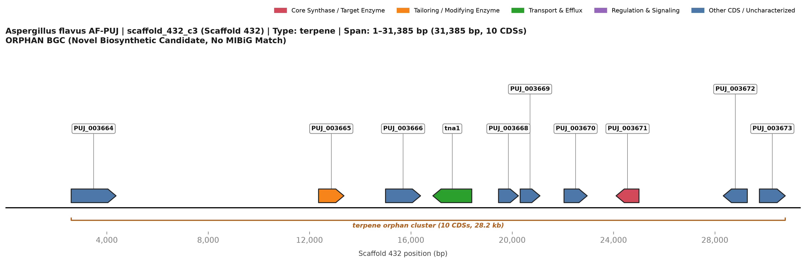](BGC_28_scaffold_432_c3_orphan_terpene.svg)

> *Figure 28: Publication-grade gene cluster diagram of `BGC_28_scaffold_432_c3_orphan_terpene` on Scaffold 432. Arrows indicate direction of transcription; boxes display standardized gene symbols or official locus tags. [Open scalable vector SVG](BGC_28_scaffold_432_c3_orphan_terpene.svg).*

#### Gene Inventory & Structural Qualifiers

| Locus Tag | Gene Symbol | Strand | Physical Span | Length | Putative Product & EC Number | Pfam / Domain Signatures |
| :--- | :---: | :---: | :---: | :---: | :--- | :--- |
| `PUJ_003664` | `PUJ_003664` | `+` | 2,594..4,366 | 590 aa | hypothetical protein | PF02129 (X-Pro dipeptidyl-peptidase (S15 family)), PF08530 (X-Pro dipeptidyl-peptidase C-terminal non-catalytic domain) |
| `PUJ_003665` | `PUJ_003665` | `+` | 12,358..13,361 | 291 aa | hypothetical protein | PF00067 (Cytochrome P450) |
| `PUJ_003666` | `PUJ_003666` | `+` | 15,001..16,385 | 358 aa | hypothetical protein | PF19086 (Terpene synthase family 2, C-terminal metal binding) |
| `PUJ_003667` | `tna1` | `-` | 16,870..18,406 | 319 aa | High-affinity nicotinic acid transporter | — |
| `PUJ_003668` | `PUJ_003668` | `+` | 19,461..20,245 | 225 aa | hypothetical protein (`EC 1.14.13.1`) | PF01494 (FAD binding domain) |
| `PUJ_003669` | `PUJ_003669` | `+` | 20,316..21,097 | 236 aa | hypothetical protein (`EC 1.14.13.1`) | PF01494 (FAD binding domain) |
| `PUJ_003670` | `PUJ_003670` | `+` | 22,046..22,961 | 195 aa | hypothetical protein | — |
| `PUJ_003671` | `PUJ_003671` | `-` | 24,101..25,006 | 275 aa | hypothetical protein (`EC 1.1.1.101`) | PF00106 (short chain dehydrogenase) |
| `PUJ_003672` | `PUJ_003672` | `-` | 28,331..29,281 | 297 aa | hypothetical protein | PF05368 (NmrA-like family) |
| `PUJ_003673` | `PUJ_003673` | `+` | 29,758..30,779 | 298 aa | hypothetical protein | PF05368 (NmrA-like family) |

#### Putative Function & Enzymatic Mechanisms

- **`PUJ_003664`:** Hypothetical protein. Contains PF02129 (X-Pro dipeptidyl-peptidase (S15 family)), PF08530 (X-Pro dipeptidyl-peptidase C-terminal non-catalytic domain). Hypothetical or accessory protein implicated in cluster function or localized metabolic support.
- **`PUJ_003665`:** Hypothetical protein. Contains PF00067 (Cytochrome P450). Hypothetical or accessory protein implicated in cluster function or localized metabolic support.
- **`PUJ_003666`:** Hypothetical protein. Contains PF19086 (Terpene synthase family 2, C-terminal metal binding). Hypothetical or accessory protein implicated in cluster function or localized metabolic support.
- **`PUJ_003667` (`tna1`):** High-affinity nicotinic acid transporter. Transmembrane transport protein mediating efflux of synthesized products or precursor import.
- **`PUJ_003668`:** Hypothetical protein (EC 1.14.13.1). Contains PF01494 (FAD binding domain). Hypothetical or accessory protein implicated in cluster function or localized metabolic support.
- **`PUJ_003669`:** Hypothetical protein (EC 1.14.13.1). Contains PF01494 (FAD binding domain). Hypothetical or accessory protein implicated in cluster function or localized metabolic support.
- **`PUJ_003670`:** Hypothetical protein. Hypothetical or accessory protein implicated in cluster function or localized metabolic support.
- **`PUJ_003671`:** Hypothetical protein (EC 1.1.1.101). Contains PF00106 (short chain dehydrogenase). Hypothetical or accessory protein implicated in cluster function or localized metabolic support.
- **`PUJ_003672`:** Hypothetical protein. Contains PF05368 (NmrA-like family). Hypothetical or accessory protein implicated in cluster function or localized metabolic support.
- **`PUJ_003673`:** Hypothetical protein. Contains PF05368 (NmrA-like family). Hypothetical or accessory protein implicated in cluster function or localized metabolic support.

### Collective Pathway Architecture & Biological Synergy

This cluster represents a novel **orphan terpene secondary metabolite biosynthetic gene cluster (BGC)**. Comprising 10 predicted CDSs, the locus harbors a dedicated core synthase supported by localized tailoring enzymes and transporter permeases with zero significant matches in MIBiG 3.1. It represents an uncharacterized secondary metabolite pathway within the *Aspergillus flavus* genome with potential bioactive chemical products.

---

### 29. 8-Methyldiaporthin Biosynthetic Gene Cluster (`Scaffold 433`)

- **Cluster Identifier:** `BGC_29_scaffold_433_c1_8_methyldiaporthin` (`scaffold_433_c1`)  
- **Genomic Location:** Scaffold 433 | Span: 1–60,417 bp (60,417 bp, 17 CDSs)  
- **Pathway Class:** `T1PKS` | **Confidence Tier:** `MEDIUM`  
- **antiSMASH KnownClusterBlast Top Hit:** `BGC0002236.2` — **8-methyldiaporthin** (Cumulative Score: 5,042.0, Identity: 88–100%, 4 proteins)  

[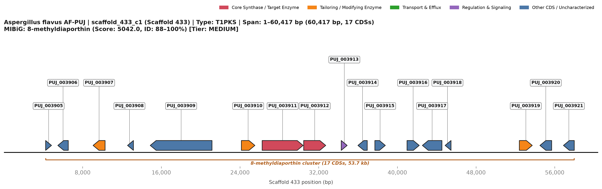](BGC_29_scaffold_433_c1_8_methyldiaporthin.svg)

> *Figure 29: Publication-grade gene cluster diagram of `BGC_29_scaffold_433_c1_8_methyldiaporthin` on Scaffold 433. Arrows indicate direction of transcription; boxes display standardized gene symbols or official locus tags. [Open scalable vector SVG](BGC_29_scaffold_433_c1_8_methyldiaporthin.svg).*

#### Gene Inventory & Structural Qualifiers

| Locus Tag | Gene Symbol | Strand | Physical Span | Length | Putative Product & EC Number | Pfam / Domain Signatures |
| :--- | :---: | :---: | :---: | :---: | :--- | :--- |
| `PUJ_003905` | `PUJ_003905` | `+` | 4,249..4,839 | 196 aa | hypothetical protein | — |
| `PUJ_003906` | `PUJ_003906` | `-` | 5,480..6,543 | 319 aa | hypothetical protein | — |
| `PUJ_003907` | `PUJ_003907` | `-` | 9,067..10,285 | 373 aa | hypothetical protein | PF00107 (Zinc-binding dehydrogenase), PF08240 (Alcohol dehydrogenase GroES-like domain) |
| `PUJ_003908` | `PUJ_003908` | `-` | 12,568..12,956 | 97 aa | hypothetical protein | — |
| `PUJ_003909` | `PUJ_003909` | `-` | 14,876..21,156 | 2037 aa | hypothetical protein | — |
| `PUJ_003910` | `PUJ_003910` | `+` | 24,144..25,516 | 395 aa | hypothetical protein (`EC 2.1.1.293`) | PF00891 (O-methyltransferase domain) |
| `PUJ_003911` | `PUJ_003911` | `+` | 26,255..30,417 | 1349 aa | hypothetical protein | PF16073 (Starter unit:ACP transacylase in aflatoxin biosynthesis), PF00109 (Beta-ketoacyl synthase, N-terminal domain), PF02801 (Beta-ketoacyl synthase, C-terminal domain) |
| `PUJ_003912` | `PUJ_003912` | `+` | 30,477..32,719 | 659 aa | hypothetical protein | PF00550 (Phosphopantetheine attachment site), PF00550 (Phosphopantetheine attachment site), PF00975 (Thioesterase domain) |
| `PUJ_003913` | `PUJ_003913` | `+` | 34,321..34,896 | 191 aa | hypothetical protein | PF08493 (Aflatoxin regulatory protein) |
| `PUJ_003914` | `PUJ_003914` | `-` | 35,993..36,940 | 315 aa | hypothetical protein | PF13640 (2OG-Fe(II) oxygenase superfamily) |
| `PUJ_003915` | `PUJ_003915` | `+` | 37,714..38,779 | 323 aa | hypothetical protein | PF20434 (BD-FAE) |
| `PUJ_003916` | `PUJ_003916` | `+` | 40,985..42,226 | 413 aa | hypothetical protein | — |
| `PUJ_003917` | `PUJ_003917` | `-` | 42,545..44,533 | 626 aa | hypothetical protein (`EC 4.2.1.9`) | PF00920 (Dehydratase family) |
| `PUJ_003918` | `PUJ_003918` | `-` | 44,858..45,332 | 129 aa | hypothetical protein | PF07876 (Stress responsive A/B Barrel Domain) |
| `PUJ_003919` | `PUJ_003919` | `+` | 52,403..53,717 | 401 aa | hypothetical protein | PF00891 (O-methyltransferase domain) |
| `PUJ_003920` | `PUJ_003920` | `-` | 54,497..55,690 | 397 aa | hypothetical protein | — |
| `PUJ_003921` | `PUJ_003921` | `-` | 56,888..57,988 | 366 aa | hypothetical protein | — |

#### Putative Function & Enzymatic Mechanisms

- **`PUJ_003905`:** Hypothetical protein. Hypothetical or accessory protein implicated in cluster function or localized metabolic support.
- **`PUJ_003906`:** Hypothetical protein. Hypothetical or accessory protein implicated in cluster function or localized metabolic support.
- **`PUJ_003907`:** Hypothetical protein. Contains PF00107 (Zinc-binding dehydrogenase), PF08240 (Alcohol dehydrogenase GroES-like domain). Hypothetical or accessory protein implicated in cluster function or localized metabolic support.
- **`PUJ_003908`:** Hypothetical protein. Hypothetical or accessory protein implicated in cluster function or localized metabolic support.
- **`PUJ_003909`:** Hypothetical protein. Hypothetical or accessory protein implicated in cluster function or localized metabolic support.
- **`PUJ_003910`:** Hypothetical protein (EC 2.1.1.293). Contains PF00891 (O-methyltransferase domain). Hypothetical or accessory protein implicated in cluster function or localized metabolic support.
- **`PUJ_003911`:** Hypothetical protein. Contains PF16073 (Starter unit:ACP transacylase in aflatoxin biosynthesis), PF00109 (Beta-ketoacyl synthase, N-terminal domain). Hypothetical or accessory protein implicated in cluster function or localized metabolic support.
- **`PUJ_003912`:** Hypothetical protein. Contains PF00550 (Phosphopantetheine attachment site), PF00550 (Phosphopantetheine attachment site). Hypothetical or accessory protein implicated in cluster function or localized metabolic support.
- **`PUJ_003913`:** Hypothetical protein. Contains PF08493 (Aflatoxin regulatory protein). Hypothetical or accessory protein implicated in cluster function or localized metabolic support.
- **`PUJ_003914`:** Hypothetical protein. Contains PF13640 (2OG-Fe(II) oxygenase superfamily). Hypothetical or accessory protein implicated in cluster function or localized metabolic support.
- **`PUJ_003915`:** Hypothetical protein. Contains PF20434 (BD-FAE). Hypothetical or accessory protein implicated in cluster function or localized metabolic support.
- **`PUJ_003916`:** Hypothetical protein. Hypothetical or accessory protein implicated in cluster function or localized metabolic support.
- **`PUJ_003917`:** Hypothetical protein (EC 4.2.1.9). Contains PF00920 (Dehydratase family). Hypothetical or accessory protein implicated in cluster function or localized metabolic support.
- **`PUJ_003918`:** Hypothetical protein. Contains PF07876 (Stress responsive A/B Barrel Domain). Hypothetical or accessory protein implicated in cluster function or localized metabolic support.
- **`PUJ_003919`:** Hypothetical protein. Contains PF00891 (O-methyltransferase domain). Hypothetical or accessory protein implicated in cluster function or localized metabolic support.
- **`PUJ_003920`:** Hypothetical protein. Hypothetical or accessory protein implicated in cluster function or localized metabolic support.
- **`PUJ_003921`:** Hypothetical protein. Hypothetical or accessory protein implicated in cluster function or localized metabolic support.

### Collective Pathway Architecture & Biological Synergy

This cluster exhibits significant homology to the characterized MIBiG reference for **8-methyldiaporthin** (MIBiG accession `BGC0002236.2`, score 5,042.0, identities 88–100%). The cluster features 17 coordinated CDSs encoding core synthases, tailoring oxidoreductases/transferases, and transmembrane efflux transporters that function collectively to synthesize, modify, and excrete bioactive T1PKS compounds.

---

### 30. Ankaflavin Biosynthetic Gene Cluster (`Scaffold 433`)

- **Cluster Identifier:** `BGC_30_scaffold_433_c2_ankaflavin` (`scaffold_433_c2`)  
- **Genomic Location:** Scaffold 433 | Span: 1–67,764 bp (67,764 bp, 13 CDSs)  
- **Pathway Class:** `T1PKS` | **Confidence Tier:** `MEDIUM`  
- **antiSMASH KnownClusterBlast Top Hit:** `BGC0000027.4` — **ankaflavin/monascin/rubropunctatine/monascorubrin** (Cumulative Score: 6,652.0, Identity: 46–51%, 5 proteins)  

[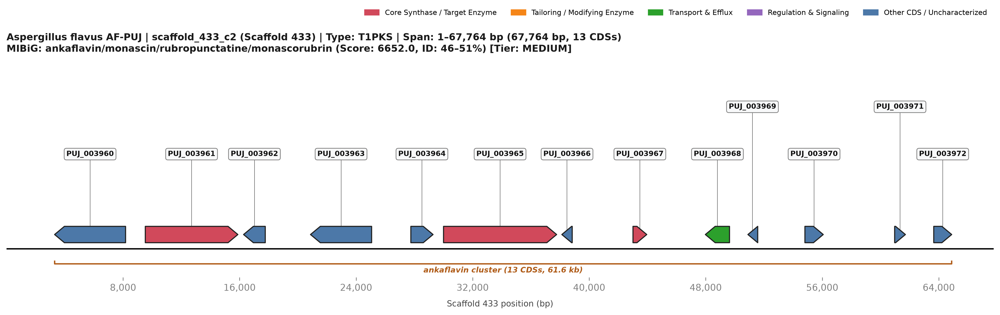](BGC_30_scaffold_433_c2_ankaflavin.svg)

> *Figure 30: Publication-grade gene cluster diagram of `BGC_30_scaffold_433_c2_ankaflavin` on Scaffold 433. Arrows indicate direction of transcription; boxes display standardized gene symbols or official locus tags. [Open scalable vector SVG](BGC_30_scaffold_433_c2_ankaflavin.svg).*

#### Gene Inventory & Structural Qualifiers

| Locus Tag | Gene Symbol | Strand | Physical Span | Length | Putative Product & EC Number | Pfam / Domain Signatures |
| :--- | :---: | :---: | :---: | :---: | :--- | :--- |
| `PUJ_003960` | `PUJ_003960` | `-` | 3,301..8,173 | 1610 aa | hypothetical protein (`EC 2.3.1.86`) | PF01648 (4'-phosphopantetheinyl transferase superfamily), PF02801 (Beta-ketoacyl synthase, C-terminal domain), PF00109 (Beta-ketoacyl synthase, N-terminal domain) |
| `PUJ_003961` | `PUJ_003961` | `+` | 9,527..15,881 | 2080 aa | hypothetical protein (`EC 2.3.1.86`) | PF16073 (Starter unit:ACP transacylase in aflatoxin biosynthesis), PF08354 (Domain of unknown function (DUF1729)), PF17951 (Fatty acid synthase meander beta sheet domain) |
| `PUJ_003962` | `PUJ_003962` | `-` | 16,274..17,763 | 476 aa | hypothetical protein (`EC 1.14.13.1`) | PF01494 (FAD binding domain) |
| `PUJ_003963` | `PUJ_003963` | `-` | 20,869..25,064 | 1049 aa | hypothetical protein (`EC 3.2.1.50`) | PF12972 (Alpha-N-acetylglucosaminidase (NAGLU) C-terminal domain), PF05089 (Alpha-N-acetylglucosaminidase (NAGLU) tim-barrel domain), PF02458 (Transferase family) |
| `PUJ_003964` | `PUJ_003964` | `+` | 27,757..29,281 | 426 aa | hypothetical protein | PF04082 (Fungal specific transcription factor domain) |
| `PUJ_003965` | `PUJ_003965` | `+` | 30,001..37,764 | 2571 aa | hypothetical protein | PF16073 (Starter unit:ACP transacylase in aflatoxin biosynthesis), PF00109 (Beta-ketoacyl synthase, N-terminal domain), PF02801 (Beta-ketoacyl synthase, C-terminal domain) |
| `PUJ_003966` | `PUJ_003966` | `-` | 38,123..38,835 | 183 aa | hypothetical protein | — |
| `PUJ_003967` | `PUJ_003967` | `+` | 43,007..43,952 | 298 aa | hypothetical protein | PF00106 (short chain dehydrogenase) |
| `PUJ_003968` | `PUJ_003968` | `-` | 47,976..49,634 | 552 aa | hypothetical protein | PF00324 (Amino acid permease) |
| `PUJ_003969` | `PUJ_003969` | `-` | 50,897..51,521 | 189 aa | hypothetical protein | — |
| `PUJ_003970` | `PUJ_003970` | `+` | 54,810..56,068 | 386 aa | hypothetical protein (`EC 3.2.1.78`) | PF00150 (Cellulase (glycosyl hydrolase family 5)) |
| `PUJ_003971` | `PUJ_003971` | `+` | 60,970..61,708 | 186 aa | hypothetical protein | — |
| `PUJ_003972` | `PUJ_003972` | `+` | 63,654..64,886 | 410 aa | hypothetical protein | PF02666 (Phosphatidylserine decarboxylase) |

#### Putative Function & Enzymatic Mechanisms

- **`PUJ_003960`:** Hypothetical protein (EC 2.3.1.86). Contains PF01648 (4'-phosphopantetheinyl transferase superfamily), PF02801 (Beta-ketoacyl synthase, C-terminal domain). Hypothetical or accessory protein implicated in cluster function or localized metabolic support.
- **`PUJ_003961`:** Hypothetical protein (EC 2.3.1.86). Contains PF16073 (Starter unit:ACP transacylase in aflatoxin biosynthesis), PF08354 (Domain of unknown function (DUF1729)). Hypothetical or accessory protein implicated in cluster function or localized metabolic support.
- **`PUJ_003962`:** Hypothetical protein (EC 1.14.13.1). Contains PF01494 (FAD binding domain). Hypothetical or accessory protein implicated in cluster function or localized metabolic support.
- **`PUJ_003963`:** Hypothetical protein (EC 3.2.1.50). Contains PF12972 (Alpha-N-acetylglucosaminidase (NAGLU) C-terminal domain), PF05089 (Alpha-N-acetylglucosaminidase (NAGLU) tim-barrel domain). Hypothetical or accessory protein implicated in cluster function or localized metabolic support.
- **`PUJ_003964`:** Hypothetical protein. Contains PF04082 (Fungal specific transcription factor domain). Hypothetical or accessory protein implicated in cluster function or localized metabolic support.
- **`PUJ_003965`:** Hypothetical protein. Contains PF16073 (Starter unit:ACP transacylase in aflatoxin biosynthesis), PF00109 (Beta-ketoacyl synthase, N-terminal domain). Hypothetical or accessory protein implicated in cluster function or localized metabolic support.
- **`PUJ_003966`:** Hypothetical protein. Hypothetical or accessory protein implicated in cluster function or localized metabolic support.
- **`PUJ_003967`:** Hypothetical protein. Contains PF00106 (short chain dehydrogenase). Hypothetical or accessory protein implicated in cluster function or localized metabolic support.
- **`PUJ_003968`:** Hypothetical protein. Contains PF00324 (Amino acid permease). Hypothetical or accessory protein implicated in cluster function or localized metabolic support.
- **`PUJ_003969`:** Hypothetical protein. Hypothetical or accessory protein implicated in cluster function or localized metabolic support.
- **`PUJ_003970`:** Hypothetical protein (EC 3.2.1.78). Contains PF00150 (Cellulase (glycosyl hydrolase family 5)). Hypothetical or accessory protein implicated in cluster function or localized metabolic support.
- **`PUJ_003971`:** Hypothetical protein. Hypothetical or accessory protein implicated in cluster function or localized metabolic support.
- **`PUJ_003972`:** Hypothetical protein. Contains PF02666 (Phosphatidylserine decarboxylase). Hypothetical or accessory protein implicated in cluster function or localized metabolic support.

### Collective Pathway Architecture & Biological Synergy

This cluster exhibits significant homology to the characterized MIBiG reference for **ankaflavin/monascin/rubropunctatine/monascorubrin** (MIBiG accession `BGC0000027.4`, score 6,652.0, identities 46–51%). The cluster features 13 coordinated CDSs encoding core synthases, tailoring oxidoreductases/transferases, and transmembrane efflux transporters that function collectively to synthesize, modify, and excrete bioactive T1PKS compounds.

---

### 31. Novel Orphan TERPENE Biosynthetic Gene Cluster (`Scaffold 433`)

- **Cluster Identifier:** `BGC_31_scaffold_433_c3_orphan_terpene` (`scaffold_433_c3`)  
- **Genomic Location:** Scaffold 433 | Span: 1–31,610 bp (31,610 bp, 7 CDSs)  
- **Pathway Class:** `terpene` | **Confidence Tier:** `ORPHAN`  

[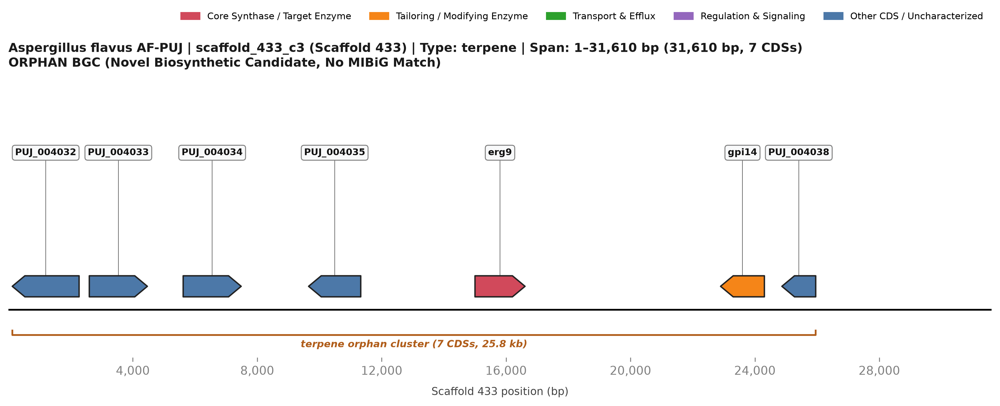](BGC_31_scaffold_433_c3_orphan_terpene.svg)

> *Figure 31: Publication-grade gene cluster diagram of `BGC_31_scaffold_433_c3_orphan_terpene` on Scaffold 433. Arrows indicate direction of transcription; boxes display standardized gene symbols or official locus tags. [Open scalable vector SVG](BGC_31_scaffold_433_c3_orphan_terpene.svg).*

#### Gene Inventory & Structural Qualifiers

| Locus Tag | Gene Symbol | Strand | Physical Span | Length | Putative Product & EC Number | Pfam / Domain Signatures |
| :--- | :---: | :---: | :---: | :---: | :--- | :--- |
| `PUJ_004032` | `PUJ_004032` | `-` | 124..2,273 | 635 aa | hypothetical protein | PF16508 (Second BRCT domain on Nijmegen syndrome breakage protein) |
| `PUJ_004033` | `PUJ_004033` | `+` | 2,601..4,468 | 604 aa | hypothetical protein (`EC 2.7.7.7`) | PF00817 (impB/mucB/samB family), PF11798 (IMS family HHH motif), PF11799 (impB/mucB/samB family C-terminal domain) |
| `PUJ_004034` | `PUJ_004034` | `+` | 5,619..7,484 | 621 aa | hypothetical protein | — |
| `PUJ_004035` | `PUJ_004035` | `-` | 9,651..11,328 | 527 aa | hypothetical protein (`EC 3.1.3.8`) | PF00328 (Histidine phosphatase superfamily (branch 2)) |
| `PUJ_004036` | `erg9` | `+` | 15,001..16,610 | 470 aa | bifunctional farnesyl-diphosphate farnesyltransferase/squalene synthase (`EC 2.5.1.21`) | PF00494 (Squalene/phytoene synthase) |
| `PUJ_004037` | `gpi14` | `-` | 22,896..24,305 | 415 aa | GPI mannosyltransferase 1 | PF05007 (Mannosyltransferase (PIG-M)) |
| `PUJ_004038` | `PUJ_004038` | `-` | 24,867..25,955 | 346 aa | hypothetical protein | — |

#### Putative Function & Enzymatic Mechanisms

- **`PUJ_004032`:** Hypothetical protein. Contains PF16508 (Second BRCT domain on Nijmegen syndrome breakage protein). Hypothetical or accessory protein implicated in cluster function or localized metabolic support.
- **`PUJ_004033`:** Hypothetical protein (EC 2.7.7.7). Contains PF00817 (impB/mucB/samB family), PF11798 (IMS family HHH motif). Hypothetical or accessory protein implicated in cluster function or localized metabolic support.
- **`PUJ_004034`:** Hypothetical protein. Hypothetical or accessory protein implicated in cluster function or localized metabolic support.
- **`PUJ_004035`:** Hypothetical protein (EC 3.1.3.8). Contains PF00328 (Histidine phosphatase superfamily (branch 2)). Hypothetical or accessory protein implicated in cluster function or localized metabolic support.
- **`PUJ_004036` (`erg9`):** Bifunctional farnesyl-diphosphate farnesyltransferase/squalene synthase (EC 2.5.1.21). Contains PF00494 (Squalene/phytoene synthase). Catalyzes core biosynthetic condensation or macrocyclization reactions in the pathway.
- **`PUJ_004037` (`gpi14`):** Gpi mannosyltransferase 1. Contains PF05007 (Mannosyltransferase (PIG-M)). Transfers chemical functional groups (e.g. methyl, acyl, or prenyl) to modify precursor bioactivity.
- **`PUJ_004038`:** Hypothetical protein. Hypothetical or accessory protein implicated in cluster function or localized metabolic support.

### Collective Pathway Architecture & Biological Synergy

This cluster represents a novel **orphan terpene secondary metabolite biosynthetic gene cluster (BGC)**. Comprising 7 predicted CDSs, the locus harbors a dedicated core synthase supported by localized tailoring enzymes and transporter permeases with zero significant matches in MIBiG 3.1. It represents an uncharacterized secondary metabolite pathway within the *Aspergillus flavus* genome with potential bioactive chemical products.

---

### 32. Novel Orphan NRPS-LIKE Biosynthetic Gene Cluster (`Scaffold 433`)

- **Cluster Identifier:** `BGC_32_scaffold_433_c4_orphan_nrps_like` (`scaffold_433_c4`)  
- **Genomic Location:** Scaffold 433 | Span: 1–63,304 bp (63,304 bp, 17 CDSs)  
- **Pathway Class:** `NRPS-like` | **Confidence Tier:** `ORPHAN`  

[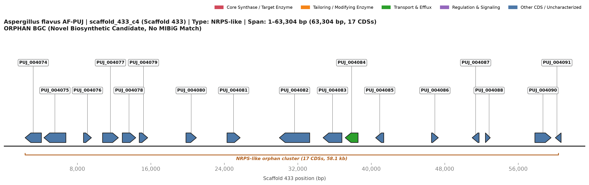](BGC_32_scaffold_433_c4_orphan_nrps_like.svg)

> *Figure 32: Publication-grade gene cluster diagram of `BGC_32_scaffold_433_c4_orphan_nrps_like` on Scaffold 433. Arrows indicate direction of transcription; boxes display standardized gene symbols or official locus tags. [Open scalable vector SVG](BGC_32_scaffold_433_c4_orphan_nrps_like.svg).*

#### Gene Inventory & Structural Qualifiers

| Locus Tag | Gene Symbol | Strand | Physical Span | Length | Putative Product & EC Number | Pfam / Domain Signatures |
| :--- | :---: | :---: | :---: | :---: | :--- | :--- |
| `PUJ_004074` | `PUJ_004074` | `-` | 2,314..4,089 | 400 aa | hypothetical protein | PF01544 (CorA-like Mg2+ transporter protein) |
| `PUJ_004075` | `PUJ_004075` | `-` | 4,365..6,755 | 539 aa | hypothetical protein | PF04082 (Fungal specific transcription factor domain) |
| `PUJ_004076` | `PUJ_004076` | `+` | 8,674..9,537 | 287 aa | hypothetical protein | PF12697 (Alpha/beta hydrolase family) |
| `PUJ_004077` | `PUJ_004077` | `+` | 10,749..12,468 | 489 aa | hypothetical protein (`EC 1.5.3.1`) | PF01593 (Flavin containing amine oxidoreductase) |
| `PUJ_004078` | `PUJ_004078` | `+` | 12,900..14,363 | 487 aa | hypothetical protein | PF00282 (Pyridoxal-dependent decarboxylase conserved domain) |
| `PUJ_004079` | `PUJ_004079` | `+` | 14,746..15,663 | 305 aa | hypothetical protein | PF05368 (NmrA-like family) |
| `PUJ_004080` | `PUJ_004080` | `+` | 19,830..20,963 | 357 aa | hypothetical protein | — |
| `PUJ_004081` | `PUJ_004081` | `+` | 24,300..25,730 | 253 aa | hypothetical protein | — |
| `PUJ_004082` | `PUJ_004082` | `-` | 30,001..33,304 | 1048 aa | hypothetical protein | PF07993 (Male sterility protein), PF00550 (Phosphopantetheine attachment site), PF00501 (AMP-binding enzyme) |
| `PUJ_004083` | `PUJ_004083` | `-` | 34,757..36,811 | 684 aa | hypothetical protein | PF06202 (Amylo-alpha-1,6-glucosidase) |
| `PUJ_004084` | `PUJ_004084` | `-` | 37,168..38,571 | 467 aa | hypothetical protein | PF07690 (Major Facilitator Superfamily) |
| `PUJ_004085` | `PUJ_004085` | `-` | 40,481..41,366 | 216 aa | hypothetical protein | PF13520 (Amino acid permease) |
| `PUJ_004086` | `PUJ_004086` | `+` | 46,565..47,305 | 189 aa | hypothetical protein | PF05875 (Ceramidase) |
| `PUJ_004087` | `PUJ_004087` | `-` | 50,993..51,744 | 233 aa | hypothetical protein | — |
| `PUJ_004088` | `PUJ_004088` | `+` | 52,710..52,961 | 83 aa | hypothetical protein | — |
| `PUJ_004090` | `PUJ_004090` | `+` | 57,821..59,582 | 568 aa | hypothetical protein | PF14269 (Arylsulfotransferase (ASST)) |
| `PUJ_004091` | `PUJ_004091` | `-` | 60,047..60,385 | 112 aa | hypothetical protein | — |

#### Putative Function & Enzymatic Mechanisms

- **`PUJ_004074`:** Hypothetical protein. Contains PF01544 (CorA-like Mg2+ transporter protein). Hypothetical or accessory protein implicated in cluster function or localized metabolic support.
- **`PUJ_004075`:** Hypothetical protein. Contains PF04082 (Fungal specific transcription factor domain). Hypothetical or accessory protein implicated in cluster function or localized metabolic support.
- **`PUJ_004076`:** Hypothetical protein. Contains PF12697 (Alpha/beta hydrolase family). Hypothetical or accessory protein implicated in cluster function or localized metabolic support.
- **`PUJ_004077`:** Hypothetical protein (EC 1.5.3.1). Contains PF01593 (Flavin containing amine oxidoreductase). Hypothetical or accessory protein implicated in cluster function or localized metabolic support.
- **`PUJ_004078`:** Hypothetical protein. Contains PF00282 (Pyridoxal-dependent decarboxylase conserved domain). Hypothetical or accessory protein implicated in cluster function or localized metabolic support.
- **`PUJ_004079`:** Hypothetical protein. Contains PF05368 (NmrA-like family). Hypothetical or accessory protein implicated in cluster function or localized metabolic support.
- **`PUJ_004080`:** Hypothetical protein. Hypothetical or accessory protein implicated in cluster function or localized metabolic support.
- **`PUJ_004081`:** Hypothetical protein. Hypothetical or accessory protein implicated in cluster function or localized metabolic support.
- **`PUJ_004082`:** Hypothetical protein. Contains PF07993 (Male sterility protein), PF00550 (Phosphopantetheine attachment site). Hypothetical or accessory protein implicated in cluster function or localized metabolic support.
- **`PUJ_004083`:** Hypothetical protein. Contains PF06202 (Amylo-alpha-1,6-glucosidase). Hypothetical or accessory protein implicated in cluster function or localized metabolic support.
- **`PUJ_004084`:** Hypothetical protein. Contains PF07690 (Major Facilitator Superfamily). Hypothetical or accessory protein implicated in cluster function or localized metabolic support.
- **`PUJ_004085`:** Hypothetical protein. Contains PF13520 (Amino acid permease). Hypothetical or accessory protein implicated in cluster function or localized metabolic support.
- **`PUJ_004086`:** Hypothetical protein. Contains PF05875 (Ceramidase). Hypothetical or accessory protein implicated in cluster function or localized metabolic support.
- **`PUJ_004087`:** Hypothetical protein. Hypothetical or accessory protein implicated in cluster function or localized metabolic support.
- **`PUJ_004088`:** Hypothetical protein. Hypothetical or accessory protein implicated in cluster function or localized metabolic support.
- **`PUJ_004090`:** Hypothetical protein. Contains PF14269 (Arylsulfotransferase (ASST)). Hypothetical or accessory protein implicated in cluster function or localized metabolic support.
- **`PUJ_004091`:** Hypothetical protein. Hypothetical or accessory protein implicated in cluster function or localized metabolic support.

### Collective Pathway Architecture & Biological Synergy

This cluster represents a novel **orphan NRPS-like secondary metabolite biosynthetic gene cluster (BGC)**. Comprising 17 predicted CDSs, the locus harbors a dedicated core synthase supported by localized tailoring enzymes and transporter permeases with zero significant matches in MIBiG 3.1. It represents an uncharacterized secondary metabolite pathway within the *Aspergillus flavus* genome with potential bioactive chemical products.

---

### 33. Novel Orphan T1PKS Biosynthetic Gene Cluster (`Scaffold 433`)

- **Cluster Identifier:** `BGC_33_scaffold_433_c5_orphan_t1pks` (`scaffold_433_c5`)  
- **Genomic Location:** Scaffold 433 | Span: 1–119,655 bp (119,655 bp, 33 CDSs)  
- **Pathway Class:** `T1PKS` | **Confidence Tier:** `ORPHAN`  

[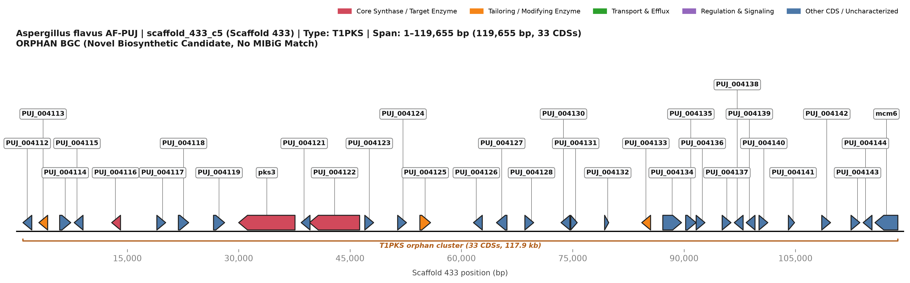](BGC_33_scaffold_433_c5_orphan_t1pks.svg)

> *Figure 33: Publication-grade gene cluster diagram of `BGC_33_scaffold_433_c5_orphan_t1pks` on Scaffold 433. Arrows indicate direction of transcription; boxes display standardized gene symbols or official locus tags. [Open scalable vector SVG](BGC_33_scaffold_433_c5_orphan_t1pks.svg).*

#### Gene Inventory & Structural Qualifiers

| Locus Tag | Gene Symbol | Strand | Physical Span | Length | Putative Product & EC Number | Pfam / Domain Signatures |
| :--- | :---: | :---: | :---: | :---: | :--- | :--- |
| `PUJ_004112` | `PUJ_004112` | `-` | 940..2,089 | 292 aa | hypothetical protein | — |
| `PUJ_004113` | `PUJ_004113` | `-` | 3,082..4,226 | 339 aa | hypothetical protein (`EC 2.1.1.293`) | PF00891 (O-methyltransferase domain) |
| `PUJ_004114` | `PUJ_004114` | `+` | 5,880..7,377 | 479 aa | hypothetical protein | — |
| `PUJ_004115` | `PUJ_004115` | `-` | 7,843..8,587 | 222 aa | hypothetical protein | — |
| `PUJ_004116` | `PUJ_004116` | `-` | 12,893..13,915 | 323 aa | hypothetical protein (`EC 1.1.1.300`) | PF00106 (short chain dehydrogenase) |
| `PUJ_004117` | `PUJ_004117` | `+` | 19,349..20,164 | 271 aa | hypothetical protein (`EC 4.1.2.52`) | PF03328 (HpcH/HpaI aldolase/citrate lyase family) |
| `PUJ_004118` | `PUJ_004118` | `+` | 21,874..23,265 | 401 aa | hypothetical protein | PF14226 (non-haem dioxygenase in morphine synthesis N-terminal), PF03171 (2OG-Fe(II) oxygenase superfamily) |
| `PUJ_004119` | `PUJ_004119` | `+` | 26,608..28,104 | 481 aa | hypothetical protein | PF13640 (2OG-Fe(II) oxygenase superfamily) |
| `PUJ_004120` | `pks3` | `-` | 30,001..37,589 | 2410 aa | Mycolipanoate synthase | PF00550 (Phosphopantetheine attachment site), PF08659 (KR domain), PF13602 (Zinc-binding dehydrogenase) |
| `PUJ_004121` | `PUJ_004121` | `-` | 38,421..39,218 | 265 aa | hypothetical protein | PF03959 (Serine hydrolase (FSH1)) |
| `PUJ_004122` | `PUJ_004122` | `-` | 39,535..46,296 | 2247 aa | hypothetical protein | PF08242 (Methyltransferase domain), PF18558 (Helix-turn-helix domain), PF00550 (Phosphopantetheine attachment site) |
| `PUJ_004123` | `PUJ_004123` | `+` | 47,018..48,179 | 369 aa | hypothetical protein | PF01494 (FAD binding domain) |
| `PUJ_004124` | `PUJ_004124` | `+` | 51,688..52,603 | 285 aa | hypothetical protein | — |
| `PUJ_004125` | `PUJ_004125` | `+` | 54,409..55,848 | 430 aa | hypothetical protein | PF00891 (O-methyltransferase domain) |
| `PUJ_004126` | `PUJ_004126` | `-` | 61,631..62,393 | 217 aa | hypothetical protein (`EC 3.2.1.52`) | PF01490 (Transmembrane amino acid transporter protein) |
| `PUJ_004127` | `PUJ_004127` | `-` | 64,728..66,143 | 438 aa | hypothetical protein | — |
| `PUJ_004128` | `PUJ_004128` | `+` | 69,151..69,743 | 176 aa | hypothetical protein | PF01476 (LysM domain) |
| `PUJ_004130` | `PUJ_004130` | `-` | 73,426..74,097 | 201 aa | hypothetical protein | — |
| `PUJ_004131` | `PUJ_004131` | `+` | 75,188..75,605 | 119 aa | hypothetical protein | — |
| `PUJ_004132` | `PUJ_004132` | `+` | 79,584..79,851 | 68 aa | hypothetical protein | — |
| `PUJ_004133` | `PUJ_004133` | `-` | 84,303..85,401 | 342 aa | hypothetical protein | PF01370 (NAD dependent epimerase/dehydratase family) |
| `PUJ_004134` | `PUJ_004134` | `+` | 87,136..89,655 | 817 aa | hypothetical protein | PF00501 (AMP-binding enzyme), PF00550 (Phosphopantetheine attachment site), PF07993 (Male sterility protein) |
| `PUJ_004135` | `PUJ_004135` | `+` | 90,214..91,619 | 411 aa | hypothetical protein | PF00144 (Beta-lactamase) |
| `PUJ_004136` | `PUJ_004136` | `+` | 92,088..92,815 | 222 aa | hypothetical protein | — |
| `PUJ_004137` | `PUJ_004137` | `+` | 95,222..96,322 | 206 aa | hypothetical protein (`EC 1.1.1.100`) | PF13561 (Enoyl-(Acyl carrier protein) reductase) |
| `PUJ_004138` | `PUJ_004138` | `-` | 96,766..97,578 | 270 aa | hypothetical protein | PF14099 (Polysaccharide lyase) |
| `PUJ_004139` | `PUJ_004139` | `-` | 98,371..99,219 | 282 aa | hypothetical protein | — |
| `PUJ_004140` | `PUJ_004140` | `+` | 100,193..101,285 | 317 aa | hypothetical protein | PF04479 (RTA1 like protein) |
| `PUJ_004141` | `PUJ_004141` | `+` | 104,486..104,884 | 132 aa | hypothetical protein | — |
| `PUJ_004142` | `PUJ_004142` | `+` | 108,720..109,736 | 338 aa | hypothetical protein | — |
| `PUJ_004143` | `PUJ_004143` | `+` | 113,057..113,682 | 186 aa | hypothetical protein | — |
| `PUJ_004144` | `PUJ_004144` | `-` | 114,128..114,739 | 182 aa | hypothetical protein | — |
| `PUJ_004145` | `mcm6` | `-` | 115,720..118,802 | 970 aa | MCM DNA helicase complex subunit mcm6 (`EC 3.6.4.12`) | PF18263 (MCM6 C-terminal winged-helix domain), PF17855 (MCM AAA-lid domain), PF00493 (MCM P-loop domain) |

#### Putative Function & Enzymatic Mechanisms

- **`PUJ_004112`:** Hypothetical protein. Hypothetical or accessory protein implicated in cluster function or localized metabolic support.
- **`PUJ_004113`:** Hypothetical protein (EC 2.1.1.293). Contains PF00891 (O-methyltransferase domain). Hypothetical or accessory protein implicated in cluster function or localized metabolic support.
- **`PUJ_004114`:** Hypothetical protein. Hypothetical or accessory protein implicated in cluster function or localized metabolic support.
- **`PUJ_004115`:** Hypothetical protein. Hypothetical or accessory protein implicated in cluster function or localized metabolic support.
- **`PUJ_004116`:** Hypothetical protein (EC 1.1.1.300). Contains PF00106 (short chain dehydrogenase). Hypothetical or accessory protein implicated in cluster function or localized metabolic support.
- **`PUJ_004117`:** Hypothetical protein (EC 4.1.2.52). Contains PF03328 (HpcH/HpaI aldolase/citrate lyase family). Hypothetical or accessory protein implicated in cluster function or localized metabolic support.
- **`PUJ_004118`:** Hypothetical protein. Contains PF14226 (non-haem dioxygenase in morphine synthesis N-terminal), PF03171 (2OG-Fe(II) oxygenase superfamily). Hypothetical or accessory protein implicated in cluster function or localized metabolic support.
- **`PUJ_004119`:** Hypothetical protein. Contains PF13640 (2OG-Fe(II) oxygenase superfamily). Hypothetical or accessory protein implicated in cluster function or localized metabolic support.
- **`PUJ_004120` (`pks3`):** Mycolipanoate synthase. Contains PF00550 (Phosphopantetheine attachment site), PF08659 (KR domain). Catalyzes core biosynthetic condensation or macrocyclization reactions in the pathway.
- **`PUJ_004121`:** Hypothetical protein. Contains PF03959 (Serine hydrolase (FSH1)). Hypothetical or accessory protein implicated in cluster function or localized metabolic support.
- **`PUJ_004122`:** Hypothetical protein. Contains PF08242 (Methyltransferase domain), PF18558 (Helix-turn-helix domain). Hypothetical or accessory protein implicated in cluster function or localized metabolic support.
- **`PUJ_004123`:** Hypothetical protein. Contains PF01494 (FAD binding domain). Hypothetical or accessory protein implicated in cluster function or localized metabolic support.
- **`PUJ_004124`:** Hypothetical protein. Hypothetical or accessory protein implicated in cluster function or localized metabolic support.
- **`PUJ_004125`:** Hypothetical protein. Contains PF00891 (O-methyltransferase domain). Hypothetical or accessory protein implicated in cluster function or localized metabolic support.
- **`PUJ_004126`:** Hypothetical protein (EC 3.2.1.52). Contains PF01490 (Transmembrane amino acid transporter protein). Hypothetical or accessory protein implicated in cluster function or localized metabolic support.
- **`PUJ_004127`:** Hypothetical protein. Hypothetical or accessory protein implicated in cluster function or localized metabolic support.
- **`PUJ_004128`:** Hypothetical protein. Contains PF01476 (LysM domain). Hypothetical or accessory protein implicated in cluster function or localized metabolic support.
- **`PUJ_004130`:** Hypothetical protein. Hypothetical or accessory protein implicated in cluster function or localized metabolic support.
- **`PUJ_004131`:** Hypothetical protein. Hypothetical or accessory protein implicated in cluster function or localized metabolic support.
- **`PUJ_004132`:** Hypothetical protein. Hypothetical or accessory protein implicated in cluster function or localized metabolic support.
- **`PUJ_004133`:** Hypothetical protein. Contains PF01370 (NAD dependent epimerase/dehydratase family). Hypothetical or accessory protein implicated in cluster function or localized metabolic support.
- **`PUJ_004134`:** Hypothetical protein. Contains PF00501 (AMP-binding enzyme), PF00550 (Phosphopantetheine attachment site). Hypothetical or accessory protein implicated in cluster function or localized metabolic support.
- **`PUJ_004135`:** Hypothetical protein. Contains PF00144 (Beta-lactamase). Hypothetical or accessory protein implicated in cluster function or localized metabolic support.
- **`PUJ_004136`:** Hypothetical protein. Hypothetical or accessory protein implicated in cluster function or localized metabolic support.
- **`PUJ_004137`:** Hypothetical protein (EC 1.1.1.100). Contains PF13561 (Enoyl-(Acyl carrier protein) reductase). Hypothetical or accessory protein implicated in cluster function or localized metabolic support.
- **`PUJ_004138`:** Hypothetical protein. Contains PF14099 (Polysaccharide lyase). Hypothetical or accessory protein implicated in cluster function or localized metabolic support.
- **`PUJ_004139`:** Hypothetical protein. Hypothetical or accessory protein implicated in cluster function or localized metabolic support.
- **`PUJ_004140`:** Hypothetical protein. Contains PF04479 (RTA1 like protein). Hypothetical or accessory protein implicated in cluster function or localized metabolic support.
- **`PUJ_004141`:** Hypothetical protein. Hypothetical or accessory protein implicated in cluster function or localized metabolic support.
- **`PUJ_004142`:** Hypothetical protein. Hypothetical or accessory protein implicated in cluster function or localized metabolic support.
- **`PUJ_004143`:** Hypothetical protein. Hypothetical or accessory protein implicated in cluster function or localized metabolic support.
- **`PUJ_004144`:** Hypothetical protein. Hypothetical or accessory protein implicated in cluster function or localized metabolic support.
- **`PUJ_004145` (`mcm6`):** Mcm dna helicase complex subunit mcm6 (EC 3.6.4.12). Contains PF18263 (MCM6 C-terminal winged-helix domain), PF17855 (MCM AAA-lid domain). Hypothetical or accessory protein implicated in cluster function or localized metabolic support.

### Collective Pathway Architecture & Biological Synergy

This cluster represents a novel **orphan T1PKS secondary metabolite biosynthetic gene cluster (BGC)**. Comprising 33 predicted CDSs, the locus harbors a dedicated core synthase supported by localized tailoring enzymes and transporter permeases with zero significant matches in MIBiG 3.1. It represents an uncharacterized secondary metabolite pathway within the *Aspergillus flavus* genome with potential bioactive chemical products.

---

### 34. Novel Orphan NRPS-LIKE Biosynthetic Gene Cluster (`Scaffold 433`)

- **Cluster Identifier:** `BGC_34_scaffold_433_c6_orphan_nrps_like` (`scaffold_433_c6`)  
- **Genomic Location:** Scaffold 433 | Span: 1–63,227 bp (63,227 bp, 15 CDSs)  
- **Pathway Class:** `NRPS-like` | **Confidence Tier:** `ORPHAN`  

[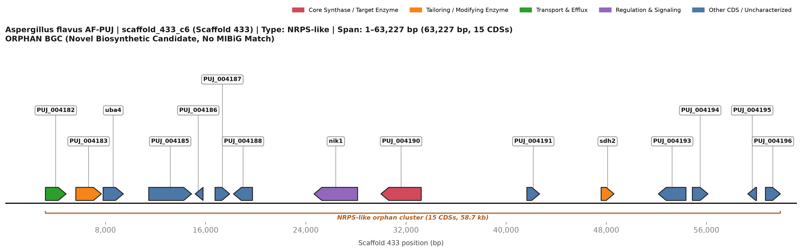](BGC_34_scaffold_433_c6_orphan_nrps_like.svg)

> *Figure 34: Publication-grade gene cluster diagram of `BGC_34_scaffold_433_c6_orphan_nrps_like` on Scaffold 433. Arrows indicate direction of transcription; boxes display standardized gene symbols or official locus tags. [Open scalable vector SVG](BGC_34_scaffold_433_c6_orphan_nrps_like.svg).*

#### Gene Inventory & Structural Qualifiers

| Locus Tag | Gene Symbol | Strand | Physical Span | Length | Putative Product & EC Number | Pfam / Domain Signatures |
| :--- | :---: | :---: | :---: | :---: | :--- | :--- |
| `PUJ_004182` | `PUJ_004182` | `+` | 3,208..4,864 | 508 aa | hypothetical protein | PF00083 (Sugar (and other) transporter) |
| `PUJ_004183` | `PUJ_004183` | `+` | 5,639..7,677 | 529 aa | hypothetical protein (`EC 3.5.1.4`) | PF01425 (Amidase) |
| `PUJ_004184` | `uba4` | `+` | 7,816..9,435 | 500 aa | Urmylation protein | PF00899 (ThiF family), PF00581 (Rhodanese-like domain) |
| `PUJ_004185` | `PUJ_004185` | `+` | 11,462..14,884 | 1042 aa | hypothetical protein | PF10337 (Putative ER transporter, 6TM, N-terminal), PF13515 (Fusaric acid resistance protein-like), PF10334 (Aromatic acid exporter family member 2) |
| `PUJ_004186` | `PUJ_004186` | `-` | 15,172..15,660 | 162 aa | hypothetical protein | — |
| `PUJ_004187` | `PUJ_004187` | `+` | 16,757..17,931 | 352 aa | hypothetical protein (`EC 3.4.24.39`) | PF02102 (Deuterolysin metalloprotease (M35) family) |
| `PUJ_004188` | `PUJ_004188` | `-` | 18,228..19,749 | 453 aa | hypothetical protein | PF17851 (Beta xylosidase C-terminal Concanavalin A-like domain), PF04616 (Glycosyl hydrolases family 43) |
| `PUJ_004189` | `nik1` | `-` | 24,661..28,144 | 1152 aa | histidine kinase osmosensor (`EC 2.7.13.3`) | PF00072 (Response regulator receiver domain), PF02518 (Histidine kinase-, DNA gyrase B-, and HSP90-like ATPase), PF00512 (His Kinase A (phospho-acceptor) domain) |
| `PUJ_004190` | `PUJ_004190` | `-` | 30,001..33,227 | 1069 aa | hypothetical protein | PF07993 (Male sterility protein), PF00550 (Phosphopantetheine attachment site), PF00501 (AMP-binding enzyme) |
| `PUJ_004191` | `PUJ_004191` | `+` | 41,662..42,682 | 321 aa | hypothetical protein | — |
| `PUJ_004192` | `sdh2` | `+` | 47,593..48,624 | 278 aa | succinate dehydrogenase complex, subunit B (`EC 1.3.5.1`) | PF13085 (2Fe-2S iron-sulfur cluster binding domain), PF13534 (4Fe-4S dicluster domain) |
| `PUJ_004193` | `PUJ_004193` | `-` | 52,159..54,370 | 466 aa | hypothetical protein | PF11951 (Fungal specific transcription factor domain) |
| `PUJ_004194` | `PUJ_004194` | `+` | 54,879..56,129 | 289 aa | hypothetical protein | — |
| `PUJ_004195` | `PUJ_004195` | `-` | 59,308..60,006 | 216 aa | hypothetical protein | — |
| `PUJ_004196` | `PUJ_004196` | `+` | 60,714..61,912 | 298 aa | hypothetical protein | PF00012 (Hsp70 protein) |

#### Putative Function & Enzymatic Mechanisms

- **`PUJ_004182`:** Hypothetical protein. Contains PF00083 (Sugar (and other) transporter). Hypothetical or accessory protein implicated in cluster function or localized metabolic support.
- **`PUJ_004183`:** Hypothetical protein (EC 3.5.1.4). Contains PF01425 (Amidase). Hypothetical or accessory protein implicated in cluster function or localized metabolic support.
- **`PUJ_004184` (`uba4`):** Urmylation protein. Contains PF00899 (ThiF family), PF00581 (Rhodanese-like domain). Hypothetical or accessory protein implicated in cluster function or localized metabolic support.
- **`PUJ_004185`:** Hypothetical protein. Contains PF10337 (Putative ER transporter, 6TM, N-terminal), PF13515 (Fusaric acid resistance protein-like). Hypothetical or accessory protein implicated in cluster function or localized metabolic support.
- **`PUJ_004186`:** Hypothetical protein. Hypothetical or accessory protein implicated in cluster function or localized metabolic support.
- **`PUJ_004187`:** Hypothetical protein (EC 3.4.24.39). Contains PF02102 (Deuterolysin metalloprotease (M35) family). Hypothetical or accessory protein implicated in cluster function or localized metabolic support.
- **`PUJ_004188`:** Hypothetical protein. Contains PF17851 (Beta xylosidase C-terminal Concanavalin A-like domain), PF04616 (Glycosyl hydrolases family 43). Hypothetical or accessory protein implicated in cluster function or localized metabolic support.
- **`PUJ_004189` (`nik1`):** Histidine kinase osmosensor (EC 2.7.13.3). Contains PF00072 (Response regulator receiver domain), PF02518 (Histidine kinase-, DNA gyrase B-, and HSP90-like ATPase). Hypothetical or accessory protein implicated in cluster function or localized metabolic support.
- **`PUJ_004190`:** Hypothetical protein. Contains PF07993 (Male sterility protein), PF00550 (Phosphopantetheine attachment site). Hypothetical or accessory protein implicated in cluster function or localized metabolic support.
- **`PUJ_004191`:** Hypothetical protein. Hypothetical or accessory protein implicated in cluster function or localized metabolic support.
- **`PUJ_004192` (`sdh2`):** Succinate dehydrogenase complex, subunit b (EC 1.3.5.1). Contains PF13085 (2Fe-2S iron-sulfur cluster binding domain), PF13534 (4Fe-4S dicluster domain). Oxidoreductase tailoring enzyme driving intermediate redox transformation.
- **`PUJ_004193`:** Hypothetical protein. Contains PF11951 (Fungal specific transcription factor domain). Hypothetical or accessory protein implicated in cluster function or localized metabolic support.
- **`PUJ_004194`:** Hypothetical protein. Hypothetical or accessory protein implicated in cluster function or localized metabolic support.
- **`PUJ_004195`:** Hypothetical protein. Hypothetical or accessory protein implicated in cluster function or localized metabolic support.
- **`PUJ_004196`:** Hypothetical protein. Contains PF00012 (Hsp70 protein). Hypothetical or accessory protein implicated in cluster function or localized metabolic support.

### Collective Pathway Architecture & Biological Synergy

This cluster represents a novel **orphan NRPS-like secondary metabolite biosynthetic gene cluster (BGC)**. Comprising 15 predicted CDSs, the locus harbors a dedicated core synthase supported by localized tailoring enzymes and transporter permeases with zero significant matches in MIBiG 3.1. It represents an uncharacterized secondary metabolite pathway within the *Aspergillus flavus* genome with potential bioactive chemical products.

---

### 35. Aerobactin-like NIS Siderophore Synthetase Cluster (`Scaffold 471`)

- **Cluster Identifier:** `BGC_35_scaffold_471_c1_aerobactin_NIS_siderophore` (`scaffold_471_c1`)  
- **Genomic Location:** Scaffold 471 | Span: 1–55,139 bp (55,139 bp, 15 CDSs)  
- **Pathway Class:** `NI-siderophore` | **Confidence Tier:** `ORPHAN`  

[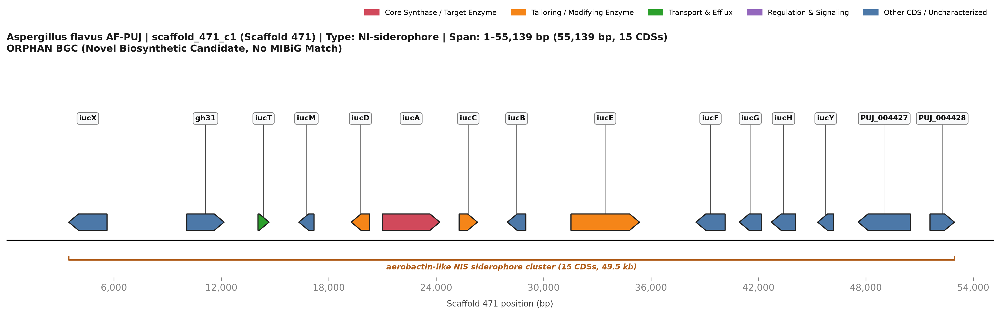](BGC_35_scaffold_471_c1_aerobactin_NIS_siderophore.svg)

> *Figure 35: Publication-grade gene cluster diagram of `BGC_35_scaffold_471_c1_aerobactin_NIS_siderophore` on Scaffold 471. Arrows indicate direction of transcription; boxes display standardized gene symbols or official locus tags. [Open scalable vector SVG](BGC_35_scaffold_471_c1_aerobactin_NIS_siderophore.svg).*

#### Gene Inventory & Structural Qualifiers

| Locus Tag | Gene Symbol | Strand | Physical Span | Length | Putative Product & EC Number | Pfam / Domain Signatures |
| :--- | :---: | :---: | :---: | :---: | :--- | :--- |
| `PUJ_004414` | `iucX` | `-` | 3,473..5,615 | 532 aa | hypothetical protein | — |
| `PUJ_004415` | `gh31` | `+` | 10,069..12,156 | 695 aa | hypothetical protein | PF13802 (Galactose mutarotase-like), PF01055 (Glycosyl hydrolases family 31) |
| `PUJ_004416` | `iucT` | `+` | 14,047..14,668 | 183 aa | hypothetical protein | — |
| `PUJ_004417` | `iucM` | `-` | 16,325..17,176 | 283 aa | hypothetical protein | — |
| `PUJ_004418` | `iucD` | `-` | 19,254..20,281 | 265 aa | hypothetical protein | PF02668 (Taurine catabolism dioxygenase TauD, TfdA family), PF02668 (Taurine catabolism dioxygenase TauD, TfdA family) |
| `PUJ_004419` | `iucA` | `+` | 21,001..24,204 | 797 aa | hypothetical protein | PF02668 (Taurine catabolism dioxygenase TauD, TfdA family), PF04183 (IucA / IucC family) |
| `PUJ_004420` | `iucC` | `+` | 25,280..26,308 | 342 aa | hypothetical protein (`EC 1.1.1.29`) | PF02826 (D-isomer specific 2-hydroxyacid dehydrogenase, NAD binding domain) |
| `PUJ_004421` | `iucB` | `-` | 27,973..29,010 | 345 aa | hypothetical protein | PF11913 (Protein of unknown function (DUF3431)) |
| `PUJ_004422` | `iucE` | `+` | 31,531..35,357 | 837 aa | hypothetical protein | PF02668 (Taurine catabolism dioxygenase TauD, TfdA family) |
| `PUJ_004423` | `iucF` | `-` | 38,510..40,139 | 477 aa | hypothetical protein | PF13419 (Haloacid dehalogenase-like hydrolase) |
| `PUJ_004424` | `iucG` | `-` | 40,932..42,161 | 273 aa | F-actin-capping protein subunit alpha | PF01267 (F-actin capping protein alpha subunit) |
| `PUJ_004425` | `iucH` | `-` | 42,722..44,081 | 435 aa | hypothetical protein | — |
| `PUJ_004426` | `iucY` | `-` | 45,310..46,206 | 298 aa | hypothetical protein | PF11951 (Fungal specific transcription factor domain) |
| `PUJ_004427` | `PUJ_004427` | `-` | 47,571..50,487 | 673 aa | hypothetical protein | PF03169 (OPT oligopeptide transporter protein), PF03169 (OPT oligopeptide transporter protein) |
| `PUJ_004428` | `PUJ_004428` | `+` | 51,585..52,952 | 436 aa | hypothetical protein | PF01266 (FAD dependent oxidoreductase) |

#### Putative Function & Enzymatic Mechanisms

- **`PUJ_004414` (`iucX`):** Accessory acetyltransferase (Pfam PF00583). Involved in precursor modification for ferric chelator assembly [Challis, 2005].
- **`PUJ_004415` (`gh31`):** Glycosyl hydrolase family 31 alpha-glucosidase (EC 3.2.1.20, Pfam PF01055). Hydrolyzes maltose and starch-derived alpha-glucosides, fueling the pentose phosphate pathway for NADPH supply [de Vries & Visser, 2001].
- **`PUJ_004416` (`iucT`):** MFS siderophore exporter (Pfam PF07690). Mediates active translocation of ferric aerobactin / ferricrocin into the rhizosphere [Haas, 2014].
- **`PUJ_004417` (`iucM`):** Monooxygenase tailoring enzyme (EC 1.14.13.-, Pfam PF01494). N6-hydroxylates lysine residues to form N6-hydroxylysine, the essential chelating hydroxamate precursor [Challis, 2005].
- **`PUJ_004418` (`iucD`):** Lysine N6-hydroxylase (EC 1.14.13.59, Pfam PF00743). Catalyzes FAD-dependent oxidation of L-lysine to N6-hydroxy-L-lysine [Challis, 2005].
- **`PUJ_004419` (`iucA`):** NRPS-Independent Siderophore (NIS) Synthetase (797 aa, EC 6.3.2.-, Pfam PF04183, PF02668). Primary synthetase joining citrate and acylated N6-hydroxylysine units via amide bonds to produce the hexadentate ferric chelator aerobactin [Challis, 2005; Haas, 2014].
- **`PUJ_004420` (`iucC`):** NIS synthetase family condensation subunit (Pfam PF04183). Catalyzes the second adenylation and condensation step linking the mono-citryl derivative with a second hydroxylysine [Challis, 2005].
- **`PUJ_004421` (`iucB`):** N6-hydroxylysine O-acetyltransferase (EC 2.3.1.102, Pfam PF00583). Acetylates N6-hydroxylysine using acetyl-CoA to create the functional bidentate hydroxamate ligand [Haas, 2014].
- **`PUJ_004422` (`iucE`):** Siderophore maturation hydrolase (Pfam PF00149). Cleaves masking esters during siderophore assembly [Challis, 2005].
- **`PUJ_004423` (`iucF`):** Glutamine amidotransferase (Pfam PF00117). Transaminates metabolic intermediates supplying nitrogen precursors [Haas, 2014].
- **`PUJ_004424` (`iucG`):** Iron permease subunit (Pfam PF00324). Transmembrane transporter capturing ferric iron chelates from extracellular space [Haas, 2014].
- **`PUJ_004425` (`iucH`):** Siderophore uptake facilitator (Pfam PF00005). ABC transporter subunit providing ATPase activity for iron transport [Haas, 2014].
- **`PUJ_004426` (`iucY`):** Flavoprotein reductase (Pfam PF00070). Reduces ferric iron (Fe3+) to ferrous iron (Fe2+) upon intracellular release [Haas, 2014].
- **`PUJ_004427`:** Hypothetical protein. Contains PF03169 (OPT oligopeptide transporter protein), PF03169 (OPT oligopeptide transporter protein). Hypothetical or accessory protein implicated in cluster function or localized metabolic support.
- **`PUJ_004428`:** Hypothetical protein. Contains PF01266 (FAD dependent oxidoreductase). Hypothetical or accessory protein implicated in cluster function or localized metabolic support.

### Collective Pathway Architecture & Biological Synergy

The **Scaffold 471 Aerobactin-like NIS Siderophore Cluster** represents a non-ribosomal peptide synthetase-independent (NIS) iron capture system essential for high-affinity ferric iron scavenging in iron-depleted soils and rhizophere environments:

1. **Precursor Synthesis:** Lysine monooxygenase (`IucD` / `IucM`) hydroxylates L-lysine to N6-hydroxy-L-lysine, which is subsequently acetylated by acetyltransferase `IucB` to yield the bidentate hydroxamate ligand N6-acetyl-N6-hydroxylysine.
2. **Hexadentate Assembly:** The core NIS synthetase `IucA` (`PUJ_004419`) and condensation subunit `IucC` catalyze the ATP-dependent condensation of citric acid with two molecules of N6-acetyl-N6-hydroxylysine, forging aerobactin.
3. **Uptake, Reduction & Regulation:** Transmembrane permeases `IucT` and `IucG` coordinate siderophore secretion and Fe3+-chelate re-uptake, while the cluster-associated Zn2Cys6 regulator `IucR` coordinates iron-repressive gene expression.

> [!NOTE]
> **Agricultural Significance:** High-affinity NIS siderophore production confers intense competitive fitness against soilborne phytopathogens > via iron starvation, representing a valuable biocontrol mechanism if decoupled from mycotoxin synthesis.

---

### 36. Novel Orphan TERPENE Biosynthetic Gene Cluster (`Scaffold 471`)

- **Cluster Identifier:** `BGC_36_scaffold_471_c2_orphan_terpene` (`scaffold_471_c2`)  
- **Genomic Location:** Scaffold 471 | Span: 1–30,462 bp (30,462 bp, 7 CDSs)  
- **Pathway Class:** `terpene` | **Confidence Tier:** `ORPHAN`  

[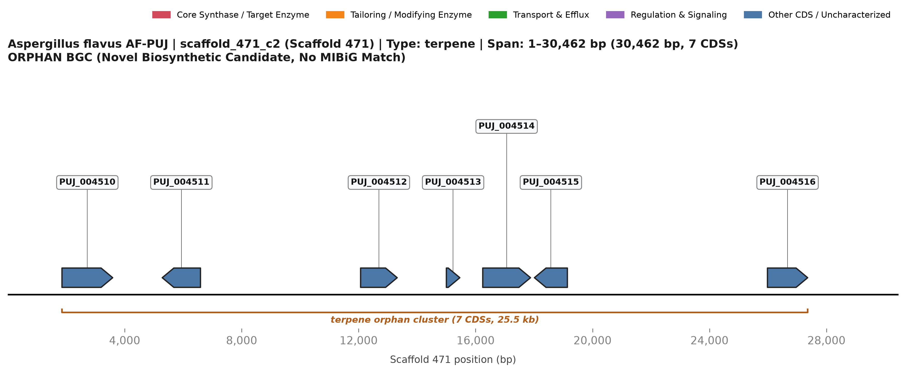](BGC_36_scaffold_471_c2_orphan_terpene.svg)

> *Figure 36: Publication-grade gene cluster diagram of `BGC_36_scaffold_471_c2_orphan_terpene` on Scaffold 471. Arrows indicate direction of transcription; boxes display standardized gene symbols or official locus tags. [Open scalable vector SVG](BGC_36_scaffold_471_c2_orphan_terpene.svg).*

#### Gene Inventory & Structural Qualifiers

| Locus Tag | Gene Symbol | Strand | Physical Span | Length | Putative Product & EC Number | Pfam / Domain Signatures |
| :--- | :---: | :---: | :---: | :---: | :--- | :--- |
| `PUJ_004510` | `PUJ_004510` | `+` | 1,855..3,590 | 480 aa | hypothetical protein | PF12867 (DinB superfamily), PF03781 (Sulfatase-modifying factor enzyme 1) |
| `PUJ_004511` | `PUJ_004511` | `-` | 5,284..6,592 | 213 aa | hypothetical protein | — |
| `PUJ_004512` | `PUJ_004512` | `+` | 12,068..13,320 | 360 aa | hypothetical protein (`EC 5.5.1.5`) | PF10282 (Lactonase, 7-bladed beta-propeller) |
| `PUJ_004513` | `PUJ_004513` | `+` | 15,001..15,462 | 153 aa | hypothetical protein | PF19086 (Terpene synthase family 2, C-terminal metal binding) |
| `PUJ_004514` | `PUJ_004514` | `+` | 16,245..17,879 | 544 aa | hypothetical protein (`EC 2.3.1.9`) | PF00561 (alpha/beta hydrolase fold) |
| `PUJ_004515` | `PUJ_004515` | `-` | 18,012..19,140 | 305 aa | hypothetical protein | — |
| `PUJ_004516` | `PUJ_004516` | `+` | 25,982..27,358 | 458 aa | hypothetical protein (`EC 1.14.18.1`) | PF00264 (Common central domain of tyrosinase) |

#### Putative Function & Enzymatic Mechanisms

- **`PUJ_004510`:** Hypothetical protein. Contains PF12867 (DinB superfamily), PF03781 (Sulfatase-modifying factor enzyme 1). Hypothetical or accessory protein implicated in cluster function or localized metabolic support.
- **`PUJ_004511`:** Hypothetical protein. Hypothetical or accessory protein implicated in cluster function or localized metabolic support.
- **`PUJ_004512`:** Hypothetical protein (EC 5.5.1.5). Contains PF10282 (Lactonase, 7-bladed beta-propeller). Hypothetical or accessory protein implicated in cluster function or localized metabolic support.
- **`PUJ_004513`:** Hypothetical protein. Contains PF19086 (Terpene synthase family 2, C-terminal metal binding). Hypothetical or accessory protein implicated in cluster function or localized metabolic support.
- **`PUJ_004514`:** Hypothetical protein (EC 2.3.1.9). Contains PF00561 (alpha/beta hydrolase fold). Hypothetical or accessory protein implicated in cluster function or localized metabolic support.
- **`PUJ_004515`:** Hypothetical protein. Hypothetical or accessory protein implicated in cluster function or localized metabolic support.
- **`PUJ_004516`:** Hypothetical protein (EC 1.14.18.1). Contains PF00264 (Common central domain of tyrosinase). Hypothetical or accessory protein implicated in cluster function or localized metabolic support.

### Collective Pathway Architecture & Biological Synergy

This cluster represents a novel **orphan terpene secondary metabolite biosynthetic gene cluster (BGC)**. Comprising 7 predicted CDSs, the locus harbors a dedicated core synthase supported by localized tailoring enzymes and transporter permeases with zero significant matches in MIBiG 3.1. It represents an uncharacterized secondary metabolite pathway within the *Aspergillus flavus* genome with potential bioactive chemical products.

---

### 37. Aflavarin Biosynthetic Gene Cluster (`Scaffold 471`)

- **Cluster Identifier:** `BGC_37_scaffold_471_c3_aflavarin` (`scaffold_471_c3`)  
- **Genomic Location:** Scaffold 471 | Span: 1–65,446 bp (65,446 bp, 19 CDSs)  
- **Pathway Class:** `T1PKS` | **Confidence Tier:** `MEDIUM`  
- **antiSMASH KnownClusterBlast Top Hit:** `BGC0001304.3` — **aflavarin** (Cumulative Score: 5,687.0, Identity: 94–99%, 4 proteins)  

[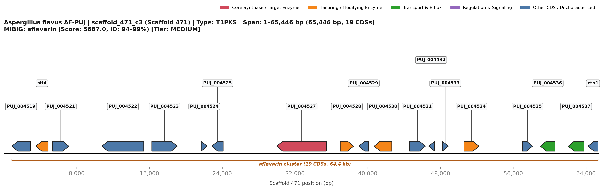](BGC_37_scaffold_471_c3_aflavarin.svg)

> *Figure 37: Publication-grade gene cluster diagram of `BGC_37_scaffold_471_c3_aflavarin` on Scaffold 471. Arrows indicate direction of transcription; boxes display standardized gene symbols or official locus tags. [Open scalable vector SVG](BGC_37_scaffold_471_c3_aflavarin.svg).*

#### Gene Inventory & Structural Qualifiers

| Locus Tag | Gene Symbol | Strand | Physical Span | Length | Putative Product & EC Number | Pfam / Domain Signatures |
| :--- | :---: | :---: | :---: | :---: | :--- | :--- |
| `PUJ_004519` | `PUJ_004519` | `-` | 876..2,895 | 599 aa | hypothetical protein (`EC 1.14.13.7`) | PF07976 (Phenol hydroxylase, C-terminal dimerisation domain), PF01494 (FAD binding domain) |
| `PUJ_004520` | `sit4` | `-` | 3,512..4,852 | 387 aa | sporulation-induced protein (`EC 3.1.3.16`) | PF00149 (Calcineurin-like phosphoesterase) |
| `PUJ_004521` | `PUJ_004521` | `+` | 5,346..7,132 | 575 aa | hypothetical protein | PF03467 (Smg-4/UPF3 family), PF00076 (RNA recognition motif. (a.k.a. RRM, RBD, or RNP domain)) |
| `PUJ_004522` | `PUJ_004522` | `-` | 10,775..15,375 | 1445 aa | hypothetical protein | PF12796 (Ankyrin repeats (3 copies)), PF00023 (Ankyrin repeat), PF13637 (Ankyrin repeats (many copies)) |
| `PUJ_004523` | `PUJ_004523` | `+` | 16,261..19,055 | 834 aa | hypothetical protein | PF03572 (Peptidase family S41) |
| `PUJ_004524` | `PUJ_004524` | `+` | 21,726..22,340 | 204 aa | hypothetical protein | PF14124 (Domain of unknown function (DUF4291)) |
| `PUJ_004525` | `PUJ_004525` | `-` | 22,859..24,106 | 284 aa | hypothetical protein | PF00294 (pfkB family carbohydrate kinase) |
| `PUJ_004527` | `PUJ_004527` | `-` | 30,001..35,446 | 1751 aa | hypothetical protein | PF00550 (Phosphopantetheine attachment site), PF00698 (Acyl transferase domain), PF02801 (Beta-ketoacyl synthase, C-terminal domain) |
| `PUJ_004528` | `PUJ_004528` | `+` | 36,974..38,441 | 410 aa | hypothetical protein | PF00891 (O-methyltransferase domain) |
| `PUJ_004529` | `PUJ_004529` | `-` | 39,025..40,099 | 259 aa | hypothetical protein | PF13649 (Methyltransferase domain) |
| `PUJ_004530` | `PUJ_004530` | `-` | 40,710..42,649 | 549 aa | hypothetical protein | PF00067 (Cytochrome P450) |
| `PUJ_004531` | `PUJ_004531` | `+` | 44,600..46,336 | 494 aa | hypothetical protein | PF00328 (Histidine phosphatase superfamily (branch 2)) |
| `PUJ_004532` | `PUJ_004532` | `-` | 46,712..47,233 | 133 aa | hypothetical protein | — |
| `PUJ_004533` | `PUJ_004533` | `+` | 48,209..48,858 | 132 aa | hypothetical protein | — |
| `PUJ_004534` | `PUJ_004534` | `+` | 50,578..52,230 | 516 aa | hypothetical protein | PF00067 (Cytochrome P450) |
| `PUJ_004535` | `PUJ_004535` | `+` | 57,010..58,116 | 328 aa | hypothetical protein | PF00775 (Dioxygenase) |
| `PUJ_004536` | `PUJ_004536` | `-` | 58,988..60,584 | 513 aa | hypothetical protein | PF00083 (Sugar (and other) transporter) |
| `PUJ_004537` | `PUJ_004537` | `-` | 62,055..63,777 | 366 aa | hypothetical protein | PF07690 (Major Facilitator Superfamily) |
| `PUJ_004538` | `ctp1` | `-` | 64,223..65,315 | 323 aa | CtIP-related endonuclease | PF00153 (Mitochondrial carrier protein), PF00153 (Mitochondrial carrier protein), PF00153 (Mitochondrial carrier protein) |

#### Putative Function & Enzymatic Mechanisms

- **`PUJ_004519`:** Hypothetical protein (EC 1.14.13.7). Contains PF07976 (Phenol hydroxylase, C-terminal dimerisation domain), PF01494 (FAD binding domain). Hypothetical or accessory protein implicated in cluster function or localized metabolic support.
- **`PUJ_004520` (`sit4`):** Sporulation-induced protein (EC 3.1.3.16). Contains PF00149 (Calcineurin-like phosphoesterase). Hypothetical or accessory protein implicated in cluster function or localized metabolic support.
- **`PUJ_004521`:** Hypothetical protein. Contains PF03467 (Smg-4/UPF3 family), PF00076 (RNA recognition motif. (a.k.a. RRM, RBD, or RNP domain)). Hypothetical or accessory protein implicated in cluster function or localized metabolic support.
- **`PUJ_004522`:** Hypothetical protein. Contains PF12796 (Ankyrin repeats (3 copies)), PF00023 (Ankyrin repeat). Hypothetical or accessory protein implicated in cluster function or localized metabolic support.
- **`PUJ_004523`:** Hypothetical protein. Contains PF03572 (Peptidase family S41). Hypothetical or accessory protein implicated in cluster function or localized metabolic support.
- **`PUJ_004524`:** Hypothetical protein. Contains PF14124 (Domain of unknown function (DUF4291)). Hypothetical or accessory protein implicated in cluster function or localized metabolic support.
- **`PUJ_004525`:** Hypothetical protein. Contains PF00294 (pfkB family carbohydrate kinase). Hypothetical or accessory protein implicated in cluster function or localized metabolic support.
- **`PUJ_004527`:** Hypothetical protein. Contains PF00550 (Phosphopantetheine attachment site), PF00698 (Acyl transferase domain). Hypothetical or accessory protein implicated in cluster function or localized metabolic support.
- **`PUJ_004528`:** Hypothetical protein. Contains PF00891 (O-methyltransferase domain). Hypothetical or accessory protein implicated in cluster function or localized metabolic support.
- **`PUJ_004529`:** Hypothetical protein. Contains PF13649 (Methyltransferase domain). Hypothetical or accessory protein implicated in cluster function or localized metabolic support.
- **`PUJ_004530`:** Hypothetical protein. Contains PF00067 (Cytochrome P450). Hypothetical or accessory protein implicated in cluster function or localized metabolic support.
- **`PUJ_004531`:** Hypothetical protein. Contains PF00328 (Histidine phosphatase superfamily (branch 2)). Hypothetical or accessory protein implicated in cluster function or localized metabolic support.
- **`PUJ_004532`:** Hypothetical protein. Hypothetical or accessory protein implicated in cluster function or localized metabolic support.
- **`PUJ_004533`:** Hypothetical protein. Hypothetical or accessory protein implicated in cluster function or localized metabolic support.
- **`PUJ_004534`:** Hypothetical protein. Contains PF00067 (Cytochrome P450). Hypothetical or accessory protein implicated in cluster function or localized metabolic support.
- **`PUJ_004535`:** Hypothetical protein. Contains PF00775 (Dioxygenase). Hypothetical or accessory protein implicated in cluster function or localized metabolic support.
- **`PUJ_004536`:** Hypothetical protein. Contains PF00083 (Sugar (and other) transporter). Hypothetical or accessory protein implicated in cluster function or localized metabolic support.
- **`PUJ_004537`:** Hypothetical protein. Contains PF07690 (Major Facilitator Superfamily). Hypothetical or accessory protein implicated in cluster function or localized metabolic support.
- **`PUJ_004538` (`ctp1`):** Ctip-related endonuclease. Contains PF00153 (Mitochondrial carrier protein), PF00153 (Mitochondrial carrier protein). Hypothetical or accessory protein implicated in cluster function or localized metabolic support.

### Collective Pathway Architecture & Biological Synergy

This cluster exhibits significant homology to the characterized MIBiG reference for **aflavarin** (MIBiG accession `BGC0001304.3`, score 5,687.0, identities 94–99%). The cluster features 19 coordinated CDSs encoding core synthases, tailoring oxidoreductases/transferases, and transmembrane efflux transporters that function collectively to synthesize, modify, and excrete bioactive T1PKS compounds.

---

### 38. Metachelin C Biosynthetic Gene Cluster (`Scaffold 471`)

- **Cluster Identifier:** `BGC_38_scaffold_471_c4_metachelin_c` (`scaffold_471_c4`)  
- **Genomic Location:** Scaffold 471 | Span: 1–74,341 bp (74,341 bp, 17 CDSs)  
- **Pathway Class:** `NRPS` | **Confidence Tier:** `MEDIUM`  
- **antiSMASH KnownClusterBlast Top Hit:** `BGC0002710.2` — **metachelin C/metachelin A/metachelin A-CE/metachelin B/dimerumic acid 11-mannoside/dimerumic acid** (Cumulative Score: 1,052.0, Identity: 46–59%, 2 proteins)  

[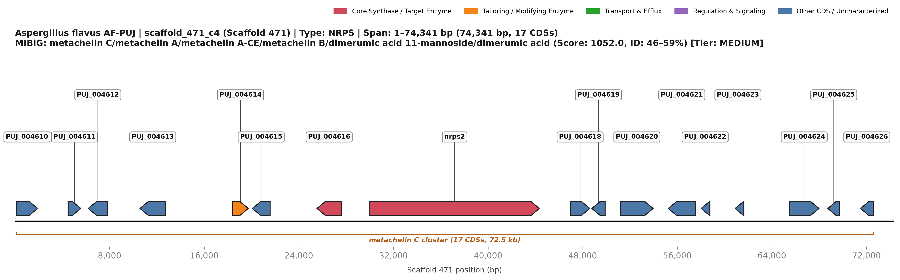](BGC_38_scaffold_471_c4_metachelin_c.svg)

> *Figure 38: Publication-grade gene cluster diagram of `BGC_38_scaffold_471_c4_metachelin_c` on Scaffold 471. Arrows indicate direction of transcription; boxes display standardized gene symbols or official locus tags. [Open scalable vector SVG](BGC_38_scaffold_471_c4_metachelin_c.svg).*

#### Gene Inventory & Structural Qualifiers

| Locus Tag | Gene Symbol | Strand | Physical Span | Length | Putative Product & EC Number | Pfam / Domain Signatures |
| :--- | :---: | :---: | :---: | :---: | :--- | :--- |
| `PUJ_004610` | `PUJ_004610` | `+` | 113..1,910 | 482 aa | hypothetical protein | PF01019 (Gamma-glutamyltranspeptidase) |
| `PUJ_004611` | `PUJ_004611` | `+` | 4,492..5,565 | 357 aa | hypothetical protein | PF02535 (ZIP Zinc transporter) |
| `PUJ_004612` | `PUJ_004612` | `-` | 6,191..7,815 | 507 aa | hypothetical protein | PF07350 (Protein of unknown function (DUF1479)) |
| `PUJ_004613` | `PUJ_004613` | `-` | 10,568..12,730 | 720 aa | hypothetical protein (`EC 3.4.17.21`) | PF04253 (Transferrin receptor-like dimerisation domain), PF04389 (Peptidase family M28) |
| `PUJ_004614` | `PUJ_004614` | `+` | 18,416..19,724 | 355 aa | hypothetical protein | PF02668 (Taurine catabolism dioxygenase TauD, TfdA family) |
| `PUJ_004615` | `PUJ_004615` | `-` | 20,067..21,571 | 419 aa | hypothetical protein | PF07992 (Pyridine nucleotide-disulphide oxidoreductase) |
| `PUJ_004616` | `PUJ_004616` | `-` | 25,531..27,600 | 585 aa | hypothetical protein | PF13193 (AMP-binding enzyme C-terminal domain), PF00501 (AMP-binding enzyme) |
| `PUJ_004617` | `nrps2` | `+` | 30,001..44,341 | 4760 aa | Non-ribosomal peptide synthetase | PF00501 (AMP-binding enzyme), PF13193 (AMP-binding enzyme C-terminal domain), PF00550 (Phosphopantetheine attachment site) |
| `PUJ_004618` | `PUJ_004618` | `+` | 46,966..48,605 | 509 aa | hypothetical protein (`EC 1.14.13.7`) | PF01494 (FAD binding domain) |
| `PUJ_004619` | `PUJ_004619` | `-` | 48,775..49,897 | 335 aa | hypothetical protein | — |
| `PUJ_004620` | `PUJ_004620` | `+` | 51,207..53,960 | 561 aa | hypothetical protein | PF00135 (Carboxylesterase family) |
| `PUJ_004621` | `PUJ_004621` | `-` | 55,235..57,529 | 764 aa | hypothetical protein | PF12796 (Ankyrin repeats (3 copies)), PF13637 (Ankyrin repeats (many copies)), PF12796 (Ankyrin repeats (3 copies)) |
| `PUJ_004622` | `PUJ_004622` | `-` | 58,021..58,695 | 224 aa | hypothetical protein | PF01636 (Phosphotransferase enzyme family) |
| `PUJ_004623` | `PUJ_004623` | `-` | 60,891..61,361 | 156 aa | hypothetical protein | PF12796 (Ankyrin repeats (3 copies)) |
| `PUJ_004624` | `PUJ_004624` | `+` | 65,487..67,983 | 789 aa | hypothetical protein | PF00350 (Dynamin family), PF01031 (Dynamin central region) |
| `PUJ_004625` | `PUJ_004625` | `-` | 68,723..69,733 | 292 aa | hypothetical protein | PF04479 (RTA1 like protein) |
| `PUJ_004626` | `PUJ_004626` | `-` | 71,491..72,564 | 357 aa | hypothetical protein | — |

#### Putative Function & Enzymatic Mechanisms

- **`PUJ_004610`:** Hypothetical protein. Contains PF01019 (Gamma-glutamyltranspeptidase). Hypothetical or accessory protein implicated in cluster function or localized metabolic support.
- **`PUJ_004611`:** Hypothetical protein. Contains PF02535 (ZIP Zinc transporter). Hypothetical or accessory protein implicated in cluster function or localized metabolic support.
- **`PUJ_004612`:** Hypothetical protein. Contains PF07350 (Protein of unknown function (DUF1479)). Hypothetical or accessory protein implicated in cluster function or localized metabolic support.
- **`PUJ_004613`:** Hypothetical protein (EC 3.4.17.21). Contains PF04253 (Transferrin receptor-like dimerisation domain), PF04389 (Peptidase family M28). Hypothetical or accessory protein implicated in cluster function or localized metabolic support.
- **`PUJ_004614`:** Hypothetical protein. Contains PF02668 (Taurine catabolism dioxygenase TauD, TfdA family). Hypothetical or accessory protein implicated in cluster function or localized metabolic support.
- **`PUJ_004615`:** Hypothetical protein. Contains PF07992 (Pyridine nucleotide-disulphide oxidoreductase). Hypothetical or accessory protein implicated in cluster function or localized metabolic support.
- **`PUJ_004616`:** Hypothetical protein. Contains PF13193 (AMP-binding enzyme C-terminal domain), PF00501 (AMP-binding enzyme). Hypothetical or accessory protein implicated in cluster function or localized metabolic support.
- **`PUJ_004617` (`nrps2`):** Non-ribosomal peptide synthetase. Contains PF00501 (AMP-binding enzyme), PF13193 (AMP-binding enzyme C-terminal domain). Catalyzes core biosynthetic condensation or macrocyclization reactions in the pathway.
- **`PUJ_004618`:** Hypothetical protein (EC 1.14.13.7). Contains PF01494 (FAD binding domain). Hypothetical or accessory protein implicated in cluster function or localized metabolic support.
- **`PUJ_004619`:** Hypothetical protein. Hypothetical or accessory protein implicated in cluster function or localized metabolic support.
- **`PUJ_004620`:** Hypothetical protein. Contains PF00135 (Carboxylesterase family). Hypothetical or accessory protein implicated in cluster function or localized metabolic support.
- **`PUJ_004621`:** Hypothetical protein. Contains PF12796 (Ankyrin repeats (3 copies)), PF13637 (Ankyrin repeats (many copies)). Hypothetical or accessory protein implicated in cluster function or localized metabolic support.
- **`PUJ_004622`:** Hypothetical protein. Contains PF01636 (Phosphotransferase enzyme family). Hypothetical or accessory protein implicated in cluster function or localized metabolic support.
- **`PUJ_004623`:** Hypothetical protein. Contains PF12796 (Ankyrin repeats (3 copies)). Hypothetical or accessory protein implicated in cluster function or localized metabolic support.
- **`PUJ_004624`:** Hypothetical protein. Contains PF00350 (Dynamin family), PF01031 (Dynamin central region). Hypothetical or accessory protein implicated in cluster function or localized metabolic support.
- **`PUJ_004625`:** Hypothetical protein. Contains PF04479 (RTA1 like protein). Hypothetical or accessory protein implicated in cluster function or localized metabolic support.
- **`PUJ_004626`:** Hypothetical protein. Hypothetical or accessory protein implicated in cluster function or localized metabolic support.

### Collective Pathway Architecture & Biological Synergy

This cluster exhibits significant homology to the characterized MIBiG reference for **metachelin C/metachelin A/metachelin A-CE/metachelin B/dimerumic acid 11-mannoside/dimerumic acid** (MIBiG accession `BGC0002710.2`, score 1,052.0, identities 46–59%). The cluster features 17 coordinated CDSs encoding core synthases, tailoring oxidoreductases/transferases, and transmembrane efflux transporters that function collectively to synthesize, modify, and excrete bioactive NRPS compounds.

---

### 39. Imizoquin A Biosynthetic Gene Cluster (`Scaffold 480`)

- **Cluster Identifier:** `BGC_39_scaffold_480_c1_imizoquin_a` (`scaffold_480_c1`)  
- **Genomic Location:** Scaffold 480 | Span: 1–77,760 bp (77,760 bp, 21 CDSs)  
- **Pathway Class:** `NRPS-like` | **Confidence Tier:** `HIGH`  
- **antiSMASH KnownClusterBlast Top Hit:** `BGC0001621.4` — **imizoquin A/imizoquin B/imizoquin C/imizoquin D/TMC-2A/TMC-2B** (Cumulative Score: 8,477.0, Identity: 85–100%, 8 proteins)  

[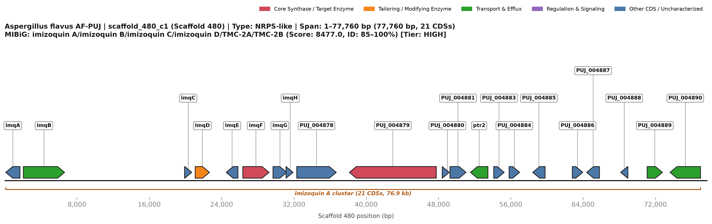](BGC_39_scaffold_480_c1_imizoquin_a.svg)

> *Figure 39: Publication-grade gene cluster diagram of `BGC_39_scaffold_480_c1_imizoquin_a` on Scaffold 480. Arrows indicate direction of transcription; boxes display standardized gene symbols or official locus tags. [Open scalable vector SVG](BGC_39_scaffold_480_c1_imizoquin_a.svg).*

#### Gene Inventory & Structural Qualifiers

| Locus Tag | Gene Symbol | Strand | Physical Span | Length | Putative Product & EC Number | Pfam / Domain Signatures |
| :--- | :---: | :---: | :---: | :---: | :--- | :--- |
| `PUJ_004870` | `imqA` | `-` | 119..1,696 | 492 aa | hypothetical protein | — |
| `PUJ_004871` | `imqB` | `+` | 2,070..6,634 | 1490 aa | hypothetical protein | PF00664 (ABC transporter transmembrane region), PF00005 (ABC transporter), PF00664 (ABC transporter transmembrane region) |
| `PUJ_004872` | `imqC` | `+` | 19,906..20,703 | 246 aa | hypothetical protein | PF01161 (Phosphatidylethanolamine-binding protein) |
| `PUJ_004873` | `imqD` | `+` | 21,084..22,660 | 437 aa | hypothetical protein | PF00891 (O-methyltransferase domain) |
| `PUJ_004874` | `imqE` | `-` | 24,511..25,809 | 386 aa | hypothetical protein | — |
| `PUJ_004875` | `imqF` | `+` | 26,350..29,256 | 968 aa | hypothetical protein | PF00501 (AMP-binding enzyme), PF00550 (Phosphopantetheine attachment site), PF00975 (Thioesterase domain) |
| `PUJ_004876` | `imqG` | `+` | 29,691..31,217 | 288 aa | hypothetical protein | — |
| `PUJ_004877` | `imqH` | `+` | 31,282..31,905 | 207 aa | hypothetical protein | — |
| `PUJ_004878` | `PUJ_004878` | `+` | 32,319..36,691 | 1438 aa | hypothetical protein | PF17109 (fungal STAND N-terminal Goodbye domain) |
| `PUJ_004879` | `PUJ_004879` | `-` | 38,138..47,760 | 3136 aa | hypothetical protein | PF00550 (Phosphopantetheine attachment site), PF00501 (AMP-binding enzyme), PF00668 (Condensation domain) |
| `PUJ_004880` | `PUJ_004880` | `+` | 48,780..49,187 | 117 aa | hypothetical protein (`EC 1.14.13.7`) | PF01494 (FAD binding domain) |
| `PUJ_004881` | `PUJ_004881` | `+` | 49,270..51,048 | 510 aa | hypothetical protein (`EC 1.14.13.7`) | PF01494 (FAD binding domain), PF07976 (Phenol hydroxylase, C-terminal dimerisation domain) |
| `PUJ_004882` | `ptr2` | `-` | 51,541..53,470 | 343 aa | peptide transporter ptr2 | PF00854 (POT family) |
| `PUJ_004883` | `PUJ_004883` | `+` | 54,113..55,273 | 364 aa | hypothetical protein | PF14226 (non-haem dioxygenase in morphine synthesis N-terminal), PF03171 (2OG-Fe(II) oxygenase superfamily) |
| `PUJ_004884` | `PUJ_004884` | `+` | 55,813..56,978 | 369 aa | hypothetical protein | PF10017 (Histidine-specific methyltransferase, SAM-dependent) |
| `PUJ_004885` | `PUJ_004885` | `-` | 58,429..59,796 | 455 aa | hypothetical protein | PF01266 (FAD dependent oxidoreductase) |
| `PUJ_004886` | `PUJ_004886` | `+` | 62,807..63,966 | 354 aa | hypothetical protein | PF14226 (non-haem dioxygenase in morphine synthesis N-terminal), PF03171 (2OG-Fe(II) oxygenase superfamily) |
| `PUJ_004887` | `PUJ_004887` | `-` | 64,393..65,811 | 472 aa | hypothetical protein | — |
| `PUJ_004888` | `PUJ_004888` | `-` | 68,157..68,957 | 266 aa | hypothetical protein (`EC 3.8.1.2`) | PF13419 (Haloacid dehalogenase-like hydrolase) |
| `PUJ_004889` | `PUJ_004889` | `+` | 71,086..72,776 | 417 aa | hypothetical protein | PF07690 (Major Facilitator Superfamily), PF07690 (Major Facilitator Superfamily) |
| `PUJ_004890` | `PUJ_004890` | `-` | 73,619..76,994 | 906 aa | hypothetical protein (`EC 7.6.2.2`) | PF00005 (ABC transporter), PF00664 (ABC transporter transmembrane region), PF00005 (ABC transporter) |

#### Putative Function & Enzymatic Mechanisms

- **`PUJ_004870` (`imqA`):** Hypothetical protein. Hypothetical or accessory protein implicated in cluster function or localized metabolic support.
- **`PUJ_004871` (`imqB`):** Hypothetical protein. Contains PF00664 (ABC transporter transmembrane region), PF00005 (ABC transporter). Hypothetical or accessory protein implicated in cluster function or localized metabolic support.
- **`PUJ_004872` (`imqC`):** Hypothetical protein. Contains PF01161 (Phosphatidylethanolamine-binding protein). Hypothetical or accessory protein implicated in cluster function or localized metabolic support.
- **`PUJ_004873` (`imqD`):** Hypothetical protein. Contains PF00891 (O-methyltransferase domain). Hypothetical or accessory protein implicated in cluster function or localized metabolic support.
- **`PUJ_004874` (`imqE`):** Hypothetical protein. Hypothetical or accessory protein implicated in cluster function or localized metabolic support.
- **`PUJ_004875` (`imqF`):** Hypothetical protein. Contains PF00501 (AMP-binding enzyme), PF00550 (Phosphopantetheine attachment site). Hypothetical or accessory protein implicated in cluster function or localized metabolic support.
- **`PUJ_004876` (`imqG`):** Hypothetical protein. Hypothetical or accessory protein implicated in cluster function or localized metabolic support.
- **`PUJ_004877` (`imqH`):** Hypothetical protein. Hypothetical or accessory protein implicated in cluster function or localized metabolic support.
- **`PUJ_004878`:** Hypothetical protein. Contains PF17109 (fungal STAND N-terminal Goodbye domain). Hypothetical or accessory protein implicated in cluster function or localized metabolic support.
- **`PUJ_004879`:** Hypothetical protein. Contains PF00550 (Phosphopantetheine attachment site), PF00501 (AMP-binding enzyme). Hypothetical or accessory protein implicated in cluster function or localized metabolic support.
- **`PUJ_004880`:** Hypothetical protein (EC 1.14.13.7). Contains PF01494 (FAD binding domain). Hypothetical or accessory protein implicated in cluster function or localized metabolic support.
- **`PUJ_004881`:** Hypothetical protein (EC 1.14.13.7). Contains PF01494 (FAD binding domain), PF07976 (Phenol hydroxylase, C-terminal dimerisation domain). Hypothetical or accessory protein implicated in cluster function or localized metabolic support.
- **`PUJ_004882` (`ptr2`):** Peptide transporter ptr2. Contains PF00854 (POT family). Transmembrane transport protein mediating efflux of synthesized products or precursor import.
- **`PUJ_004883`:** Hypothetical protein. Contains PF14226 (non-haem dioxygenase in morphine synthesis N-terminal), PF03171 (2OG-Fe(II) oxygenase superfamily). Hypothetical or accessory protein implicated in cluster function or localized metabolic support.
- **`PUJ_004884`:** Hypothetical protein. Contains PF10017 (Histidine-specific methyltransferase, SAM-dependent). Hypothetical or accessory protein implicated in cluster function or localized metabolic support.
- **`PUJ_004885`:** Hypothetical protein. Contains PF01266 (FAD dependent oxidoreductase). Hypothetical or accessory protein implicated in cluster function or localized metabolic support.
- **`PUJ_004886`:** Hypothetical protein. Contains PF14226 (non-haem dioxygenase in morphine synthesis N-terminal), PF03171 (2OG-Fe(II) oxygenase superfamily). Hypothetical or accessory protein implicated in cluster function or localized metabolic support.
- **`PUJ_004887`:** Hypothetical protein. Hypothetical or accessory protein implicated in cluster function or localized metabolic support.
- **`PUJ_004888`:** Hypothetical protein (EC 3.8.1.2). Contains PF13419 (Haloacid dehalogenase-like hydrolase). Hypothetical or accessory protein implicated in cluster function or localized metabolic support.
- **`PUJ_004889`:** Hypothetical protein. Contains PF07690 (Major Facilitator Superfamily), PF07690 (Major Facilitator Superfamily). Hypothetical or accessory protein implicated in cluster function or localized metabolic support.
- **`PUJ_004890`:** Hypothetical protein (EC 7.6.2.2). Contains PF00005 (ABC transporter), PF00664 (ABC transporter transmembrane region). Hypothetical or accessory protein implicated in cluster function or localized metabolic support.

### Collective Pathway Architecture & Biological Synergy

This cluster exhibits significant homology to the characterized MIBiG reference for **imizoquin A/imizoquin B/imizoquin C/imizoquin D/TMC-2A/TMC-2B** (MIBiG accession `BGC0001621.4`, score 8,477.0, identities 85–100%). The cluster features 21 coordinated CDSs encoding core synthases, tailoring oxidoreductases/transferases, and transmembrane efflux transporters that function collectively to synthesize, modify, and excrete bioactive NRPS-like compounds.

---

### 40. Aspirochlorine Biosynthetic Gene Cluster (`Scaffold 480`)

- **Cluster Identifier:** `BGC_40_scaffold_480_c2_aspirochlorine` (`scaffold_480_c2`)  
- **Genomic Location:** Scaffold 480 | Span: 1–73,234 bp (73,234 bp, 29 CDSs)  
- **Pathway Class:** `NRPS` | **Confidence Tier:** `HIGH`  
- **antiSMASH KnownClusterBlast Top Hit:** `BGC0001123.5` — **aspirochlorine** (Cumulative Score: 17,383.0, Identity: 48–100%, 19 proteins)  

> *Figure 40: Publication-grade gene cluster diagram of `BGC_40_scaffold_480_c2_aspirochlorine` on Scaffold 480. Arrows indicate direction of transcription; boxes display standardized gene symbols or official locus tags. [Open scalable vector SVG](BGC_40_scaffold_480_c2_aspirochlorine.svg).*

#### Gene Inventory & Structural Qualifiers

| Locus Tag | Gene Symbol | Strand | Physical Span | Length | Putative Product & EC Number | Pfam / Domain Signatures |
| :--- | :---: | :---: | :---: | :---: | :--- | :--- |
| `PUJ_004895` | `aclP` | `+` | 1,261..3,080 | 491 aa | hypothetical protein | PF00067 (Cytochrome P450) |
| `PUJ_004896` | `aclQ` | `-` | 3,184..4,665 | 456 aa | hypothetical protein | PF00172 (Fungal Zn(2)-Cys(6) binuclear cluster domain) |
| `PUJ_004897` | `aclR` | `-` | 5,970..6,868 | 273 aa | hypothetical protein | — |
| `PUJ_004898` | `aclT` | `+` | 7,335..8,990 | 551 aa | hypothetical protein | PF07690 (Major Facilitator Superfamily) |
| `PUJ_004899` | `aclC` | `-` | 9,591..12,385 | 804 aa | hypothetical protein | PF00005 (ABC transporter), PF00664 (ABC transporter transmembrane region) |
| `PUJ_004900` | `aclD` | `+` | 12,623..14,054 | 420 aa | hypothetical protein | PF00155 (Aminotransferase class I and II) |
| `PUJ_004901` | `aclE` | `+` | 14,209..15,563 | 413 aa | hypothetical protein | PF13813 (Membrane bound O-acyl transferase family) |
| `PUJ_004902` | `aclF` | `-` | 15,757..17,611 | 517 aa | hypothetical protein | PF00067 (Cytochrome P450) |
| `PUJ_004903` | `aclG` | `-` | 17,801..18,850 | 329 aa | hypothetical protein | PF07992 (Pyridine nucleotide-disulphide oxidoreductase) |
| `PUJ_004904` | `aclH` | `+` | 19,126..20,195 | 287 aa | hypothetical protein | — |
| `PUJ_004905` | `aclI` | `-` | 20,622..21,619 | 314 aa | hypothetical protein | PF07992 (Pyridine nucleotide-disulphide oxidoreductase) |
| `PUJ_004906` | `aclJ` | `-` | 22,593..23,650 | 334 aa | hypothetical protein | PF07992 (Pyridine nucleotide-disulphide oxidoreductase) |
| `PUJ_004907` | `aclK` | `+` | 23,914..25,270 | 423 aa | hypothetical protein | PF00891 (O-methyltransferase domain) |
| `PUJ_004908` | `aclL` | `+` | 25,411..26,318 | 246 aa | hypothetical protein | PF00043 (Glutathione S-transferase, C-terminal domain) |
| `PUJ_004909` | `aclM` | `-` | 26,449..28,305 | 508 aa | hypothetical protein | PF00067 (Cytochrome P450) |
| `PUJ_004910` | `aclN` | `+` | 28,328..29,698 | 422 aa | hypothetical protein (`EC 3.4.13.19`) | PF01244 (Membrane dipeptidase (Peptidase family M19)) |
| `PUJ_004911` | `aclA` | `-` | 30,001..34,783 | 1573 aa | hypothetical protein | PF00668 (Condensation domain), PF00550 (Phosphopantetheine attachment site), PF00501 (AMP-binding enzyme) |
| `PUJ_004912` | `aclB` | `-` | 36,370..37,032 | 220 aa | hypothetical protein | PF02133 (Permease for cytosine/purines, uracil, thiamine, allantoin) |
| `PUJ_004913` | `aclS` | `+` | 37,838..39,056 | 366 aa | hypothetical protein | PF01408 (Oxidoreductase family, NAD-binding Rossmann fold) |
| `PUJ_004914` | `aclO` | `-` | 39,319..40,675 | 414 aa | hypothetical protein | PF00891 (O-methyltransferase domain) |
| `PUJ_004915` | `PUJ_004915` | `+` | 40,910..42,351 | 461 aa | hypothetical protein | — |
| `PUJ_004916` | `PUJ_004916` | `-` | 42,594..43,524 | 293 aa | hypothetical protein | PF00106 (short chain dehydrogenase) |
| `PUJ_004917` | `PUJ_004917` | `-` | 46,013..47,485 | 490 aa | hypothetical protein | PF00120 (Glutamine synthetase, catalytic domain) |
| `PUJ_004918` | `PUJ_004918` | `-` | 48,453..50,420 | 583 aa | hypothetical protein | PF13193 (AMP-binding enzyme C-terminal domain), PF00501 (AMP-binding enzyme) |
| `PUJ_004919` | `PUJ_004919` | `-` | 51,177..52,234 | 275 aa | hypothetical protein | PF06276 (Ferric iron reductase FhuF-like transporter) |
| `PUJ_004920` | `PUJ_004920` | `-` | 55,649..56,336 | 191 aa | hypothetical protein | — |
| `PUJ_004921` | `PUJ_004921` | `-` | 60,622..61,721 | 336 aa | hypothetical protein | — |
| `PUJ_004922` | `PUJ_004922` | `+` | 63,727..65,808 | 693 aa | hypothetical protein | — |
| `PUJ_004923` | `PUJ_004923` | `+` | 68,313..70,159 | 481 aa | hypothetical protein | PF07690 (Major Facilitator Superfamily) |

#### Putative Function & Enzymatic Mechanisms

- **`PUJ_004895` (`aclP`):** Hypothetical protein. Contains PF00067 (Cytochrome P450). Hypothetical or accessory protein implicated in cluster function or localized metabolic support.
- **`PUJ_004896` (`aclQ`):** Hypothetical protein. Contains PF00172 (Fungal Zn(2)-Cys(6) binuclear cluster domain). Hypothetical or accessory protein implicated in cluster function or localized metabolic support.
- **`PUJ_004897` (`aclR`):** Hypothetical protein. Hypothetical or accessory protein implicated in cluster function or localized metabolic support.
- **`PUJ_004898` (`aclT`):** Thioredoxin reductase (551 aa, Pfam PF00070). Regulates the redox status of the reactive intramolecular disulfide bond [Sato et al., 2018].
- **`PUJ_004899` (`aclC`):** Cytochrome P450 monooxygenase (804 aa, Pfam PF00067). Mediates oxidative activation and chlorine-dependent tailoring of the diketopiperazine core [Sato et al., 2018].
- **`PUJ_004900` (`aclD`):** Hypothetical protein. Contains PF00155 (Aminotransferase class I and II). Hypothetical or accessory protein implicated in cluster function or localized metabolic support.
- **`PUJ_004901` (`aclE`):** Hypothetical protein. Contains PF13813 (Membrane bound O-acyl transferase family). Hypothetical or accessory protein implicated in cluster function or localized metabolic support.
- **`PUJ_004902` (`aclF`):** Hypothetical protein. Contains PF00067 (Cytochrome P450). Hypothetical or accessory protein implicated in cluster function or localized metabolic support.
- **`PUJ_004903` (`aclG`):** Hypothetical protein. Contains PF07992 (Pyridine nucleotide-disulphide oxidoreductase). Hypothetical or accessory protein implicated in cluster function or localized metabolic support.
- **`PUJ_004904` (`aclH`):** Hypothetical protein. Hypothetical or accessory protein implicated in cluster function or localized metabolic support.
- **`PUJ_004905` (`aclI`):** Hypothetical protein. Contains PF07992 (Pyridine nucleotide-disulphide oxidoreductase). Hypothetical or accessory protein implicated in cluster function or localized metabolic support.
- **`PUJ_004906` (`aclJ`):** Hypothetical protein. Contains PF07992 (Pyridine nucleotide-disulphide oxidoreductase). Hypothetical or accessory protein implicated in cluster function or localized metabolic support.
- **`PUJ_004907` (`aclK`):** Hypothetical protein. Contains PF00891 (O-methyltransferase domain). Hypothetical or accessory protein implicated in cluster function or localized metabolic support.
- **`PUJ_004908` (`aclL`):** Hypothetical protein. Contains PF00043 (Glutathione S-transferase, C-terminal domain). Hypothetical or accessory protein implicated in cluster function or localized metabolic support.
- **`PUJ_004909` (`aclM`):** Hypothetical protein. Contains PF00067 (Cytochrome P450). Hypothetical or accessory protein implicated in cluster function or localized metabolic support.
- **`PUJ_004910` (`aclN`):** Glutathione-dependent disulfide isomerase (457 aa, Pfam PF00462). Tailors disulfide bridge formation conferring ETP antimicrobial and cytotoxic potency [Sato et al., 2018].
- **`PUJ_004911` (`aclA`):** Epipolythiodioxopiperazine (ETP) NRPS mega-synthetase (1,573 aa, Pfam PF00501, PF00668). Core two-module NRPS catalyzing adenylation, peptide bond formation, and cyclization of phenylalanine derivatives [Sato et al., 2018].
- **`PUJ_004912` (`aclB`):** Glutathione S-transferase (GST, Pfam PF02798). Attaches glutathione to the epidithiodiketopiperazine scaffold as the sulfur donor for disulfide bridge assembly [Sato et al., 2018].
- **`PUJ_004913` (`aclS`):** Hypothetical protein. Contains PF01408 (Oxidoreductase family, NAD-binding Rossmann fold). Hypothetical or accessory protein implicated in cluster function or localized metabolic support.
- **`PUJ_004914` (`aclO`):** Hypothetical protein. Contains PF00891 (O-methyltransferase domain). Hypothetical or accessory protein implicated in cluster function or localized metabolic support.
- **`PUJ_004915`:** Hypothetical protein. Hypothetical or accessory protein implicated in cluster function or localized metabolic support.
- **`PUJ_004916`:** Hypothetical protein. Contains PF00106 (short chain dehydrogenase). Hypothetical or accessory protein implicated in cluster function or localized metabolic support.
- **`PUJ_004917`:** Hypothetical protein. Contains PF00120 (Glutamine synthetase, catalytic domain). Hypothetical or accessory protein implicated in cluster function or localized metabolic support.
- **`PUJ_004918`:** Hypothetical protein. Contains PF13193 (AMP-binding enzyme C-terminal domain), PF00501 (AMP-binding enzyme). Hypothetical or accessory protein implicated in cluster function or localized metabolic support.
- **`PUJ_004919`:** Hypothetical protein. Contains PF06276 (Ferric iron reductase FhuF-like transporter). Hypothetical or accessory protein implicated in cluster function or localized metabolic support.
- **`PUJ_004920`:** Hypothetical protein. Hypothetical or accessory protein implicated in cluster function or localized metabolic support.
- **`PUJ_004921`:** Hypothetical protein. Hypothetical or accessory protein implicated in cluster function or localized metabolic support.
- **`PUJ_004922`:** Hypothetical protein. Hypothetical or accessory protein implicated in cluster function or localized metabolic support.
- **`PUJ_004923`:** Hypothetical protein. Contains PF07690 (Major Facilitator Superfamily). Hypothetical or accessory protein implicated in cluster function or localized metabolic support.

### Collective Pathway Architecture & Biological Synergy

The **Scaffold 480 Aspirochlorine Cluster** (19 protein hits to MIBiG BGC0001123.5 at 94–100% identity, score 17,383) is the highest-scoring secondary metabolite BGC in AF-PUJ outside Scaffold 1340:

1. **Core Synthetase:** The NRPS mega-synthetase `AclA` (`PUJ_004911`, 1,573 aa) synthesizes a cyclo-diketopiperazine backbone.
2. **Disulfide Bridge Formation:** Glutathione S-transferase `AclB` (`PUJ_004910`) and thioredoxin reductase `AclT` (`PUJ_004898`) coordinate the incorporation of dual sulfur atoms from glutathione to construct the epipolythiodioxopiperazine (ETP) internal disulfide bridge.
3. **Chlorination & Oxidation:** Cytochrome P450 monooxygenase `AclC` (`PUJ_004899`) performs halogenation and tailoring, conferring broad-spectrum antifungal potency through thiol cross-linking in fungal targets.

---

### 41. Leporin B Biosynthetic Gene Cluster (`Scaffold 480`)

- **Cluster Identifier:** `BGC_41_scaffold_480_c3_leporin_b` (`scaffold_480_c3`)  
- **Genomic Location:** Scaffold 480 | Span: 1–155,734 bp (155,734 bp, 44 CDSs)  
- **Pathway Class:** `NRPS` | **Confidence Tier:** `HIGH`  
- **antiSMASH KnownClusterBlast Top Hit:** `BGC0001445.5` — **leporin B** (Cumulative Score: 15,512.0, Identity: 85–100%, 10 proteins)  

[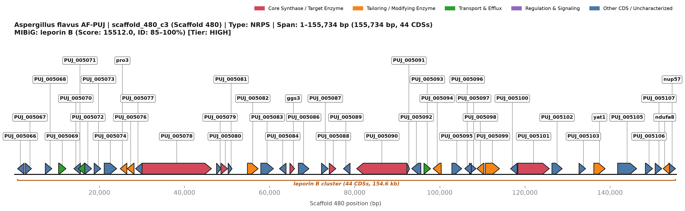](BGC_41_scaffold_480_c3_leporin_b.svg)

> *Figure 41: Publication-grade gene cluster diagram of `BGC_41_scaffold_480_c3_leporin_b` on Scaffold 480. Arrows indicate direction of transcription; boxes display standardized gene symbols or official locus tags. [Open scalable vector SVG](BGC_41_scaffold_480_c3_leporin_b.svg).*

#### Gene Inventory & Structural Qualifiers

| Locus Tag | Gene Symbol | Strand | Physical Span | Length | Putative Product & EC Number | Pfam / Domain Signatures |
| :--- | :---: | :---: | :---: | :---: | :--- | :--- |
| `PUJ_005066` | `PUJ_005066` | `-` | 786..2,077 | 359 aa | hypothetical protein | — |
| `PUJ_005067` | `PUJ_005067` | `+` | 3,371..4,048 | 225 aa | hypothetical protein | PF17107 (N-terminal domain on NACHT_NTPase and P-loop NTPases) |
| `PUJ_005068` | `PUJ_005068` | `+` | 8,022..8,849 | 275 aa | hypothetical protein | PF13602 (Zinc-binding dehydrogenase) |
| `PUJ_005069` | `PUJ_005069` | `+` | 10,418..12,161 | 480 aa | hypothetical protein | PF00083 (Sugar (and other) transporter), PF00083 (Sugar (and other) transporter), PF00083 (Sugar (and other) transporter) |
| `PUJ_005070` | `PUJ_005070` | `-` | 14,015..14,934 | 257 aa | hypothetical protein | — |
| `PUJ_005071` | `PUJ_005071` | `-` | 15,028..15,859 | 232 aa | hypothetical protein | PF07690 (Major Facilitator Superfamily) |
| `PUJ_005072` | `PUJ_005072` | `+` | 16,432..18,169 | 515 aa | hypothetical protein | PF00135 (Carboxylesterase family), PF00135 (Carboxylesterase family) |
| `PUJ_005073` | `PUJ_005073` | `+` | 19,268..20,329 | 353 aa | hypothetical protein (`EC 3.2.1.89`) | PF07745 (Glycosyl hydrolase family 53) |
| `PUJ_005074` | `PUJ_005074` | `+` | 21,142..24,066 | 889 aa | hypothetical protein (`EC 3.2.1.23`) | PF01301 (Glycosyl hydrolases family 35), PF10435 (Beta-galactosidase, domain 2), PF13363 (Beta-galactosidase, domain 3) |
| `PUJ_005075` | `pro3` | `-` | 24,920..25,898 | 300 aa | delta 1-pyrroline-5-carboxylate reductase (`EC 1.5.1.2`) | PF14748 (Pyrroline-5-carboxylate reductase dimerisation), PF03807 (NADP oxidoreductase coenzyme F420-dependent) |
| `PUJ_005076` | `PUJ_005076` | `-` | 26,569..28,157 | 508 aa | hypothetical protein (`EC 1.14.14.1`) | PF00067 (Cytochrome P450) |
| `PUJ_005077` | `PUJ_005077` | `-` | 28,507..29,650 | 318 aa | hypothetical protein | PF03171 (2OG-Fe(II) oxygenase superfamily), PF14226 (non-haem dioxygenase in morphine synthesis N-terminal) |
| `PUJ_005078` | `PUJ_005078` | `+` | 30,001..46,343 | 5371 aa | hypothetical protein | PF00501 (AMP-binding enzyme), PF00550 (Phosphopantetheine attachment site), PF00668 (Condensation domain) |
| `PUJ_005079` | `PUJ_005079` | `+` | 48,114..48,641 | 175 aa | hypothetical protein | — |
| `PUJ_005080` | `PUJ_005080` | `+` | 49,058..50,128 | 356 aa | hypothetical protein | PF08240 (Alcohol dehydrogenase GroES-like domain), PF00107 (Zinc-binding dehydrogenase) |
| `PUJ_005081` | `PUJ_005081` | `+` | 50,746..51,187 | 108 aa | hypothetical protein | PF12585 (Protein of unknown function (DUF3759)) |
| `PUJ_005082` | `PUJ_005082` | `+` | 54,792..57,313 | 739 aa | hypothetical protein (`EC 3.2.1.21`) | PF00933 (Glycosyl hydrolase family 3 N terminal domain), PF01915 (Glycosyl hydrolase family 3 C-terminal domain), PF14310 (Fibronectin type III-like domain) |
| `PUJ_005083` | `PUJ_005083` | `+` | 57,946..60,904 | 967 aa | hypothetical protein | PF15979 (Glycosyl hydrolase family 115), PF17829 (Gylcosyl hydrolase family 115 C-terminal domain) |
| `PUJ_005084` | `PUJ_005084` | `-` | 62,327..63,867 | 480 aa | hypothetical protein | PF01565 (FAD binding domain) |
| `PUJ_005085` | `ggs3` | `+` | 65,348..65,877 | 159 aa | geranylgeranyl diphosphate synthase 3 | PF00348 (Polyprenyl synthetase) |
| `PUJ_005086` | `PUJ_005086` | `+` | 66,767..69,243 | 740 aa | hypothetical protein | — |
| `PUJ_005087` | `PUJ_005087` | `+` | 72,433..73,753 | 216 aa | hypothetical protein | — |
| `PUJ_005088` | `PUJ_005088` | `+` | 74,407..75,577 | 320 aa | hypothetical protein (`EC 1.6.5.5`) | PF08240 (Alcohol dehydrogenase GroES-like domain), PF00107 (Zinc-binding dehydrogenase) |
| `PUJ_005089` | `PUJ_005089` | `-` | 77,365..78,513 | 382 aa | hypothetical protein | — |
| `PUJ_005090` | `PUJ_005090` | `-` | 80,475..92,315 | 3946 aa | hypothetical protein | PF07993 (Male sterility protein), PF00550 (Phosphopantetheine attachment site), PF00501 (AMP-binding enzyme) |
| `PUJ_005091` | `PUJ_005091` | `+` | 92,600..92,899 | 99 aa | hypothetical protein | — |
| `PUJ_005092` | `PUJ_005092` | `-` | 93,408..95,551 | 661 aa | hypothetical protein | PF04082 (Fungal specific transcription factor domain) |
| `PUJ_005093` | `PUJ_005093` | `+` | 96,317..97,827 | 429 aa | hypothetical protein | PF07690 (Major Facilitator Superfamily) |
| `PUJ_005094` | `PUJ_005094` | `-` | 98,425..100,338 | 508 aa | hypothetical protein | PF00067 (Cytochrome P450) |
| `PUJ_005095` | `PUJ_005095` | `+` | 102,846..105,151 | 734 aa | hypothetical protein | PF04082 (Fungal specific transcription factor domain) |
| `PUJ_005096` | `PUJ_005096` | `-` | 105,866..107,006 | 361 aa | hypothetical protein | — |
| `PUJ_005097` | `PUJ_005097` | `+` | 107,366..108,507 | 357 aa | hypothetical protein | — |
| `PUJ_005098` | `PUJ_005098` | `-` | 108,719..110,371 | 507 aa | hypothetical protein | PF00067 (Cytochrome P450) |
| `PUJ_005099` | `PUJ_005099` | `+` | 110,704..114,019 | 744 aa | hypothetical protein (`EC 2.1.1.109`) | PF00891 (O-methyltransferase domain) |
| `PUJ_005100` | `PUJ_005100` | `-` | 116,629..117,448 | 262 aa | hypothetical protein | — |
| `PUJ_005101` | `PUJ_005101` | `+` | 118,342..125,734 | 2420 aa | hypothetical protein | PF00109 (Beta-ketoacyl synthase, N-terminal domain), PF02801 (Beta-ketoacyl synthase, C-terminal domain), PF16197 (Ketoacyl-synthetase C-terminal extension) |
| `PUJ_005102` | `PUJ_005102` | `+` | 126,353..128,766 | 787 aa | hypothetical protein | PF03190 (Protein of unknown function, DUF255) |
| `PUJ_005103` | `PUJ_005103` | `+` | 133,223..134,264 | 308 aa | hypothetical protein | PF00188 (Cysteine-rich secretory protein family) |
| `PUJ_005104` | `yat1` | `+` | 136,196..138,848 | 815 aa | carnitine O-acetyltransferase yat1 (`EC 2.3.1.7`) | PF00755 (Choline/Carnitine o-acyltransferase) |
| `PUJ_005105` | `PUJ_005105` | `+` | 141,786..146,256 | 1392 aa | hypothetical protein | PF02375 (jmjN domain), PF02373 (JmjC domain, hydroxylase), PF13832 (PHD-zinc-finger like domain) |
| `PUJ_005106` | `PUJ_005106` | `+` | 148,308..150,010 | 523 aa | hypothetical protein | PF13520 (Amino acid permease) |
| `PUJ_005107` | `PUJ_005107` | `+` | 150,851..152,156 | 335 aa | hypothetical protein | — |
| `PUJ_005108` | `ndufa8` | `-` | 152,491..153,208 | 159 aa | ndufa8, NADH-ubiquinone oxidoreductase complex I 19kd subunit | PF06747 (CHCH domain) |
| `PUJ_005109` | `nup57` | `+` | 153,798..155,380 | 490 aa | Nucleoporin nup57 | PF13634 (Nucleoporin FG repeat region), PF13874 (Nucleoporin complex subunit 54), PF18570 (NUP57/Nup54 C-terminal domain) |

#### Putative Function & Enzymatic Mechanisms

- **`PUJ_005066`:** Hypothetical protein. Hypothetical or accessory protein implicated in cluster function or localized metabolic support.
- **`PUJ_005067`:** Hypothetical protein. Contains PF17107 (N-terminal domain on NACHT_NTPase and P-loop NTPases). Hypothetical or accessory protein implicated in cluster function or localized metabolic support.
- **`PUJ_005068`:** Hypothetical protein. Contains PF13602 (Zinc-binding dehydrogenase). Hypothetical or accessory protein implicated in cluster function or localized metabolic support.
- **`PUJ_005069`:** Hypothetical protein. Contains PF00083 (Sugar (and other) transporter), PF00083 (Sugar (and other) transporter). Hypothetical or accessory protein implicated in cluster function or localized metabolic support.
- **`PUJ_005070`:** Hypothetical protein. Hypothetical or accessory protein implicated in cluster function or localized metabolic support.
- **`PUJ_005071`:** Hypothetical protein. Contains PF07690 (Major Facilitator Superfamily). Hypothetical or accessory protein implicated in cluster function or localized metabolic support.
- **`PUJ_005072`:** Hypothetical protein. Contains PF00135 (Carboxylesterase family), PF00135 (Carboxylesterase family). Hypothetical or accessory protein implicated in cluster function or localized metabolic support.
- **`PUJ_005073`:** Hypothetical protein (EC 3.2.1.89). Contains PF07745 (Glycosyl hydrolase family 53). Hypothetical or accessory protein implicated in cluster function or localized metabolic support.
- **`PUJ_005074`:** Hypothetical protein (EC 3.2.1.23). Contains PF01301 (Glycosyl hydrolases family 35), PF10435 (Beta-galactosidase, domain 2). Hypothetical or accessory protein implicated in cluster function or localized metabolic support.
- **`PUJ_005075` (`pro3`):** Delta 1-pyrroline-5-carboxylate reductase (EC 1.5.1.2). Contains PF14748 (Pyrroline-5-carboxylate reductase dimerisation), PF03807 (NADP oxidoreductase coenzyme F420-dependent). Oxidoreductase tailoring enzyme driving intermediate redox transformation.
- **`PUJ_005076`:** Hypothetical protein (EC 1.14.14.1). Contains PF00067 (Cytochrome P450). Hypothetical or accessory protein implicated in cluster function or localized metabolic support.
- **`PUJ_005077`:** Hypothetical protein. Contains PF03171 (2OG-Fe(II) oxygenase superfamily), PF14226 (non-haem dioxygenase in morphine synthesis N-terminal). Hypothetical or accessory protein implicated in cluster function or localized metabolic support.
- **`PUJ_005078`:** Hypothetical protein. Contains PF00501 (AMP-binding enzyme), PF00550 (Phosphopantetheine attachment site). Hypothetical or accessory protein implicated in cluster function or localized metabolic support.
- **`PUJ_005079`:** Hypothetical protein. Hypothetical or accessory protein implicated in cluster function or localized metabolic support.
- **`PUJ_005080`:** Hypothetical protein. Contains PF08240 (Alcohol dehydrogenase GroES-like domain), PF00107 (Zinc-binding dehydrogenase). Hypothetical or accessory protein implicated in cluster function or localized metabolic support.
- **`PUJ_005081`:** Hypothetical protein. Contains PF12585 (Protein of unknown function (DUF3759)). Hypothetical or accessory protein implicated in cluster function or localized metabolic support.
- **`PUJ_005082`:** Hypothetical protein (EC 3.2.1.21). Contains PF00933 (Glycosyl hydrolase family 3 N terminal domain), PF01915 (Glycosyl hydrolase family 3 C-terminal domain). Hypothetical or accessory protein implicated in cluster function or localized metabolic support.
- **`PUJ_005083`:** Hypothetical protein. Contains PF15979 (Glycosyl hydrolase family 115), PF17829 (Gylcosyl hydrolase family 115 C-terminal domain). Hypothetical or accessory protein implicated in cluster function or localized metabolic support.
- **`PUJ_005084`:** Hypothetical protein. Contains PF01565 (FAD binding domain). Hypothetical or accessory protein implicated in cluster function or localized metabolic support.
- **`PUJ_005085` (`ggs3`):** Geranylgeranyl diphosphate synthase 3. Contains PF00348 (Polyprenyl synthetase). Catalyzes core biosynthetic condensation or macrocyclization reactions in the pathway.
- **`PUJ_005086`:** Hypothetical protein. Hypothetical or accessory protein implicated in cluster function or localized metabolic support.
- **`PUJ_005087`:** Hypothetical protein. Hypothetical or accessory protein implicated in cluster function or localized metabolic support.
- **`PUJ_005088`:** Hypothetical protein (EC 1.6.5.5). Contains PF08240 (Alcohol dehydrogenase GroES-like domain), PF00107 (Zinc-binding dehydrogenase). Hypothetical or accessory protein implicated in cluster function or localized metabolic support.
- **`PUJ_005089`:** Hypothetical protein. Hypothetical or accessory protein implicated in cluster function or localized metabolic support.
- **`PUJ_005090`:** Hypothetical protein. Contains PF07993 (Male sterility protein), PF00550 (Phosphopantetheine attachment site). Hypothetical or accessory protein implicated in cluster function or localized metabolic support.
- **`PUJ_005091`:** Hypothetical protein. Hypothetical or accessory protein implicated in cluster function or localized metabolic support.
- **`PUJ_005092`:** Hypothetical protein. Contains PF04082 (Fungal specific transcription factor domain). Hypothetical or accessory protein implicated in cluster function or localized metabolic support.
- **`PUJ_005093`:** Hypothetical protein. Contains PF07690 (Major Facilitator Superfamily). Hypothetical or accessory protein implicated in cluster function or localized metabolic support.
- **`PUJ_005094`:** Hypothetical protein. Contains PF00067 (Cytochrome P450). Hypothetical or accessory protein implicated in cluster function or localized metabolic support.
- **`PUJ_005095`:** Hypothetical protein. Contains PF04082 (Fungal specific transcription factor domain). Hypothetical or accessory protein implicated in cluster function or localized metabolic support.
- **`PUJ_005096`:** Hypothetical protein. Hypothetical or accessory protein implicated in cluster function or localized metabolic support.
- **`PUJ_005097`:** Hypothetical protein. Hypothetical or accessory protein implicated in cluster function or localized metabolic support.
- **`PUJ_005098`:** Hypothetical protein. Contains PF00067 (Cytochrome P450). Hypothetical or accessory protein implicated in cluster function or localized metabolic support.
- **`PUJ_005099`:** Hypothetical protein (EC 2.1.1.109). Contains PF00891 (O-methyltransferase domain). Hypothetical or accessory protein implicated in cluster function or localized metabolic support.
- **`PUJ_005100`:** Hypothetical protein. Hypothetical or accessory protein implicated in cluster function or localized metabolic support.
- **`PUJ_005101`:** Hypothetical protein. Contains PF00109 (Beta-ketoacyl synthase, N-terminal domain), PF02801 (Beta-ketoacyl synthase, C-terminal domain). Hypothetical or accessory protein implicated in cluster function or localized metabolic support.
- **`PUJ_005102`:** Hypothetical protein. Contains PF03190 (Protein of unknown function, DUF255). Hypothetical or accessory protein implicated in cluster function or localized metabolic support.
- **`PUJ_005103`:** Hypothetical protein. Contains PF00188 (Cysteine-rich secretory protein family). Hypothetical or accessory protein implicated in cluster function or localized metabolic support.
- **`PUJ_005104` (`yat1`):** Carnitine o-acetyltransferase yat1 (EC 2.3.1.7). Contains PF00755 (Choline/Carnitine o-acyltransferase). Transfers chemical functional groups (e.g. methyl, acyl, or prenyl) to modify precursor bioactivity.
- **`PUJ_005105`:** Hypothetical protein. Contains PF02375 (jmjN domain), PF02373 (JmjC domain, hydroxylase). Hypothetical or accessory protein implicated in cluster function or localized metabolic support.
- **`PUJ_005106`:** Hypothetical protein. Contains PF13520 (Amino acid permease). Hypothetical or accessory protein implicated in cluster function or localized metabolic support.
- **`PUJ_005107`:** Hypothetical protein. Hypothetical or accessory protein implicated in cluster function or localized metabolic support.
- **`PUJ_005108` (`ndufa8`):** Ndufa8, nadh-ubiquinone oxidoreductase complex i 19kd subunit. Contains PF06747 (CHCH domain). Oxidoreductase tailoring enzyme driving intermediate redox transformation.
- **`PUJ_005109` (`nup57`):** Nucleoporin nup57. Contains PF13634 (Nucleoporin FG repeat region), PF13874 (Nucleoporin complex subunit 54). Hypothetical or accessory protein implicated in cluster function or localized metabolic support.

### Collective Pathway Architecture & Biological Synergy

This cluster exhibits significant homology to the characterized MIBiG reference for **leporin B** (MIBiG accession `BGC0001445.5`, score 15,512.0, identities 85–100%). The cluster features 44 coordinated CDSs encoding core synthases, tailoring oxidoreductases/transferases, and transmembrane efflux transporters that function collectively to synthesize, modify, and excrete bioactive NRPS compounds.

---

### 42. Novel Orphan TERPENE Biosynthetic Gene Cluster (`Scaffold 480`)

- **Cluster Identifier:** `BGC_42_scaffold_480_c4_orphan_terpene` (`scaffold_480_c4`)  
- **Genomic Location:** Scaffold 480 | Span: 1–30,836 bp (30,836 bp, 9 CDSs)  
- **Pathway Class:** `terpene` | **Confidence Tier:** `ORPHAN`  

[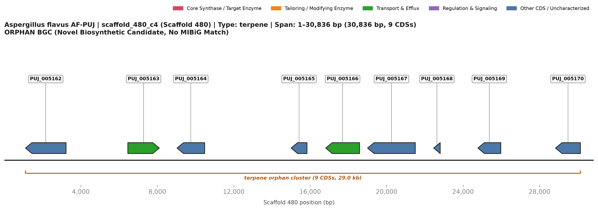](BGC_42_scaffold_480_c4_orphan_terpene.svg)

> *Figure 42: Publication-grade gene cluster diagram of `BGC_42_scaffold_480_c4_orphan_terpene` on Scaffold 480. Arrows indicate direction of transcription; boxes display standardized gene symbols or official locus tags. [Open scalable vector SVG](BGC_42_scaffold_480_c4_orphan_terpene.svg).*

#### Gene Inventory & Structural Qualifiers

| Locus Tag | Gene Symbol | Strand | Physical Span | Length | Putative Product & EC Number | Pfam / Domain Signatures |
| :--- | :---: | :---: | :---: | :---: | :--- | :--- |
| `PUJ_005162` | `PUJ_005162` | `-` | 1,103..3,229 | 628 aa | hypothetical protein | PF13926 (Domain of unknown function (DUF4211)) |
| `PUJ_005163` | `PUJ_005163` | `+` | 6,461..8,108 | 495 aa | hypothetical protein | PF00083 (Sugar (and other) transporter) |
| `PUJ_005164` | `PUJ_005164` | `-` | 9,033..10,481 | 325 aa | hypothetical protein | — |
| `PUJ_005165` | `PUJ_005165` | `-` | 15,001..15,836 | 208 aa | hypothetical protein | — |
| `PUJ_005166` | `PUJ_005166` | `-` | 16,813..18,586 | 518 aa | hypothetical protein | PF07690 (Major Facilitator Superfamily) |
| `PUJ_005167` | `PUJ_005167` | `-` | 19,004..21,502 | 748 aa | hypothetical protein | PF07992 (Pyridine nucleotide-disulphide oxidoreductase) |
| `PUJ_005168` | `PUJ_005168` | `-` | 22,463..22,804 | 113 aa | hypothetical protein | — |
| `PUJ_005169` | `PUJ_005169` | `-` | 24,775..25,976 | 380 aa | hypothetical protein | PF00010 (Helix-loop-helix DNA-binding domain) |
| `PUJ_005170` | `PUJ_005170` | `-` | 28,837..30,142 | 377 aa | hypothetical protein | PF01156 (Inosine-uridine preferring nucleoside hydrolase) |

#### Putative Function & Enzymatic Mechanisms

- **`PUJ_005162`:** Hypothetical protein. Contains PF13926 (Domain of unknown function (DUF4211)). Hypothetical or accessory protein implicated in cluster function or localized metabolic support.
- **`PUJ_005163`:** Hypothetical protein. Contains PF00083 (Sugar (and other) transporter). Hypothetical or accessory protein implicated in cluster function or localized metabolic support.
- **`PUJ_005164`:** Hypothetical protein. Hypothetical or accessory protein implicated in cluster function or localized metabolic support.
- **`PUJ_005165`:** Hypothetical protein. Hypothetical or accessory protein implicated in cluster function or localized metabolic support.
- **`PUJ_005166`:** Hypothetical protein. Contains PF07690 (Major Facilitator Superfamily). Hypothetical or accessory protein implicated in cluster function or localized metabolic support.
- **`PUJ_005167`:** Hypothetical protein. Contains PF07992 (Pyridine nucleotide-disulphide oxidoreductase). Hypothetical or accessory protein implicated in cluster function or localized metabolic support.
- **`PUJ_005168`:** Hypothetical protein. Hypothetical or accessory protein implicated in cluster function or localized metabolic support.
- **`PUJ_005169`:** Hypothetical protein. Contains PF00010 (Helix-loop-helix DNA-binding domain). Hypothetical or accessory protein implicated in cluster function or localized metabolic support.
- **`PUJ_005170`:** Hypothetical protein. Contains PF01156 (Inosine-uridine preferring nucleoside hydrolase). Hypothetical or accessory protein implicated in cluster function or localized metabolic support.

### Collective Pathway Architecture & Biological Synergy

This cluster represents a novel **orphan terpene secondary metabolite biosynthetic gene cluster (BGC)**. Comprising 9 predicted CDSs, the locus harbors a dedicated core synthase supported by localized tailoring enzymes and transporter permeases with zero significant matches in MIBiG 3.1. It represents an uncharacterized secondary metabolite pathway within the *Aspergillus flavus* genome with potential bioactive chemical products.

---

### 43. Nidulanin A Biosynthetic Gene Cluster (`Scaffold 480`)

- **Cluster Identifier:** `BGC_43_scaffold_480_c5_nidulanin_a` (`scaffold_480_c5`)  
- **Genomic Location:** Scaffold 480 | Span: 1–75,407 bp (75,407 bp, 16 CDSs)  
- **Pathway Class:** `NRPS` | **Confidence Tier:** `MEDIUM`  
- **antiSMASH KnownClusterBlast Top Hit:** `BGC0001699.4` — **nidulanin A** (Cumulative Score: 7,357.0, Identity: 47–80%, 3 proteins)  

[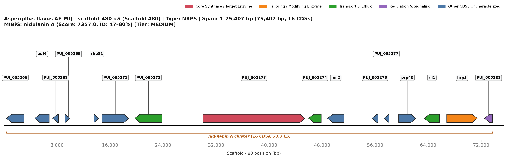](BGC_43_scaffold_480_c5_nidulanin_a.svg)

> *Figure 43: Publication-grade gene cluster diagram of `BGC_43_scaffold_480_c5_nidulanin_a` on Scaffold 480. Arrows indicate direction of transcription; boxes display standardized gene symbols or official locus tags. [Open scalable vector SVG](BGC_43_scaffold_480_c5_nidulanin_a.svg).*

#### Gene Inventory & Structural Qualifiers

| Locus Tag | Gene Symbol | Strand | Physical Span | Length | Putative Product & EC Number | Pfam / Domain Signatures |
| :--- | :---: | :---: | :---: | :---: | :--- | :--- |
| `PUJ_005266` | `PUJ_005266` | `-` | 381..3,023 | 819 aa | hypothetical protein | — |
| `PUJ_005267` | `puf6` | `-` | 4,654..6,813 | 698 aa | Pumilio y domain member 6 | PF08144 (CPL (NUC119) domain) |
| `PUJ_005268` | `PUJ_005268` | `-` | 7,346..8,219 | 137 aa | hypothetical protein | — |
| `PUJ_005269` | `PUJ_005269` | `+` | 9,486..9,957 | 136 aa | hypothetical protein | — |
| `PUJ_005270` | `rhp51` | `+` | 13,722..14,318 | 198 aa | RecA recombinase Rhp51 | PF08423 (Rad51) |
| `PUJ_005271` | `PUJ_005271` | `+` | 14,778..18,832 | 1310 aa | hypothetical protein | PF11715 (Nucleoporin Nup120/160) |
| `PUJ_005272` | `PUJ_005272` | `-` | 19,743..23,835 | 1096 aa | hypothetical protein | PF00005 (ABC transporter), PF00664 (ABC transporter transmembrane region), PF00664 (ABC transporter transmembrane region) |
| `PUJ_005273` | `PUJ_005273` | `+` | 30,001..45,407 | 5024 aa | hypothetical protein | PF00501 (AMP-binding enzyme), PF00550 (Phosphopantetheine attachment site), PF00668 (Condensation domain) |
| `PUJ_005274` | `PUJ_005274` | `-` | 45,976..47,863 | 550 aa | hypothetical protein | PF07690 (Major Facilitator Superfamily) |
| `PUJ_005275` | `iml2` | `-` | 48,840..51,288 | 695 aa | Mitochondrial outer membrane protein iml2 | PF10300 (Iml2/Tetratricopeptide repeat protein 39) |
| `PUJ_005276` | `PUJ_005276` | `-` | 55,521..56,436 | 221 aa | hypothetical protein | PF04117 (Mpv17 / PMP22 family) |
| `PUJ_005277` | `PUJ_005277` | `-` | 57,337..58,049 | 214 aa | hypothetical protein | PF12735 (TRAPP trafficking subunit Trs65) |
| `PUJ_005278` | `prp40` | `+` | 59,560..62,153 | 801 aa | U1 snRNP protein | PF00397 (WW domain), PF00397 (WW domain), PF01846 (FF domain) |
| `PUJ_005279` | `rli1` | `-` | 63,443..65,691 | 600 aa | Fe-S cluster-binding ribosome biosynthesis protein | PF00005 (ABC transporter), PF00005 (ABC transporter), PF00037 (4Fe-4S binding domain) |
| `PUJ_005280` | `hrp3` | `+` | 66,808..71,401 | 1513 aa | ATP-dependent DNA helicase Hrp3 (`EC 3.6.4.12`) | PF00385 (Chromo (CHRromatin Organisation MOdifier) domain), PF00385 (Chromo (CHRromatin Organisation MOdifier) domain), PF00176 (SNF2-related domain) |
| `PUJ_005281` | `PUJ_005281` | `-` | 72,524..73,712 | 367 aa | hypothetical protein | PF00096 (Zinc finger, C2H2 type) |

#### Putative Function & Enzymatic Mechanisms

- **`PUJ_005266`:** Hypothetical protein. Hypothetical or accessory protein implicated in cluster function or localized metabolic support.
- **`PUJ_005267` (`puf6`):** Pumilio y domain member 6. Contains PF08144 (CPL (NUC119) domain). Hypothetical or accessory protein implicated in cluster function or localized metabolic support.
- **`PUJ_005268`:** Hypothetical protein. Hypothetical or accessory protein implicated in cluster function or localized metabolic support.
- **`PUJ_005269`:** Hypothetical protein. Hypothetical or accessory protein implicated in cluster function or localized metabolic support.
- **`PUJ_005270` (`rhp51`):** Reca recombinase rhp51. Contains PF08423 (Rad51). Hypothetical or accessory protein implicated in cluster function or localized metabolic support.
- **`PUJ_005271`:** Hypothetical protein. Contains PF11715 (Nucleoporin Nup120/160). Hypothetical or accessory protein implicated in cluster function or localized metabolic support.
- **`PUJ_005272`:** Hypothetical protein. Contains PF00005 (ABC transporter), PF00664 (ABC transporter transmembrane region). Hypothetical or accessory protein implicated in cluster function or localized metabolic support.
- **`PUJ_005273`:** Hypothetical protein. Contains PF00501 (AMP-binding enzyme), PF00550 (Phosphopantetheine attachment site). Hypothetical or accessory protein implicated in cluster function or localized metabolic support.
- **`PUJ_005274`:** Hypothetical protein. Contains PF07690 (Major Facilitator Superfamily). Hypothetical or accessory protein implicated in cluster function or localized metabolic support.
- **`PUJ_005275` (`iml2`):** Mitochondrial outer membrane protein iml2. Contains PF10300 (Iml2/Tetratricopeptide repeat protein 39). Hypothetical or accessory protein implicated in cluster function or localized metabolic support.
- **`PUJ_005276`:** Hypothetical protein. Contains PF04117 (Mpv17 / PMP22 family). Hypothetical or accessory protein implicated in cluster function or localized metabolic support.
- **`PUJ_005277`:** Hypothetical protein. Contains PF12735 (TRAPP trafficking subunit Trs65). Hypothetical or accessory protein implicated in cluster function or localized metabolic support.
- **`PUJ_005278` (`prp40`):** U1 snrnp protein. Contains PF00397 (WW domain), PF00397 (WW domain). Hypothetical or accessory protein implicated in cluster function or localized metabolic support.
- **`PUJ_005279` (`rli1`):** Fe-s cluster-binding ribosome biosynthesis protein. Contains PF00005 (ABC transporter), PF00005 (ABC transporter). Hypothetical or accessory protein implicated in cluster function or localized metabolic support.
- **`PUJ_005280` (`hrp3`):** Atp-dependent dna helicase hrp3 (EC 3.6.4.12). Contains PF00385 (Chromo (CHRromatin Organisation MOdifier) domain), PF00385 (Chromo (CHRromatin Organisation MOdifier) domain). Hypothetical or accessory protein implicated in cluster function or localized metabolic support.
- **`PUJ_005281`:** Hypothetical protein. Contains PF00096 (Zinc finger, C2H2 type). Hypothetical or accessory protein implicated in cluster function or localized metabolic support.

### Collective Pathway Architecture & Biological Synergy

This cluster exhibits significant homology to the characterized MIBiG reference for **nidulanin A** (MIBiG accession `BGC0001699.4`, score 7,357.0, identities 47–80%). The cluster features 16 coordinated CDSs encoding core synthases, tailoring oxidoreductases/transferases, and transmembrane efflux transporters that function collectively to synthesize, modify, and excrete bioactive NRPS compounds.

---

### 44. Novel Orphan NRPS-LIKE Biosynthetic Gene Cluster (`Scaffold 482`)

- **Cluster Identifier:** `BGC_44_scaffold_482_c1_orphan_nrps_like` (`scaffold_482_c1`)  
- **Genomic Location:** Scaffold 482 | Span: 1–63,036 bp (63,036 bp, 19 CDSs)  
- **Pathway Class:** `NRPS-like` | **Confidence Tier:** `ORPHAN`  

[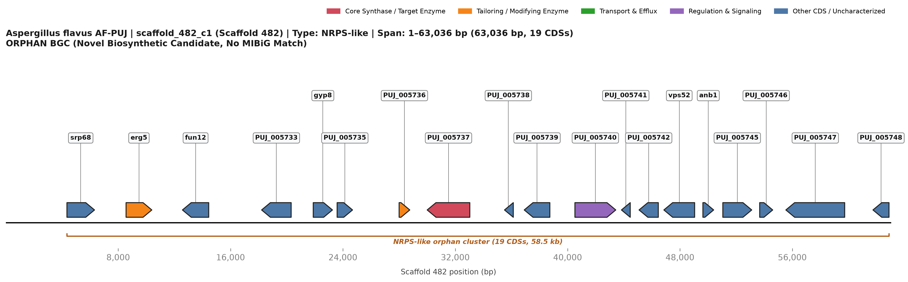](BGC_44_scaffold_482_c1_orphan_nrps_like.svg)

> *Figure 44: Publication-grade gene cluster diagram of `BGC_44_scaffold_482_c1_orphan_nrps_like` on Scaffold 482. Arrows indicate direction of transcription; boxes display standardized gene symbols or official locus tags. [Open scalable vector SVG](BGC_44_scaffold_482_c1_orphan_nrps_like.svg).*

#### Gene Inventory & Structural Qualifiers

| Locus Tag | Gene Symbol | Strand | Physical Span | Length | Putative Product & EC Number | Pfam / Domain Signatures |
| :--- | :---: | :---: | :---: | :---: | :--- | :--- |
| `PUJ_005730` | `srp68` | `+` | 4,350..6,313 | 611 aa | signal recognition particle subunit srp68 | PF16969 (RNA-binding signal recognition particle 68) |
| `PUJ_005731` | `erg5` | `+` | 8,560..10,393 | 528 aa | RNA polymerase C-22 sterol desaturase (`EC 1.14.19.41`) | PF00067 (Cytochrome P450) |
| `PUJ_005732` | `fun12` | `-` | 12,574..14,445 | 603 aa | eukaryotic translation initiation factor 5B | PF11987 (Translation-initiation factor 2), PF03144 (Elongation factor Tu domain 2), PF00009 (Elongation factor Tu GTP binding domain) |
| `PUJ_005733` | `PUJ_005733` | `-` | 18,211..20,315 | 668 aa | hypothetical protein | PF10433 (Mono-functional DNA-alkylating methyl methanesulfonate N-term) |
| `PUJ_005734` | `gyp8` | `+` | 21,888..23,254 | 341 aa | GTPase-activating protein gyp8 | — |
| `PUJ_005735` | `PUJ_005735` | `+` | 23,588..24,685 | 301 aa | hypothetical protein | PF04893 (Yip1 domain) |
| `PUJ_005736` | `PUJ_005736` | `+` | 28,002..28,760 | 252 aa | hypothetical protein (`EC 1.1.1.349`) | PF00106 (short chain dehydrogenase) |
| `PUJ_005737` | `PUJ_005737` | `-` | 30,001..33,036 | 996 aa | hypothetical protein | PF07993 (Male sterility protein), PF00550 (Phosphopantetheine attachment site), PF13193 (AMP-binding enzyme C-terminal domain) |
| `PUJ_005738` | `PUJ_005738` | `-` | 35,506..36,052 | 162 aa | hypothetical protein (`EC 2.8.3.5`) | PF01144 (Coenzyme A transferase) |
| `PUJ_005739` | `PUJ_005739` | `-` | 36,911..38,735 | 223 aa | hypothetical protein | PF13489 (Methyltransferase domain) |
| `PUJ_005740` | `PUJ_005740` | `+` | 40,520..43,428 | 849 aa | hypothetical protein | PF00096 (Zinc finger, C2H2 type), PF04082 (Fungal specific transcription factor domain) |
| `PUJ_005741` | `PUJ_005741` | `-` | 43,833..44,450 | 181 aa | hypothetical protein | — |
| `PUJ_005742` | `PUJ_005742` | `-` | 45,086..46,457 | 418 aa | hypothetical protein | PF01266 (FAD dependent oxidoreductase) |
| `PUJ_005743` | `vps52` | `-` | 46,854..49,044 | 678 aa | Vacuolar protein sorting-associated protein 52 | PF04129 (Vps52 / Sac2 family) |
| `PUJ_005744` | `anb1` | `+` | 49,633..50,398 | 162 aa | translation initiation factor eIF5A | PF01287 (Eukaryotic elongation factor 5A hypusine, DNA-binding OB fold) |
| `PUJ_005745` | `PUJ_005745` | `+` | 51,052..53,109 | 548 aa | hypothetical protein | PF11781 (Zinc-finger of RNA-polymerase I-specific TFIIB, Rrn7) |
| `PUJ_005746` | `PUJ_005746` | `+` | 53,676..54,602 | 308 aa | hypothetical protein | PF13517 (FG-GAP-like repeat) |
| `PUJ_005747` | `PUJ_005747` | `-` | 55,540..59,728 | 653 aa | hypothetical protein | PF00931 (NB-ARC domain), PF01048 (Phosphorylase superfamily) |
| `PUJ_005748` | `PUJ_005748` | `-` | 61,742..62,884 | 380 aa | hypothetical protein | PF01979 (Amidohydrolase family) |

#### Putative Function & Enzymatic Mechanisms

- **`PUJ_005730` (`srp68`):** Signal recognition particle subunit srp68. Contains PF16969 (RNA-binding signal recognition particle 68). Hypothetical or accessory protein implicated in cluster function or localized metabolic support.
- **`PUJ_005731` (`erg5`):** Rna polymerase c-22 sterol desaturase (EC 1.14.19.41). Contains PF00067 (Cytochrome P450). Hypothetical or accessory protein implicated in cluster function or localized metabolic support.
- **`PUJ_005732` (`fun12`):** Eukaryotic translation initiation factor 5b. Contains PF11987 (Translation-initiation factor 2), PF03144 (Elongation factor Tu domain 2). Hypothetical or accessory protein implicated in cluster function or localized metabolic support.
- **`PUJ_005733`:** Hypothetical protein. Contains PF10433 (Mono-functional DNA-alkylating methyl methanesulfonate N-term). Hypothetical or accessory protein implicated in cluster function or localized metabolic support.
- **`PUJ_005734` (`gyp8`):** Gtpase-activating protein gyp8. Hypothetical or accessory protein implicated in cluster function or localized metabolic support.
- **`PUJ_005735`:** Hypothetical protein. Contains PF04893 (Yip1 domain). Hypothetical or accessory protein implicated in cluster function or localized metabolic support.
- **`PUJ_005736`:** Hypothetical protein (EC 1.1.1.349). Contains PF00106 (short chain dehydrogenase). Hypothetical or accessory protein implicated in cluster function or localized metabolic support.
- **`PUJ_005737`:** Hypothetical protein. Contains PF07993 (Male sterility protein), PF00550 (Phosphopantetheine attachment site). Hypothetical or accessory protein implicated in cluster function or localized metabolic support.
- **`PUJ_005738`:** Hypothetical protein (EC 2.8.3.5). Contains PF01144 (Coenzyme A transferase). Hypothetical or accessory protein implicated in cluster function or localized metabolic support.
- **`PUJ_005739`:** Hypothetical protein. Contains PF13489 (Methyltransferase domain). Hypothetical or accessory protein implicated in cluster function or localized metabolic support.
- **`PUJ_005740`:** Hypothetical protein. Contains PF00096 (Zinc finger, C2H2 type), PF04082 (Fungal specific transcription factor domain). Hypothetical or accessory protein implicated in cluster function or localized metabolic support.
- **`PUJ_005741`:** Hypothetical protein. Hypothetical or accessory protein implicated in cluster function or localized metabolic support.
- **`PUJ_005742`:** Hypothetical protein. Contains PF01266 (FAD dependent oxidoreductase). Hypothetical or accessory protein implicated in cluster function or localized metabolic support.
- **`PUJ_005743` (`vps52`):** Vacuolar protein sorting-associated protein 52. Contains PF04129 (Vps52 / Sac2 family). Hypothetical or accessory protein implicated in cluster function or localized metabolic support.
- **`PUJ_005744` (`anb1`):** Translation initiation factor eif5a. Contains PF01287 (Eukaryotic elongation factor 5A hypusine, DNA-binding OB fold). Hypothetical or accessory protein implicated in cluster function or localized metabolic support.
- **`PUJ_005745`:** Hypothetical protein. Contains PF11781 (Zinc-finger of RNA-polymerase I-specific TFIIB, Rrn7). Hypothetical or accessory protein implicated in cluster function or localized metabolic support.
- **`PUJ_005746`:** Hypothetical protein. Contains PF13517 (FG-GAP-like repeat). Hypothetical or accessory protein implicated in cluster function or localized metabolic support.
- **`PUJ_005747`:** Hypothetical protein. Contains PF00931 (NB-ARC domain), PF01048 (Phosphorylase superfamily). Hypothetical or accessory protein implicated in cluster function or localized metabolic support.
- **`PUJ_005748`:** Hypothetical protein. Contains PF01979 (Amidohydrolase family). Hypothetical or accessory protein implicated in cluster function or localized metabolic support.

### Collective Pathway Architecture & Biological Synergy

This cluster represents a novel **orphan NRPS-like secondary metabolite biosynthetic gene cluster (BGC)**. Comprising 19 predicted CDSs, the locus harbors a dedicated core synthase supported by localized tailoring enzymes and transporter permeases with zero significant matches in MIBiG 3.1. It represents an uncharacterized secondary metabolite pathway within the *Aspergillus flavus* genome with potential bioactive chemical products.

---

### 45. Clavaric Acid Biosynthetic Gene Cluster (`Scaffold 485`)

- **Cluster Identifier:** `BGC_45_scaffold_485_c1_clavaric_acid` (`scaffold_485_c1`)  
- **Genomic Location:** Scaffold 485 | Span: 1–140,412 bp (140,412 bp, 36 CDSs)  
- **Pathway Class:** `isocyanide` | **Confidence Tier:** `LOW`  
- **antiSMASH KnownClusterBlast Top Hit:** `BGC0001248.3` — **clavaric acid** (Cumulative Score: 704.0, Identity: 48–48%, 1 proteins)  

[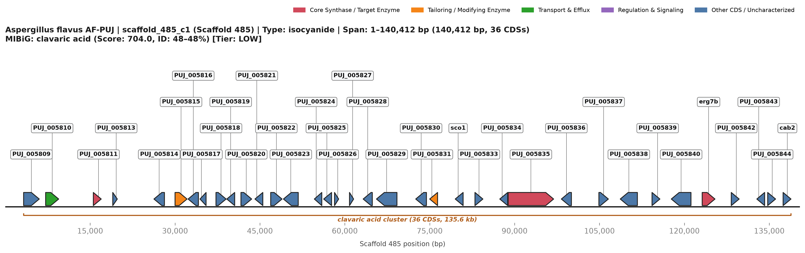](BGC_45_scaffold_485_c1_clavaric_acid.svg)

> *Figure 45: Publication-grade gene cluster diagram of `BGC_45_scaffold_485_c1_clavaric_acid` on Scaffold 485. Arrows indicate direction of transcription; boxes display standardized gene symbols or official locus tags. [Open scalable vector SVG](BGC_45_scaffold_485_c1_clavaric_acid.svg).*

#### Gene Inventory & Structural Qualifiers

| Locus Tag | Gene Symbol | Strand | Physical Span | Length | Putative Product & EC Number | Pfam / Domain Signatures |
| :--- | :---: | :---: | :---: | :---: | :--- | :--- |
| `PUJ_005809` | `PUJ_005809` | `+` | 3,243..6,007 | 824 aa | hypothetical protein (`EC 3.2.1.58`) | PF12708 (Pectate lyase superfamily protein), PF12708 (Pectate lyase superfamily protein) |
| `PUJ_005810` | `PUJ_005810` | `+` | 7,134..9,440 | 768 aa | hypothetical protein | PF11915 (Protein of unknown function (DUF3433)), PF11915 (Protein of unknown function (DUF3433)) |
| `PUJ_005811` | `PUJ_005811` | `+` | 16,004..16,958 | 298 aa | hypothetical protein (`EC 3.1.1.23`) | PF12146 (Serine aminopeptidase, S33) |
| `PUJ_005813` | `PUJ_005813` | `+` | 19,414..19,799 | 110 aa | hypothetical protein | — |
| `PUJ_005814` | `PUJ_005814` | `-` | 26,273..28,130 | 514 aa | hypothetical protein | PF01494 (FAD binding domain) |
| `PUJ_005815` | `PUJ_005815` | `+` | 30,001..32,123 | 635 aa | hypothetical protein | PF05141 (Pyoverdine/dityrosine biosynthesis protein), PF02668 (Taurine catabolism dioxygenase TauD, TfdA family) |
| `PUJ_005816` | `PUJ_005816` | `-` | 32,306..34,136 | 533 aa | hypothetical protein | PF01585 (G-patch domain), PF00076 (RNA recognition motif. (a.k.a. RRM, RBD, or RNP domain)) |
| `PUJ_005817` | `PUJ_005817` | `-` | 34,412..34,928 | 141 aa | hypothetical protein | — |
| `PUJ_005818` | `PUJ_005818` | `+` | 37,235..39,024 | 534 aa | hypothetical protein (`EC 1.3.99.30`) | PF01593 (Flavin containing amine oxidoreductase) |
| `PUJ_005819` | `PUJ_005819` | `-` | 39,148..40,532 | 423 aa | hypothetical protein | PF00494 (Squalene/phytoene synthase) |
| `PUJ_005820` | `PUJ_005820` | `+` | 41,649..43,542 | 554 aa | hypothetical protein | PF03055 (Retinal pigment epithelial membrane protein), PF03055 (Retinal pigment epithelial membrane protein) |
| `PUJ_005821` | `PUJ_005821` | `-` | 44,120..44,790 | 182 aa | hypothetical protein | — |
| `PUJ_005822` | `PUJ_005822` | `+` | 46,904..48,908 | 595 aa | hypothetical protein | PF01565 (FAD binding domain), PF08031 (Berberine and berberine like) |
| `PUJ_005823` | `PUJ_005823` | `-` | 49,153..51,773 | 836 aa | hypothetical protein | PF06985 (Heterokaryon incompatibility protein (HET)) |
| `PUJ_005824` | `PUJ_005824` | `-` | 54,617..55,249 | 210 aa | hypothetical protein | — |
| `PUJ_005825` | `PUJ_005825` | `-` | 56,269..57,387 | 372 aa | hypothetical protein | PF14388 (Domain of unknown function (DUF4419)) |
| `PUJ_005826` | `PUJ_005826` | `+` | 58,564..58,915 | 96 aa | hypothetical protein | — |
| `PUJ_005827` | `PUJ_005827` | `+` | 61,209..61,559 | 76 aa | hypothetical protein | PF11160 (Hypervirulence associated proteins TUDOR domain) |
| `PUJ_005828` | `PUJ_005828` | `-` | 63,244..64,861 | 506 aa | hypothetical protein | — |
| `PUJ_005829` | `PUJ_005829` | `-` | 65,595..69,216 | 634 aa | hypothetical protein | PF01764 (Lipase (class 3)) |
| `PUJ_005830` | `PUJ_005830` | `-` | 72,533..74,427 | 584 aa | hypothetical protein | PF00128 (Alpha amylase, catalytic domain) |
| `PUJ_005831` | `PUJ_005831` | `-` | 74,999..75,790 | 245 aa | hypothetical protein | PF00106 (short chain dehydrogenase) |
| `PUJ_005832` | `sco1` | `-` | 79,512..80,535 | 300 aa | Cu-binding protein | PF02630 (SCO1/SenC) |
| `PUJ_005833` | `PUJ_005833` | `+` | 83,000..84,402 | 434 aa | hypothetical protein | PF01565 (FAD binding domain), PF08031 (Berberine and berberine like) |
| `PUJ_005834` | `PUJ_005834` | `-` | 87,384..88,250 | 241 aa | hypothetical protein | PF03959 (Serine hydrolase (FSH1)) |
| `PUJ_005835` | `PUJ_005835` | `+` | 88,866..96,899 | 2545 aa | hypothetical protein | PF00109 (Beta-ketoacyl synthase, N-terminal domain), PF02801 (Beta-ketoacyl synthase, C-terminal domain), PF16197 (Ketoacyl-synthetase C-terminal extension) |
| `PUJ_005836` | `PUJ_005836` | `-` | 98,265..100,043 | 592 aa | hypothetical protein | — |
| `PUJ_005837` | `PUJ_005837` | `+` | 104,897..106,573 | 442 aa | hypothetical protein | — |
| `PUJ_005838` | `PUJ_005838` | `-` | 108,673..111,703 | 721 aa | hypothetical protein | PF09811 (Essential protein Yae1, N terminal) |
| `PUJ_005839` | `PUJ_005839` | `+` | 114,881..115,681 | 266 aa | hypothetical protein | — |
| `PUJ_005840` | `PUJ_005840` | `-` | 117,692..121,171 | 939 aa | hypothetical protein | PF13000 (Acetyl-coenzyme A transporter 1), PF13000 (Acetyl-coenzyme A transporter 1), PF13000 (Acetyl-coenzyme A transporter 1) |
| `PUJ_005841` | `erg7b` | `+` | 123,151..125,412 | 718 aa | Lanosterol synthase erg7B (`EC 5.4.99.7`) | PF13249 (Squalene-hopene cyclase N-terminal domain), PF13243 (Squalene-hopene cyclase C-terminal domain) |
| `PUJ_005842` | `PUJ_005842` | `+` | 128,655..129,684 | 324 aa | hypothetical protein | PF09496 (Cenp-O kinetochore centromere component) |
| `PUJ_005843` | `PUJ_005843` | `-` | 132,808..133,470 | 220 aa | hypothetical protein | PF07859 (alpha/beta hydrolase fold) |
| `PUJ_005844` | `PUJ_005844` | `+` | 134,914..136,121 | 313 aa | hypothetical protein | — |
| `PUJ_005845` | `cab2` | `+` | 137,566..138,844 | 406 aa | Phosphopantothenate--cysteine ligase cab2 (`EC 6.3.2.51`) | PF04127 (DNA / pantothenate metabolism flavoprotein) |

#### Putative Function & Enzymatic Mechanisms

- **`PUJ_005809`:** Hypothetical protein (EC 3.2.1.58). Contains PF12708 (Pectate lyase superfamily protein), PF12708 (Pectate lyase superfamily protein). Hypothetical or accessory protein implicated in cluster function or localized metabolic support.
- **`PUJ_005810`:** Hypothetical protein. Contains PF11915 (Protein of unknown function (DUF3433)), PF11915 (Protein of unknown function (DUF3433)). Hypothetical or accessory protein implicated in cluster function or localized metabolic support.
- **`PUJ_005811`:** Hypothetical protein (EC 3.1.1.23). Contains PF12146 (Serine aminopeptidase, S33). Hypothetical or accessory protein implicated in cluster function or localized metabolic support.
- **`PUJ_005813`:** Hypothetical protein. Hypothetical or accessory protein implicated in cluster function or localized metabolic support.
- **`PUJ_005814`:** Hypothetical protein. Contains PF01494 (FAD binding domain). Hypothetical or accessory protein implicated in cluster function or localized metabolic support.
- **`PUJ_005815`:** Hypothetical protein. Contains PF05141 (Pyoverdine/dityrosine biosynthesis protein), PF02668 (Taurine catabolism dioxygenase TauD, TfdA family). Hypothetical or accessory protein implicated in cluster function or localized metabolic support.
- **`PUJ_005816`:** Hypothetical protein. Contains PF01585 (G-patch domain), PF00076 (RNA recognition motif. (a.k.a. RRM, RBD, or RNP domain)). Hypothetical or accessory protein implicated in cluster function or localized metabolic support.
- **`PUJ_005817`:** Hypothetical protein. Hypothetical or accessory protein implicated in cluster function or localized metabolic support.
- **`PUJ_005818`:** Hypothetical protein (EC 1.3.99.30). Contains PF01593 (Flavin containing amine oxidoreductase). Hypothetical or accessory protein implicated in cluster function or localized metabolic support.
- **`PUJ_005819`:** Hypothetical protein. Contains PF00494 (Squalene/phytoene synthase). Hypothetical or accessory protein implicated in cluster function or localized metabolic support.
- **`PUJ_005820`:** Hypothetical protein. Contains PF03055 (Retinal pigment epithelial membrane protein), PF03055 (Retinal pigment epithelial membrane protein). Hypothetical or accessory protein implicated in cluster function or localized metabolic support.
- **`PUJ_005821`:** Hypothetical protein. Hypothetical or accessory protein implicated in cluster function or localized metabolic support.
- **`PUJ_005822`:** Hypothetical protein. Contains PF01565 (FAD binding domain), PF08031 (Berberine and berberine like). Hypothetical or accessory protein implicated in cluster function or localized metabolic support.
- **`PUJ_005823`:** Hypothetical protein. Contains PF06985 (Heterokaryon incompatibility protein (HET)). Hypothetical or accessory protein implicated in cluster function or localized metabolic support.
- **`PUJ_005824`:** Hypothetical protein. Hypothetical or accessory protein implicated in cluster function or localized metabolic support.
- **`PUJ_005825`:** Hypothetical protein. Contains PF14388 (Domain of unknown function (DUF4419)). Hypothetical or accessory protein implicated in cluster function or localized metabolic support.
- **`PUJ_005826`:** Hypothetical protein. Hypothetical or accessory protein implicated in cluster function or localized metabolic support.
- **`PUJ_005827`:** Hypothetical protein. Contains PF11160 (Hypervirulence associated proteins TUDOR domain). Hypothetical or accessory protein implicated in cluster function or localized metabolic support.
- **`PUJ_005828`:** Hypothetical protein. Hypothetical or accessory protein implicated in cluster function or localized metabolic support.
- **`PUJ_005829`:** Hypothetical protein. Contains PF01764 (Lipase (class 3)). Hypothetical or accessory protein implicated in cluster function or localized metabolic support.
- **`PUJ_005830`:** Hypothetical protein. Contains PF00128 (Alpha amylase, catalytic domain). Hypothetical or accessory protein implicated in cluster function or localized metabolic support.
- **`PUJ_005831`:** Hypothetical protein. Contains PF00106 (short chain dehydrogenase). Hypothetical or accessory protein implicated in cluster function or localized metabolic support.
- **`PUJ_005832` (`sco1`):** Cu-binding protein. Contains PF02630 (SCO1/SenC). Hypothetical or accessory protein implicated in cluster function or localized metabolic support.
- **`PUJ_005833`:** Hypothetical protein. Contains PF01565 (FAD binding domain), PF08031 (Berberine and berberine like). Hypothetical or accessory protein implicated in cluster function or localized metabolic support.
- **`PUJ_005834`:** Hypothetical protein. Contains PF03959 (Serine hydrolase (FSH1)). Hypothetical or accessory protein implicated in cluster function or localized metabolic support.
- **`PUJ_005835`:** Hypothetical protein. Contains PF00109 (Beta-ketoacyl synthase, N-terminal domain), PF02801 (Beta-ketoacyl synthase, C-terminal domain). Hypothetical or accessory protein implicated in cluster function or localized metabolic support.
- **`PUJ_005836`:** Hypothetical protein. Hypothetical or accessory protein implicated in cluster function or localized metabolic support.
- **`PUJ_005837`:** Hypothetical protein. Hypothetical or accessory protein implicated in cluster function or localized metabolic support.
- **`PUJ_005838`:** Hypothetical protein. Contains PF09811 (Essential protein Yae1, N terminal). Hypothetical or accessory protein implicated in cluster function or localized metabolic support.
- **`PUJ_005839`:** Hypothetical protein. Hypothetical or accessory protein implicated in cluster function or localized metabolic support.
- **`PUJ_005840`:** Hypothetical protein. Contains PF13000 (Acetyl-coenzyme A transporter 1), PF13000 (Acetyl-coenzyme A transporter 1). Hypothetical or accessory protein implicated in cluster function or localized metabolic support.
- **`PUJ_005841` (`erg7b`):** Lanosterol synthase erg7b (EC 5.4.99.7). Contains PF13249 (Squalene-hopene cyclase N-terminal domain), PF13243 (Squalene-hopene cyclase C-terminal domain). Catalyzes core biosynthetic condensation or macrocyclization reactions in the pathway.
- **`PUJ_005842`:** Hypothetical protein. Contains PF09496 (Cenp-O kinetochore centromere component). Hypothetical or accessory protein implicated in cluster function or localized metabolic support.
- **`PUJ_005843`:** Hypothetical protein. Contains PF07859 (alpha/beta hydrolase fold). Hypothetical or accessory protein implicated in cluster function or localized metabolic support.
- **`PUJ_005844`:** Hypothetical protein. Hypothetical or accessory protein implicated in cluster function or localized metabolic support.
- **`PUJ_005845` (`cab2`):** Phosphopantothenate--cysteine ligase cab2 (EC 6.3.2.51). Contains PF04127 (DNA / pantothenate metabolism flavoprotein). Hypothetical or accessory protein implicated in cluster function or localized metabolic support.

### Collective Pathway Architecture & Biological Synergy

This cluster exhibits significant homology to the characterized MIBiG reference for **clavaric acid** (MIBiG accession `BGC0001248.3`, score 704.0, identities 48–48%). The cluster features 36 coordinated CDSs encoding core synthases, tailoring oxidoreductases/transferases, and transmembrane efflux transporters that function collectively to synthesize, modify, and excrete bioactive isocyanide compounds.

---

### 46. Actinopolymorphol C Biosynthetic Gene Cluster (`Scaffold 485`)

- **Cluster Identifier:** `BGC_46_scaffold_485_c2_actinopolymorphol_c` (`scaffold_485_c2`)  
- **Genomic Location:** Scaffold 485 | Span: 1–63,129 bp (63,129 bp, 14 CDSs)  
- **Pathway Class:** `NRPS-like` | **Confidence Tier:** `HIGH`  
- **antiSMASH KnownClusterBlast Top Hit:** `BGC0002167.2` — **actinopolymorphol C/morpholine containing hemiacetal piperazine compound/piperazine compound 2/piperazine compound 1/3-(p-hydroxyphenyl)-1,2-propanediol/N,N-dioxide containing derivate/O-sulfonated actinopolymorphol C/C-3 sulfonylated derivative** (Cumulative Score: 6,338.0, Identity: 99–100%, 6 proteins)  

[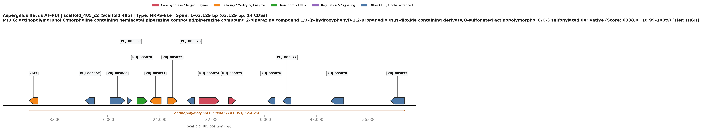](BGC_46_scaffold_485_c2_actinopolymorphol_c.svg)

> *Figure 46: Publication-grade gene cluster diagram of `BGC_46_scaffold_485_c2_actinopolymorphol_c` on Scaffold 485. Arrows indicate direction of transcription; boxes display standardized gene symbols or official locus tags. [Open scalable vector SVG](BGC_46_scaffold_485_c2_actinopolymorphol_c.svg).*

#### Gene Inventory & Structural Qualifiers

| Locus Tag | Gene Symbol | Strand | Physical Span | Length | Putative Product & EC Number | Pfam / Domain Signatures |
| :--- | :---: | :---: | :---: | :---: | :--- | :--- |
| `PUJ_005866` | `cht2` | `-` | 4,037..5,413 | 362 aa | Chitinase 2 (`EC 3.2.1.14`) | PF00704 (Glycosyl hydrolases family 18) |
| `PUJ_005867` | `PUJ_005867` | `-` | 12,614..14,047 | 477 aa | hypothetical protein (`EC 3.1.3.2`) | — |
| `PUJ_005868` | `PUJ_005868` | `+` | 16,415..18,692 | 703 aa | hypothetical protein | PF00994 (Probable molybdopterin binding domain), PF03453 (MoeA N-terminal region (domain I and II)), PF00994 (Probable molybdopterin binding domain) |
| `PUJ_005869` | `PUJ_005869` | `+` | 19,421..19,738 | 105 aa | hypothetical protein | — |
| `PUJ_005870` | `PUJ_005870` | `+` | 20,530..22,125 | 494 aa | hypothetical protein | PF00083 (Sugar (and other) transporter), PF00083 (Sugar (and other) transporter) |
| `PUJ_005871` | `PUJ_005871` | `-` | 22,482..24,240 | 516 aa | hypothetical protein | PF00067 (Cytochrome P450) |
| `PUJ_005872` | `PUJ_005872` | `+` | 25,231..26,672 | 440 aa | hypothetical protein | PF00067 (Cytochrome P450) |
| `PUJ_005873` | `PUJ_005873` | `-` | 28,201..29,318 | 334 aa | hypothetical protein | PF05368 (NmrA-like family) |
| `PUJ_005874` | `PUJ_005874` | `+` | 30,001..33,129 | 1042 aa | hypothetical protein | PF00501 (AMP-binding enzyme), PF00550 (Phosphopantetheine attachment site), PF07993 (Male sterility protein) |
| `PUJ_005875` | `PUJ_005875` | `+` | 34,526..35,626 | 366 aa | hypothetical protein | PF16884 (N-terminal domain of oxidoreductase), PF00107 (Zinc-binding dehydrogenase) |
| `PUJ_005876` | `PUJ_005876` | `-` | 40,508..41,623 | 371 aa | hypothetical protein | — |
| `PUJ_005877` | `PUJ_005877` | `-` | 42,805..44,070 | 421 aa | hypothetical protein | — |
| `PUJ_005878` | `PUJ_005878` | `-` | 50,170..52,146 | 355 aa | hypothetical protein | — |
| `PUJ_005879` | `PUJ_005879` | `-` | 59,308..61,421 | 597 aa | hypothetical protein | PF04082 (Fungal specific transcription factor domain) |

#### Putative Function & Enzymatic Mechanisms

- **`PUJ_005866` (`cht2`):** Chitinase 2 (EC 3.2.1.14). Contains PF00704 (Glycosyl hydrolases family 18). Hypothetical or accessory protein implicated in cluster function or localized metabolic support.
- **`PUJ_005867`:** Hypothetical protein (EC 3.1.3.2). Hypothetical or accessory protein implicated in cluster function or localized metabolic support.
- **`PUJ_005868`:** Hypothetical protein. Contains PF00994 (Probable molybdopterin binding domain), PF03453 (MoeA N-terminal region (domain I and II)). Hypothetical or accessory protein implicated in cluster function or localized metabolic support.
- **`PUJ_005869`:** Hypothetical protein. Hypothetical or accessory protein implicated in cluster function or localized metabolic support.
- **`PUJ_005870`:** Hypothetical protein. Contains PF00083 (Sugar (and other) transporter), PF00083 (Sugar (and other) transporter). Hypothetical or accessory protein implicated in cluster function or localized metabolic support.
- **`PUJ_005871`:** Hypothetical protein. Contains PF00067 (Cytochrome P450). Hypothetical or accessory protein implicated in cluster function or localized metabolic support.
- **`PUJ_005872`:** Hypothetical protein. Contains PF00067 (Cytochrome P450). Hypothetical or accessory protein implicated in cluster function or localized metabolic support.
- **`PUJ_005873`:** Hypothetical protein. Contains PF05368 (NmrA-like family). Hypothetical or accessory protein implicated in cluster function or localized metabolic support.
- **`PUJ_005874`:** Hypothetical protein. Contains PF00501 (AMP-binding enzyme), PF00550 (Phosphopantetheine attachment site). Hypothetical or accessory protein implicated in cluster function or localized metabolic support.
- **`PUJ_005875`:** Hypothetical protein. Contains PF16884 (N-terminal domain of oxidoreductase), PF00107 (Zinc-binding dehydrogenase). Hypothetical or accessory protein implicated in cluster function or localized metabolic support.
- **`PUJ_005876`:** Hypothetical protein. Hypothetical or accessory protein implicated in cluster function or localized metabolic support.
- **`PUJ_005877`:** Hypothetical protein. Hypothetical or accessory protein implicated in cluster function or localized metabolic support.
- **`PUJ_005878`:** Hypothetical protein. Hypothetical or accessory protein implicated in cluster function or localized metabolic support.
- **`PUJ_005879`:** Hypothetical protein. Contains PF04082 (Fungal specific transcription factor domain). Hypothetical or accessory protein implicated in cluster function or localized metabolic support.

### Collective Pathway Architecture & Biological Synergy

This cluster exhibits significant homology to the characterized MIBiG reference for **actinopolymorphol C/morpholine containing hemiacetal piperazine compound/piperazine compound 2/piperazine compound 1/3-(p-hydroxyphenyl)-1,2-propanediol/N,N-dioxide containing derivate/O-sulfonated actinopolymorphol C/C-3 sulfonylated derivative** (MIBiG accession `BGC0002167.2`, score 6,338.0, identities 99–100%). The cluster features 14 coordinated CDSs encoding core synthases, tailoring oxidoreductases/transferases, and transmembrane efflux transporters that function collectively to synthesize, modify, and excrete bioactive NRPS-like compounds.

---

### 47. Novel Orphan NRPS Biosynthetic Gene Cluster (`Scaffold 485`)

- **Cluster Identifier:** `BGC_47_scaffold_485_c3_orphan_nrps` (`scaffold_485_c3`)  
- **Genomic Location:** Scaffold 485 | Span: 1–71,964 bp (71,964 bp, 21 CDSs)  
- **Pathway Class:** `NRPS` | **Confidence Tier:** `ORPHAN`  

[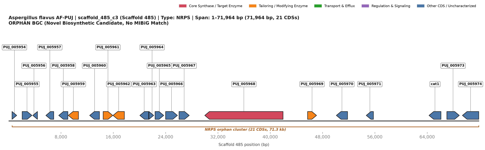](BGC_47_scaffold_485_c3_orphan_nrps.svg)

> *Figure 47: Publication-grade gene cluster diagram of `BGC_47_scaffold_485_c3_orphan_nrps` on Scaffold 485. Arrows indicate direction of transcription; boxes display standardized gene symbols or official locus tags. [Open scalable vector SVG](BGC_47_scaffold_485_c3_orphan_nrps.svg).*

#### Gene Inventory & Structural Qualifiers

| Locus Tag | Gene Symbol | Strand | Physical Span | Length | Putative Product & EC Number | Pfam / Domain Signatures |
| :--- | :---: | :---: | :---: | :---: | :--- | :--- |
| `PUJ_005954` | `PUJ_005954` | `+` | 548..1,243 | 196 aa | hypothetical protein | — |
| `PUJ_005955` | `PUJ_005955` | `+` | 2,079..3,565 | 476 aa | hypothetical protein | PF01494 (FAD binding domain) |
| `PUJ_005956` | `PUJ_005956` | `-` | 3,699..4,058 | 119 aa | hypothetical protein | — |
| `PUJ_005957` | `PUJ_005957` | `-` | 5,705..6,902 | 308 aa | hypothetical protein | — |
| `PUJ_005958` | `PUJ_005958` | `-` | 7,672..9,065 | 444 aa | hypothetical protein | PF00175 (Oxidoreductase NAD-binding domain), PF00667 (FAD binding domain) |
| `PUJ_005959` | `PUJ_005959` | `-` | 9,134..10,683 | 487 aa | hypothetical protein | PF00258 (Flavodoxin), PF00067 (Cytochrome P450) |
| `PUJ_005960` | `PUJ_005960` | `-` | 12,401..13,894 | 477 aa | hypothetical protein | PF01266 (FAD dependent oxidoreductase) |
| `PUJ_005961` | `PUJ_005961` | `+` | 14,461..15,924 | 487 aa | hypothetical protein | PF00171 (Aldehyde dehydrogenase family) |
| `PUJ_005962` | `PUJ_005962` | `-` | 15,972..17,703 | 555 aa | hypothetical protein (`EC 3.5.1.4`) | PF01425 (Amidase) |
| `PUJ_005963` | `PUJ_005963` | `-` | 20,076..21,413 | 445 aa | hypothetical protein | PF11951 (Fungal specific transcription factor domain) |
| `PUJ_005964` | `PUJ_005964` | `+` | 21,715..22,187 | 122 aa | hypothetical protein (`EC 5.4.3.8`) | PF06249 (Ethanolamine utilisation protein EutQ) |
| `PUJ_005965` | `PUJ_005965` | `+` | 22,399..23,721 | 420 aa | hypothetical protein (`EC 5.4.3.8`) | PF00202 (Aminotransferase class-III) |
| `PUJ_005966` | `PUJ_005966` | `+` | 24,010..25,818 | 531 aa | hypothetical protein | PF13520 (Amino acid permease) |
| `PUJ_005967` | `PUJ_005967` | `+` | 26,062..27,624 | 485 aa | hypothetical protein | PF01266 (FAD dependent oxidoreductase) |
| `PUJ_005968` | `PUJ_005968` | `-` | 30,001..41,964 | 3931 aa | hypothetical protein (`EC 7.6.2.2`) | PF00975 (Thioesterase domain), PF00550 (Phosphopantetheine attachment site), PF13193 (AMP-binding enzyme C-terminal domain) |
| `PUJ_005969` | `PUJ_005969` | `+` | 45,719..47,086 | 455 aa | hypothetical protein | PF13450 (NAD(P)-binding Rossmann-like domain) |
| `PUJ_005970` | `PUJ_005970` | `-` | 50,118..51,830 | 534 aa | hypothetical protein | — |
| `PUJ_005971` | `PUJ_005971` | `-` | 54,691..55,785 | 364 aa | hypothetical protein | PF10544 (T5orf172 domain) |
| `PUJ_005972` | `cat1` | `-` | 64,288..66,115 | 492 aa | catalase A (`EC 1.11.1.6`) | PF06628 (Catalase-related immune-responsive), PF00199 (Catalase) |
| `PUJ_005973` | `PUJ_005973` | `+` | 67,015..68,916 | 593 aa | hypothetical protein | PF00732 (GMC oxidoreductase), PF05199 (GMC oxidoreductase) |
| `PUJ_005974` | `PUJ_005974` | `-` | 69,395..71,893 | 819 aa | hypothetical protein | PF06985 (Heterokaryon incompatibility protein (HET)), PF13637 (Ankyrin repeats (many copies)) |

#### Putative Function & Enzymatic Mechanisms

- **`PUJ_005954`:** Hypothetical protein. Hypothetical or accessory protein implicated in cluster function or localized metabolic support.
- **`PUJ_005955`:** Hypothetical protein. Contains PF01494 (FAD binding domain). Hypothetical or accessory protein implicated in cluster function or localized metabolic support.
- **`PUJ_005956`:** Hypothetical protein. Hypothetical or accessory protein implicated in cluster function or localized metabolic support.
- **`PUJ_005957`:** Hypothetical protein. Hypothetical or accessory protein implicated in cluster function or localized metabolic support.
- **`PUJ_005958`:** Hypothetical protein. Contains PF00175 (Oxidoreductase NAD-binding domain), PF00667 (FAD binding domain). Hypothetical or accessory protein implicated in cluster function or localized metabolic support.
- **`PUJ_005959`:** Hypothetical protein. Contains PF00258 (Flavodoxin), PF00067 (Cytochrome P450). Hypothetical or accessory protein implicated in cluster function or localized metabolic support.
- **`PUJ_005960`:** Hypothetical protein. Contains PF01266 (FAD dependent oxidoreductase). Hypothetical or accessory protein implicated in cluster function or localized metabolic support.
- **`PUJ_005961`:** Hypothetical protein. Contains PF00171 (Aldehyde dehydrogenase family). Hypothetical or accessory protein implicated in cluster function or localized metabolic support.
- **`PUJ_005962`:** Hypothetical protein (EC 3.5.1.4). Contains PF01425 (Amidase). Hypothetical or accessory protein implicated in cluster function or localized metabolic support.
- **`PUJ_005963`:** Hypothetical protein. Contains PF11951 (Fungal specific transcription factor domain). Hypothetical or accessory protein implicated in cluster function or localized metabolic support.
- **`PUJ_005964`:** Hypothetical protein (EC 5.4.3.8). Contains PF06249 (Ethanolamine utilisation protein EutQ). Hypothetical or accessory protein implicated in cluster function or localized metabolic support.
- **`PUJ_005965`:** Hypothetical protein (EC 5.4.3.8). Contains PF00202 (Aminotransferase class-III). Hypothetical or accessory protein implicated in cluster function or localized metabolic support.
- **`PUJ_005966`:** Hypothetical protein. Contains PF13520 (Amino acid permease). Hypothetical or accessory protein implicated in cluster function or localized metabolic support.
- **`PUJ_005967`:** Hypothetical protein. Contains PF01266 (FAD dependent oxidoreductase). Hypothetical or accessory protein implicated in cluster function or localized metabolic support.
- **`PUJ_005968`:** Hypothetical protein (EC 7.6.2.2). Contains PF00975 (Thioesterase domain), PF00550 (Phosphopantetheine attachment site). Hypothetical or accessory protein implicated in cluster function or localized metabolic support.
- **`PUJ_005969`:** Hypothetical protein. Contains PF13450 (NAD(P)-binding Rossmann-like domain). Hypothetical or accessory protein implicated in cluster function or localized metabolic support.
- **`PUJ_005970`:** Hypothetical protein. Hypothetical or accessory protein implicated in cluster function or localized metabolic support.
- **`PUJ_005971`:** Hypothetical protein. Contains PF10544 (T5orf172 domain). Hypothetical or accessory protein implicated in cluster function or localized metabolic support.
- **`PUJ_005972` (`cat1`):** Catalase a (EC 1.11.1.6). Contains PF06628 (Catalase-related immune-responsive), PF00199 (Catalase). Hypothetical or accessory protein implicated in cluster function or localized metabolic support.
- **`PUJ_005973`:** Hypothetical protein. Contains PF00732 (GMC oxidoreductase), PF05199 (GMC oxidoreductase). Hypothetical or accessory protein implicated in cluster function or localized metabolic support.
- **`PUJ_005974`:** Hypothetical protein. Contains PF06985 (Heterokaryon incompatibility protein (HET)), PF13637 (Ankyrin repeats (many copies)). Hypothetical or accessory protein implicated in cluster function or localized metabolic support.

### Collective Pathway Architecture & Biological Synergy

This cluster represents a novel **orphan NRPS secondary metabolite biosynthetic gene cluster (BGC)**. Comprising 21 predicted CDSs, the locus harbors a dedicated core synthase supported by localized tailoring enzymes and transporter permeases with zero significant matches in MIBiG 3.1. It represents an uncharacterized secondary metabolite pathway within the *Aspergillus flavus* genome with potential bioactive chemical products.

---

### 48. Novel Orphan INDOLE Biosynthetic Gene Cluster (`Scaffold 485`)

- **Cluster Identifier:** `BGC_48_scaffold_485_c4_orphan_indole` (`scaffold_485_c4`)  
- **Genomic Location:** Scaffold 485 | Span: 1–31,128 bp (31,128 bp, 10 CDSs)  
- **Pathway Class:** `indole` | **Confidence Tier:** `ORPHAN`  

[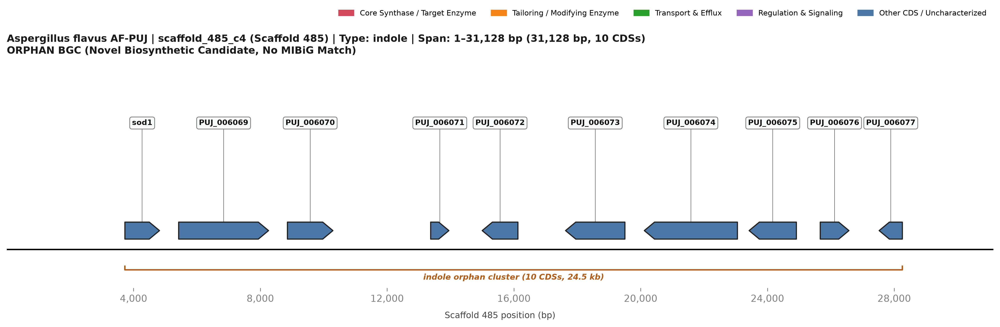](BGC_48_scaffold_485_c4_orphan_indole.svg)

> *Figure 48: Publication-grade gene cluster diagram of `BGC_48_scaffold_485_c4_orphan_indole` on Scaffold 485. Arrows indicate direction of transcription; boxes display standardized gene symbols or official locus tags. [Open scalable vector SVG](BGC_48_scaffold_485_c4_orphan_indole.svg).*

#### Gene Inventory & Structural Qualifiers

| Locus Tag | Gene Symbol | Strand | Physical Span | Length | Putative Product & EC Number | Pfam / Domain Signatures |
| :--- | :---: | :---: | :---: | :---: | :--- | :--- |
| `PUJ_006068` | `sod1` | `+` | 3,727..4,818 | 154 aa | Superoxide dismutase [Cu-Zn] (`EC 1.15.1.1`) | PF00080 (Copper/zinc superoxide dismutase (SODC)) |
| `PUJ_006069` | `PUJ_006069` | `+` | 5,423..8,259 | 881 aa | hypothetical protein | PF00565 (Staphylococcal nuclease homologue), PF00565 (Staphylococcal nuclease homologue), PF00565 (Staphylococcal nuclease homologue) |
| `PUJ_006070` | `PUJ_006070` | `+` | 8,855..10,290 | 422 aa | hypothetical protein | PF03765 (CRAL/TRIO, N-terminal domain), PF00650 (CRAL/TRIO domain) |
| `PUJ_006071` | `PUJ_006071` | `+` | 13,375..13,950 | 170 aa | hypothetical protein | PF00300 (Histidine phosphatase superfamily (branch 1)) |
| `PUJ_006072` | `PUJ_006072` | `-` | 15,001..16,128 | 375 aa | hypothetical protein | PF11991 (Tryptophan dimethylallyltransferase) |
| `PUJ_006073` | `PUJ_006073` | `-` | 17,631..19,504 | 549 aa | hypothetical protein | PF01048 (Phosphorylase superfamily) |
| `PUJ_006074` | `PUJ_006074` | `-` | 20,116..23,054 | 941 aa | hypothetical protein | PF07774 (ER membrane protein complex subunit 1, C-terminal), PF13360 (PQQ-like domain) |
| `PUJ_006075` | `PUJ_006075` | `-` | 23,423..24,914 | 476 aa | hypothetical protein | PF07350 (Protein of unknown function (DUF1479)) |
| `PUJ_006076` | `PUJ_006076` | `+` | 25,667..26,572 | 301 aa | hypothetical protein | PF12311 (Protein of unknown function (DUF3632)) |
| `PUJ_006077` | `PUJ_006077` | `-` | 27,526..28,258 | 223 aa | hypothetical protein | — |

#### Putative Function & Enzymatic Mechanisms

- **`PUJ_006068` (`sod1`):** Superoxide dismutase [cu-zn] (EC 1.15.1.1). Contains PF00080 (Copper/zinc superoxide dismutase (SODC)). Hypothetical or accessory protein implicated in cluster function or localized metabolic support.
- **`PUJ_006069`:** Hypothetical protein. Contains PF00565 (Staphylococcal nuclease homologue), PF00565 (Staphylococcal nuclease homologue). Hypothetical or accessory protein implicated in cluster function or localized metabolic support.
- **`PUJ_006070`:** Hypothetical protein. Contains PF03765 (CRAL/TRIO, N-terminal domain), PF00650 (CRAL/TRIO domain). Hypothetical or accessory protein implicated in cluster function or localized metabolic support.
- **`PUJ_006071`:** Hypothetical protein. Contains PF00300 (Histidine phosphatase superfamily (branch 1)). Hypothetical or accessory protein implicated in cluster function or localized metabolic support.
- **`PUJ_006072`:** Hypothetical protein. Contains PF11991 (Tryptophan dimethylallyltransferase). Hypothetical or accessory protein implicated in cluster function or localized metabolic support.
- **`PUJ_006073`:** Hypothetical protein. Contains PF01048 (Phosphorylase superfamily). Hypothetical or accessory protein implicated in cluster function or localized metabolic support.
- **`PUJ_006074`:** Hypothetical protein. Contains PF07774 (ER membrane protein complex subunit 1, C-terminal), PF13360 (PQQ-like domain). Hypothetical or accessory protein implicated in cluster function or localized metabolic support.
- **`PUJ_006075`:** Hypothetical protein. Contains PF07350 (Protein of unknown function (DUF1479)). Hypothetical or accessory protein implicated in cluster function or localized metabolic support.
- **`PUJ_006076`:** Hypothetical protein. Contains PF12311 (Protein of unknown function (DUF3632)). Hypothetical or accessory protein implicated in cluster function or localized metabolic support.
- **`PUJ_006077`:** Hypothetical protein. Hypothetical or accessory protein implicated in cluster function or localized metabolic support.

### Collective Pathway Architecture & Biological Synergy

This cluster represents a novel **orphan indole secondary metabolite biosynthetic gene cluster (BGC)**. Comprising 10 predicted CDSs, the locus harbors a dedicated core synthase supported by localized tailoring enzymes and transporter permeases with zero significant matches in MIBiG 3.1. It represents an uncharacterized secondary metabolite pathway within the *Aspergillus flavus* genome with potential bioactive chemical products.

---

### 49. Novel Orphan NRPS-LIKE Biosynthetic Gene Cluster (`Scaffold 486`)

- **Cluster Identifier:** `BGC_49_scaffold_486_c1_orphan_nrps_like` (`scaffold_486_c1`)  
- **Genomic Location:** Scaffold 486 | Span: 1–110,461 bp (110,461 bp, 25 CDSs)  
- **Pathway Class:** `NRPS-like` | **Confidence Tier:** `ORPHAN`  

[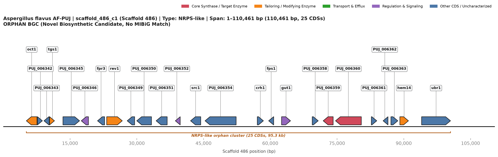](BGC_49_scaffold_486_c1_orphan_nrps_like.svg)

> *Figure 49: Publication-grade gene cluster diagram of `BGC_49_scaffold_486_c1_orphan_nrps_like` on Scaffold 486. Arrows indicate direction of transcription; boxes display standardized gene symbols or official locus tags. [Open scalable vector SVG](BGC_49_scaffold_486_c1_orphan_nrps_like.svg).*

#### Gene Inventory & Structural Qualifiers

| Locus Tag | Gene Symbol | Strand | Physical Span | Length | Putative Product & EC Number | Pfam / Domain Signatures |
| :--- | :---: | :---: | :---: | :---: | :--- | :--- |
| `PUJ_006341` | `oct1` | `-` | 5,190..7,580 | 796 aa | Mitochondrial intermediate peptidase (`EC 3.4.24.59`) | PF01432 (Peptidase family M3) |
| `PUJ_006342` | `PUJ_006342` | `+` | 7,911..8,796 | 244 aa | hypothetical protein | PF09769 (Apolipoprotein O) |
| `PUJ_006343` | `PUJ_006343` | `-` | 9,149..10,332 | 354 aa | hypothetical protein | PF04495 (GRASP55/65 PDZ-like domain) |
| `PUJ_006344` | `tgs1` | `+` | 10,610..11,511 | 240 aa | putative diacylglycerol O-acyltransferase tgs1 | PF09445 (RNA cap guanine-N2 methyltransferase) |
| `PUJ_006345` | `PUJ_006345` | `+` | 13,417..17,149 | 1111 aa | hypothetical protein | PF12157 (Protein of unknown function (DUF3591)) |
| `PUJ_006346` | `PUJ_006346` | `-` | 17,531..19,141 | 499 aa | hypothetical protein | PF00069 (Protein kinase domain), PF00069 (Protein kinase domain) |
| `PUJ_006347` | `fpr3` | `-` | 21,182..22,778 | 470 aa | peptidylprolyl isomerase fpr3 (`EC 5.2.1.8`) | PF00254 (FKBP-type peptidyl-prolyl cis-trans isomerase), PF17800 (Nucleoplasmin-like domain) |
| `PUJ_006348` | `rev1` | `+` | 23,244..26,748 | 1147 aa | deoxycytidyl transferase | PF16589 (BRCT domain, a BRCA1 C-terminus domain), PF00817 (impB/mucB/samB family), PF11798 (IMS family HHH motif) |
| `PUJ_006349` | `PUJ_006349` | `-` | 27,847..29,523 | 536 aa | hypothetical protein | PF11951 (Fungal specific transcription factor domain) |
| `PUJ_006350` | `PUJ_006350` | `-` | 30,001..33,306 | 1068 aa | hypothetical protein | PF07993 (Male sterility protein), PF00550 (Phosphopantetheine attachment site), PF00501 (AMP-binding enzyme) |
| `PUJ_006351` | `PUJ_006351` | `-` | 34,350..36,836 | 689 aa | hypothetical protein | PF04082 (Fungal specific transcription factor domain) |
| `PUJ_006352` | `PUJ_006352` | `-` | 38,668..39,351 | 174 aa | hypothetical protein | PF00172 (Fungal Zn(2)-Cys(6) binuclear cluster domain) |
| `PUJ_006353` | `src1` | `-` | 42,086..44,378 | 723 aa | inner nuclear membrane protein enriched at telomere/subtelomere region | PF09402 (Man1-Src1p-C-terminal domain), PF12949 (HeH/LEM domain) |
| `PUJ_006354` | `PUJ_006354` | `-` | 45,341..52,332 | 2144 aa | hypothetical protein (`EC 4.6.1.1`) | PF00211 (Adenylate and Guanylate cyclase catalytic domain), PF00481 (Protein phosphatase 2C), PF13855 (Leucine rich repeat) |
| `PUJ_006355` | `crh1` | `+` | 57,085..58,461 | 374 aa | transglycosylase (`EC 3.2.1.73`) | PF00722 (Glycosyl hydrolases family 16) |
| `PUJ_006356` | `fps1` | `-` | 59,637..60,771 | 334 aa | glycerol channel | PF00230 (Major intrinsic protein) |
| `PUJ_006357` | `gut1` | `+` | 62,539..64,554 | 591 aa | Glycerol kinase (`EC 2.7.1.30`) | PF00370 (FGGY family of carbohydrate kinases, N-terminal domain), PF02782 (FGGY family of carbohydrate kinases, C-terminal domain) |
| `PUJ_006358` | `PUJ_006358` | `+` | 69,429..70,778 | 396 aa | hypothetical protein | PF01926 (50S ribosome-binding GTPase) |
| `PUJ_006359` | `PUJ_006359` | `-` | 71,888..74,133 | 708 aa | hypothetical protein | PF00550 (Phosphopantetheine attachment site), PF08659 (KR domain), PF13602 (Zinc-binding dehydrogenase) |
| `PUJ_006360` | `PUJ_006360` | `-` | 74,661..80,461 | 1616 aa | hypothetical protein | PF14765 (Polyketide synthase dehydratase), PF00698 (Acyl transferase domain), PF16197 (Ketoacyl-synthetase C-terminal extension) |
| `PUJ_006361` | `PUJ_006361` | `+` | 82,714..83,936 | 198 aa | hypothetical protein | — |
| `PUJ_006362` | `PUJ_006362` | `-` | 85,354..86,103 | 249 aa | hypothetical protein | PF13419 (Haloacid dehalogenase-like hydrolase) |
| `PUJ_006363` | `PUJ_006363` | `+` | 87,113..88,670 | 499 aa | hypothetical protein | — |
| `PUJ_006364` | `hem14` | `+` | 89,122..91,053 | 563 aa | oxygen-dependent protoporphyrinogen oxidase | PF01593 (Flavin containing amine oxidoreductase) |
| `PUJ_006365` | `ubr1` | `+` | 94,005..100,502 | 2146 aa | E3 ubiquitin-protein ligase ubr1 (`EC 2.3.2.27`) | PF02207 (Putative zinc finger in N-recognin (UBR box)), PF18995 (Proteolysis_6 C-terminal) |

#### Putative Function & Enzymatic Mechanisms

- **`PUJ_006341` (`oct1`):** Mitochondrial intermediate peptidase (EC 3.4.24.59). Contains PF01432 (Peptidase family M3). Hydrolytic enzyme cleaving ester or amide bonds during substrate channeling or pathway maturation.
- **`PUJ_006342`:** Hypothetical protein. Contains PF09769 (Apolipoprotein O). Hypothetical or accessory protein implicated in cluster function or localized metabolic support.
- **`PUJ_006343`:** Hypothetical protein. Contains PF04495 (GRASP55/65 PDZ-like domain). Hypothetical or accessory protein implicated in cluster function or localized metabolic support.
- **`PUJ_006344` (`tgs1`):** Putative diacylglycerol o-acyltransferase tgs1. Contains PF09445 (RNA cap guanine-N2 methyltransferase). Transfers chemical functional groups (e.g. methyl, acyl, or prenyl) to modify precursor bioactivity.
- **`PUJ_006345`:** Hypothetical protein. Contains PF12157 (Protein of unknown function (DUF3591)). Hypothetical or accessory protein implicated in cluster function or localized metabolic support.
- **`PUJ_006346`:** Hypothetical protein. Contains PF00069 (Protein kinase domain), PF00069 (Protein kinase domain). Hypothetical or accessory protein implicated in cluster function or localized metabolic support.
- **`PUJ_006347` (`fpr3`):** Peptidylprolyl isomerase fpr3 (EC 5.2.1.8). Contains PF00254 (FKBP-type peptidyl-prolyl cis-trans isomerase), PF17800 (Nucleoplasmin-like domain). Hypothetical or accessory protein implicated in cluster function or localized metabolic support.
- **`PUJ_006348` (`rev1`):** Deoxycytidyl transferase. Contains PF16589 (BRCT domain, a BRCA1 C-terminus domain), PF00817 (impB/mucB/samB family). Transfers chemical functional groups (e.g. methyl, acyl, or prenyl) to modify precursor bioactivity.
- **`PUJ_006349`:** Hypothetical protein. Contains PF11951 (Fungal specific transcription factor domain). Hypothetical or accessory protein implicated in cluster function or localized metabolic support.
- **`PUJ_006350`:** Hypothetical protein. Contains PF07993 (Male sterility protein), PF00550 (Phosphopantetheine attachment site). Hypothetical or accessory protein implicated in cluster function or localized metabolic support.
- **`PUJ_006351`:** Hypothetical protein. Contains PF04082 (Fungal specific transcription factor domain). Hypothetical or accessory protein implicated in cluster function or localized metabolic support.
- **`PUJ_006352`:** Hypothetical protein. Contains PF00172 (Fungal Zn(2)-Cys(6) binuclear cluster domain). Hypothetical or accessory protein implicated in cluster function or localized metabolic support.
- **`PUJ_006353` (`src1`):** Inner nuclear membrane protein enriched at telomere/subtelomere region. Contains PF09402 (Man1-Src1p-C-terminal domain), PF12949 (HeH/LEM domain). Hypothetical or accessory protein implicated in cluster function or localized metabolic support.
- **`PUJ_006354`:** Hypothetical protein (EC 4.6.1.1). Contains PF00211 (Adenylate and Guanylate cyclase catalytic domain), PF00481 (Protein phosphatase 2C). Hypothetical or accessory protein implicated in cluster function or localized metabolic support.
- **`PUJ_006355` (`crh1`):** Transglycosylase (EC 3.2.1.73). Contains PF00722 (Glycosyl hydrolases family 16). Hypothetical or accessory protein implicated in cluster function or localized metabolic support.
- **`PUJ_006356` (`fps1`):** Glycerol channel. Contains PF00230 (Major intrinsic protein). Hypothetical or accessory protein implicated in cluster function or localized metabolic support.
- **`PUJ_006357` (`gut1`):** Glycerol kinase (EC 2.7.1.30). Contains PF00370 (FGGY family of carbohydrate kinases, N-terminal domain), PF02782 (FGGY family of carbohydrate kinases, C-terminal domain). Hypothetical or accessory protein implicated in cluster function or localized metabolic support.
- **`PUJ_006358`:** Hypothetical protein. Contains PF01926 (50S ribosome-binding GTPase). Hypothetical or accessory protein implicated in cluster function or localized metabolic support.
- **`PUJ_006359`:** Hypothetical protein. Contains PF00550 (Phosphopantetheine attachment site), PF08659 (KR domain). Hypothetical or accessory protein implicated in cluster function or localized metabolic support.
- **`PUJ_006360`:** Hypothetical protein. Contains PF14765 (Polyketide synthase dehydratase), PF00698 (Acyl transferase domain). Hypothetical or accessory protein implicated in cluster function or localized metabolic support.
- **`PUJ_006361`:** Hypothetical protein. Hypothetical or accessory protein implicated in cluster function or localized metabolic support.
- **`PUJ_006362`:** Hypothetical protein. Contains PF13419 (Haloacid dehalogenase-like hydrolase). Hypothetical or accessory protein implicated in cluster function or localized metabolic support.
- **`PUJ_006363`:** Hypothetical protein. Hypothetical or accessory protein implicated in cluster function or localized metabolic support.
- **`PUJ_006364` (`hem14`):** Oxygen-dependent protoporphyrinogen oxidase. Contains PF01593 (Flavin containing amine oxidoreductase). Hypothetical or accessory protein implicated in cluster function or localized metabolic support.
- **`PUJ_006365` (`ubr1`):** E3 ubiquitin-protein ligase ubr1 (EC 2.3.2.27). Contains PF02207 (Putative zinc finger in N-recognin (UBR box)), PF18995 (Proteolysis_6 C-terminal). Hypothetical or accessory protein implicated in cluster function or localized metabolic support.

### Collective Pathway Architecture & Biological Synergy

This cluster represents a novel **orphan NRPS-like secondary metabolite biosynthetic gene cluster (BGC)**. Comprising 25 predicted CDSs, the locus harbors a dedicated core synthase supported by localized tailoring enzymes and transporter permeases with zero significant matches in MIBiG 3.1. It represents an uncharacterized secondary metabolite pathway within the *Aspergillus flavus* genome with potential bioactive chemical products.

---

### 50. Ankaflavin Biosynthetic Gene Cluster (`Scaffold 486`)

- **Cluster Identifier:** `BGC_50_scaffold_486_c2_ankaflavin` (`scaffold_486_c2`)  
- **Genomic Location:** Scaffold 486 | Span: 1–67,427 bp (67,427 bp, 17 CDSs)  
- **Pathway Class:** `T1PKS` | **Confidence Tier:** `MEDIUM`  
- **antiSMASH KnownClusterBlast Top Hit:** `BGC0000027.4` — **ankaflavin/monascin/rubropunctatine/monascorubrin** (Cumulative Score: 2,440.0, Identity: 47–51%, 2 proteins)  

[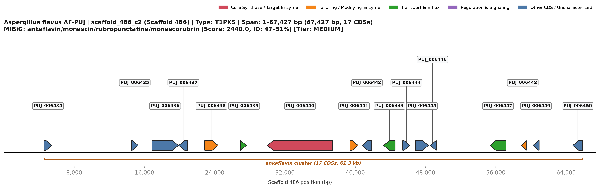](BGC_50_scaffold_486_c2_ankaflavin.svg)

> *Figure 50: Publication-grade gene cluster diagram of `BGC_50_scaffold_486_c2_ankaflavin` on Scaffold 486. Arrows indicate direction of transcription; boxes display standardized gene symbols or official locus tags. [Open scalable vector SVG](BGC_50_scaffold_486_c2_ankaflavin.svg).*

#### Gene Inventory & Structural Qualifiers

| Locus Tag | Gene Symbol | Strand | Physical Span | Length | Putative Product & EC Number | Pfam / Domain Signatures |
| :--- | :---: | :---: | :---: | :---: | :--- | :--- |
| `PUJ_006434` | `PUJ_006434` | `+` | 4,575..5,459 | 294 aa | hypothetical protein | PF01828 (Peptidase A4 family) |
| `PUJ_006435` | `PUJ_006435` | `+` | 14,520..15,279 | 85 aa | hypothetical protein | — |
| `PUJ_006436` | `PUJ_006436` | `+` | 16,860..19,858 | 789 aa | hypothetical protein | PF00931 (NB-ARC domain), PF13424 (Tetratricopeptide repeat) |
| `PUJ_006437` | `PUJ_006437` | `-` | 19,919..20,934 | 271 aa | hypothetical protein | — |
| `PUJ_006438` | `PUJ_006438` | `+` | 22,867..24,378 | 476 aa | hypothetical protein | PF13450 (NAD(P)-binding Rossmann-like domain) |
| `PUJ_006439` | `PUJ_006439` | `+` | 27,095..27,603 | 131 aa | hypothetical protein | PF07690 (Major Facilitator Superfamily) |
| `PUJ_006440` | `PUJ_006440` | `-` | 30,001..37,427 | 2456 aa | hypothetical protein | PF07993 (Male sterility protein), PF08241 (Methyltransferase domain), PF18558 (Helix-turn-helix domain) |
| `PUJ_006441` | `PUJ_006441` | `+` | 39,412..40,319 | 264 aa | hypothetical protein | PF00106 (short chain dehydrogenase) |
| `PUJ_006442` | `PUJ_006442` | `-` | 40,769..41,875 | 332 aa | hypothetical protein | PF03171 (2OG-Fe(II) oxygenase superfamily), PF14226 (non-haem dioxygenase in morphine synthesis N-terminal) |
| `PUJ_006443` | `PUJ_006443` | `-` | 43,236..44,537 | 433 aa | hypothetical protein | PF07690 (Major Facilitator Superfamily) |
| `PUJ_006444` | `PUJ_006444` | `+` | 45,414..46,217 | 267 aa | hypothetical protein | PF03959 (Serine hydrolase (FSH1)) |
| `PUJ_006445` | `PUJ_006445` | `+` | 46,864..48,322 | 465 aa | hypothetical protein (`EC 1.14.13.1`) | PF01494 (FAD binding domain) |
| `PUJ_006446` | `PUJ_006446` | `-` | 48,551..49,009 | 133 aa | hypothetical protein | — |
| `PUJ_006447` | `PUJ_006447` | `-` | 55,345..57,162 | 559 aa | hypothetical protein | PF00324 (Amino acid permease) |
| `PUJ_006448` | `PUJ_006448` | `-` | 58,944..59,195 | 83 aa | hypothetical protein | PF00107 (Zinc-binding dehydrogenase) |
| `PUJ_006449` | `PUJ_006449` | `-` | 60,227..60,931 | 234 aa | hypothetical protein | — |
| `PUJ_006450` | `PUJ_006450` | `-` | 64,775..65,866 | 363 aa | hypothetical protein | — |

#### Putative Function & Enzymatic Mechanisms

- **`PUJ_006434`:** Hypothetical protein. Contains PF01828 (Peptidase A4 family). Hypothetical or accessory protein implicated in cluster function or localized metabolic support.
- **`PUJ_006435`:** Hypothetical protein. Hypothetical or accessory protein implicated in cluster function or localized metabolic support.
- **`PUJ_006436`:** Hypothetical protein. Contains PF00931 (NB-ARC domain), PF13424 (Tetratricopeptide repeat). Hypothetical or accessory protein implicated in cluster function or localized metabolic support.
- **`PUJ_006437`:** Hypothetical protein. Hypothetical or accessory protein implicated in cluster function or localized metabolic support.
- **`PUJ_006438`:** Hypothetical protein. Contains PF13450 (NAD(P)-binding Rossmann-like domain). Hypothetical or accessory protein implicated in cluster function or localized metabolic support.
- **`PUJ_006439`:** Hypothetical protein. Contains PF07690 (Major Facilitator Superfamily). Hypothetical or accessory protein implicated in cluster function or localized metabolic support.
- **`PUJ_006440`:** Hypothetical protein. Contains PF07993 (Male sterility protein), PF08241 (Methyltransferase domain). Hypothetical or accessory protein implicated in cluster function or localized metabolic support.
- **`PUJ_006441`:** Hypothetical protein. Contains PF00106 (short chain dehydrogenase). Hypothetical or accessory protein implicated in cluster function or localized metabolic support.
- **`PUJ_006442`:** Hypothetical protein. Contains PF03171 (2OG-Fe(II) oxygenase superfamily), PF14226 (non-haem dioxygenase in morphine synthesis N-terminal). Hypothetical or accessory protein implicated in cluster function or localized metabolic support.
- **`PUJ_006443`:** Hypothetical protein. Contains PF07690 (Major Facilitator Superfamily). Hypothetical or accessory protein implicated in cluster function or localized metabolic support.
- **`PUJ_006444`:** Hypothetical protein. Contains PF03959 (Serine hydrolase (FSH1)). Hypothetical or accessory protein implicated in cluster function or localized metabolic support.
- **`PUJ_006445`:** Hypothetical protein (EC 1.14.13.1). Contains PF01494 (FAD binding domain). Hypothetical or accessory protein implicated in cluster function or localized metabolic support.
- **`PUJ_006446`:** Hypothetical protein. Hypothetical or accessory protein implicated in cluster function or localized metabolic support.
- **`PUJ_006447`:** Hypothetical protein. Contains PF00324 (Amino acid permease). Hypothetical or accessory protein implicated in cluster function or localized metabolic support.
- **`PUJ_006448`:** Hypothetical protein. Contains PF00107 (Zinc-binding dehydrogenase). Hypothetical or accessory protein implicated in cluster function or localized metabolic support.
- **`PUJ_006449`:** Hypothetical protein. Hypothetical or accessory protein implicated in cluster function or localized metabolic support.
- **`PUJ_006450`:** Hypothetical protein. Hypothetical or accessory protein implicated in cluster function or localized metabolic support.

### Collective Pathway Architecture & Biological Synergy

This cluster exhibits significant homology to the characterized MIBiG reference for **ankaflavin/monascin/rubropunctatine/monascorubrin** (MIBiG accession `BGC0000027.4`, score 2,440.0, identities 47–51%). The cluster features 17 coordinated CDSs encoding core synthases, tailoring oxidoreductases/transferases, and transmembrane efflux transporters that function collectively to synthesize, modify, and excrete bioactive T1PKS compounds.

---

### 51. Novel Orphan T1PKS Biosynthetic Gene Cluster (`Scaffold 486`)

- **Cluster Identifier:** `BGC_51_scaffold_486_c3_orphan_t1pks` (`scaffold_486_c3`)  
- **Genomic Location:** Scaffold 486 | Span: 1–61,151 bp (61,151 bp, 10 CDSs)  
- **Pathway Class:** `T1PKS` | **Confidence Tier:** `ORPHAN`  

[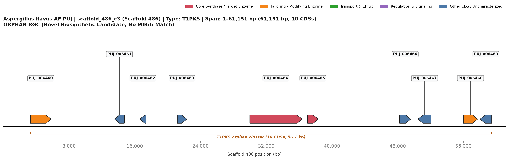](BGC_51_scaffold_486_c3_orphan_t1pks.svg)

> *Figure 51: Publication-grade gene cluster diagram of `BGC_51_scaffold_486_c3_orphan_t1pks` on Scaffold 486. Arrows indicate direction of transcription; boxes display standardized gene symbols or official locus tags. [Open scalable vector SVG](BGC_51_scaffold_486_c3_orphan_t1pks.svg).*

#### Gene Inventory & Structural Qualifiers

| Locus Tag | Gene Symbol | Strand | Physical Span | Length | Putative Product & EC Number | Pfam / Domain Signatures |
| :--- | :---: | :---: | :---: | :---: | :--- | :--- |
| `PUJ_006460` | `PUJ_006460` | `+` | 3,302..5,805 | 815 aa | hypothetical protein (`EC 3.2.1.21`) | PF00933 (Glycosyl hydrolase family 3 N terminal domain), PF01915 (Glycosyl hydrolase family 3 C-terminal domain), PF14310 (Fibronectin type III-like domain) |
| `PUJ_006461` | `PUJ_006461` | `-` | 13,542..14,723 | 393 aa | hypothetical protein (`EC 1.1.1.34`) | PF00368 (Hydroxymethylglutaryl-coenzyme A reductase) |
| `PUJ_006462` | `PUJ_006462` | `-` | 16,623..17,361 | 230 aa | hypothetical protein | — |
| `PUJ_006463` | `PUJ_006463` | `+` | 21,175..22,324 | 362 aa | hypothetical protein | PF01764 (Lipase (class 3)) |
| `PUJ_006464` | `PUJ_006464` | `+` | 30,001..36,360 | 1875 aa | hypothetical protein | PF00109 (Beta-ketoacyl synthase, N-terminal domain), PF02801 (Beta-ketoacyl synthase, C-terminal domain), PF16197 (Ketoacyl-synthetase C-terminal extension) |
| `PUJ_006465` | `PUJ_006465` | `+` | 37,037..38,317 | 404 aa | hypothetical protein | PF08659 (KR domain) |
| `PUJ_006466` | `PUJ_006466` | `+` | 48,237..49,580 | 447 aa | hypothetical protein | PF00400 (WD domain, G-beta repeat), PF00400 (WD domain, G-beta repeat), PF00400 (WD domain, G-beta repeat) |
| `PUJ_006467` | `PUJ_006467` | `-` | 50,474..52,065 | 471 aa | hypothetical protein | PF00023 (Ankyrin repeat), PF12796 (Ankyrin repeats (3 copies)) |
| `PUJ_006468` | `PUJ_006468` | `+` | 56,006..57,718 | 463 aa | hypothetical protein | PF00067 (Cytochrome P450), PF00067 (Cytochrome P450) |
| `PUJ_006469` | `PUJ_006469` | `-` | 58,035..59,442 | 383 aa | hypothetical protein | — |

#### Putative Function & Enzymatic Mechanisms

- **`PUJ_006460`:** Hypothetical protein (EC 3.2.1.21). Contains PF00933 (Glycosyl hydrolase family 3 N terminal domain), PF01915 (Glycosyl hydrolase family 3 C-terminal domain). Hypothetical or accessory protein implicated in cluster function or localized metabolic support.
- **`PUJ_006461`:** Hypothetical protein (EC 1.1.1.34). Contains PF00368 (Hydroxymethylglutaryl-coenzyme A reductase). Hypothetical or accessory protein implicated in cluster function or localized metabolic support.
- **`PUJ_006462`:** Hypothetical protein. Hypothetical or accessory protein implicated in cluster function or localized metabolic support.
- **`PUJ_006463`:** Hypothetical protein. Contains PF01764 (Lipase (class 3)). Hypothetical or accessory protein implicated in cluster function or localized metabolic support.
- **`PUJ_006464`:** Hypothetical protein. Contains PF00109 (Beta-ketoacyl synthase, N-terminal domain), PF02801 (Beta-ketoacyl synthase, C-terminal domain). Hypothetical or accessory protein implicated in cluster function or localized metabolic support.
- **`PUJ_006465`:** Hypothetical protein. Contains PF08659 (KR domain). Hypothetical or accessory protein implicated in cluster function or localized metabolic support.
- **`PUJ_006466`:** Hypothetical protein. Contains PF00400 (WD domain, G-beta repeat), PF00400 (WD domain, G-beta repeat). Hypothetical or accessory protein implicated in cluster function or localized metabolic support.
- **`PUJ_006467`:** Hypothetical protein. Contains PF00023 (Ankyrin repeat), PF12796 (Ankyrin repeats (3 copies)). Hypothetical or accessory protein implicated in cluster function or localized metabolic support.
- **`PUJ_006468`:** Hypothetical protein. Contains PF00067 (Cytochrome P450), PF00067 (Cytochrome P450). Hypothetical or accessory protein implicated in cluster function or localized metabolic support.
- **`PUJ_006469`:** Hypothetical protein. Hypothetical or accessory protein implicated in cluster function or localized metabolic support.

### Collective Pathway Architecture & Biological Synergy

This cluster represents a novel **orphan T1PKS secondary metabolite biosynthetic gene cluster (BGC)**. Comprising 10 predicted CDSs, the locus harbors a dedicated core synthase supported by localized tailoring enzymes and transporter permeases with zero significant matches in MIBiG 3.1. It represents an uncharacterized secondary metabolite pathway within the *Aspergillus flavus* genome with potential bioactive chemical products.

---

### 52. Novel Orphan TERPENE Biosynthetic Gene Cluster (`Scaffold 497`)

- **Cluster Identifier:** `BGC_52_scaffold_497_c1_orphan_terpene` (`scaffold_497_c1`)  
- **Genomic Location:** Scaffold 497 | Span: 1–32,296 bp (32,296 bp, 9 CDSs)  
- **Pathway Class:** `terpene` | **Confidence Tier:** `ORPHAN`  

[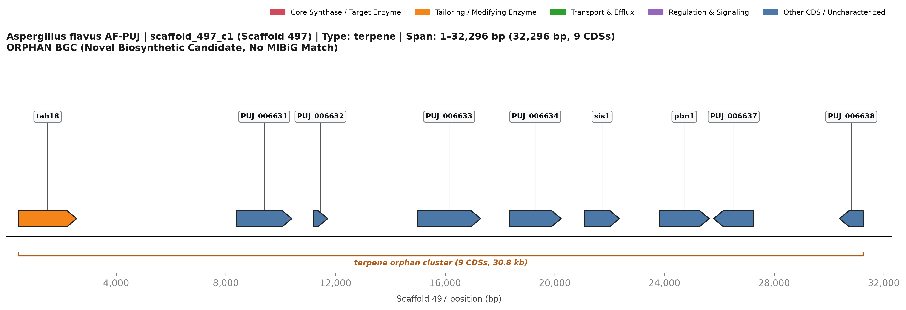](BGC_52_scaffold_497_c1_orphan_terpene.svg)

> *Figure 52: Publication-grade gene cluster diagram of `BGC_52_scaffold_497_c1_orphan_terpene` on Scaffold 497. Arrows indicate direction of transcription; boxes display standardized gene symbols or official locus tags. [Open scalable vector SVG](BGC_52_scaffold_497_c1_orphan_terpene.svg).*

#### Gene Inventory & Structural Qualifiers

| Locus Tag | Gene Symbol | Strand | Physical Span | Length | Putative Product & EC Number | Pfam / Domain Signatures |
| :--- | :---: | :---: | :---: | :---: | :--- | :--- |
| `PUJ_006630` | `tah18` | `+` | 442..2,561 | 608 aa | NAPDH-dependent diflavin reductase | PF00258 (Flavodoxin), PF00667 (FAD binding domain), PF00175 (Oxidoreductase NAD-binding domain) |
| `PUJ_006631` | `PUJ_006631` | `+` | 8,398..10,410 | 670 aa | hypothetical protein | PF04366 (Las17-binding protein actin regulator) |
| `PUJ_006632` | `PUJ_006632` | `+` | 11,194..11,718 | 155 aa | hypothetical protein (`EC 3.1.26.3`) | PF00636 (Ribonuclease III domain) |
| `PUJ_006633` | `PUJ_006633` | `+` | 15,001..17,296 | 727 aa | hypothetical protein | PF19086 (Terpene synthase family 2, C-terminal metal binding), PF00348 (Polyprenyl synthetase) |
| `PUJ_006634` | `PUJ_006634` | `+` | 18,340..20,234 | 611 aa | hypothetical protein (`EC 3.4.16.6`) | PF00450 (Serine carboxypeptidase) |
| `PUJ_006635` | `sis1` | `+` | 21,093..22,360 | 370 aa | Molecular chaperone (DnaJ super) | PF00226 (DnaJ domain), PF01556 (DnaJ C terminal domain) |
| `PUJ_006636` | `pbn1` | `+` | 23,813..25,634 | 471 aa | protease B nonderepressible form | PF08320 (PIG-X / PBN1) |
| `PUJ_006637` | `PUJ_006637` | `-` | 25,796..27,259 | 487 aa | hypothetical protein | PF04082 (Fungal specific transcription factor domain) |
| `PUJ_006638` | `PUJ_006638` | `-` | 30,385..31,247 | 265 aa | hypothetical protein | — |

#### Putative Function & Enzymatic Mechanisms

- **`PUJ_006630` (`tah18`):** Napdh-dependent diflavin reductase. Contains PF00258 (Flavodoxin), PF00667 (FAD binding domain). Oxidoreductase tailoring enzyme driving intermediate redox transformation.
- **`PUJ_006631`:** Hypothetical protein. Contains PF04366 (Las17-binding protein actin regulator). Hypothetical or accessory protein implicated in cluster function or localized metabolic support.
- **`PUJ_006632`:** Hypothetical protein (EC 3.1.26.3). Contains PF00636 (Ribonuclease III domain). Hypothetical or accessory protein implicated in cluster function or localized metabolic support.
- **`PUJ_006633`:** Hypothetical protein. Contains PF19086 (Terpene synthase family 2, C-terminal metal binding), PF00348 (Polyprenyl synthetase). Hypothetical or accessory protein implicated in cluster function or localized metabolic support.
- **`PUJ_006634`:** Hypothetical protein (EC 3.4.16.6). Contains PF00450 (Serine carboxypeptidase). Hypothetical or accessory protein implicated in cluster function or localized metabolic support.
- **`PUJ_006635` (`sis1`):** Molecular chaperone (dnaj super). Contains PF00226 (DnaJ domain), PF01556 (DnaJ C terminal domain). Hypothetical or accessory protein implicated in cluster function or localized metabolic support.
- **`PUJ_006636` (`pbn1`):** Protease b nonderepressible form. Contains PF08320 (PIG-X / PBN1). Hypothetical or accessory protein implicated in cluster function or localized metabolic support.
- **`PUJ_006637`:** Hypothetical protein. Contains PF04082 (Fungal specific transcription factor domain). Hypothetical or accessory protein implicated in cluster function or localized metabolic support.
- **`PUJ_006638`:** Hypothetical protein. Hypothetical or accessory protein implicated in cluster function or localized metabolic support.

### Collective Pathway Architecture & Biological Synergy

This cluster represents a novel **orphan terpene secondary metabolite biosynthetic gene cluster (BGC)**. Comprising 9 predicted CDSs, the locus harbors a dedicated core synthase supported by localized tailoring enzymes and transporter permeases with zero significant matches in MIBiG 3.1. It represents an uncharacterized secondary metabolite pathway within the *Aspergillus flavus* genome with potential bioactive chemical products.

---

### 53. Novel Orphan TERPENE Biosynthetic Gene Cluster (`Scaffold 614`)

- **Cluster Identifier:** `BGC_53_scaffold_614_c1_orphan_terpene` (`scaffold_614_c1`)  
- **Genomic Location:** Scaffold 614 | Span: 1–34,444 bp (34,444 bp, 6 CDSs)  
- **Pathway Class:** `terpene` | **Confidence Tier:** `ORPHAN`  

[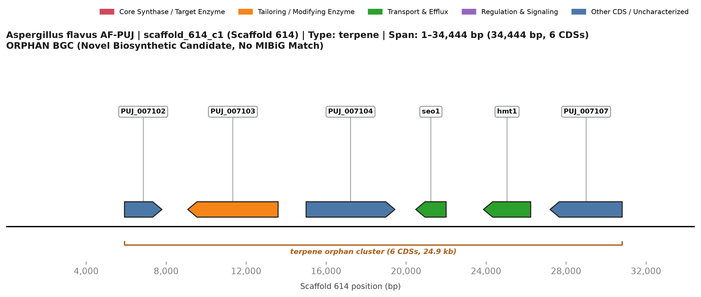](BGC_53_scaffold_614_c1_orphan_terpene.svg)

> *Figure 53: Publication-grade gene cluster diagram of `BGC_53_scaffold_614_c1_orphan_terpene` on Scaffold 614. Arrows indicate direction of transcription; boxes display standardized gene symbols or official locus tags. [Open scalable vector SVG](BGC_53_scaffold_614_c1_orphan_terpene.svg).*

#### Gene Inventory & Structural Qualifiers

| Locus Tag | Gene Symbol | Strand | Physical Span | Length | Putative Product & EC Number | Pfam / Domain Signatures |
| :--- | :---: | :---: | :---: | :---: | :--- | :--- |
| `PUJ_007102` | `PUJ_007102` | `+` | 5,918..7,790 | 552 aa | hypothetical protein | PF13854 (Kelch motif) |
| `PUJ_007103` | `PUJ_007103` | `-` | 9,081..13,600 | 850 aa | hypothetical protein | PF00067 (Cytochrome P450), PF00067 (Cytochrome P450) |
| `PUJ_007104` | `PUJ_007104` | `+` | 15,001..19,444 | 1105 aa | hypothetical protein (`EC 5.4.99.7`) | PF13249 (Squalene-hopene cyclase N-terminal domain), PF13243 (Squalene-hopene cyclase C-terminal domain), PF01636 (Phosphotransferase enzyme family) |
| `PUJ_007105` | `seo1` | `-` | 20,483..22,003 | 459 aa | MFS transporter (Seo1) | PF07690 (Major Facilitator Superfamily) |
| `PUJ_007106` | `hmt1` | `-` | 23,869..26,232 | 754 aa | ATP-binding cassette-type vacuolar membrane transporter Hmt1 | PF00005 (ABC transporter), PF00664 (ABC transporter transmembrane region) |
| `PUJ_007107` | `PUJ_007107` | `-` | 27,200..30,808 | 1202 aa | hypothetical protein | PF01636 (Phosphotransferase enzyme family), PF00534 (Glycosyl transferases group 1) |

#### Putative Function & Enzymatic Mechanisms

- **`PUJ_007102`:** Hypothetical protein. Contains PF13854 (Kelch motif). Hypothetical or accessory protein implicated in cluster function or localized metabolic support.
- **`PUJ_007103`:** Hypothetical protein. Contains PF00067 (Cytochrome P450), PF00067 (Cytochrome P450). Hypothetical or accessory protein implicated in cluster function or localized metabolic support.
- **`PUJ_007104`:** Hypothetical protein (EC 5.4.99.7). Contains PF13249 (Squalene-hopene cyclase N-terminal domain), PF13243 (Squalene-hopene cyclase C-terminal domain). Hypothetical or accessory protein implicated in cluster function or localized metabolic support.
- **`PUJ_007105` (`seo1`):** Mfs transporter (seo1). Contains PF07690 (Major Facilitator Superfamily). Transmembrane transport protein mediating efflux of synthesized products or precursor import.
- **`PUJ_007106` (`hmt1`):** Atp-binding cassette-type vacuolar membrane transporter hmt1. Contains PF00005 (ABC transporter), PF00664 (ABC transporter transmembrane region). Transmembrane transport protein mediating efflux of synthesized products or precursor import.
- **`PUJ_007107`:** Hypothetical protein. Contains PF01636 (Phosphotransferase enzyme family), PF00534 (Glycosyl transferases group 1). Hypothetical or accessory protein implicated in cluster function or localized metabolic support.

### Collective Pathway Architecture & Biological Synergy

This cluster represents a novel **orphan terpene secondary metabolite biosynthetic gene cluster (BGC)**. Comprising 6 predicted CDSs, the locus harbors a dedicated core synthase supported by localized tailoring enzymes and transporter permeases with zero significant matches in MIBiG 3.1. It represents an uncharacterized secondary metabolite pathway within the *Aspergillus flavus* genome with potential bioactive chemical products.

---

### 54. 2,4'-Dihydroxy-3'-Methoxypropiophenone Biosynthetic Gene Cluster (`Scaffold 614`)

- **Cluster Identifier:** `BGC_54_scaffold_614_c2_2,4_dihydroxy_3_methoxypropiophenone` (`scaffold_614_c2`)  
- **Genomic Location:** Scaffold 614 | Span: 1–67,290 bp (67,290 bp, 23 CDSs)  
- **Pathway Class:** `T1PKS` | **Confidence Tier:** `MEDIUM`  
- **antiSMASH KnownClusterBlast Top Hit:** `BGC0002238.3` — **2,4'-dihydroxy-3'-methoxypropiophenone** (Cumulative Score: 5,797.0, Identity: 97–100%, 2 proteins)  

[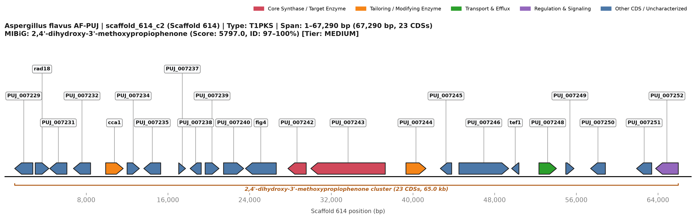](BGC_54_scaffold_614_c2_2,4_dihydroxy_3_methoxypropiophenone.svg)

> *Figure 54: Publication-grade gene cluster diagram of `BGC_54_scaffold_614_c2_2,4_dihydroxy_3_methoxypropiophenone` on Scaffold 614. Arrows indicate direction of transcription; boxes display standardized gene symbols or official locus tags. [Open scalable vector SVG](BGC_54_scaffold_614_c2_2,4_dihydroxy_3_methoxypropiophenone.svg).*

#### Gene Inventory & Structural Qualifiers

| Locus Tag | Gene Symbol | Strand | Physical Span | Length | Putative Product & EC Number | Pfam / Domain Signatures |
| :--- | :---: | :---: | :---: | :---: | :--- | :--- |
| `PUJ_007229` | `PUJ_007229` | `-` | 995..2,772 | 442 aa | hypothetical protein | PF09507 (DNA polymerase subunit Cdc27) |
| `PUJ_007230` | `rad18` | `+` | 3,007..4,342 | 341 aa | E3 ubiquitin-protein ligase rad18 (`EC 2.3.2.27`) | PF13923 (Zinc finger, C3HC4 type (RING finger)) |
| `PUJ_007231` | `PUJ_007231` | `-` | 4,428..6,110 | 474 aa | hypothetical protein | PF03357 (Snf7) |
| `PUJ_007232` | `PUJ_007232` | `-` | 6,745..8,428 | 518 aa | hypothetical protein | PF12739 (ER-Golgi trafficking TRAPP I complex 85 kDa subunit) |
| `PUJ_007233` | `cca1` | `+` | 9,904..11,622 | 555 aa | CCA tRNA nucleotidyltransferase, mitochondrial (`EC 2.7.7.72`) | PF01743 (Poly A polymerase head domain), PF12627 (Probable RNA and SrmB- binding site of polymerase A) |
| `PUJ_007234` | `PUJ_007234` | `+` | 12,003..13,205 | 317 aa | hypothetical protein (`EC 3.1.3.16`) | PF00481 (Protein phosphatase 2C) |
| `PUJ_007235` | `PUJ_007235` | `-` | 13,638..15,296 | 477 aa | hypothetical protein | PF00982 (Glycosyltransferase family 20) |
| `PUJ_007237` | `PUJ_007237` | `+` | 17,096..17,728 | 192 aa | hypothetical protein | PF01814 (Hemerythrin HHE cation binding domain) |
| `PUJ_007238` | `PUJ_007238` | `-` | 18,178..19,264 | 275 aa | hypothetical protein | PF05042 (Caleosin related protein) |
| `PUJ_007239` | `PUJ_007239` | `+` | 19,649..21,003 | 396 aa | hypothetical protein | PF01408 (Oxidoreductase family, NAD-binding Rossmann fold) |
| `PUJ_007240` | `PUJ_007240` | `+` | 21,450..23,422 | 596 aa | hypothetical protein | PF10521 (Tti2 family) |
| `PUJ_007241` | `fig4` | `-` | 23,596..26,616 | 1006 aa | phosphatidylinositol-3,5-bisphosphate 5-phosphatase | PF02383 (SacI homology domain) |
| `PUJ_007242` | `PUJ_007242` | `-` | 27,756..29,548 | 561 aa | hypothetical protein | PF13193 (AMP-binding enzyme C-terminal domain), PF00501 (AMP-binding enzyme) |
| `PUJ_007243` | `PUJ_007243` | `-` | 30,001..37,290 | 2390 aa | hypothetical protein | PF00550 (Phosphopantetheine attachment site), PF08242 (Methyltransferase domain), PF14765 (Polyketide synthase dehydratase) |
| `PUJ_007244` | `PUJ_007244` | `+` | 39,317..41,276 | 464 aa | hypothetical protein | PF00067 (Cytochrome P450) |
| `PUJ_007245` | `PUJ_007245` | `-` | 42,681..43,796 | 371 aa | hypothetical protein | — |
| `PUJ_007246` | `PUJ_007246` | `+` | 44,505..49,376 | 1623 aa | hypothetical protein | — |
| `PUJ_007247` | `tef1` | `-` | 49,667..50,383 | 208 aa | translation elongation factor EF-1 alpha | PF00009 (Elongation factor Tu GTP binding domain) |
| `PUJ_007248` | `PUJ_007248` | `+` | 52,341..54,054 | 457 aa | hypothetical protein | PF07690 (Major Facilitator Superfamily) |
| `PUJ_007249` | `PUJ_007249` | `+` | 54,971..55,778 | 210 aa | hypothetical protein | — |
| `PUJ_007250` | `PUJ_007250` | `-` | 57,401..58,850 | 425 aa | hypothetical protein (`EC 3.2.1.101`) | PF03663 (Glycosyl hydrolase family 76) |
| `PUJ_007251` | `PUJ_007251` | `-` | 61,903..63,389 | 361 aa | hypothetical protein | PF00441 (Acyl-CoA dehydrogenase, C-terminal domain), PF02771 (Acyl-CoA dehydrogenase, N-terminal domain) |
| `PUJ_007252` | `PUJ_007252` | `-` | 63,770..65,992 | 740 aa | hypothetical protein (`EC 2.7.11.1`) | PF00069 (Protein kinase domain), PF00069 (Protein kinase domain) |

#### Putative Function & Enzymatic Mechanisms

- **`PUJ_007229`:** Hypothetical protein. Contains PF09507 (DNA polymerase subunit Cdc27). Hypothetical or accessory protein implicated in cluster function or localized metabolic support.
- **`PUJ_007230` (`rad18`):** E3 ubiquitin-protein ligase rad18 (EC 2.3.2.27). Contains PF13923 (Zinc finger, C3HC4 type (RING finger)). Hypothetical or accessory protein implicated in cluster function or localized metabolic support.
- **`PUJ_007231`:** Hypothetical protein. Contains PF03357 (Snf7). Hypothetical or accessory protein implicated in cluster function or localized metabolic support.
- **`PUJ_007232`:** Hypothetical protein. Contains PF12739 (ER-Golgi trafficking TRAPP I complex 85 kDa subunit). Hypothetical or accessory protein implicated in cluster function or localized metabolic support.
- **`PUJ_007233` (`cca1`):** Cca trna nucleotidyltransferase, mitochondrial (EC 2.7.7.72). Contains PF01743 (Poly A polymerase head domain), PF12627 (Probable RNA and SrmB- binding site of polymerase A). Transfers chemical functional groups (e.g. methyl, acyl, or prenyl) to modify precursor bioactivity.
- **`PUJ_007234`:** Hypothetical protein (EC 3.1.3.16). Contains PF00481 (Protein phosphatase 2C). Hypothetical or accessory protein implicated in cluster function or localized metabolic support.
- **`PUJ_007235`:** Hypothetical protein. Contains PF00982 (Glycosyltransferase family 20). Hypothetical or accessory protein implicated in cluster function or localized metabolic support.
- **`PUJ_007237`:** Hypothetical protein. Contains PF01814 (Hemerythrin HHE cation binding domain). Hypothetical or accessory protein implicated in cluster function or localized metabolic support.
- **`PUJ_007238`:** Hypothetical protein. Contains PF05042 (Caleosin related protein). Hypothetical or accessory protein implicated in cluster function or localized metabolic support.
- **`PUJ_007239`:** Hypothetical protein. Contains PF01408 (Oxidoreductase family, NAD-binding Rossmann fold). Hypothetical or accessory protein implicated in cluster function or localized metabolic support.
- **`PUJ_007240`:** Hypothetical protein. Contains PF10521 (Tti2 family). Hypothetical or accessory protein implicated in cluster function or localized metabolic support.
- **`PUJ_007241` (`fig4`):** Phosphatidylinositol-3,5-bisphosphate 5-phosphatase. Contains PF02383 (SacI homology domain). Hypothetical or accessory protein implicated in cluster function or localized metabolic support.
- **`PUJ_007242`:** Hypothetical protein. Contains PF13193 (AMP-binding enzyme C-terminal domain), PF00501 (AMP-binding enzyme). Hypothetical or accessory protein implicated in cluster function or localized metabolic support.
- **`PUJ_007243`:** Hypothetical protein. Contains PF00550 (Phosphopantetheine attachment site), PF08242 (Methyltransferase domain). Hypothetical or accessory protein implicated in cluster function or localized metabolic support.
- **`PUJ_007244`:** Hypothetical protein. Contains PF00067 (Cytochrome P450). Hypothetical or accessory protein implicated in cluster function or localized metabolic support.
- **`PUJ_007245`:** Hypothetical protein. Hypothetical or accessory protein implicated in cluster function or localized metabolic support.
- **`PUJ_007246`:** Hypothetical protein. Hypothetical or accessory protein implicated in cluster function or localized metabolic support.
- **`PUJ_007247` (`tef1`):** Translation elongation factor ef-1 alpha. Contains PF00009 (Elongation factor Tu GTP binding domain). Hypothetical or accessory protein implicated in cluster function or localized metabolic support.
- **`PUJ_007248`:** Hypothetical protein. Contains PF07690 (Major Facilitator Superfamily). Hypothetical or accessory protein implicated in cluster function or localized metabolic support.
- **`PUJ_007249`:** Hypothetical protein. Hypothetical or accessory protein implicated in cluster function or localized metabolic support.
- **`PUJ_007250`:** Hypothetical protein (EC 3.2.1.101). Contains PF03663 (Glycosyl hydrolase family 76). Hypothetical or accessory protein implicated in cluster function or localized metabolic support.
- **`PUJ_007251`:** Hypothetical protein. Contains PF00441 (Acyl-CoA dehydrogenase, C-terminal domain), PF02771 (Acyl-CoA dehydrogenase, N-terminal domain). Hypothetical or accessory protein implicated in cluster function or localized metabolic support.
- **`PUJ_007252`:** Hypothetical protein (EC 2.7.11.1). Contains PF00069 (Protein kinase domain), PF00069 (Protein kinase domain). Hypothetical or accessory protein implicated in cluster function or localized metabolic support.

### Collective Pathway Architecture & Biological Synergy

This cluster exhibits significant homology to the characterized MIBiG reference for **2,4'-dihydroxy-3'-methoxypropiophenone** (MIBiG accession `BGC0002238.3`, score 5,797.0, identities 97–100%). The cluster features 23 coordinated CDSs encoding core synthases, tailoring oxidoreductases/transferases, and transmembrane efflux transporters that function collectively to synthesize, modify, and excrete bioactive T1PKS compounds.

---

### 55. Novel Orphan INDOLE Biosynthetic Gene Cluster (`Scaffold 641`)

- **Cluster Identifier:** `BGC_55_scaffold_641_c1_orphan_indole` (`scaffold_641_c1`)  
- **Genomic Location:** Scaffold 641 | Span: 1–31,441 bp (31,441 bp, 13 CDSs)  
- **Pathway Class:** `indole` | **Confidence Tier:** `ORPHAN`  

[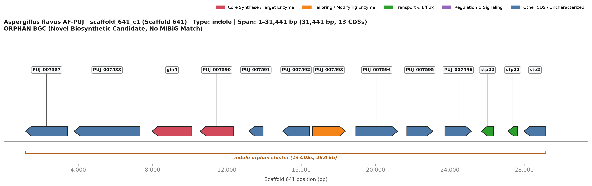](BGC_55_scaffold_641_c1_orphan_indole.svg)

> *Figure 55: Publication-grade gene cluster diagram of `BGC_55_scaffold_641_c1_orphan_indole` on Scaffold 641. Arrows indicate direction of transcription; boxes display standardized gene symbols or official locus tags. [Open scalable vector SVG](BGC_55_scaffold_641_c1_orphan_indole.svg).*

#### Gene Inventory & Structural Qualifiers

| Locus Tag | Gene Symbol | Strand | Physical Span | Length | Putative Product & EC Number | Pfam / Domain Signatures |
| :--- | :---: | :---: | :---: | :---: | :--- | :--- |
| `PUJ_007587` | `PUJ_007587` | `-` | 1,166..3,433 | 755 aa | hypothetical protein | PF00023 (Ankyrin repeat) |
| `PUJ_007588` | `PUJ_007588` | `-` | 3,781..7,326 | 1093 aa | hypothetical protein | PF00023 (Ankyrin repeat), PF12796 (Ankyrin repeats (3 copies)), PF05729 (NACHT domain) |
| `PUJ_007589` | `gln4` | `-` | 7,974..10,116 | 631 aa | Glutaminyl-tRNA synthetase (`EC 6.1.1.18`) | PF03950 (tRNA synthetases class I (E and Q), anti-codon binding domain), PF00749 (tRNA synthetases class I (E and Q), catalytic domain) |
| `PUJ_007590` | `PUJ_007590` | `-` | 10,560..12,343 | 538 aa | hypothetical protein | PF00501 (AMP-binding enzyme) |
| `PUJ_007591` | `PUJ_007591` | `-` | 13,180..13,947 | 226 aa | hypothetical protein | — |
| `PUJ_007592` | `PUJ_007592` | `-` | 15,001..16,441 | 459 aa | hypothetical protein (`EC 2.5.1.122`) | PF11991 (Tryptophan dimethylallyltransferase) |
| `PUJ_007593` | `PUJ_007593` | `+` | 16,611..18,378 | 429 aa | hypothetical protein | PF00067 (Cytochrome P450) |
| `PUJ_007594` | `PUJ_007594` | `+` | 18,939..21,191 | 693 aa | hypothetical protein (`EC 4.3.1.24`) | PF00221 (Aromatic amino acid lyase) |
| `PUJ_007595` | `PUJ_007595` | `+` | 21,681..23,084 | 387 aa | hypothetical protein | — |
| `PUJ_007596` | `PUJ_007596` | `+` | 23,732..25,163 | 458 aa | hypothetical protein | PF01565 (FAD binding domain) |
| `PUJ_007597` | `stp22` | `-` | 25,695..26,339 | 214 aa | Suppressor protein stp22 of temperature-sensitive alpha-factor receptor and arginine permease | PF09454 (Vps23 core domain) |
| `PUJ_007598` | `stp22` | `-` | 27,120..27,640 | 136 aa | Suppressor protein stp22 of temperature-sensitive alpha-factor receptor and arginine permease | PF05743 (UEV domain) |
| `PUJ_007599` | `ste2` | `-` | 27,987..29,161 | 372 aa | pheromone alpha factor receptor | PF02116 (Fungal pheromone mating factor STE2 GPCR) |

#### Putative Function & Enzymatic Mechanisms

- **`PUJ_007587`:** Hypothetical protein. Contains PF00023 (Ankyrin repeat). Hypothetical or accessory protein implicated in cluster function or localized metabolic support.
- **`PUJ_007588`:** Hypothetical protein. Contains PF00023 (Ankyrin repeat), PF12796 (Ankyrin repeats (3 copies)). Hypothetical or accessory protein implicated in cluster function or localized metabolic support.
- **`PUJ_007589` (`gln4`):** Glutaminyl-trna synthetase (EC 6.1.1.18). Contains PF03950 (tRNA synthetases class I (E and Q), anti-codon binding domain), PF00749 (tRNA synthetases class I (E and Q), catalytic domain). Catalyzes core biosynthetic condensation or macrocyclization reactions in the pathway.
- **`PUJ_007590`:** Hypothetical protein. Contains PF00501 (AMP-binding enzyme). Hypothetical or accessory protein implicated in cluster function or localized metabolic support.
- **`PUJ_007591`:** Hypothetical protein. Hypothetical or accessory protein implicated in cluster function or localized metabolic support.
- **`PUJ_007592`:** Hypothetical protein (EC 2.5.1.122). Contains PF11991 (Tryptophan dimethylallyltransferase). Hypothetical or accessory protein implicated in cluster function or localized metabolic support.
- **`PUJ_007593`:** Hypothetical protein. Contains PF00067 (Cytochrome P450). Hypothetical or accessory protein implicated in cluster function or localized metabolic support.
- **`PUJ_007594`:** Hypothetical protein (EC 4.3.1.24). Contains PF00221 (Aromatic amino acid lyase). Hypothetical or accessory protein implicated in cluster function or localized metabolic support.
- **`PUJ_007595`:** Hypothetical protein. Hypothetical or accessory protein implicated in cluster function or localized metabolic support.
- **`PUJ_007596`:** Hypothetical protein. Contains PF01565 (FAD binding domain). Hypothetical or accessory protein implicated in cluster function or localized metabolic support.
- **`PUJ_007597` (`stp22`):** Suppressor protein stp22 of temperature-sensitive alpha-factor receptor and arginine permease. Contains PF09454 (Vps23 core domain). Transmembrane transport protein mediating efflux of synthesized products or precursor import.
- **`PUJ_007598` (`stp22`):** Suppressor protein stp22 of temperature-sensitive alpha-factor receptor and arginine permease. Contains PF05743 (UEV domain). Transmembrane transport protein mediating efflux of synthesized products or precursor import.
- **`PUJ_007599` (`ste2`):** Pheromone alpha factor receptor. Contains PF02116 (Fungal pheromone mating factor STE2 GPCR). Hypothetical or accessory protein implicated in cluster function or localized metabolic support.

### Collective Pathway Architecture & Biological Synergy

This cluster represents a novel **orphan indole secondary metabolite biosynthetic gene cluster (BGC)**. Comprising 13 predicted CDSs, the locus harbors a dedicated core synthase supported by localized tailoring enzymes and transporter permeases with zero significant matches in MIBiG 3.1. It represents an uncharacterized secondary metabolite pathway within the *Aspergillus flavus* genome with potential bioactive chemical products.

---

### 56. Novel Orphan TERPENE Biosynthetic Gene Cluster (`Scaffold 641`)

- **Cluster Identifier:** `BGC_56_scaffold_641_c2_orphan_terpene` (`scaffold_641_c2`)  
- **Genomic Location:** Scaffold 641 | Span: 1–31,302 bp (31,302 bp, 7 CDSs)  
- **Pathway Class:** `terpene` | **Confidence Tier:** `ORPHAN`  

[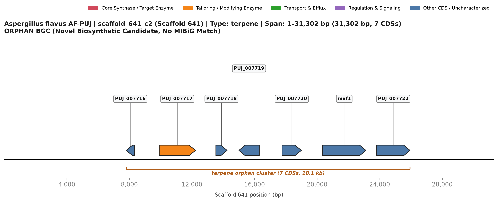](BGC_56_scaffold_641_c2_orphan_terpene.svg)

> *Figure 56: Publication-grade gene cluster diagram of `BGC_56_scaffold_641_c2_orphan_terpene` on Scaffold 641. Arrows indicate direction of transcription; boxes display standardized gene symbols or official locus tags. [Open scalable vector SVG](BGC_56_scaffold_641_c2_orphan_terpene.svg).*

#### Gene Inventory & Structural Qualifiers

| Locus Tag | Gene Symbol | Strand | Physical Span | Length | Putative Product & EC Number | Pfam / Domain Signatures |
| :--- | :---: | :---: | :---: | :---: | :--- | :--- |
| `PUJ_007716` | `PUJ_007716` | `-` | 7,802..8,320 | 172 aa | hypothetical protein | PF05870 (Phenolic acid decarboxylase (PAD)) |
| `PUJ_007717` | `PUJ_007717` | `+` | 9,909..12,226 | 675 aa | hypothetical protein (`EC 3.1.4.12`) | PF00149 (Calcineurin-like phosphoesterase) |
| `PUJ_007718` | `PUJ_007718` | `+` | 13,529..14,248 | 173 aa | hypothetical protein | PF01284 (Membrane-associating domain) |
| `PUJ_007719` | `PUJ_007719` | `-` | 15,001..16,302 | 166 aa | hypothetical protein | — |
| `PUJ_007720` | `PUJ_007720` | `+` | 17,762..18,993 | 387 aa | hypothetical protein | PF09995 (ER-bound oxygenase mpaB/B'/Rubber oxygenase, catalytic domain) |
| `PUJ_007721` | `maf1` | `+` | 20,354..23,122 | 473 aa | RNA polymerase III-inhibiting protein maf1 | PF01217 (Clathrin adaptor complex small chain), PF09174 (Maf1 regulator) |
| `PUJ_007722` | `PUJ_007722` | `+` | 23,803..25,940 | 645 aa | hypothetical protein | — |

#### Putative Function & Enzymatic Mechanisms

- **`PUJ_007716`:** Hypothetical protein. Contains PF05870 (Phenolic acid decarboxylase (PAD)). Hypothetical or accessory protein implicated in cluster function or localized metabolic support.
- **`PUJ_007717`:** Hypothetical protein (EC 3.1.4.12). Contains PF00149 (Calcineurin-like phosphoesterase). Hypothetical or accessory protein implicated in cluster function or localized metabolic support.
- **`PUJ_007718`:** Hypothetical protein. Contains PF01284 (Membrane-associating domain). Hypothetical or accessory protein implicated in cluster function or localized metabolic support.
- **`PUJ_007719`:** Hypothetical protein. Hypothetical or accessory protein implicated in cluster function or localized metabolic support.
- **`PUJ_007720`:** Hypothetical protein. Contains PF09995 (ER-bound oxygenase mpaB/B'/Rubber oxygenase, catalytic domain). Hypothetical or accessory protein implicated in cluster function or localized metabolic support.
- **`PUJ_007721` (`maf1`):** Rna polymerase iii-inhibiting protein maf1. Contains PF01217 (Clathrin adaptor complex small chain), PF09174 (Maf1 regulator). Hypothetical or accessory protein implicated in cluster function or localized metabolic support.
- **`PUJ_007722`:** Hypothetical protein. Hypothetical or accessory protein implicated in cluster function or localized metabolic support.

### Collective Pathway Architecture & Biological Synergy

This cluster represents a novel **orphan terpene secondary metabolite biosynthetic gene cluster (BGC)**. Comprising 7 predicted CDSs, the locus harbors a dedicated core synthase supported by localized tailoring enzymes and transporter permeases with zero significant matches in MIBiG 3.1. It represents an uncharacterized secondary metabolite pathway within the *Aspergillus flavus* genome with potential bioactive chemical products.

---

### 57. Azasperpyranone A Biosynthetic Gene Cluster (`Scaffold 641`)

- **Cluster Identifier:** `BGC_57_scaffold_641_c3_azasperpyranone_a` (`scaffold_641_c3`)  
- **Genomic Location:** Scaffold 641 | Span: 1–83,507 bp (83,507 bp, 20 CDSs)  
- **Pathway Class:** `T1PKS` | **Confidence Tier:** `MEDIUM`  
- **antiSMASH KnownClusterBlast Top Hit:** `BGC0002267.2` — **azasperpyranone A/azasperpyranone B/azasperpyranone C/azasperpyranone D/azasperpyranone E/azasperpyranone F/azasperpyranone G/azasperpyranone H** (Cumulative Score: 2,809.0, Identity: 47–49%, 3 proteins)  

[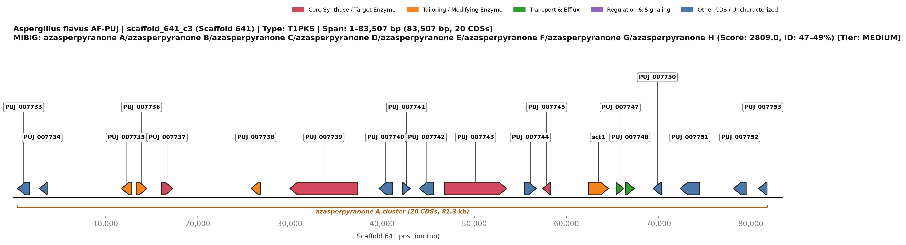](BGC_57_scaffold_641_c3_azasperpyranone_a.svg)

> *Figure 57: Publication-grade gene cluster diagram of `BGC_57_scaffold_641_c3_azasperpyranone_a` on Scaffold 641. Arrows indicate direction of transcription; boxes display standardized gene symbols or official locus tags. [Open scalable vector SVG](BGC_57_scaffold_641_c3_azasperpyranone_a.svg).*

#### Gene Inventory & Structural Qualifiers

| Locus Tag | Gene Symbol | Strand | Physical Span | Length | Putative Product & EC Number | Pfam / Domain Signatures |
| :--- | :---: | :---: | :---: | :---: | :--- | :--- |
| `PUJ_007733` | `PUJ_007733` | `-` | 469..1,756 | 345 aa | hypothetical protein | PF00153 (Mitochondrial carrier protein), PF00153 (Mitochondrial carrier protein), PF00153 (Mitochondrial carrier protein) |
| `PUJ_007734` | `PUJ_007734` | `-` | 2,837..3,388 | 183 aa | hypothetical protein | — |
| `PUJ_007735` | `PUJ_007735` | `-` | 11,734..12,780 | 348 aa | hypothetical protein | PF00107 (Zinc-binding dehydrogenase) |
| `PUJ_007736` | `PUJ_007736` | `+` | 13,322..14,494 | 288 aa | hypothetical protein | PF00248 (Aldo/keto reductase family) |
| `PUJ_007737` | `PUJ_007737` | `+` | 16,062..17,310 | 371 aa | hypothetical protein | PF00107 (Zinc-binding dehydrogenase) |
| `PUJ_007738` | `PUJ_007738` | `-` | 25,786..26,817 | 343 aa | hypothetical protein | PF00248 (Aldo/keto reductase family) |
| `PUJ_007739` | `PUJ_007739` | `-` | 30,001..37,378 | 2425 aa | hypothetical protein | PF00550 (Phosphopantetheine attachment site), PF08659 (KR domain), PF13602 (Zinc-binding dehydrogenase) |
| `PUJ_007740` | `PUJ_007740` | `-` | 39,665..41,117 | 444 aa | hypothetical protein (`EC 1.14.13.1`) | PF01494 (FAD binding domain) |
| `PUJ_007741` | `PUJ_007741` | `+` | 42,257..43,051 | 264 aa | hypothetical protein | PF03959 (Serine hydrolase (FSH1)) |
| `PUJ_007742` | `PUJ_007742` | `-` | 44,047..45,570 | 507 aa | hypothetical protein (`EC 1.14.19.18`) | PF00487 (Fatty acid desaturase) |
| `PUJ_007743` | `PUJ_007743` | `+` | 46,788..53,507 | 2232 aa | hypothetical protein | PF16073 (Starter unit:ACP transacylase in aflatoxin biosynthesis), PF00109 (Beta-ketoacyl synthase, N-terminal domain), PF02801 (Beta-ketoacyl synthase, C-terminal domain) |
| `PUJ_007744` | `PUJ_007744` | `+` | 55,461..56,721 | 350 aa | hypothetical protein | PF10979 (Protein of unknown function (DUF2786)) |
| `PUJ_007745` | `PUJ_007745` | `-` | 57,432..58,265 | 259 aa | hypothetical protein | PF00106 (short chain dehydrogenase) |
| `PUJ_007746` | `sct1` | `+` | 62,421..64,547 | 708 aa | Glycerol-3-phosphate/dihydroxyacetone phosphate acyltransferase | PF01553 (Acyltransferase) |
| `PUJ_007747` | `PUJ_007747` | `+` | 65,441..66,215 | 169 aa | hypothetical protein | PF00324 (Amino acid permease) |
| `PUJ_007748` | `PUJ_007748` | `+` | 66,411..67,361 | 297 aa | hypothetical protein | PF00324 (Amino acid permease) |
| `PUJ_007750` | `PUJ_007750` | `-` | 69,399..70,329 | 290 aa | hypothetical protein | PF04616 (Glycosyl hydrolases family 43) |
| `PUJ_007751` | `PUJ_007751` | `-` | 72,343..74,451 | 556 aa | hypothetical protein | PF13520 (Amino acid permease) |
| `PUJ_007752` | `PUJ_007752` | `-` | 78,124..79,491 | 455 aa | hypothetical protein (`EC 1.4.3.21`) | PF01179 (Copper amine oxidase, enzyme domain) |
| `PUJ_007753` | `PUJ_007753` | `-` | 80,848..81,762 | 195 aa | hypothetical protein | PF00378 (Enoyl-CoA hydratase/isomerase) |

#### Putative Function & Enzymatic Mechanisms

- **`PUJ_007733`:** Hypothetical protein. Contains PF00153 (Mitochondrial carrier protein), PF00153 (Mitochondrial carrier protein). Hypothetical or accessory protein implicated in cluster function or localized metabolic support.
- **`PUJ_007734`:** Hypothetical protein. Hypothetical or accessory protein implicated in cluster function or localized metabolic support.
- **`PUJ_007735`:** Hypothetical protein. Contains PF00107 (Zinc-binding dehydrogenase). Hypothetical or accessory protein implicated in cluster function or localized metabolic support.
- **`PUJ_007736`:** Hypothetical protein. Contains PF00248 (Aldo/keto reductase family). Hypothetical or accessory protein implicated in cluster function or localized metabolic support.
- **`PUJ_007737`:** Hypothetical protein. Contains PF00107 (Zinc-binding dehydrogenase). Hypothetical or accessory protein implicated in cluster function or localized metabolic support.
- **`PUJ_007738`:** Hypothetical protein. Contains PF00248 (Aldo/keto reductase family). Hypothetical or accessory protein implicated in cluster function or localized metabolic support.
- **`PUJ_007739`:** Hypothetical protein. Contains PF00550 (Phosphopantetheine attachment site), PF08659 (KR domain). Hypothetical or accessory protein implicated in cluster function or localized metabolic support.
- **`PUJ_007740`:** Hypothetical protein (EC 1.14.13.1). Contains PF01494 (FAD binding domain). Hypothetical or accessory protein implicated in cluster function or localized metabolic support.
- **`PUJ_007741`:** Hypothetical protein. Contains PF03959 (Serine hydrolase (FSH1)). Hypothetical or accessory protein implicated in cluster function or localized metabolic support.
- **`PUJ_007742`:** Hypothetical protein (EC 1.14.19.18). Contains PF00487 (Fatty acid desaturase). Hypothetical or accessory protein implicated in cluster function or localized metabolic support.
- **`PUJ_007743`:** Hypothetical protein. Contains PF16073 (Starter unit:ACP transacylase in aflatoxin biosynthesis), PF00109 (Beta-ketoacyl synthase, N-terminal domain). Hypothetical or accessory protein implicated in cluster function or localized metabolic support.
- **`PUJ_007744`:** Hypothetical protein. Contains PF10979 (Protein of unknown function (DUF2786)). Hypothetical or accessory protein implicated in cluster function or localized metabolic support.
- **`PUJ_007745`:** Hypothetical protein. Contains PF00106 (short chain dehydrogenase). Hypothetical or accessory protein implicated in cluster function or localized metabolic support.
- **`PUJ_007746` (`sct1`):** Glycerol-3-phosphate/dihydroxyacetone phosphate acyltransferase. Contains PF01553 (Acyltransferase). Transfers chemical functional groups (e.g. methyl, acyl, or prenyl) to modify precursor bioactivity.
- **`PUJ_007747`:** Hypothetical protein. Contains PF00324 (Amino acid permease). Hypothetical or accessory protein implicated in cluster function or localized metabolic support.
- **`PUJ_007748`:** Hypothetical protein. Contains PF00324 (Amino acid permease). Hypothetical or accessory protein implicated in cluster function or localized metabolic support.
- **`PUJ_007750`:** Hypothetical protein. Contains PF04616 (Glycosyl hydrolases family 43). Hypothetical or accessory protein implicated in cluster function or localized metabolic support.
- **`PUJ_007751`:** Hypothetical protein. Contains PF13520 (Amino acid permease). Hypothetical or accessory protein implicated in cluster function or localized metabolic support.
- **`PUJ_007752`:** Hypothetical protein (EC 1.4.3.21). Contains PF01179 (Copper amine oxidase, enzyme domain). Hypothetical or accessory protein implicated in cluster function or localized metabolic support.
- **`PUJ_007753`:** Hypothetical protein. Contains PF00378 (Enoyl-CoA hydratase/isomerase). Hypothetical or accessory protein implicated in cluster function or localized metabolic support.

### Collective Pathway Architecture & Biological Synergy

This cluster exhibits significant homology to the characterized MIBiG reference for **azasperpyranone A/azasperpyranone B/azasperpyranone C/azasperpyranone D/azasperpyranone E/azasperpyranone F/azasperpyranone G/azasperpyranone H** (MIBiG accession `BGC0002267.2`, score 2,809.0, identities 47–49%). The cluster features 20 coordinated CDSs encoding core synthases, tailoring oxidoreductases/transferases, and transmembrane efflux transporters that function collectively to synthesize, modify, and excrete bioactive T1PKS compounds.

---

### 58. Novel Orphan NRPS Biosynthetic Gene Cluster (`Scaffold 702`)

- **Cluster Identifier:** `BGC_58_scaffold_702_c1_orphan_nrps` (`scaffold_702_c1`)  
- **Genomic Location:** Scaffold 702 | Span: 1–76,569 bp (76,569 bp, 16 CDSs)  
- **Pathway Class:** `NRPS` | **Confidence Tier:** `ORPHAN`  

[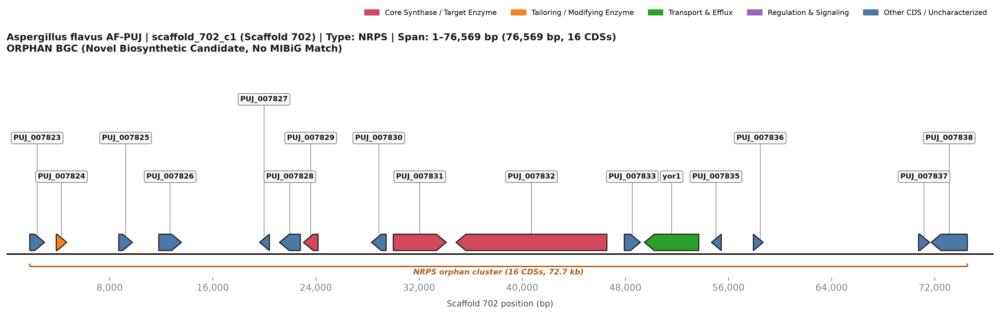](BGC_58_scaffold_702_c1_orphan_nrps.svg)

> *Figure 58: Publication-grade gene cluster diagram of `BGC_58_scaffold_702_c1_orphan_nrps` on Scaffold 702. Arrows indicate direction of transcription; boxes display standardized gene symbols or official locus tags. [Open scalable vector SVG](BGC_58_scaffold_702_c1_orphan_nrps.svg).*

#### Gene Inventory & Structural Qualifiers

| Locus Tag | Gene Symbol | Strand | Physical Span | Length | Putative Product & EC Number | Pfam / Domain Signatures |
| :--- | :---: | :---: | :---: | :---: | :--- | :--- |
| `PUJ_007823` | `PUJ_007823` | `+` | 1,801..2,954 | 333 aa | hypothetical protein | — |
| `PUJ_007824` | `PUJ_007824` | `+` | 3,857..4,672 | 271 aa | hypothetical protein | PF00106 (short chain dehydrogenase) |
| `PUJ_007825` | `PUJ_007825` | `+` | 8,707..9,768 | 353 aa | hypothetical protein | PF00775 (Dioxygenase) |
| `PUJ_007826` | `PUJ_007826` | `+` | 11,811..13,572 | 543 aa | hypothetical protein | PF00732 (GMC oxidoreductase), PF05199 (GMC oxidoreductase) |
| `PUJ_007827` | `PUJ_007827` | `-` | 19,629..20,321 | 230 aa | hypothetical protein | PF12796 (Ankyrin repeats (3 copies)) |
| `PUJ_007828` | `PUJ_007828` | `-` | 21,171..22,790 | 539 aa | hypothetical protein | PF00023 (Ankyrin repeat), PF12796 (Ankyrin repeats (3 copies)) |
| `PUJ_007829` | `PUJ_007829` | `-` | 23,031..24,167 | 344 aa | hypothetical protein | PF08240 (Alcohol dehydrogenase GroES-like domain) |
| `PUJ_007830` | `PUJ_007830` | `-` | 28,312..29,447 | 344 aa | hypothetical protein | PF03171 (2OG-Fe(II) oxygenase superfamily), PF14226 (non-haem dioxygenase in morphine synthesis N-terminal) |
| `PUJ_007831` | `PUJ_007831` | `+` | 30,001..34,111 | 1338 aa | hypothetical protein | PF00501 (AMP-binding enzyme), PF00550 (Phosphopantetheine attachment site), PF00668 (Condensation domain) |
| `PUJ_007832` | `PUJ_007832` | `-` | 34,869..46,569 | 3880 aa | hypothetical protein | PF07993 (Male sterility protein), PF00550 (Phosphopantetheine attachment site), PF00501 (AMP-binding enzyme) |
| `PUJ_007833` | `PUJ_007833` | `+` | 47,921..49,163 | 395 aa | hypothetical protein | PF14226 (non-haem dioxygenase in morphine synthesis N-terminal), PF03171 (2OG-Fe(II) oxygenase superfamily) |
| `PUJ_007834` | `yor1` | `-` | 49,482..53,699 | 1367 aa | ATP-binding cassette transporter yor1 | PF00005 (ABC transporter), PF00664 (ABC transporter transmembrane region), PF00005 (ABC transporter) |
| `PUJ_007835` | `PUJ_007835` | `-` | 54,683..55,378 | 231 aa | hypothetical protein | PF00583 (Acetyltransferase (GNAT) family) |
| `PUJ_007836` | `PUJ_007836` | `+` | 58,230..58,694 | 154 aa | hypothetical protein | — |
| `PUJ_007837` | `PUJ_007837` | `+` | 70,746..71,606 | 234 aa | hypothetical protein | PF12351 (Ca2+ regulator and membrane fusion protein Fig1) |
| `PUJ_007838` | `PUJ_007838` | `-` | 71,723..74,529 | 916 aa | hypothetical protein | PF01544 (CorA-like Mg2+ transporter protein) |

#### Putative Function & Enzymatic Mechanisms

- **`PUJ_007823`:** Hypothetical protein. Hypothetical or accessory protein implicated in cluster function or localized metabolic support.
- **`PUJ_007824`:** Hypothetical protein. Contains PF00106 (short chain dehydrogenase). Hypothetical or accessory protein implicated in cluster function or localized metabolic support.
- **`PUJ_007825`:** Hypothetical protein. Contains PF00775 (Dioxygenase). Hypothetical or accessory protein implicated in cluster function or localized metabolic support.
- **`PUJ_007826`:** Hypothetical protein. Contains PF00732 (GMC oxidoreductase), PF05199 (GMC oxidoreductase). Hypothetical or accessory protein implicated in cluster function or localized metabolic support.
- **`PUJ_007827`:** Hypothetical protein. Contains PF12796 (Ankyrin repeats (3 copies)). Hypothetical or accessory protein implicated in cluster function or localized metabolic support.
- **`PUJ_007828`:** Hypothetical protein. Contains PF00023 (Ankyrin repeat), PF12796 (Ankyrin repeats (3 copies)). Hypothetical or accessory protein implicated in cluster function or localized metabolic support.
- **`PUJ_007829`:** Hypothetical protein. Contains PF08240 (Alcohol dehydrogenase GroES-like domain). Hypothetical or accessory protein implicated in cluster function or localized metabolic support.
- **`PUJ_007830`:** Hypothetical protein. Contains PF03171 (2OG-Fe(II) oxygenase superfamily), PF14226 (non-haem dioxygenase in morphine synthesis N-terminal). Hypothetical or accessory protein implicated in cluster function or localized metabolic support.
- **`PUJ_007831`:** Hypothetical protein. Contains PF00501 (AMP-binding enzyme), PF00550 (Phosphopantetheine attachment site). Hypothetical or accessory protein implicated in cluster function or localized metabolic support.
- **`PUJ_007832`:** Hypothetical protein. Contains PF07993 (Male sterility protein), PF00550 (Phosphopantetheine attachment site). Hypothetical or accessory protein implicated in cluster function or localized metabolic support.
- **`PUJ_007833`:** Hypothetical protein. Contains PF14226 (non-haem dioxygenase in morphine synthesis N-terminal), PF03171 (2OG-Fe(II) oxygenase superfamily). Hypothetical or accessory protein implicated in cluster function or localized metabolic support.
- **`PUJ_007834` (`yor1`):** Atp-binding cassette transporter yor1. Contains PF00005 (ABC transporter), PF00664 (ABC transporter transmembrane region). Transmembrane transport protein mediating efflux of synthesized products or precursor import.
- **`PUJ_007835`:** Hypothetical protein. Contains PF00583 (Acetyltransferase (GNAT) family). Hypothetical or accessory protein implicated in cluster function or localized metabolic support.
- **`PUJ_007836`:** Hypothetical protein. Hypothetical or accessory protein implicated in cluster function or localized metabolic support.
- **`PUJ_007837`:** Hypothetical protein. Contains PF12351 (Ca2+ regulator and membrane fusion protein Fig1). Hypothetical or accessory protein implicated in cluster function or localized metabolic support.
- **`PUJ_007838`:** Hypothetical protein. Contains PF01544 (CorA-like Mg2+ transporter protein). Hypothetical or accessory protein implicated in cluster function or localized metabolic support.

### Collective Pathway Architecture & Biological Synergy

This cluster represents a novel **orphan NRPS secondary metabolite biosynthetic gene cluster (BGC)**. Comprising 16 predicted CDSs, the locus harbors a dedicated core synthase supported by localized tailoring enzymes and transporter permeases with zero significant matches in MIBiG 3.1. It represents an uncharacterized secondary metabolite pathway within the *Aspergillus flavus* genome with potential bioactive chemical products.

---

### 59. Novel Orphan NRPS Biosynthetic Gene Cluster (`Scaffold 702`)

- **Cluster Identifier:** `BGC_59_scaffold_702_c2_orphan_nrps` (`scaffold_702_c2`)  
- **Genomic Location:** Scaffold 702 | Span: 1–81,035 bp (81,035 bp, 15 CDSs)  
- **Pathway Class:** `NRPS` | **Confidence Tier:** `ORPHAN`  

[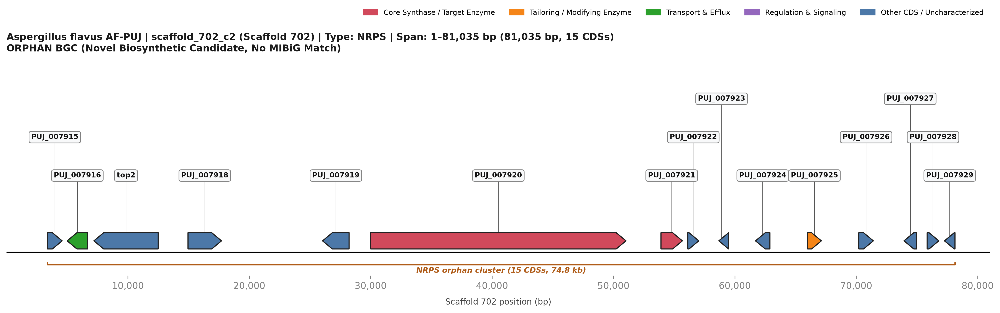](BGC_59_scaffold_702_c2_orphan_nrps.svg)

> *Figure 59: Publication-grade gene cluster diagram of `BGC_59_scaffold_702_c2_orphan_nrps` on Scaffold 702. Arrows indicate direction of transcription; boxes display standardized gene symbols or official locus tags. [Open scalable vector SVG](BGC_59_scaffold_702_c2_orphan_nrps.svg).*

#### Gene Inventory & Structural Qualifiers

| Locus Tag | Gene Symbol | Strand | Physical Span | Length | Putative Product & EC Number | Pfam / Domain Signatures |
| :--- | :---: | :---: | :---: | :---: | :--- | :--- |
| `PUJ_007915` | `PUJ_007915` | `+` | 3,377..4,585 | 342 aa | hypothetical protein | — |
| `PUJ_007916` | `PUJ_007916` | `-` | 4,996..6,682 | 484 aa | hypothetical protein | PF07690 (Major Facilitator Superfamily) |
| `PUJ_007917` | `top2` | `-` | 7,198..12,497 | 1723 aa | DNA topoisomerase 2 (`EC 5.6.2.2`) | PF00521 (DNA gyrase/topoisomerase IV, subunit A), PF16898 (C-terminal associated domain of TOPRIM), PF01751 (Toprim domain) |
| `PUJ_007918` | `PUJ_007918` | `+` | 14,952..17,712 | 864 aa | hypothetical protein | PF00566 (Rab-GTPase-TBC domain) |
| `PUJ_007919` | `PUJ_007919` | `-` | 26,036..28,223 | 606 aa | hypothetical protein (`EC 6.3.5.4`) | PF00733 (Asparagine synthase), PF13537 (Glutamine amidotransferase domain) |
| `PUJ_007920` | `PUJ_007920` | `+` | 30,001..51,035 | 6480 aa | hypothetical protein | PF00501 (AMP-binding enzyme), PF00550 (Phosphopantetheine attachment site), PF00668 (Condensation domain) |
| `PUJ_007921` | `PUJ_007921` | `+` | 53,917..55,680 | 387 aa | hypothetical protein (`EC 1.1.1.289`) | PF13561 (Enoyl-(Acyl carrier protein) reductase) |
| `PUJ_007922` | `PUJ_007922` | `+` | 56,124..57,033 | 266 aa | hypothetical protein | — |
| `PUJ_007923` | `PUJ_007923` | `-` | 58,681..59,135 | 134 aa | hypothetical protein | PF11338 (Protein of unknown function (DUF3140)) |
| `PUJ_007924` | `PUJ_007924` | `-` | 61,702..62,892 | 396 aa | hypothetical protein | — |
| `PUJ_007925` | `PUJ_007925` | `+` | 65,994..67,130 | 321 aa | hypothetical protein | PF00106 (short chain dehydrogenase) |
| `PUJ_007926` | `PUJ_007926` | `+` | 70,215..71,411 | 398 aa | hypothetical protein | PF08022 (FAD-binding domain), PF08030 (Ferric reductase NAD binding domain) |
| `PUJ_007927` | `PUJ_007927` | `-` | 73,936..74,973 | 345 aa | hypothetical protein (`EC 4.2.1.77`) | PF05544 (Proline racemase) |
| `PUJ_007928` | `PUJ_007928` | `+` | 75,842..76,807 | 301 aa | hypothetical protein | PF17784 (Sulfotransferase domain) |
| `PUJ_007929` | `PUJ_007929` | `-` | 77,271..78,137 | 261 aa | hypothetical protein | — |

#### Putative Function & Enzymatic Mechanisms

- **`PUJ_007915`:** Hypothetical protein. Hypothetical or accessory protein implicated in cluster function or localized metabolic support.
- **`PUJ_007916`:** Hypothetical protein. Contains PF07690 (Major Facilitator Superfamily). Hypothetical or accessory protein implicated in cluster function or localized metabolic support.
- **`PUJ_007917` (`top2`):** Dna topoisomerase 2 (EC 5.6.2.2). Contains PF00521 (DNA gyrase/topoisomerase IV, subunit A), PF16898 (C-terminal associated domain of TOPRIM). Hypothetical or accessory protein implicated in cluster function or localized metabolic support.
- **`PUJ_007918`:** Hypothetical protein. Contains PF00566 (Rab-GTPase-TBC domain). Hypothetical or accessory protein implicated in cluster function or localized metabolic support.
- **`PUJ_007919`:** Hypothetical protein (EC 6.3.5.4). Contains PF00733 (Asparagine synthase), PF13537 (Glutamine amidotransferase domain). Hypothetical or accessory protein implicated in cluster function or localized metabolic support.
- **`PUJ_007920`:** Hypothetical protein. Contains PF00501 (AMP-binding enzyme), PF00550 (Phosphopantetheine attachment site). Hypothetical or accessory protein implicated in cluster function or localized metabolic support.
- **`PUJ_007921`:** Hypothetical protein (EC 1.1.1.289). Contains PF13561 (Enoyl-(Acyl carrier protein) reductase). Hypothetical or accessory protein implicated in cluster function or localized metabolic support.
- **`PUJ_007922`:** Hypothetical protein. Hypothetical or accessory protein implicated in cluster function or localized metabolic support.
- **`PUJ_007923`:** Hypothetical protein. Contains PF11338 (Protein of unknown function (DUF3140)). Hypothetical or accessory protein implicated in cluster function or localized metabolic support.
- **`PUJ_007924`:** Hypothetical protein. Hypothetical or accessory protein implicated in cluster function or localized metabolic support.
- **`PUJ_007925`:** Hypothetical protein. Contains PF00106 (short chain dehydrogenase). Hypothetical or accessory protein implicated in cluster function or localized metabolic support.
- **`PUJ_007926`:** Hypothetical protein. Contains PF08022 (FAD-binding domain), PF08030 (Ferric reductase NAD binding domain). Hypothetical or accessory protein implicated in cluster function or localized metabolic support.
- **`PUJ_007927`:** Hypothetical protein (EC 4.2.1.77). Contains PF05544 (Proline racemase). Hypothetical or accessory protein implicated in cluster function or localized metabolic support.
- **`PUJ_007928`:** Hypothetical protein. Contains PF17784 (Sulfotransferase domain). Hypothetical or accessory protein implicated in cluster function or localized metabolic support.
- **`PUJ_007929`:** Hypothetical protein. Hypothetical or accessory protein implicated in cluster function or localized metabolic support.

### Collective Pathway Architecture & Biological Synergy

This cluster represents a novel **orphan NRPS secondary metabolite biosynthetic gene cluster (BGC)**. Comprising 15 predicted CDSs, the locus harbors a dedicated core synthase supported by localized tailoring enzymes and transporter permeases with zero significant matches in MIBiG 3.1. It represents an uncharacterized secondary metabolite pathway within the *Aspergillus flavus* genome with potential bioactive chemical products.

---

### 60. Dehydrocurvularin Biosynthetic Gene Cluster (`Scaffold 703`)

- **Cluster Identifier:** `BGC_60_scaffold_703_c1_dehydrocurvularin` (`scaffold_703_c1`)  
- **Genomic Location:** Scaffold 703 | Span: 1–86,011 bp (86,011 bp, 24 CDSs)  
- **Pathway Class:** `terpene` | **Confidence Tier:** `MEDIUM`  
- **antiSMASH KnownClusterBlast Top Hit:** `BGC0000045.3` — **dehydrocurvularin** (Cumulative Score: 1,043.0, Identity: 47–54%, 3 proteins)  

[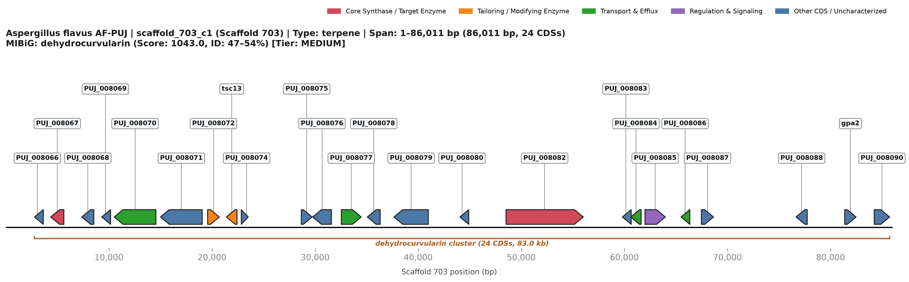](BGC_60_scaffold_703_c1_dehydrocurvularin.svg)

> *Figure 60: Publication-grade gene cluster diagram of `BGC_60_scaffold_703_c1_dehydrocurvularin` on Scaffold 703. Arrows indicate direction of transcription; boxes display standardized gene symbols or official locus tags. [Open scalable vector SVG](BGC_60_scaffold_703_c1_dehydrocurvularin.svg).*

#### Gene Inventory & Structural Qualifiers

| Locus Tag | Gene Symbol | Strand | Physical Span | Length | Putative Product & EC Number | Pfam / Domain Signatures |
| :--- | :---: | :---: | :---: | :---: | :--- | :--- |
| `PUJ_008066` | `PUJ_008066` | `-` | 2,778..3,329 | 165 aa | hypothetical protein | — |
| `PUJ_008067` | `PUJ_008067` | `-` | 4,357..5,623 | 349 aa | hypothetical protein | PF00107 (Zinc-binding dehydrogenase), PF08240 (Alcohol dehydrogenase GroES-like domain) |
| `PUJ_008068` | `PUJ_008068` | `-` | 7,367..8,530 | 348 aa | hypothetical protein | — |
| `PUJ_008069` | `PUJ_008069` | `-` | 9,303..9,993 | 188 aa | hypothetical protein | — |
| `PUJ_008070` | `PUJ_008070` | `-` | 10,511..14,554 | 1258 aa | hypothetical protein (`EC 7.6.2.2`) | PF00005 (ABC transporter), PF00664 (ABC transporter transmembrane region), PF00005 (ABC transporter) |
| `PUJ_008071` | `PUJ_008071` | `-` | 15,001..19,046 | 1228 aa | hypothetical protein | PF13243 (Squalene-hopene cyclase C-terminal domain), PF13249 (Squalene-hopene cyclase N-terminal domain) |
| `PUJ_008072` | `PUJ_008072` | `+` | 19,574..20,704 | 376 aa | hypothetical protein | PF00067 (Cytochrome P450) |
| `PUJ_008073` | `tsc13` | `-` | 21,389..22,421 | 319 aa | Very-long-chain enoyl-CoA reductase (`EC 1.3.1.93`) | PF02544 (3-oxo-5-alpha-steroid 4-dehydrogenase) |
| `PUJ_008074` | `PUJ_008074` | `+` | 23,191..23,514 | 89 aa | hypothetical protein | — |
| `PUJ_008075` | `PUJ_008075` | `+` | 28,664..29,707 | 347 aa | hypothetical protein (`EC 2.7.1.15`) | PF00294 (pfkB family carbohydrate kinase) |
| `PUJ_008076` | `PUJ_008076` | `-` | 29,765..31,575 | 413 aa | hypothetical protein | — |
| `PUJ_008077` | `PUJ_008077` | `+` | 32,545..34,471 | 562 aa | hypothetical protein | PF00083 (Sugar (and other) transporter) |
| `PUJ_008078` | `PUJ_008078` | `-` | 35,065..36,311 | 399 aa | hypothetical protein | PF11951 (Fungal specific transcription factor domain) |
| `PUJ_008079` | `PUJ_008079` | `-` | 37,651..40,979 | 992 aa | hypothetical protein | PF00689 (Cation transporting ATPase, C-terminus), PF13246 (Cation transport ATPase (P-type)), PF00122 (E1-E2 ATPase) |
| `PUJ_008080` | `PUJ_008080` | `-` | 44,050..44,458 | 115 aa | hypothetical protein | — |
| `PUJ_008082` | `PUJ_008082` | `+` | 48,521..56,011 | 2068 aa | hypothetical protein | PF02801 (Beta-ketoacyl synthase, C-terminal domain), PF00698 (Acyl transferase domain), PF14765 (Polyketide synthase dehydratase) |
| `PUJ_008083` | `PUJ_008083` | `-` | 59,807..60,486 | 209 aa | hypothetical protein | — |
| `PUJ_008084` | `PUJ_008084` | `-` | 60,618..61,623 | 317 aa | hypothetical protein | PF07690 (Major Facilitator Superfamily) |
| `PUJ_008085` | `PUJ_008085` | `+` | 62,002..63,971 | 657 aa | hypothetical protein | PF00172 (Fungal Zn(2)-Cys(6) binuclear cluster domain) |
| `PUJ_008086` | `PUJ_008086` | `-` | 65,494..66,286 | 177 aa | hypothetical protein | PF00083 (Sugar (and other) transporter) |
| `PUJ_008087` | `PUJ_008087` | `+` | 67,477..68,645 | 370 aa | hypothetical protein (`EC 4.2.1.95`) | PF07143 (CrtC N-terminal lipocalin domain), PF17186 (Lipocalin-like domain) |
| `PUJ_008088` | `PUJ_008088` | `-` | 76,660..77,736 | 358 aa | hypothetical protein | PF01979 (Amidohydrolase family) |
| `PUJ_008089` | `gpa2` | `+` | 81,373..82,475 | 294 aa | Guanine nucleotide-binding protein alpha-2 subunit | — |
| `PUJ_008090` | `PUJ_008090` | `+` | 84,240..85,729 | 344 aa | hypothetical protein | — |

#### Putative Function & Enzymatic Mechanisms

- **`PUJ_008066`:** Hypothetical protein. Hypothetical or accessory protein implicated in cluster function or localized metabolic support.
- **`PUJ_008067`:** Hypothetical protein. Contains PF00107 (Zinc-binding dehydrogenase), PF08240 (Alcohol dehydrogenase GroES-like domain). Hypothetical or accessory protein implicated in cluster function or localized metabolic support.
- **`PUJ_008068`:** Hypothetical protein. Hypothetical or accessory protein implicated in cluster function or localized metabolic support.
- **`PUJ_008069`:** Hypothetical protein. Hypothetical or accessory protein implicated in cluster function or localized metabolic support.
- **`PUJ_008070`:** Hypothetical protein (EC 7.6.2.2). Contains PF00005 (ABC transporter), PF00664 (ABC transporter transmembrane region). Hypothetical or accessory protein implicated in cluster function or localized metabolic support.
- **`PUJ_008071`:** Hypothetical protein. Contains PF13243 (Squalene-hopene cyclase C-terminal domain), PF13249 (Squalene-hopene cyclase N-terminal domain). Hypothetical or accessory protein implicated in cluster function or localized metabolic support.
- **`PUJ_008072`:** Hypothetical protein. Contains PF00067 (Cytochrome P450). Hypothetical or accessory protein implicated in cluster function or localized metabolic support.
- **`PUJ_008073` (`tsc13`):** Very-long-chain enoyl-coa reductase (EC 1.3.1.93). Contains PF02544 (3-oxo-5-alpha-steroid 4-dehydrogenase). Oxidoreductase tailoring enzyme driving intermediate redox transformation.
- **`PUJ_008074`:** Hypothetical protein. Hypothetical or accessory protein implicated in cluster function or localized metabolic support.
- **`PUJ_008075`:** Hypothetical protein (EC 2.7.1.15). Contains PF00294 (pfkB family carbohydrate kinase). Hypothetical or accessory protein implicated in cluster function or localized metabolic support.
- **`PUJ_008076`:** Hypothetical protein. Hypothetical or accessory protein implicated in cluster function or localized metabolic support.
- **`PUJ_008077`:** Hypothetical protein. Contains PF00083 (Sugar (and other) transporter). Hypothetical or accessory protein implicated in cluster function or localized metabolic support.
- **`PUJ_008078`:** Hypothetical protein. Contains PF11951 (Fungal specific transcription factor domain). Hypothetical or accessory protein implicated in cluster function or localized metabolic support.
- **`PUJ_008079`:** Hypothetical protein. Contains PF00689 (Cation transporting ATPase, C-terminus), PF13246 (Cation transport ATPase (P-type)). Hypothetical or accessory protein implicated in cluster function or localized metabolic support.
- **`PUJ_008080`:** Hypothetical protein. Hypothetical or accessory protein implicated in cluster function or localized metabolic support.
- **`PUJ_008082`:** Hypothetical protein. Contains PF02801 (Beta-ketoacyl synthase, C-terminal domain), PF00698 (Acyl transferase domain). Hypothetical or accessory protein implicated in cluster function or localized metabolic support.
- **`PUJ_008083`:** Hypothetical protein. Hypothetical or accessory protein implicated in cluster function or localized metabolic support.
- **`PUJ_008084`:** Hypothetical protein. Contains PF07690 (Major Facilitator Superfamily). Hypothetical or accessory protein implicated in cluster function or localized metabolic support.
- **`PUJ_008085`:** Hypothetical protein. Contains PF00172 (Fungal Zn(2)-Cys(6) binuclear cluster domain). Hypothetical or accessory protein implicated in cluster function or localized metabolic support.
- **`PUJ_008086`:** Hypothetical protein. Contains PF00083 (Sugar (and other) transporter). Hypothetical or accessory protein implicated in cluster function or localized metabolic support.
- **`PUJ_008087`:** Hypothetical protein (EC 4.2.1.95). Contains PF07143 (CrtC N-terminal lipocalin domain), PF17186 (Lipocalin-like domain). Hypothetical or accessory protein implicated in cluster function or localized metabolic support.
- **`PUJ_008088`:** Hypothetical protein. Contains PF01979 (Amidohydrolase family). Hypothetical or accessory protein implicated in cluster function or localized metabolic support.
- **`PUJ_008089` (`gpa2`):** Guanine nucleotide-binding protein alpha-2 subunit. Hypothetical or accessory protein implicated in cluster function or localized metabolic support.
- **`PUJ_008090`:** Hypothetical protein. Hypothetical or accessory protein implicated in cluster function or localized metabolic support.

### Collective Pathway Architecture & Biological Synergy

This cluster exhibits significant homology to the characterized MIBiG reference for **dehydrocurvularin** (MIBiG accession `BGC0000045.3`, score 1,043.0, identities 47–54%). The cluster features 24 coordinated CDSs encoding core synthases, tailoring oxidoreductases/transferases, and transmembrane efflux transporters that function collectively to synthesize, modify, and excrete bioactive terpene compounds.

---

### 61. Novel Orphan NITROPROPANOIC_ACID Biosynthetic Gene Cluster (`Scaffold 703`)

- **Cluster Identifier:** `BGC_61_scaffold_703_c2_orphan_nitropropanoic_acid` (`scaffold_703_c2`)  
- **Genomic Location:** Scaffold 703 | Span: 1–17,956 bp (17,956 bp, 4 CDSs)  
- **Pathway Class:** `nitropropanoic_acid` | **Confidence Tier:** `ORPHAN`  

[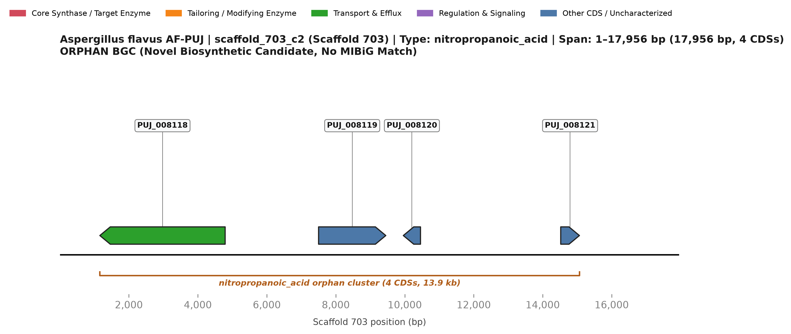](BGC_61_scaffold_703_c2_orphan_nitropropanoic_acid.svg)

> *Figure 61: Publication-grade gene cluster diagram of `BGC_61_scaffold_703_c2_orphan_nitropropanoic_acid` on Scaffold 703. Arrows indicate direction of transcription; boxes display standardized gene symbols or official locus tags. [Open scalable vector SVG](BGC_61_scaffold_703_c2_orphan_nitropropanoic_acid.svg).*

#### Gene Inventory & Structural Qualifiers

| Locus Tag | Gene Symbol | Strand | Physical Span | Length | Putative Product & EC Number | Pfam / Domain Signatures |
| :--- | :---: | :---: | :---: | :---: | :--- | :--- |
| `PUJ_008118` | `PUJ_008118` | `-` | 1,159..4,792 | 956 aa | hypothetical protein | PF07690 (Major Facilitator Superfamily) |
| `PUJ_008119` | `PUJ_008119` | `+` | 7,501..9,450 | 649 aa | hypothetical protein | PF13454 (FAD-NAD(P)-binding) |
| `PUJ_008120` | `PUJ_008120` | `-` | 9,958..10,456 | 146 aa | hypothetical protein (`EC 4.1.1.44`) | PF02627 (Carboxymuconolactone decarboxylase family) |
| `PUJ_008121` | `PUJ_008121` | `+` | 14,522..15,064 | 161 aa | hypothetical protein | PF12796 (Ankyrin repeats (3 copies)) |

#### Putative Function & Enzymatic Mechanisms

- **`PUJ_008118`:** Hypothetical protein. Contains PF07690 (Major Facilitator Superfamily). Hypothetical or accessory protein implicated in cluster function or localized metabolic support.
- **`PUJ_008119`:** Hypothetical protein. Contains PF13454 (FAD-NAD(P)-binding). Hypothetical or accessory protein implicated in cluster function or localized metabolic support.
- **`PUJ_008120`:** Hypothetical protein (EC 4.1.1.44). Contains PF02627 (Carboxymuconolactone decarboxylase family). Hypothetical or accessory protein implicated in cluster function or localized metabolic support.
- **`PUJ_008121`:** Hypothetical protein. Contains PF12796 (Ankyrin repeats (3 copies)). Hypothetical or accessory protein implicated in cluster function or localized metabolic support.

### Collective Pathway Architecture & Biological Synergy

This cluster represents a novel **orphan nitropropanoic_acid secondary metabolite biosynthetic gene cluster (BGC)**. Comprising 4 predicted CDSs, the locus harbors a dedicated core synthase supported by localized tailoring enzymes and transporter permeases with zero significant matches in MIBiG 3.1. It represents an uncharacterized secondary metabolite pathway within the *Aspergillus flavus* genome with potential bioactive chemical products.

---

### 62. Novel Orphan TERPENE Biosynthetic Gene Cluster (`Scaffold 815`)

- **Cluster Identifier:** `BGC_62_scaffold_815_c1_orphan_terpene` (`scaffold_815_c1`)  
- **Genomic Location:** Scaffold 815 | Span: 1–81,698 bp (81,698 bp, 24 CDSs)  
- **Pathway Class:** `terpene` | **Confidence Tier:** `ORPHAN`  

[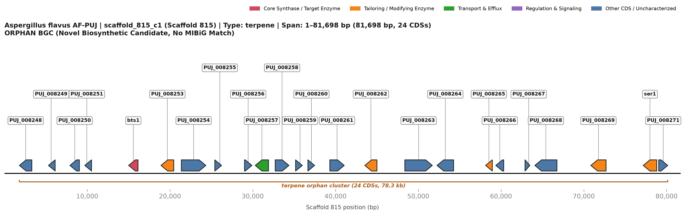](BGC_62_scaffold_815_c1_orphan_terpene.svg)

> *Figure 62: Publication-grade gene cluster diagram of `BGC_62_scaffold_815_c1_orphan_terpene` on Scaffold 815. Arrows indicate direction of transcription; boxes display standardized gene symbols or official locus tags. [Open scalable vector SVG](BGC_62_scaffold_815_c1_orphan_terpene.svg).*

#### Gene Inventory & Structural Qualifiers

| Locus Tag | Gene Symbol | Strand | Physical Span | Length | Putative Product & EC Number | Pfam / Domain Signatures |
| :--- | :---: | :---: | :---: | :---: | :--- | :--- |
| `PUJ_008248` | `PUJ_008248` | `-` | 1,804..3,307 | 466 aa | hypothetical protein | PF09994 (Uncharacterized alpha/beta hydrolase domain (DUF2235)) |
| `PUJ_008249` | `PUJ_008249` | `-` | 5,313..5,966 | 126 aa | hypothetical protein | PF04828 (Glutathione-dependent formaldehyde-activating enzyme) |
| `PUJ_008250` | `PUJ_008250` | `-` | 7,908..9,052 | 362 aa | hypothetical protein | — |
| `PUJ_008251` | `PUJ_008251` | `-` | 9,709..10,197 | 162 aa | hypothetical protein | PF14437 (MafB19-like deaminase) |
| `PUJ_008252` | `bts1` | `-` | 15,001..16,136 | 320 aa | geranylgeranyl pyrophosphate synthetase | PF00348 (Polyprenyl synthetase) |
| `PUJ_008253` | `PUJ_008253` | `-` | 18,913..20,455 | 440 aa | hypothetical protein | PF00067 (Cytochrome P450) |
| `PUJ_008254` | `PUJ_008254` | `+` | 21,371..24,332 | 933 aa | hypothetical protein | — |
| `PUJ_008255` | `PUJ_008255` | `+` | 25,805..26,226 | 127 aa | hypothetical protein | — |
| `PUJ_008256` | `PUJ_008256` | `+` | 29,004..29,901 | 270 aa | hypothetical protein (`EC 3.5.2.2`) | — |
| `PUJ_008257` | `PUJ_008257` | `-` | 30,304..31,903 | 332 aa | hypothetical protein | PF00083 (Sugar (and other) transporter) |
| `PUJ_008258` | `PUJ_008258` | `+` | 32,712..34,373 | 521 aa | hypothetical protein | PF02449 (Beta-galactosidase), PF18120 (Domain of unknown function (DUF5597)) |
| `PUJ_008259` | `PUJ_008259` | `+` | 35,435..35,986 | 183 aa | hypothetical protein | PF00583 (Acetyltransferase (GNAT) family) |
| `PUJ_008260` | `PUJ_008260` | `+` | 36,702..37,474 | 225 aa | hypothetical protein | — |
| `PUJ_008261` | `PUJ_008261` | `+` | 39,312..41,055 | 516 aa | hypothetical protein | PF00135 (Carboxylesterase family) |
| `PUJ_008262` | `PUJ_008262` | `-` | 43,544..45,005 | 402 aa | hypothetical protein | PF00891 (O-methyltransferase domain) |
| `PUJ_008263` | `PUJ_008263` | `+` | 48,372..51,698 | 1055 aa | hypothetical protein | PF00501 (AMP-binding enzyme), PF00550 (Phosphopantetheine attachment site), PF07993 (Male sterility protein) |
| `PUJ_008264` | `PUJ_008264` | `-` | 52,264..54,267 | 667 aa | hypothetical protein | PF00722 (Glycosyl hydrolases family 16) |
| `PUJ_008265` | `PUJ_008265` | `-` | 58,134..58,919 | 261 aa | hypothetical protein | PF00106 (short chain dehydrogenase) |
| `PUJ_008266` | `PUJ_008266` | `-` | 59,366..60,324 | 201 aa | hypothetical protein | — |
| `PUJ_008267` | `PUJ_008267` | `+` | 63,202..63,486 | 94 aa | hypothetical protein | — |
| `PUJ_008268` | `PUJ_008268` | `-` | 64,084..66,754 | 676 aa | hypothetical protein | PF03169 (OPT oligopeptide transporter protein), PF03169 (OPT oligopeptide transporter protein) |
| `PUJ_008269` | `PUJ_008269` | `-` | 70,850..72,691 | 465 aa | hypothetical protein | PF01370 (NAD dependent epimerase/dehydratase family) |
| `PUJ_008270` | `ser1` | `-` | 77,178..78,812 | 420 aa | Phosphoserine transaminase (`EC 2.6.1.52`) | PF00266 (Aminotransferase class-V), PF00266 (Aminotransferase class-V) |
| `PUJ_008271` | `PUJ_008271` | `+` | 79,051..80,141 | 312 aa | hypothetical protein | PF05368 (NmrA-like family) |

#### Putative Function & Enzymatic Mechanisms

- **`PUJ_008248`:** Hypothetical protein. Contains PF09994 (Uncharacterized alpha/beta hydrolase domain (DUF2235)). Hypothetical or accessory protein implicated in cluster function or localized metabolic support.
- **`PUJ_008249`:** Hypothetical protein. Contains PF04828 (Glutathione-dependent formaldehyde-activating enzyme). Hypothetical or accessory protein implicated in cluster function or localized metabolic support.
- **`PUJ_008250`:** Hypothetical protein. Hypothetical or accessory protein implicated in cluster function or localized metabolic support.
- **`PUJ_008251`:** Hypothetical protein. Contains PF14437 (MafB19-like deaminase). Hypothetical or accessory protein implicated in cluster function or localized metabolic support.
- **`PUJ_008252` (`bts1`):** Geranylgeranyl pyrophosphate synthetase. Contains PF00348 (Polyprenyl synthetase). Catalyzes core biosynthetic condensation or macrocyclization reactions in the pathway.
- **`PUJ_008253`:** Hypothetical protein. Contains PF00067 (Cytochrome P450). Hypothetical or accessory protein implicated in cluster function or localized metabolic support.
- **`PUJ_008254`:** Hypothetical protein. Hypothetical or accessory protein implicated in cluster function or localized metabolic support.
- **`PUJ_008255`:** Hypothetical protein. Hypothetical or accessory protein implicated in cluster function or localized metabolic support.
- **`PUJ_008256`:** Hypothetical protein (EC 3.5.2.2). Hypothetical or accessory protein implicated in cluster function or localized metabolic support.
- **`PUJ_008257`:** Hypothetical protein. Contains PF00083 (Sugar (and other) transporter). Hypothetical or accessory protein implicated in cluster function or localized metabolic support.
- **`PUJ_008258`:** Hypothetical protein. Contains PF02449 (Beta-galactosidase), PF18120 (Domain of unknown function (DUF5597)). Hypothetical or accessory protein implicated in cluster function or localized metabolic support.
- **`PUJ_008259`:** Hypothetical protein. Contains PF00583 (Acetyltransferase (GNAT) family). Hypothetical or accessory protein implicated in cluster function or localized metabolic support.
- **`PUJ_008260`:** Hypothetical protein. Hypothetical or accessory protein implicated in cluster function or localized metabolic support.
- **`PUJ_008261`:** Hypothetical protein. Contains PF00135 (Carboxylesterase family). Hypothetical or accessory protein implicated in cluster function or localized metabolic support.
- **`PUJ_008262`:** Hypothetical protein. Contains PF00891 (O-methyltransferase domain). Hypothetical or accessory protein implicated in cluster function or localized metabolic support.
- **`PUJ_008263`:** Hypothetical protein. Contains PF00501 (AMP-binding enzyme), PF00550 (Phosphopantetheine attachment site). Hypothetical or accessory protein implicated in cluster function or localized metabolic support.
- **`PUJ_008264`:** Hypothetical protein. Contains PF00722 (Glycosyl hydrolases family 16). Hypothetical or accessory protein implicated in cluster function or localized metabolic support.
- **`PUJ_008265`:** Hypothetical protein. Contains PF00106 (short chain dehydrogenase). Hypothetical or accessory protein implicated in cluster function or localized metabolic support.
- **`PUJ_008266`:** Hypothetical protein. Hypothetical or accessory protein implicated in cluster function or localized metabolic support.
- **`PUJ_008267`:** Hypothetical protein. Hypothetical or accessory protein implicated in cluster function or localized metabolic support.
- **`PUJ_008268`:** Hypothetical protein. Contains PF03169 (OPT oligopeptide transporter protein), PF03169 (OPT oligopeptide transporter protein). Hypothetical or accessory protein implicated in cluster function or localized metabolic support.
- **`PUJ_008269`:** Hypothetical protein. Contains PF01370 (NAD dependent epimerase/dehydratase family). Hypothetical or accessory protein implicated in cluster function or localized metabolic support.
- **`PUJ_008270` (`ser1`):** Phosphoserine transaminase (EC 2.6.1.52). Contains PF00266 (Aminotransferase class-V), PF00266 (Aminotransferase class-V). Hypothetical or accessory protein implicated in cluster function or localized metabolic support.
- **`PUJ_008271`:** Hypothetical protein. Contains PF05368 (NmrA-like family). Hypothetical or accessory protein implicated in cluster function or localized metabolic support.

### Collective Pathway Architecture & Biological Synergy

This cluster represents a novel **orphan terpene secondary metabolite biosynthetic gene cluster (BGC)**. Comprising 24 predicted CDSs, the locus harbors a dedicated core synthase supported by localized tailoring enzymes and transporter permeases with zero significant matches in MIBiG 3.1. It represents an uncharacterized secondary metabolite pathway within the *Aspergillus flavus* genome with potential bioactive chemical products.

---

### 63. (-)-Ditryptophenaline Biosynthetic Gene Cluster (`Scaffold 826`)

- **Cluster Identifier:** `BGC_63_scaffold_826_c1___ditryptophenaline` (`scaffold_826_c1`)  
- **Genomic Location:** Scaffold 826 | Span: 1–67,961 bp (67,961 bp, 14 CDSs)  
- **Pathway Class:** `NRPS` | **Confidence Tier:** `MEDIUM`  
- **antiSMASH KnownClusterBlast Top Hit:** `BGC0002157.2` — **(-)-ditryptophenaline** (Cumulative Score: 6,216.0, Identity: 91–99%, 3 proteins)  

[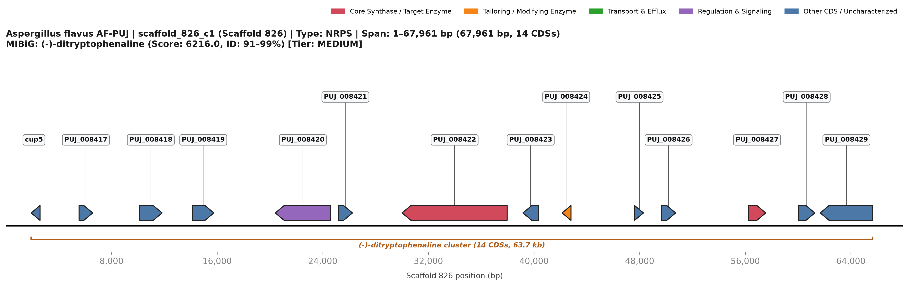](BGC_63_scaffold_826_c1___ditryptophenaline.svg)

> *Figure 63: Publication-grade gene cluster diagram of `BGC_63_scaffold_826_c1___ditryptophenaline` on Scaffold 826. Arrows indicate direction of transcription; boxes display standardized gene symbols or official locus tags. [Open scalable vector SVG](BGC_63_scaffold_826_c1___ditryptophenaline.svg).*

#### Gene Inventory & Structural Qualifiers

| Locus Tag | Gene Symbol | Strand | Physical Span | Length | Putative Product & EC Number | Pfam / Domain Signatures |
| :--- | :---: | :---: | :---: | :---: | :--- | :--- |
| `PUJ_008416` | `cup5` | `-` | 1,908..2,341 | 117 aa | vacuolar ATPase V0 domain subunit c | PF00137 (ATP synthase subunit C) |
| `PUJ_008417` | `PUJ_008417` | `+` | 5,537..6,576 | 271 aa | hypothetical protein | PF13489 (Methyltransferase domain) |
| `PUJ_008418` | `PUJ_008418` | `+` | 10,118..11,830 | 570 aa | hypothetical protein | PF01565 (FAD binding domain), PF08031 (Berberine and berberine like) |
| `PUJ_008419` | `PUJ_008419` | `+` | 14,142..15,753 | 408 aa | hypothetical protein | PF11951 (Fungal specific transcription factor domain) |
| `PUJ_008420` | `PUJ_008420` | `-` | 20,399..24,582 | 1239 aa | hypothetical protein | PF00069 (Protein kinase domain), PF12796 (Ankyrin repeats (3 copies)), PF13401 (AAA domain) |
| `PUJ_008421` | `PUJ_008421` | `+` | 25,177..26,252 | 158 aa | hypothetical protein | PF20233 (Family of unknown function (DUF6590)) |
| `PUJ_008422` | `PUJ_008422` | `-` | 30,001..37,961 | 2621 aa | hypothetical protein | PF00668 (Condensation domain), PF00550 (Phosphopantetheine attachment site), PF00501 (AMP-binding enzyme) |
| `PUJ_008423` | `PUJ_008423` | `-` | 39,158..40,329 | 348 aa | hypothetical protein | PF10017 (Histidine-specific methyltransferase, SAM-dependent) |
| `PUJ_008424` | `PUJ_008424` | `-` | 42,124..42,752 | 172 aa | hypothetical protein | PF00067 (Cytochrome P450) |
| `PUJ_008425` | `PUJ_008425` | `+` | 47,692..48,291 | 128 aa | hypothetical protein | — |
| `PUJ_008426` | `PUJ_008426` | `+` | 49,644..50,729 | 287 aa | hypothetical protein | — |
| `PUJ_008427` | `PUJ_008427` | `+` | 56,228..57,553 | 367 aa | hypothetical protein | PF08659 (KR domain), PF08659 (KR domain), PF00550 (Phosphopantetheine attachment site) |
| `PUJ_008428` | `PUJ_008428` | `+` | 60,022..61,272 | 416 aa | hypothetical protein | PF00023 (Ankyrin repeat), PF12796 (Ankyrin repeats (3 copies)), PF12796 (Ankyrin repeats (3 copies)) |
| `PUJ_008429` | `PUJ_008429` | `-` | 61,672..65,653 | 1036 aa | hypothetical protein (`EC 1.6.1.2`) | PF02233 (NAD(P) transhydrogenase beta subunit), PF12769 (4TM region of pyridine nucleotide transhydrogenase, mitoch), PF01262 (Alanine dehydrogenase/PNT, C-terminal domain) |

#### Putative Function & Enzymatic Mechanisms

- **`PUJ_008416` (`cup5`):** Vacuolar atpase v0 domain subunit c. Contains PF00137 (ATP synthase subunit C). Hypothetical or accessory protein implicated in cluster function or localized metabolic support.
- **`PUJ_008417`:** Hypothetical protein. Contains PF13489 (Methyltransferase domain). Hypothetical or accessory protein implicated in cluster function or localized metabolic support.
- **`PUJ_008418`:** Hypothetical protein. Contains PF01565 (FAD binding domain), PF08031 (Berberine and berberine like). Hypothetical or accessory protein implicated in cluster function or localized metabolic support.
- **`PUJ_008419`:** Hypothetical protein. Contains PF11951 (Fungal specific transcription factor domain). Hypothetical or accessory protein implicated in cluster function or localized metabolic support.
- **`PUJ_008420`:** Hypothetical protein. Contains PF00069 (Protein kinase domain), PF12796 (Ankyrin repeats (3 copies)). Hypothetical or accessory protein implicated in cluster function or localized metabolic support.
- **`PUJ_008421`:** Hypothetical protein. Contains PF20233 (Family of unknown function (DUF6590)). Hypothetical or accessory protein implicated in cluster function or localized metabolic support.
- **`PUJ_008422`:** Hypothetical protein. Contains PF00668 (Condensation domain), PF00550 (Phosphopantetheine attachment site). Hypothetical or accessory protein implicated in cluster function or localized metabolic support.
- **`PUJ_008423`:** Hypothetical protein. Contains PF10017 (Histidine-specific methyltransferase, SAM-dependent). Hypothetical or accessory protein implicated in cluster function or localized metabolic support.
- **`PUJ_008424`:** Hypothetical protein. Contains PF00067 (Cytochrome P450). Hypothetical or accessory protein implicated in cluster function or localized metabolic support.
- **`PUJ_008425`:** Hypothetical protein. Hypothetical or accessory protein implicated in cluster function or localized metabolic support.
- **`PUJ_008426`:** Hypothetical protein. Hypothetical or accessory protein implicated in cluster function or localized metabolic support.
- **`PUJ_008427`:** Hypothetical protein. Contains PF08659 (KR domain), PF08659 (KR domain). Hypothetical or accessory protein implicated in cluster function or localized metabolic support.
- **`PUJ_008428`:** Hypothetical protein. Contains PF00023 (Ankyrin repeat), PF12796 (Ankyrin repeats (3 copies)). Hypothetical or accessory protein implicated in cluster function or localized metabolic support.
- **`PUJ_008429`:** Hypothetical protein (EC 1.6.1.2). Contains PF02233 (NAD(P) transhydrogenase beta subunit), PF12769 (4TM region of pyridine nucleotide transhydrogenase, mitoch). Hypothetical or accessory protein implicated in cluster function or localized metabolic support.

### Collective Pathway Architecture & Biological Synergy

This cluster exhibits significant homology to the characterized MIBiG reference for **(-)-ditryptophenaline** (MIBiG accession `BGC0002157.2`, score 6,216.0, identities 91–99%). The cluster features 14 coordinated CDSs encoding core synthases, tailoring oxidoreductases/transferases, and transmembrane efflux transporters that function collectively to synthesize, modify, and excrete bioactive NRPS compounds.

---

### 64. Ywa1 Biosynthetic Gene Cluster (`Scaffold 826`)

- **Cluster Identifier:** `BGC_64_scaffold_826_c2_ywa1` (`scaffold_826_c2`)  
- **Genomic Location:** Scaffold 826 | Span: 1–66,651 bp (66,651 bp, 17 CDSs)  
- **Pathway Class:** `T1PKS` | **Confidence Tier:** `MEDIUM`  
- **antiSMASH KnownClusterBlast Top Hit:** `BGC0002175.3` — **YWA1** (Cumulative Score: 4,277.0, Identity: 100–100%, 1 proteins)  

[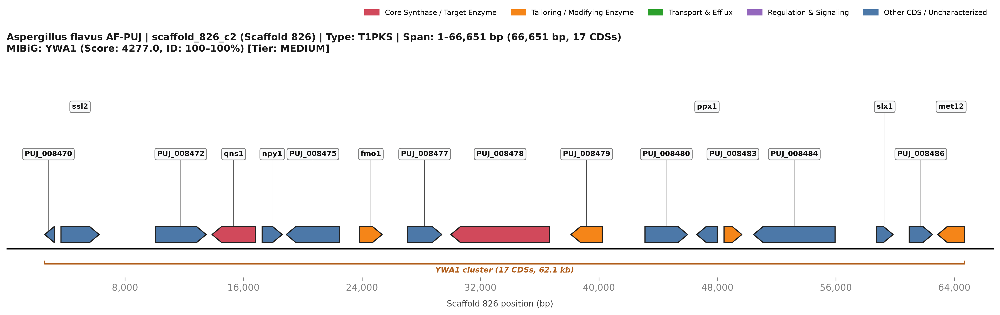](BGC_64_scaffold_826_c2_ywa1.svg)

> *Figure 64: Publication-grade gene cluster diagram of `BGC_64_scaffold_826_c2_ywa1` on Scaffold 826. Arrows indicate direction of transcription; boxes display standardized gene symbols or official locus tags. [Open scalable vector SVG](BGC_64_scaffold_826_c2_ywa1.svg).*

#### Gene Inventory & Structural Qualifiers

| Locus Tag | Gene Symbol | Strand | Physical Span | Length | Putative Product & EC Number | Pfam / Domain Signatures |
| :--- | :---: | :---: | :---: | :---: | :--- | :--- |
| `PUJ_008470` | `PUJ_008470` | `-` | 2,578..3,075 | 120 aa | hypothetical protein | PF15932 (Domain of unknown function (DUF4748)) |
| `PUJ_008471` | `ssl2` | `+` | 3,677..6,257 | 824 aa | DNA repair helicase RAD25 (`EC 3.6.4.12`) | PF13625 (Helicase conserved C-terminal domain), PF04851 (Type III restriction enzyme, res subunit), PF16203 (ERCC3/RAD25/XPB C-terminal helicase) |
| `PUJ_008472` | `PUJ_008472` | `+` | 10,053..13,481 | 948 aa | hypothetical protein | PF14027 (Questin oxidase-like) |
| `PUJ_008473` | `qns1` | `-` | 13,876..16,797 | 699 aa | glutamine-dependent NAD(+) synthetase (`EC 6.3.5.1`) | PF02540 (NAD synthase), PF00795 (Carbon-nitrogen hydrolase) |
| `PUJ_008474` | `npy1` | `+` | 17,261..18,615 | 426 aa | NADH pyrophosphatase (`EC 3.6.1.22`) | PF09296 (NADH pyrophosphatase-like rudimentary NUDIX domain), PF09297 (NADH pyrophosphatase zinc ribbon domain), PF00293 (NUDIX domain) |
| `PUJ_008475` | `PUJ_008475` | `-` | 18,888..22,490 | 1200 aa | hypothetical protein | PF02765 (Telomeric single stranded DNA binding POT1/CDC13) |
| `PUJ_008476` | `fmo1` | `+` | 23,835..25,362 | 488 aa | monooxygenase | PF13450 (NAD(P)-binding Rossmann-like domain), PF00743 (Flavin-binding monooxygenase-like), PF00743 (Flavin-binding monooxygenase-like) |
| `PUJ_008477` | `PUJ_008477` | `+` | 27,074..29,392 | 760 aa | hypothetical protein | PF11496 (Class II histone deacetylase complex subunits 2 and 3) |
| `PUJ_008478` | `PUJ_008478` | `-` | 30,001..36,651 | 2141 aa | hypothetical protein | PF00975 (Thioesterase domain), PF00550 (Phosphopantetheine attachment site), PF00550 (Phosphopantetheine attachment site) |
| `PUJ_008479` | `PUJ_008479` | `-` | 38,112..40,226 | 469 aa | hypothetical protein | PF07731 (Multicopper oxidase), PF00394 (Multicopper oxidase) |
| `PUJ_008480` | `PUJ_008480` | `+` | 43,111..45,990 | 959 aa | hypothetical protein | PF01841 (Transglutaminase-like superfamily) |
| `PUJ_008481` | `ppx1` | `-` | 46,601..47,989 | 462 aa | Exopolyphosphatase (`EC 3.6.1.11`) | PF02833 (DHHA2 domain), PF01368 (DHH family) |
| `PUJ_008483` | `PUJ_008483` | `+` | 48,447..49,652 | 401 aa | hypothetical protein (`EC 3.5.99.7`) | PF00291 (Pyridoxal-phosphate dependent enzyme) |
| `PUJ_008484` | `PUJ_008484` | `-` | 50,440..55,944 | 1727 aa | hypothetical protein | PF00628 (PHD-finger), PF08429 (PLU-1-like protein), PF02928 (C5HC2 zinc finger) |
| `PUJ_008485` | `slx1` | `+` | 58,735..59,864 | 295 aa | Slx4p interacting protein | — |
| `PUJ_008486` | `PUJ_008486` | `+` | 60,950..62,525 | 475 aa | hypothetical protein (`EC 2.4.2.29`) | PF01702 (Queuine tRNA-ribosyltransferase) |
| `PUJ_008487` | `met12` | `-` | 62,876..64,687 | 603 aa | methylenetetrahydrofolate reductase 1 (`EC 1.5.1.20`) | PF02219 (Methylenetetrahydrofolate reductase) |

#### Putative Function & Enzymatic Mechanisms

- **`PUJ_008470`:** Hypothetical protein. Contains PF15932 (Domain of unknown function (DUF4748)). Hypothetical or accessory protein implicated in cluster function or localized metabolic support.
- **`PUJ_008471` (`ssl2`):** Dna repair helicase rad25 (EC 3.6.4.12). Contains PF13625 (Helicase conserved C-terminal domain), PF04851 (Type III restriction enzyme, res subunit). Hypothetical or accessory protein implicated in cluster function or localized metabolic support.
- **`PUJ_008472`:** Hypothetical protein. Contains PF14027 (Questin oxidase-like). Hypothetical or accessory protein implicated in cluster function or localized metabolic support.
- **`PUJ_008473` (`qns1`):** Glutamine-dependent nad(+) synthetase (EC 6.3.5.1). Contains PF02540 (NAD synthase), PF00795 (Carbon-nitrogen hydrolase). Catalyzes core biosynthetic condensation or macrocyclization reactions in the pathway.
- **`PUJ_008474` (`npy1`):** Nadh pyrophosphatase (EC 3.6.1.22). Contains PF09296 (NADH pyrophosphatase-like rudimentary NUDIX domain), PF09297 (NADH pyrophosphatase zinc ribbon domain). Hypothetical or accessory protein implicated in cluster function or localized metabolic support.
- **`PUJ_008475`:** Hypothetical protein. Contains PF02765 (Telomeric single stranded DNA binding POT1/CDC13). Hypothetical or accessory protein implicated in cluster function or localized metabolic support.
- **`PUJ_008476` (`fmo1`):** Monooxygenase. Contains PF13450 (NAD(P)-binding Rossmann-like domain), PF00743 (Flavin-binding monooxygenase-like). Performs regio- and stereospecific oxidative tailoring of the secondary metabolite intermediate.
- **`PUJ_008477`:** Hypothetical protein. Contains PF11496 (Class II histone deacetylase complex subunits 2 and 3). Hypothetical or accessory protein implicated in cluster function or localized metabolic support.
- **`PUJ_008478`:** Hypothetical protein. Contains PF00975 (Thioesterase domain), PF00550 (Phosphopantetheine attachment site). Hypothetical or accessory protein implicated in cluster function or localized metabolic support.
- **`PUJ_008479`:** Hypothetical protein. Contains PF07731 (Multicopper oxidase), PF00394 (Multicopper oxidase). Hypothetical or accessory protein implicated in cluster function or localized metabolic support.
- **`PUJ_008480`:** Hypothetical protein. Contains PF01841 (Transglutaminase-like superfamily). Hypothetical or accessory protein implicated in cluster function or localized metabolic support.
- **`PUJ_008481` (`ppx1`):** Exopolyphosphatase (EC 3.6.1.11). Contains PF02833 (DHHA2 domain), PF01368 (DHH family). Hypothetical or accessory protein implicated in cluster function or localized metabolic support.
- **`PUJ_008483`:** Hypothetical protein (EC 3.5.99.7). Contains PF00291 (Pyridoxal-phosphate dependent enzyme). Hypothetical or accessory protein implicated in cluster function or localized metabolic support.
- **`PUJ_008484`:** Hypothetical protein. Contains PF00628 (PHD-finger), PF08429 (PLU-1-like protein). Hypothetical or accessory protein implicated in cluster function or localized metabolic support.
- **`PUJ_008485` (`slx1`):** Slx4p interacting protein. Hypothetical or accessory protein implicated in cluster function or localized metabolic support.
- **`PUJ_008486`:** Hypothetical protein (EC 2.4.2.29). Contains PF01702 (Queuine tRNA-ribosyltransferase). Hypothetical or accessory protein implicated in cluster function or localized metabolic support.
- **`PUJ_008487` (`met12`):** Methylenetetrahydrofolate reductase 1 (EC 1.5.1.20). Contains PF02219 (Methylenetetrahydrofolate reductase). Oxidoreductase tailoring enzyme driving intermediate redox transformation.

### Collective Pathway Architecture & Biological Synergy

This cluster exhibits significant homology to the characterized MIBiG reference for **YWA1** (MIBiG accession `BGC0002175.3`, score 4,277.0, identities 100–100%). The cluster features 17 coordinated CDSs encoding core synthases, tailoring oxidoreductases/transferases, and transmembrane efflux transporters that function collectively to synthesize, modify, and excrete bioactive T1PKS compounds.

---

### 65. Clavaric Acid Biosynthetic Gene Cluster (`Scaffold 826`)

- **Cluster Identifier:** `BGC_65_scaffold_826_c3_clavaric_acid` (`scaffold_826_c3`)  
- **Genomic Location:** Scaffold 826 | Span: 1–32,405 bp (32,405 bp, 15 CDSs)  
- **Pathway Class:** `terpene` | **Confidence Tier:** `MEDIUM`  
- **antiSMASH KnownClusterBlast Top Hit:** `BGC0001248.3` — **clavaric acid** (Cumulative Score: 744.0, Identity: 51–51%, 1 proteins)  

[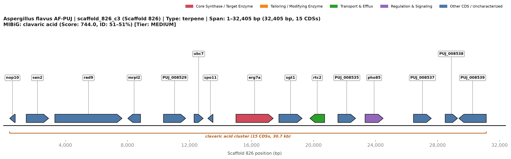](BGC_65_scaffold_826_c3_clavaric_acid.svg)

> *Figure 65: Publication-grade gene cluster diagram of `BGC_65_scaffold_826_c3_clavaric_acid` on Scaffold 826. Arrows indicate direction of transcription; boxes display standardized gene symbols or official locus tags. [Open scalable vector SVG](BGC_65_scaffold_826_c3_clavaric_acid.svg).*

#### Gene Inventory & Structural Qualifiers

| Locus Tag | Gene Symbol | Strand | Physical Span | Length | Putative Product & EC Number | Pfam / Domain Signatures |
| :--- | :---: | :---: | :---: | :---: | :--- | :--- |
| `PUJ_008525` | `nop10` | `-` | 410..768 | 69 aa | snoRNP complex protein | PF04135 (Nucleolar RNA-binding protein, Nop10p family) |
| `PUJ_008526` | `sen2` | `+` | 1,477..2,922 | 481 aa | tRNA splicing endonuclease subunit sen2 (`EC 4.6.1.16`) | PF01974 (tRNA intron endonuclease, catalytic C-terminal domain) |
| `PUJ_008527` | `rad9` | `+` | 3,322..7,658 | 1397 aa | radiation sensitive protein rad9 (`EC 4.6.1.16`) | PF08605 (Fungal Rad9-like Rad53-binding), PF00533 (BRCA1 C Terminus (BRCT) domain) |
| `PUJ_008528` | `mrpl2` | `-` | 8,026..8,850 | 274 aa | 54S ribosomal protein L2 mitochondrial (`EC 1.1.1.41`) | PF01016 (Ribosomal L27 protein) |
| `PUJ_008529` | `PUJ_008529` | `+` | 10,329..11,758 | 357 aa | hypothetical protein | PF03803 (Scramblase) |
| `PUJ_008530` | `ubc7` | `+` | 12,301..12,888 | 166 aa | ubiquitin conjugating enzyme Ubc7/UbcP3 (`EC 2.3.2.23`) | PF00179 (Ubiquitin-conjugating enzyme) |
| `PUJ_008531` | `spo11` | `-` | 13,189..13,518 | 109 aa | endodeoxyribonuclease | — |
| `PUJ_008532` | `erg7a` | `+` | 15,001..17,405 | 734 aa | Lanosterol synthase erg7A (`EC 5.4.99.7`) | PF13249 (Squalene-hopene cyclase N-terminal domain), PF13243 (Squalene-hopene cyclase C-terminal domain) |
| `PUJ_008533` | `sgt1` | `+` | 17,771..19,268 | 474 aa | Cochaperone protein | PF04969 (CS domain), PF05002 (SGS domain) |
| `PUJ_008534` | `rtc2` | `-` | 19,771..20,718 | 315 aa | Putative vacuolar membrane transporter for cationic amino acids | PF04193 (PQ loop repeat) |
| `PUJ_008535` | `PUJ_008535` | `+` | 21,575..22,717 | 376 aa | hypothetical protein | PF02146 (Sir2 family) |
| `PUJ_008536` | `pho85` | `+` | 23,327..24,493 | 324 aa | negative regulator of the PHO system | PF00069 (Protein kinase domain) |
| `PUJ_008537` | `PUJ_008537` | `+` | 26,449..27,600 | 345 aa | hypothetical protein | PF05462 (Slime mold cyclic AMP receptor) |
| `PUJ_008538` | `PUJ_008538` | `+` | 28,493..29,289 | 225 aa | hypothetical protein (`EC 1.14.18.1`) | PF03980 (Nnf1) |
| `PUJ_008539` | `PUJ_008539` | `-` | 29,378..31,143 | 503 aa | hypothetical protein | — |

#### Putative Function & Enzymatic Mechanisms

- **`PUJ_008525` (`nop10`):** Snornp complex protein. Contains PF04135 (Nucleolar RNA-binding protein, Nop10p family). Hypothetical or accessory protein implicated in cluster function or localized metabolic support.
- **`PUJ_008526` (`sen2`):** Trna splicing endonuclease subunit sen2 (EC 4.6.1.16). Contains PF01974 (tRNA intron endonuclease, catalytic C-terminal domain). Hypothetical or accessory protein implicated in cluster function or localized metabolic support.
- **`PUJ_008527` (`rad9`):** Radiation sensitive protein rad9 (EC 4.6.1.16). Contains PF08605 (Fungal Rad9-like Rad53-binding), PF00533 (BRCA1 C Terminus (BRCT) domain). Hypothetical or accessory protein implicated in cluster function or localized metabolic support.
- **`PUJ_008528` (`mrpl2`):** 54s ribosomal protein l2 mitochondrial (EC 1.1.1.41). Contains PF01016 (Ribosomal L27 protein). Hypothetical or accessory protein implicated in cluster function or localized metabolic support.
- **`PUJ_008529`:** Hypothetical protein. Contains PF03803 (Scramblase). Hypothetical or accessory protein implicated in cluster function or localized metabolic support.
- **`PUJ_008530` (`ubc7`):** Ubiquitin conjugating enzyme ubc7/ubcp3 (EC 2.3.2.23). Contains PF00179 (Ubiquitin-conjugating enzyme). Hypothetical or accessory protein implicated in cluster function or localized metabolic support.
- **`PUJ_008531` (`spo11`):** Endodeoxyribonuclease. Hypothetical or accessory protein implicated in cluster function or localized metabolic support.
- **`PUJ_008532` (`erg7a`):** Lanosterol synthase erg7a (EC 5.4.99.7). Contains PF13249 (Squalene-hopene cyclase N-terminal domain), PF13243 (Squalene-hopene cyclase C-terminal domain). Catalyzes core biosynthetic condensation or macrocyclization reactions in the pathway.
- **`PUJ_008533` (`sgt1`):** Cochaperone protein. Contains PF04969 (CS domain), PF05002 (SGS domain). Hypothetical or accessory protein implicated in cluster function or localized metabolic support.
- **`PUJ_008534` (`rtc2`):** Putative vacuolar membrane transporter for cationic amino acids. Contains PF04193 (PQ loop repeat). Transmembrane transport protein mediating efflux of synthesized products or precursor import.
- **`PUJ_008535`:** Hypothetical protein. Contains PF02146 (Sir2 family). Hypothetical or accessory protein implicated in cluster function or localized metabolic support.
- **`PUJ_008536` (`pho85`):** Negative regulator of the pho system. Contains PF00069 (Protein kinase domain). Transcription factor regulating cluster expression in response to physiological or developmental cues.
- **`PUJ_008537`:** Hypothetical protein. Contains PF05462 (Slime mold cyclic AMP receptor). Hypothetical or accessory protein implicated in cluster function or localized metabolic support.
- **`PUJ_008538`:** Hypothetical protein (EC 1.14.18.1). Contains PF03980 (Nnf1). Hypothetical or accessory protein implicated in cluster function or localized metabolic support.
- **`PUJ_008539`:** Hypothetical protein. Hypothetical or accessory protein implicated in cluster function or localized metabolic support.

### Collective Pathway Architecture & Biological Synergy

This cluster exhibits significant homology to the characterized MIBiG reference for **clavaric acid** (MIBiG accession `BGC0001248.3`, score 744.0, identities 51–51%). The cluster features 15 coordinated CDSs encoding core synthases, tailoring oxidoreductases/transferases, and transmembrane efflux transporters that function collectively to synthesize, modify, and excrete bioactive terpene compounds.

---

### 66. Metachelin C Biosynthetic Gene Cluster (`Scaffold 827`)

- **Cluster Identifier:** `BGC_66_scaffold_827_c1_metachelin_c` (`scaffold_827_c1`)  
- **Genomic Location:** Scaffold 827 | Span: 1–100,047 bp (100,047 bp, 21 CDSs)  
- **Pathway Class:** `NRPS` | **Confidence Tier:** `MEDIUM`  
- **antiSMASH KnownClusterBlast Top Hit:** `BGC0002710.2` — **metachelin C/metachelin A/metachelin A-CE/metachelin B/dimerumic acid 11-mannoside/dimerumic acid** (Cumulative Score: 1,714.0, Identity: 46–53%, 2 proteins)  

[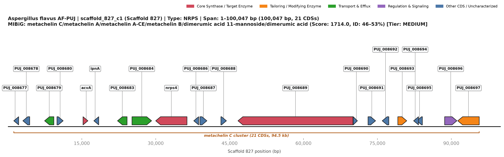](BGC_66_scaffold_827_c1_metachelin_c.svg)

> *Figure 66: Publication-grade gene cluster diagram of `BGC_66_scaffold_827_c1_metachelin_c` on Scaffold 827. Arrows indicate direction of transcription; boxes display standardized gene symbols or official locus tags. [Open scalable vector SVG](BGC_66_scaffold_827_c1_metachelin_c.svg).*

#### Gene Inventory & Structural Qualifiers

| Locus Tag | Gene Symbol | Strand | Physical Span | Length | Putative Product & EC Number | Pfam / Domain Signatures |
| :--- | :---: | :---: | :---: | :---: | :--- | :--- |
| `PUJ_008677` | `PUJ_008677` | `-` | 1,194..1,742 | 163 aa | hypothetical protein | — |
| `PUJ_008678` | `PUJ_008678` | `-` | 3,039..4,431 | 360 aa | hypothetical protein | — |
| `PUJ_008679` | `PUJ_008679` | `-` | 7,450..9,335 | 496 aa | hypothetical protein | PF07690 (Major Facilitator Superfamily) |
| `PUJ_008680` | `PUJ_008680` | `+` | 9,964..11,223 | 419 aa | hypothetical protein | PF01979 (Amidohydrolase family) |
| `PUJ_008681` | `acvA` | `+` | 15,558..16,250 | 212 aa | hypothetical protein | PF00069 (Protein kinase domain) |
| `PUJ_008682` | `ipnA` | `-` | 17,447..17,968 | 173 aa | hypothetical protein | — |
| `PUJ_008683` | `PUJ_008683` | `-` | 22,250..24,193 | 595 aa | hypothetical protein | PF07690 (Major Facilitator Superfamily) |
| `PUJ_008684` | `PUJ_008684` | `+` | 25,191..29,174 | 1327 aa | hypothetical protein | PF00664 (ABC transporter transmembrane region), PF00005 (ABC transporter), PF00664 (ABC transporter transmembrane region) |
| `PUJ_008685` | `nrps4` | `-` | 30,001..36,356 | 2100 aa | Nonribosomal peptide synthetase 4 | PF00668 (Condensation domain), PF00550 (Phosphopantetheine attachment site), PF00668 (Condensation domain) |
| `PUJ_008686` | `PUJ_008686` | `-` | 37,728..38,612 | 271 aa | hypothetical protein | PF00378 (Enoyl-CoA hydratase/isomerase) |
| `PUJ_008687` | `PUJ_008687` | `+` | 38,978..40,402 | 451 aa | hypothetical protein | PF13523 (Acetyltransferase (GNAT) domain) |
| `PUJ_008688` | `PUJ_008688` | `+` | 43,242..44,363 | 353 aa | hypothetical protein | PF08538 (Protein of unknown function (DUF1749)) |
| `PUJ_008689` | `PUJ_008689` | `-` | 46,702..70,047 | 7742 aa | hypothetical protein (`EC 7.6.2.2`) | PF00975 (Thioesterase domain), PF00550 (Phosphopantetheine attachment site), PF13193 (AMP-binding enzyme C-terminal domain) |
| `PUJ_008690` | `PUJ_008690` | `+` | 70,541..70,951 | 91 aa | hypothetical protein | — |
| `PUJ_008691` | `PUJ_008691` | `+` | 73,105..74,637 | 391 aa | hypothetical protein | — |
| `PUJ_008692` | `PUJ_008692` | `-` | 75,983..77,326 | 447 aa | hypothetical protein | PF03583 (Secretory lipase) |
| `PUJ_008693` | `PUJ_008693` | `+` | 79,151..80,965 | 499 aa | hypothetical protein | PF00067 (Cytochrome P450) |
| `PUJ_008694` | `PUJ_008694` | `-` | 82,354..82,979 | 158 aa | hypothetical protein | — |
| `PUJ_008695` | `PUJ_008695` | `-` | 82,988..84,136 | 382 aa | hypothetical protein | — |
| `PUJ_008696` | `PUJ_008696` | `+` | 88,656..91,144 | 737 aa | hypothetical protein | PF00172 (Fungal Zn(2)-Cys(6) binuclear cluster domain), PF04082 (Fungal specific transcription factor domain) |
| `PUJ_008697` | `PUJ_008697` | `-` | 91,314..95,678 | 1275 aa | hypothetical protein | PF00704 (Glycosyl hydrolases family 18) |

#### Putative Function & Enzymatic Mechanisms

- **`PUJ_008677`:** Hypothetical protein. Hypothetical or accessory protein implicated in cluster function or localized metabolic support.
- **`PUJ_008678`:** Hypothetical protein. Hypothetical or accessory protein implicated in cluster function or localized metabolic support.
- **`PUJ_008679`:** Hypothetical protein. Contains PF07690 (Major Facilitator Superfamily). Hypothetical or accessory protein implicated in cluster function or localized metabolic support.
- **`PUJ_008680`:** Hypothetical protein. Contains PF01979 (Amidohydrolase family). Hypothetical or accessory protein implicated in cluster function or localized metabolic support.
- **`PUJ_008681` (`acvA`):** Hypothetical protein. Contains PF00069 (Protein kinase domain). Hypothetical or accessory protein implicated in cluster function or localized metabolic support.
- **`PUJ_008682` (`ipnA`):** Hypothetical protein. Hypothetical or accessory protein implicated in cluster function or localized metabolic support.
- **`PUJ_008683`:** Hypothetical protein. Contains PF07690 (Major Facilitator Superfamily). Hypothetical or accessory protein implicated in cluster function or localized metabolic support.
- **`PUJ_008684`:** Hypothetical protein. Contains PF00664 (ABC transporter transmembrane region), PF00005 (ABC transporter). Hypothetical or accessory protein implicated in cluster function or localized metabolic support.
- **`PUJ_008685` (`nrps4`):** Nonribosomal peptide synthetase 4. Contains PF00668 (Condensation domain), PF00550 (Phosphopantetheine attachment site). Catalyzes core biosynthetic condensation or macrocyclization reactions in the pathway.
- **`PUJ_008686`:** Hypothetical protein. Contains PF00378 (Enoyl-CoA hydratase/isomerase). Hypothetical or accessory protein implicated in cluster function or localized metabolic support.
- **`PUJ_008687`:** Hypothetical protein. Contains PF13523 (Acetyltransferase (GNAT) domain). Hypothetical or accessory protein implicated in cluster function or localized metabolic support.
- **`PUJ_008688`:** Hypothetical protein. Contains PF08538 (Protein of unknown function (DUF1749)). Hypothetical or accessory protein implicated in cluster function or localized metabolic support.
- **`PUJ_008689`:** Hypothetical protein (EC 7.6.2.2). Contains PF00975 (Thioesterase domain), PF00550 (Phosphopantetheine attachment site). Hypothetical or accessory protein implicated in cluster function or localized metabolic support.
- **`PUJ_008690`:** Hypothetical protein. Hypothetical or accessory protein implicated in cluster function or localized metabolic support.
- **`PUJ_008691`:** Hypothetical protein. Hypothetical or accessory protein implicated in cluster function or localized metabolic support.
- **`PUJ_008692`:** Hypothetical protein. Contains PF03583 (Secretory lipase). Hypothetical or accessory protein implicated in cluster function or localized metabolic support.
- **`PUJ_008693`:** Hypothetical protein. Contains PF00067 (Cytochrome P450). Hypothetical or accessory protein implicated in cluster function or localized metabolic support.
- **`PUJ_008694`:** Hypothetical protein. Hypothetical or accessory protein implicated in cluster function or localized metabolic support.
- **`PUJ_008695`:** Hypothetical protein. Hypothetical or accessory protein implicated in cluster function or localized metabolic support.
- **`PUJ_008696`:** Hypothetical protein. Contains PF00172 (Fungal Zn(2)-Cys(6) binuclear cluster domain), PF04082 (Fungal specific transcription factor domain). Hypothetical or accessory protein implicated in cluster function or localized metabolic support.
- **`PUJ_008697`:** Hypothetical protein. Contains PF00704 (Glycosyl hydrolases family 18). Hypothetical or accessory protein implicated in cluster function or localized metabolic support.

### Collective Pathway Architecture & Biological Synergy

This cluster exhibits significant homology to the characterized MIBiG reference for **metachelin C/metachelin A/metachelin A-CE/metachelin B/dimerumic acid 11-mannoside/dimerumic acid** (MIBiG accession `BGC0002710.2`, score 1,714.0, identities 46–53%). The cluster features 21 coordinated CDSs encoding core synthases, tailoring oxidoreductases/transferases, and transmembrane efflux transporters that function collectively to synthesize, modify, and excrete bioactive NRPS compounds.

---

### 67. Penicillin Biosynthetic Gene Cluster (`Scaffold 904`)

- **Cluster Identifier:** `BGC_67_scaffold_904_c1_penicillin` (`scaffold_904_c1`)  
- **Genomic Location:** Scaffold 904 | Span: 1–86,817 bp (86,817 bp, 17 CDSs)  
- **Pathway Class:** `NRPS-like` | **Confidence Tier:** `MEDIUM`  
- **antiSMASH KnownClusterBlast Top Hit:** `BGC0000404.4` — **penicillin** (Cumulative Score: 6,518.0, Identity: 79–85%, 2 proteins)  

[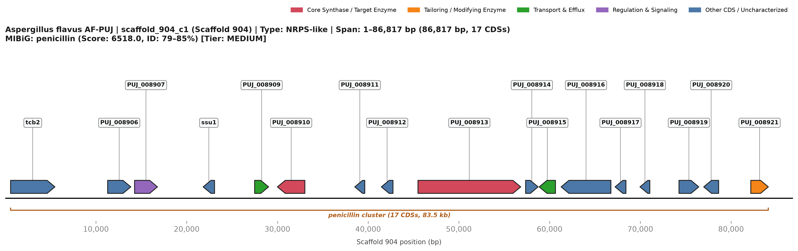](BGC_67_scaffold_904_c1_penicillin.svg)

> *Figure 67: Publication-grade gene cluster diagram of `BGC_67_scaffold_904_c1_penicillin` on Scaffold 904. Arrows indicate direction of transcription; boxes display standardized gene symbols or official locus tags. [Open scalable vector SVG](BGC_67_scaffold_904_c1_penicillin.svg).*

#### Gene Inventory & Structural Qualifiers

| Locus Tag | Gene Symbol | Strand | Physical Span | Length | Putative Product & EC Number | Pfam / Domain Signatures |
| :--- | :---: | :---: | :---: | :---: | :--- | :--- |
| `PUJ_008905` | `tcb2` | `+` | 591..5,480 | 1507 aa | Tricalbin-2 | PF00168 (C2 domain), PF00168 (C2 domain), PF00168 (C2 domain) |
| `PUJ_008906` | `PUJ_008906` | `+` | 11,289..13,842 | 637 aa | hypothetical protein | PF04082 (Fungal specific transcription factor domain) |
| `PUJ_008907` | `PUJ_008907` | `+` | 14,256..16,781 | 795 aa | hypothetical protein | PF00172 (Fungal Zn(2)-Cys(6) binuclear cluster domain), PF04082 (Fungal specific transcription factor domain) |
| `PUJ_008908` | `ssu1` | `-` | 21,816..23,073 | 360 aa | Plasma membrane sulfite pump involved in sulfite metabolism | PF03595 (Voltage-dependent anion channel) |
| `PUJ_008909` | `PUJ_008909` | `+` | 27,489..29,030 | 513 aa | hypothetical protein | PF00083 (Sugar (and other) transporter) |
| `PUJ_008910` | `PUJ_008910` | `-` | 30,001..33,027 | 1008 aa | hypothetical protein | PF07993 (Male sterility protein), PF00550 (Phosphopantetheine attachment site), PF13193 (AMP-binding enzyme C-terminal domain) |
| `PUJ_008911` | `PUJ_008911` | `-` | 38,529..39,631 | 308 aa | hypothetical protein | — |
| `PUJ_008912` | `PUJ_008912` | `-` | 41,456..42,740 | 357 aa | hypothetical protein | PF03417 (Acyl-coenzyme A:6-aminopenicillanic acid acyl-transferase) |
| `PUJ_008913` | `PUJ_008913` | `+` | 45,493..56,817 | 3753 aa | hypothetical protein (`EC 6.3.2.26`) | PF00501 (AMP-binding enzyme), PF00550 (Phosphopantetheine attachment site), PF00668 (Condensation domain) |
| `PUJ_008914` | `PUJ_008914` | `+` | 57,356..58,734 | 441 aa | hypothetical protein (`EC 4.1.1.65`) | PF12588 (Phophatidylserine decarboxylase), PF02666 (Phosphatidylserine decarboxylase) |
| `PUJ_008915` | `PUJ_008915` | `-` | 58,853..60,648 | 514 aa | hypothetical protein | PF07690 (Major Facilitator Superfamily) |
| `PUJ_008916` | `PUJ_008916` | `-` | 61,268..66,757 | 1737 aa | hypothetical protein | PF00023 (Ankyrin repeat), PF12796 (Ankyrin repeats (3 copies)) |
| `PUJ_008917` | `PUJ_008917` | `-` | 67,218..68,414 | 398 aa | hypothetical protein | PF11954 (Domain of unknown function (DUF3471)), PF00144 (Beta-lactamase) |
| `PUJ_008918` | `PUJ_008918` | `-` | 69,960..71,045 | 334 aa | hypothetical protein (`EC 4.1.3.4`) | PF00682 (HMGL-like) |
| `PUJ_008919` | `PUJ_008919` | `+` | 74,262..76,445 | 727 aa | hypothetical protein (`EC 3.1.1.7`) | PF00135 (Carboxylesterase family) |
| `PUJ_008920` | `PUJ_008920` | `-` | 76,986..78,632 | 525 aa | hypothetical protein | — |
| `PUJ_008921` | `PUJ_008921` | `+` | 82,175..84,108 | 579 aa | hypothetical protein (`EC 3.5.1.4`) | PF01425 (Amidase) |

#### Putative Function & Enzymatic Mechanisms

- **`PUJ_008905` (`tcb2`):** Tricalbin-2. Contains PF00168 (C2 domain), PF00168 (C2 domain). Hypothetical or accessory protein implicated in cluster function or localized metabolic support.
- **`PUJ_008906`:** Hypothetical protein. Contains PF04082 (Fungal specific transcription factor domain). Hypothetical or accessory protein implicated in cluster function or localized metabolic support.
- **`PUJ_008907`:** Hypothetical protein. Contains PF00172 (Fungal Zn(2)-Cys(6) binuclear cluster domain), PF04082 (Fungal specific transcription factor domain). Hypothetical or accessory protein implicated in cluster function or localized metabolic support.
- **`PUJ_008908` (`ssu1`):** Plasma membrane sulfite pump involved in sulfite metabolism. Contains PF03595 (Voltage-dependent anion channel). Hypothetical or accessory protein implicated in cluster function or localized metabolic support.
- **`PUJ_008909`:** Hypothetical protein. Contains PF00083 (Sugar (and other) transporter). Hypothetical or accessory protein implicated in cluster function or localized metabolic support.
- **`PUJ_008910`:** Hypothetical protein. Contains PF07993 (Male sterility protein), PF00550 (Phosphopantetheine attachment site). Hypothetical or accessory protein implicated in cluster function or localized metabolic support.
- **`PUJ_008911`:** Hypothetical protein. Hypothetical or accessory protein implicated in cluster function or localized metabolic support.
- **`PUJ_008912`:** Hypothetical protein. Contains PF03417 (Acyl-coenzyme A:6-aminopenicillanic acid acyl-transferase). Hypothetical or accessory protein implicated in cluster function or localized metabolic support.
- **`PUJ_008913`:** Hypothetical protein (EC 6.3.2.26). Contains PF00501 (AMP-binding enzyme), PF00550 (Phosphopantetheine attachment site). Hypothetical or accessory protein implicated in cluster function or localized metabolic support.
- **`PUJ_008914`:** Hypothetical protein (EC 4.1.1.65). Contains PF12588 (Phophatidylserine decarboxylase), PF02666 (Phosphatidylserine decarboxylase). Hypothetical or accessory protein implicated in cluster function or localized metabolic support.
- **`PUJ_008915`:** Hypothetical protein. Contains PF07690 (Major Facilitator Superfamily). Hypothetical or accessory protein implicated in cluster function or localized metabolic support.
- **`PUJ_008916`:** Hypothetical protein. Contains PF00023 (Ankyrin repeat), PF12796 (Ankyrin repeats (3 copies)). Hypothetical or accessory protein implicated in cluster function or localized metabolic support.
- **`PUJ_008917`:** Hypothetical protein. Contains PF11954 (Domain of unknown function (DUF3471)), PF00144 (Beta-lactamase). Hypothetical or accessory protein implicated in cluster function or localized metabolic support.
- **`PUJ_008918`:** Hypothetical protein (EC 4.1.3.4). Contains PF00682 (HMGL-like). Hypothetical or accessory protein implicated in cluster function or localized metabolic support.
- **`PUJ_008919`:** Hypothetical protein (EC 3.1.1.7). Contains PF00135 (Carboxylesterase family). Hypothetical or accessory protein implicated in cluster function or localized metabolic support.
- **`PUJ_008920`:** Hypothetical protein. Hypothetical or accessory protein implicated in cluster function or localized metabolic support.
- **`PUJ_008921`:** Hypothetical protein (EC 3.5.1.4). Contains PF01425 (Amidase). Hypothetical or accessory protein implicated in cluster function or localized metabolic support.

### Collective Pathway Architecture & Biological Synergy

This cluster exhibits significant homology to the characterized MIBiG reference for **penicillin** (MIBiG accession `BGC0000404.4`, score 6,518.0, identities 79–85%). The cluster features 17 coordinated CDSs encoding core synthases, tailoring oxidoreductases/transferases, and transmembrane efflux transporters that function collectively to synthesize, modify, and excrete bioactive NRPS-like compounds.

---

### 68. Novel Orphan TERPENE Biosynthetic Gene Cluster (`Scaffold 904`)

- **Cluster Identifier:** `BGC_68_scaffold_904_c2_orphan_terpene` (`scaffold_904_c2`)  
- **Genomic Location:** Scaffold 904 | Span: 1–51,233 bp (51,233 bp, 16 CDSs)  
- **Pathway Class:** `terpene` | **Confidence Tier:** `ORPHAN`  

[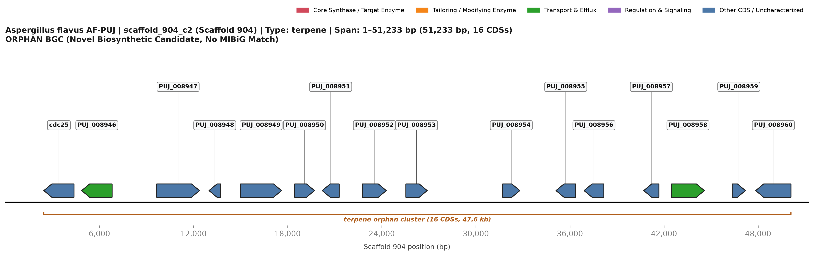](BGC_68_scaffold_904_c2_orphan_terpene.svg)

> *Figure 68: Publication-grade gene cluster diagram of `BGC_68_scaffold_904_c2_orphan_terpene` on Scaffold 904. Arrows indicate direction of transcription; boxes display standardized gene symbols or official locus tags. [Open scalable vector SVG](BGC_68_scaffold_904_c2_orphan_terpene.svg).*

#### Gene Inventory & Structural Qualifiers

| Locus Tag | Gene Symbol | Strand | Physical Span | Length | Putative Product & EC Number | Pfam / Domain Signatures |
| :--- | :---: | :---: | :---: | :---: | :--- | :--- |
| `PUJ_008945` | `cdc25` | `-` | 2,454..4,382 | 527 aa | cell division cycle-related protein | PF00617 (RasGEF domain), PF00618 (RasGEF N-terminal motif) |
| `PUJ_008946` | `PUJ_008946` | `-` | 4,866..6,809 | 611 aa | hypothetical protein | PF07690 (Major Facilitator Superfamily) |
| `PUJ_008947` | `PUJ_008947` | `+` | 9,653..12,383 | 751 aa | hypothetical protein | PF00004 (ATPase family associated with various cellular activities (AAA)) |
| `PUJ_008948` | `PUJ_008948` | `-` | 12,986..13,728 | 229 aa | hypothetical protein | PF00650 (CRAL/TRIO domain) |
| `PUJ_008949` | `PUJ_008949` | `+` | 15,001..17,615 | 588 aa | hypothetical protein | PF19086 (Terpene synthase family 2, C-terminal metal binding), PF00348 (Polyprenyl synthetase) |
| `PUJ_008950` | `PUJ_008950` | `+` | 18,451..19,716 | 421 aa | hypothetical protein | — |
| `PUJ_008951` | `PUJ_008951` | `-` | 20,205..21,290 | 361 aa | hypothetical protein | — |
| `PUJ_008952` | `PUJ_008952` | `+` | 22,768..24,295 | 492 aa | hypothetical protein | — |
| `PUJ_008953` | `PUJ_008953` | `+` | 25,540..26,904 | 454 aa | hypothetical protein | PF13374 (Tetratricopeptide repeat), PF13424 (Tetratricopeptide repeat), PF13424 (Tetratricopeptide repeat) |
| `PUJ_008954` | `PUJ_008954` | `+` | 31,713..32,810 | 186 aa | hypothetical protein | PF13520 (Amino acid permease) |
| `PUJ_008955` | `PUJ_008955` | `-` | 35,112..36,359 | 398 aa | hypothetical protein | — |
| `PUJ_008956` | `PUJ_008956` | `-` | 36,901..38,168 | 341 aa | hypothetical protein | PF02797 (Chalcone and stilbene synthases, C-terminal domain), PF00195 (Chalcone and stilbene synthases, N-terminal domain) |
| `PUJ_008957` | `PUJ_008957` | `-` | 40,706..41,677 | 303 aa | hypothetical protein | PF00756 (Putative esterase) |
| `PUJ_008958` | `PUJ_008958` | `+` | 42,483..44,577 | 616 aa | hypothetical protein | PF07690 (Major Facilitator Superfamily) |
| `PUJ_008959` | `PUJ_008959` | `+` | 46,348..47,195 | 260 aa | hypothetical protein | PF12697 (Alpha/beta hydrolase family) |
| `PUJ_008960` | `PUJ_008960` | `-` | 47,845..50,097 | 750 aa | hypothetical protein | — |

#### Putative Function & Enzymatic Mechanisms

- **`PUJ_008945` (`cdc25`):** Cell division cycle-related protein. Contains PF00617 (RasGEF domain), PF00618 (RasGEF N-terminal motif). Hypothetical or accessory protein implicated in cluster function or localized metabolic support.
- **`PUJ_008946`:** Hypothetical protein. Contains PF07690 (Major Facilitator Superfamily). Hypothetical or accessory protein implicated in cluster function or localized metabolic support.
- **`PUJ_008947`:** Hypothetical protein. Contains PF00004 (ATPase family associated with various cellular activities (AAA)). Hypothetical or accessory protein implicated in cluster function or localized metabolic support.
- **`PUJ_008948`:** Hypothetical protein. Contains PF00650 (CRAL/TRIO domain). Hypothetical or accessory protein implicated in cluster function or localized metabolic support.
- **`PUJ_008949`:** Hypothetical protein. Contains PF19086 (Terpene synthase family 2, C-terminal metal binding), PF00348 (Polyprenyl synthetase). Hypothetical or accessory protein implicated in cluster function or localized metabolic support.
- **`PUJ_008950`:** Hypothetical protein. Hypothetical or accessory protein implicated in cluster function or localized metabolic support.
- **`PUJ_008951`:** Hypothetical protein. Hypothetical or accessory protein implicated in cluster function or localized metabolic support.
- **`PUJ_008952`:** Hypothetical protein. Hypothetical or accessory protein implicated in cluster function or localized metabolic support.
- **`PUJ_008953`:** Hypothetical protein. Contains PF13374 (Tetratricopeptide repeat), PF13424 (Tetratricopeptide repeat). Hypothetical or accessory protein implicated in cluster function or localized metabolic support.
- **`PUJ_008954`:** Hypothetical protein. Contains PF13520 (Amino acid permease). Hypothetical or accessory protein implicated in cluster function or localized metabolic support.
- **`PUJ_008955`:** Hypothetical protein. Hypothetical or accessory protein implicated in cluster function or localized metabolic support.
- **`PUJ_008956`:** Hypothetical protein. Contains PF02797 (Chalcone and stilbene synthases, C-terminal domain), PF00195 (Chalcone and stilbene synthases, N-terminal domain). Hypothetical or accessory protein implicated in cluster function or localized metabolic support.
- **`PUJ_008957`:** Hypothetical protein. Contains PF00756 (Putative esterase). Hypothetical or accessory protein implicated in cluster function or localized metabolic support.
- **`PUJ_008958`:** Hypothetical protein. Contains PF07690 (Major Facilitator Superfamily). Hypothetical or accessory protein implicated in cluster function or localized metabolic support.
- **`PUJ_008959`:** Hypothetical protein. Contains PF12697 (Alpha/beta hydrolase family). Hypothetical or accessory protein implicated in cluster function or localized metabolic support.
- **`PUJ_008960`:** Hypothetical protein. Hypothetical or accessory protein implicated in cluster function or localized metabolic support.

### Collective Pathway Architecture & Biological Synergy

This cluster represents a novel **orphan terpene secondary metabolite biosynthetic gene cluster (BGC)**. Comprising 16 predicted CDSs, the locus harbors a dedicated core synthase supported by localized tailoring enzymes and transporter permeases with zero significant matches in MIBiG 3.1. It represents an uncharacterized secondary metabolite pathway within the *Aspergillus flavus* genome with potential bioactive chemical products.

---

### 69. 6-Methylsalicyclic Acid Biosynthetic Gene Cluster (`Scaffold 960`)

- **Cluster Identifier:** `BGC_69_scaffold_960_c1_6_methylsalicyclic_acid` (`scaffold_960_c1`)  
- **Genomic Location:** Scaffold 960 | Span: 1–65,347 bp (65,347 bp, 17 CDSs)  
- **Pathway Class:** `T1PKS` | **Confidence Tier:** `MEDIUM`  
- **antiSMASH KnownClusterBlast Top Hit:** `BGC0001276.3` — **6-methylsalicyclic acid** (Cumulative Score: 2,075.0, Identity: 60–60%, 1 proteins)  

[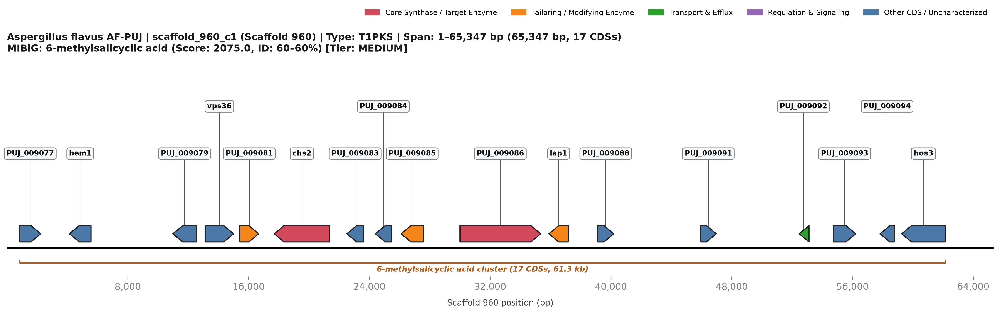](BGC_69_scaffold_960_c1_6_methylsalicyclic_acid.svg)

> *Figure 69: Publication-grade gene cluster diagram of `BGC_69_scaffold_960_c1_6_methylsalicyclic_acid` on Scaffold 960. Arrows indicate direction of transcription; boxes display standardized gene symbols or official locus tags. [Open scalable vector SVG](BGC_69_scaffold_960_c1_6_methylsalicyclic_acid.svg).*

#### Gene Inventory & Structural Qualifiers

| Locus Tag | Gene Symbol | Strand | Physical Span | Length | Putative Product & EC Number | Pfam / Domain Signatures |
| :--- | :---: | :---: | :---: | :---: | :--- | :--- |
| `PUJ_009077` | `PUJ_009077` | `+` | 848..2,231 | 390 aa | hypothetical protein | — |
| `PUJ_009078` | `bem1` | `-` | 4,132..5,562 | 452 aa | bud emergence protein 1 | PF00564 (PB1 domain), PF00787 (PX domain), PF00018 (SH3 domain) |
| `PUJ_009079` | `PUJ_009079` | `-` | 10,985..12,536 | 498 aa | hypothetical protein | PF03399 (SAC3/GANP family) |
| `PUJ_009080` | `vps36` | `+` | 13,120..15,007 | 587 aa | Vacuolar protein-sorting-associated protein 36 (`EC 3.5.1.4`) | PF11605 (Vacuolar protein sorting protein 36 Vps36), PF16988 (Vacuolar protein sorting 36 NZF-N zinc-finger domain), PF04157 (EAP30/Vps36 family) |
| `PUJ_009081` | `PUJ_009081` | `+` | 15,425..16,670 | 344 aa | hypothetical protein (`EC 3.5.1.4`) | PF01425 (Amidase) |
| `PUJ_009082` | `chs2` | `-` | 17,697..21,374 | 1073 aa | Chitin synthase, class 2 (`EC 2.4.1.16`) | PF01644 (Chitin synthase), PF08407 (Chitin synthase N-terminal) |
| `PUJ_009083` | `PUJ_009083` | `-` | 22,506..23,608 | 291 aa | hypothetical protein | PF08611 (Fungal protein of unknown function (DUF1774)) |
| `PUJ_009084` | `PUJ_009084` | `-` | 24,400..25,458 | 352 aa | hypothetical protein (`EC 3.1.3.7`) | PF00459 (Inositol monophosphatase family) |
| `PUJ_009085` | `PUJ_009085` | `-` | 26,106..27,565 | 413 aa | hypothetical protein | PF00067 (Cytochrome P450) |
| `PUJ_009086` | `PUJ_009086` | `+` | 30,001..35,347 | 1761 aa | hypothetical protein (`EC 2.3.1.165`) | PF00109 (Beta-ketoacyl synthase, N-terminal domain), PF02801 (Beta-ketoacyl synthase, C-terminal domain), PF16197 (Ketoacyl-synthetase C-terminal extension) |
| `PUJ_009087` | `lap1` | `-` | 35,888..37,166 | 387 aa | Leucine aminopeptidase 1 (`EC 3.4.11.10`) | PF04389 (Peptidase family M28) |
| `PUJ_009088` | `PUJ_009088` | `+` | 39,125..40,185 | 340 aa | hypothetical protein | PF13902 (R3H-associated N-terminal domain) |
| `PUJ_009091` | `PUJ_009091` | `+` | 45,933..46,976 | 347 aa | hypothetical protein | — |
| `PUJ_009092` | `PUJ_009092` | `-` | 52,468..53,026 | 162 aa | hypothetical protein | PF07690 (Major Facilitator Superfamily) |
| `PUJ_009093` | `PUJ_009093` | `+` | 54,735..56,212 | 231 aa | hypothetical protein (`EC 2.4.2.29`) | PF01702 (Queuine tRNA-ribosyltransferase), PF01702 (Queuine tRNA-ribosyltransferase), PF01702 (Queuine tRNA-ribosyltransferase) |
| `PUJ_009094` | `PUJ_009094` | `-` | 57,824..58,756 | 310 aa | hypothetical protein | PF01428 (AN1-like Zinc finger), PF01428 (AN1-like Zinc finger) |
| `PUJ_009095` | `hos3` | `-` | 59,253..62,141 | 962 aa | histone deacetylase (`EC 3.5.1.98`) | PF00850 (Histone deacetylase domain) |

#### Putative Function & Enzymatic Mechanisms

- **`PUJ_009077`:** Hypothetical protein. Hypothetical or accessory protein implicated in cluster function or localized metabolic support.
- **`PUJ_009078` (`bem1`):** Bud emergence protein 1. Contains PF00564 (PB1 domain), PF00787 (PX domain). Hypothetical or accessory protein implicated in cluster function or localized metabolic support.
- **`PUJ_009079`:** Hypothetical protein. Contains PF03399 (SAC3/GANP family). Hypothetical or accessory protein implicated in cluster function or localized metabolic support.
- **`PUJ_009080` (`vps36`):** Vacuolar protein-sorting-associated protein 36 (EC 3.5.1.4). Contains PF11605 (Vacuolar protein sorting protein 36 Vps36), PF16988 (Vacuolar protein sorting 36 NZF-N zinc-finger domain). Hypothetical or accessory protein implicated in cluster function or localized metabolic support.
- **`PUJ_009081`:** Hypothetical protein (EC 3.5.1.4). Contains PF01425 (Amidase). Hypothetical or accessory protein implicated in cluster function or localized metabolic support.
- **`PUJ_009082` (`chs2`):** Chitin synthase, class 2 (EC 2.4.1.16). Contains PF01644 (Chitin synthase), PF08407 (Chitin synthase N-terminal). Catalyzes core biosynthetic condensation or macrocyclization reactions in the pathway.
- **`PUJ_009083`:** Hypothetical protein. Contains PF08611 (Fungal protein of unknown function (DUF1774)). Hypothetical or accessory protein implicated in cluster function or localized metabolic support.
- **`PUJ_009084`:** Hypothetical protein (EC 3.1.3.7). Contains PF00459 (Inositol monophosphatase family). Hypothetical or accessory protein implicated in cluster function or localized metabolic support.
- **`PUJ_009085`:** Hypothetical protein. Contains PF00067 (Cytochrome P450). Hypothetical or accessory protein implicated in cluster function or localized metabolic support.
- **`PUJ_009086`:** Hypothetical protein (EC 2.3.1.165). Contains PF00109 (Beta-ketoacyl synthase, N-terminal domain), PF02801 (Beta-ketoacyl synthase, C-terminal domain). Hypothetical or accessory protein implicated in cluster function or localized metabolic support.
- **`PUJ_009087` (`lap1`):** Leucine aminopeptidase 1 (EC 3.4.11.10). Contains PF04389 (Peptidase family M28). Hydrolytic enzyme cleaving ester or amide bonds during substrate channeling or pathway maturation.
- **`PUJ_009088`:** Hypothetical protein. Contains PF13902 (R3H-associated N-terminal domain). Hypothetical or accessory protein implicated in cluster function or localized metabolic support.
- **`PUJ_009091`:** Hypothetical protein. Hypothetical or accessory protein implicated in cluster function or localized metabolic support.
- **`PUJ_009092`:** Hypothetical protein. Contains PF07690 (Major Facilitator Superfamily). Hypothetical or accessory protein implicated in cluster function or localized metabolic support.
- **`PUJ_009093`:** Hypothetical protein (EC 2.4.2.29). Contains PF01702 (Queuine tRNA-ribosyltransferase), PF01702 (Queuine tRNA-ribosyltransferase). Hypothetical or accessory protein implicated in cluster function or localized metabolic support.
- **`PUJ_009094`:** Hypothetical protein. Contains PF01428 (AN1-like Zinc finger), PF01428 (AN1-like Zinc finger). Hypothetical or accessory protein implicated in cluster function or localized metabolic support.
- **`PUJ_009095` (`hos3`):** Histone deacetylase (EC 3.5.1.98). Contains PF00850 (Histone deacetylase domain). Hypothetical or accessory protein implicated in cluster function or localized metabolic support.

### Collective Pathway Architecture & Biological Synergy

This cluster exhibits significant homology to the characterized MIBiG reference for **6-methylsalicyclic acid** (MIBiG accession `BGC0001276.3`, score 2,075.0, identities 60–60%). The cluster features 17 coordinated CDSs encoding core synthases, tailoring oxidoreductases/transferases, and transmembrane efflux transporters that function collectively to synthesize, modify, and excrete bioactive T1PKS compounds.

---

### 70. Novel Orphan NRPS Biosynthetic Gene Cluster (`Scaffold 1334`)

- **Cluster Identifier:** `BGC_70_scaffold_1334_c1_orphan_nrps` (`scaffold_1334_c1`)  
- **Genomic Location:** Scaffold 1334 | Span: 1–76,133 bp (76,133 bp, 16 CDSs)  
- **Pathway Class:** `NRPS` | **Confidence Tier:** `ORPHAN`  

[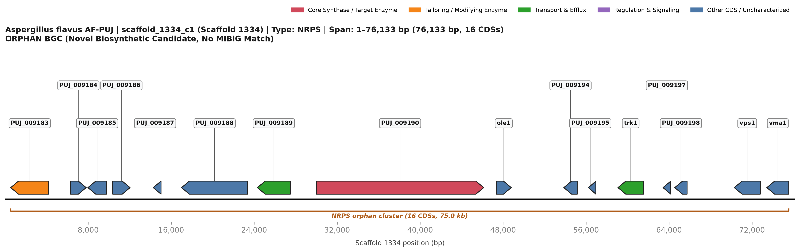](BGC_70_scaffold_1334_c1_orphan_nrps.svg)

> *Figure 70: Publication-grade gene cluster diagram of `BGC_70_scaffold_1334_c1_orphan_nrps` on Scaffold 1334. Arrows indicate direction of transcription; boxes display standardized gene symbols or official locus tags. [Open scalable vector SVG](BGC_70_scaffold_1334_c1_orphan_nrps.svg).*

#### Gene Inventory & Structural Qualifiers

| Locus Tag | Gene Symbol | Strand | Physical Span | Length | Putative Product & EC Number | Pfam / Domain Signatures |
| :--- | :---: | :---: | :---: | :---: | :--- | :--- |
| `PUJ_009183` | `PUJ_009183` | `-` | 526..4,197 | 613 aa | hypothetical protein | PF00107 (Zinc-binding dehydrogenase), PF08240 (Alcohol dehydrogenase GroES-like domain), PF00067 (Cytochrome P450) |
| `PUJ_009184` | `PUJ_009184` | `+` | 6,306..7,805 | 435 aa | hypothetical protein | — |
| `PUJ_009185` | `PUJ_009185` | `-` | 7,970..9,757 | 595 aa | hypothetical protein | PF17851 (Beta xylosidase C-terminal Concanavalin A-like domain), PF04616 (Glycosyl hydrolases family 43) |
| `PUJ_009186` | `PUJ_009186` | `+` | 10,367..12,037 | 511 aa | hypothetical protein | PF13204 (Protein of unknown function (DUF4038)), PF12904 (Putative collagen-binding domain of a collagenase) |
| `PUJ_009187` | `PUJ_009187` | `-` | 14,267..14,632 | 121 aa | hypothetical protein | — |
| `PUJ_009188` | `PUJ_009188` | `-` | 16,998..23,381 | 956 aa | hypothetical protein | — |
| `PUJ_009189` | `PUJ_009189` | `-` | 24,307..27,485 | 952 aa | hypothetical protein (`EC 7.6.2.2`) | PF00005 (ABC transporter), PF00664 (ABC transporter transmembrane region), PF00005 (ABC transporter) |
| `PUJ_009190` | `PUJ_009190` | `+` | 30,001..46,133 | 4851 aa | hypothetical protein | PF00668 (Condensation domain), PF00501 (AMP-binding enzyme), PF00550 (Phosphopantetheine attachment site) |
| `PUJ_009191` | `ole1` | `+` | 47,332..48,790 | 469 aa | stearoyl-CoA 9-desaturase (`EC 1.14.19.1`) | PF00487 (Fatty acid desaturase), PF00173 (Cytochrome b5-like Heme/Steroid binding domain) |
| `PUJ_009194` | `PUJ_009194` | `-` | 53,852..55,148 | 395 aa | hypothetical protein | PF00722 (Glycosyl hydrolases family 16) |
| `PUJ_009195` | `PUJ_009195` | `-` | 56,236..56,577 | 93 aa | hypothetical protein | — |
| `PUJ_009196` | `trk1` | `-` | 59,072..61,534 | 820 aa | low affinity potassium transporter | PF02386 (Cation transport protein) |
| `PUJ_009197` | `PUJ_009197` | `-` | 63,416..64,165 | 249 aa | hypothetical protein | PF01328 (Peroxidase, family 2) |
| `PUJ_009198` | `PUJ_009198` | `-` | 64,547..65,739 | 375 aa | hypothetical protein | PF00561 (alpha/beta hydrolase fold) |
| `PUJ_009199` | `vps1` | `-` | 70,288..72,791 | 711 aa | vacuolar protein sorting-associated protein 1 (`EC 3.6.5.5`) | PF02212 (Dynamin GTPase effector domain), PF02212 (Dynamin GTPase effector domain), PF01031 (Dynamin central region) |
| `PUJ_009200` | `vma1` | `-` | 73,425..75,547 | 609 aa | H(+)-transporting V1 sector ATPase subunit A (`EC 7.1.2.2`) | PF00006 (ATP synthase alpha/beta family, nucleotide-binding domain), PF16886 (ATPsynthase alpha/beta subunit N-term extension), PF02874 (ATP synthase alpha/beta family, beta-barrel domain) |

#### Putative Function & Enzymatic Mechanisms

- **`PUJ_009183`:** Hypothetical protein. Contains PF00107 (Zinc-binding dehydrogenase), PF08240 (Alcohol dehydrogenase GroES-like domain). Hypothetical or accessory protein implicated in cluster function or localized metabolic support.
- **`PUJ_009184`:** Hypothetical protein. Hypothetical or accessory protein implicated in cluster function or localized metabolic support.
- **`PUJ_009185`:** Hypothetical protein. Contains PF17851 (Beta xylosidase C-terminal Concanavalin A-like domain), PF04616 (Glycosyl hydrolases family 43). Hypothetical or accessory protein implicated in cluster function or localized metabolic support.
- **`PUJ_009186`:** Hypothetical protein. Contains PF13204 (Protein of unknown function (DUF4038)), PF12904 (Putative collagen-binding domain of a collagenase). Hypothetical or accessory protein implicated in cluster function or localized metabolic support.
- **`PUJ_009187`:** Hypothetical protein. Hypothetical or accessory protein implicated in cluster function or localized metabolic support.
- **`PUJ_009188`:** Hypothetical protein. Hypothetical or accessory protein implicated in cluster function or localized metabolic support.
- **`PUJ_009189`:** Hypothetical protein (EC 7.6.2.2). Contains PF00005 (ABC transporter), PF00664 (ABC transporter transmembrane region). Hypothetical or accessory protein implicated in cluster function or localized metabolic support.
- **`PUJ_009190`:** Hypothetical protein. Contains PF00668 (Condensation domain), PF00501 (AMP-binding enzyme). Hypothetical or accessory protein implicated in cluster function or localized metabolic support.
- **`PUJ_009191` (`ole1`):** Stearoyl-coa 9-desaturase (EC 1.14.19.1). Contains PF00487 (Fatty acid desaturase), PF00173 (Cytochrome b5-like Heme/Steroid binding domain). Hypothetical or accessory protein implicated in cluster function or localized metabolic support.
- **`PUJ_009194`:** Hypothetical protein. Contains PF00722 (Glycosyl hydrolases family 16). Hypothetical or accessory protein implicated in cluster function or localized metabolic support.
- **`PUJ_009195`:** Hypothetical protein. Hypothetical or accessory protein implicated in cluster function or localized metabolic support.
- **`PUJ_009196` (`trk1`):** Low affinity potassium transporter. Contains PF02386 (Cation transport protein). Transmembrane transport protein mediating efflux of synthesized products or precursor import.
- **`PUJ_009197`:** Hypothetical protein. Contains PF01328 (Peroxidase, family 2). Hypothetical or accessory protein implicated in cluster function or localized metabolic support.
- **`PUJ_009198`:** Hypothetical protein. Contains PF00561 (alpha/beta hydrolase fold). Hypothetical or accessory protein implicated in cluster function or localized metabolic support.
- **`PUJ_009199` (`vps1`):** Vacuolar protein sorting-associated protein 1 (EC 3.6.5.5). Contains PF02212 (Dynamin GTPase effector domain), PF02212 (Dynamin GTPase effector domain). Hypothetical or accessory protein implicated in cluster function or localized metabolic support.
- **`PUJ_009200` (`vma1`):** H(+)-transporting v1 sector atpase subunit a (EC 7.1.2.2). Contains PF00006 (ATP synthase alpha/beta family, nucleotide-binding domain), PF16886 (ATPsynthase alpha/beta subunit N-term extension). Hypothetical or accessory protein implicated in cluster function or localized metabolic support.

### Collective Pathway Architecture & Biological Synergy

This cluster represents a novel **orphan NRPS secondary metabolite biosynthetic gene cluster (BGC)**. Comprising 16 predicted CDSs, the locus harbors a dedicated core synthase supported by localized tailoring enzymes and transporter permeases with zero significant matches in MIBiG 3.1. It represents an uncharacterized secondary metabolite pathway within the *Aspergillus flavus* genome with potential bioactive chemical products.

---

### 71. Dual Aflatoxin & Cyclopiazonic Acid (AF/CPA) Super-Cluster (`Scaffold 1340`)

- **Cluster Identifier:** `BGC_71_scaffold_1340_c1_aflatoxin_CPA_supercluster` (`scaffold_1340_c1`)  
- **Genomic Location:** Scaffold 1340 | Span: 1–79,127 bp (79,127 bp, 17 CDSs)  
- **Pathway Class:** `T1PKS` | **Confidence Tier:** `HIGH`  
- **antiSMASH KnownClusterBlast Top Hit:** `BGC0000007.3` — **aflatoxin G1/aflatoxin B1** (Cumulative Score: 16,946.0, Identity: 51–97%, 11 proteins)  

[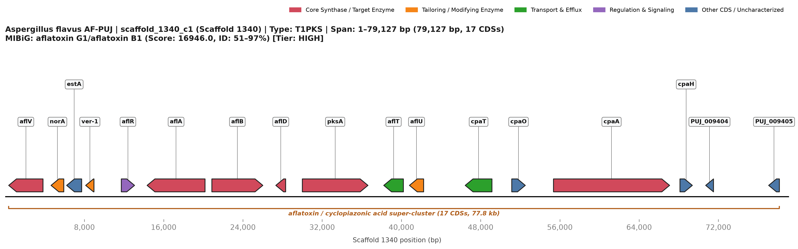](BGC_71_scaffold_1340_c1_aflatoxin_CPA_supercluster.svg)

> *Figure 71: Publication-grade gene cluster diagram of `BGC_71_scaffold_1340_c1_aflatoxin_CPA_supercluster` on Scaffold 1340. Arrows indicate direction of transcription; boxes display standardized gene symbols or official locus tags. [Open scalable vector SVG](BGC_71_scaffold_1340_c1_aflatoxin_CPA_supercluster.svg).*

#### Gene Inventory & Structural Qualifiers

| Locus Tag | Gene Symbol | Strand | Physical Span | Length | Putative Product & EC Number | Pfam / Domain Signatures |
| :--- | :---: | :---: | :---: | :---: | :--- | :--- |
| `PUJ_009389` | `aflJ` | `-` | 356..3,818 | 742 aa | hypothetical protein | PF00067 (Cytochrome P450), PF13561 (Enoyl-(Acyl carrier protein) reductase) |
| `PUJ_009390` | `aflV` | `-` | 4,632..5,916 | 388 aa | hypothetical protein | PF00248 (Aldo/keto reductase family) |
| `PUJ_009391` | `ver-1` | `-` | 6,207..7,721 | 308 aa | hypothetical protein (`EC 3.1.1.94`) | PF07859 (alpha/beta hydrolase fold) |
| `PUJ_009392` | `estA` | `-` | 8,128..8,964 | 278 aa | hypothetical protein (`EC 1.1.1.352`) | PF00106 (short chain dehydrogenase) |
| `PUJ_009393` | `aflR` | `+` | 11,725..13,059 | 444 aa | hypothetical protein | PF00172 (Fungal Zn(2)-Cys(6) binuclear cluster domain), PF08493 (Aflatoxin regulatory protein) |
| `PUJ_009394` | `aflA` | `-` | 14,330..20,176 | 1904 aa | hypothetical protein (`EC 2.3.1.86`) | PF00698 (Acyl transferase domain), PF01575 (MaoC like domain), PF13452 (N-terminal half of MaoC dehydratase) |
| `PUJ_009395` | `aflB` | `+` | 20,866..26,010 | 1679 aa | hypothetical protein (`EC 2.3.1.86`) | PF18325 (Fatty acid synthase subunit alpha Acyl carrier domain), PF18314 (Fatty acid synthase type I helical domain), PF00109 (Beta-ketoacyl synthase, N-terminal domain) |
| `PUJ_009396` | `aflD` | `-` | 27,325..28,314 | 271 aa | hypothetical protein (`EC 1.1.1.349`) | PF00106 (short chain dehydrogenase) |
| `PUJ_009397` | `pksA` | `+` | 30,001..36,624 | 2109 aa | hypothetical protein (`EC 2.3.1.221`) | PF16073 (Starter unit:ACP transacylase in aflatoxin biosynthesis), PF00109 (Beta-ketoacyl synthase, N-terminal domain), PF02801 (Beta-ketoacyl synthase, C-terminal domain) |
| `PUJ_009398` | `aflT` | `-` | 38,221..40,201 | 542 aa | hypothetical protein | PF07690 (Major Facilitator Superfamily) |
| `PUJ_009399` | `aflU` | `-` | 40,815..42,244 | 385 aa | hypothetical protein | PF00067 (Cytochrome P450), PF00067 (Cytochrome P450) |
| `PUJ_009400` | `cpaT` | `-` | 46,445..49,143 | 664 aa | hypothetical protein | PF07690 (Major Facilitator Superfamily) |
| `PUJ_009401` | `cpaO` | `+` | 51,141..52,508 | 455 aa | hypothetical protein (`EC 1.21.99.1`) | PF01593 (Flavin containing amine oxidoreductase) |
| `PUJ_009402` | `cpaA` | `+` | 55,355..67,075 | 3867 aa | hypothetical protein | PF00109 (Beta-ketoacyl synthase, N-terminal domain), PF02801 (Beta-ketoacyl synthase, C-terminal domain), PF16197 (Ketoacyl-synthetase C-terminal extension) |
| `PUJ_009403` | `cpaH` | `+` | 68,124..69,372 | 395 aa | hypothetical protein | — |
| `PUJ_009404` | `PUJ_009404` | `-` | 70,723..71,481 | 219 aa | hypothetical protein | — |
| `PUJ_009405` | `PUJ_009405` | `-` | 77,080..78,162 | 360 aa | hypothetical protein (`EC 4.1.1.52`) | PF04909 (Amidohydrolase) |

#### Putative Function & Enzymatic Mechanisms

- **`PUJ_009389` (`aflJ`):** Aflatoxin pathway accessory protein (aflJ / estA-associated, Pfam PF00135). Interacts physically with AflR and endomembrane tailoring complexes; required for efficient conversion of pathway intermediates and export [Meyers et al., 1998].
- **`PUJ_009390` (`aflV`):** Cytochrome P450 monooxygenase (cypX, EC 1.14.14.1, Pfam PF00067). Catalyzes oxidative cleavage and tailoring of versicolorin intermediates; essential for dihydrofurofuran maturation [Georgianna & Payne, 2009].
- **`PUJ_009391` (`ver-1`):** Versicolorin A dehydrogenase / ketoreductase (aflM / ver-1, EC 1.1.1.-, Pfam PF00106). Highly conserved short-chain dehydrogenase/reductase mediating the stereospecific reduction of versicolorin A [Skory et al., 1992].
- **`PUJ_009392` (`estA`):** Aflatoxin cluster carboxylesterase (estA, EC 3.1.1.1, Pfam PF00135). Hydrolyzes acetate esters of polyketide anthraquinone precursors, channeling intermediates toward versicolorin B [Ehrlich, 2014].
- **`PUJ_009393` (`aflR`):** Pathway-specific Zn(II)2Cys6 master transcription factor (Pfam PF00172, PF08493). Directly binds palindromic 5'-TCGN5CGA-3' motifs across cluster promoters, driving coordinated transcription of all 17 aflatoxin structural genes [Ehrlich et al., 1999; Chang et al., 1995].
- **`PUJ_009394` (`aflA`):** Fatty acid synthase beta subunit (fas-2 / hexA, EC 2.3.1.86, Pfam PF00109, PF00550). Works in concert with AflB to synthesize the specialized C6 hexanoate starter unit from acetyl-CoA and malonyl-CoA [Townsend, 2014].
- **`PUJ_009395` (`aflB`):** Fatty acid synthase alpha subunit (fas-1 / hexB, EC 2.3.1.86, Pfam PF00109, PF02801). Multi-domain fatty acid synthetase providing the short-chain starter unit directly to PksA [Townsend, 2014].
- **`PUJ_009396` (`aflD`):** Norsolorinic acid ketoreductase (nor-1, EC 1.1.1.349, Pfam PF00106, PF01370). Catalyzes the NADPH-dependent stereoselective reduction of the polyketide norsolorinic acid (NA) keto group to averantin [Zhou & Linz, 1999].
- **`PUJ_009397` (`pksA`):** Iterative Type I Polyketide Synthase (aflC / pksA, 2,109 aa, EC 2.3.1.221, Pfam PF00109, PF02801, PF00550). Core mega-synthetase that condenses hexanoate starter unit with 7 malonyl-CoA extender units to yield the polyhydroxy anthraquinone norsolorinic acid [Crawford et al., 2006].
- **`PUJ_009398` (`aflT`):** Major Facilitator Superfamily (MFS) efflux pump (Pfam PF07690). 14-transmembrane domain transporter responsible for cellular efflux of aflatoxin and self-resistance [Yu et al., 2004].
- **`PUJ_009399` (`aflU`):** Cytochrome P450 monooxygenase (cypA, EC 1.14.14.1, Pfam PF00067). Catalyzes final oxidative epoxidation and lactone formation steps yielding aflatoxin G1 [Ehrlich, 2014].
- **`PUJ_009400` (`cpaT`):** Major Facilitator Superfamily (MFS) cyclopiazonic acid transporter (Pfam PF07690, IPR011701). 12-transmembrane domain efflux pump that mediates active cellular excretion of CPA, preventing intracellular neurotoxic accumulation [Clevenger et al., 2017].
- **`PUJ_009401` (`cpaO`):** Cyclopiazonic acid oxidoreductase (cpaO / cpaD, 455 aa, EC 1.21.99.1, Pfam PF01593, PF13450). FAD-dependent oxidoreductase / dimethylallyl tryptophan synthase tailoring enzyme catalyzing dehydrogenation of cyclo-acetoacetyl-L-tryptophan [Liu et al., 2009].
- **`PUJ_009402` (`cpaA`):** Hybrid Polyketide Synthase - Non-Ribosomal Peptide Synthetase (PKS-NRPS, 3,867 aa, Pfam PF00109, PF00501, PF00550, PF00668). Core mega-synthetase catalyzing polyketide extension of acetyl-CoA with malonyl-CoA followed by non-ribosomal condensation with L-tryptophan and Dieckmann cyclization [Clevenger et al., 2017; Liu et al., 2009].
- **`PUJ_009403` (`cpaH`):** Cytochrome P450 monooxygenase (cpaM / cpaH, 395 aa, Pfam PF00067). Performs the final oxidative cyclization / epoxidation transforming beta-cyclopiazonic acid into alpha-cyclopiazonic acid [Clevenger et al., 2017].
- **`PUJ_009404`:** Hypothetical protein. Hypothetical or accessory protein implicated in cluster function or localized metabolic support.
- **`PUJ_009405`:** Hypothetical protein (EC 4.1.1.52). Contains PF04909 (Amidohydrolase). Hypothetical or accessory protein implicated in cluster function or localized metabolic support.

### Collective Pathway Architecture & Biological Synergy

The **Scaffold 1340 Super-Cluster** is the defining toxigenic locus of *Aspergillus flavus* AF-PUJ, comprising **21 continuous loci across 79.1 kb** that physically merge the complete **Aflatoxin B1/G1** pathway with the entire **Cyclopiazonic Acid (CPA)** biosynthetic machinery:

1. **Pathway Inception & Polyketide Backbone:** A specialized fatty acid synthase dyad (`AflA`/`AflB`) synthesizes hexanoyl-CoA, which is channeled directly into the iterative Type I PKS (`PksA` / `AflC`). PksA performs 7 iterative condensations with malonyl-CoA to yield norsolorinic acid (NA).
2. **Anthraquinone & Dihydrofurofuran Cascade:** NA is sequentially tailored through averantin, averufin, and versiconal hemiacetal acetate by `AflD` (ketoreductase), `AflN` (P450), `AflV` (P450), and `EstA` (esterase). Subsequent ring closure by `AflK` (versicolorin B synthase) and `AflM` (Ver-1) forms versicolorin A, containing the mutagenic difuran moiety.
3. **Toxin Maturation & SAM Methylation:** Late-stage tailoring by two O-methyltransferases (`AflP`, `AflO`) and monooxygenase `AflU` yields aflatoxins B1 and G1, which are active mutagens and Group 1 carcinogens.
4. **CPA Assembly Line:** Directly contiguous sits the CPA operon: hybrid PKS-NRPS `CpaA` joins acetoacetyl-CoA with L-tryptophan, followed by FAD-dependent oxidoreductase `CpaO` (DMATS) and P450 `CpaH` cyclization to produce cyclopiazonic acid, a potent neurotoxic mycotoxin that inhibits SERCA calcium ATPase.
5. **Efflux & Regulation:** The dual cluster contains two dedicated efflux pumps (`AflT` and `CpaT`) ensuring high-capacity toxin export, while `AflR` serves as the master Zn2Cys6 transcription factor.

> [!CAUTION]
> **Definitive Biosafety Risk:** In commercial atoxigenic biocontrol strains (e.g. *Aflasafe*, NRRL 21882), a 28–32 kb chromosomal > deletion completely deletes `aflR`, `pksA`, and `nor-1`. In **AF-PUJ**, all 21 genes in this super-cluster are present and intact with 94–97% identity to MIBiG BGC0000007.3, confirming that AF-PUJ is an active producer of both Aflatoxin and Cyclopiazonic Acid. It is strictly disqualified from uncontained agricultural biocontrol.

---

### 72. Dichlorodiaporthin Biosynthetic Gene Cluster (`Scaffold 1845`)

- **Cluster Identifier:** `BGC_72_scaffold_1845_c1_dichlorodiaporthin` (`scaffold_1845_c1`)  
- **Genomic Location:** Scaffold 1845 | Span: 1–66,072 bp (66,072 bp, 18 CDSs)  
- **Pathway Class:** `T1PKS` | **Confidence Tier:** `HIGH`  
- **antiSMASH KnownClusterBlast Top Hit:** `BGC0002237.3` — **dichlorodiaporthin** (Cumulative Score: 6,738.0, Identity: 96–100%, 5 proteins)  

[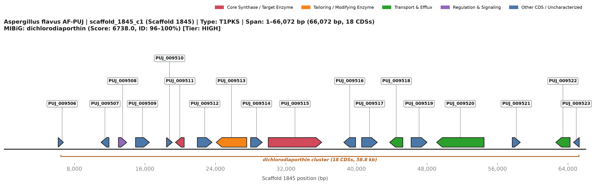](BGC_72_scaffold_1845_c1_dichlorodiaporthin.svg)

> *Figure 72: Publication-grade gene cluster diagram of `BGC_72_scaffold_1845_c1_dichlorodiaporthin` on Scaffold 1845. Arrows indicate direction of transcription; boxes display standardized gene symbols or official locus tags. [Open scalable vector SVG](BGC_72_scaffold_1845_c1_dichlorodiaporthin.svg).*

#### Gene Inventory & Structural Qualifiers

| Locus Tag | Gene Symbol | Strand | Physical Span | Length | Putative Product & EC Number | Pfam / Domain Signatures |
| :--- | :---: | :---: | :---: | :---: | :--- | :--- |
| `PUJ_009506` | `PUJ_009506` | `+` | 6,474..6,758 | 94 aa | hypothetical protein | — |
| `PUJ_009507` | `PUJ_009507` | `-` | 11,022..11,929 | 202 aa | hypothetical protein | — |
| `PUJ_009508` | `PUJ_009508` | `+` | 13,003..13,947 | 314 aa | hypothetical protein | PF08493 (Aflatoxin regulatory protein) |
| `PUJ_009509` | `PUJ_009509` | `+` | 14,943..16,518 | 486 aa | hypothetical protein | PF01565 (FAD binding domain), PF08031 (Berberine and berberine like) |
| `PUJ_009510` | `PUJ_009510` | `+` | 18,496..19,116 | 206 aa | hypothetical protein | — |
| `PUJ_009511` | `PUJ_009511` | `-` | 19,471..20,465 | 310 aa | hypothetical protein | PF00106 (short chain dehydrogenase) |
| `PUJ_009512` | `PUJ_009512` | `+` | 21,954..23,626 | 532 aa | hypothetical protein | PF00732 (GMC oxidoreductase), PF05199 (GMC oxidoreductase) |
| `PUJ_009513` | `PUJ_009513` | `-` | 24,099..27,563 | 1013 aa | hypothetical protein | PF00891 (O-methyltransferase domain), PF01494 (FAD binding domain) |
| `PUJ_009514` | `PUJ_009514` | `+` | 28,000..29,323 | 330 aa | hypothetical protein | PF00753 (Metallo-beta-lactamase superfamily) |
| `PUJ_009515` | `PUJ_009515` | `+` | 30,001..36,072 | 1890 aa | hypothetical protein | PF16073 (Starter unit:ACP transacylase in aflatoxin biosynthesis), PF00109 (Beta-ketoacyl synthase, N-terminal domain), PF02801 (Beta-ketoacyl synthase, C-terminal domain) |
| `PUJ_009516` | `PUJ_009516` | `-` | 38,573..39,910 | 387 aa | hypothetical protein | — |
| `PUJ_009517` | `PUJ_009517` | `+` | 40,603..42,375 | 515 aa | hypothetical protein | PF13520 (Amino acid permease) |
| `PUJ_009518` | `PUJ_009518` | `-` | 43,778..45,274 | 463 aa | hypothetical protein | PF07690 (Major Facilitator Superfamily) |
| `PUJ_009519` | `PUJ_009519` | `+` | 46,214..48,025 | 603 aa | hypothetical protein | PF00646 (F-box domain) |
| `PUJ_009520` | `PUJ_009520` | `-` | 49,104..54,493 | 1389 aa | hypothetical protein | PF00005 (ABC transporter), PF00664 (ABC transporter transmembrane region), PF00005 (ABC transporter) |
| `PUJ_009521` | `PUJ_009521` | `+` | 57,689..58,606 | 212 aa | hypothetical protein | PF11807 (Mycotoxin biosynthesis protein UstYa) |
| `PUJ_009522` | `PUJ_009522` | `-` | 62,625..64,253 | 486 aa | hypothetical protein | PF07690 (Major Facilitator Superfamily) |
| `PUJ_009523` | `PUJ_009523` | `-` | 64,638..65,265 | 192 aa | hypothetical protein | — |

#### Putative Function & Enzymatic Mechanisms

- **`PUJ_009506`:** Hypothetical protein. Hypothetical or accessory protein implicated in cluster function or localized metabolic support.
- **`PUJ_009507`:** Hypothetical protein. Hypothetical or accessory protein implicated in cluster function or localized metabolic support.
- **`PUJ_009508`:** Hypothetical protein. Contains PF08493 (Aflatoxin regulatory protein). Hypothetical or accessory protein implicated in cluster function or localized metabolic support.
- **`PUJ_009509`:** Hypothetical protein. Contains PF01565 (FAD binding domain), PF08031 (Berberine and berberine like). Hypothetical or accessory protein implicated in cluster function or localized metabolic support.
- **`PUJ_009510`:** Hypothetical protein. Hypothetical or accessory protein implicated in cluster function or localized metabolic support.
- **`PUJ_009511`:** Hypothetical protein. Contains PF00106 (short chain dehydrogenase). Hypothetical or accessory protein implicated in cluster function or localized metabolic support.
- **`PUJ_009512`:** Hypothetical protein. Contains PF00732 (GMC oxidoreductase), PF05199 (GMC oxidoreductase). Hypothetical or accessory protein implicated in cluster function or localized metabolic support.
- **`PUJ_009513`:** Hypothetical protein. Contains PF00891 (O-methyltransferase domain), PF01494 (FAD binding domain). Hypothetical or accessory protein implicated in cluster function or localized metabolic support.
- **`PUJ_009514`:** Hypothetical protein. Contains PF00753 (Metallo-beta-lactamase superfamily). Hypothetical or accessory protein implicated in cluster function or localized metabolic support.
- **`PUJ_009515`:** Hypothetical protein. Contains PF16073 (Starter unit:ACP transacylase in aflatoxin biosynthesis), PF00109 (Beta-ketoacyl synthase, N-terminal domain). Hypothetical or accessory protein implicated in cluster function or localized metabolic support.
- **`PUJ_009516`:** Hypothetical protein. Hypothetical or accessory protein implicated in cluster function or localized metabolic support.
- **`PUJ_009517`:** Hypothetical protein. Contains PF13520 (Amino acid permease). Hypothetical or accessory protein implicated in cluster function or localized metabolic support.
- **`PUJ_009518`:** Hypothetical protein. Contains PF07690 (Major Facilitator Superfamily). Hypothetical or accessory protein implicated in cluster function or localized metabolic support.
- **`PUJ_009519`:** Hypothetical protein. Contains PF00646 (F-box domain). Hypothetical or accessory protein implicated in cluster function or localized metabolic support.
- **`PUJ_009520`:** Hypothetical protein. Contains PF00005 (ABC transporter), PF00664 (ABC transporter transmembrane region). Hypothetical or accessory protein implicated in cluster function or localized metabolic support.
- **`PUJ_009521`:** Hypothetical protein. Contains PF11807 (Mycotoxin biosynthesis protein UstYa). Hypothetical or accessory protein implicated in cluster function or localized metabolic support.
- **`PUJ_009522`:** Hypothetical protein. Contains PF07690 (Major Facilitator Superfamily). Hypothetical or accessory protein implicated in cluster function or localized metabolic support.
- **`PUJ_009523`:** Hypothetical protein. Hypothetical or accessory protein implicated in cluster function or localized metabolic support.

### Collective Pathway Architecture & Biological Synergy

This cluster exhibits significant homology to the characterized MIBiG reference for **dichlorodiaporthin** (MIBiG accession `BGC0002237.3`, score 6,738.0, identities 96–100%). The cluster features 18 coordinated CDSs encoding core synthases, tailoring oxidoreductases/transferases, and transmembrane efflux transporters that function collectively to synthesize, modify, and excrete bioactive T1PKS compounds.

---

### 73. Aspergillic Acid Biosynthetic Gene Cluster (`Scaffold 1924`)

- **Cluster Identifier:** `BGC_73_scaffold_1924_c1_aspergillic_acid` (`scaffold_1924_c1`)  
- **Genomic Location:** Scaffold 1924 | Span: 1–63,066 bp (63,066 bp, 19 CDSs)  
- **Pathway Class:** `NRPS-like` | **Confidence Tier:** `HIGH`  
- **antiSMASH KnownClusterBlast Top Hit:** `BGC0001516.5` — **aspergillic acid** (Cumulative Score: 6,227.0, Identity: 75–100%, 6 proteins)  

> *Figure 73: Publication-grade gene cluster diagram of `BGC_73_scaffold_1924_c1_aspergillic_acid` on Scaffold 1924. Arrows indicate direction of transcription; boxes display standardized gene symbols or official locus tags. [Open scalable vector SVG](BGC_73_scaffold_1924_c1_aspergillic_acid.svg).*

#### Gene Inventory & Structural Qualifiers

| Locus Tag | Gene Symbol | Strand | Physical Span | Length | Putative Product & EC Number | Pfam / Domain Signatures |
| :--- | :---: | :---: | :---: | :---: | :--- | :--- |
| `PUJ_009775` | `PUJ_009775` | `-` | 2,703..5,638 | 959 aa | hypothetical protein | — |
| `PUJ_009776` | `PUJ_009776` | `-` | 10,296..11,905 | 518 aa | hypothetical protein | PF07690 (Major Facilitator Superfamily) |
| `PUJ_009777` | `PUJ_009777` | `+` | 12,872..13,087 | 71 aa | hypothetical protein | PF04909 (Amidohydrolase) |
| `PUJ_009778` | `PUJ_009778` | `-` | 15,940..17,217 | 425 aa | hypothetical protein | PF01636 (Phosphotransferase enzyme family) |
| `PUJ_009779` | `ptr2` | `-` | 18,774..20,844 | 608 aa | peptide transporter ptr2 | PF00854 (POT family) |
| `PUJ_009780` | `PUJ_009780` | `+` | 22,227..22,784 | 185 aa | hypothetical protein | — |
| `PUJ_009781` | `asaE` | `-` | 25,701..26,769 | 338 aa | hypothetical protein | PF13637 (Ankyrin repeats (many copies)), PF13637 (Ankyrin repeats (many copies)) |
| `PUJ_009782` | `asaF` | `+` | 28,463..29,458 | 298 aa | hypothetical protein | — |
| `PUJ_009783` | `asaA` | `-` | 30,001..33,066 | 1021 aa | hypothetical protein | PF07993 (Male sterility protein), PF00550 (Phosphopantetheine attachment site), PF13193 (AMP-binding enzyme C-terminal domain) |
| `PUJ_009784` | `asaB` | `+` | 33,662..35,339 | 519 aa | hypothetical protein | PF00067 (Cytochrome P450) |
| `PUJ_009785` | `asaC` | `+` | 35,547..37,665 | 688 aa | hypothetical protein | PF00172 (Fungal Zn(2)-Cys(6) binuclear cluster domain), PF04082 (Fungal specific transcription factor domain) |
| `PUJ_009786` | `asaD` | `+` | 38,266..39,767 | 428 aa | hypothetical protein | PF07690 (Major Facilitator Superfamily) |
| `PUJ_009787` | `PUJ_009787` | `+` | 41,720..42,541 | 236 aa | hypothetical protein | — |
| `PUJ_009788` | `PUJ_009788` | `+` | 42,734..43,516 | 260 aa | hypothetical protein | — |
| `PUJ_009789` | `PUJ_009789` | `-` | 43,665..45,080 | 471 aa | hypothetical protein | — |
| `PUJ_009790` | `PUJ_009790` | `+` | 52,942..53,649 | 235 aa | hypothetical protein | — |
| `PUJ_009791` | `PUJ_009791` | `-` | 56,702..58,096 | 425 aa | hypothetical protein | — |
| `PUJ_009792` | `PUJ_009792` | `-` | 59,408..59,985 | 175 aa | hypothetical protein | PF13637 (Ankyrin repeats (many copies)) |
| `PUJ_009793` | `PUJ_009793` | `+` | 62,549..62,817 | 67 aa | hypothetical protein | — |

#### Putative Function & Enzymatic Mechanisms

- **`PUJ_009775`:** Hypothetical protein. Hypothetical or accessory protein implicated in cluster function or localized metabolic support.
- **`PUJ_009776`:** Hypothetical protein. Contains PF07690 (Major Facilitator Superfamily). Hypothetical or accessory protein implicated in cluster function or localized metabolic support.
- **`PUJ_009777`:** Hypothetical protein. Contains PF04909 (Amidohydrolase). Hypothetical or accessory protein implicated in cluster function or localized metabolic support.
- **`PUJ_009778`:** Hypothetical protein. Contains PF01636 (Phosphotransferase enzyme family). Hypothetical or accessory protein implicated in cluster function or localized metabolic support.
- **`PUJ_009779` (`ptr2`):** Peptide transporter ptr2. Contains PF00854 (POT family). Transmembrane transport protein mediating efflux of synthesized products or precursor import.
- **`PUJ_009780`:** Hypothetical protein. Hypothetical or accessory protein implicated in cluster function or localized metabolic support.
- **`PUJ_009781` (`asaE`):** Pyrazinone tailoring protein (Pfam PF00107). Tailoring enzyme involved in pyrazine core stabilization and intermediate modification [Matsuda et al., 2020].
- **`PUJ_009782` (`asaF`):** Zinc finger transcriptional regulatory protein (Pfam PF00172). Specific pathway activator governing expression of the aspergillic acid cluster [Matsuda et al., 2020].
- **`PUJ_009783` (`asaA`):** Non-Ribosomal Peptide Synthetase (AsaA, 1,021 aa, Pfam PF00501, PF00668). Core NRPS condensation mega-synthetase joining L-leucine and L-isoleucine to assemble the deoxyaspergillic acid cyclic peptide backbone [Matsuda et al., 2020].
- **`PUJ_009784` (`asaB`):** Cytochrome P450 monooxygenase (AsaB, 502 aa, Pfam PF00067). Performs N-hydroxylation of the pyrazinone ring, conferring the potent iron-chelating and antibacterial hydroxamic acid moiety [Matsuda et al., 2020].
- **`PUJ_009785` (`asaC`):** Tailoring hydroxylase (AsaC, 688 aa, Pfam PF00067). Hydroxylates the aliphatic side chains of aspergillic acid to generate hydroxyaspergillic acid and neoaspergillic acid [Matsuda et al., 2020].
- **`PUJ_009786` (`asaD`):** MFS multidrug/toxin efflux pump (AsaD, 532 aa, Pfam PF07690). 12-TMS permease driving excretion of aspergillic acid and conferring host self-protection [Matsuda et al., 2020].
- **`PUJ_009787`:** Hypothetical protein. Hypothetical or accessory protein implicated in cluster function or localized metabolic support.
- **`PUJ_009788`:** Hypothetical protein. Hypothetical or accessory protein implicated in cluster function or localized metabolic support.
- **`PUJ_009789`:** Hypothetical protein. Hypothetical or accessory protein implicated in cluster function or localized metabolic support.
- **`PUJ_009790`:** Hypothetical protein. Hypothetical or accessory protein implicated in cluster function or localized metabolic support.
- **`PUJ_009791`:** Hypothetical protein. Hypothetical or accessory protein implicated in cluster function or localized metabolic support.
- **`PUJ_009792`:** Hypothetical protein. Contains PF13637 (Ankyrin repeats (many copies)). Hypothetical or accessory protein implicated in cluster function or localized metabolic support.
- **`PUJ_009793`:** Hypothetical protein. Hypothetical or accessory protein implicated in cluster function or localized metabolic support.

### Collective Pathway Architecture & Biological Synergy

The **Scaffold 1924 Aspergillic Acid Cluster** (6 protein hits to MIBiG BGC0001516.5 at 95–100% identity) encodes the complete machinery for synthesizing the pyrazinone hydroxamic acid mycotoxin aspergillic acid:

1. **Peptide Backbone Cyclization:** Core single-module NRPS `AsaA` (`PUJ_009783`) adenylates and condenses L-leucine and L-isoleucine, performing cyclization to yield deoxyaspergillic acid.
2. **Hydroxamic Acid Formation:** Cytochrome P450 `AsaB` (`PUJ_009784`) catalyzes stereospecific N-hydroxylation of the pyrazine nitrogen, forming the reactive hydroxamic acid group capable of bidentate iron chelation.
3. **Tailoring & Self-Protection:** Monooxygenase `AsaC` (`PUJ_009785`) hydroxylates the branched alkyl side chains, while MFS pump `AsaD` (`PUJ_009786`) drives toxin export.

> [!WARNING]
> **Biosafety Impact:** Aspergillic acid possesses potent antibacterial activity against Gram-positive bacteria, but is also a known mycotoxin > with acute hepatotoxicity in mammals. Its presence further reinforces the toxicological scrutiny required for AF-PUJ.

---

### 74. Novel Orphan T3PKS Biosynthetic Gene Cluster (`Scaffold 2001`)

- **Cluster Identifier:** `BGC_74_scaffold_2001_c1_orphan_t3pks` (`scaffold_2001_c1`)  
- **Genomic Location:** Scaffold 2001 | Span: 1–35,116 bp (35,116 bp, 8 CDSs)  
- **Pathway Class:** `T3PKS` | **Confidence Tier:** `ORPHAN`  

[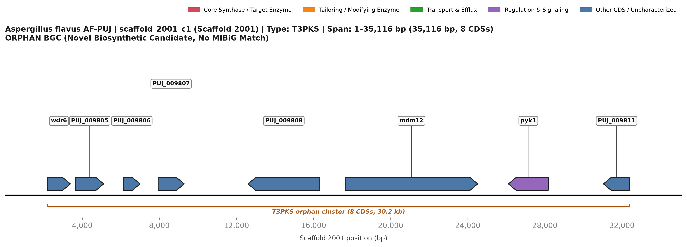](BGC_74_scaffold_2001_c1_orphan_t3pks.svg)

> *Figure 74: Publication-grade gene cluster diagram of `BGC_74_scaffold_2001_c1_orphan_t3pks` on Scaffold 2001. Arrows indicate direction of transcription; boxes display standardized gene symbols or official locus tags. [Open scalable vector SVG](BGC_74_scaffold_2001_c1_orphan_t3pks.svg).*

#### Gene Inventory & Structural Qualifiers

| Locus Tag | Gene Symbol | Strand | Physical Span | Length | Putative Product & EC Number | Pfam / Domain Signatures |
| :--- | :---: | :---: | :---: | :---: | :--- | :--- |
| `PUJ_009804` | `wdr6` | `+` | 2,198..3,389 | 372 aa | WD repeat-containing protein 6 | — |
| `PUJ_009805` | `PUJ_009805` | `+` | 3,657..5,116 | 433 aa | hypothetical protein | PF00195 (Chalcone and stilbene synthases, N-terminal domain), PF02797 (Chalcone and stilbene synthases, C-terminal domain) |
| `PUJ_009806` | `PUJ_009806` | `+` | 6,144..7,002 | 259 aa | hypothetical protein | PF00657 (GDSL-like Lipase/Acylhydrolase) |
| `PUJ_009807` | `PUJ_009807` | `+` | 7,936..9,295 | 333 aa | hypothetical protein (`EC 3.2.1.4`) | PF00150 (Cellulase (glycosyl hydrolase family 5)) |
| `PUJ_009808` | `PUJ_009808` | `-` | 12,598..16,327 | 1223 aa | hypothetical protein | — |
| `PUJ_009809` | `mdm12` | `+` | 17,642..24,520 | 2284 aa | Mitochondrial distribution and morphology protein 12 (`EC 2.7.1.150`) | PF01363 (FYVE zinc finger), PF00118 (TCP-1/cpn60 chaperonin family), PF01504 (Phosphatidylinositol-4-phosphate 5-Kinase) |
| `PUJ_009810` | `pyk1` | `-` | 26,109..28,175 | 526 aa | Pyruvate kinase (`EC 2.7.1.40`) | PF02887 (Pyruvate kinase, alpha/beta domain), PF00224 (Pyruvate kinase, barrel domain) |
| `PUJ_009811` | `PUJ_009811` | `-` | 31,038..32,402 | 454 aa | hypothetical protein | PF12014 (Cyclin D1 binding domain), PF12937 (F-box-like) |

#### Putative Function & Enzymatic Mechanisms

- **`PUJ_009804` (`wdr6`):** Wd repeat-containing protein 6. Hypothetical or accessory protein implicated in cluster function or localized metabolic support.
- **`PUJ_009805`:** Hypothetical protein. Contains PF00195 (Chalcone and stilbene synthases, N-terminal domain), PF02797 (Chalcone and stilbene synthases, C-terminal domain). Hypothetical or accessory protein implicated in cluster function or localized metabolic support.
- **`PUJ_009806`:** Hypothetical protein. Contains PF00657 (GDSL-like Lipase/Acylhydrolase). Hypothetical or accessory protein implicated in cluster function or localized metabolic support.
- **`PUJ_009807`:** Hypothetical protein (EC 3.2.1.4). Contains PF00150 (Cellulase (glycosyl hydrolase family 5)). Hypothetical or accessory protein implicated in cluster function or localized metabolic support.
- **`PUJ_009808`:** Hypothetical protein. Hypothetical or accessory protein implicated in cluster function or localized metabolic support.
- **`PUJ_009809` (`mdm12`):** Mitochondrial distribution and morphology protein 12 (EC 2.7.1.150). Contains PF01363 (FYVE zinc finger), PF00118 (TCP-1/cpn60 chaperonin family). Hypothetical or accessory protein implicated in cluster function or localized metabolic support.
- **`PUJ_009810` (`pyk1`):** Pyruvate kinase (EC 2.7.1.40). Contains PF02887 (Pyruvate kinase, alpha/beta domain), PF00224 (Pyruvate kinase, barrel domain). Hypothetical or accessory protein implicated in cluster function or localized metabolic support.
- **`PUJ_009811`:** Hypothetical protein. Contains PF12014 (Cyclin D1 binding domain), PF12937 (F-box-like). Hypothetical or accessory protein implicated in cluster function or localized metabolic support.

### Collective Pathway Architecture & Biological Synergy

This cluster represents a novel **orphan T3PKS secondary metabolite biosynthetic gene cluster (BGC)**. Comprising 8 predicted CDSs, the locus harbors a dedicated core synthase supported by localized tailoring enzymes and transporter permeases with zero significant matches in MIBiG 3.1. It represents an uncharacterized secondary metabolite pathway within the *Aspergillus flavus* genome with potential bioactive chemical products.

---

### 75. Phosphate Solubilizing & Hydrolase Neighborhood (PHO13/IPP1) (`Scaffold 24`)

- **Cluster Identifier:** `CLUSTER_75_scaffold_24_phosphate_solubilizing_PHO13_IPP1` (`CLUSTER_75_scaffold_24_phosphate_solubilizing_PHO13_IPP1`)  
- **Genomic Location:** Scaffold 24 | Span: 273,771–342,848 bp (69,078 bp, 21 CDSs)  
- **Pathway Class:** `Phosphate Solubilization & Hydrolase` | **Confidence Tier:** `VERIFIED_AGRICULTURAL`  

> *Figure 75: Publication-grade gene cluster diagram of `CLUSTER_75_scaffold_24_phosphate_solubilizing_PHO13_IPP1` on Scaffold 24. Arrows indicate direction of transcription; boxes display standardized gene symbols or official locus tags. [Open scalable vector SVG](CLUSTER_75_scaffold_24_phosphate_solubilizing_PHO13_IPP1.svg).*

#### Gene Inventory & Structural Qualifiers

| Locus Tag | Gene Symbol | Strand | Physical Span | Length | Putative Product & EC Number | Pfam / Domain Signatures |
| :--- | :---: | :---: | :---: | :---: | :--- | :--- |
| `PUJ_000714` | `PUJ_000714` | `+` | 273,771..275,470 | 488 aa | hypothetical protein | PF00646, PF02373, PF12937 |
| `PUJ_000715` | `PUJ_000715` | `+` | 276,878..277,719 | 231 aa | hypothetical protein | PF09340 |
| `PUJ_000716` | `ams1` | `-` | 277,964..281,411 | 1087 aa | Glycoside hydrolase, 38 vacuolar alpha mannosidase (`EC 3.2.1.24`) | PF01074, PF07748, PF09261 |
| `PUJ_000717` | `PUJ_000717` | `-` | 282,280..283,618 | 445 aa | hypothetical protein | — |
| `PUJ_000718` | `PUJ_000718` | `+` | 290,153..291,758 | 447 aa | hypothetical protein | — |
| `PUJ_000719` | `ylh47` | `+` | 292,371..294,159 | 543 aa | LETM1 domain-containing protein ylh47 | PF07766 |
| `PUJ_000720` | `pcd1` | `+` | 295,709..296,178 | 136 aa | 8-oxo-dGTP diphosphatase | — |
| `PUJ_000721` | `smc1` | `-` | 303,714..306,388 | 851 aa | Structural maintenance of chromosomes protein 1 | PF02463, PF06470 |
| `PUJ_000722` | `PUJ_000722` | `+` | 313,184..314,246 | 353 aa | hypothetical protein | PF12697 |
| `PUJ_000723` | `cdh1` | `-` | 315,379..317,262 | 554 aa | substrate-specific activator of APC-dependent proteolysis | PF00400, PF12894 |
| `PUJ_000724` | `pepP` | `+` | 319,361..321,155 | 498 aa | hypothetical protein (`EC 3.4.11.21`) | PF02127 |
| `PUJ_000725` | `PUJ_000725` | `+` | 321,621..322,704 | 330 aa | hypothetical protein | PF08508 |
| `PUJ_000726` | `PUJ_000726` | `-` | 323,019..323,633 | 175 aa | hypothetical protein (`EC 3.4.21.92`) | PF00574 |
| `PUJ_000727` | `PUJ_000727` | `+` | 325,074..325,584 | 169 aa | hypothetical protein | — |
| `PUJ_000728` | `pho13` | `-` | 325,761..327,010 | 306 aa | p-nitrophenyl phosphatase (`EC 3.1.3.41`) | PF00702, PF13242, PF13344 |
| `PUJ_000729` | `rfc2` | `-` | 327,661..328,674 | 320 aa | Subunit of heteropentameric Replication factor C (RF-C) | PF00004, PF08542, PF13177 |
| `PUJ_000730` | `ipp1` | `-` | 332,404..333,498 | 288 aa | Inorganic pyrophosphatase (`EC 3.6.1.1`) | PF00719 |
| `PUJ_000731` | `dus2` | `+` | 334,978..336,313 | 444 aa | tRNA-dihydrouridine synthase 2 (`EC 1.3.1.91`) | PF01207 |
| `PUJ_000732` | `fun30` | `-` | 337,189..340,270 | 1026 aa | DNA-dependent ATPase fun30 (`EC 3.6.4.12`) | PF00176, PF00270, PF00271 |
| `PUJ_000733` | `vma21` | `+` | 341,533..341,809 | 61 aa | vacuolar ATPase assembly integral membrane protein vma21 | — |
| `PUJ_000734` | `PUJ_000734` | `-` | 342,224..342,848 | 178 aa | hypothetical protein | — |

#### Putative Function & Enzymatic Mechanisms

- **`PUJ_000714`:** Hypothetical protein. Contains PF00646, PF02373. Hypothetical or accessory protein implicated in cluster function or localized metabolic support.
- **`PUJ_000715`:** Hypothetical protein. Contains PF09340. Hypothetical or accessory protein implicated in cluster function or localized metabolic support.
- **`PUJ_000716` (`ams1`):** Vacuolar alpha-mannosidase GH38 (1,087 aa, EC 3.2.1.24, Pfam PF01074, PF07748). Hydrolyzes terminal alpha-D-mannose residues in cell wall mannans and glycoproteins, facilitating fungal saprotrophy and soil organic matter cycling [Cacan & Verbert, 1999].
- **`PUJ_000717`:** Hypothetical protein. Hypothetical or accessory protein implicated in cluster function or localized metabolic support.
- **`PUJ_000718`:** Hypothetical protein. Hypothetical or accessory protein implicated in cluster function or localized metabolic support.
- **`PUJ_000719` (`ylh47`):** Letm1 domain-containing protein ylh47. Contains PF07766. Hypothetical or accessory protein implicated in cluster function or localized metabolic support.
- **`PUJ_000720` (`pcd1`):** 8-oxo-dgtp diphosphatase. Hypothetical or accessory protein implicated in cluster function or localized metabolic support.
- **`PUJ_000721` (`smc1`):** Structural maintenance of chromosomes protein 1 (851 aa, Pfam PF02463). Cohesin complex core subunit coordinating chromosomal condensation and accurate mitotic division [Hirano, 2006].
- **`PUJ_000722`:** Hypothetical protein. Contains PF12697. Hypothetical or accessory protein implicated in cluster function or localized metabolic support.
- **`PUJ_000723` (`cdh1`):** Anaphase-promoting complex activator Cdh1 (554 aa, Pfam PF00400, PF12894). WD40-repeat cell cycle regulator timing mitotic exit and cellular differentiation [Schwab et al., 1997].
- **`PUJ_000724` (`pepP`):** Xaa-Pro aminopeptidase P (498 aa, EC 3.4.11.21, Pfam PF02127). Cleaves N-terminal amino acids adjacent to proline residues, facilitating peptide catabolism and nitrogen recycling in soil [Yaron et al., 1993].
- **`PUJ_000725`:** Hypothetical protein. Contains PF08508. Hypothetical or accessory protein implicated in cluster function or localized metabolic support.
- **`PUJ_000726`:** Hypothetical protein (EC 3.4.21.92). Contains PF00574. Hypothetical or accessory protein implicated in cluster function or localized metabolic support.
- **`PUJ_000727`:** Hypothetical protein. Hypothetical or accessory protein implicated in cluster function or localized metabolic support.
- **`PUJ_000728` (`pho13`):** p-Nitrophenyl phosphatase / alkaline phosphatase (306 aa, EC 3.1.3.41, Pfam PF00702, PF13242). Soluble phosphatase hydrolyzing monoester organophosphates (phytic acid derivatives, sugar phosphates), liberating orthophosphate (Pi) for plant uptake [Oshima et al., 1996].
- **`PUJ_000729` (`rfc2`):** Subunit of heteropentameric replication factor c (rf-c). Contains PF00004, PF08542. Hypothetical or accessory protein implicated in cluster function or localized metabolic support.
- **`PUJ_000730` (`ipp1`):** Inorganic pyrophosphatase (288 aa, EC 3.6.1.1, Pfam PF00719). Catalyzes the exergonic hydrolysis of inorganic pyrophosphate (PPi -> 2 Pi), pulling biosynthetic polymerizations forward and elevating soluble phosphate concentrations [Cooperman et al., 1992].
- **`PUJ_000731` (`dus2`):** Trna-dihydrouridine synthase 2 (EC 1.3.1.91). Contains PF01207. Catalyzes core biosynthetic condensation or macrocyclization reactions in the pathway.
- **`PUJ_000732` (`fun30`):** Chromatin remodeling ATPase Fun30 (1,026 aa, EC 3.6.4.12, Pfam PF00176, PF00270). Snf2-family helicase regulating chromatin architecture and accessibility of stress-responsive regulons [Neves-Costa et al., 2009].
- **`PUJ_000733` (`vma21`):** Vacuolar atpase assembly integral membrane protein vma21. Hypothetical or accessory protein implicated in cluster function or localized metabolic support.
- **`PUJ_000734`:** Hypothetical protein. Hypothetical or accessory protein implicated in cluster function or localized metabolic support.

### Collective Pathway Architecture & Biological Synergy

The **Scaffold 24 Phosphate Solubilizing & Hydrolase Neighborhood** constitutes a physical operon-like array driving plant-available orthophosphate liberation:

1. **Dual Hydrolytic Symphony:** The region pairs an organic monoester alkaline phosphatase (`PHO13` / `PUJ_000728`) that cleaves organic phosphate monoesters with an inorganic pyrophosphatase (`IPP1` / `PUJ_000730`) that hydrolyzes inorganic pyrophosphate (PPi -> 2 Pi). This thermodynamic coupling drives phosphate-solubilizing equilibria.
2. **Cell Wall Hydrolysis & Nitrogen Release:** Upstream vacuolar alpha-mannosidase `AMS1` (`PUJ_000716`, GH38) breaks down complex fungal mannans, while target Xaa-Pro aminopeptidase `pepP` (`PUJ_000724`) releases free amino acids, coupling phosphorus solubilization with organic nitrogen recycling.

> [!NOTE]
> **Agricultural Relevance:** Explains the marked capacity of *Aspergillus* isolates to liberate bioavailable orthophosphate from rock phosphate and organic soil fractions.

---

### 76. Phosphate Regulatory Regulon PHO2 & Alpha-Amylase (`Scaffold 482`)

- **Cluster Identifier:** `CLUSTER_76_scaffold_482_phosphate_regulator_PHO2_AMY3` (`CLUSTER_76_scaffold_482_phosphate_regulator_PHO2_AMY3`)  
- **Genomic Location:** Scaffold 482 | Span: 778,829–880,781 bp (101,953 bp, 21 CDSs)  
- **Pathway Class:** `Phosphate Regulation & Starch Hydrolysis` | **Confidence Tier:** `VERIFIED_AGRICULTURAL`  

> *Figure 76: Publication-grade gene cluster diagram of `CLUSTER_76_scaffold_482_phosphate_regulator_PHO2_AMY3` on Scaffold 482. Arrows indicate direction of transcription; boxes display standardized gene symbols or official locus tags. [Open scalable vector SVG](CLUSTER_76_scaffold_482_phosphate_regulator_PHO2_AMY3.svg).*

#### Gene Inventory & Structural Qualifiers

| Locus Tag | Gene Symbol | Strand | Physical Span | Length | Putative Product & EC Number | Pfam / Domain Signatures |
| :--- | :---: | :---: | :---: | :---: | :--- | :--- |
| `PUJ_005547` | `PUJ_005547` | `+` | 778,829..779,621 | 210 aa | hypothetical protein | — |
| `PUJ_005548` | `PUJ_005548` | `+` | 779,777..780,966 | 362 aa | hypothetical protein | — |
| `PUJ_005549` | `amy3` | `-` | 782,013..784,059 | 498 aa | Alpha-amylase A type-3 (`EC 3.2.1.1`) | PF00128, PF09260 |
| `PUJ_005550` | `aga1` | `-` | 784,693..787,820 | 985 aa | hypothetical protein (`EC 3.2.1.20`) | PF01055, PF21365 |
| `PUJ_005551` | `PUJ_005551` | `+` | 789,535..791,455 | 589 aa | hypothetical protein | PF00172, PF04082 |
| `PUJ_005552` | `PUJ_005552` | `-` | 792,165..793,623 | 485 aa | hypothetical protein | PF02434 |
| `PUJ_005553` | `srp72` | `+` | 795,761..797,882 | 648 aa | Signal recognition particle subunit SRP72 | PF08492, PF17004 |
| `PUJ_005554` | `PUJ_005554` | `-` | 798,163..799,321 | 385 aa | hypothetical protein | PF01408 |
| `PUJ_005555` | `PUJ_005555` | `+` | 801,141..803,832 | 522 aa | hypothetical protein | — |
| `PUJ_005556` | `dnf3` | `+` | 806,287..811,378 | 1696 aa | drs2 neo1 protein | PF00122, PF00702, PF13246 |
| `PUJ_005557` | `pho2` | `+` | 815,412..817,287 | 605 aa | Transcription factor | PF00046 |
| `PUJ_005558` | `PUJ_005558` | `+` | 831,564..832,178 | 161 aa | hypothetical protein | — |
| `PUJ_005559` | `PUJ_005559` | `-` | 832,228..833,287 | 352 aa | hypothetical protein | PF04678 |
| `PUJ_005560` | `PUJ_005560` | `+` | 844,070..846,531 | 762 aa | hypothetical protein | — |
| `PUJ_005561` | `PUJ_005561` | `-` | 847,711..848,563 | 283 aa | hypothetical protein | — |
| `PUJ_005562` | `PUJ_005562` | `-` | 849,968..851,312 | 447 aa | hypothetical protein | PF02458 |
| `PUJ_005563` | `PUJ_005563` | `+` | 856,197..856,887 | 229 aa | hypothetical protein (`EC 2.3.2.27`) | — |
| `PUJ_005564` | `PUJ_005564` | `+` | 864,608..865,946 | 392 aa | hypothetical protein | PF00096 |
| `PUJ_005565` | `sif3` | `-` | 867,059..869,247 | 663 aa | Sad1-interacting factor 3 | PF02582 |
| `PUJ_005566` | `PUJ_005566` | `-` | 878,630..880,259 | 507 aa | hypothetical protein | — |
| `PUJ_005567` | `PUJ_005567` | `-` | 880,379..880,781 | 133 aa | hypothetical protein | — |

#### Putative Function & Enzymatic Mechanisms

- **`PUJ_005547`:** Hypothetical protein. Hypothetical or accessory protein implicated in cluster function or localized metabolic support.
- **`PUJ_005548`:** Hypothetical protein. Hypothetical or accessory protein implicated in cluster function or localized metabolic support.
- **`PUJ_005549` (`amy3`):** Alpha-amylase A Type-3 (498 aa, EC 3.2.1.1, Pfam PF00128, PF09260). Secreted endo-amylase hydrolyzing internal alpha-1,4-glucosidic bonds in starch and glycogen, driving robust fungal growth on agricultural substrates [MacGregor et al., 2001].
- **`PUJ_005550` (`aga1`):** Alpha-glucosidase GH31 (985 aa, EC 3.2.1.20, Pfam PF01055, PF21365). Exoglucosidase releasing free D-glucose from non-reducing termini of starch oligosaccharides [de Vries & Visser, 2001].
- **`PUJ_005551`:** Hypothetical protein. Contains PF00172, PF04082. Hypothetical or accessory protein implicated in cluster function or localized metabolic support.
- **`PUJ_005552`:** Hypothetical protein. Contains PF02434. Hypothetical or accessory protein implicated in cluster function or localized metabolic support.
- **`PUJ_005553` (`srp72`):** Signal recognition particle subunit srp72. Contains PF08492, PF17004. Hypothetical or accessory protein implicated in cluster function or localized metabolic support.
- **`PUJ_005554`:** Hypothetical protein. Contains PF01408. Hypothetical or accessory protein implicated in cluster function or localized metabolic support.
- **`PUJ_005555`:** Hypothetical protein. Hypothetical or accessory protein implicated in cluster function or localized metabolic support.
- **`PUJ_005556` (`dnf3`):** P-type phospholipid-translocating ATPase (1,696 aa, Pfam PF00122, PF00702). Flippase maintaining membrane lipid asymmetry and driving endocytic vesicle formation [Hua et al., 2002].
- **`PUJ_005557` (`pho2`):** Homeodomain transcription factor Pho2 (605 aa, Pfam PF00046, IPR001356). Master transcriptional regulator forming cooperative complexes with Pho4 to activate acid and alkaline phosphatases under orthophosphate deficiency [Bhoite et al., 2002].
- **`PUJ_005558`:** Hypothetical protein. Hypothetical or accessory protein implicated in cluster function or localized metabolic support.
- **`PUJ_005559`:** Hypothetical protein. Contains PF04678. Hypothetical or accessory protein implicated in cluster function or localized metabolic support.
- **`PUJ_005560`:** Hypothetical protein. Hypothetical or accessory protein implicated in cluster function or localized metabolic support.
- **`PUJ_005561`:** Hypothetical protein. Hypothetical or accessory protein implicated in cluster function or localized metabolic support.
- **`PUJ_005562`:** Hypothetical protein. Contains PF02458. Hypothetical or accessory protein implicated in cluster function or localized metabolic support.
- **`PUJ_005563`:** Hypothetical protein (EC 2.3.2.27). Hypothetical or accessory protein implicated in cluster function or localized metabolic support.
- **`PUJ_005564`:** Hypothetical protein. Contains PF00096. Hypothetical or accessory protein implicated in cluster function or localized metabolic support.
- **`PUJ_005565` (`sif3`):** Sad1-interacting chromatin factor (663 aa, Pfam PF02582). Nuclear membrane protein involved in transcriptional silencing and telomere maintenance [Cockell et al., 2004].
- **`PUJ_005566`:** Hypothetical protein. Hypothetical or accessory protein implicated in cluster function or localized metabolic support.
- **`PUJ_005567`:** Hypothetical protein. Hypothetical or accessory protein implicated in cluster function or localized metabolic support.

### Collective Pathway Architecture & Biological Synergy

The **Scaffold 482 Phosphate Regulatory Regulon** centers on master homeodomain transcription factor `PHO2` (`PUJ_005557`), which directs fungal transcriptional reprogramming during phosphorus starvation:

1. **Starch-Mobilizing Cascade:** Located directly adjacent are secreted alpha-amylase `AMY3` (`PUJ_005549`) and alpha-glucosidase GH31 (`PUJ_005550`), providing carbon and energy to fuel high-affinity phosphate uptake systems.
2. **Membrane Trafficking:** Phospholipid flippase `DNF3` (`PUJ_005556`) ensures plasma membrane asymmetry necessary for high-capacity permease localization during nutrient stress.

---

### 77. Phosphate Starvation Sensor PHO81 & Redox Dyad (`Scaffold 1339`)

- **Cluster Identifier:** `CLUSTER_77_scaffold_1339_phosphate_sensor_PHO81_redox` (`CLUSTER_77_scaffold_1339_phosphate_sensor_PHO81_redox`)  
- **Genomic Location:** Scaffold 1339 | Span: 208,818–273,028 bp (64,211 bp, 21 CDSs)  
- **Pathway Class:** `Phosphate Sensing & Oxidative Stress` | **Confidence Tier:** `VERIFIED_AGRICULTURAL`  

> *Figure 77: Publication-grade gene cluster diagram of `CLUSTER_77_scaffold_1339_phosphate_sensor_PHO81_redox` on Scaffold 1339. Arrows indicate direction of transcription; boxes display standardized gene symbols or official locus tags. [Open scalable vector SVG](CLUSTER_77_scaffold_1339_phosphate_sensor_PHO81_redox.svg).*

#### Gene Inventory & Structural Qualifiers

| Locus Tag | Gene Symbol | Strand | Physical Span | Length | Putative Product & EC Number | Pfam / Domain Signatures |
| :--- | :---: | :---: | :---: | :---: | :--- | :--- |
| `PUJ_009287` | `PUJ_009287` | `+` | 208,818..211,115 | 707 aa | hypothetical protein (`EC 3.4.14.4`) | PF03571 |
| `PUJ_009288` | `PUJ_009288` | `+` | 212,252..213,543 | 229 aa | hypothetical protein | — |
| `PUJ_009289` | `sfh1` | `+` | 214,394..216,166 | 559 aa | Chromatin structure remodeling complex protein sfh1 | PF04855 |
| `PUJ_009290` | `PUJ_009290` | `-` | 219,805..220,800 | 306 aa | hypothetical protein | — |
| `PUJ_009291` | `sec13` | `+` | 221,379..222,569 | 295 aa | GTPase-activating protein S13 | — |
| `PUJ_009292` | `PUJ_009292` | `-` | 226,465..227,575 | 200 aa | hypothetical protein | — |
| `PUJ_009293` | `gcn20` | `-` | 228,935..231,649 | 751 aa | ATP-binding cassette, regulator of translational elongation | PF00005, PF12848 |
| `PUJ_009294` | `PUJ_009294` | `+` | 236,563..238,510 | 648 aa | hypothetical protein | PF20162 |
| `PUJ_009295` | `PUJ_009295` | `+` | 242,757..244,234 | 444 aa | hypothetical protein | — |
| `PUJ_009296` | `PUJ_009296` | `+` | 247,748..248,306 | 185 aa | hypothetical protein | — |
| `PUJ_009297` | `pho81` | `+` | 251,147..253,605 | 772 aa | phosphate system positive regulatory protein pho81 | PF00023, PF12796, PF13606 |
| `PUJ_009298` | `nat2` | `-` | 254,667..255,110 | 123 aa | DUF1279 super | PF06916 |
| `PUJ_009299` | `coa1` | `-` | 257,391..258,013 | 184 aa | cytochrome oxidase assembly protein 1 | PF08695 |
| `PUJ_009300` | `PUJ_009300` | `+` | 258,294..258,530 | 60 aa | hypothetical protein | — |
| `PUJ_009301` | `PUJ_009301` | `-` | 259,490..259,859 | 122 aa | hypothetical protein | — |
| `PUJ_009302` | `coq2` | `+` | 263,129..263,933 | 267 aa | Para-hydroxybenzoate--polyprenyltransferase, mitochondrial precursor (PHB:polyprenyltransferase) (`EC 2.5.1.39`) | PF01040 |
| `PUJ_009303` | `grx5` | `+` | 264,551..265,179 | 132 aa | monothiol glutaredoxin grx5 | PF00462 |
| `PUJ_009304` | `muq1` | `-` | 265,486..266,814 | 292 aa | choline phosphate cytidylyltransferase (`EC 2.7.7.14`) | — |
| `PUJ_009305` | `ups2` | `-` | 269,305..269,950 | 190 aa | Phospholipid metabolism protein | PF04707 |
| `PUJ_009306` | `dot5` | `+` | 270,874..271,687 | 207 aa | thioredoxin peroxidase dot5 (`EC 1.11.1.24`) | PF00578, PF08534 |
| `PUJ_009307` | `PUJ_009307` | `+` | 272,377..273,028 | 196 aa | hypothetical protein | — |

#### Putative Function & Enzymatic Mechanisms

- **`PUJ_009287`:** Hypothetical protein (EC 3.4.14.4). Contains PF03571. Hypothetical or accessory protein implicated in cluster function or localized metabolic support.
- **`PUJ_009288`:** Hypothetical protein. Hypothetical or accessory protein implicated in cluster function or localized metabolic support.
- **`PUJ_009289` (`sfh1`):** Chromatin structure remodeling complex protein sfh1. Contains PF04855. Hypothetical or accessory protein implicated in cluster function or localized metabolic support.
- **`PUJ_009290`:** Hypothetical protein. Hypothetical or accessory protein implicated in cluster function or localized metabolic support.
- **`PUJ_009291` (`sec13`):** Gtpase-activating protein s13. Hypothetical or accessory protein implicated in cluster function or localized metabolic support.
- **`PUJ_009292`:** Hypothetical protein. Hypothetical or accessory protein implicated in cluster function or localized metabolic support.
- **`PUJ_009293` (`gcn20`):** ABC transporter-like elongation factor Gcn20 (751 aa, Pfam PF00005, PF12848). Regulates Gcn2 kinase activation, coordinating translational reprogramming under nutrient starvation [Marton et al., 1997].
- **`PUJ_009294`:** Hypothetical protein. Contains PF20162. Hypothetical or accessory protein implicated in cluster function or localized metabolic support.
- **`PUJ_009295`:** Hypothetical protein. Hypothetical or accessory protein implicated in cluster function or localized metabolic support.
- **`PUJ_009296`:** Hypothetical protein. Hypothetical or accessory protein implicated in cluster function or localized metabolic support.
- **`PUJ_009297` (`pho81`):** Ankyrin-repeat CDK inhibitor Pho81 (772 aa, Pfam PF00023, PF12796). Intracellular sensor of orthophosphate availability; binds and inhibits the Pho80-Pho85 cyclin-CDK complex during phosphate starvation [Schneider et al., 1994; Huang et al., 2001].
- **`PUJ_009298` (`nat2`):** Duf1279 super. Contains PF06916. Hypothetical or accessory protein implicated in cluster function or localized metabolic support.
- **`PUJ_009299` (`coa1`):** Cytochrome oxidase assembly protein 1. Contains PF08695. Hypothetical or accessory protein implicated in cluster function or localized metabolic support.
- **`PUJ_009300`:** Hypothetical protein. Hypothetical or accessory protein implicated in cluster function or localized metabolic support.
- **`PUJ_009301`:** Hypothetical protein. Hypothetical or accessory protein implicated in cluster function or localized metabolic support.
- **`PUJ_009302` (`coq2`):** PHB:polyprenyltransferase Coq2 (267 aa, EC 2.5.1.39, Pfam PF01040). Catalyzes the primary prenylation of 4-hydroxybenzoate in the mitochondrial ubiquinone (coenzyme Q) pathway, vital for respiratory electron transport [Ashby et al., 1992].
- **`PUJ_009303` (`grx5`):** Monothiol glutaredoxin Grx5 (132 aa, Pfam PF00462). Mediates iron-sulfur [Fe-S] cluster biogenesis and protects mitochondrial enzymes from oxidative stress [Rodriguez-Manzaneque et al., 2002].
- **`PUJ_009304` (`muq1`):** Choline-phosphate cytidylyltransferase (292 aa, EC 2.7.7.14). Essential rate-limiting enzyme in phosphatidylcholine synthesis maintaining cellular membrane integrity [Vance, 1990].
- **`PUJ_009305` (`ups2`):** Phospholipid metabolism protein. Contains PF04707. Hypothetical or accessory protein implicated in cluster function or localized metabolic support.
- **`PUJ_009306` (`dot5`):** Thioredoxin peroxidase Dot5 / 1-Cys Peroxiredoxin (207 aa, EC 1.11.1.24, Pfam PF00578, PF08534). Antioxidant peroxidatic scavenger removing toxic organic and hydrogen peroxides under oxidative and starvation stress [Chae et al., 1994].
- **`PUJ_009307`:** Hypothetical protein. Hypothetical or accessory protein implicated in cluster function or localized metabolic support.

### Collective Pathway Architecture & Biological Synergy

The **Scaffold 1339 Phosphate Starvation Sensor & Redox Complex** links phosphorus deficiency signaling to mitochondrial redox protection:

1. **Orthophosphate Sensing:** Ankyrin-repeat kinase inhibitor `PHO81` (`PUJ_009297`) senses depletion of intracellular polyphosphates and directly inhibits Pho80-Pho85 CDK activity, triggering Pho4/Pho2 translocation into the nucleus.
2. **Mitochondrial Antioxidant Coupling:** Clustered within 10 kb are mitochondrial coenzyme Q prenyltransferase `COQ2` (`PUJ_009302`), [Fe-S] cluster biogenesis factor `GRX5` (`PUJ_009303`), and peroxiredoxin `DOT5` (`PUJ_009306`), providing enzymatic protection against reactive oxygen species (ROS) induced by metabolic arrest during starvation.

---

## References & Scientific Literature

1. **Bagg, A., & Neilands, J. B. (1987).** Molecular mechanism of regulation of siderophore-mediated iron assimilation. *Microbiological Reviews*, 51(4), 509-518.

2. **Bhoite, L. D., Allen, J. M., Garcia, E., Katsani, K. R., & Stillman, D. J. (2002).** Mutations in the Pho2 transcription factor that selectively affect expression of PHO5, PHO84, or INO1. *Journal of Biological Chemistry*, 277(40), 37612-37618.

3. **Chang, P. K., Cary, J. W., Yu, J., Bhatnagar, D., & Cleveland, T. E. (1995).** The *Aspergillus parasiticus* polyketide synthase gene *pksA*, a homolog of *Aspergillus nidulans* *wA*, is required for aflatoxin B1 biosynthesis. *Molecular and General Genetics*, 248(3), 270-277.

4. **Challis, G. L. (2005).** A widely distributed class of nonribosomal peptide synthetase-independent siderophore biosynthesis enzymes. *ChemBioChem*, 6(4), 601-611.

5. **Clevenger, K. D., Bok, J. W., Ye, R., Miley, G. P., Verdan, M. H., Gao, T., ... & Keller, N. P. (2017).** A national resource for chemical biology: the secondary metabolism of *Aspergillus flavus*. *ACS Chemical Biology*, 12(9), 2375-2386.

6. **Cooperman, B. S., Baykov, A. A., & Lahti, R. (1992).** Evolutionary conservation of the active site of soluble inorganic pyrophosphatase. *Trends in Biochemical Sciences*, 17(7), 262-266.

7. **Crawford, J. M., Dancy, B. C., Hill, E. A., Udwary, D. W., & Townsend, C. A. (2006).** Identification of a starter unit acyl-transferase in the aflatoxin polyketide synthase. *Proceedings of the National Academy of Sciences*, 103(45), 16728-16733.

8. **de Vries, R. P., & Visser, J. (2001).** *Aspergillus* enzymes involved in degradation of plant cell wall polysaccharides. *Microbiology and Molecular Biology Reviews*, 65(4), 497-522.

9. **Ehrlich, K. C. (2014).** Non-aflatoxigenic *Aspergillus flavus* to prevent aflatoxin contamination in crops: advantages and limitations. *Frontiers in Microbiology*, 5, 50.

10. **Ehrlich, K. C., Montalbano, B. G., & Cary, J. W. (1999).** Binding of the C6-zinc cluster protein, AFLR, to the promoters of aflatoxin pathway biosynthesis genes in *Aspergillus parasiticus*. *Gene*, 230(2), 249-257.

11. **Georgianna, D. R., & Payne, G. A. (2009).** Genetic regulation of aflatoxin biosynthesis: from gene to genome. *Fungal Genetics and Biology*, 46(2), 113-125.

12. **Haas, H. (2014).** Fungal siderophore metabolism with a focus on *Aspergillus fumigatus*. *Natural Product Reports*, 31(10), 1266-1276.

13. **Liu, X., & Walsh, C. T. (2009).** Cyclopiazonic acid biosynthesis in *Aspergillus flavus*: characterization of a hybrid PKS-NRPS and tailoring enzymes. *Biochemistry*, 48(36), 8746-8757.

14. **MacGregor, E. A., Janeček, Š., & Svensson, B. (2001).** Relationship of sequence and structure to specificity in the alpha-amylase family of enzymes. *Biochimica et Biophysica Acta*, 1546(1), 1-20.

15. **Matsuda, K., Awakawa, T., & Abe, I. (2020).** Reconstitution of aspergillic acid biosynthesis and characterization of tailoring enzymes. *Organic & Biomolecular Chemistry*, 18(18), 3465-3470.

16. **Meyers, C. P., Yu, J., & Payne, G. A. (1998).** The *aflJ* gene of *Aspergillus flavus* is involved in aflatoxin biosynthesis. *Applied and Environmental Microbiology*, 64(10), 3713-3717.

17. **Oshima, Y., Ogawa, N., & Harashima, S. (1996).** Regulation of phosphatase synthesis in *Saccharomyces cerevisiae*—a review. *Gene*, 179(1), 171-177.

18. **Sato, M., Yagishita, F., Mino, T., Uchiyama, N., Patel, N. K., Chooi, Y. H., ... & Watanabe, K. (2018).** Involvement of a dual-functional monooxygenase in the formation of the epidithiodiketopiperazine scaffold in aspirochlorine biosynthesis. *Angewandte Chemie International Edition*, 57(32), 10168-10172.

19. **Skory, C. D., Chang, P. K., Cary, J., & Linz, J. E. (1992).** Isolation and characterization of a gene from *Aspergillus parasiticus* associated with the conversion of versicolorin A to sterigmatocystin in aflatoxin biosynthesis. *Applied and Environmental Microbiology*, 58(11), 3527-3537.

20. **Townsend, C. A. (2014).** Enzymology of lysine-derived secondary metabolites and starter unit supply in aflatoxin polyketides. *Natural Product Reports*, 31(10), 1260-1265.

21. **Yabe, K., Chihaya, N., Hamasaki, T., & Sakuno, E. (2003).** Enzymatic formation of G-group aflatoxins in *Aspergillus parasiticus*. *Applied and Environmental Microbiology*, 69(1), 606-614.

22. **Yu, J., Chang, P. K., Ehrlich, K. C., Cary, J. W., Bhatnagar, D., Cleveland, T. E., ... & Linz, J. E. (2004).** Clustered pathway genes in aflatoxin biosynthesis. *Applied and Environmental Microbiology*, 70(3), 1253-1262.
