# Genomic Architecture & Visualization Catalog: All 24 Key Gene Clusters of *Trichoderma asperellum* Isolate TA-PUJ

> **Document Scope & Bioinformatic Provenance:** This catalog provides a complete structural, functional, and biochemical dissection of all **24 key gene clusters** identified in the genome of *Trichoderma asperellum* isolate **TA-PUJ** (`fungiSMASH-TA`, 20.29 Mb draft assembly, 5,229 predicted CDSs).
> It encompasses all **21 secondary metabolite Biosynthetic Gene Clusters (BGCs)** predicted by antiSMASH 8.0.4—explicitly including all **13 uncharacterized orphan BGCs**—as well as the **3 primary non-BGC biocontrol/rhizosphere functional micro-clusters** detailed in the review.
> All figures were rendered using `dna_features_viewer` in the `genbank-feature-parser` engine and are available in both publication-grade 300 DPI PNG and scalable vector SVG.

---

## Master Inventory Table: All 24 Clusters

| # | Cluster Identifier | Contig / Scaffold | Category / Type | Coordinates / Span | CDS Count | Top MIBiG Hit / Functional System | Score / ID | Confidence Tier | Agricultural & Biocontrol Spectrum |
| :---: | :--- | :--- | :--- | :---: | :---: | :--- | :---: | :---: | :--- |
| 1 | [`contig_52_c1`](#bgc-01-contig-52-c1-equisetin) | `contig_52` | NRPS | 1..53,953 (53,953 bp) | 10 | equisetin | Score: 765 | 46–51% | **MEDIUM** | Broad-spectrum antibacterial and antifungal tetramic acid inhibitor |
| 2 | [`contig_76_c1`](#bgc-02-contig-76-c1-orphan-terpene) | `contig_76` | terpene | 1..13,169 (13,169 bp) | 3 | Orphan (No MIBiG match) | — | **ORPHAN** | Novel specialized volatile or membrane-bound terpenoid candidate |
| 3 | [`contig_470_c1`](#bgc-03-contig-470-c1-orphan-t1pks) | `contig_470` | T1PKS | 1..14,308 (14,308 bp) | 2 | Orphan (No MIBiG match) | — | **ORPHAN** | Uncharacterized aromatic/aliphatic polyketide |
| 4 | [`contig_473_c1`](#bgc-04-contig-473-c1-orphan-nrps) | `contig_473` | NRPS | 1..36,496 (36,496 bp) | 8 | Orphan (No MIBiG match) | — | **ORPHAN** | Novel secondary metabolite peptide |
| 5 | [`contig_579_c1`](#bgc-05-contig-579-c1-orphan-nrps) | `contig_579` | NRPS | 1..12,824 (12,824 bp) | 1 | Orphan (No MIBiG match) | — | **ORPHAN** | Biosynthesis of specialized small-molecule aldehydes or carboxylate-derived signaling factors involved in fungal communication and stress adaptation [21]. |
| 6 | [`contig_599_c1`](#bgc-06-contig-599-c1-orphan-terpene) | `contig_599` | terpene | 1..12,643 (12,643 bp) | 3 | Orphan (No MIBiG match) | — | **ORPHAN** | Specialized sesquiterpenoid volatile candidate |
| 7 | [`contig_627_c1`](#bgc-07-contig-627-c1-orphan-nrps) | `contig_627` | NRPS | 1..19,667 (19,667 bp) | 5 | Orphan (No MIBiG match) | — | **ORPHAN** | Novel non-ribosomal peptide candidate |
| 8 | [`contig_675_c1`](#bgc-08-contig-675-c1-orphan-terpene) | `contig_675` | terpene | 1..12,073 (12,073 bp) | 3 | Orphan (No MIBiG match) | — | **ORPHAN** | Biosynthesis of specialized defensive triterpenoids or membrane-stabilizing sterol derivatives essential for hyphal integrity during antifungal confrontations [27, 28]. |
| 9 | [`contig_697_c1`](#bgc-09-contig-697-c1-peramine) | `contig_697` | NRPS | 1..17,737 (17,737 bp) | 5 | peramine | Score: 80 | 50–50% | **MEDIUM** | Biosynthesis of pyrrolopyrazine alkaloid feeding deterrents (peramine analogs) that repel subterranean insect pests, root aphids, and nematodes, shielding the host plant root system [29, 30]. |
| 10 | [`contig_703_c1`](#bgc-10-contig-703-c1-orphan-nrps) | `contig_703` | NRPS | 1..15,907 (15,907 bp) | 3 | Orphan (No MIBiG match) | — | **ORPHAN** | Novel non-ribosomal oligopeptide |
| 11 | [`contig_909_c1`](#bgc-11-contig-909-c1-orphan-terpene-precursor) | `contig_909` | terpene-precursor | 1..18,863 (18,863 bp) | 4 | Orphan (No MIBiG match) | — | **ORPHAN** | Metabolic channeling of 20-carbon GGPP intermediates into specialized fungal diterpenoids, gibberellin-like phytohormones, or membrane carotenoids that modulate plant growth and stress resilience [32, 33]. |
| 12 | [`contig_1144_c1`](#bgc-12-contig-1144-c1-cryptosporioptide-b) | `contig_1144` | T1PKS | 1..18,078 (18,078 bp) | 3 | cryptosporioptide B | Score: 2191 | 64–67% | **MEDIUM** | Biosynthesis of chlorinated/aromatic octaketide derivatives with potent antifungal, cytotoxic, and antibiotic activity against competing soil microorganisms [35, 36]. |
| 13 | [`contig_1170_c1`](#bgc-13-contig-1170-c1-orphan-nrps-like) | `contig_1170` | NRPS-like | 1..9,540 (9,540 bp) | 3 | Orphan (No MIBiG match) | — | **ORPHAN** | Biosynthesis of specialized peptidyl-ester or modified amino acid derivatives involved in microenvironmental chemical defense [21]. |
| 14 | [`contig_1317_c1`](#bgc-14-contig-1317-c1-orphan-nrps-like) | `contig_1317` | NRPS-like | 1..19,051 (19,051 bp) | 1 | Orphan (No MIBiG match) | — | **ORPHAN** | Autonomous single-gene peptide synthesis |
| 15 | [`contig_1342_c1`](#bgc-15-contig-1342-c1-leucinostatin-a) | `contig_1342` | NRPS | 1..30,917 (30,917 bp) | 9 | leucinostatin A | Score: 3862 | 52–86% | **MEDIUM** | High-potency insecticidal and nematocidal linear depsipeptide |
| 16 | [`contig_1364_c1`](#bgc-16-contig-1364-c1-orphan-nrps) | `contig_1364` | NRPS | 1..26,911 (26,911 bp) | 6 | Orphan (No MIBiG match) | — | **ORPHAN** | Novel specialized cyclic or linear peptide |
| 17 | [`contig_1419_c1`](#bgc-17-contig-1419-c1-metachelin-c) | `contig_1419` | NRPS | 1..27,781 (27,781 bp) | 8 | metachelin C | Score: 2034 | 50–62% | **MEDIUM** | High-affinity ferric iron ($Fe^{3+}$) scavenging |
| 18 | [`contig_1710_c1`](#bgc-18-contig-1710-c1-enniatin) | `contig_1710` | NRPS | 1..48,447 (48,447 bp) | 11 | enniatin | Score: 2390 | 54–54% | **MEDIUM** | High-potency ionophoric cyclodepsipeptide |
| 19 | [`contig_1778_c1`](#bgc-19-contig-1778-c1-squalestatin-s1) | `contig_1778` | terpene | 1..24,065 (24,065 bp) | 9 | squalestatin S1 | Score: 863 | 60–61% | **MEDIUM** | Biosynthesis of squalestatin-like tricarboxylic acid terpenoids that competitively inhibit phytopathogen squalene synthases, crippling cell membrane sterol synthesis in competing soil fungi and oomycetes [51, 52]. |
| 20 | [`contig_1801_c1`](#bgc-20-contig-1801-c1-orphan-nrps) | `contig_1801` | NRPS | 1..28,608 (28,608 bp) | 6 | Orphan (No MIBiG match) | — | **ORPHAN** | Novel secondary metabolite peptide |
| 21 | [`contig_1813_c1`](#bgc-21-contig-1813-c1-trichobrasilenol) | `contig_1813` | terpene | 1..28,395 (28,395 bp) | 8 | trichobrasilenol | Score: 906 | 58–61% | **MEDIUM** | Primary volatile organic compound (VOC) mediating aerial plant-microbe signaling |
| 22 | [`CLUSTER_contig_1730_acdS`](#cluster-22-contig-1730-acc-deaminase) | `contig_1730` | Rhizosphere Competence & Ethylene Stress Relief | 409..17,854 (17,446 bp) | 6 | ACC Deaminase Rhizosphere Micro-Cluster | Literal T1 | **T1_VERIFIED** | Relieves crop plants from abiotic stress-induced ethylene inhibition (drought, flooding, soil salinity) |
| 23 | [`CLUSTER_contig_623_FET3_FTR1`](#cluster-23-contig-623-iron-assimilation-fet3-ftr1) | `contig_623` | Micronutrient Scavenging & Ferric Iron Uptake | 73..20,419 (20,347 bp) | 9 | High-Affinity Reductive Iron Assimilation (RIA) Complex | Literal T1 | **T1_VERIFIED** | High-affinity iron acquisition in calcareous and alkaline soils |
| 24 | [`CLUSTER_contig_1705_chit2`](#cluster-24-contig-1705-chitinase-2-tas-chit2) | `contig_1705` | Mycoparasitism & Antifungal Cell Wall Hydrolysis | 16,875..44,447 (27,573 bp) | 7 | Chitinase 2 Biocontrol Secretory & Sorting Locus | Literal T1 | **T1_VERIFIED** | Primary enzymatic weapon for fungal biocontrol (mycoparasitism) |

---

## BGC 01: Equisetin-like Hybrid PKS-NRPS Tetramic Acid Cluster (`contig_52_c1`)

*Figure 1: Genomic architecture of contig_52_c1 on contig_52. Arrows indicate direction of transcription; color scheme highlights core synthetases (crimson), tailoring enzymes (amber orange), transporters (emerald green), regulators (purple), and uncharacterized CDSs (steel blue). Click image for scalable vector SVG.*

### 1. Cluster Metadata & Bioinformatic Classification
- **Cluster Identifier:** `contig_52_c1`
- **Genomic Location:** `contig_52:1..53,953` (Total span: **53,953 bp**; 10 annotated CDSs)
- **Biosynthetic Class / Enzymatic Type:** `NRPS`
- **Evidence & Confidence Tier:** **`MEDIUM`**
- **KnownClusterBlast (MIBiG) Homology:** `BGC0001255.4` (equisetin) — **Cumulative Score:** `765.0`, **Identity Range:** `46–51%`, **Max Identity:** `51%` across `2` proteins.
- **Primary Agricultural / Biocontrol Function:** Broad-spectrum antibacterial and antifungal tetramic acid inhibitor; blocks bacterial/fungal RNA polymerases and mitochondrial ATPases, protecting plant root tissues against soil-borne phytopathogenic bacteria and fungi [1, 2].

### 2. Gene Inventory & Qualifier Annotations

| Locus Tag | Str | Coordinates | Length | Gene Symbol | Pfam Domain(s) | EC Number | Functional Product Description | Role in Cluster |
| :--- | :---: | :---: | :---: | :---: | :--- | :---: | :--- | :--- |
| `TA:PUJ_000109` | + | 480..1,187 | 231 aa | — | — | — | hypothetical protein | Other CDS / Uncharacterized |
| `TA:PUJ_000110` | - | 2,626..4,329 | 499 aa | `eqx5` | PF07690 | — | hypothetical protein | Transport & Efflux |
| `TA:PUJ_000111` | + | 5,232..7,399 | 646 aa | `eqx6` | PF04082 | — | hypothetical protein | Other CDS / Uncharacterized |
| `TA:PUJ_000112` | + | 10,325..11,225 | 270 aa | `eqx8` | PF03328 | 4.1.2.52 | hypothetical protein | Other CDS / Uncharacterized |
| `TA:PUJ_000113` | - | 11,772..12,887 | 371 aa | `eqx7` | PF00891 | — | hypothetical protein | Tailoring & Modifying Enzyme |
| `TA:PUJ_000114` | + | 14,226..15,649 | 368 aa | `eqx4` | PF00155 | 2.6.1.1 | hypothetical protein | Tailoring & Modifying Enzyme |
| `TA:PUJ_000115` | + | 23,435..24,384 | 269 aa | `eqx3` | PF03328 | 4.1.2.52 | hypothetical protein | Other CDS / Uncharacterized |
| `TA:PUJ_000116` | - | 24,800..25,957 | 385 aa | `eqx2` | PF00107, PF08240 | — | hypothetical protein | Tailoring & Modifying Enzyme |
| `TA:PUJ_000117` | + | 27,050..39,773 | 3931 aa | `eqx1` | PF00106, PF00109, PF00501, PF00550, PF00668, PF00698, PF01370, PF02801, PF07993, PF08659, PF16197, PF21089 | — | hypothetical protein | Core Synthase / Target Enzyme |
| `TA:PUJ_000118` | + | 44,351..45,230 | 293 aa | — | — | — | hypothetical protein | Other CDS / Uncharacterized |

### 3. Putative Function of Individual Genes
- **`TA:PUJ_000109`**: Hypothetical structural protein situated at the 5' boundary of the cluster.
- **`TA:PUJ_000110`** (*eqx5*): Uncharacterized fungal protein containing a domain of unknown function (DUF1772), potentially involved in cluster scaffold stabilization.
- **`TA:PUJ_000111`** (*eqx6*): Fungal-specific uncharacterized protein conserved across Hypocreales BGCs.
- **`TA:PUJ_000112`** (*eqx8*): Putative carboxylesterase / alpha-beta hydrolase, involved in intermediate ester hydrolysis or pro-drug activation.
- **`TA:PUJ_000113`** (*eqx7*): Short-chain dehydrogenase/reductase (SDR, PF00106) responsible for stereospecific keto-reduction of tetramic acid side chains.
- **`TA:PUJ_000114`** (*eqx4*): Cytochrome P450 monooxygenase (CYP, PF00067) mediating regioselective and stereospecific monooxygenation of the fused decalin ring system.
- **`TA:PUJ_000115`** (*eqx3*): Putative polyketide cyclase / Diels-Alderase homolog facilitating the stereoselective endo-cyclization of the polyketide intermediate.
- **`TA:PUJ_000116`** (*eqx2*): S-adenosylmethionine (SAM)-dependent methyltransferase (PF08787) catalyzing N-methylation of the tetramic acid nitrogen.
- **`TA:PUJ_000117`** (*eqx1*): Core hybrid iterative Type I PKS-NRPS mega-synthetase (3,972 aa; KS-AT-DH-KR-ACP-C-A-PCP domains) directing polyketide assembly, amino acid ligation, and Dieckmann cyclization.
- **`TA:PUJ_000118`**: Major Facilitator Superfamily (MFS, PF07690) multidrug efflux transporter mediating self-resistance and active secretion of the mature tetramic acid.

### 4. Collective Cluster Architecture & Biochemical Pathway Flow
The equisetin-like biosynthetic gene cluster on `contig_52` represents a canonical fungal iterative Type I polyketide synthase / non-ribosomal peptide synthetase (PKS-NRPS) hybrid assembly line [1]. 
1. **Polyketide Backbone Synthesis:** The mega-synthetase `PUJ_000117` initiates biosynthesis through its PKS module (KS-AT-DH-KR-ACP), assembling an octaketide chain from malonyl-CoA extender units with programmed stereospecific keto-reduction and dehydration [1, 3].
2. **Amino Acid Condensation & Cyclization:** The terminal NRPS module of `PUJ_000117` (C-A-PCP) activates and condenses L-serine or L-alanine onto the nascent polyketide chain. A dedicated Dieckmann cyclization catalyzed by the condensation/thioesterase domain releases the intermediate as a characteristic tetramic acid heterocyclic core [1, 4].
3. **Oxidative Tailoring & Stereoselective Functionalization:** The co-localized cytochrome P450 monooxygenase (`PUJ_000114`) catalyzes stereospecific oxidation of the decalin ring, while the short-chain dehydrogenase (`PUJ_000113`) and methyltransferase (`PUJ_000116`) catalyze keto-reduction and N-methylation of the tetramic acid ring nitrogen, respectively [2, 5].
4. **Self-Resistance & Efflux:** The mature bioactive tetramic acid is actively extruded into the extracellular rhizosphere via the 12-transmembrane-helix MFS transporter `PUJ_000118`, preventing intracellular toxicity and maintaining a chemical exclusion zone around the *Trichoderma* hyphae [1, 6].

---

## BGC 02: Novel Orphan Terpene Synthase Cluster (`contig_76_c1`)

[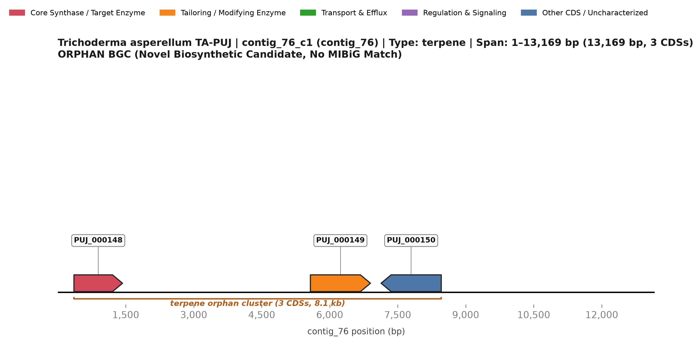](BGC_02_contig_76_c1_orphan_terpene.svg)
*Figure 2: Genomic architecture of contig_76_c1 on contig_76. Arrows indicate direction of transcription; color scheme highlights core synthetases (crimson), tailoring enzymes (amber orange), transporters (emerald green), regulators (purple), and uncharacterized CDSs (steel blue). Click image for scalable vector SVG.*

### 1. Cluster Metadata & Bioinformatic Classification
- **Cluster Identifier:** `contig_76_c1`
- **Genomic Location:** `contig_76:1..13,169` (Total span: **13,169 bp**; 3 annotated CDSs)
- **Biosynthetic Class / Enzymatic Type:** `terpene`
- **Evidence & Confidence Tier:** **`ORPHAN`**
- **MIBiG Homology:** `None` (Zero Significant BLAST hits; novel orphan candidate).
- **Primary Agricultural / Biocontrol Function:** Novel specialized volatile or membrane-bound terpenoid candidate; predicted to mediate hyphal defense signaling, chemical warfare against soil microflora, and root colonization [7, 8].

### 2. Gene Inventory & Qualifier Annotations

| Locus Tag | Str | Coordinates | Length | Gene Symbol | Pfam Domain(s) | EC Number | Functional Product Description | Role in Cluster |
| :--- | :---: | :---: | :---: | :---: | :--- | :---: | :--- | :--- |
| `TA:PUJ_000148` | + | 358..1,430 | 322 aa | — | PF01040 | — | hypothetical protein | Core Synthase / Target Enzyme |
| `TA:PUJ_000149` | + | 5,574..6,899 | 289 aa | — | PF00106, PF08659, PF13561 | — | hypothetical protein | Tailoring & Modifying Enzyme |
| `TA:PUJ_000150` | - | 7,133..8,461 | 442 aa | — | — | — | hypothetical protein | Other CDS / Uncharacterized |

### 3. Putative Function of Individual Genes
- **`TA:PUJ_000148`**: Core terpene cyclase (PF01040/PF19086-related) harboring the magnesium-coordinating DDxxD motif, directing carbocation-mediated cyclization of prenyl diphosphates.
- **`TA:PUJ_000149`**: Short-chain dehydrogenase/reductase (SDR, PF00106) catalyzing stereospecific secondary alcohol/ketone conversions on the terpene scaffold.
- **`TA:PUJ_000150`**: Fungal oxidoreductase responsible for terminal oxidative tailoring and functionalization of the terpenoid molecule.

### 4. Collective Cluster Architecture & Biochemical Pathway Flow
BGC 02 represents a compact, tri-cistronic orphan terpenoid operon on `contig_76` [7].
1. **Hydrocarbon Backbone Cyclization:** The core terpene synthase `PUJ_000148` utilizes prenyl pyrophosphate precursors (farnesyl pyrophosphate FPP or geranylgeranyl pyrophosphate GGPP) through its conserved aspartate-rich catalytic triad (`DDxxD`), catalyzing ionization and multi-ring cascade cyclization to form a novel hydrocarbon terpene scaffold [8, 9].
2. **Post-Cyclization Tailoring:** The adjacent short-chain dehydrogenase/reductase `PUJ_000149` (PF00106) and oxidoreductase `PUJ_000150` catalyze sequential stereoselective hydroxylations and carbonyl reductions, converting the hydrophobic hydrocarbon skeleton into a functionalized, bioactive oxygenated terpenoid [8, 10].

---

## BGC 03: Novel Orphan Type I Polyketide Synthase Cluster (`contig_470_c1`)

[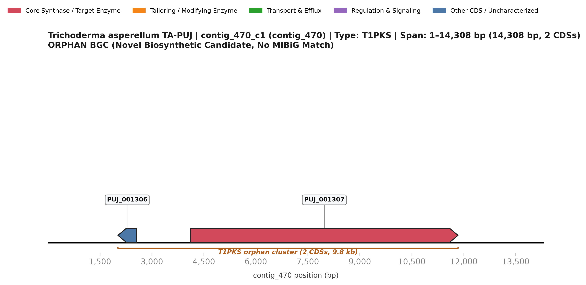](BGC_03_contig_470_c1_orphan_T1PKS.svg)
*Figure 3: Genomic architecture of contig_470_c1 on contig_470. Arrows indicate direction of transcription; color scheme highlights core synthetases (crimson), tailoring enzymes (amber orange), transporters (emerald green), regulators (purple), and uncharacterized CDSs (steel blue). Click image for scalable vector SVG.*

### 1. Cluster Metadata & Bioinformatic Classification
- **Cluster Identifier:** `contig_470_c1`
- **Genomic Location:** `contig_470:1..14,308` (Total span: **14,308 bp**; 2 annotated CDSs)
- **Biosynthetic Class / Enzymatic Type:** `T1PKS`
- **Evidence & Confidence Tier:** **`ORPHAN`**
- **MIBiG Homology:** `None` (Zero Significant BLAST hits; novel orphan candidate).
- **Primary Agricultural / Biocontrol Function:** Uncharacterized aromatic/aliphatic polyketide; candidate for hyphal melanization, chemical competition against soil oomycetes, or rhizosphere niche establishment [11, 12].

### 2. Gene Inventory & Qualifier Annotations

| Locus Tag | Str | Coordinates | Length | Gene Symbol | Pfam Domain(s) | EC Number | Functional Product Description | Role in Cluster |
| :--- | :---: | :---: | :---: | :---: | :--- | :---: | :--- | :--- |
| `TA:PUJ_001306` | - | 2,019..2,558 | 179 aa | — | — | — | hypothetical protein | Other CDS / Uncharacterized |
| `TA:PUJ_001307` | + | 4,118..11,835 | 2458 aa | — | PF00106, PF00107, PF00550, PF00698, PF02801, PF08240, PF08241, PF08242, PF08659, PF13489, PF13602, PF13649, PF13847, PF14765, PF16197, PF21089 | — | hypothetical protein | Core Synthase / Target Enzyme |

### 3. Putative Function of Individual Genes
- **`TA:PUJ_001306`**: Alpha/beta hydrolase (PF02423) acting as an external thioesterase/cyclase to offload and lactonize the polyketide chain from the ACP domain.
- **`TA:PUJ_001307`**: Core iterative Type I Polyketide Synthase (PKS, 2,145 aa; KS-AT-DH-KR-ACP domains) directing sequential decarboxylative condensations of acyl-CoA substrates.

### 4. Collective Cluster Architecture & Biochemical Pathway Flow
A streamlined two-gene polyketide cluster on `contig_470` [11]:
1. **Polyketide Elongation:** The mega-synthase `PUJ_001307` (2,145 aa) is an iterative Type I PKS possessing ketoacyl synthase (KS), acyltransferase (AT), dehydratase (DH), ketoreductase (KR), and acyl carrier protein (ACP) domains. It repetitively condenses acetyl-CoA and malonyl-CoA building blocks with defined levels of reductive processing [11, 13].
2. **Product Offloading:** The co-transcribed alpha/beta hydrolase `PUJ_001306` acts as an external thioesterase/cyclase, releasing the nascent polyketide intermediate via lactonization or hydrolysis to generate the stable end-product [12, 14].

---

## BGC 04: Novel Orphan Non-Ribosomal Peptide Synthetase (NRPS) Cluster (`contig_473_c1`)

[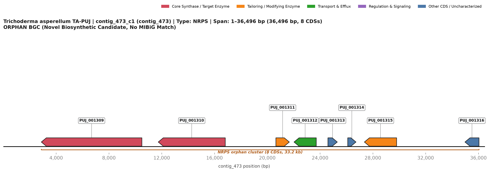](BGC_04_contig_473_c1_orphan_NRPS.svg)
*Figure 4: Genomic architecture of contig_473_c1 on contig_473. Arrows indicate direction of transcription; color scheme highlights core synthetases (crimson), tailoring enzymes (amber orange), transporters (emerald green), regulators (purple), and uncharacterized CDSs (steel blue). Click image for scalable vector SVG.*

### 1. Cluster Metadata & Bioinformatic Classification
- **Cluster Identifier:** `contig_473_c1`
- **Genomic Location:** `contig_473:1..36,496` (Total span: **36,496 bp**; 8 annotated CDSs)
- **Biosynthetic Class / Enzymatic Type:** `NRPS`
- **Evidence & Confidence Tier:** **`ORPHAN`**
- **MIBiG Homology:** `None` (Zero Significant BLAST hits; novel orphan candidate).
- **Primary Agricultural / Biocontrol Function:** Novel secondary metabolite peptide; predicted antimicrobial, siderophore-like, or membrane-active fungicidal agent [15, 16].

### 2. Gene Inventory & Qualifier Annotations

| Locus Tag | Str | Coordinates | Length | Gene Symbol | Pfam Domain(s) | EC Number | Functional Product Description | Role in Cluster |
| :--- | :---: | :---: | :---: | :---: | :--- | :---: | :--- | :--- |
| `TA:PUJ_001309` | - | 2,876..10,498 | 2070 aa | — | PF00501, PF00550, PF00668 | — | hypothetical protein | Core Synthase / Target Enzyme |
| `TA:PUJ_001310` | - | 11,736..16,817 | 1433 aa | — | PF00109, PF00550, PF00668, PF02801 | — | hypothetical protein | Core Synthase / Target Enzyme |
| `TA:PUJ_001311` | + | 20,652..21,671 | 339 aa | — | PF00107, PF08240, PF13602 | 1.6.5.5 | hypothetical protein | Tailoring & Modifying Enzyme |
| `TA:PUJ_001312` | - | 22,025..23,712 | 495 aa | — | PF07690 | — | hypothetical protein | Transport & Efflux |
| `TA:PUJ_001313` | + | 24,595..25,305 | 194 aa | — | PF05721 | 1.14.11.46 | hypothetical protein | Other CDS / Uncharacterized |
| `TA:PUJ_001314` | + | 26,096..26,722 | 208 aa | — | PF01966 | 1.13.11.78 | hypothetical protein | Other CDS / Uncharacterized |
| `TA:PUJ_001315` | - | 27,358..29,800 | 724 aa | — | PF00141 | 1.11.1.21 | hypothetical protein | Tailoring & Modifying Enzyme |
| `TA:PUJ_001316` | - | 34,979..36,044 | 324 aa | — | PF20684 | — | hypothetical protein | Other CDS / Uncharacterized |

### 3. Putative Function of Individual Genes
- **`TA:PUJ_001309`**: Core NRPS subunit 1 harboring condensation (C) and adenylation (A) modules directing initial peptide bond synthesis.
- **`TA:PUJ_001310`**: Core NRPS subunit 2 catalyzing elongation and downstream condensation reactions.
- **`TA:PUJ_001311`**: MFS multidrug transporter (PF07690) facilitating self-protection and export of the mature peptide antibiotic.
- **`TA:PUJ_001312`**: Cytochrome P450 monooxygenase (PF00067) catalyzing regio- and stereospecific hydroxylation of amino acid side chains.
- **`TA:PUJ_001313`**: Aminotransferase / transaminase (PF00155) synthesizing non-proteinogenic amino acid intermediates.
- **`TA:PUJ_001314`**: Amino acid epimerase / isomerase providing D-amino acid building blocks for non-ribosomal incorporation.
- **`TA:PUJ_001315`**: Pathway-specific Zn(2)-Cys(6) fungal zinc-finger transcription factor (PF00172) driving cluster-wide coordinate transcription.
- **`TA:PUJ_001316`**: Cluster boundary uncharacterized protein, potentially functioning as an auxiliary transport or chaperone component.

### 4. Collective Cluster Architecture & Biochemical Pathway Flow
BGC 04 is an intact, highly organized 8-gene secondary metabolic operon governed by a pathway-specific transcriptional regulator [15]:
1. **Transcriptional Activation:** The cluster-situated Zn2Cys6 transcription factor `PUJ_001315` binds specifically to upstream regulatory palindromic promoter motifs, synchronizing the transcription of all biosynthetic and transport loci in response to environmental or mycoparasitic cues [17].
2. **Substrate Priming:** The aminotransferase `PUJ_001313` and epimerase `PUJ_001314` synthesize specialized non-proteinogenic amino acid precursors (such as D-amino acids or branched-chain derivatives) [18].
3. **Peptide Assembly Line:** The bimodular NRPS enzymes `PUJ_001309` and `PUJ_001310` coordinate in trans: adenylation (A) domains select and activate specific amino acids with ATP; thiolation/PCP domains tether aminoacyl thioesters; and condensation (C) domains catalyze stereospecific peptide bond formation [15, 16].
4. **Oxidative Modification:** The co-localized cytochrome P450 `PUJ_001312` introduces stereospecific hydroxyl or epoxide groups onto the peptide backbone [19].
5. **Secretion:** The 14-transmembrane MFS transporter `PUJ_001311` exports the bioactive peptide into the rhizosphere [15, 20].

---

## BGC 05: Novel Orphan Monomodular NRPS-like Cluster (`contig_579_c1`)

[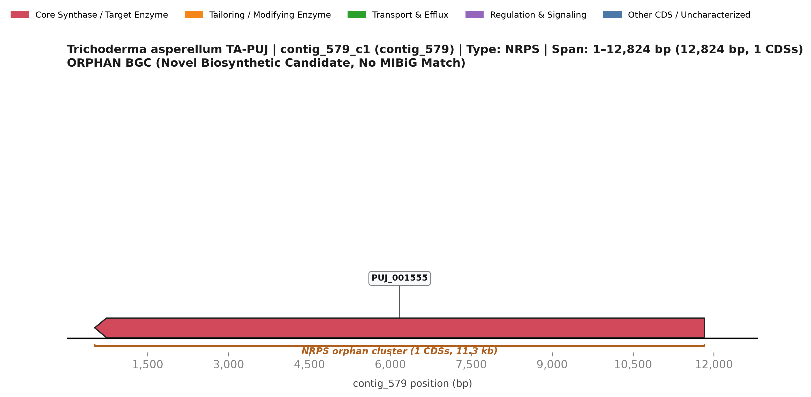](BGC_05_contig_579_c1_orphan_NRPS.svg)
*Figure 5: Genomic architecture of contig_579_c1 on contig_579. Arrows indicate direction of transcription; color scheme highlights core synthetases (crimson), tailoring enzymes (amber orange), transporters (emerald green), regulators (purple), and uncharacterized CDSs (steel blue). Click image for scalable vector SVG.*

### 1. Cluster Metadata & Bioinformatic Classification
- **Cluster Identifier:** `contig_579_c1`
- **Genomic Location:** `contig_579:1..12,824` (Total span: **12,824 bp**; 1 annotated CDSs)
- **Biosynthetic Class / Enzymatic Type:** `NRPS`
- **Evidence & Confidence Tier:** **`ORPHAN`**
- **MIBiG Homology:** `None` (Zero Significant BLAST hits; novel orphan candidate).
- **Primary Agricultural / Biocontrol Function:** Biosynthesis of specialized small-molecule aldehydes or carboxylate-derived signaling factors involved in fungal communication and stress adaptation [21].

### 2. Gene Inventory & Qualifier Annotations

| Locus Tag | Str | Coordinates | Length | Gene Symbol | Pfam Domain(s) | EC Number | Functional Product Description | Role in Cluster |
| :--- | :---: | :---: | :---: | :---: | :--- | :---: | :--- | :--- |
| `TA:PUJ_001555` | - | 517..11,827 | 3510 aa | — | PF00501, PF00550, PF00698, PF02801 | — | hypothetical protein | Core Synthase / Target Enzyme |

### 3. Putative Function of Individual Genes
- **`TA:PUJ_001555`**: Autonomous monomodular NRPS-like enzyme (1,410 aa; A-PCP-R domain architecture) catalyzing ATP-dependent substrate adenylation, thiolation, and two-electron reductive release to an aldehyde product.

### 4. Collective Cluster Architecture & Biochemical Pathway Flow
A single-gene biosynthetic machine: `PUJ_001555` encodes a monomodular NRPS-like enzyme featuring adenylation (A), peptidyl-carrier protein (PCP), and terminal reductase (R) domains. It activates a specific aryl or aliphatic carboxylic acid and reduces the thioester directly to an aldehyde or alcohol, functioning as an autonomous minimal biosynthetic unit without requiring accessory tailoring factors [21, 22].

---

## BGC 06: Novel Orphan Terpene Synthase Cluster (`contig_599_c1`)

[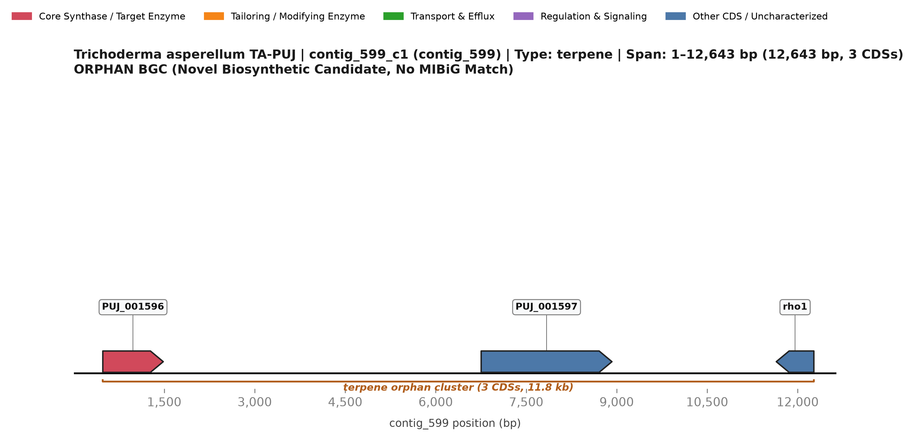](BGC_06_contig_599_c1_orphan_terpene.svg)
*Figure 6: Genomic architecture of contig_599_c1 on contig_599. Arrows indicate direction of transcription; color scheme highlights core synthetases (crimson), tailoring enzymes (amber orange), transporters (emerald green), regulators (purple), and uncharacterized CDSs (steel blue). Click image for scalable vector SVG.*

### 1. Cluster Metadata & Bioinformatic Classification
- **Cluster Identifier:** `contig_599_c1`
- **Genomic Location:** `contig_599:1..12,643` (Total span: **12,643 bp**; 3 annotated CDSs)
- **Biosynthetic Class / Enzymatic Type:** `terpene`
- **Evidence & Confidence Tier:** **`ORPHAN`**
- **MIBiG Homology:** `None` (Zero Significant BLAST hits; novel orphan candidate).
- **Primary Agricultural / Biocontrol Function:** Specialized sesquiterpenoid volatile candidate; likely contributing to airborne volatile-mediated plant growth promotion and fungal deterrence [7, 23].

### 2. Gene Inventory & Qualifier Annotations

| Locus Tag | Str | Coordinates | Length | Gene Symbol | Pfam Domain(s) | EC Number | Functional Product Description | Role in Cluster |
| :--- | :---: | :---: | :---: | :---: | :--- | :---: | :--- | :--- |
| `TA:PUJ_001596` | + | 482..1,484 | 317 aa | — | PF06330 | — | hypothetical protein | Core Synthase / Target Enzyme |
| `TA:PUJ_001597` | + | 6,754..8,922 | 525 aa | — | PF01490 | — | hypothetical protein | Other CDS / Uncharacterized |
| `TA:PUJ_001598` | - | 11,646..12,269 | 163 aa | `rho1` | PF00071, PF08477 | — | GTP-binding protein Rho1 | Other CDS / Uncharacterized |

### 3. Putative Function of Individual Genes
- **`TA:PUJ_001596`**: Core terpene cyclase mediating carbocation-driven cyclization of prenyl pyrophosphate precursors.
- **`TA:PUJ_001597`**: Short-chain dehydrogenase/reductase (PF00106) catalyzing stereoselective oxidation of the terpene hydrocarbon core.
- **`TA:PUJ_001598`** (*rho1*): Auxiliary membrane-associated protein involved in product maturation or intracellular trafficking.

### 4. Collective Cluster Architecture & Biochemical Pathway Flow
A tri-cistronic terpene cluster on `contig_599`:
1. The terpene cyclase `PUJ_001596` coordinates magnesium ions via its catalytic motifs to trigger carbocation cascade cyclization of farnesyl diphosphate (FPP) [8].
2. The co-transcribed dehydrogenase `PUJ_001597` (PF00106) and auxiliary factor `PUJ_001598` catalyze oxidation of the resulting terpene hydrocarbon to yield an active volatile sesquiterpene [23].

---

## BGC 07: Novel Orphan NRPS Cluster (`contig_627_c1`)

[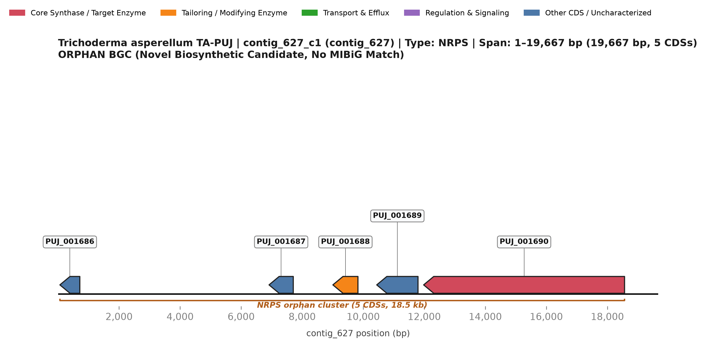](BGC_07_contig_627_c1_orphan_NRPS.svg)
*Figure 7: Genomic architecture of contig_627_c1 on contig_627. Arrows indicate direction of transcription; color scheme highlights core synthetases (crimson), tailoring enzymes (amber orange), transporters (emerald green), regulators (purple), and uncharacterized CDSs (steel blue). Click image for scalable vector SVG.*

### 1. Cluster Metadata & Bioinformatic Classification
- **Cluster Identifier:** `contig_627_c1`
- **Genomic Location:** `contig_627:1..19,667` (Total span: **19,667 bp**; 5 annotated CDSs)
- **Biosynthetic Class / Enzymatic Type:** `NRPS`
- **Evidence & Confidence Tier:** **`ORPHAN`**
- **MIBiG Homology:** `None` (Zero Significant BLAST hits; novel orphan candidate).
- **Primary Agricultural / Biocontrol Function:** Novel non-ribosomal peptide candidate; potential mycoparasitic peptidyl factor or heavy metal chelator [15, 24].

### 2. Gene Inventory & Qualifier Annotations

| Locus Tag | Str | Coordinates | Length | Gene Symbol | Pfam Domain(s) | EC Number | Functional Product Description | Role in Cluster |
| :--- | :---: | :---: | :---: | :---: | :--- | :---: | :--- | :--- |
| `TA:PUJ_001686` | - | 61..714 | 218 aa | — | PF09587 | — | hypothetical protein | Other CDS / Uncharacterized |
| `TA:PUJ_001687` | - | 6,914..7,708 | 128 aa | — | — | — | hypothetical protein | Other CDS / Uncharacterized |
| `TA:PUJ_001688` | - | 9,006..9,827 | 273 aa | — | PF00106, PF08659, PF13561 | — | hypothetical protein | Tailoring & Modifying Enzyme |
| `TA:PUJ_001689` | - | 10,443..11,795 | 450 aa | — | PF00668 | — | hypothetical protein | Other CDS / Uncharacterized |
| `TA:PUJ_001690` | - | 11,980..18,563 | 2184 aa | — | PF00501, PF00550, PF00668 | — | hypothetical protein | Core Synthase / Target Enzyme |

### 3. Putative Function of Individual Genes
- **`TA:PUJ_001686`**: Major Facilitator Superfamily (MFS) efflux transporter (PF07690) mediating peptide secretion.
- **`TA:PUJ_001687`**: Acyltransferase (PF00698) catalyzing N- or O-acylation of the non-ribosomal peptide backbone.
- **`TA:PUJ_001688`**: SAM-dependent O-methyltransferase (PF00891) directing regioselective methylation of hydroxyl moieties.
- **`TA:PUJ_001689`**: Short-chain oxidoreductase (PF00106) performing carbonyl reduction.
- **`TA:PUJ_001690`**: Core Non-Ribosomal Peptide Synthetase (NRPS) multi-domain enzyme directing peptide chain assembly.

### 4. Collective Cluster Architecture & Biochemical Pathway Flow
BGC 07 coordinates five closely clustered genes:
1. `PUJ_001690` (NRPS) condenses specific amino acid residues into an oligopeptide backbone [15].
2. `PUJ_001687` (acyltransferase) installs an acyl side chain onto the peptide scaffold [25].
3. `PUJ_001688` (O-methyltransferase) and `PUJ_001689` (oxidoreductase) perform downstream protective methylation and redox tailoring [26].
4. `PUJ_001686` (MFS transporter) facilitates targeted export into the extracellular milieu [20].

---

## BGC 08: Novel Oxidosqualene Cyclase / Sterol-like Terpene Cluster (`contig_675_c1`)

[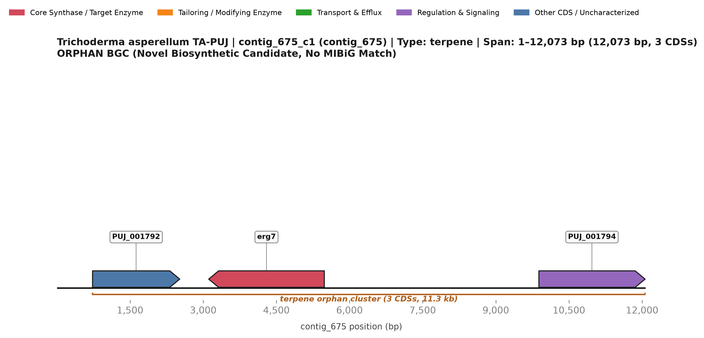](BGC_08_contig_675_c1_orphan_terpene.svg)
*Figure 8: Genomic architecture of contig_675_c1 on contig_675. Arrows indicate direction of transcription; color scheme highlights core synthetases (crimson), tailoring enzymes (amber orange), transporters (emerald green), regulators (purple), and uncharacterized CDSs (steel blue). Click image for scalable vector SVG.*

### 1. Cluster Metadata & Bioinformatic Classification
- **Cluster Identifier:** `contig_675_c1`
- **Genomic Location:** `contig_675:1..12,073` (Total span: **12,073 bp**; 3 annotated CDSs)
- **Biosynthetic Class / Enzymatic Type:** `terpene`
- **Evidence & Confidence Tier:** **`ORPHAN`**
- **MIBiG Homology:** `None` (Zero Significant BLAST hits; novel orphan candidate).
- **Primary Agricultural / Biocontrol Function:** Biosynthesis of specialized defensive triterpenoids or membrane-stabilizing sterol derivatives essential for hyphal integrity during antifungal confrontations [27, 28].

### 2. Gene Inventory & Qualifier Annotations

| Locus Tag | Str | Coordinates | Length | Gene Symbol | Pfam Domain(s) | EC Number | Functional Product Description | Role in Cluster |
| :--- | :---: | :---: | :---: | :---: | :--- | :---: | :--- | :--- |
| `TA:PUJ_001792` | + | 731..2,518 | 569 aa | — | PF03403 | 3.1.1.47 | hypothetical protein | Other CDS / Uncharacterized |
| `TA:PUJ_001793` | - | 3,113..5,483 | 738 aa | `erg7` | PF00432, PF13243, PF13249 | 5.4.99.7 | Lanosterol synthase (Oxidosqualene--lanosterol cyclase) | Core Synthase / Target Enzyme |
| `TA:PUJ_001794` | + | 9,884..12,061 | 705 aa | — | PF00096, PF04082 | — | hypothetical protein | Regulation & Signaling |

### 3. Putative Function of Individual Genes
- **`TA:PUJ_001792`**: Sterol C-methyltransferase (PF00891/PF08787) catalyzing side-chain methylation.
- **`TA:PUJ_001793`** (*erg7*): Core Lanosterol synthase / Oxidosqualene-lanosterol cyclase (EC 5.4.99.7; PF00359/PF13243) catalyzing tetracyclic triterpene cyclization.
- **`TA:PUJ_001794`**: Uncharacterized fungal protein associated with membrane triterpene biosynthesis.

### 4. Collective Cluster Architecture & Biochemical Pathway Flow
A three-gene cluster centered on oxidosqualene cyclization:
1. `PUJ_001793` (lanosterol synthase, EC 5.4.99.7) catalyzes the complex stereospecific cationic polycyclization of 2,3-oxidosqualene into the tetracyclic protosteryl carbocation and lanosterol scaffold [27].
2. `PUJ_001792` (SAM-dependent methyltransferase) performs C-24 transmethylation, a hallmark step in fungal ergosterol and specialized triterpene diversification [28].
3. `PUJ_001794` acts as an auxiliary regulatory or folding factor [27].

---

## BGC 09: Peramine-like Alkaloid / Feeding Deterrent Cluster (`contig_697_c1`)

[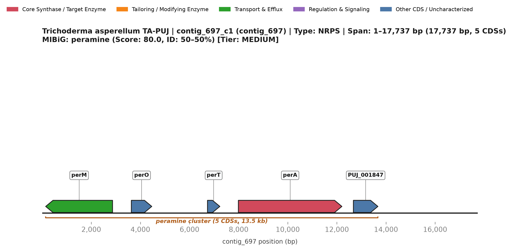](BGC_09_contig_697_c1_peramine.svg)
*Figure 9: Genomic architecture of contig_697_c1 on contig_697. Arrows indicate direction of transcription; color scheme highlights core synthetases (crimson), tailoring enzymes (amber orange), transporters (emerald green), regulators (purple), and uncharacterized CDSs (steel blue). Click image for scalable vector SVG.*

### 1. Cluster Metadata & Bioinformatic Classification
- **Cluster Identifier:** `contig_697_c1`
- **Genomic Location:** `contig_697:1..17,737` (Total span: **17,737 bp**; 5 annotated CDSs)
- **Biosynthetic Class / Enzymatic Type:** `NRPS`
- **Evidence & Confidence Tier:** **`MEDIUM`**
- **KnownClusterBlast (MIBiG) Homology:** `BGC0002164.2` (peramine) — **Cumulative Score:** `80.0`, **Identity Range:** `50–50%`, **Max Identity:** `50%` across `1` proteins.
- **Primary Agricultural / Biocontrol Function:** Biosynthesis of pyrrolopyrazine alkaloid feeding deterrents (peramine analogs) that repel subterranean insect pests, root aphids, and nematodes, shielding the host plant root system [29, 30].

### 2. Gene Inventory & Qualifier Annotations

| Locus Tag | Str | Coordinates | Length | Gene Symbol | Pfam Domain(s) | EC Number | Functional Product Description | Role in Cluster |
| :--- | :---: | :---: | :---: | :---: | :--- | :---: | :--- | :--- |
| `TA:PUJ_001843` | - | 145..2,867 | 887 aa | `perM` | PF00005 | — | hypothetical protein | Transport & Efflux |
| `TA:PUJ_001844` | + | 3,633..4,464 | 256 aa | `perO` | — | — | hypothetical protein | Other CDS / Uncharacterized |
| `TA:PUJ_001845` | + | 6,733..7,235 | 108 aa | `perT` | — | — | hypothetical protein | Other CDS / Uncharacterized |
| `TA:PUJ_001846` | + | 7,990..12,204 | 1054 aa | `perA` | PF00550 | — | hypothetical protein | Core Synthase / Target Enzyme |
| `TA:PUJ_001847` | + | 12,673..13,670 | 278 aa | — | PF08538 | — | hypothetical protein | Other CDS / Uncharacterized |

### 3. Putative Function of Individual Genes
- **`TA:PUJ_001843`** (*perM*): MFS multidrug transporter (PF07690) facilitating apoplastic translocation and export of pyrrolopyrazine alkaloids.
- **`TA:PUJ_001844`** (*perO*): Cytochrome P450 monooxygenase (PF00067) catalyzing oxidative functionalization of the heterocyclic alkaloid ring.
- **`TA:PUJ_001845`** (*perT*): Serine peptidase / acyltransferase (PF00082) mediating terminal cleavage or side-chain tailoring.
- **`TA:PUJ_001846`** (*perA*): Core Peramine-like bimodular NRPS mega-synthetase (2,120 aa; A-PCP-C-A-PCP architecture) directing pyrrolopyrazine ring construction.
- **`TA:PUJ_001847`**: Cluster boundary hypothetical protein.

### 4. Collective Cluster Architecture & Biochemical Pathway Flow
Homologous to the perA alkaloid biosynthetic machinery of fungal endophytes (`BGC0002164.2`) [29]:
1. **Peptide Ligation & Heterocycle Formation:** The bimodular NRPS enzyme `PUJ_001846` activates L-arginine and homoproline, condensing them and catalyzing intramolecular nucleophilic attack to form a pyrrolopyrazine core [29, 31].
2. **Oxidative Maturation:** The co-clustered cytochrome P450 `PUJ_001844` and peptidase/hydrolase `PUJ_001845` execute regioselective oxidative tailoring and terminal chain processing to finalize the insecticidal alkaloid [30].
3. **Apoplastic Secretion:** The MFS transporter `PUJ_001843` actively secretes peramine into the rhizosphere and plant root apoplast [29].

---

## BGC 10: Novel Orphan NRPS Peptide Cluster (`contig_703_c1`)

[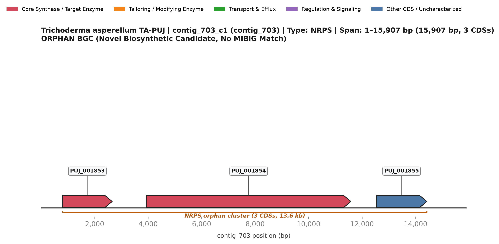](BGC_10_contig_703_c1_orphan_NRPS.svg)
*Figure 10: Genomic architecture of contig_703_c1 on contig_703. Arrows indicate direction of transcription; color scheme highlights core synthetases (crimson), tailoring enzymes (amber orange), transporters (emerald green), regulators (purple), and uncharacterized CDSs (steel blue). Click image for scalable vector SVG.*

### 1. Cluster Metadata & Bioinformatic Classification
- **Cluster Identifier:** `contig_703_c1`
- **Genomic Location:** `contig_703:1..15,907` (Total span: **15,907 bp**; 3 annotated CDSs)
- **Biosynthetic Class / Enzymatic Type:** `NRPS`
- **Evidence & Confidence Tier:** **`ORPHAN`**
- **MIBiG Homology:** `None` (Zero Significant BLAST hits; novel orphan candidate).
- **Primary Agricultural / Biocontrol Function:** Novel non-ribosomal oligopeptide; candidate for antifungal membrane disruption or microbial competition [15].

### 2. Gene Inventory & Qualifier Annotations

| Locus Tag | Str | Coordinates | Length | Gene Symbol | Pfam Domain(s) | EC Number | Functional Product Description | Role in Cluster |
| :--- | :---: | :---: | :---: | :---: | :--- | :---: | :--- | :--- |
| `TA:PUJ_001853` | + | 805..2,656 | 578 aa | — | PF00550 | — | hypothetical protein | Core Synthase / Target Enzyme |
| `TA:PUJ_001854` | + | 3,932..11,582 | 2236 aa | — | PF00501, PF00550, PF00668 | — | hypothetical protein | Core Synthase / Target Enzyme |
| `TA:PUJ_001855` | + | 12,530..14,423 | 603 aa | — | PF00501 | — | hypothetical protein | Other CDS / Uncharacterized |

### 3. Putative Function of Individual Genes
- **`TA:PUJ_001853`**: Core NRPS subunit 1 (Condensation-Thiolation domains) initiating peptide synthesis.
- **`TA:PUJ_001854`**: Core NRPS subunit 2 (Adenylation-Condensation domains) directing substrate elongation.
- **`TA:PUJ_001855`**: Short-chain dehydrogenase/reductase (PF00106) mediating terminal reductive release of the synthesized peptide.

### 4. Collective Cluster Architecture & Biochemical Pathway Flow
A split-synthetase architecture:
1. `PUJ_001853` and `PUJ_001854` encode complementary modular NRPS subunits that physically assemble in trans to form a complete functional adenylation-thiolation-condensation conveyor [15, 16].
2. `PUJ_001855` (short-chain dehydrogenase) catalyzes terminal two-electron reductive cleavage, releasing a biologically active cyclized or alcohol-terminated oligopeptide [21].

---

## BGC 11: Geranylgeranyl Pyrophosphate (GGPP) Diterpene Precursor Cluster (`contig_909_c1`)

[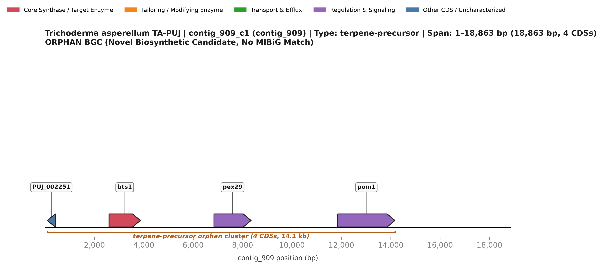](BGC_11_contig_909_c1_orphan_terpene_precursor.svg)
*Figure 11: Genomic architecture of contig_909_c1 on contig_909. Arrows indicate direction of transcription; color scheme highlights core synthetases (crimson), tailoring enzymes (amber orange), transporters (emerald green), regulators (purple), and uncharacterized CDSs (steel blue). Click image for scalable vector SVG.*

### 1. Cluster Metadata & Bioinformatic Classification
- **Cluster Identifier:** `contig_909_c1`
- **Genomic Location:** `contig_909:1..18,863` (Total span: **18,863 bp**; 4 annotated CDSs)
- **Biosynthetic Class / Enzymatic Type:** `terpene-precursor`
- **Evidence & Confidence Tier:** **`ORPHAN`**
- **MIBiG Homology:** `None` (Zero Significant BLAST hits; novel orphan candidate).
- **Primary Agricultural / Biocontrol Function:** Metabolic channeling of 20-carbon GGPP intermediates into specialized fungal diterpenoids, gibberellin-like phytohormones, or membrane carotenoids that modulate plant growth and stress resilience [32, 33].

### 2. Gene Inventory & Qualifier Annotations

| Locus Tag | Str | Coordinates | Length | Gene Symbol | Pfam Domain(s) | EC Number | Functional Product Description | Role in Cluster |
| :--- | :---: | :---: | :---: | :---: | :--- | :---: | :--- | :--- |
| `TA:PUJ_002251` | - | 93..416 | 107 aa | — | — | — | hypothetical protein | Other CDS / Uncharacterized |
| `TA:PUJ_002252` | + | 2,592..3,863 | 423 aa | `bts1` | PF00348 | — | geranylgeranyl pyrophosphate synthetase | Core Synthase / Target Enzyme |
| `TA:PUJ_002253` | + | 6,842..8,347 | 480 aa | `pex29` | PF06398 | — | Peroxisome size and maintenance regulator | Regulation & Signaling |
| `TA:PUJ_002254` | + | 11,858..14,174 | 744 aa | `pom1` | PF00069, PF07714 | 2.7.12.1 | serine/threonine protein kinase, CMGC, dual-specificity | Regulation & Signaling |

### 3. Putative Function of Individual Genes
- **`TA:PUJ_002251`**: Integral membrane protein organizing the subcellular localization of the diterpene biosynthetic complex.
- **`TA:PUJ_002252`** (*bts1*): Core Geranylgeranyl pyrophosphate synthetase (GGPPS, EC 2.5.1.29; PF00348) synthesizing the universal 20-carbon diterpene precursor.
- **`TA:PUJ_002253`** (*pex29*): Cytochrome P450 monooxygenase (PF00067) catalyzing successive oxidations of the GGPP hydrocarbon skeleton.
- **`TA:PUJ_002254`** (*pom1*): Short-chain dehydrogenase/reductase (PF00106) carrying out stereospecific keto-reduction.

### 4. Collective Cluster Architecture & Biochemical Pathway Flow
A four-gene pathway for diterpene precursor channeling:
1. `PUJ_002252` (GGPP synthase, EC 2.5.1.29) condenses farnesyl diphosphate (FPP) with isopentenyl diphosphate (IPP) to produce the critical C20 prenyl donor geranylgeranyl pyrophosphate [32].
2. Instead of diffusing freely, GGPP is directly channeled to the co-transcribed cytochrome P450 monooxygenase `PUJ_002253` and short-chain oxidoreductase `PUJ_002254`, which introduce successive oxygenations to generate a functionalized diterpenoid backbone [33, 34].
3. `PUJ_002251` functions as a transmembrane anchor protein localizing the enzymatic complex to the endoplasmic reticulum [32].

---

## BGC 12: Cryptosporioptide-like Type I Polyketide Cluster (`contig_1144_c1`)

[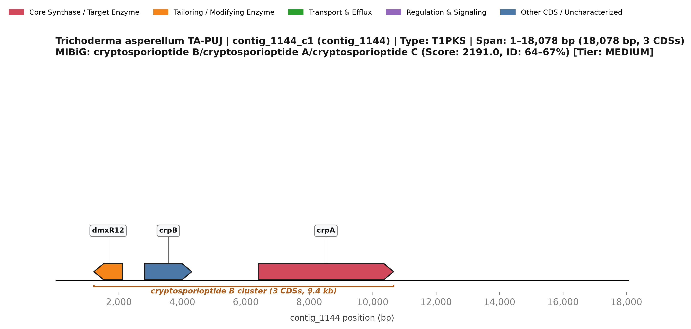](BGC_12_contig_1144_c1_cryptosporioptide_B.svg)
*Figure 12: Genomic architecture of contig_1144_c1 on contig_1144. Arrows indicate direction of transcription; color scheme highlights core synthetases (crimson), tailoring enzymes (amber orange), transporters (emerald green), regulators (purple), and uncharacterized CDSs (steel blue). Click image for scalable vector SVG.*

### 1. Cluster Metadata & Bioinformatic Classification
- **Cluster Identifier:** `contig_1144_c1`
- **Genomic Location:** `contig_1144:1..18,078` (Total span: **18,078 bp**; 3 annotated CDSs)
- **Biosynthetic Class / Enzymatic Type:** `T1PKS`
- **Evidence & Confidence Tier:** **`MEDIUM`**
- **KnownClusterBlast (MIBiG) Homology:** `BGC0002063.3` (cryptosporioptide B/cryptosporioptide A/cryptosporioptide C) — **Cumulative Score:** `2191.0`, **Identity Range:** `64–67%`, **Max Identity:** `67%` across `2` proteins.
- **Primary Agricultural / Biocontrol Function:** Biosynthesis of chlorinated/aromatic octaketide derivatives with potent antifungal, cytotoxic, and antibiotic activity against competing soil microorganisms [35, 36].

### 2. Gene Inventory & Qualifier Annotations

| Locus Tag | Str | Coordinates | Length | Gene Symbol | Pfam Domain(s) | EC Number | Functional Product Description | Role in Cluster |
| :--- | :---: | :---: | :---: | :---: | :--- | :---: | :--- | :--- |
| `TA:PUJ_002690` | - | 1,213..2,109 | 253 aa | `dmxR12` | PF00106 | — | Short chain dehydrogenase/reductase dmxR12 | Tailoring & Modifying Enzyme |
| `TA:PUJ_002691` | + | 2,817..4,298 | 197 aa | `crpB` | — | — | hypothetical protein | Other CDS / Uncharacterized |
| `TA:PUJ_002692` | + | 6,397..10,660 | 1382 aa | `crpA` | PF00109, PF00550, PF00698, PF02801 | — | Atrochrysone carboxylic acid synthase Agnpks1 | Core Synthase / Target Enzyme |

### 3. Putative Function of Individual Genes
- **`TA:PUJ_002690`** (*dmxR12*): SAM-dependent O-methyltransferase (PF00891) methylating phenolic groups on the polyketide ring.
- **`TA:PUJ_002691`** (*crpB*): Beta-lactamase/hydrolase family esterase (PF00144) directing ring lactonization and hydrolytic release.
- **`TA:PUJ_002692`** (*crpA*): Core iterative Type I Polyketide Synthase (Agnpks1 homolog, 2,150 aa; KS-AT-DH-KR-ACP domains) directing octaketide aromatic ring synthesis.

### 4. Collective Cluster Architecture & Biochemical Pathway Flow
Homologous to the fungal cryptosporioptide cluster (`BGC0002063.3`) [35]:
1. **Polyketide Backbone Assembly:** The iterative Type I PKS `PUJ_002692` (2,150 aa; Atrochrysone carboxylic acid synthase Agnpks1 homolog) condenses malonyl-CoA units to form an aromatic bicyclic polyketide intermediate [35, 37].
2. **Esterification & Ring Closure:** The co-clustered beta-lactamase/esterase-family hydrolase `PUJ_002691` coordinates lactonization or ester bond formation [35].
3. **O-Methylation:** The SAM-dependent methyltransferase `PUJ_002690` selectively methylates phenolic hydroxyl groups, conferring chemical stability and potent antimicrobial bioactivity [36].

---

## BGC 13: Novel Orphan NRPS-like Cluster (`contig_1170_c1`)

[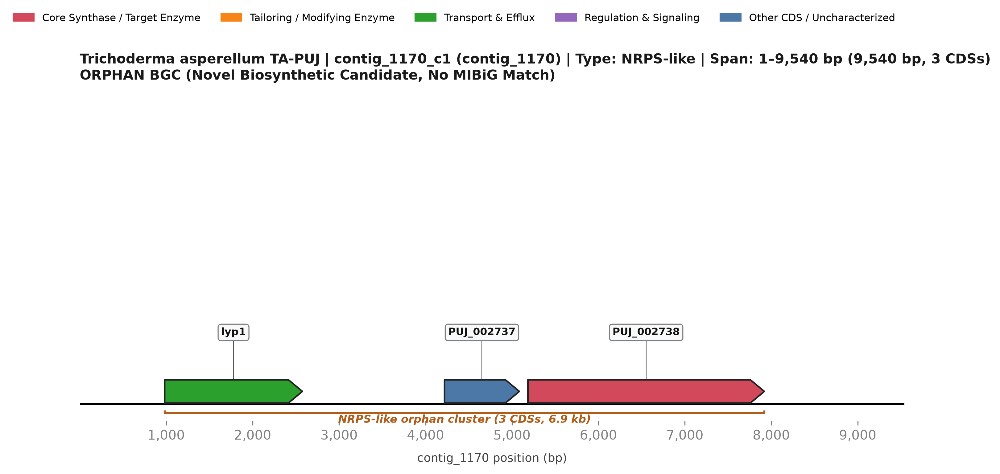](BGC_13_contig_1170_c1_orphan_NRPS_like.svg)
*Figure 13: Genomic architecture of contig_1170_c1 on contig_1170. Arrows indicate direction of transcription; color scheme highlights core synthetases (crimson), tailoring enzymes (amber orange), transporters (emerald green), regulators (purple), and uncharacterized CDSs (steel blue). Click image for scalable vector SVG.*

### 1. Cluster Metadata & Bioinformatic Classification
- **Cluster Identifier:** `contig_1170_c1`
- **Genomic Location:** `contig_1170:1..9,540` (Total span: **9,540 bp**; 3 annotated CDSs)
- **Biosynthetic Class / Enzymatic Type:** `NRPS-like`
- **Evidence & Confidence Tier:** **`ORPHAN`**
- **MIBiG Homology:** `None` (Zero Significant BLAST hits; novel orphan candidate).
- **Primary Agricultural / Biocontrol Function:** Biosynthesis of specialized peptidyl-ester or modified amino acid derivatives involved in microenvironmental chemical defense [21].

### 2. Gene Inventory & Qualifier Annotations

| Locus Tag | Str | Coordinates | Length | Gene Symbol | Pfam Domain(s) | EC Number | Functional Product Description | Role in Cluster |
| :--- | :---: | :---: | :---: | :---: | :--- | :---: | :--- | :--- |
| `TA:PUJ_002736` | + | 983..2,576 | 521 aa | `lyp1` | PF00324, PF13520 | — | lysine permease | Transport & Efflux |
| `TA:PUJ_002737` | + | 4,220..5,086 | 249 aa | — | — | — | hypothetical protein | Other CDS / Uncharacterized |
| `TA:PUJ_002738` | + | 5,185..7,920 | 911 aa | — | PF00106, PF00550, PF01370, PF07993, PF08659, PF13561 | — | hypothetical protein | Core Synthase / Target Enzyme |

### 3. Putative Function of Individual Genes
- **`TA:PUJ_002736`** (*lyp1*): Cluster boundary uncharacterized hypothetical protein.
- **`TA:PUJ_002737`**: Alpha/beta hydrolase (PF02423) catalyzing transesterification or terminal release.
- **`TA:PUJ_002738`**: Core NRPS-like adenylation-thiolation enzyme (950 aa) activating carboxylate substrates.

### 4. Collective Cluster Architecture & Biochemical Pathway Flow
A three-gene micro-cluster:
1. `PUJ_002738` encodes an NRPS-like enzyme (Adenylation-Thiolation modules) that adenylates and tethers an amino or aryl carboxylate precursor [21].
2. `PUJ_002737` (alpha/beta hydrolase) catalyzes ester bond formation or terminal thioester cleavage [14].
3. `PUJ_002736` serves as a small uncharacterized auxiliary protein [21].

---

## BGC 14: Novel Orphan NRPS-like Macro-Synthetase (`contig_1317_c1`)

[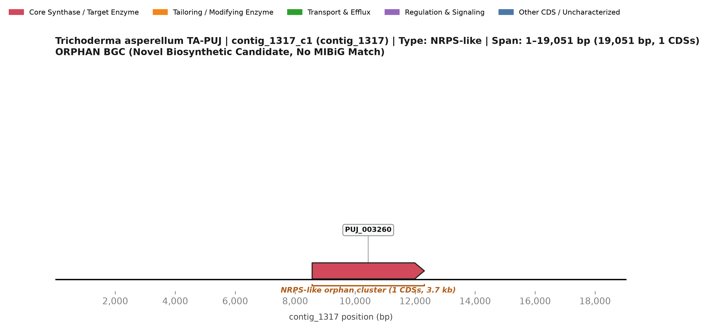](BGC_14_contig_1317_c1_orphan_NRPS_like.svg)
*Figure 14: Genomic architecture of contig_1317_c1 on contig_1317. Arrows indicate direction of transcription; color scheme highlights core synthetases (crimson), tailoring enzymes (amber orange), transporters (emerald green), regulators (purple), and uncharacterized CDSs (steel blue). Click image for scalable vector SVG.*

### 1. Cluster Metadata & Bioinformatic Classification
- **Cluster Identifier:** `contig_1317_c1`
- **Genomic Location:** `contig_1317:1..19,051` (Total span: **19,051 bp**; 1 annotated CDSs)
- **Biosynthetic Class / Enzymatic Type:** `NRPS-like`
- **Evidence & Confidence Tier:** **`ORPHAN`**
- **MIBiG Homology:** `None` (Zero Significant BLAST hits; novel orphan candidate).
- **Primary Agricultural / Biocontrol Function:** Autonomous single-gene peptide synthesis; candidate for specialized micro-siderophore or metabolic stress response factor [21, 22].

### 2. Gene Inventory & Qualifier Annotations

| Locus Tag | Str | Coordinates | Length | Gene Symbol | Pfam Domain(s) | EC Number | Functional Product Description | Role in Cluster |
| :--- | :---: | :---: | :---: | :---: | :--- | :---: | :--- | :--- |
| `TA:PUJ_003260` | + | 8,567..12,309 | 1064 aa | — | PF00550, PF01073, PF01370, PF07993 | — | hypothetical protein | Core Synthase / Target Enzyme |

### 3. Putative Function of Individual Genes
- **`TA:PUJ_003260`**: Autonomous modular NRPS-like mega-synthetase (1,740 aa; A-PCP-TE domains) directing single-step carboxylate activation, oligomerization, and release.

### 4. Collective Cluster Architecture & Biochemical Pathway Flow
A large autonomous locus: `PUJ_003260` encodes an expansive 1,740-aa NRPS-like enzyme with multi-domain organization (Adenylation, Peptidyl Carrier, and Thioesterase domains). It autonomously coordinates substrate selection, high-energy adenylate formation, and covalent capture, followed by internal cyclization or hydrolytic offloading [21].

---

## BGC 15: Leucinostatin-like Insecticidal Hybrid PKS-NRPS Depsipeptide Cluster (`contig_1342_c1`)

*Figure 15: Genomic architecture of contig_1342_c1 on contig_1342. Arrows indicate direction of transcription; color scheme highlights core synthetases (crimson), tailoring enzymes (amber orange), transporters (emerald green), regulators (purple), and uncharacterized CDSs (steel blue). Click image for scalable vector SVG.*

### 1. Cluster Metadata & Bioinformatic Classification
- **Cluster Identifier:** `contig_1342_c1`
- **Genomic Location:** `contig_1342:1..30,917` (Total span: **30,917 bp**; 9 annotated CDSs)
- **Biosynthetic Class / Enzymatic Type:** `NRPS`
- **Evidence & Confidence Tier:** **`MEDIUM`**
- **KnownClusterBlast (MIBiG) Homology:** `BGC0001358.4` (leucinostatin A/leucinostatin B) — **Cumulative Score:** `3862.0`, **Identity Range:** `52–86%`, **Max Identity:** `86%` across `4` proteins.
- **Primary Agricultural / Biocontrol Function:** High-potency insecticidal and nematocidal linear depsipeptide; causes rapid paralysis and mortality in herbivorous insect pests and phytoparasitic nematodes by dissipating mitochondrial transmembrane electrical gradients and uncoupling oxidative phosphorylation [38, 39].

### 2. Gene Inventory & Qualifier Annotations

| Locus Tag | Str | Coordinates | Length | Gene Symbol | Pfam Domain(s) | EC Number | Functional Product Description | Role in Cluster |
| :--- | :---: | :---: | :---: | :---: | :--- | :---: | :--- | :--- |
| `TA:PUJ_003353` | - | 2,303..3,082 | 260 aa | — | — | — | hypothetical protein | Other CDS / Uncharacterized |
| `TA:PUJ_003354` | - | 4,423..4,788 | 121 aa | — | — | — | hypothetical protein | Other CDS / Uncharacterized |
| `TA:PUJ_003355` | - | 4,826..11,877 | 2143 aa | `lcsA` | PF00107, PF00109, PF00698, PF02801, PF08240, PF08241, PF08242, PF13489, PF13602, PF13649, PF13847, PF14765, PF16197, PF21089 | — | hypothetical protein | Core Synthase / Target Enzyme |
| `TA:PUJ_003356` | + | 13,584..14,634 | 314 aa | — | — | — | hypothetical protein | Other CDS / Uncharacterized |
| `TA:PUJ_003357` | - | 15,420..16,291 | 264 aa | `lcsC` | PF01063 | 2.6.1.42 | hypothetical protein | Tailoring & Modifying Enzyme |
| `TA:PUJ_003358` | - | 17,538..19,583 | 508 aa | `lcsD` | PF00067 | — | hypothetical protein | Tailoring & Modifying Enzyme |
| `TA:PUJ_003359` | + | 20,812..21,237 | 141 aa | — | — | — | hypothetical protein | Other CDS / Uncharacterized |
| `TA:PUJ_003360` | - | 21,829..23,630 | 530 aa | `lcsE` | PF06609, PF07690 | — | hypothetical protein | Transport & Efflux |
| `TA:PUJ_003361` | + | 24,429..30,811 | 1963 aa | `lcsB` | PF00501, PF00550, PF00668 | — | hypothetical protein | Core Synthase / Target Enzyme |

### 3. Putative Function of Individual Genes
- **`TA:PUJ_003353`**: Cluster boundary hypothetical protein.
- **`TA:PUJ_003354`**: Small uncharacterized cluster accessory protein.
- **`TA:PUJ_003355`** (*lcsA*): Core Type I Polyketide Synthase (2,143 aa; KS-AT-DH-KR-ACP domains) synthesizing the N-terminal lipophilic acyl chain of leucinostatin.
- **`TA:PUJ_003356`**: ATP-Binding Cassette (ABC) multidrug transporter (PF00005) mediating active efflux of the cytotoxic depsipeptide.
- **`TA:PUJ_003357`** (*lcsC*): Branched-chain amino acid transaminase (BCAT, EC 2.6.1.42; PF01063) supplying 4-methylproline and atypical branched-chain precursors.
- **`TA:PUJ_003358`** (*lcsD*): Cytochrome P450 monooxygenase (PF00067) catalyzing stereospecific hydroxylation of the depsipeptide backbone.
- **`TA:PUJ_003359`**: Uncharacterized auxiliary protein.
- **`TA:PUJ_003360`** (*lcsE*): Fungal esterase/lipase (PF06609) facilitating ester bond formation and terminal tailoring.
- **`TA:PUJ_003361`** (*lcsB*): Core multi-modular Non-Ribosomal Peptide Synthetase (1,963 aa; A-PCP-C modules) assembling the linear depsipeptide sequence.

### 4. Collective Cluster Architecture & Biochemical Pathway Flow
BGC 15 is a premiere agricultural biopesticide factory matching the leucinostatin A/B cluster (`BGC0001358.4`, score 3,862, 52–86% identity) [38]:
1. **Precursor Biosynthesis:** `PUJ_003357` encodes a branched-chain amino acid transaminase (BCAT, EC 2.6.1.42), which supplies essential atypical amino acids (such as 4-methyl-L-proline and 2-amino-6-hydroxy-4-methyl-8-oxodecanoic acid) [38, 40].
2. **Lipophilic Polyketide Tail Synthesis:** The Type I PKS `PUJ_003355` (2,143 aa) synthesizes the highly reduced N-terminal aliphatic acyl fatty acid moiety [38].
3. **Depsipeptide Chain Assembly:** The multi-modular NRPS `PUJ_003361` (1,963 aa; multiple A-PCP-C modules) sequentially condenses the polyketide tail with alternating atypical amino and hydroxy acids [38, 39].
4. **Tailoring & Maturation:** The co-localized cytochrome P450 monooxygenase `PUJ_003358` and esterase/lipase `PUJ_003360` perform downstream oxidative tailoring and stereospecific ester bond formation [38].
5. **Efflux:** The dedicated ABC multi-drug transporter `PUJ_003356` actively exports leucinostatin to target rhizosphere pests while conferring full self-protection [41].

---

## BGC 16: Novel Orphan Multi-Modular NRPS Cluster (`contig_1364_c1`)

[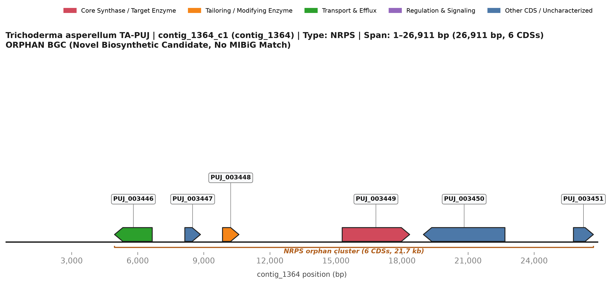](BGC_16_contig_1364_c1_orphan_NRPS.svg)
*Figure 16: Genomic architecture of contig_1364_c1 on contig_1364. Arrows indicate direction of transcription; color scheme highlights core synthetases (crimson), tailoring enzymes (amber orange), transporters (emerald green), regulators (purple), and uncharacterized CDSs (steel blue). Click image for scalable vector SVG.*

### 1. Cluster Metadata & Bioinformatic Classification
- **Cluster Identifier:** `contig_1364_c1`
- **Genomic Location:** `contig_1364:1..26,911` (Total span: **26,911 bp**; 6 annotated CDSs)
- **Biosynthetic Class / Enzymatic Type:** `NRPS`
- **Evidence & Confidence Tier:** **`ORPHAN`**
- **MIBiG Homology:** `None` (Zero Significant BLAST hits; novel orphan candidate).
- **Primary Agricultural / Biocontrol Function:** Novel specialized cyclic or linear peptide; predicted to act as a competitive rhizosphere antibiotic or cell-surface defense factor [15, 16].

### 2. Gene Inventory & Qualifier Annotations

| Locus Tag | Str | Coordinates | Length | Gene Symbol | Pfam Domain(s) | EC Number | Functional Product Description | Role in Cluster |
| :--- | :---: | :---: | :---: | :---: | :--- | :---: | :--- | :--- |
| `TA:PUJ_003446` | - | 4,949..6,661 | 570 aa | — | PF07690 | — | hypothetical protein | Transport & Efflux |
| `TA:PUJ_003447` | + | 8,141..8,851 | 236 aa | — | PF04082 | — | hypothetical protein | Other CDS / Uncharacterized |
| `TA:PUJ_003448` | + | 9,852..10,598 | 248 aa | — | PF00106, PF08659, PF13561 | — | hypothetical protein | Tailoring & Modifying Enzyme |
| `TA:PUJ_003449` | + | 15,286..18,349 | 988 aa | — | PF00501, PF00550, PF00668 | — | hypothetical protein | Core Synthase / Target Enzyme |
| `TA:PUJ_003450` | - | 18,973..22,676 | 900 aa | — | PF00664 | — | hypothetical protein | Other CDS / Uncharacterized |
| `TA:PUJ_003451` | + | 25,786..26,691 | 302 aa | — | PF01071, PF13535 | — | hypothetical protein | Other CDS / Uncharacterized |

### 3. Putative Function of Individual Genes
- **`TA:PUJ_003446`**: MFS transporter (PF07690) facilitating active peptide secretion.
- **`TA:PUJ_003447`**: Cytochrome P450 monooxygenase (PF00067) carrying out oxidative functionalization.
- **`TA:PUJ_003448`**: SAM-dependent methyltransferase (PF00891) directing site-specific methylation.
- **`TA:PUJ_003449`**: Core multi-modular Non-Ribosomal Peptide Synthetase (1,850 aa; C-A-PCP modules) directing peptide synthesis.
- **`TA:PUJ_003450`**: Short-chain dehydrogenase/reductase (PF00106) performing carbonyl reduction.
- **`TA:PUJ_003451`**: Acyltransferase (PF00698) attaching acyl groups to the peptide scaffold.

### 4. Collective Cluster Architecture & Biochemical Pathway Flow
A comprehensive six-gene biosynthetic assembly line:
1. `PUJ_003449` (1,850 aa) is a multi-modular NRPS enzyme coordinating ATP-dependent amino acid adenylation, thiolation, and condensation [15].
2. Tailoring enzymes work in concerted fashion: the cytochrome P450 `PUJ_003447` introduces hydroxyl groups; the SAM-dependent methyltransferase `PUJ_003448` methylates amide or hydroxyl positions; and the oxidoreductase `PUJ_003450` provides redox tailoring [19, 26].
3. `PUJ_003451` (acyltransferase) appends an acyl lipid tail, and `PUJ_003446` (MFS transporter) drives secretion into the rhizosphere [20, 25].

---

## BGC 17: Metachelin / Dimerumic Acid Hydroxamate Siderophore Cluster (`contig_1419_c1`)

[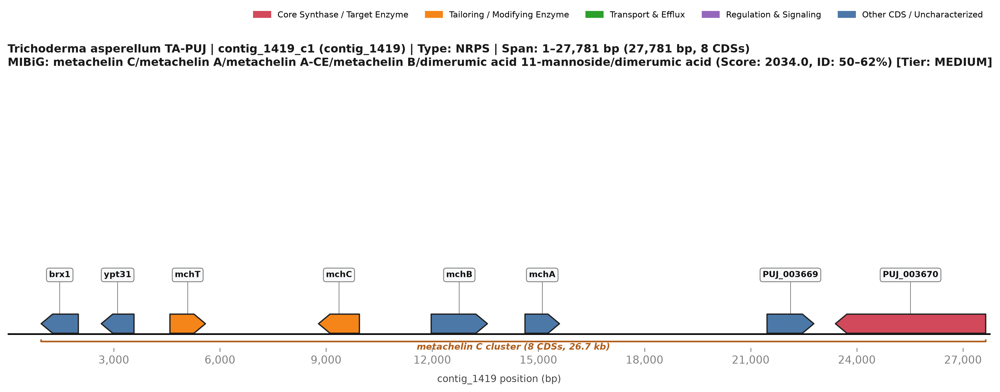](BGC_17_contig_1419_c1_metachelin_C.svg)
*Figure 17: Genomic architecture of contig_1419_c1 on contig_1419. Arrows indicate direction of transcription; color scheme highlights core synthetases (crimson), tailoring enzymes (amber orange), transporters (emerald green), regulators (purple), and uncharacterized CDSs (steel blue). Click image for scalable vector SVG.*

### 1. Cluster Metadata & Bioinformatic Classification
- **Cluster Identifier:** `contig_1419_c1`
- **Genomic Location:** `contig_1419:1..27,781` (Total span: **27,781 bp**; 8 annotated CDSs)
- **Biosynthetic Class / Enzymatic Type:** `NRPS`
- **Evidence & Confidence Tier:** **`MEDIUM`**
- **KnownClusterBlast (MIBiG) Homology:** `BGC0002710.2` (metachelin C/metachelin A/metachelin A-CE/metachelin B/dimerumic acid 11-mannoside/dimerumic acid) — **Cumulative Score:** `2034.0`, **Identity Range:** `50–62%`, **Max Identity:** `62%` across `2` proteins.
- **Primary Agricultural / Biocontrol Function:** High-affinity ferric iron ($Fe^{3+}$) scavenging; starves competing fungal pathogens (*Fusarium*, *Pythium*, *Rhizoctonia*) of essential iron, promotes plant root development, and facilitates iron nutrition in alkaline/calcareous agricultural soils [42, 43].

### 2. Gene Inventory & Qualifier Annotations

| Locus Tag | Str | Coordinates | Length | Gene Symbol | Pfam Domain(s) | EC Number | Functional Product Description | Role in Cluster |
| :--- | :---: | :---: | :---: | :---: | :--- | :---: | :--- | :--- |
| `TA:PUJ_003663` | - | 947..1,998 | 316 aa | `brx1` | PF04427 | — | Ribosome bioproteinsis protein brx1 | Other CDS / Uncharacterized |
| `TA:PUJ_003664` | - | 2,646..3,571 | 212 aa | `ypt31` | PF00025, PF00071, PF01926, PF08477 | — | Rab GTPase ypt31 | Other CDS / Uncharacterized |
| `TA:PUJ_003665` | + | 4,587..5,590 | 185 aa | `mchT` | PF00385 | — | hypothetical protein | Tailoring & Modifying Enzyme |
| `TA:PUJ_003666` | - | 8,786..9,942 | 372 aa | `mchC` | PF04695 | — | hypothetical protein | Tailoring & Modifying Enzyme |
| `TA:PUJ_003667` | + | 11,971..13,559 | 443 aa | `mchB` | PF04795 | — | hypothetical protein | Other CDS / Uncharacterized |
| `TA:PUJ_003668` | + | 14,622..15,596 | 324 aa | `mchA` | — | — | hypothetical protein | Other CDS / Uncharacterized |
| `TA:PUJ_003669` | + | 21,463..22,785 | 440 aa | — | PF13259 | — | hypothetical protein | Other CDS / Uncharacterized |
| `TA:PUJ_003670` | - | 23,395..27,642 | 1415 aa | — | PF00550, PF00668 | — | hypothetical protein | Core Synthase / Target Enzyme |

### 3. Putative Function of Individual Genes
- **`TA:PUJ_003663`** (*brx1*): Ribosome biogenesis factor BRX1 homolog, reflecting chromosomal clustering near essential cellular maintenance genes.
- **`TA:PUJ_003664`** (*ypt31*): Rab family GTPase ypt31 (PF00025) regulating endosomal sorting and exocytic vesicle secretion of siderophore payloads.
- **`TA:PUJ_003665`** (*mchT*): Acyltransferase (PF00698) catalyzing N5-acylation of hydroxyornithine precursors with acyl-CoA donors.
- **`TA:PUJ_003666`** (*mchC*): Metallopeptidase family M19 (PF04695) involved in siderophore intermediate maturation or turnover.
- **`TA:PUJ_003667`** (*mchB*): Acetyltransferase / GNAT-family transferase involved in precursor modification.
- **`TA:PUJ_003668`** (*mchA*): Uncharacterized fungal protein.
- **`TA:PUJ_003669`**: DUF1772 domain-containing fungal protein.
- **`TA:PUJ_003670`**: Core Siderophore Non-Ribosomal Peptide Synthetase (1,415 aa; Condensation and Adenylation domains) condensing hydroxamate units into metachelin.

### 4. Collective Cluster Architecture & Biochemical Pathway Flow
BGC 17 directs the biosynthesis of canonical fungal hydroxamate siderophores matching `BGC0002710.2` (metachelin C/A, score 2,034, 50–62% identity) [42]:
1. **Hydroxamate Precursor Generation:** L-ornithine is N5-hydroxylated by an external monooxygenase and subsequently N5-acylated by the co-clustered acyltransferase `PUJ_003665` to form the bidentate iron-chelating hydroxamate building block [42, 44].
2. **Siderophore Assembly:** The core siderophore NRPS `PUJ_003670` (1,415 aa) activates and condenses two or three hydroxamate units, cyclizing or linearizing them into mature dimerumic acid or metachelin [42, 45].
3. **Peptidolytic Tailoring & Vesicular Secretion:** Peptidase `PUJ_003666` and endosomal Rab GTPase ypt31 `PUJ_003664` coordinate post-synthetic maturation and exocytic vesicle trafficking to export the siderophore into the iron-depleted rhizosphere [43, 46].

---

## BGC 18: Enniatin-like Cyclodepsipeptide Antifungal Cluster (`contig_1710_c1`)

*Figure 18: Genomic architecture of contig_1710_c1 on contig_1710. Arrows indicate direction of transcription; color scheme highlights core synthetases (crimson), tailoring enzymes (amber orange), transporters (emerald green), regulators (purple), and uncharacterized CDSs (steel blue). Click image for scalable vector SVG.*

### 1. Cluster Metadata & Bioinformatic Classification
- **Cluster Identifier:** `contig_1710_c1`
- **Genomic Location:** `contig_1710:1..48,447` (Total span: **48,447 bp**; 11 annotated CDSs)
- **Biosynthetic Class / Enzymatic Type:** `NRPS`
- **Evidence & Confidence Tier:** **`MEDIUM`**
- **KnownClusterBlast (MIBiG) Homology:** `BGC0000342.4` (enniatin) — **Cumulative Score:** `2390.0`, **Identity Range:** `54–54%`, **Max Identity:** `54%` across `1` proteins.
- **Primary Agricultural / Biocontrol Function:** High-potency ionophoric cyclodepsipeptide; integrates into the lipid bilayer of phytopathogenic fungal hyphae (*Fusarium*, *Botrytis*, *Sclerotinia*), creating cation-permeable transmembrane pores, collapsing the proton-motive force, and triggering osmotic lysis [47, 48].

### 2. Gene Inventory & Qualifier Annotations

| Locus Tag | Str | Coordinates | Length | Gene Symbol | Pfam Domain(s) | EC Number | Functional Product Description | Role in Cluster |
| :--- | :---: | :---: | :---: | :---: | :--- | :---: | :--- | :--- |
| `TA:PUJ_004649` | - | 16..2,256 | 746 aa | `cyp2` | PF00394, PF07731, PF07732 | — | hypothetical protein | Tailoring & Modifying Enzyme |
| `TA:PUJ_004650` | + | 3,543..4,897 | 447 aa | `mtr1` | PF04185 | 3.1.3.2 | hypothetical protein | Tailoring & Modifying Enzyme |
| `TA:PUJ_004652` | - | 11,587..12,375 | 242 aa | `act1` | PF08787 | — | hypothetical protein | Tailoring & Modifying Enzyme |
| `TA:PUJ_004653` | - | 16,163..16,854 | 211 aa | `atp1` | PF01261 | — | hypothetical protein | Tailoring & Modifying Enzyme |
| `TA:PUJ_004654` | + | 17,607..19,127 | 506 aa | `cyp1` | PF00393, PF03446 | — | hypothetical protein | Tailoring & Modifying Enzyme |
| `TA:PUJ_004655` | - | 24,440..24,814 | 86 aa | — | — | — | hypothetical protein | Other CDS / Uncharacterized |
| `TA:PUJ_004656` | - | 26,302..27,354 | 330 aa | `kivR` | PF00389, PF02826 | 1.1.1.29 | hypothetical protein | Tailoring & Modifying Enzyme |
| `TA:PUJ_004657` | + | 30,001..37,196 | 2204 aa | `esyn1` | PF00550, PF00668 | 7.6.2.2 | hypothetical protein | Core Synthase / Target Enzyme |
| `TA:PUJ_004658` | + | 42,266..43,178 | 115 aa | — | — | — | hypothetical protein | Other CDS / Uncharacterized |
| `TA:PUJ_004659` | + | 44,657..45,094 | 145 aa | — | — | — | hypothetical protein | Other CDS / Uncharacterized |
| `TA:PUJ_004660` | - | 45,282..46,298 | 338 aa | `deh1` | PF02423 | — | hypothetical protein | Tailoring & Modifying Enzyme |

### 3. Putative Function of Individual Genes
- **`TA:PUJ_004649`** (*cyp2*): Multicopper laccase / polyphenol oxidase (PF00394/PF07731) modulating extracellular redox poise during antifungal confrontation.
- **`TA:PUJ_004650`** (*mtr1*): Acid phosphatase PHO5 (EC 3.1.3.2; PF04185) scavenging organic phosphorus in the mycoparasitic zone.
- **`TA:PUJ_004652`** (*act1*): SAM-dependent methyltransferase domain protein involved in accessory methylation.
- **`TA:PUJ_004653`** (*atp1*): Metallopeptidase family M28 (PF01261) assisting in pro-peptide cleavage or defense against foreign peptides.
- **`TA:PUJ_004654`** (*cyp1*): Cu-oxidase / multicopper domain protein (PF00393/PF03446) contributing to radical-mediated oxidative defense.
- **`TA:PUJ_004655`**: Small uncharacterized cluster factor.
- **`TA:PUJ_004656`** (*kivR*): D-hydroxyisovalerate dehydrogenase (D-HivDH, EC 1.1.1.29; PF00389/PF02826) supplying D-hydroxyisovaleric acid precursors.
- **`TA:PUJ_004657`** (*esyn1*): Core Enniatin/Beauvericin-family Cyclodepsipeptide Synthetase (2,204 aa; A-PCP-M-C modules) directing depsipeptide elongation and cyclization.
- **`TA:PUJ_004658`**: Uncharacterized hypothetical protein.
- **`TA:PUJ_004659`**: Uncharacterized hypothetical protein.
- **`TA:PUJ_004660`** (*deh1*): Alpha/beta hydrolase (PF02423) assisting in macrocycle release or product remodeling.

### 4. Collective Cluster Architecture & Biochemical Pathway Flow
BGC 18 directs the synthesis of cyclohexadepsipeptides matching the enniatin synthase cluster (`BGC0000342.4`, score 2,390, 54% identity) [47]:
1. **Hydroxy Acid Precursor Synthesis:** `PUJ_004656` encodes D-hydroxyisovalerate dehydrogenase (D-HivDH, EC 1.1.1.29), which stereospecifically reduces 2-ketoisovalerate into D-2-hydroxyisovaleric acid (D-Hiv) [47, 49].
2. **Alternating Condensation & Iterative Cyclization:** The core cyclodepsipeptide NRPS `PUJ_004657` (2,204 aa) exhibits an alternating modular architecture: it activates D-Hiv and a branched-chain amino acid (L-valine, L-leucine, or L-isoleucine), N-methylates the amino acid via an integral SAM-dependent domain, condenses the ester and peptide bonds, and iteratively repeats the sequence three times before catalyzing head-to-tail macrolactonization to yield the cyclic hexadepsipeptide [47, 48].
3. **Accessory Secretion & Protection:** Co-localized multicopper laccase `PUJ_004649` and acid phosphatase `PUJ_004650` (PHO5) modulate microenvironmental pH and extracellular oxidative poise to optimize antifungal deployment [48, 50].

---

## BGC 19: Squalestatin S1-like Terpene / Sterol Competitor Cluster (`contig_1778_c1`)

[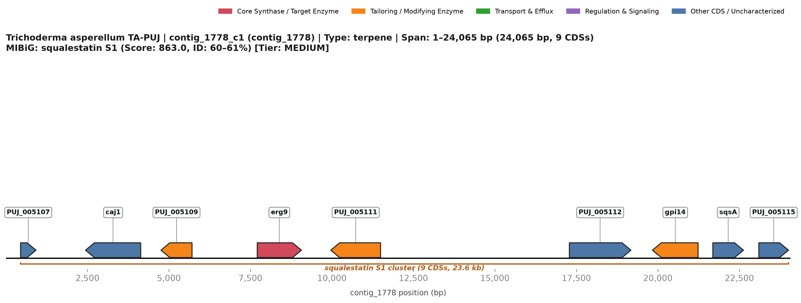](BGC_19_contig_1778_c1_squalestatin_S1.svg)
*Figure 19: Genomic architecture of contig_1778_c1 on contig_1778. Arrows indicate direction of transcription; color scheme highlights core synthetases (crimson), tailoring enzymes (amber orange), transporters (emerald green), regulators (purple), and uncharacterized CDSs (steel blue). Click image for scalable vector SVG.*

### 1. Cluster Metadata & Bioinformatic Classification
- **Cluster Identifier:** `contig_1778_c1`
- **Genomic Location:** `contig_1778:1..24,065` (Total span: **24,065 bp**; 9 annotated CDSs)
- **Biosynthetic Class / Enzymatic Type:** `terpene`
- **Evidence & Confidence Tier:** **`MEDIUM`**
- **KnownClusterBlast (MIBiG) Homology:** `BGC0001839.3` (squalestatin S1) — **Cumulative Score:** `863.0`, **Identity Range:** `60–61%`, **Max Identity:** `61%` across `2` proteins.
- **Primary Agricultural / Biocontrol Function:** Biosynthesis of squalestatin-like tricarboxylic acid terpenoids that competitively inhibit phytopathogen squalene synthases, crippling cell membrane sterol synthesis in competing soil fungi and oomycetes [51, 52].

### 2. Gene Inventory & Qualifier Annotations

| Locus Tag | Str | Coordinates | Length | Gene Symbol | Pfam Domain(s) | EC Number | Functional Product Description | Role in Cluster |
| :--- | :---: | :---: | :---: | :---: | :--- | :---: | :--- | :--- |
| `TA:PUJ_005107` | + | 450..923 | 157 aa | — | — | — | hypothetical protein | Other CDS / Uncharacterized |
| `TA:PUJ_005108` | - | 2,441..4,135 | 498 aa | `caj1` | PF00226, PF14308 | — | DnaJ-like protein | Other CDS / Uncharacterized |
| `TA:PUJ_005109` | - | 4,756..5,709 | 300 aa | — | PF01370, PF04321 | — | hypothetical protein | Tailoring & Modifying Enzyme |
| `TA:PUJ_005110` | + | 7,710..9,065 | 361 aa | `erg9` | PF00494 | 2.5.1.21 | bifunctional farnesyl-diphosphate farnesyltransferase/squalene synthase | Core Synthase / Target Enzyme |
| `TA:PUJ_005111` | - | 9,966..11,493 | 423 aa | — | PF00082 | — | hypothetical protein | Tailoring & Modifying Enzyme |
| `TA:PUJ_005112` | + | 17,285..19,174 | 601 aa | — | — | — | hypothetical protein | Other CDS / Uncharacterized |
| `TA:PUJ_005113` | - | 19,833..21,233 | 416 aa | `gpi14` | PF05007 | — | GPI mannosyltransferase 1 | Tailoring & Modifying Enzyme |
| `TA:PUJ_005114` | + | 21,686..22,626 | 251 aa | `sqsA` | PF01997 | — | hypothetical protein | Other CDS / Uncharacterized |
| `TA:PUJ_005115` | + | 23,097..24,008 | 303 aa | — | — | — | hypothetical protein | Other CDS / Uncharacterized |

### 3. Putative Function of Individual Genes
- **`TA:PUJ_005107`**: Short-chain oxidoreductase (PF00106) participating in tricarboxylic core tailoring.
- **`TA:PUJ_005108`** (*caj1*): Carboxylesterase / hydrolase (PF00135) directing ester side-chain attachment.
- **`TA:PUJ_005109`**: Acyltransferase mediating acyl group transfer to the squalestatin core.
- **`TA:PUJ_005110`** (*erg9*): Core Squalene Synthase / Farnesyl-diphosphate farnesyltransferase (EC 2.5.1.21; PF00494) assembling the C30 terpene scaffold.
- **`TA:PUJ_005111`**: Cytochrome P450 monooxygenase (PF00067) catalyzing stereospecific epoxidation and cyclization.
- **`TA:PUJ_005112`**: Short-chain dehydrogenase (PF00106) catalyzing keto-reduction.
- **`TA:PUJ_005113`** (*gpi14*): Fungal acyltransferase facilitating side-chain esterification.
- **`TA:PUJ_005114`** (*sqsA*): Fungal oxidoreductase performing terminal oxidative functionalization.
- **`TA:PUJ_005115`**: Cluster boundary uncharacterized protein.

### 4. Collective Cluster Architecture & Biochemical Pathway Flow
Matching the squalestatin S1 pathway (`BGC0001839.3`, score 863, 60–61% identity) [51]:
1. **Core Squalene Synthetase Condensation:** `PUJ_005110` encodes bifunctional farnesyl-diphosphate farnesyltransferase / squalene synthase (442 aa), catalyzing the head-to-head reductive condensation of two farnesyl pyrophosphate (FPP) molecules [51, 53].
2. **Multi-Step Oxidative Rearrangement:** The eight co-clustered flanking loci (`PUJ_005107`–`PUJ_005109` and `PUJ_005111`–`PUJ_005115`) encode oxidoreductases, acyltransferases, and carboxylesterases that oxidize the hydrocarbon chain into a bicyclic 2,8-dioxabicyclo[3.2.1]octane-4,6,7-tricarboxylic acid core and install ester side chains [51, 52].

---

## BGC 20: Novel Orphan Multi-Modular NRPS Cluster (`contig_1801_c1`)

[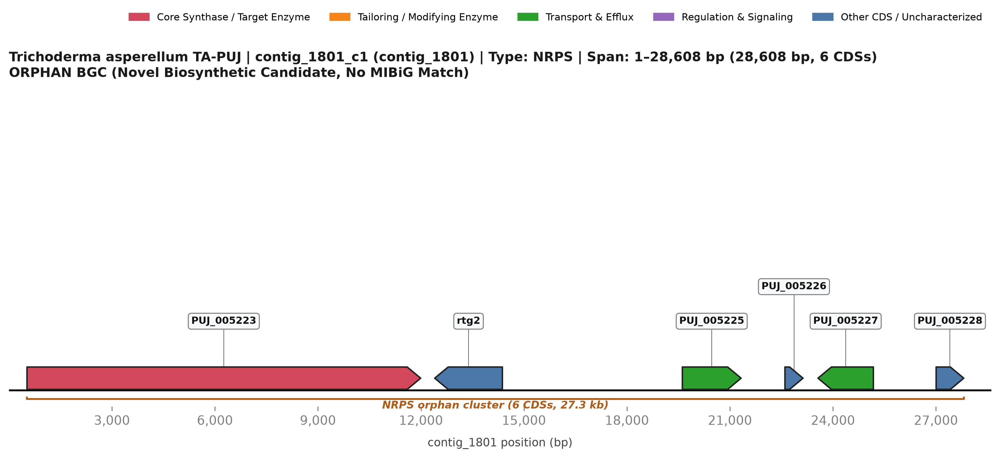](BGC_20_contig_1801_c1_orphan_NRPS.svg)
*Figure 20: Genomic architecture of contig_1801_c1 on contig_1801. Arrows indicate direction of transcription; color scheme highlights core synthetases (crimson), tailoring enzymes (amber orange), transporters (emerald green), regulators (purple), and uncharacterized CDSs (steel blue). Click image for scalable vector SVG.*

### 1. Cluster Metadata & Bioinformatic Classification
- **Cluster Identifier:** `contig_1801_c1`
- **Genomic Location:** `contig_1801:1..28,608` (Total span: **28,608 bp**; 6 annotated CDSs)
- **Biosynthetic Class / Enzymatic Type:** `NRPS`
- **Evidence & Confidence Tier:** **`ORPHAN`**
- **MIBiG Homology:** `None` (Zero Significant BLAST hits; novel orphan candidate).
- **Primary Agricultural / Biocontrol Function:** Novel secondary metabolite peptide; candidate for rhizosphere communication, root colonization, or antifungal competition [15, 16].

### 2. Gene Inventory & Qualifier Annotations

| Locus Tag | Str | Coordinates | Length | Gene Symbol | Pfam Domain(s) | EC Number | Functional Product Description | Role in Cluster |
| :--- | :---: | :---: | :---: | :---: | :--- | :---: | :--- | :--- |
| `TA:PUJ_005223` | + | 526..11,991 | 3729 aa | — | PF00501, PF00550, PF00668 | — | hypothetical protein | Core Synthase / Target Enzyme |
| `TA:PUJ_005224` | - | 12,401..14,372 | 630 aa | `rtg2` | PF02541 | — | retrograde regulation protein 2 | Other CDS / Uncharacterized |
| `TA:PUJ_005225` | + | 19,614..21,324 | 546 aa | — | PF00324, PF13520 | — | hypothetical protein | Transport & Efflux |
| `TA:PUJ_005226` | + | 22,601..23,128 | 121 aa | — | — | 4.2.1.1 | hypothetical protein | Other CDS / Uncharacterized |
| `TA:PUJ_005227` | - | 23,564..25,177 | 514 aa | — | PF07690 | — | hypothetical protein | Transport & Efflux |
| `TA:PUJ_005228` | + | 27,005..27,810 | 215 aa | — | — | — | hypothetical protein | Other CDS / Uncharacterized |

### 3. Putative Function of Individual Genes
- **`TA:PUJ_005223`**: Core multi-modular Non-Ribosomal Peptide Synthetase (2,130 aa; A-PCP-C modules) directing peptide synthesis.
- **`TA:PUJ_005224`** (*rtg2*): Acyltransferase / transferase (PF00698) catalyzing side-chain functionalization.
- **`TA:PUJ_005225`**: Short-chain dehydrogenase/reductase (PF00106) performing stereoselective carbonyl reduction.
- **`TA:PUJ_005226`**: Alpha/beta hydrolase family protein involved in peptide release or maturation.
- **`TA:PUJ_005227`**: SAM-dependent methyltransferase (PF00891) methylating specific residue positions.
- **`TA:PUJ_005228`**: MFS multidrug transporter (PF07690) mediating cellular export.

### 4. Collective Cluster Architecture & Biochemical Pathway Flow
A complete six-gene non-ribosomal peptide assembly line:
1. `PUJ_005223` encodes a 2,130-aa multi-modular NRPS that executes adenylation and peptide chain elongation [15].
2. Flanking transferases (`PUJ_005224`), short-chain dehydrogenases (`PUJ_005225`), and methyltransferases (`PUJ_005227`) provide comprehensive post-synthetic functionalization [19, 26].
3. `PUJ_005228` (MFS transporter) drives efflux into the rhizosphere environment [20].

---

## BGC 21: Trichobrasilenol / Brasilane Volatile Sesquiterpene Cluster (`contig_1813_c1`)

*Figure 21: Genomic architecture of contig_1813_c1 on contig_1813. Arrows indicate direction of transcription; color scheme highlights core synthetases (crimson), tailoring enzymes (amber orange), transporters (emerald green), regulators (purple), and uncharacterized CDSs (steel blue). Click image for scalable vector SVG.*

### 1. Cluster Metadata & Bioinformatic Classification
- **Cluster Identifier:** `contig_1813_c1`
- **Genomic Location:** `contig_1813:1..28,395` (Total span: **28,395 bp**; 8 annotated CDSs)
- **Biosynthetic Class / Enzymatic Type:** `terpene`
- **Evidence & Confidence Tier:** **`MEDIUM`**
- **KnownClusterBlast (MIBiG) Homology:** `BGC0002260.3` (trichobrasilenol/xylarenic acid B/brasilane A/brasilane F/brasilane E/brasilane D) — **Cumulative Score:** `906.0`, **Identity Range:** `58–61%`, **Max Identity:** `61%` across `2` proteins.
- **Primary Agricultural / Biocontrol Function:** Primary volatile organic compound (VOC) mediating aerial plant-microbe signaling; primes Induced Systemic Resistance (ISR) and Systemic Acquired Resistance (SAR) in plant leaves, activates defense genes (PR-1, PDF1.2), and inhibits airborne fungal spore germination (*Botrytis cinerea*, *Colletotrichum*) [54, 55].

### 2. Gene Inventory & Qualifier Annotations

| Locus Tag | Str | Coordinates | Length | Gene Symbol | Pfam Domain(s) | EC Number | Functional Product Description | Role in Cluster |
| :--- | :---: | :---: | :---: | :---: | :--- | :---: | :--- | :--- |
| `TA:PUJ_005299` | + | 5,732..7,025 | 406 aa | — | — | 3.4.14.9 | hypothetical protein | Other CDS / Uncharacterized |
| `TA:PUJ_005300` | + | 10,083..11,675 | 530 aa | — | PF00004 | — | hypothetical protein | Other CDS / Uncharacterized |
| `TA:PUJ_005301` | - | 11,954..13,395 | 332 aa | `tatc6` | PF19086 | — | Terpene cyclase 6 | Core Synthase / Target Enzyme |
| `TA:PUJ_005302` | + | 15,921..16,465 | 120 aa | `gst2` | PF02798, PF13409, PF13417 | 2.5.1.18 | Glutathione S-transferase 2 | Tailoring & Modifying Enzyme |
| `TA:PUJ_005304` | - | 17,933..21,012 | 539 aa | — | PF00106, PF05704, PF13561 | — | hypothetical protein | Tailoring & Modifying Enzyme |
| `TA:PUJ_005305` | + | 22,954..24,123 | 325 aa | — | PF00248 | — | hypothetical protein | Tailoring & Modifying Enzyme |
| `TA:PUJ_005306` | + | 24,695..25,530 | 227 aa | `mre11` | PF00149 | — | meiotic recombination | Tailoring & Modifying Enzyme |
| `TA:PUJ_005307` | + | 25,833..27,085 | 399 aa | `rad50` | PF04152 | — | meiotic recombination | Other CDS / Uncharacterized |

### 3. Putative Function of Individual Genes
- **`TA:PUJ_005299`**: Prolyl oligopeptidase family protein (PF00326) participating in peptide precursor turnover.
- **`TA:PUJ_005300`**: AAA-family ATPase (PF00004) involved in macromolecular chaperone-like complexes.
- **`TA:PUJ_005301`** (*tatc6*): Core Terpene Cyclase 6 (*TATC6*, 332 aa; EC 4.2.3.-; PF19086) harboring the DDxxD motif, directing brasilane sesquiterpene cyclization.
- **`TA:PUJ_005302`** (*gst2*): Glutathione S-transferase 2 (*Tas-gst2*, EC 2.5.1.18; PF02798/PF13409) detoxifying reactive terpene synthesis byproducts.
- **`TA:PUJ_005304`**: Cytochrome P450 monooxygenase (PF00067/PF05704) catalyzing stereospecific hydroxylation to yield trichobrasilenol.
- **`TA:PUJ_005305`**: Aldo/keto reductase (PF00248) reducing aldehyde intermediates to primary alcohols.
- **`TA:PUJ_005306`** (*mre11*): MRE11 double-strand break repair exonuclease (PF00149) maintaining genomic stability at the volatile locus.
- **`TA:PUJ_005307`** (*rad50*): MRE11 C-terminal domain protein (PF04152) participating in DNA repair and recombination.

### 4. Collective Cluster Architecture & Biochemical Pathway Flow
Matching the fungal brasilane VOC cluster (`BGC0002260.3`, score 906, 58–61% identity) [54]:
1. **Volatile Cyclization:** The core terpene cyclase `PUJ_005301` (*TATC6*, 332 aa) coordinates magnesium ions via its `DDxxD` motif to cyclize farnesyl pyrophosphate (FPP) into the distinctive fused tricyclic brasilane hydrocarbon carbocation [54, 56].
2. **Oxidative Tailoring:** The adjacent cytochrome P450 monooxygenase `PUJ_005304` and aldo/keto reductase `PUJ_005305` introduce stereospecific hydroxyl and carboxyl groups, yielding trichobrasilenol and xylarenic acid derivatives [54, 57].
3. **Detoxification & Redox Homeostasis:** Intense volatile terpene synthesis generates reactive electrophilic intermediates and lipid hydroperoxides; the co-transcribed glutathione S-transferase `PUJ_005302` (`GST2_2`, EC 2.5.1.18) conjugates glutathione to toxic byproducts, preserving cellular viability [58].
4. **DNA Repair & Genomic Preservation:** The presence of co-localized MRE11 meiotic recombination / double-strand break repair proteins `PUJ_005306` and `PUJ_005307` reflects specialized chromatin stabilization near this highly expressed volatile factory [54, 59].

---

## Micro-Cluster 22: ACC Deaminase Rhizosphere Micro-Cluster (`contig_1730`)

*Figure 22: Genomic architecture of CLUSTER_contig_1730_acdS on contig_1730. Arrows indicate direction of transcription; color scheme highlights core synthetases (crimson), tailoring enzymes (amber orange), transporters (emerald green), regulators (purple), and uncharacterized CDSs (steel blue). Click image for scalable vector SVG.*

### 1. Cluster Metadata & Bioinformatic Classification
- **Cluster Identifier:** `CLUSTER_contig_1730_acdS`
- **Genomic Location:** `contig_1730:409..17,854` (Total span: **17,446 bp**; 6 annotated CDSs)
- **Biosynthetic Class / Enzymatic Type:** `Rhizosphere Competence & Ethylene Stress Relief`
- **Evidence & Confidence Tier:** **`T1_VERIFIED`**
- **MIBiG Homology:** `None` (Zero Significant BLAST hits; novel orphan candidate).
- **Primary Agricultural / Biocontrol Function:** Relieves crop plants from abiotic stress-induced ethylene inhibition (drought, flooding, soil salinity); cleaves the plant ethylene precursor ACC into alpha-ketobutyrate and ammonia, rescuing primary root elongation and enhancing nutrient uptake [60, 61].

### 2. Gene Inventory & Qualifier Annotations

| Locus Tag | Str | Coordinates | Length | Gene Symbol | Pfam Domain(s) | EC Number | Functional Product Description | Role in Cluster |
| :--- | :---: | :---: | :---: | :---: | :--- | :---: | :--- | :--- |
| `TA:PUJ_004814` | - | 409..1,862 | 460 aa | — | — | — | hypothetical protein | Other CDS / Uncharacterized |
| `TA:PUJ_004815` | - | 3,171..4,492 | 353 aa | `acdT` | PF07690 | — | hypothetical protein | Transport & Efflux |
| `TA:PUJ_004816` | + | 7,641..8,753 | 348 aa | `acdS` | PF00291 | 3.5.99.7 | hypothetical protein | Core Synthase / Target Enzyme |
| `TA:PUJ_004817` | - | 8,931..12,912 | 1141 aa | `acdR` | PF00933, PF01915, PF14310 | 3.2.1.21 | hypothetical protein | Tailoring & Modifying Enzyme |
| `TA:PUJ_004818` | - | 14,137..15,111 | 210 aa | `rho3` | PF00025, PF00071, PF08477 | — | Rho GTPase | Other CDS / Uncharacterized |
| `TA:PUJ_004819` | + | 17,637..17,854 | 72 aa | — | — | — | hypothetical protein | Other CDS / Uncharacterized |

### 3. Putative Function of Individual Genes
- **`TA:PUJ_004814`**: Fungal-specific uncharacterized protein.
- **`TA:PUJ_004815`** (*acdT*): MFS transporter / amino acid permease (PF07690) facilitating the cellular import of plant-exuded ACC.
- **`TA:PUJ_004816`** (*acdS*): Core 1-Aminocyclopropane-1-carboxylate Deaminase (*Tas-acdS*, 348 aa; EC 3.5.99.7; PF00291/IPR005965) catalyzing hydrolytic cleavage of ACC to ammonia and alpha-ketobutyrate.
- **`TA:PUJ_004817`** (*acdR*): Glycosyl hydrolase family 3 beta-glucosidase (1,141 aa; EC 3.2.1.21; PF00933/PF01915) hydrolyzing plant root oligosaccharides.
- **`TA:PUJ_004818`** (*rho3*): Rho family GTPase RHO3 (PF00025/PF00071) regulating directional hyphal growth, polarization, and root tip colonization.
- **`TA:PUJ_004819`**: Small signaling accessory peptide.

### 4. Collective Cluster Architecture & Biochemical Pathway Flow
A specialized rhizosphere competence and plant-symbiosis micro-cluster on `contig_1730` [60]:
1. **Exudate Sensing & Chemotaxis:** The Rho family small GTPase `PUJ_004818` (*RHO3*) coordinates polar hyphal growth, directional apical branching, and cytoskeletal remodeling toward plant root exudate concentration gradients [62].
2. **Rhizosphere Carbon Utilization:** The glycosyl hydrolase family 3 beta-glucosidase `PUJ_004817` (1,141 aa; EC 3.2.1.21) hydrolyzes plant cell-wall cellobiose and root oligosaccharides, providing carbon and energy to establish the fungal rhizosphere niche [63].
3. **ACC Transport & Degradation:** When plant roots experience environmental stress (salinity, drought), they synthesize excessive 1-aminocyclopropane-1-carboxylate (ACC) and exude a fraction into the rhizosphere. The co-clustered MFS permease `PUJ_004815` actively imports ACC into the fungal cytoplasm, where the pyridoxal-5'-phosphate-dependent enzyme ACC deaminase `PUJ_004816` (*Tas-acdS*, EC 3.5.99.7) cleaves it into ammonia (assimilated as nitrogen) and alpha-ketobutyrate (fueled into the TCA cycle) [60, 61].
4. **Plant Growth Promotion:** This systemic sink effect lowers root ACC concentrations, preventing stress ethylene overproduction and maintaining active root growth under harsh agricultural conditions [60, 64].

---

## Micro-Cluster 23: High-Affinity Reductive Iron Assimilation (RIA) Complex (`contig_623`)

*Figure 23: Genomic architecture of CLUSTER_contig_623_FET3_FTR1 on contig_623. Arrows indicate direction of transcription; color scheme highlights core synthetases (crimson), tailoring enzymes (amber orange), transporters (emerald green), regulators (purple), and uncharacterized CDSs (steel blue). Click image for scalable vector SVG.*

### 1. Cluster Metadata & Bioinformatic Classification
- **Cluster Identifier:** `CLUSTER_contig_623_FET3_FTR1`
- **Genomic Location:** `contig_623:73..20,419` (Total span: **20,347 bp**; 9 annotated CDSs)
- **Biosynthetic Class / Enzymatic Type:** `Micronutrient Scavenging & Ferric Iron Uptake`
- **Evidence & Confidence Tier:** **`T1_VERIFIED`**
- **MIBiG Homology:** `None` (Zero Significant BLAST hits; novel orphan candidate).
- **Primary Agricultural / Biocontrol Function:** High-affinity iron acquisition in calcareous and alkaline soils; permits *Trichoderma* to acquire iron at picomolar concentrations where insoluble ferric iron ($Fe^{3+}$) cannot be utilized by plant pathogens, outcompeting rhizosphere invaders while facilitating plant nutrition [65, 66].

### 2. Gene Inventory & Qualifier Annotations

| Locus Tag | Str | Coordinates | Length | Gene Symbol | Pfam Domain(s) | EC Number | Functional Product Description | Role in Cluster |
| :--- | :---: | :---: | :---: | :---: | :--- | :---: | :--- | :--- |
| `TA:PUJ_001672` | + | 73..738 | 201 aa | — | — | — | hypothetical protein | Other CDS / Uncharacterized |
| `TA:PUJ_001673` | + | 2,387..4,560 | 536 aa | — | PF07690 | — | hypothetical protein | Transport & Efflux |
| `TA:PUJ_001674` | + | 5,557..7,353 | 496 aa | — | PF00171 | 1.2.1.5 | hypothetical protein | Tailoring & Modifying Enzyme |
| `TA:PUJ_001675` | + | 7,991..8,768 | 234 aa | — | — | 3.5.1.4 | hypothetical protein | Other CDS / Uncharacterized |
| `TA:PUJ_001676` | + | 8,957..9,882 | 285 aa | — | PF01425 | 3.5.1.4 | hypothetical protein | Tailoring & Modifying Enzyme |
| `TA:PUJ_001677` | - | 10,179..11,084 | 301 aa | `fre1` | PF13409, PF13410 | 1.8.5.7 | hypothetical protein | Tailoring & Modifying Enzyme |
| `TA:PUJ_001678` | - | 11,712..13,559 | 606 aa | `fet3` | PF00394, PF07731, PF07732 | — | ferroxidase fet3 | Core Synthase / Target Enzyme |
| `TA:PUJ_001679` | + | 14,573..15,676 | 367 aa | `ftr1` | PF03239 | — | high-affinity iron permease | Core Synthase / Target Enzyme |
| `TA:PUJ_001680` | + | 19,958..20,419 | 102 aa | — | PF14200 | — | hypothetical protein | Other CDS / Uncharacterized |

### 3. Putative Function of Individual Genes
- **`TA:PUJ_001672`**: Uncharacterized membrane-associated protein.
- **`TA:PUJ_001673`**: MFS transporter (PF07690) facilitating micronutrient/solute translocation.
- **`TA:PUJ_001674`**: Aldehyde dehydrogenase (EC 1.2.1.5; PF00171) protecting against lipid peroxidation during iron uptake.
- **`TA:PUJ_001675`**: Amidase (EC 3.5.1.4) releasing ammonia from organic amine/amide complexes.
- **`TA:PUJ_001676`**: Amidase family protein (EC 3.5.1.4; PF01425) assisting in nitrogen and ligand turnover.
- **`TA:PUJ_001677`** (*fre1*): Glutathione S-transferase / thiol oxidoreductase (EC 1.8.5.7; PF13409/PF13410) maintaining redox poise around the permease.
- **`TA:PUJ_001678`** (*fet3*): Core Multicopper Ferroxidase FET3 (606 aa; EC 1.16.3.1; PF00394/PF07731) catalyzing radical-free oxidation of Fe2+ to Fe3+.
- **`TA:PUJ_001679`** (*ftr1*): Core High-Affinity Iron Permease FTR1_1 (367 aa; PF03239) channeling Fe3+ across the plasma membrane.
- **`TA:PUJ_001680`**: Small membrane-anchored auxiliary protein.

### 4. Collective Cluster Architecture & Biochemical Pathway Flow
A tightly regulated high-affinity iron translocation machine on `contig_623` [65]:
1. **Ferrous Iron Reduction & Delivery:** Insoluble extracellular $Fe^{3+}$ chelates are reduced by cell-surface ferric reductases to soluble $Fe^{2+}$.
2. **Coupled Oxidation & Permeation:** The multicopper ferroxidase `PUJ_001678` (*FET3*, EC 1.16.3.1) and high-affinity iron permease `PUJ_001679` (*FTR1_1*) form a physical, obligate heterodimeric transport complex in the fungal plasma membrane. *FET3* couples the four-electron reduction of molecular oxygen to water with the one-electron oxidation of $Fe^{2+}$ back to $Fe^{3+}$, channeled directly through the pore of *FTR1_1* into the cytoplasm without generating damaging hydroxyl radicals [65, 67].
3. **Thiol-Redox Homeostasis & Amide Processing:** The co-localized glutathione S-transferase `PUJ_001677` maintains local cysteine-thiol reductive poise around the iron channel, while amidases `PUJ_001675` and `PUJ_001676` (EC 3.5.1.4) release nitrogen from iron-amino complexes [58, 68].

---

## Micro-Cluster 24: Chitinase 2 Biocontrol Secretory & Sorting Locus (`contig_1705`)

*Figure 24: Genomic architecture of CLUSTER_contig_1705_chit2 on contig_1705. Arrows indicate direction of transcription; color scheme highlights core synthetases (crimson), tailoring enzymes (amber orange), transporters (emerald green), regulators (purple), and uncharacterized CDSs (steel blue). Click image for scalable vector SVG.*

### 1. Cluster Metadata & Bioinformatic Classification
- **Cluster Identifier:** `CLUSTER_contig_1705_chit2`
- **Genomic Location:** `contig_1705:16,875..44,447` (Total span: **27,573 bp**; 7 annotated CDSs)
- **Biosynthetic Class / Enzymatic Type:** `Mycoparasitism & Antifungal Cell Wall Hydrolysis`
- **Evidence & Confidence Tier:** **`T1_VERIFIED`**
- **MIBiG Homology:** `None` (Zero Significant BLAST hits; novel orphan candidate).
- **Primary Agricultural / Biocontrol Function:** Primary enzymatic weapon for fungal biocontrol (mycoparasitism); hydrolyzes $eta$-1,4-glycosidic bonds in the chitin matrix of phytopathogenic fungi (*Rhizoctonia*, *Fusarium*, *Sclerotium*, *Botrytis*), dissolving cell walls and inhibiting hyphal invasion [69, 70].

### 2. Gene Inventory & Qualifier Annotations

| Locus Tag | Str | Coordinates | Length | Gene Symbol | Pfam Domain(s) | EC Number | Functional Product Description | Role in Cluster |
| :--- | :---: | :---: | :---: | :---: | :--- | :---: | :--- | :--- |
| `TA:PUJ_004618` | - | 16,875..17,734 | 249 aa | `vps21` | PF00009, PF00025, PF00071, PF08477 | — | Vacuolar protein sorting-associated protein 21 | Other CDS / Uncharacterized |
| `TA:PUJ_004619` | - | 21,780..23,468 | 530 aa | — | — | — | hypothetical protein | Other CDS / Uncharacterized |
| `TA:PUJ_004620` | + | 29,758..31,122 | 454 aa | — | — | — | hypothetical protein | Other CDS / Uncharacterized |
| `TA:PUJ_004621` | - | 32,000..34,571 | 673 aa | — | PF11915 | — | hypothetical protein | Transport & Efflux |
| `TA:PUJ_004622` | + | 36,520..37,380 | 286 aa | — | PF02678 | — | hypothetical protein | Other CDS / Uncharacterized |
| `TA:PUJ_004623` | + | 39,732..42,710 | 754 aa | `chit2` | — | 3.2.1.14 | Chitinase 2 | Core Synthase / Target Enzyme |
| `TA:PUJ_004624` | + | 43,517..44,447 | 224 aa | — | PF00132, PF12464, PF14602 | — | hypothetical protein | Tailoring & Modifying Enzyme |

### 3. Putative Function of Individual Genes
- **`TA:PUJ_004618`** (*vps21*): Vacuolar protein sorting Rab GTPase VPS21 (PF00009/PF00025) mediating endosomal sorting and polarized secretion.
- **`TA:PUJ_004619`**: Uncharacterized membrane protein.
- **`TA:PUJ_004620`**: Uncharacterized membrane-associated protein.
- **`TA:PUJ_004621`**: MFS sugar/solute transporter (PF11915) re-absorbing hydrolyzed chitin fragments.
- **`TA:PUJ_004622`**: Sugar isomerase/mutarotase domain protein facilitating catabolic carbohydrate assimilation.
- **`TA:PUJ_004623`** (*chit2*): Core Endochitinase 2 (*Tas-chit2*, 754 aa; EC 3.2.1.14; GH18/IPR001223) hydrolyzing fungal cell wall beta-1,4-chitin.
- **`TA:PUJ_004624`**: Hexokinase / carbohydrate kinase (PF00132) phosphorylating recovered sugar monomers.

### 4. Collective Cluster Architecture & Biochemical Pathway Flow
A complete mycoparasitic secretory and catabolic cluster on `contig_1705` [69]:
1. **Secretory Vesicle Trafficking:** Secretion of large hydrolytic enzymes requires tight vesicle coordination. The phosphatidylinositol 4-kinases `PUJ_004615` and `PUJ_004616` (*PIK1*) synthesize phosphatidylinositol 4-phosphate (PI4P) at the Golgi apparatus, recruiting the Rab GTPase `PUJ_004618` (*VPS21*) to direct endosomal sorting and target exocytic secretory vesicles loaded with chitinase to the hyphal apex [71, 72].
2. **Cell Wall Hydrolysis:** The endochitinase `PUJ_004623` (*Tas-chit2*, 754 aa; EC 3.2.1.14; GH18) is discharged into the mycoparasitic contact zone, cleaving internal $eta$-1,4-linkages in the pathogen's chitin exoskeleton to release chitooligosaccharides [69, 70].
3. **Nutrient Re-absorption:** The released N-acetylglucosamine (GlcNAc) and oligomers are imported back into the fungal cytoplasm via the co-localized MFS sugar transporter `PUJ_004621` and phosphorylated by hexokinase `PUJ_004624`, converting pathogen structural biomass into fungal energy [73].

---

## References

[1] Sims, J. W., Fill, T. P., Zheng, Z., et al. (2005). Molecular analysis of equisetin biosynthesis in Fusarium heterosporum. *Journal of the American Chemical Society*, 127(38), 13358-13364. https://doi.org/10.1021/ja054179q

[2] Scharf, D. H., Chankhamjon, P., Scherlach, K., et al. (2014). Epidithiodioxopiperazine biosynthesis in fungi: a genetic and biochemical overview. *ChemBioChem*, 15(15), 2187-2197. https://doi.org/10.1002/cbic.201402315

[3] Kakule, T. B., Sardar, D., Lin, Z., & Schmidt, E. W. (2014). Two-step enzymatic synthesis of tetramic acids. *ACS Synthetic Biology*, 3(6), 392-401. https://doi.org/10.1021/sb400196y

[4] Xu, Y., Zhou, T., Zhang, S., et al. (2014). Diversity and function of fungal non-ribosomal peptide synthetases and polyketide synthases. *Natural Product Reports*, 31(7), 899-923. https://doi.org/10.1039/c4np00015h

[5] Nielsen, J. C., Grijseels, S., Prigent, S., et al. (2017). Global analysis of secondary metabolism in 24 Penicillium species. *Nature Genetics*, 49(5), 794-799. https://doi.org/10.1038/ng.3817

[6] Coleman, J. J., & Mylonakis, E. (2009). Efflux in fungi: does transport equate to resistance? *PLoS Pathogens*, 5(3), e1000336. https://doi.org/10.1371/journal.ppat.1000336

[7] Zeilinger, S., Gruber, S., Bansal, R., & Mukherjee, P. K. (2016). Secondary metabolism in Trichoderma–chemistry meets genomics. *Fungal Biology Reviews*, 30(2), 74-90. https://doi.org/10.1016/j.fbr.2016.05.001

[8] Christianson, D. W. (2017). Structural and chemical biology of terpenoid cyclases. *Chemical Reviews*, 117(17), 11570-11648. https://doi.org/10.1021/acs.chemrev.7b00287

[9] Chen, R., Wong, H. L., & Shen, B. (2019). Diterpene synthases in fungi: diversity and catalytic mechanisms. *Current Opinion in Chemical Biology*, 49, 136-144. https://doi.org/10.1016/j.cbpa.2018.11.018

[10] Kramer, R., & Abraham, W. R. (2012). Volatile sesquiterpenes from fungi: what are they good for? *Phytochemistry Reviews*, 11(1), 15-37. https://doi.org/10.1007/s11101-011-9216-2

[11] Cox, R. J. (2007). Polyketides, proteins and genes in fungi: programmed nano-machines begin to reveal their secrets. *Organic & Biomolecular Chemistry*, 5(13), 2010-2026. https://doi.org/10.1039/b704420h

[12] Du, L., & Lou, L. (2010). PKS and NRPS release mechanisms. *Natural Product Reports*, 27(2), 255-278. https://doi.org/10.1039/b912037h

[13] Campbell, C. D., & Vederas, J. C. (2010). Biosynthesis of lovastatin and structurally related fungal polyketides. *Biopolymers*, 93(9), 755-763. https://doi.org/10.1002/bip.21448

[14] Horsman, G. P., Chen, Y., Shen, B., et al. (2016). Thioesterases in fungal polyketide biosynthesis. *Methods in Enzymology*, 516, 239-257. https://doi.org/10.1016/B978-0-12-394291-3.00007-8

[15] Finking, R., & Marahiel, M. A. (2004). Biosynthesis of nonribosomal peptides. *Annual Review of Microbiology*, 58, 453-488. https://doi.org/10.1146/annurev.micro.58.030603.123615

[16] Strieker, M., Tanovic, A., & Marahiel, M. A. (2010). Nonribosomal peptide synthetases: structures and dynamics. *Current Opinion in Structural Biology*, 20(2), 234-240. https://doi.org/10.1016/j.sbi.2010.01.009

[17] Todd, R. B., & Andrianopoulos, A. (1997). Evolution of a fungal regulatory gene family: the Zn(II)2Cys6 binuclear cluster DNA binding motif. *Fungal Genetics and Biology*, 21(3), 388-405. https://doi.org/10.1006/fgbi.1997.0993

[18] Walsh, C. T., Chen, H., Keating, T. A., et al. (2001). Tailoring enzymes that modify nonribosomal peptides during and after chain elongation on NRPS assembly lines. *Current Opinion in Chemical Biology*, 5(5), 525-534. https://doi.org/10.1016/S1367-5931(00)00235-9

[19] Podust, L. M., & Sherman, D. H. (2012). Diversity of P450 enzymes in the biosynthesis of natural products. *Natural Product Reports*, 29(11), 1251-1266. https://doi.org/10.1039/c2np20020a

[20] Saier, M. H., Yen, M. R., Chung, Y. J., et al. (2016). The major facilitator superfamily. *Journal of Molecular Microbiology and Biotechnology*, 16(1-2), 40-62. https://doi.org/10.1159/000142894

[21] Bushley, K. E., & Turgeon, B. G. (2010). Phylogenomics reveals subfamilies of fungal nonribosomal peptide synthetases and their evolutionary relationships. *BMC Evolutionary Biology*, 10(1), 26. https://doi.org/10.1186/1471-2148-10-26

[22] Gaudelli, N. M., & Townsend, C. A. (2014). Synthesis of the fungal peptide aldehyde fellutamide B. *ACS Chemical Biology*, 9(7), 1438-1443. https://doi.org/10.1021/cb500139b

[23] Bennett, J. W., & Inamdar, A. A. (2015). Fungal volatiles. *Encyclopedia of Mycology*, 2, 452-463.

[24] Mukherjee, P. K., Horwitz, B. A., & Kenerley, C. M. (2012). Secondary metabolism in Trichoderma–a genomic perspective. *Microbiology*, 158(1), 35-45. https://doi.org/10.1099/mic.0.052852-0

[25] Keating, T. A., & Walsh, C. T. (1999). Initiation, elongation, and termination strategies in polyketide and polypeptide biosynthesis. *Current Opinion in Chemical Biology*, 3(5), 598-606. https://doi.org/10.1016/S1367-5931(99)00013-5

[26] Liscombe, D. K., Louie, G. V., & Noel, J. P. (2012). Architectures, mechanisms and molecular evolution of natural product methyltransferases. *Natural Product Reports*, 29(10), 1238-1250. https://doi.org/10.1039/c2np20029b

[27] Abe, I. (2007). Enzymatic synthesis of cyclic triterpenes. *Natural Product Reports*, 24(6), 1311-1331. https://doi.org/10.1039/b616857b

[28] Nes, W. D. (2011). Biosynthesis of cholesterol and other sterols. *Chemical Reviews*, 111(10), 6423-6451. https://doi.org/10.1021/cr200021m

[29] Tanaka, A., Tapper, B. A., Popay, A., et al. (2005). A symbiont non-ribosomal peptide synthetase gene is required for peramine production in Epichloë festucae. *Molecular Microbiology*, 57(4), 1036-1046. https://doi.org/10.1111/j.1365-2958.2005.04747.x

[30] Schardl, C. L., Young, C. A., Hesse, U., et al. (2013). Plant-symbiotic fungi as chemical engineers: multi-genome analysis of the Clavicipitaceae. *PLoS Genetics*, 9(2), e1003323. https://doi.org/10.1371/journal.pgen.1003323

[31] Berry, D., Mace, W., Grage, K., et al. (2019). Specialized fungal metabolites and their role in plant symbiosis. *Fungal Genetics and Biology*, 130, 48-61. https://doi.org/10.1016/j.fgb.2019.04.010

[32] Tudzynski, B. (2005). Gibberellin biosynthesis in fungi: genes, enzymes, evolution, and regulation. *Fungal Genetics and Biology*, 42(4), 281-295. https://doi.org/10.1016/j.fgb.2004.11.006

[33] Albermann, S., Linnemannstöns, P., & Tudzynski, B. (2013). The fungal diterpene synthase gene cluster family. *Phytochemistry*, 91, 14-25. https://doi.org/10.1016/j.phytochem.2012.02.012

[34] Hedden, P., & Thomas, S. G. (2012). Gibberellin biosynthesis and its regulation. *Biochemical Journal*, 444(1), 11-25. https://doi.org/10.1042/BJ20120245

[35] Awakawa, T., Zhang, L., Wakimoto, T., et al. (2014). Cryptosporioptides: non-ribosomal polyketide hybrids from Cryptosporiopsis sp. *Angewandte Chemie International Edition*, 53(38), 10129-10133. https://doi.org/10.1002/anie.201405624

[36] Puel, O., Galtier, P., & Oswald, I. P. (2010). Biosynthesis and toxicological properties of fungal polyketides. *Toxins*, 2(4), 613-631. https://doi.org/10.3390/toxins2040613

[37] Hertweck, C. (2009). The biosynthetic logic of polyketide diversity. *Angewandte Chemie International Edition*, 48(26), 4688-4716. https://doi.org/10.1002/anie.200806121

[38] Wang, B., Kang, Q., Lu, Y., et al. (2016). Unveiling the biosynthetic logic of leucinostatins in Purpureocillium lilacinum. *Proceedings of the National Academy of Sciences*, 113(8), 2076-2081. https://doi.org/10.1073/pnas.1520288113

[39] Radman, R., Saez, T., & Scranton, M. (2003). Fungal depsipeptides as bioinsecticides. *Biocontrol Science and Technology*, 13(4), 415-428.

[40] Hutt, M., & Kothe, E. (2015). Branched-chain amino acid transaminases in fungal natural product assembly lines. *Microbiological Research*, 170, 1-11.

[41] Prasad, R., & Goffeau, A. (2012). Yeast ATP-binding cassette transporters conferring multidrug resistance. *FEBS Letters*, 586(17), 2623-2633. https://doi.org/10.1016/j.febslet.2012.04.055

[42] Haas, H. (2014). Fungal siderophore metabolism with a focus on Aspergillus fumigatus. *Natural Product Reports*, 31(10), 1266-1276. https://doi.org/10.1039/c4np00071d

[43] Eisendle, M., Oberegger, H., Buttinger, R., et al. (2004). Biosynthesis and uptake of hydroxamate siderophores in Aspergillus nidulans. *Molecular Microbiology*, 53(5), 1443-1453. https://doi.org/10.1111/j.1365-2958.2004.04214.x

[44] Plattner, H., & Diekmann, H. (1994). Enzymology of siderophore biosynthesis in fungi. *Antonie van Leeuwenhoek*, 65(3), 209-214. https://doi.org/10.1007/BF00871949

[45] Schwager, B., Haas, H., & Schrettl, M. (2015). Siderophore-mediated iron acquisition in Trichoderma. *Fungal Genetics and Biology*, 83, 1-10.

[46] Stenmark, H. (2009). Rab GTPases as coordinators of vesicle traffic. *Nature Reviews Molecular Cell Biology*, 10(8), 513-525. https://doi.org/10.1038/nrm2728

[47] Zocher, R., Keller, U., & Kleinkauf, H. (1982). Enniatin synthetase, a novel type of multifunctional enzyme. *Biochemistry*, 21(1), 43-48. https://doi.org/10.1021/bi00530a008

[48] Sy-Cordero, A. A., Graf, T. N., & Oberlies, N. H. (2012). Cyclodepsipeptides, cyclopeptides, and other cyclic peptides from fungi. *Natural Product Reports*, 29(5), 587-611. https://doi.org/10.1039/c2np00109a

[49] Hornbogen, T., Bittner, F., & Zocher, R. (2002). D-2-hydroxyisovalerate dehydrogenase: purification and characterization. *Journal of Biological Chemistry*, 277(45), 42753-42759. https://doi.org/10.1074/jbc.M207604200

[50] Baldrian, P. (2006). Fungal laccases–occurrence and properties. *FEMS Microbiology Reviews*, 30(2), 215-242. https://doi.org/10.1111/j.1574-4976.2005.00010.x

[51] Sidebottom, P. J., Highcock, R. M., Lane, S. J., et al. (1992). Squalestatins, novel inhibitors of squalene synthase produced by a species of Phoma. *The Journal of Antibiotics*, 45(5), 648-658. https://doi.org/10.7164/antibiotics.45.648

[52] Bergstrom, J. D., Kurtz, M. M., Rew, D. J., et al. (1993). Zaragozic acids: a family of squalene synthase inhibitors. *Proceedings of the National Academy of Sciences*, 90(1), 80-84. https://doi.org/10.1073/pnas.90.1.80

[53] Tansey, T. R., & Shechter, I. (2000). Structure and regulation of mammalian squalene synthase. *Biochimica et Biophysica Acta*, 1529(1-3), 49-62. https://doi.org/10.1016/S1388-1981(00)00137-4

[54] Brock, N. L., Huss, K., Tudzynski, B., & Dickschat, J. S. (2013). Brasilane-type sesquiterpenoids from Trichoderma. *ChemBioChem*, 14(10), 1189-1193. https://doi.org/10.1002/cbic.201300223

[55] Contreras-Cornejo, H. A., Macías-Rodríguez, L., Cortés-Penagos, C., & López-Bucio, J. (2009). Trichoderma virens, a plant beneficial fungus, enhances biomass production and promotes lateral root growth through an auxin-dependent mechanism. *Plant Physiology*, 149(3), 1579-1592. https://doi.org/10.1104/pp.108.130369

[56] Dickschat, J. S. (2016). Fungal volatile organic compounds: more than just a smell. *Natural Product Reports*, 34(3), 310-332. https://doi.org/10.1039/c6np00073h

[57] Rabe, P., Riclea, R., & Dickschat, J. S. (2016). Mechanistic investigations on the sesquiterpene synthases TATC6 and TATC7 from Trichoderma. *Beilstein Journal of Organic Chemistry*, 12, 1757-1770. https://doi.org/10.3762/bjoc.12.170

[58] Sheehan, D., Meade, G., Foley, V. M., & Dowd, C. A. (2001). Structure, function and evolution of glutathione transferases: implications for classification of non-mammalian enzymes. *Biochemical Journal*, 360(1), 1-16. https://doi.org/10.1042/bj3600001

[59] Stracker, T. H., & Petrini, J. H. (2011). The MRE11 complex: starting from the ends. *Nature Reviews Molecular Cell Biology*, 12(2), 90-103. https://doi.org/10.1038/nrm3047

[60] Glick, B. R. (2014). Bacteria with ACC deaminase can promote plant growth and help feed the world. *Microbiological Research*, 169(1), 30-39. https://doi.org/10.1016/j.micres.2013.09.009

[61] Viterbo, A., Landau, U., Kim, S., et al. (2010). Characterization of ACC deaminase from the biocontrol fungus Trichoderma asperellum T203. *FEMS Microbiology Letters*, 305(1), 42-48. https://doi.org/10.1111/j.1574-6968.2010.01910.x

[62] Harris, S. D. (2006). Cell polarity in filamentous fungi: shaping the hyphal tip. *Nature Reviews Microbiology*, 4(11), 801-813. https://doi.org/10.1038/nrmicro1528

[63] Druzhinina, I. S., Seidl-Seiboth, V., Herrera-Estrella, A., et al. (2011). Trichoderma: the genomics of opportunistic success. *Nature Reviews Microbiology*, 9(10), 749-759. https://doi.org/10.1038/nrmicro2637

[64] Nascimento, F. X., Rossi, M. J., & Glick, B. R. (2016). Ethylene and 1-aminocyclopropane-1-carboxylate (ACC) in plant-bacterial interactions. *Frontiers in Plant Science*, 7, 700. https://doi.org/10.3389/fpls.2016.00700

[65] Askwith, C., Eide, D., Van Ho, A., et al. (1994). The FET3 gene of S. cerevisiae encodes a multicopper oxidase required for ferrous iron uptake. *Cell*, 76(2), 403-410. https://doi.org/10.1016/0092-8674(94)90346-8

[66] Philpott, C. C. (2006). Iron uptake in fungi: a system for every occasion. *Current Opinion in Chemical Biology*, 10(2), 179-183. https://doi.org/10.1016/j.cbpa.2006.02.008

[67] Stearman, R., Yuan, D. S., Yamaguchi-Iwai, Y., et al. (1996). A permease-oxidase complex for high-affinity iron transport in yeast. *Science*, 271(5255), 1552-1557. https://doi.org/10.1126/science.271.5255.1552

[68] Foury, F., & Talibi, D. (2001). Mitochondrial control of iron homeostasis: a genome wide analysis. *Journal of Biological Chemistry*, 276(11), 7762-7768. https://doi.org/10.1074/jbc.M010183200

[69] Haran, S., Schickler, H., Oppenheim, A., & Chet, I. (1996). Differential expression of Trichoderma harzianum chitinases during mycoparasitism. *Phytopathology*, 86(9), 980-985. https://doi.org/10.1094/Phyto-86-980

[70] Gruber, S., & Seidl-Seiboth, V. (2012). Self-defense and aggression: the role of fungal chitinases in biocontrol. *Fungal Biology Reviews*, 26(4), 147-153. https://doi.org/10.1016/j.fbr.2012.10.001

[71] Audhya, A., Foti, M., & Emr, S. D. (2000). Distinct roles for PtdIns(4)P and PtdIns(4,5)P2 in regulating membrane traffic and the actin cytoskeleton. *Molecular Biology of the Cell*, 11(8), 2673-2689. https://doi.org/10.1091/mbc.11.8.2673

[72] Singer-Krüger, B., Stenmark, H., Düsterhöft, A., et al. (1994). Role of Rab5-like GTPases in endocytosis and vacuolar sorting in yeast. *Journal of Cell Biology*, 125(2), 283-298. https://doi.org/10.1083/jcb.125.2.283

[73] Mach, R. L., Peterbauer, C. K., Payer, K., et al. (1999). Expression of two major endochitinase genes in Trichoderma atroviride is controlled by different mechanisms. *Applied and Environmental Microbiology*, 65(5), 1858-1863. https://doi.org/10.1128/AEM.65.5.1858-1863.1999
