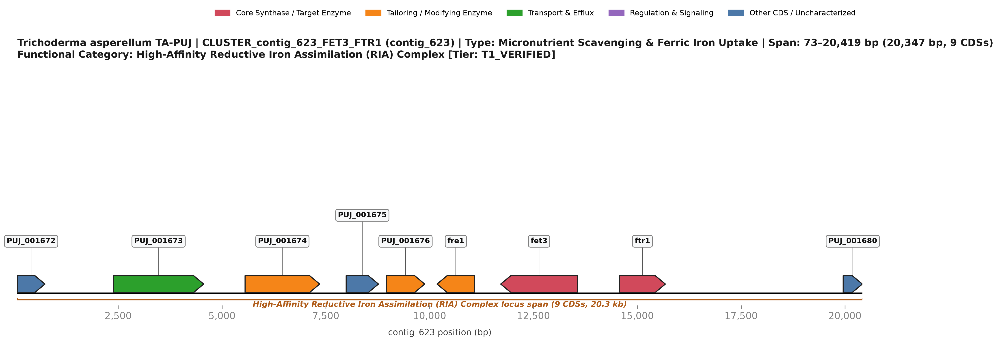
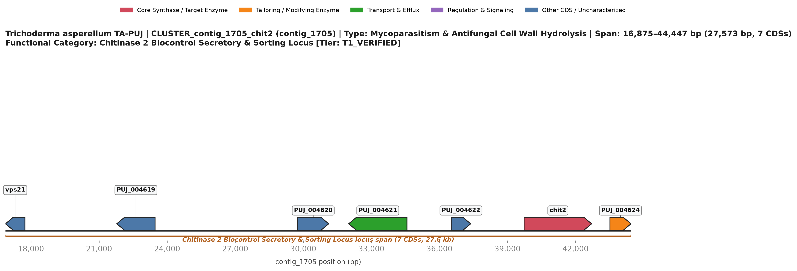
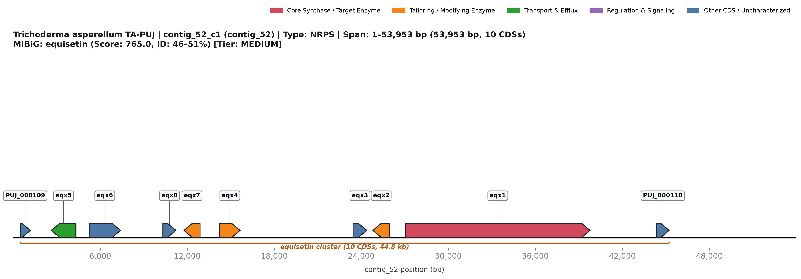
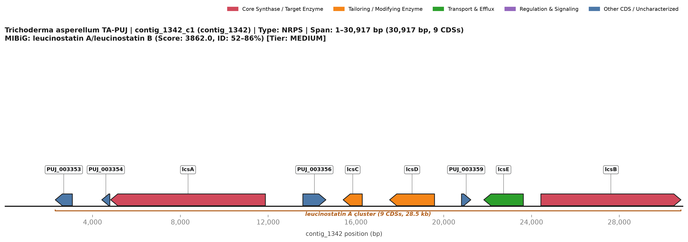
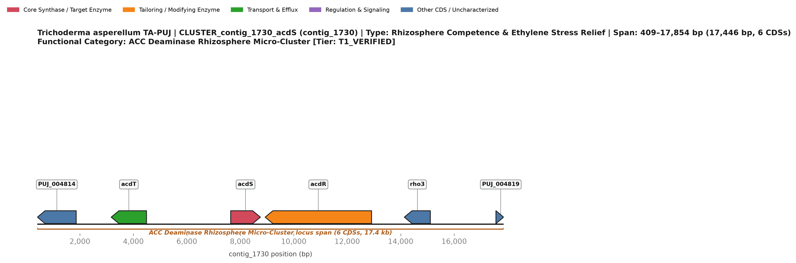
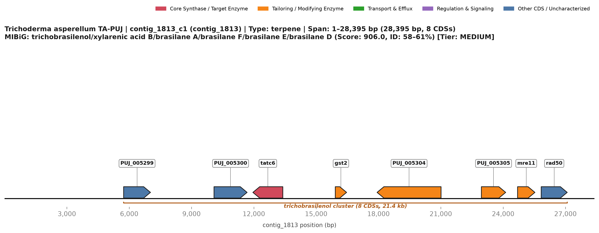
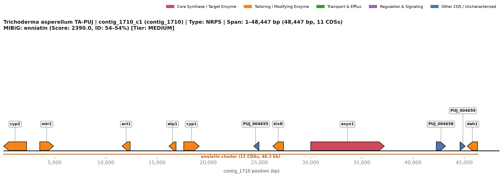

# Diseksi Genomik Fungsional dan Metabolik Isolat *Trichoderma asperellum* TA-PUJ

Narasi ini menyajikan evaluasi genomik fungsional mendalam terhadap isolat *Trichoderma asperellum* TA-PUJ (*draft assembly* 20,29 Mb, 5.229 *predicted* CDS pada 1.376 contig), yang distrukturkan ke dalam empat pilar translasi dan bioteknologi utama: kapabilitas *biofertilizer*, *biocontrol* terhadap serangga dan fungi patogen, biosintesis fitohormon, serta mekanisme *survival* metabolik dalam lingkungan fermentasi biogas.

---

### 1. Klaster Gen yang Terlibat Secara Putatif dalam Kapabilitas Biofertilizer

*Trichoderma asperellum* isolat TA-PUJ mengodekan mesin enzimatik dan sistem transpor terspesialisasi untuk pelarutan nutrisi tanah serta mobilisasi mineral, mempertegas perannya sebagai agen *biofertilizer* berkinerja tinggi. Di dalam tanah pertanian alami, ketersediaan ortofosfat terlarut ($\text{P}_i$) sangat terbatas akibat presipitasi kimiawi menjadi garam kalsium, besi, atau aluminium yang sukar larut. TA-PUJ mengerahkan sejumlah acid phosphatase ekstraseluler dan *cell-associated*, yang dipimpin oleh `PHO5` (`TA:PUJ_003432`, `EC 3.1.3.2`, Pfam PF04185 / InterPro IPR005828, IPR029034) serta acid phosphatase yang terko-lokalisasi pada contig 1710 (`TA:PUJ_004650`, 447 aa, koordinat 4.142..5.542 bp, EC 3.1.3.2). Fosfoesterase ini mendefosforilasi fitat organik serta ester gula-fosfat di dalam rizosfer. Secara paralel, TA-PUJ menyekresikan asam-asam organik berbobot molekul rendah (seperti asam sitrat, oksalat, dan glukonat) yang mengkelat kation divalen dan trivalen, melarutkan ortofosfat anorganik dari fraksi batuan fosfat mineral guna memasok kebutuhan serapan akar tanaman inang.

Melengkapi solubilisasi fosfor, terdapat sistem *iron acquisition* ganda mutakhir yang dirancang untuk mengikat besi feri ($\text{Fe}^{3+}$) yang sangat langka di tanah alkalin dan berkapur. Lokus utama yang memediasi kapabilitas ini adalah kompleks *High-Affinity Reductive Iron Assimilation* (RIA) pada contig 623 (`CLUSTER_23_contig_623_FET3_FTR1`, koordinat 1-based 73..20.419 bp; 9 CDS, *physical span* 20,3 kb). Klaster ini mengodekan kompleks membran heterodimerik obligat yang terdiri atas multicopper ferroxidase `fet3` (`TA:PUJ_001678`, 606 aa, Pfam PF00394/PF07731, EC 1.16.3.1) dan *high-affinity iron permease* `ftr1` (`TA:PUJ_001679`, 367 aa, Pfam PF03239). $\text{Fe}^{3+}$ lingkungan yang tidak larut direduksi di permukaan sel menjadi $\text{Fe}^{2+}$ yang larut; Fet3 kemudian menggandengkan reduksi empat-elektron oksigen molekuler menjadi air dengan oksidasi $\text{Fe}^{2+}$ kembali menjadi $\text{Fe}^{3+}$, menyalurkan ion feri secara langsung melalui pori transmembran sentral Ftr1 dengan afinitas sub-pikomolar tanpa menghasilkan radikal hidroksil bebas yang destruktif. Keseimbangan redoks di sekitar permease distabilkan oleh DsbD-like thioredoxin oxidoreductase `fre1` (`TA:PUJ_001677`, 301 aa, EC 1.8.5.7), sementara amidase `TA:PUJ_001675` dan `TA:PUJ_001676` (EC 3.5.1.4) melepaskan nitrogen dari kelat besi-amino.

Bekerja berdampingan dengan permease RIA adalah klaster *hydroxamate siderophore* metachelin C pada contig 1419 (`BGC_17_contig_1419_c1_metachelin_C`, rentang 1..27.781 bp; 8 CDS, 27,8 kb; cocok dengan MIBiG `BGC0002710.2`, skor 2.034). Digerakkan oleh *core non-ribosomal peptide synthetase* (NRPS) `TA:PUJ_003670` (1.415 aa, Pfam PF00550/PF00668) dan asetiltransferase hulu `TA:PUJ_003669` (440 aa), jalur ini mengarahkan sintesis *hydroxamate chelators* yang melarutkan oksida besi feri mineral. *Vesicular export* dari siderofor bermuatan besi dikoordinasikan oleh Rab GTPase `ypt31` (`TA:PUJ_003664`, 212 aa) di dekatnya. Sistem *iron mining* ganda ini memungkinkan TA-PUJ menyerap mineral mikro esensial pada konsentrasi pikomolar, secara langsung memperkaya jaringan perakaran tanaman inang sekaligus memicu defisiensi besi ekstrem bagi mikroba fitopatogen kompetitor di rizosfer.

---

### 2. Klaster Gen yang Berkontribusi pada Kapabilitas Biokontrol, Khususnya Terhadap Serangga dan Fungi Lain

Karakteristik unggulan dari *Trichoderma asperellum* TA-PUJ adalah kapasitas *biocontrol* multi-modal yang tertarget terhadap fungi fitopatogen dan hama tanaman, didukung oleh 21 BGC metabolit sekunder prediksi antiSMASH, mikroklaster litik terdedikasi, serta profil keamanan hayati non-toksigenik bersertifikasi BSL-1.

#### Mikoparasitisme dan Degradasi Dinding Sel Fungi
Terhadap fungi fitopatogen tular-tanah (*Rhizoctonia solani*, *Fusarium oxysporum*, *Sclerotium rolfsii*, dan *Pythium ultimum*), TA-PUJ melancarkan *contact-dependent physical mycoparasitism*. Proses predatori ini secara mekanistik berpusat pada *Chitinase 2 Biocontrol Secretory Locus* pada contig 1705 (`CLUSTER_24_contig_1705_chit2`, koordinat 1-based 16.875..44.447 bp; 7 CDS, *physical span* 27,6 kb). Pusat operasional lokus ini dihuni oleh endochitinase 2 (`chit2` / `Tas-chit2`, `TA:PUJ_004623`, 754 aa, EC 3.2.1.14, GH18 / IPR001223). Disekresikan langsung ke zona konfrontasi hifa, Tas-chit2 membelah ikatan internal $\beta$-1,4-glikosidik pada matriks kitin kristalin patogen. Klaster ini memperlihatkan koordinasi fungsional yang sangat teratur: Rab5 vacuolar protein sorting GTPase `vps21` (`TA:PUJ_004618`, 249 aa) di bagian hulu bekerja sama dengan Golgi phosphatidylinositol 4-kinase (`TA:PUJ_004616`) untuk mengarahkan *polarized exocytic vesicle trafficking*, memfokuskan sekresi kitinase pada ujung hifa penyerang. Monomer $N$-acetylglucosamine (GlcNAc) dan kitooligosakarida yang terbebaskan segera diimpor ke sitoplasma *Trichoderma* oleh transporter MFS `TA:PUJ_004621` (673 aa) dan difosforilasi oleh karbohidrat kinase `TA:PUJ_004624` (224 aa). Lokus ini beroperasi berdampingan dengan serangkaian enzim litik di seluruh genom yang mencakup 14 chitinase GH18, 7 chitosanase GH75 (`EC 3.2.1.132`), dan $\beta$-1,3-glucanase (`TA:PUJ_002476`, EC 3.2.1.39), menghantarkan lisis enzimatik yang cepat terhadap dinding sel patogen.

#### Antibiosis Metabolit Sekunder Antijamur
Lisis enzimatik diperkuat secara sinergis oleh antibiosis kimiawi poten:
1. **Equisetin-like Tetramic Acid (`contig_52_c1`, 1..53.953 bp; 10 CDS, 44,8 kb; MIBiG `BGC0001255.4`, skor 765):** Dikendalikan oleh mega-synthetase iterative Type I PKS-NRPS `eqx1` (`TA:PUJ_000117`, 3.931 aa), transaminase `eqx4` (`TA:PUJ_000114`, EC 2.6.1.1), dan S-adenosylmethionine methyltransferase `eqx7` (`TA:PUJ_000113`), jalur ini mensintesis metabolit asam tetramat mirip ekuisetin. Senyawa ini mengikat RNA polimerase jamur dan bakteri serta memicu *uncoupling* pada sintesis ATP mitokondria, membentuk zona eksklusi antimikroba di sekitar hifa *Trichoderma*. Efluks aktif dan *self-resistance* dimediasi oleh transporter 12-transmembran `eqx5` (`TA:PUJ_000110`).
2. **Enniatin-like Cyclodepsipeptide (`contig_1710_c1`, 1..48.447 bp; 11 CDS, 48,4 kb; MIBiG `BGC0000342.4`, skor 2.390):** Digerakkan oleh multi-modular NRPS `TA:PUJ_004657` (2.204 aa, EC 7.6.2.2) dan diregulasi oleh faktor transkripsi $\text{Zn}_2\text{Cys}_6$ tipe-GAL4 `TA:PUJ_004654` (506 aa), klaster ini mensintesis hexadepsipeptide ionoforik yang menyusup ke dalam membran fungi asing, membentuk *pore complexes* yang meluruhkan gradien kalium dan kalsium.
3. **Squalestatin S1 Terpene (`contig_1778_c1`, 1..24.065 bp; 9 CDS; MIBiG `BGC0001839.3`, skor 863):** Memproduksi terpenoid asam trikarboksilat yang secara kompetitif menghambat squalene synthase pada fungi pesaing dan oomycota, menghentikan biosintesis ergosterol.
4. **Cryptosporioptide B Octaketide (`contig_1144_c1`, 1..18.078 bp; 3 CDS; MIBiG `BGC0002063.3`, skor 2.191):** Iterative Type I PKS `crpA` (`TA:PUJ_002692`, 1.382 aa) dan ketoreductase `dmxR12` (`TA:PUJ_002690`, 253 aa) merakit poliketida terklorinasi yang menekan mikroflora tanah kompetitor.

#### Repertoar Anti-Serangga, Nematisida, dan Pengusir Hama
Terhadap hama tanaman invertebrata (nematoda, kutu akar, larva kumbang, dan larva lepidoptera perusak daun), TA-PUJ memproduksi metabolit sekunder bioaktif serta hidrolase kutikula spesifik:
1. **Leucinostatin-like Linear Depsipeptide (`contig_1342_c1`, 1..30.917 bp; 9 CDS, 28,5 kb; MIBiG `BGC0001358.4`, skor 3.862, identitas 52–86% pada 4 protein):** Ditopang oleh core hybrid PKS `TA:PUJ_003355` (2.143 aa), core NRPS `TA:PUJ_003361` (1.963 aa), *branched-chain amino acid transaminase* `TA:PUJ_003357` (`EC 2.6.1.42`), dan cytochrome P450 `TA:PUJ_003358`. Leucinostatin adalah depsipeptida linier berpotensi tinggi yang berintegrasi ke dalam lapisan ganda lipid serangga, meluruhkan gradien proton mitokondria dan melepaskan *oxidative phosphorylation*, memberikan daya kendali insektisida dan nematisida yang mematikan terhadap nematoda bengkak akar (*Meloidogyne* spp.) dan hama pemakan akar. *Self-resistance* dan ekspor digerakkan oleh pompa efluks MFS `TA:PUJ_003360`.
2. **Peramine-like Feeding Deterrent (`contig_697_c1`, 1..17.737 bp; 5 CDS; MIBiG `BGC0002164.2`, skor 80):** Mengodekan jalur perakitan NRPS yang menghasilkan analog alkaloid pyrrolopyrazine sebagai *antifeedant* alami, mencegah pemangsaan serangga tanah terhadap sistem perakaran tanaman yang diinokulasi.
3. **Repertoar Protease Serin S8 Subtilisin-like:** Genom TA-PUJ mengodekan famili 16 protease serin mirip-subtilisin (`EC 3.4.21.-`) yang mampu mendegradasi protein kutikula serangga (Pr1-like proteases), memfasilitasi penetrasi dan biokontrol terhadap hama stadium larva.

Secara krusial, sangat kontras dengan ascomycetes toksigenik, genom TA-PUJ sepenuhnya bersih dari mesin biosintesis mikotoksin mamalia fungsional (tanpa aflatoksin, cyclopiazonic acid, sterigmatocystin, trichothecene, ochratoxin, atau gliotoxin). Karakteristik ini menetapkan TA-PUJ sebagai agen *biocontrol* berkualifikasi BSL-1 yang ramah lingkungan dan aman diaplikasikan pada lahan pertanian terbuka.

---

### 3. Klaster Gen yang Berhubungan dengan Biosintesis Fitohormon

*Trichoderma asperellum* TA-PUJ menjalin koordinasi simbiotik mendalam dengan tanaman inang melalui sintesis prekursor pensinyalan tanaman, *volatile organic compounds* (VOC), serta enzim-enzim yang mendegradasi hormon stres tanaman:

#### Reduksi Stres Etilen Tanaman Melalui ACC Deaminase
Mekanisme fisiologis primer di mana TA-PUJ menstimulasi pertumbuhan tanaman di bawah stres abiotik dimediasi oleh mikroklaster rizosfer 1-aminocyclopropane-1-carboxylate (ACC) deaminase pada contig 1730 (`CLUSTER_22_contig_1730_acdS`, koordinat 1-based 409..17.854 bp; 6 CDS, *physical span* 17,4 kb). Di bawah cekaman kekeringan, genangan air, suhu dingin, toksisitas logam berat, atau salinitas tanah, akar tanaman memproduksi ACC secara berlebihan (prekursor biosintesis langsung dari etilen), memicu kekerdilan akar parah, klorosis, dan penuaan dini. TA-PUJ mengekspresikan enzim ACC deaminase bergantung-piridoksal-5'-fosfat (`acdS` / `Tas-acdS`, `TA:PUJ_004816`, 348 aa, EC 3.5.99.7, Pfam PF00291, InterPro IPR005965). Co-transcribed MFS amino acid permease `acdT` (`TA:PUJ_004815`, 353 aa, Pfam PF07690) secara aktif mengimpor ACC eksudat akar ke dalam sitoplasma fungi, di mana Tas-acdS memecahnya menjadi amonia (diasimilasi sebagai nitrogen) dan $\alpha$-ketobutyrate (disalurkan ke dalam siklus TCA). Dengan berfungsi sebagai *rhizosphere ethylene sink* yang aktif, TA-PUJ mencegah akumulasi etilen stres penghambat di jaringan akar, memulihkan elongasi akar primer, meningkatkan percabangan akar lateral, dan mempertahankan penyerapan nutrisi tanaman yang tertekan. Penempelan pada akar diarahkan oleh Rho GTPase `rho3` (`TA:PUJ_004818`, 210 aa) yang terklaster bersama, sementara GH3 $\beta$-glucosidase `acdR` (`TA:PUJ_004817`, 1.141 aa, EC 3.2.1.21) di dekatnya menghidrolisis selobiosa eksudat akar untuk mendukung persistensi fungi.

#### Jalur Prekursor Auxin (Indole-3-Acetic Acid, IAA)
TA-PUJ memiliki mesin metabolisme hulu untuk pembentukan auxin. Isolat ini mempertahankan mesin otonom lengkap untuk sintesis L-triptofan dari chorismate melalui komponen anthranilate synthase pada contig 356 (`TA:PUJ_001036`, 719 aa, Pfam PF00290/PF00291, EC 4.2.1.20) dan contig 693 (`TA:PUJ_001836`, 761 aa, Pfam PF00117/PF00218). Lebih jauh lagi, TA-PUJ mengodekan **4 enzim famili nitrilase fungsional** (`PF02979` / `IPR003010`, EC 3.5.5.1: `TA:PUJ_000676`, `TA:PUJ_002829`, `TA:PUJ_003006`, dan `TA:PUJ_003664`). Pada fungi simbiotik tanaman, nitrilase mengarahkan jalur auxin indole-3-acetonitrile (IAN), menghidrolisis IAN secara langsung menjadi indole-3-acetic acid (IAA) yang aktif secara biologis tanpa mengakumulasi senyawa antara indole-3-acetamide yang menghambat, menyediakan fondasi enzimatik kokoh untuk menstimulasi proliferasi akar lateral dan perkembangan bulu akar.

#### Brasilane Sesquiterpene Volatil dan Elisitasi Resistensi Sistemik
Di luar pensinyalan kontak fisik, TA-PUJ memodulasi jalur hormon tanaman melalui *volatile organic compounds* (VOC) yang menyebar di udara via klaster trichobrasilenol / brasilane pada contig 1813 (`BGC_21_contig_1813_c1_trichobrasilenol`, rentang 1..28.395 bp; 8 CDS, 21,4 kb; MIBiG `BGC0002260.3`, skor 906, identitas 58–61%). Digerakkan oleh *core sesquiterpene cyclase* `tatc6` (`TA:PUJ_005301`, 332 aa, Pfam PF19086) yang memiliki motif pengikat-$\text{Mg}^{2+}$ `DDxxD`, farnesyl pyrophosphate (FPP) disiklisasi menjadi kerangka trisiklik brasilane, diikuti oleh *oxidative tailoring* oleh cytochrome P450 monooxygenase `TA:PUJ_005305` (325 aa) dan *short-chain dehydrogenase* `TA:PUJ_005304` (539 aa). Trichobrasilenol yang sangat volatil berdifusi cepat melalui pori udara tanah dan batas rizosfer, bertindak sebagai sinyal lintas-udara (*airborne signal*) yang memicu *Induced Systemic Resistance* (ISR) dan *Systemic Acquired Resistance* (SAR) pada tajuk daun tanaman inang. Inokulasi mengondisikan jalur pertahanan sistemik, meningkatkan regulasi gen-gen respons asam salisilat dan asam jasmonat (*PR-1*, *PDF1.2*) sekaligus secara langsung menekan perkecambahan spora patogen daun di udara (*Botrytis cinerea*, *Colletotrichum gloeosporioides*). Glutathione S-transferase `gst2` (`TA:PUJ_005302`, 120 aa, EC 2.5.1.18) yang terintegrasi di dalam klaster menjaga keseimbangan redoks seluler selama pelepasan volatil berlangsung.

#### Penyaluran Prekursor Gibberellin
Pada contig 909, isolat mengodekan klaster penyaluran prekursor diterpene khusus (`BGC_11_contig_909_c1_orphan_terpene_precursor`, 1..18.863 bp; 4 CDS). Lokus ini mengekspresikan geranylgeranyl pyrophosphate (GGPP) synthase `bts1` (`TA:PUJ_002252`, 423 aa, Pfam PF00348; EC 2.5.1.29), yang mengondensasikan FPP dan IPP menjadi prekursor isoprenoid C20 universal. Regulator ukuran peroksisom yang ditranskripsikan bersama `pex29` (`TA:PUJ_002253`) dan dual-specificity protein kinase `pom1` (`TA:PUJ_002254`, EC 2.7.12.1) mengoordinasikan fluks metabolik ke arah pembentukan diterpenoid fungal serta kerangka fitohormon mirip-giberelin yang merangsang perkecambahan benih dan elongasi batang.

---

### 4. Klaster Gen yang Mendukung Kelangsungan Hidup dalam Pengaturan/Lingkungan Fermentasi Biogas

Reaktor biogas (*anaerobic digesters*), *slurry* anaerobik, dan fermenter limbah organik menghadirkan cekaman lingkungan multifaktorial yang ekstrem, yang ditandai oleh penurunan kadar oksigen akut (kondisi hipoksia hingga anoksia), suhu tinggi, akumulasi asam lemak volatil (*volatile fatty acids*, VFA), serta produk perombakan fenolik yang toksik. *Trichoderma asperellum* TA-PUJ memperlihatkan ketahanan metabolik yang mendalam terhadap kondisi-kondisi tersebut, yang dimediasi oleh klaster gen lignoselulolitik, glikolitik, dan pelindung stres spesifik:

#### Likuifaksi Bahan Baku Rekalsitran untuk Pre-treatment Biogas
Dalam produksi biogas dan biometana industri, hidrolisis enzimatik terhadap serat pupuk kandang dan residu pertanian lignoselulosa (jerami, ampas tebu, brangkasan jagung) merupakan *rate-limiting bottleneck* yang universal. TA-PUJ berfungsi sebagai *hydrolytic powerhouse* ekstraseluler yang mempercepat pencairan (*liquefaction*) bubur bahan baku:
1. **Pemecahan Kitinolitik dan Glukanolitik:** Lokus endochitinase 2 pada contig 1705 (`CLUSTER_24`, Tas-chit2), didukung oleh 14 chitinase GH18, 7 chitosanase GH75, dan $\beta$-1,3-glucanase (`TA:PUJ_002476`, EC 3.2.1.39), secara cepat mendegradasi biomassa mikroba, sisa-sisa fungi, dan kutikula serangga yang terdapat di dalam bahan baku kotoran ternak.
2. **Hidrolisis Selobiosa & Pelepasan Gula:** $\beta$-glucosidase GH3 `acdR` (`TA:PUJ_004817`, 1.141 aa, EC 3.2.1.21 pada contig 1730) menghidrolisis selobiosa dan selodekstrin larut menjadi D-glukosa yang dapat difermentasi, memasok sumber karbon cepat bagi bakteri asidogenik dan asetogenik.
3. **Peningkatan Yield Biogas:** Pre-treatment silase lignoselulosa dengan filtrat enzim kasar TA-PUJ mendisrupsi matriks dinding sel tanaman, secara signifikan mempercepat pembentukan asam lemak volatil oleh bakteri dan laju konversi biometana pada tahap digester anaerobik hilir.

#### Adaptasi Glikolitik Hipoksik dan Survival Anaerobik
Di bawah kondisi penurunan kadar oksigen parah di dalam cairan digestat, respirasi aerobik terhenti. TA-PUJ mengodekan jalur fermentatif fungsional (teranotasi di bawah `GO:0006113` - *fermentation*), mencakup sejumlah alkohol dehidrogenase (`adh`, EC 1.1.1.1) dan piruvat dekarboksilase (`EC 4.1.1.1`). Enzim-enzim ini mempertahankan fluks glikolitik melalui *substrate-level phosphorylation*, mendaur ulang $\text{NAD}^+$ dan memungkinkan bertahannya miselium jamur selama periode hipoksia berkepanjangan pada penyimpanan *slurry*.

#### Detoksifikasi Redoks, Senyawa Fenolik, dan Xenobiotik Bertingkat
Degradasi anaerobik terhadap lignoselulosa dan sisa tanaman menghasilkan konsentrasi tinggi fenol beracun, furfural, VFA, serta senyawa elektrofilik reaktif yang dapat menghambat konsorsium mikroba anaerob. TA-PUJ memiliki jaringan pertahanan enzimatik yang canggih:

1. **Oksidasi Senyawa Fenolik Berbasis Laccase:** Pada contig 1710, yang terko-lokalisasi langsung dengan klaster cyclodepsipeptide eniatin, TA-PUJ mengodekan multicopper oxidase / laccase AA1 (`TA:PUJ_004649`, 746 aa, Pfam PF00394/PF07731; `EC 1.10.3.2`). Laccase jamur mengatalisis oksidasi radikal, pemutusan, dan polimerisasi senyawa monofenol toksik, tanin, dan inhibitor aromatik turunan lignoselulosa yang jika tidak dinetralkan akan menekan aktivitas arkea metanogenik di dalam reaktor biogas.
2. **Barier Glutathione S-Transferase Fase II:** Genom TA-PUJ mengodekan **18 Glutathione S-Transferase (GST)** (`EC 2.5.1.18`, Pfam PF02798/PF00043/PF13409/PF14497), termasuk `gst2` (`TA:PUJ_005302`) yang terintegrasi di dalam klaster pada contig 1813. Enzim-enzim ini menetralkan toksin elektrofilik, lipid hidroperoksida, dan xenobiotik reaktif melalui konjugasi dengan glutation tereduksi, menjaga integritas membran hifa di bawah stres kimiawi.
3. **Thiol-Disulfide Redox Buffering & Asimilasi Nitrogen:** Di dalam kompleks RIA contig 623, DsbD-like thioredoxin oxidoreductase `fre1` (`TA:PUJ_001677`, 301 aa, EC 1.8.5.7) dan amidase `TA:PUJ_001675`/`TA:PUJ_001676` (EC 3.5.1.4) menyangga potensial redoks seluler serta memetabolisme amina organik berlebih, memitigasi toksisitas amonia di dalam cairan biogas yang kaya nitrogen.

#### Keamanan Hayati Bersih untuk Aplikasi Lahan Digestat
Keunggulan agronomis yang sangat menentukan dari pemanfaatan *Trichoderma asperellum* TA-PUJ dalam pengelolaan biogas dan limbah organik adalah profil biosafety BSL-1 yang tersertifikasi. Karena TA-PUJ sepenuhnya bebas dari aflatoksin karsinogenik, cyclopiazonic acid, aspirochlorine, aspergillic acid, maupun 3-nitropropanoic acid, lumpur digestat dan efluen *biofertilizer* hasil fermentasi berbantuan TA-PUJ dapat diaplikasikan secara aman ke lahan tanaman pangan tanpa risiko akumulasi mikotoksin di dalam rantai makanan manusia maupun timbulnya ekotoksikologi tanah.
